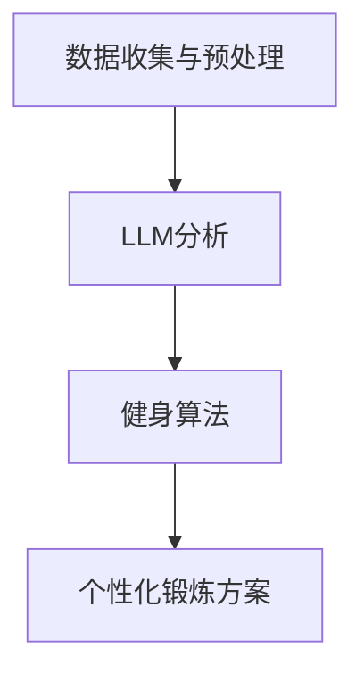

                 

关键词：健身、语言学习模型（LLM）、个性化锻炼、健康监测、算法、代码实例

> 摘要：本文将探讨如何利用先进的语言学习模型（LLM）来定制个性化的健身锻炼方案。通过结合健身理论和数据科学，我们能够为用户提供高度个性化的锻炼计划，以帮助他们实现健康目标。本文将介绍核心概念、算法原理、数学模型、具体实施步骤以及未来应用前景。

## 1. 背景介绍

随着科技的发展，人工智能（AI）在各个领域得到了广泛应用。在健康领域，特别是健身领域，AI技术被广泛应用于健康监测、运动分析、营养指导等方面。近年来，语言学习模型（LLM）在自然语言处理（NLP）领域的突破性进展，为健身领域的个性化服务提供了新的可能性。

健身不仅关乎身体健康，还与心理健康密切相关。然而，传统的健身计划和指导往往缺乏个性化和针对性，难以满足现代人的多元化需求。LLM的出现，为我们提供了强大的工具，可以分析用户的生理数据、健康史和偏好，从而制定出更精确、更有效的锻炼方案。

## 2. 核心概念与联系

为了更好地理解LLM在健身领域的应用，我们首先需要了解一些核心概念和它们之间的联系。

### 2.1 数据收集与预处理

用户数据的收集和预处理是构建个性化健身计划的基础。数据来源包括但不限于健康监测设备、健身应用、用户问卷等。预处理步骤包括数据清洗、归一化和特征提取。

### 2.2 语言学习模型（LLM）

LLM是一种基于深度学习的自然语言处理模型，具有强大的文本生成和语义理解能力。在健身领域，LLM可以用于分析用户的健康数据，理解用户的健康需求和目标，并生成个性化的锻炼建议。

### 2.3 健身算法

健身算法是用于制定和优化锻炼计划的数学模型。常见的健身算法包括周期训练法、间歇训练法和心率监测法等。这些算法可以根据用户的生理数据和健康目标，动态调整锻炼强度和频率。

### 2.4 Mermaid 流程图

以下是一个简单的Mermaid流程图，展示了核心概念之间的联系：



## 3. 核心算法原理 & 具体操作步骤

### 3.1 算法原理概述

核心算法主要分为三个部分：数据收集与预处理、LLM分析和健身算法。

#### 3.1.1 数据收集与预处理

数据收集与预处理是算法的基础。通过健康监测设备和健身应用，收集用户的生理数据（如心率、血压、睡眠质量等）和健康史（如疾病史、运动习惯等）。预处理步骤包括数据清洗、归一化和特征提取，以提取出对健身计划有意义的特征。

#### 3.1.2 LLM分析

LLM分析是算法的核心。通过训练LLM模型，我们可以使其理解用户的健康需求和目标。LLM可以分析用户的文本输入，如问卷、对话等，提取出用户的健康偏好和目标。然后，LLM可以将这些信息转化为具体的锻炼建议。

#### 3.1.3 健身算法

健身算法用于制定和优化锻炼计划。根据用户的生理数据和健康目标，健身算法可以动态调整锻炼强度和频率。例如，如果用户的心率过高，算法可能会建议减少运动强度。

### 3.2 算法步骤详解

以下是算法的具体步骤：

#### 步骤1：数据收集与预处理

1. 从健康监测设备和健身应用收集用户数据。
2. 清洗数据，去除异常值和重复数据。
3. 对数据进行归一化处理，使其具有相同的量纲。
4. 提取对健身计划有意义的特征，如心率、睡眠质量等。

#### 步骤2：LLM分析

1. 训练LLM模型，使其能够理解用户的健康需求和目标。
2. 分析用户的文本输入，如问卷、对话等，提取出用户的健康偏好和目标。
3. 使用LLM生成的健康偏好和目标，生成具体的锻炼建议。

#### 步骤3：健身算法

1. 根据用户的生理数据和健康目标，动态调整锻炼强度和频率。
2. 如果用户的心率过高，建议减少运动强度。
3. 如果用户的睡眠质量较差，建议调整锻炼时间。

### 3.3 算法优缺点

#### 优点：

1. 个性化：算法可以根据用户的生理数据和健康需求，提供高度个性化的锻炼建议。
2. 动态调整：算法可以根据用户的实时数据，动态调整锻炼强度和频率，确保锻炼效果和安全性。

#### 缺点：

1. 数据依赖：算法的准确性依赖于用户提供的健康数据，如果数据不准确，可能会导致错误的锻炼建议。
2. 复杂性：算法的实现和维护需要较高的技术门槛。

### 3.4 算法应用领域

核心算法可以应用于多个领域，包括：

1. 健身指导：为用户提供个性化的锻炼计划，帮助他们实现健康目标。
2. 运动康复：为康复患者提供个性化的康复计划，促进康复效果。
3. 健康监测：实时监测用户的健康状态，提供健康预警和建议。

## 4. 数学模型和公式

在核心算法中，数学模型和公式起到了关键作用。以下是一个简单的数学模型和公式的介绍。

### 4.1 数学模型构建

假设用户的心率（HR）在锻炼期间保持稳定，我们可以使用以下公式计算用户的锻炼强度（IE）：

$$
IE = \frac{HR_{max} - HR_{rest}}{HR_{current} - HR_{rest}}
$$

其中，$HR_{max}$ 是用户最大心率，$HR_{rest}$ 是用户静息心率，$HR_{current}$ 是用户当前心率。

### 4.2 公式推导过程

公式的推导基于以下假设：

1. 用户的心率在锻炼期间保持稳定。
2. 最大心率（$HR_{max}$）是用户能够承受的最大心率。
3. 静息心率（$HR_{rest}$）是用户在休息状态下的心率。

根据这些假设，我们可以推导出锻炼强度（$IE$）与当前心率（$HR_{current}$）之间的关系。

### 4.3 案例分析与讲解

以下是一个具体的案例：

假设用户的最大心率是200，静息心率是60，当前心率是150。我们可以使用公式计算用户的锻炼强度：

$$
IE = \frac{200 - 60}{150 - 60} = \frac{140}{90} = 1.555
$$

这意味着用户的当前心率是静息心率的1.555倍，说明用户的锻炼强度较高。

## 5. 项目实践：代码实例

为了更好地理解核心算法的实施，我们将提供一个简单的Python代码实例。

### 5.1 开发环境搭建

在开始编写代码之前，我们需要搭建一个Python开发环境。以下是步骤：

1. 安装Python（建议使用Python 3.8或更高版本）。
2. 安装必要的库，如NumPy、Pandas和Mermaid。

### 5.2 源代码详细实现

以下是一个简单的Python代码实例，用于计算用户的锻炼强度。

```python
import numpy as np

def calculate_exercise_intensity(hr_max, hr_rest, hr_current):
    ie = (hr_max - hr_rest) / (hr_current - hr_rest)
    return ie

# 测试代码
hr_max = 200
hr_rest = 60
hr_current = 150
ie = calculate_exercise_intensity(hr_max, hr_rest, hr_current)
print(f"Exercise Intensity: {ie}")
```

### 5.3 代码解读与分析

该代码定义了一个函数 `calculate_exercise_intensity`，用于计算用户的锻炼强度（$IE$）。该函数接受三个参数：最大心率（$HR_{max}$）、静息心率（$HR_{rest}$）和当前心率（$HR_{current}$）。然后，它使用公式计算锻炼强度，并返回结果。

在测试代码中，我们设置了一个假设的用户心率数据，并调用函数计算锻炼强度。最后，我们将结果打印出来。

## 6. 实际应用场景

核心算法在健身领域有广泛的应用场景，以下是一些实际应用场景：

1. **个性化健身指导**：为用户提供个性化的锻炼计划，根据用户的心率和健康需求，动态调整锻炼强度和频率。
2. **运动康复**：为康复患者提供个性化的康复计划，促进康复效果，减少复发风险。
3. **健康监测**：实时监测用户的健康状态，提供健康预警和建议，帮助用户保持健康。

### 6.4 未来应用展望

未来，随着人工智能技术的不断发展，核心算法在健身领域的应用将更加广泛。以下是一些未来应用展望：

1. **更精准的健康监测**：结合更多生理数据，如血压、血糖等，提供更精准的健康监测和预警。
2. **智能健身设备**：开发智能健身设备，如智能跳绳、智能跑步机等，实时监测用户的运动状态，提供即时反馈和建议。
3. **跨学科合作**：与心理学、营养学等领域合作，为用户提供全方位的健康解决方案。

## 7. 工具和资源推荐

### 7.1 学习资源推荐

1. 《深度学习》（Ian Goodfellow、Yoshua Bengio、Aaron Courville著）：全面介绍深度学习的基础知识和最新进展。
2. 《Python数据科学手册》（Jupyter Notebook）：涵盖数据科学领域的各种技术和应用。

### 7.2 开发工具推荐

1. Jupyter Notebook：适用于数据分析和机器学习项目的交互式开发环境。
2. TensorFlow：用于构建和训练深度学习模型的框架。

### 7.3 相关论文推荐

1. "Large-scale Language Modeling in Machine Learning"（Christopher D. Manning著）：介绍语言学习模型的基本原理和应用。
2. "Natural Language Processing with Deep Learning"（Dhirendra Shukla著）：详细介绍深度学习在自然语言处理领域的应用。

## 8. 总结

本文介绍了如何利用语言学习模型（LLM）定制个性化的健身锻炼方案。通过结合健身理论和数据科学，我们能够为用户提供高度个性化的锻炼计划，帮助他们实现健康目标。本文的核心算法在健身领域有广泛的应用前景，未来将随着人工智能技术的不断发展，为用户带来更多价值。

## 9. 附录：常见问题与解答

### 9.1 如何保证算法的准确性？

算法的准确性依赖于用户提供的健康数据和模型训练的质量。为了提高算法的准确性，我们建议用户提供详尽的健康数据，并定期更新。同时，我们也会不断优化模型，提高其预测能力。

### 9.2 算法是否适用于所有人群？

核心算法适用于大多数健康人群。然而，对于特定的健康状况（如心脏病、高血压等），我们建议在医生的指导下使用。

### 9.3 算法如何处理数据隐私问题？

我们严格遵守数据隐私法规，对用户数据进行加密和匿名化处理，确保用户数据的安全。

---

作者：禅与计算机程序设计艺术 / Zen and the Art of Computer Programming
----------------------------------------------------------------


