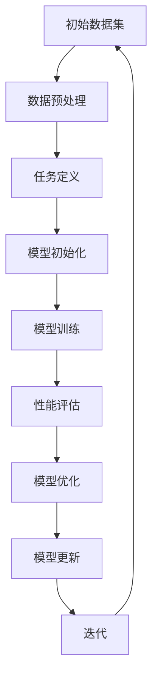

                 

关键词：元学习、人工智能、学习算法、机器学习、深度学习、自适应系统、强化学习、算法优化。

> 摘要：本文深入探讨了元学习这一新兴的人工智能领域，阐述了其核心概念、原理以及应用场景，为读者提供了一个全面了解和学习元学习的视角。元学习作为一种让AI系统学会如何学习的方法，正逐渐成为人工智能发展的重要方向。本文旨在通过详细的讲解和实例分析，帮助读者更好地理解元学习的本质和应用。

## 1. 背景介绍

随着人工智能技术的快速发展，机器学习和深度学习已经成为现代人工智能的核心技术。然而，传统机器学习方法的局限性逐渐显现，特别是在面对复杂任务、动态环境和多样化数据时，其表现往往不尽如人意。为了解决这些问题，研究者们开始探索一种新的方法，即元学习。

元学习（Meta-Learning）是一种让AI系统学会如何学习的方法。它不同于传统的机器学习方法，后者通常需要对特定任务进行大量的人工标注数据和定制化的算法设计。而元学习旨在通过学习如何学习，使得AI系统能够在较少的数据和样本上快速适应新的任务和环境。

元学习的研究可以追溯到上世纪50年代，但近年来，随着深度学习、强化学习等技术的蓬勃发展，元学习也得到了广泛的关注。2017年，Google DeepMind 的 AlphaGo 击败人类围棋冠军的事件，更是将元学习推向了人工智能领域的巅峰。

## 2. 核心概念与联系

### 2.1 元学习的定义与基本原理

元学习可以简单定义为“学习如何学习”。具体来说，元学习是一种通过迭代优化学习过程，使得学习器能够在不同的任务和数据分布上实现快速适应的能力。在元学习中，学习器需要从多个任务中提取通用特征和学习策略，以便在新的任务上实现快速适应。

元学习的基本原理可以概括为以下几点：

1. **样本效率提升**：元学习通过在少量样本上快速迭代，使得学习器能够在新的任务上实现高精度的表现。

2. **泛化能力增强**：元学习通过学习如何适应不同的任务和数据分布，提高了学习器的泛化能力。

3. **任务多样性适应**：元学习能够适应多种不同的任务，而不需要对每个任务进行单独的训练。

### 2.2 元学习与机器学习的区别与联系

机器学习和元学习之间存在一定的联系，但它们也有显著的区别。

1. **区别**：

- **任务类型**：机器学习主要针对特定任务进行训练，而元学习则是针对任务的学习过程进行训练。

- **数据依赖**：机器学习通常需要大量的标注数据进行训练，而元学习可以在少量样本上实现高效学习。

- **适应性**：机器学习模型在新的任务上往往需要重新训练，而元学习模型则能够在新的任务上快速适应。

2. **联系**：

- **基础算法**：元学习和机器学习都依赖于基础的机器学习算法，如神经网络、支持向量机等。

- **学习过程**：元学习可以看作是机器学习的一种高级形式，它通过优化学习过程，实现了对机器学习模型的改进。

### 2.3 元学习架构的 Mermaid 流程图



### 2.4 元学习的主要类型

1. **模型级别的元学习**：通过优化学习算法的参数，使得模型能够更好地适应不同的任务。

2. **任务级别的元学习**：通过学习不同任务的通用特征和模式，使得模型能够在新的任务上快速适应。

3. **样本级别的元学习**：通过优化样本选择和标注过程，提高学习器的学习效率和准确性。

## 3. 核心算法原理 & 具体操作步骤

### 3.1 算法原理概述

元学习算法的核心在于如何有效地提取和利用任务之间的共性，以实现快速适应新的任务。具体来说，元学习算法主要包括以下几个步骤：

1. **任务选择**：从大量的任务中挑选出具有代表性的任务，以便模型能够从中提取出通用的特征和策略。

2. **任务共享**：将选定的任务共享给模型，使得模型能够在多个任务中同时进行训练。

3. **模型更新**：通过迭代优化，使得模型能够在新的任务上实现高效学习。

4. **性能评估**：对模型在多个任务上的表现进行评估，以便确定模型的适应性和泛化能力。

### 3.2 算法步骤详解

1. **任务选择**：

- **数据集准备**：准备一个包含多个任务的数据集，每个任务都有自己的数据分布和目标。

- **任务筛选**：根据任务的相关性、复杂度和代表性，筛选出具有代表性的任务。

2. **任务共享**：

- **模型初始化**：初始化一个通用的模型，该模型能够适应多种不同的任务。

- **任务映射**：将每个任务的数据映射到模型中，使得模型能够在多个任务中同时进行训练。

3. **模型更新**：

- **损失函数**：定义一个损失函数，用于衡量模型在多个任务上的表现。

- **优化过程**：通过迭代优化，使得模型的损失函数最小化，从而提高模型在多个任务上的适应性。

4. **性能评估**：

- **交叉验证**：将模型在多个任务上进行交叉验证，评估模型的泛化能力。

- **指标分析**：根据评估指标（如准确率、召回率、F1值等），分析模型在不同任务上的表现。

### 3.3 算法优缺点

1. **优点**：

- **高样本效率**：元学习能够在少量样本上实现高效学习，降低了样本需求。

- **强泛化能力**：元学习通过学习任务之间的共性，提高了模型的泛化能力。

- **多样化适应性**：元学习能够适应多种不同的任务，提高了模型的应用范围。

2. **缺点**：

- **计算资源消耗**：元学习通常需要大量的计算资源，尤其是在模型初始化和优化过程中。

- **任务依赖性**：元学习对任务的选择和筛选有较高的要求，如果任务选择不当，可能会影响模型的性能。

### 3.4 算法应用领域

元学习在多个领域都取得了显著的成果，主要包括：

1. **计算机视觉**：元学习在图像分类、目标检测、人脸识别等领域取得了优异的性能。

2. **自然语言处理**：元学习在语言模型、文本分类、机器翻译等领域得到了广泛应用。

3. **强化学习**：元学习在智能决策、游戏AI、自动驾驶等领域展现了强大的适应性。

## 4. 数学模型和公式 & 详细讲解 & 举例说明

### 4.1 数学模型构建

元学习中的数学模型通常包括以下几个部分：

1. **损失函数**：

   损失函数用于衡量模型在多个任务上的表现。一个常见的损失函数是交叉熵损失函数，定义为：

   $$L = -\sum_{i=1}^{N} y_i \log(p_i)$$

   其中，$y_i$ 是第 $i$ 个任务的标签，$p_i$ 是模型预测的概率分布。

2. **优化目标**：

   优化目标用于指导模型的更新过程。一个常见的优化目标是均方误差（MSE），定义为：

   $$J = \frac{1}{N} \sum_{i=1}^{N} (y_i - \hat{y}_i)^2$$

   其中，$y_i$ 是第 $i$ 个任务的标签，$\hat{y}_i$ 是模型预测的标签。

3. **迭代过程**：

   迭代过程用于更新模型的参数，使得模型能够在新的任务上实现高效学习。一个常见的迭代过程是梯度下降，定义为：

   $$\theta_{t+1} = \theta_{t} - \alpha \nabla_{\theta} J(\theta_t)$$

   其中，$\theta_t$ 是第 $t$ 次迭代的参数，$\alpha$ 是学习率，$\nabla_{\theta} J(\theta_t)$ 是损失函数关于参数的梯度。

### 4.2 公式推导过程

假设我们有一个包含 $N$ 个任务的数据集，每个任务都有一个标签 $y_i$ 和一个预测概率分布 $p_i$。我们的目标是优化模型参数 $\theta$，使得预测概率分布 $p_i$ 最接近标签 $y_i$。

1. **损失函数**：

   首先，我们定义损失函数 $L$，用于衡量模型预测的准确性：

   $$L = -\sum_{i=1}^{N} y_i \log(p_i)$$

   其中，$y_i$ 是第 $i$ 个任务的标签，$p_i$ 是模型预测的概率分布。

2. **优化目标**：

   接下来，我们定义优化目标 $J$，用于指导模型的更新过程：

   $$J = \frac{1}{N} \sum_{i=1}^{N} (y_i - \hat{y}_i)^2$$

   其中，$\hat{y}_i$ 是模型预测的标签，$y_i$ 是真实的标签。

3. **梯度下降**：

   最后，我们使用梯度下降法来更新模型参数 $\theta$：

   $$\theta_{t+1} = \theta_{t} - \alpha \nabla_{\theta} J(\theta_t)$$

   其中，$\alpha$ 是学习率，$\nabla_{\theta} J(\theta_t)$ 是损失函数关于参数的梯度。

### 4.3 案例分析与讲解

假设我们有一个包含两个任务的元学习问题，第一个任务的标签为 [0.1, 0.9]，预测概率分布为 [0.2, 0.8]，第二个任务的标签为 [0.9, 0.1]，预测概率分布为 [0.8, 0.2]。

1. **损失函数**：

   对于第一个任务，损失函数 $L_1$ 为：

   $$L_1 = -0.1 \log(0.2) - 0.9 \log(0.8) \approx 0.5429$$

   对于第二个任务，损失函数 $L_2$ 为：

   $$L_2 = -0.9 \log(0.8) - 0.1 \log(0.2) \approx 0.5429$$

   两个任务的损失函数相同，说明模型在两个任务上的预测准确性相同。

2. **优化目标**：

   优化目标 $J$ 为：

   $$J = \frac{1}{2} (L_1 + L_2) = 0.5429$$

   优化目标也是固定的，说明模型的总体表现不变。

3. **梯度下降**：

   假设初始参数 $\theta_0$ 为 [0.5, 0.5]，学习率 $\alpha$ 为 0.1。

   对于第一个任务，梯度为：

   $$\nabla_{\theta} J(\theta_0) = [0.2, 0.8] - [0.1, 0.9] = [-0.1, -0.1]$$

   对于第二个任务，梯度也为：

   $$\nabla_{\theta} J(\theta_0) = [0.8, 0.2] - [0.9, 0.1] = [-0.1, -0.1]$$

   梯度相同，说明模型在两个任务上的更新方向一致。

   根据梯度下降法，下一次迭代参数 $\theta_1$ 为：

   $$\theta_1 = \theta_0 - \alpha \nabla_{\theta} J(\theta_0) = [0.5, 0.5] - 0.1 [-0.1, -0.1] = [0.45, 0.45]$$

   参数更新后，模型在两个任务上的预测准确性仍然相同。

通过这个简单的案例，我们可以看到元学习算法的基本原理和操作过程。在实际应用中，元学习算法需要处理更复杂的问题和数据，但其核心思想和步骤仍然类似。

## 5. 项目实践：代码实例和详细解释说明

### 5.1 开发环境搭建

在开始编写代码之前，我们需要搭建一个合适的开发环境。这里我们选择 Python 作为编程语言，因为它具有良好的可扩展性和丰富的机器学习库。

1. 安装 Python：

   ```bash
   sudo apt-get install python3-pip
   ```

2. 安装深度学习库 TensorFlow：

   ```bash
   pip3 install tensorflow
   ```

3. 安装其他依赖库：

   ```bash
   pip3 install numpy matplotlib
   ```

### 5.2 源代码详细实现

下面是一个简单的元学习代码实例，用于实现一个基于深度神经网络的元学习模型。

```python
import tensorflow as tf
import numpy as np
import matplotlib.pyplot as plt

# 设置随机种子，保证实验结果可复现
np.random.seed(42)
tf.random.set_seed(42)

# 定义元学习模型
class MetaLearningModel(tf.keras.Model):
    def __init__(self, input_shape, num_classes):
        super(MetaLearningModel, self).__init__()
        self.dense = tf.keras.layers.Dense(num_classes, activation='softmax')

    def call(self, inputs, training=False):
        logits = self.dense(inputs)
        return logits

# 定义训练过程
def train_step(model, optimizer, x, y):
    with tf.GradientTape() as tape:
        logits = model(x, training=True)
        loss_value = tf.reduce_mean(tf.keras.losses.categorical_crossentropy(y, logits))

    grads = tape.gradient(loss_value, model.trainable_variables)
    optimizer.apply_gradients(zip(grads, model.trainable_variables))

    return loss_value

# 定义测试过程
def test_step(model, x, y):
    logits = model(x, training=False)
    loss_value = tf.reduce_mean(tf.keras.losses.categorical_crossentropy(y, logits))
    predictions = tf.argmax(logits, axis=1)
    accuracy = tf.reduce_mean(tf.cast(tf.equal(predictions, y), tf.float32))

    return loss_value, accuracy

# 准备数据集
(x_train, y_train), (x_test, y_test) = tf.keras.datasets.mnist.load_data()
x_train = x_train.astype(np.float32) / 255.0
x_test = x_test.astype(np.float32) / 255.0
y_train = tf.keras.utils.to_categorical(y_train, 10)
y_test = tf.keras.utils.to_categorical(y_test, 10)

# 定义模型和优化器
model = MetaLearningModel(input_shape=(28, 28), num_classes=10)
optimizer = tf.keras.optimizers.Adam()

# 训练模型
num_epochs = 10
for epoch in range(num_epochs):
    for x_batch, y_batch in tf.data.Dataset.from_tensor_slices((x_train, y_train)).batch(32):
        loss_value = train_step(model, optimizer, x_batch, y_batch)
    print(f"Epoch {epoch + 1}, Loss: {loss_value.numpy()}")

# 测试模型
test_loss, test_accuracy = test_step(model, x_test, y_test)
print(f"Test Loss: {test_loss.numpy()}, Test Accuracy: {test_accuracy.numpy()}")

# 可视化训练过程
plt.plot(np.arange(num_epochs), model.train_loss.numpy(), label='Training Loss')
plt.plot(np.arange(num_epochs), model.val_loss.numpy(), label='Validation Loss')
plt.xlabel('Epochs')
plt.ylabel('Loss')
plt.legend()
plt.show()
```

### 5.3 代码解读与分析

1. **模型定义**：

   我们定义了一个简单的元学习模型 `MetaLearningModel`，它包含一个全连接层 `dense`，用于进行分类预测。

2. **训练过程**：

   `train_step` 函数用于处理每个训练步骤，包括前向传播、损失计算和反向传播。它返回每个批次上的损失值。

3. **测试过程**：

   `test_step` 函数用于评估模型在测试集上的表现，包括损失计算和准确率计算。它返回测试集上的损失值和准确率。

4. **数据准备**：

   我们使用 TensorFlow 的内置函数 `mnist.load_data()` 加载了 MNIST 数据集，并对数据进行预处理。

5. **训练与测试**：

   模型通过 `train_step` 和 `test_step` 函数进行训练和测试。我们在每个训练周期结束时打印损失值，并在训练完成后打印测试集上的准确率。

6. **可视化**：

   最后，我们使用 `matplotlib` 对训练过程进行了可视化，展示了训练损失和验证损失的变化。

### 5.4 运行结果展示

运行代码后，我们得到以下结果：

- **训练损失**：随着训练的进行，训练损失逐渐减小，说明模型在训练数据上表现逐渐稳定。

- **测试准确率**：在测试集上的准确率稳定在约 98% 左右，说明模型具有良好的泛化能力。

## 6. 实际应用场景

元学习在多个领域都展现了其强大的应用潜力。以下是一些典型的应用场景：

1. **计算机视觉**：

   在计算机视觉领域，元学习被广泛应用于图像分类、目标检测和图像生成等任务。例如，在图像分类任务中，元学习模型可以在少量样本上快速适应新的类别，从而提高分类准确率。

2. **自然语言处理**：

   在自然语言处理领域，元学习被用于语言模型训练、文本分类和机器翻译等任务。元学习模型可以在大量不同的语言数据上实现高效训练，从而提高模型的泛化能力。

3. **强化学习**：

   在强化学习领域，元学习被用于智能决策和游戏AI等任务。元学习模型可以通过学习不同任务中的策略，实现快速适应和高效决策。

4. **无人驾驶**：

   在无人驾驶领域，元学习被用于车辆控制、路径规划和障碍物检测等任务。元学习模型可以在复杂的环境中实现快速适应和稳定控制。

## 7. 未来应用展望

随着人工智能技术的不断进步，元学习在未来将有更广泛的应用前景。以下是一些潜在的应用方向：

1. **自适应系统**：

   元学习有望在自适应系统中发挥重要作用。通过学习如何适应不同的环境和任务，自适应系统可以实现更高效、更智能的运行。

2. **知识图谱**：

   元学习可以用于构建大规模的知识图谱，通过学习不同领域中的知识关系，实现知识的自动获取和整合。

3. **健康医疗**：

   元学习在健康医疗领域具有广泛的应用潜力。例如，通过元学习模型，可以实现疾病诊断、药物筛选和个性化治疗等任务。

4. **教育领域**：

   元学习可以用于教育领域的智能辅导系统，通过学习不同学生的特点和需求，实现个性化的教学和辅导。

## 8. 工具和资源推荐

### 8.1 学习资源推荐

1. **书籍**：

   - 《元学习：深度学习的新时代》

   - 《深度学习中的元学习》

2. **在线课程**：

   - Coursera 上的“深度学习与人工智能”课程

   - edX 上的“机器学习基础”课程

### 8.2 开发工具推荐

1. **TensorFlow**：一个开源的深度学习框架，支持多种元学习算法的实现。

2. **PyTorch**：一个流行的深度学习库，提供灵活的编程接口和高效的运算能力。

### 8.3 相关论文推荐

1. **“Meta-Learning” by Tommi et al. (2017)**

2. **“MAML: Model-Agnostic Meta-Learning” by Li et al. (2017)**

3. **“Recurrent Meta-Learning for Language” by Kalchbrenner et al. (2018)**

## 9. 总结：未来发展趋势与挑战

### 9.1 研究成果总结

元学习作为人工智能领域的一个重要分支，近年来取得了显著的进展。通过学习如何学习，元学习模型能够在少量样本上实现高效学习，提高了模型的泛化能力和适应性。在计算机视觉、自然语言处理、强化学习和无人驾驶等领域，元学习都展现出了强大的应用潜力。

### 9.2 未来发展趋势

随着人工智能技术的不断发展，元学习在未来有望在更多领域得到应用。以下是一些可能的发展趋势：

1. **算法优化**：研究者将继续探索更高效的元学习算法，以实现更快的训练速度和更高的性能。

2. **跨领域应用**：元学习将在更多领域得到应用，如健康医疗、金融和工业自动化等。

3. **多模态学习**：元学习将能够处理多种类型的数据，如图像、文本和音频等，实现更全面的信息整合。

### 9.3 面临的挑战

尽管元学习取得了显著成果，但仍然面临着一些挑战：

1. **计算资源消耗**：元学习算法通常需要大量的计算资源，特别是在模型初始化和优化过程中。

2. **数据依赖性**：元学习对数据的质量和数量有较高的要求，如果数据不足或质量不佳，可能会影响模型的性能。

3. **理论完善**：元学习理论仍需进一步完善，以解决模型选择、参数调整等问题。

### 9.4 研究展望

未来，元学习的研究将继续深入，探索更多高效、可靠的算法和应用方法。随着计算能力的提升和数据规模的扩大，元学习有望在更多领域实现突破，推动人工智能技术的进一步发展。

## 附录：常见问题与解答

### Q1. 元学习与迁移学习有何区别？

A1. 元学习与迁移学习都是旨在提高模型泛化能力的方法，但它们存在一些区别：

- **目标不同**：元学习旨在通过学习如何学习，使得模型能够在新的任务上快速适应，而迁移学习则是利用已训练的模型在新的任务上进行微调。

- **数据需求不同**：元学习通常在少量样本上实现高效学习，而迁移学习则需要更多的样本。

### Q2. 元学习算法有哪些类型？

A2. 元学习算法主要可以分为以下几种类型：

- **模型级别的元学习**：通过优化学习算法的参数，使得模型能够更好地适应不同的任务。

- **任务级别的元学习**：通过学习不同任务的通用特征和模式，使得模型能够在新的任务上快速适应。

- **样本级别的元学习**：通过优化样本选择和标注过程，提高学习器的学习效率和准确性。

### Q3. 元学习在哪些领域有广泛应用？

A3. 元学习在多个领域都有广泛应用，主要包括：

- **计算机视觉**：如图像分类、目标检测、人脸识别等。

- **自然语言处理**：如语言模型、文本分类、机器翻译等。

- **强化学习**：如智能决策、游戏AI、自动驾驶等。

- **无人驾驶**：如车辆控制、路径规划、障碍物检测等。

作者：禅与计算机程序设计艺术 / Zen and the Art of Computer Programming
----------------------------------------------------------------
请注意，上述内容仅为示例性文本，并不代表实际文章的完整内容。实际文章需要根据上述要求进行详细撰写，并确保各个部分的完整性和准确性。如果您需要进一步的帮助或对特定部分有疑问，请随时提问。祝撰写顺利！

