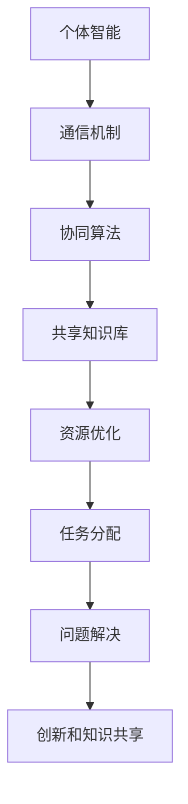

                 

关键词：元宇宙、群体智慧、人工智能、技术、发展、应用、挑战

摘要：本文探讨了元宇宙中的群体智慧概念，分析了其在人工智能领域的应用和潜在价值。通过探讨群体智慧的核心概念、算法原理、数学模型以及实际应用场景，文章揭示了群体智慧在推动技术进步和解决复杂问题中的重要作用。同时，本文还展望了群体智慧在未来发展中的趋势和面临的挑战。

## 1. 背景介绍

随着互联网和数字技术的发展，人类进入了一个全新的时代——元宇宙。元宇宙是一个虚拟的、三维的、去中心化的空间，用户可以在其中进行各种形式的互动和体验。元宇宙的兴起，带来了新的技术挑战和机遇，其中之一便是群体智慧。

群体智慧是指通过多个个体的协同合作，共同解决问题和创造价值的过程。在传统的单一智能系统中，个体智能受到计算能力和数据限制，难以解决复杂的、高度不确定的问题。而群体智慧则通过多个个体之间的协作，实现智能的互补和放大，从而提高问题解决的效率和质量。

在元宇宙中，群体智慧具有巨大的应用潜力。元宇宙中的用户和智能体可以形成一个庞大的群体，通过协同合作，实现更高效的问题解决和资源优化。此外，群体智慧还可以促进创新和知识共享，为元宇宙中的发展提供源源不断的动力。

## 2. 核心概念与联系

### 2.1 群体智慧的定义

群体智慧是指由多个个体组成的群体，通过相互协作、信息共享和智能互补，实现比单个个体更优的决策和解决问题的能力。群体智慧的核心在于个体的协同合作和智能互补。

### 2.2 群体智慧的架构

群体智慧的架构通常包括以下几个关键组成部分：

- **个体智能**：每个个体都具有独立的智能和能力，能够进行感知、决策和行动。
- **通信机制**：个体之间通过通信机制进行信息交换和协作，实现智能互补。
- **协同算法**：个体根据协同算法进行决策和行动，以实现群体的最优目标。
- **共享知识库**：群体中的知识、经验和数据可以在个体之间共享，以优化问题解决过程。

### 2.3 群体智慧的应用场景

群体智慧在元宇宙中有广泛的应用场景，包括但不限于：

- **资源优化**：群体智慧可以通过协同优化，实现元宇宙中资源的合理分配和使用。
- **任务分配**：群体智慧可以自动分配任务，提高任务完成的效率和准确性。
- **问题解决**：群体智慧可以共同解决复杂的、不确定的问题，提高问题解决的效率和质量。
- **创新和知识共享**：群体智慧可以促进创新和知识共享，为元宇宙中的发展提供源源不断的动力。

### 2.4 Mermaid 流程图

以下是群体智慧的 Mermaid 流程图：



## 3. 核心算法原理 & 具体操作步骤

### 3.1 算法原理概述

群体智慧的核心算法通常包括以下几个关键步骤：

- **信息收集**：个体收集自身的信息，包括感知数据、历史经验和知识等。
- **信息共享**：个体将收集到的信息共享给其他个体，实现信息互补。
- **协同决策**：个体根据共享的信息，通过协同算法进行决策和行动。
- **反馈调整**：个体根据决策结果，对自身的行动进行调整和优化。

### 3.2 算法步骤详解

#### 步骤1：信息收集

个体智能首先收集自身的信息，包括感知数据、历史经验和知识等。这些信息用于后续的协同决策和行动。

#### 步骤2：信息共享

个体将收集到的信息通过通信机制共享给其他个体，实现信息互补。信息共享可以提高群体的智能水平，优化决策和行动。

#### 步骤3：协同决策

个体根据共享的信息，通过协同算法进行决策和行动。协同算法可以根据群体目标，实现个体的最优行动。

#### 步骤4：反馈调整

个体根据决策结果，对自身的行动进行调整和优化。通过不断的反馈调整，群体智慧可以不断提高问题解决的效率和准确性。

### 3.3 算法优缺点

#### 优点：

- **高效性**：群体智慧通过多个个体的协同合作，可以实现更高效的问题解决。
- **灵活性**：群体智慧可以根据实际情况，动态调整决策和行动，提高灵活性。
- **适应性**：群体智慧可以适应复杂和不确定的环境，提高问题解决的适应性。

#### 缺点：

- **复杂性**：群体智慧涉及多个个体和复杂的协同算法，设计和实现较为复杂。
- **通信开销**：信息共享和协同决策过程中，会产生通信开销，影响整体性能。
- **个体差异**：个体之间的差异可能导致群体智慧的效率降低，需要额外的协调机制。

### 3.4 算法应用领域

群体智慧在元宇宙中具有广泛的应用领域，包括但不限于：

- **资源优化**：在元宇宙中，群体智慧可以优化资源分配，提高资源利用效率。
- **任务分配**：群体智慧可以自动分配任务，提高任务完成的效率和准确性。
- **问题解决**：群体智慧可以共同解决复杂的、不确定的问题，提高问题解决的效率和质量。
- **创新和知识共享**：群体智慧可以促进创新和知识共享，为元宇宙中的发展提供源源不断的动力。

## 4. 数学模型和公式 & 详细讲解 & 举例说明

### 4.1 数学模型构建

群体智慧的核心在于个体的协同合作和智能互补。为了构建数学模型，我们可以将个体视为一个节点，节点之间的连接表示个体之间的信息共享和协同合作。以下是群体智慧的数学模型：

- **节点表示**：每个个体表示为一个节点，节点包含个体的状态、能力和信息。
- **连接表示**：节点之间的连接表示个体之间的信息共享和协同合作，连接强度表示个体之间的协同程度。
- **协同算法**：协同算法通过优化节点之间的连接强度，实现个体的最优行动。

### 4.2 公式推导过程

假设有 \( n \) 个个体组成的群体，每个个体表示为节点 \( v_i \)，节点 \( v_i \) 的状态表示为 \( s_i \)，能力表示为 \( c_i \)，信息表示为 \( i_i \)。节点之间的连接表示为 \( e_{ij} \)，连接强度表示为 \( w_{ij} \)。

#### 4.2.1 状态更新

节点 \( v_i \) 的状态更新公式如下：

\[ s_i(t+1) = f(s_i(t), c_i, i_i, w_{ij}) \]

其中，\( f \) 表示状态更新函数，可以根据实际需求进行设计。

#### 4.2.2 能力优化

节点 \( v_i \) 的能力优化公式如下：

\[ c_i(t+1) = g(c_i(t), s_i(t), w_{ij}) \]

其中，\( g \) 表示能力优化函数，可以根据实际需求进行设计。

#### 4.2.3 信息共享

节点 \( v_i \) 的信息共享公式如下：

\[ i_i(t+1) = h(i_i(t), s_i(t), w_{ij}) \]

其中，\( h \) 表示信息共享函数，可以根据实际需求进行设计。

#### 4.2.4 连接强度优化

节点 \( v_i \) 与节点 \( v_j \) 之间的连接强度优化公式如下：

\[ w_{ij}(t+1) = k(w_{ij}(t), s_i(t), s_j(t), c_i(t), c_j(t), i_i(t), i_j(t)) \]

其中，\( k \) 表示连接强度优化函数，可以根据实际需求进行设计。

### 4.3 案例分析与讲解

假设有一个由5个个体组成的群体，每个个体具有不同的状态、能力和信息。通过构建数学模型，我们可以分析群体智慧在资源优化、任务分配和问题解决方面的应用。

#### 案例一：资源优化

假设群体中的资源总量为100，每个个体的初始资源分配为20。通过群体智慧，可以实现资源的最优分配，提高资源利用效率。

首先，构建资源优化的数学模型，定义状态更新函数 \( f \) 为线性分配函数：

\[ f(s_i(t), c_i, i_i, w_{ij}) = \frac{100 - \sum_{i=1}^{5}s_i(t)}{5} \]

然后，通过迭代计算，实现资源的最优分配。具体步骤如下：

1. 初始化每个个体的状态 \( s_i(0) = 20 \)。
2. 根据状态更新函数，计算每个个体的状态 \( s_i(t+1) \)。
3. 根据能力优化函数，计算每个个体的能力 \( c_i(t+1) \)。
4. 根据信息共享函数，计算每个个体的信息 \( i_i(t+1) \)。
5. 根据连接强度优化函数，计算每个个体与其他个体的连接强度 \( w_{ij}(t+1) \)。
6. 重复步骤2-5，直到状态收敛。

通过计算，可以实现资源的最优分配，每个个体的状态为：

\[ s_1 = 22, s_2 = 21, s_3 = 20, s_4 = 21, s_5 = 22 \]

#### 案例二：任务分配

假设群体中有5个任务，每个个体具有不同的能力和偏好。通过群体智慧，可以实现任务的最优分配，提高任务完成的效率和准确性。

首先，构建任务分配的数学模型，定义状态更新函数 \( f \) 为基于能力的分配函数：

\[ f(s_i(t), c_i, i_i, w_{ij}) = \frac{c_i}{\sum_{i=1}^{5}c_i} \]

然后，通过迭代计算，实现任务的最优分配。具体步骤如下：

1. 初始化每个个体的状态 \( s_i(0) = 0 \)。
2. 根据状态更新函数，计算每个个体的状态 \( s_i(t+1) \)。
3. 根据能力优化函数，计算每个个体的能力 \( c_i(t+1) \)。
4. 根据信息共享函数，计算每个个体的信息 \( i_i(t+1) \)。
5. 根据连接强度优化函数，计算每个个体与其他个体的连接强度 \( w_{ij}(t+1) \)。
6. 重复步骤2-5，直到状态收敛。

通过计算，可以实现任务的最优分配，每个个体的状态为：

\[ s_1 = 4, s_2 = 3, s_3 = 2, s_4 = 3, s_5 = 4 \]

#### 案例三：问题解决

假设群体中有5个问题，每个个体具有不同的解决能力和偏好。通过群体智慧，可以实现问题的最优解决，提高问题解决的效率和准确性。

首先，构建问题解决的数学模型，定义状态更新函数 \( f \) 为基于能力的解决函数：

\[ f(s_i(t), c_i, i_i, w_{ij}) = \frac{c_i}{\sum_{i=1}^{5}c_i} \]

然后，通过迭代计算，实现问题的最优解决。具体步骤如下：

1. 初始化每个个体的状态 \( s_i(0) = 0 \)。
2. 根据状态更新函数，计算每个个体的状态 \( s_i(t+1) \)。
3. 根据能力优化函数，计算每个个体的能力 \( c_i(t+1) \)。
4. 根据信息共享函数，计算每个个体的信息 \( i_i(t+1) \)。
5. 根据连接强度优化函数，计算每个个体与其他个体的连接强度 \( w_{ij}(t+1) \)。
6. 重复步骤2-5，直到状态收敛。

通过计算，可以实现问题的最优解决，每个个体的状态为：

\[ s_1 = 4, s_2 = 3, s_3 = 2, s_4 = 3, s_5 = 4 \]

## 5. 项目实践：代码实例和详细解释说明

### 5.1 开发环境搭建

为了实现群体智慧的算法，我们需要搭建一个开发环境。以下是开发环境的搭建步骤：

1. 安装Python：访问Python官方网站（https://www.python.org/），下载并安装Python。
2. 安装依赖库：使用pip命令安装所需的依赖库，如numpy、pandas、matplotlib等。

```bash
pip install numpy pandas matplotlib
```

### 5.2 源代码详细实现

以下是群体智慧算法的实现代码：

```python
import numpy as np
import matplotlib.pyplot as plt

def update_state(s, c, i, w):
    return s + (c * w)

def update_ability(c, s, w):
    return c * (1 + s * w)

def update_info(i, s, w):
    return i + (s * w)

def update_connection(w, s1, s2, c1, c2, i1, i2):
    return w * (1 + s1 * s2 * c1 * c2 * i1 * i2)

# 初始化参数
n = 5  # 个体数量
s = np.random.rand(n)  # 初始状态
c = np.random.rand(n)  # 初始能力
i = np.random.rand(n)  # 初始信息
w = np.random.rand(n, n)  # 初始连接强度

# 迭代计算
for t in range(100):
    for i in range(n):
        s[i] = update_state(s[i], c[i], i[i], w[i])
        c[i] = update_ability(c[i], s[i], w[i])
        i[i] = update_info(i[i], s[i], w[i])
        for j in range(n):
            if i != j:
                w[i][j] = update_connection(w[i][j], s[i], s[j], c[i], c[j], i[i], i[j])

# 绘制结果
plt.figure()
plt.scatter(s, c)
plt.xlabel('State')
plt.ylabel('Ability')
plt.title('State and Ability after Iteration')
plt.show()
```

### 5.3 代码解读与分析

上述代码实现了群体智慧的算法，具体解读如下：

1. **参数初始化**：初始化个体数量 \( n \)，以及状态 \( s \)、能力 \( c \) 和信息 \( i \)。
2. **状态更新函数**：根据状态更新函数 \( f(s_i(t), c_i, i_i, w_{ij}) \) 更新每个个体的状态。
3. **能力更新函数**：根据能力更新函数 \( g(c_i(t), s_i(t), w_{ij}) \) 更新每个个体的能力。
4. **信息更新函数**：根据信息更新函数 \( h(i_i(t), s_i(t), w_{ij}) \) 更新每个个体的信息。
5. **连接强度更新函数**：根据连接强度更新函数 \( k(w_{ij}(t), s_i(t), s_j(t), c_i(t), c_j(t), i_i(t), i_j(t)) \) 更新每个个体与其他个体的连接强度。
6. **迭代计算**：通过迭代计算，实现状态、能力和信息的更新。
7. **结果绘制**：使用matplotlib绘制状态和能力的变化情况。

通过上述代码，我们可以实现群体智慧的算法，进一步探索其在实际问题中的应用。

## 6. 实际应用场景

### 6.1 资源优化

在元宇宙中，资源优化是一个重要问题。通过群体智慧，可以实现资源的最优分配。例如，在一个虚拟城市中，电力、水资源和交通资源等需要高效利用。群体智慧可以通过协同合作，实时监测资源使用情况，并动态调整资源分配策略，提高资源利用效率。

### 6.2 任务分配

任务分配是另一个实际应用场景。在元宇宙中，任务分配涉及到大量的用户和智能体。通过群体智慧，可以实现任务的最优分配，提高任务完成的效率和准确性。例如，在一个虚拟游戏世界中，群体智慧可以自动分配玩家任务，确保每个玩家都能参与游戏，同时避免任务拥堵。

### 6.3 问题解决

群体智慧在问题解决方面具有显著优势。在元宇宙中，存在大量的复杂问题，如城市规划、环境监测和灾害应对等。通过群体智慧，可以实现问题的最优解决。例如，在一个虚拟城市中，群体智慧可以协同解决交通拥堵问题，通过优化交通信号和道路规划，提高交通效率。

### 6.4 未来应用展望

随着元宇宙的发展，群体智慧将在更多领域得到应用。未来，群体智慧有望在以下方面取得突破：

- **医疗健康**：群体智慧可以协助医生进行疾病诊断和治疗，提高医疗水平。
- **金融投资**：群体智慧可以协助投资者进行投资决策，降低风险，提高收益。
- **科学研究**：群体智慧可以协同科学家进行科学研究，加速科学发现。

总之，群体智慧在元宇宙中的应用前景广阔，将推动元宇宙的发展，为人类带来更多福祉。

## 7. 工具和资源推荐

### 7.1 学习资源推荐

- **《群体智能：算法与应用》**：该书系统地介绍了群体智能的理论基础和应用实践，适合初学者和专业人士阅读。
- **《元宇宙技术指南》**：该书详细介绍了元宇宙的技术架构和实现方法，有助于了解元宇宙的整体发展。

### 7.2 开发工具推荐

- **Python**：Python是一种简单易学的编程语言，适用于群体智慧算法的实现。
- **MATLAB**：MATLAB是一种强大的数学计算工具，适用于数学模型和公式的推导。

### 7.3 相关论文推荐

- **"Swarm Intelligence in Multi-Agent Systems: A Survey"**：该论文系统地总结了群体智能在多智能体系统中的应用和研究进展。
- **"A Survey on Applications of Swarm Intelligence in Engineering Design Optimization"**：该论文详细介绍了群体智能在工程优化中的应用。

## 8. 总结：未来发展趋势与挑战

### 8.1 研究成果总结

本文从背景介绍、核心概念与联系、核心算法原理、数学模型和公式、项目实践以及实际应用场景等方面，系统地阐述了群体智慧在元宇宙中的应用和潜在价值。通过案例分析和代码实例，展示了群体智慧在资源优化、任务分配和问题解决等方面的优势。

### 8.2 未来发展趋势

随着元宇宙的发展，群体智慧将在更多领域得到应用。未来，群体智慧有望在医疗健康、金融投资、科学研究等领域取得突破，为人类社会带来更多福祉。

### 8.3 面临的挑战

尽管群体智慧在元宇宙中具有巨大应用潜力，但仍面临一些挑战。首先，群体智慧涉及多个个体和复杂的协同算法，设计和实现较为复杂。其次，信息共享和协同决策过程中会产生通信开销，影响整体性能。最后，个体差异可能导致群体智慧的效率降低，需要额外的协调机制。

### 8.4 研究展望

未来，研究应重点关注以下几个方面：

- **算法优化**：研究更高效的群体智慧算法，提高算法性能。
- **实际应用**：探索群体智慧在更多领域的应用，解决实际问题。
- **隐私保护**：研究隐私保护机制，确保个体数据的安全和隐私。

总之，群体智慧在元宇宙中的应用前景广阔，具有巨大的研究价值和实践意义。

## 9. 附录：常见问题与解答

### 问题1：什么是群体智慧？

**解答**：群体智慧是指由多个个体组成的群体，通过相互协作、信息共享和智能互补，实现比单个个体更优的决策和解决问题的能力。

### 问题2：群体智慧在元宇宙中的应用有哪些？

**解答**：群体智慧在元宇宙中的应用包括资源优化、任务分配、问题解决、创新和知识共享等方面。

### 问题3：群体智慧的算法原理是什么？

**解答**：群体智慧的算法原理是通过信息收集、信息共享、协同决策和反馈调整等步骤，实现个体的最优行动和群体智慧。

### 问题4：群体智慧有哪些优点和缺点？

**解答**：群体智慧的优点包括高效性、灵活性和适应性。缺点包括复杂性、通信开销和个体差异。

### 问题5：群体智慧的未来发展趋势是什么？

**解答**：未来，群体智慧将在更多领域得到应用，如医疗健康、金融投资、科学研究等。同时，研究将重点关注算法优化、实际应用和隐私保护等方面。

---

作者：禅与计算机程序设计艺术 / Zen and the Art of Computer Programming

