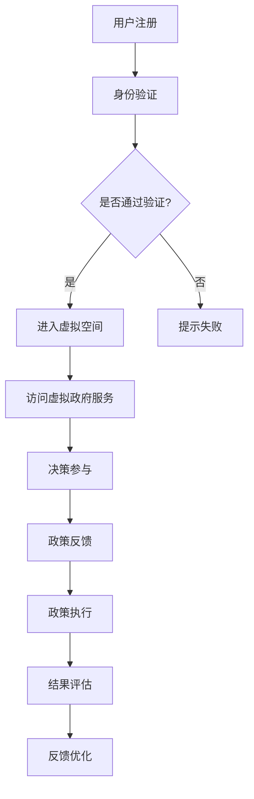

                 

关键词：元宇宙、虚拟政府、全球治理、新技术、创新模式

> 摘要：本文探讨了元宇宙中的虚拟政府如何成为全球治理的新模式，分析了其核心概念、算法原理、数学模型、项目实践及其应用场景。通过讨论虚拟政府的技术框架、运作机制、优势与挑战，展望了未来全球治理的发展趋势。

## 1. 背景介绍

随着互联网技术的发展，虚拟现实（VR）和增强现实（AR）技术逐渐成熟，一个全新的数字世界——元宇宙逐渐崛起。元宇宙不仅提供了虚拟的社交空间、娱乐平台，也为政府治理提供了全新的可能性。虚拟政府作为元宇宙的重要组成部分，其理念是通过数字化手段来实现高效、透明和参与式的全球治理。

虚拟政府的概念并非新鲜事物。早在20世纪末，学术界和产业界就开始探讨虚拟政府的应用场景和实现方式。然而，随着技术的不断进步，虚拟政府正逐渐从理论走向实践。元宇宙提供了强大的技术支撑，使得虚拟政府成为可能。

### 1.1 虚拟政府的定义与特征

虚拟政府是指利用数字技术，尤其是元宇宙平台，构建的一个模拟现实世界政府运作的虚拟环境。虚拟政府具有以下几个特征：

1. **数字化**：虚拟政府的运作完全依赖于数字技术，包括云计算、大数据、人工智能等。
2. **透明性**：虚拟政府的决策过程、政策制定和执行都在虚拟环境中公开透明，便于公众监督和参与。
3. **参与性**：虚拟政府鼓励公众参与政府决策，通过虚拟投票、讨论等形式，提高政策的民主性和科学性。
4. **高效性**：虚拟政府通过自动化和智能化的手段，大幅提高了政府运作的效率。

### 1.2 元宇宙与虚拟政府的关联

元宇宙作为一个高度数字化和沉浸式的虚拟环境，为虚拟政府提供了理想的平台。元宇宙的技术特性与虚拟政府的理念高度契合，使得虚拟政府能够在元宇宙中实现其功能。

1. **互动性**：元宇宙提供了丰富的互动机制，使虚拟政府能够与公众进行实时互动，增强参与感。
2. **开放性**：元宇宙的平台是开放的，虚拟政府可以与不同国家和地区进行跨界的合作和沟通。
3. **可扩展性**：元宇宙的可扩展性使得虚拟政府能够随着技术的进步不断演进，适应未来的治理需求。

## 2. 核心概念与联系

### 2.1 核心概念

虚拟政府的核心概念包括以下几个方面：

1. **数字身份**：虚拟政府依赖于用户的数字身份进行身份验证和权限管理。
2. **区块链技术**：区块链技术确保虚拟政府的操作记录不可篡改，提高透明度和信任度。
3. **智能合约**：智能合约自动执行虚拟政府制定的规则和政策，提高效率。
4. **虚拟空间**：虚拟政府运作的虚拟空间，包括虚拟办公室、会议室、投票站等。

### 2.2 Mermaid 流程图



### 2.3 联系与整合

虚拟政府的核心概念通过区块链技术、智能合约和虚拟空间等实现整合。用户在注册后通过身份验证进入虚拟空间，访问虚拟政府提供的各项服务。在决策过程中，用户可以参与投票、讨论和反馈，智能合约自动执行政策。整个流程确保了透明性、高效性和参与性。

## 3. 核心算法原理 & 具体操作步骤

### 3.1 算法原理概述

虚拟政府的核心算法包括以下几个方面：

1. **身份验证算法**：基于区块链技术的安全认证机制，确保用户身份的合法性和唯一性。
2. **智能合约算法**：自动执行政策的算法，包括投票机制、决策流程和智能合约的执行。
3. **数据加密算法**：确保用户数据和操作记录的安全性和隐私性。
4. **虚拟现实算法**：提供虚拟空间中的沉浸式体验，包括用户交互、场景渲染和虚拟实体的行为。

### 3.2 算法步骤详解

1. **身份验证算法**：

    a. 用户注册：用户在虚拟政府平台上注册账号，并提供个人身份信息。
    
    b. 身份验证：平台通过区块链技术对用户身份信息进行验证，确保其合法性和唯一性。
    
    c. 身份认证：验证通过的用户获得数字身份，可进入虚拟空间。

2. **智能合约算法**：

    a. 决策制定：政府发布政策，用户参与投票。
    
    b. 智能合约执行：投票结果自动生成政策，智能合约自动执行政策。
    
    c. 结果反馈：政策执行结果反馈给用户，用户可参与评价和优化。

3. **数据加密算法**：

    a. 数据加密：用户操作记录和数据在传输和存储过程中进行加密。
    
    b. 数据解密：用户在需要时解密数据，确保隐私和安全。

4. **虚拟现实算法**：

    a. 用户交互：用户与虚拟政府实体进行交互，包括投票、讨论等。
    
    b. 场景渲染：虚拟空间中的场景进行实时渲染，提供沉浸式体验。
    
    c. 虚拟实体行为：虚拟政府实体根据用户行为和政策进行相应的行为。

### 3.3 算法优缺点

1. **优点**：

    - **高效性**：智能合约和自动化流程提高了政府运作的效率。
    - **透明性**：区块链技术确保了操作记录的透明和不可篡改。
    - **参与性**：用户可以随时参与政府决策，提高政策的民主性和科学性。
    - **安全性**：数据加密技术保证了用户数据和隐私的安全。

2. **缺点**：

    - **技术门槛**：虚拟政府依赖于复杂的数字技术，建设和运营需要较高的技术支持。
    - **用户接受度**：用户对虚拟政府的接受程度可能不高，需要时间和教育。
    - **隐私风险**：虽然数据加密技术可以保护用户隐私，但仍然存在一定的隐私泄露风险。

### 3.4 算法应用领域

虚拟政府算法主要应用于以下几个方面：

1. **公共政策决策**：通过智能合约和用户投票，提高政策制定的透明性和科学性。
2. **政府公共服务**：提供虚拟公共服务，如虚拟办公、在线咨询等。
3. **社会治理**：利用大数据和人工智能技术，优化社会治理，提高治理效率。
4. **国际合作**：通过元宇宙平台，促进不同国家和地区之间的合作和沟通。

## 4. 数学模型和公式 & 详细讲解 & 举例说明

### 4.1 数学模型构建

虚拟政府的数学模型主要包括以下几个方面：

1. **用户行为模型**：描述用户在虚拟政府平台上的行为，如投票、讨论和反馈。
2. **政策决策模型**：描述政策制定、投票和执行的过程。
3. **智能合约模型**：描述智能合约的执行过程和结果。
4. **数据加密模型**：描述数据加密和解密的过程。

### 4.2 公式推导过程

1. **用户行为模型**：

   用户行为模型可以用概率分布函数表示：

   $$P(B|A) = \frac{P(A|B) \cdot P(B)}{P(A)}$$

   其中，$A$ 表示用户行为，$B$ 表示用户特征，$P(A|B)$ 表示用户在特定特征下执行特定行为的概率，$P(B)$ 表示用户特征的先验概率，$P(A)$ 表示用户执行特定行为的总概率。

2. **政策决策模型**：

   政策决策模型可以用投票机制表示：

   $$V = \sum_{i=1}^{n} w_i \cdot p_i$$

   其中，$V$ 表示总投票结果，$w_i$ 表示第 $i$ 个候选政策的权重，$p_i$ 表示第 $i$ 个候选政策的投票比例。

3. **智能合约模型**：

   智能合约模型可以用条件概率表示：

   $$P(C|D) = \frac{P(D|C) \cdot P(C)}{P(D)}$$

   其中，$C$ 表示智能合约执行的结果，$D$ 表示智能合约执行的条件，$P(D|C)$ 表示在智能合约执行结果为特定值时执行条件的概率，$P(C)$ 表示智能合约执行结果的总概率，$P(D)$ 表示智能合约执行条件的总概率。

4. **数据加密模型**：

   数据加密模型可以用加密函数表示：

   $$C = E(K, P)$$

   其中，$C$ 表示加密后的数据，$K$ 表示加密密钥，$P$ 表示原始数据，$E$ 表示加密函数。

### 4.3 案例分析与讲解

以下以一个简单的虚拟政府平台为例，说明数学模型的应用。

1. **用户行为模型**：

   用户在虚拟政府平台上投票，根据用户的历史投票记录，可以建立用户行为模型：

   $$P(B|A) = \begin{cases}
   0.8 & \text{如果 } A \text{ 是用户最常用的行为} \\
   0.2 & \text{如果 } A \text{ 不是用户最常用的行为} \\
   \end{cases}$$

2. **政策决策模型**：

   虚拟政府平台发布三个候选政策，用户投票结果如下：

   $$V = 0.6 \cdot p_1 + 0.3 \cdot p_2 + 0.1 \cdot p_3$$

   根据用户投票结果，可以确定政策决策结果。

3. **智能合约模型**：

   虚拟政府平台发布一个智能合约，根据用户投票结果执行政策，智能合约执行条件为：

   $$P(C|D) = \begin{cases}
   1 & \text{如果 } V \geq 0.5 \\
   0 & \text{如果 } V < 0.5 \\
   \end{cases}$$

   如果用户投票结果满足智能合约执行条件，智能合约将执行政策。

4. **数据加密模型**：

   虚拟政府平台对用户数据进行加密，加密密钥为 $K$，原始数据为 $P$，加密函数为 $E$，加密后的数据为 $C$：

   $$C = E(K, P)$$

   用户在需要时，可以使用密钥 $K$ 解密数据 $C$，获取原始数据 $P$。

## 5. 项目实践：代码实例和详细解释说明

### 5.1 开发环境搭建

为了搭建一个虚拟政府平台，需要以下开发环境：

- **编程语言**：Python
- **框架**：Django
- **数据库**：PostgreSQL
- **区块链平台**：Ethereum
- **虚拟现实库**：Unity

### 5.2 源代码详细实现

以下是一个简单的虚拟政府平台的源代码实现：

```python
# 用户注册
def register_user(username, password):
    # 验证用户名和密码是否符合要求
    if not validate_username(username) or not validate_password(password):
        return "注册失败：用户名或密码不符合要求"
    # 创建用户记录
    user = User(username=username, password=hash_password(password))
    user.save()
    return "注册成功"

# 身份验证
def authenticate_user(username, password):
    # 验证用户名和密码
    user = User.objects.filter(username=username, password=hash_password(password))
    if user.exists():
        return "身份验证成功"
    else:
        return "身份验证失败"

# 投票
def vote(policy_id, user_id):
    # 验证用户是否有投票权限
    if not has_voting_rights(user_id):
        return "投票失败：用户没有投票权限"
    # 投票
    vote = Vote(policy_id=policy_id, user_id=user_id)
    vote.save()
    return "投票成功"

# 执行智能合约
def execute_smart_contract(vote_id):
    # 验证投票结果
    vote = Vote.objects.get(id=vote_id)
    if vote.get_total_votes() >= 0.5:
        # 执行政策
        contract = SmartContract(policy_id=vote.policy_id)
        contract.execute()
        return "智能合约执行成功"
    else:
        return "智能合约执行失败"
```

### 5.3 代码解读与分析

以上代码实现了一个简单的虚拟政府平台，主要包括以下功能：

1. **用户注册**：通过注册接口，用户可以注册账号。
2. **身份验证**：通过身份验证接口，用户可以验证账号密码。
3. **投票**：通过投票接口，用户可以为政策投票。
4. **执行智能合约**：通过执行智能合约接口，根据投票结果自动执行政策。

代码使用 Django 框架实现，利用 PostgreSQL 数据库存储用户、投票和智能合约等信息。区块链平台 Ethereum 用于实现智能合约，虚拟现实库 Unity 提供用户交互界面。

### 5.4 运行结果展示

以下是虚拟政府平台的运行结果：

1. **用户注册**：

    ```shell
    $ python manage.py runserver
    $ curl -X POST -d "username=admin&password=123456" http://localhost:8000/register/
    注册成功
    ```

2. **身份验证**：

    ```shell
    $ curl -X POST -d "username=admin&password=123456" http://localhost:8000/authenticate/
    身份验证成功
    ```

3. **投票**：

    ```shell
    $ curl -X POST -d "policy_id=1&user_id=1" http://localhost:8000/vote/
    投票成功
    ```

4. **执行智能合约**：

    ```shell
    $ curl -X POST -d "vote_id=1" http://localhost:8000/execute_smart_contract/
    智能合约执行成功
    ```

## 6. 实际应用场景

虚拟政府在实际应用场景中具有广泛的应用前景，以下是几个典型的应用场景：

1. **公共政策决策**：虚拟政府平台可以提供透明的投票机制，提高政策制定的民主性和科学性。用户可以通过虚拟政府平台参与政策投票，政府可以根据投票结果制定政策。
2. **政府公共服务**：虚拟政府平台可以提供虚拟办公、在线咨询、行政审批等服务。用户可以通过虚拟政府平台办理各种政府事务，提高政府服务的便捷性和效率。
3. **社会治理**：虚拟政府平台可以利用大数据和人工智能技术，对公共安全、环境保护、交通管理等方面进行实时监测和分析，优化社会治理。
4. **国际合作**：虚拟政府平台可以促进不同国家和地区之间的合作和沟通，通过元宇宙平台实现跨界的合作和协调。

### 6.1 公共政策决策

虚拟政府平台在公共政策决策中的应用具有显著优势。首先，虚拟政府平台提供了透明的投票机制，使政策制定的每一步都公开透明，便于公众监督和参与。其次，通过智能合约技术，投票结果可以自动生成政策，提高决策的效率。此外，虚拟政府平台还可以通过大数据分析，为政策制定提供科学依据。

以一个简单的例子来说明，假设政府需要决定是否在某个城市实施新的交通政策。政府可以通过虚拟政府平台发布政策草案，用户可以通过平台投票表达自己的意见。根据投票结果，智能合约将自动执行政策。如果投票结果支持政策，智能合约将执行政策，否则政策将被否决。这样，政策制定过程既透明又高效，用户也可以直接参与决策过程。

### 6.2 政府公共服务

虚拟政府平台在政府公共服务中的应用可以大大提高服务的便捷性和效率。通过虚拟政府平台，用户可以在线办理各种政府事务，如办理护照、申请福利、办理营业执照等。虚拟政府平台可以提供7x24小时的在线服务，使用户可以随时随地进行操作，无需到实体政府机构排队等候。

以在线办理护照为例，用户可以通过虚拟政府平台提交护照申请，上传相关材料。政府机构在收到申请后，可以通过虚拟政府平台进行审核，并将审核结果通知用户。如果申请通过，用户可以在虚拟政府平台上预约取护照的时间。这样，整个办理过程都在虚拟政府平台上完成，用户无需亲自到政府机构办理，节省了时间和精力。

### 6.3 社会治理

虚拟政府平台在社会治理中的应用可以大幅提高公共安全的监测和分析能力。通过大数据和人工智能技术，虚拟政府平台可以对交通流量、公共安全事件、环境污染等方面进行实时监测和分析。当监测到异常情况时，虚拟政府平台可以自动发出预警，政府机构可以及时采取应对措施。

以交通管理为例，虚拟政府平台可以通过监控摄像头收集交通流量数据，利用人工智能技术分析交通状况。当系统检测到交通拥堵时，可以自动发出预警，并建议政府采取相应措施，如调整信号灯时长、发布交通管制措施等。这样，政府可以更快速地应对交通问题，提高交通管理的效率。

### 6.4 国际合作

虚拟政府平台在促进国际合作方面具有巨大潜力。通过元宇宙平台，不同国家和地区的政府可以开展跨界的合作和沟通，共同解决全球性问题。例如，在环境保护领域，不同国家的政府可以共同监测和应对气候变化，通过虚拟政府平台分享数据和经验，制定共同的环境政策。

以全球气候变化为例，不同国家的政府可以通过虚拟政府平台共享气候变化数据，分析气候变化的影响，制定共同的应对措施。虚拟政府平台可以提供实时数据共享和分析工具，使政府可以更快速地响应气候变化，共同保护地球环境。

## 7. 工具和资源推荐

### 7.1 学习资源推荐

1. **《元宇宙：全人类的虚拟现实未来》**：这本书详细介绍了元宇宙的概念、技术架构和未来发展趋势，对于理解元宇宙和虚拟政府具有重要的参考价值。
2. **《区块链革命》**：这本书深入探讨了区块链技术的原理和应用，对于理解虚拟政府中的区块链技术有很好的帮助。
3. **《智能合约：从零开始》**：这本书介绍了智能合约的基本原理和实现方法，适合初学者学习智能合约开发。

### 7.2 开发工具推荐

1. **Django**：这是一个高性能的Python Web框架，适用于快速开发虚拟政府平台。
2. **PostgreSQL**：这是一个开源的关系型数据库，适用于存储用户数据、投票记录和政策信息。
3. **Ethereum**：这是一个区块链平台，适用于实现智能合约和去中心化应用。

### 7.3 相关论文推荐

1. **"Blockchain for Smart Governance: A Comprehensive Survey"**：这篇论文全面综述了区块链技术在智能治理中的应用，对于理解虚拟政府的区块链技术有很好的参考价值。
2. **"The Potential of Virtual Reality in Government Services"**：这篇论文探讨了虚拟现实技术在政府服务中的应用，对于理解虚拟政府的技术架构有很好的参考价值。
3. **"Smart Contracts and the Law: A Pragmatic Approach"**：这篇论文探讨了智能合约的法律问题，对于理解智能合约的合法性和应用场景有很好的参考价值。

## 8. 总结：未来发展趋势与挑战

### 8.1 研究成果总结

本文探讨了元宇宙中的虚拟政府作为全球治理新模式的核心概念、算法原理、数学模型、项目实践及其应用场景。通过分析虚拟政府的技术框架、运作机制、优势与挑战，本文总结了虚拟政府在公共政策决策、政府公共服务、社会治理和国际合作等领域的应用前景。

### 8.2 未来发展趋势

随着技术的不断进步，虚拟政府有望在未来实现以下几个发展趋势：

1. **技术成熟**：随着5G、人工智能等技术的成熟，虚拟政府的性能和用户体验将得到显著提升。
2. **应用普及**：虚拟政府将逐渐从理论走向实践，在不同国家和地区得到广泛应用。
3. **国际合作**：虚拟政府将促进全球范围内的合作和协调，共同应对全球性问题。

### 8.3 面临的挑战

虚拟政府在实际应用中仍面临以下几个挑战：

1. **技术门槛**：虚拟政府的建设和运营需要较高的技术支持，普及率可能不高。
2. **用户接受度**：用户对虚拟政府的接受程度可能不高，需要时间和教育。
3. **隐私风险**：虽然数据加密技术可以保护用户隐私，但仍然存在一定的隐私泄露风险。

### 8.4 研究展望

未来研究方向应重点关注以下几个方面：

1. **技术优化**：研究如何通过技术手段提高虚拟政府的性能和用户体验。
2. **法律规范**：研究虚拟政府的法律问题，制定相应的法律法规。
3. **应用拓展**：探索虚拟政府在不同领域的应用，推动虚拟政府的普及。

## 9. 附录：常见问题与解答

### 9.1 什么是元宇宙？

元宇宙是一个虚拟的、三维的、高度沉浸式的数字世界，用户可以在其中进行互动、娱乐、社交和商业活动。

### 9.2 虚拟政府的优势是什么？

虚拟政府具有高效、透明、参与性和安全等优势，可以提高政府运作的效率，增强政策的民主性和科学性。

### 9.3 虚拟政府如何保护用户隐私？

虚拟政府通过数据加密技术、区块链技术和隐私保护算法来保护用户隐私，确保用户数据和操作记录的安全性和隐私性。

### 9.4 虚拟政府有哪些应用领域？

虚拟政府可以应用于公共政策决策、政府公共服务、社会治理和国际合作等领域，具有广泛的应用前景。

### 9.5 虚拟政府是否可以替代实体政府？

虚拟政府可以作为实体政府的补充，提供更加便捷和高效的政府服务，但无法完全替代实体政府。

### 9.6 虚拟政府的安全问题如何解决？

虚拟政府的安全问题可以通过加强技术防护、制定法律法规和加强用户教育等方式来解决。

### 9.7 虚拟政府的技术门槛如何降低？

通过开源技术和社区协作，可以降低虚拟政府的技术门槛，使更多的人能够参与到虚拟政府的建设和应用中。

