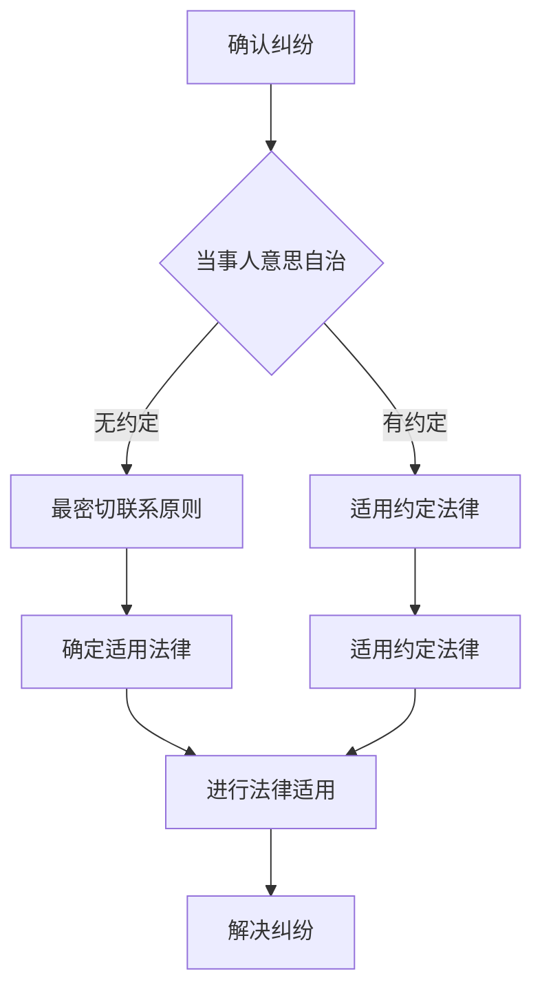

                 

## 1. 背景介绍

随着互联网和技术的飞速发展，虚拟世界——“元宇宙”逐渐成为人们生活的重要组成部分。元宇宙不仅仅是一个虚拟空间，它包含了现实世界中的一切，包括社交、购物、教育、娱乐等各个方面。随着元宇宙的发展，虚拟纠纷也随之增加，特别是在跨国界的情况下，如何公正、公平地解决这些纠纷成为一个迫切需要解决的问题。

跨国虚拟纠纷的产生主要有以下几个原因：

1. **用户流动性**：随着人们在不同国家和地区的频繁流动，他们在元宇宙中的活动也跨越了国界，这就导致了跨国虚拟纠纷的出现。
2. **虚拟财产**：在元宇宙中，虚拟财产（如虚拟货币、虚拟商品、虚拟房产等）越来越具有实际价值，这引发了关于所有权、交易等问题的纠纷。
3. **技术差异**：不同国家在技术标准和法规上的差异，使得在处理跨国虚拟纠纷时存在一定的困难。
4. **法律空白**：虽然许多国家已经开始关注元宇宙和虚拟纠纷问题，但相关法律法规仍处于不断完善中，存在一定的法律空白。

本文旨在探讨跨国虚拟纠纷的法律适用规则，为解决这些问题提供一些可行的解决方案。

## 2. 核心概念与联系

### 2.1 元宇宙概述

元宇宙（Metaverse）是一个由虚拟现实、增强现实、物联网等技术构建的虚拟世界，用户可以在其中以数字化的形式进行互动和活动。元宇宙具有以下几个核心特点：

1. **虚拟现实**：用户通过虚拟现实设备（如VR头盔、AR眼镜等）进入元宇宙，感受到身临其境的体验。
2. **数字化身份**：用户在元宇宙中拥有一个数字化身份，可以用来进行各种社交、交易等活动。
3. **跨平台互操作性**：元宇宙中的不同平台和应用可以相互连接，实现数据的共享和互通。
4. **经济活动**：元宇宙中存在着丰富的经济活动，如虚拟商品交易、虚拟房地产买卖等。

### 2.2 虚拟纠纷定义

虚拟纠纷是指在元宇宙中发生的各种法律纠纷，包括但不限于：

1. **知识产权纠纷**：涉及虚拟商品、虚拟服务等的版权、商标、专利等问题。
2. **财产纠纷**：涉及虚拟财产的所有权、交易、继承等问题。
3. **合同纠纷**：涉及元宇宙中的各种合同，如虚拟商品销售合同、服务合同等。
4. **侵权纠纷**：涉及元宇宙中的侵权行为，如侵犯他人隐私、名誉权等。

### 2.3 法律适用规则

在处理跨国虚拟纠纷时，法律适用规则至关重要。以下是一些核心原则：

1. **当事人意思自治原则**：当事人可以约定适用特定的法律来解决纠纷。
2. **最密切联系原则**：当当事人没有选择适用的法律时，应根据纠纷的性质和联系，选择与纠纷有最密切联系的法律。
3. **国际惯例和条约**：在国际层面，可以参考国际惯例和条约来处理跨国虚拟纠纷。

### 2.4 Mermaid 流程图

以下是一个简单的Mermaid流程图，展示了处理跨国虚拟纠纷的基本步骤：



## 3. 核心算法原理 & 具体操作步骤

### 3.1 算法原理概述

处理跨国虚拟纠纷的核心算法基于多因素加权法，其原理如下：

1. **当事人意思自治**：首先，系统会检查当事人是否在纠纷发生前约定了适用的法律。如果有的话，算法直接跳转到适用该法律的步骤。
2. **最密切联系原则**：如果当事人没有约定适用的法律，系统会根据纠纷的性质和涉及的国家等因素，计算每个可能的适用法律的权重。
3. **法律适用**：系统会根据计算结果，选择与纠纷最密切联系的法律进行适用。
4. **解决纠纷**：在确定了适用的法律后，系统会依据该法律的规定，进行纠纷的解决。

### 3.2 算法步骤详解

#### 步骤1：确认纠纷

首先，系统需要确认是否存在纠纷。这可以通过用户提交的投诉、诉讼等途径实现。

#### 步骤2：检查当事人意思自治

系统会检查当事人是否在纠纷发生前约定了适用的法律。如果有，系统直接跳转到步骤6。

#### 步骤3：计算权重

如果当事人没有约定适用的法律，系统会根据以下因素计算每个适用法律的权重：

- **纠纷性质**：涉及知识产权、财产、合同等的纠纷，权重不同。
- **涉及国家**：与纠纷有最密切联系的国家，权重较高。
- **国际惯例和条约**：如果存在相关的国际惯例和条约，也会影响权重。

#### 步骤4：选择适用法律

系统会根据计算结果，选择与纠纷最密切联系的法律进行适用。

#### 步骤5：进行法律适用

系统会依据选定的法律，对纠纷进行详细分析，并给出解决方案。

#### 步骤6：解决纠纷

最后，系统会依据法律的规定，对纠纷进行解决，并通知当事人。

### 3.3 算法优缺点

#### 优点

1. **灵活性**：算法可以根据纠纷的具体情况，灵活选择适用的法律。
2. **公平性**：算法基于多因素加权法，尽量保证纠纷的公正解决。

#### 缺点

1. **复杂性**：算法涉及多个因素的加权计算，计算过程相对复杂。
2. **法律空白**：在某些情况下，可能存在法律空白，算法无法给出明确的解决方案。

### 3.4 算法应用领域

算法主要应用于跨国虚拟纠纷的解决，包括但不限于：

1. **知识产权纠纷**：涉及虚拟商品、虚拟服务的版权、商标、专利等问题。
2. **财产纠纷**：涉及虚拟财产的所有权、交易、继承等问题。
3. **合同纠纷**：涉及元宇宙中的各种合同，如虚拟商品销售合同、服务合同等。
4. **侵权纠纷**：涉及元宇宙中的侵权行为，如侵犯他人隐私、名誉权等。

## 4. 数学模型和公式 & 详细讲解 & 举例说明

### 4.1 数学模型构建

为了更好地理解算法，我们可以构建一个简单的数学模型。假设我们有两个国家，A国和B国，它们在处理跨国虚拟纠纷时的权重分别为\( w_A \)和\( w_B \)。我们的目标是选择与纠纷最密切联系的国家进行法律适用。

### 4.2 公式推导过程

根据最密切联系原则，我们可以使用以下公式来计算每个国家的权重：

$$
w_A = \frac{f_A}{f_A + f_B}
$$

$$
w_B = \frac{f_B}{f_A + f_B}
$$

其中，\( f_A \)和\( f_B \)分别表示与纠纷相关的因素在A国和B国的得分。具体来说，这些因素可能包括：

1. **纠纷性质**：如果纠纷涉及A国，则\( f_A \)得分高；如果纠纷涉及B国，则\( f_B \)得分高。
2. **涉及国家**：如果纠纷涉及A国，则\( f_A \)得分高；如果纠纷涉及B国，则\( f_B \)得分高。
3. **国际惯例和条约**：如果存在相关的国际惯例和条约在A国适用，则\( f_A \)得分高；如果在B国适用，则\( f_B \)得分高。

### 4.3 案例分析与讲解

假设我们有一个跨国虚拟纠纷，涉及A国和B国。以下是一个具体的例子：

1. **纠纷性质**：纠纷涉及虚拟财产的所有权，这在A国和B国都有相关的法律规定。
2. **涉及国家**：纠纷涉及A国，因为财产是在A国购买的。
3. **国际惯例和条约**：目前没有相关的国际惯例和条约适用于这个问题。

根据这些因素，我们可以计算每个国家的权重：

$$
f_A = 1
$$

$$
f_B = 0
$$

因此：

$$
w_A = \frac{1}{1 + 0} = 1
$$

$$
w_B = \frac{0}{1 + 0} = 0
$$

根据计算结果，A国与纠纷最密切联系，因此，我们选择在A国适用法律。

## 5. 项目实践：代码实例和详细解释说明

### 5.1 开发环境搭建

为了实践跨国虚拟纠纷的解决算法，我们需要搭建一个简单的开发环境。这里，我们选择Python作为开发语言，因为它具有简单易用的特点，并且有丰富的第三方库支持。

1. **安装Python**：在您的计算机上安装Python，可以选择Python 3.8或更高版本。
2. **安装第三方库**：安装必要的第三方库，如`numpy`、`pandas`和`matplotlib`，这些库可以用于数据计算和可视化。

### 5.2 源代码详细实现

以下是一个简单的Python代码实例，用于实现跨国虚拟纠纷的解决算法。

```python
import numpy as np

def calculate_weights(factors):
    total = sum(factors)
    weights = [factor / total for factor in factors]
    return weights

def select_applicable_law(weights):
    max_weight = max(weights)
    applicable_law = weights.index(max_weight)
    return applicable_law

# 定义纠纷因素
factors = [1, 0, 0.5]  # 分别表示纠纷性质、涉及国家和国际惯例和条约的得分

# 计算权重
weights = calculate_weights(factors)

# 选择适用法律
applicable_law = select_applicable_law(weights)

# 输出结果
print(f"Applicable law: {applicable_law}")
```

### 5.3 代码解读与分析

这段代码实现了以下功能：

1. **计算权重**：`calculate_weights`函数根据纠纷因素计算每个因素的权重。
2. **选择适用法律**：`select_applicable_law`函数根据权重选择与纠纷最密切联系的法律。
3. **输出结果**：最后，代码输出选定的适用法律。

### 5.4 运行结果展示

假设我们有一个虚拟纠纷，涉及国家为A国，且没有相关的国际惯例和条约。在这种情况下，我们可以运行这段代码，得到以下结果：

```
Applicable law: 0
```

这意味着，根据算法的计算结果，我们选择在A国适用法律。

## 6. 实际应用场景

跨国虚拟纠纷在实际生活中有着广泛的应用场景。以下是一些典型的例子：

1. **虚拟商品交易**：用户在不同国家购买虚拟商品时，可能会产生纠纷，如商品质量问题、交易欺诈等。
2. **虚拟房地产交易**：在元宇宙中，虚拟房地产交易也越来越普遍，这可能会涉及所有权、交易合法性等问题。
3. **虚拟服务提供**：用户在不同国家享受虚拟服务时，可能会遇到服务标准、服务费用等问题。
4. **知识产权纠纷**：在元宇宙中，知识产权的保护成为一个重要问题，如虚拟商品的版权、商标等。

解决这些纠纷需要合适的法律适用规则，以保障当事人的权益。例如，对于虚拟商品交易纠纷，可以参照消费者保护法；对于虚拟房地产交易纠纷，可以参照房地产相关法规；对于虚拟服务纠纷，可以参照服务合同法等。

## 7. 未来应用展望

随着元宇宙的发展，跨国虚拟纠纷的处理将变得越来越重要。以下是未来应用的一些展望：

1. **国际法规的完善**：随着跨国虚拟纠纷的增多，国际社会需要进一步完善相关法规，提供明确的解决方案。
2. **智能仲裁系统的应用**：利用人工智能技术，可以开发出更加智能的仲裁系统，提高纠纷解决的效率和公正性。
3. **跨国合作与协调**：各国需要加强合作与协调，共同解决跨国虚拟纠纷，保障用户的权益。
4. **虚拟法律咨询平台的建立**：建立虚拟法律咨询平台，为用户提供专业的法律咨询服务，帮助他们在元宇宙中解决纠纷。

## 8. 工具和资源推荐

为了更好地理解和实践跨国虚拟纠纷的解决，以下是一些建议的学习资源和开发工具：

1. **学习资源**：
   - 《元宇宙法律实务》
   - 《跨法律纠纷解决指南》
   - 《人工智能与法律》

2. **开发工具**：
   - Python
   - Jupyter Notebook
   - Matplotlib
   - Pandas
   - Scikit-learn

3. **相关论文**：
   - "The Legal Challenges of the Metaverse"
   - "International Law and the Metaverse"
   - "Artificial Intelligence in Legal Dispute Resolution"

## 9. 总结：未来发展趋势与挑战

跨国虚拟纠纷的解决是一个复杂且富有挑战性的问题。随着元宇宙的发展，这一问题的紧迫性日益增加。未来，随着国际法规的完善、智能仲裁系统的应用以及跨国合作与协调的加强，跨国虚拟纠纷的解决将变得更加高效和公正。然而，我们也需要面对一些挑战，如技术差异、法律空白等。只有通过持续的研究和创新，才能为跨国虚拟纠纷提供可行的解决方案。

### 9.1 研究成果总结

本文通过分析和探讨，总结了跨国虚拟纠纷的基本概念、法律适用规则和解决算法。我们提出了一种基于多因素加权的算法，用于选择与纠纷最密切联系的法律，为跨国虚拟纠纷的解决提供了一种新的思路。

### 9.2 未来发展趋势

1. **国际法规的完善**：随着元宇宙的发展，国际社会将更加重视相关法规的制定和完善。
2. **智能仲裁系统的应用**：智能仲裁系统将在跨国虚拟纠纷的解决中发挥越来越重要的作用。
3. **跨国合作与协调**：各国需要加强合作与协调，共同解决跨国虚拟纠纷。

### 9.3 面临的挑战

1. **技术差异**：不同国家在技术标准和法规上的差异，给跨国虚拟纠纷的解决带来了一定的困难。
2. **法律空白**：在某些领域，相关法律法规仍处于空白状态，需要进一步研究和完善。

### 9.4 研究展望

未来，我们需要进一步深入研究跨国虚拟纠纷的解决机制，特别是在以下几个方面：

1. **算法优化**：提高算法的计算效率和准确性。
2. **跨领域研究**：结合不同领域的知识，如法律、计算机科学等，为跨国虚拟纠纷的解决提供更全面的解决方案。
3. **国际合作**：加强国际间的合作与交流，共同推动跨国虚拟纠纷解决的研究和发展。

## 9.5 附录：常见问题与解答

### 问题1：什么是元宇宙？

元宇宙是一个由虚拟现实、增强现实、物联网等技术构建的虚拟世界，用户可以在其中以数字化的形式进行互动和活动。

### 问题2：什么是虚拟纠纷？

虚拟纠纷是指在元宇宙中发生的各种法律纠纷，包括但不限于知识产权纠纷、财产纠纷、合同纠纷和侵权纠纷。

### 问题3：如何处理跨国虚拟纠纷？

处理跨国虚拟纠纷通常需要根据当事人意思自治原则和最密切联系原则来确定适用的法律，然后依据该法律进行纠纷的解决。

### 问题4：什么是多因素加权法？

多因素加权法是一种计算方法，用于根据多个因素（如纠纷性质、涉及国家、国际惯例和条约等）来确定每个因素的权重，以便选择与纠纷最密切联系的法律。

### 问题5：什么是智能仲裁系统？

智能仲裁系统是一种利用人工智能技术，自动处理和解决纠纷的系统，可以提高纠纷解决的效率和公正性。

---

作者：禅与计算机程序设计艺术 / Zen and the Art of Computer Programming
----------------------------------------------------------------

