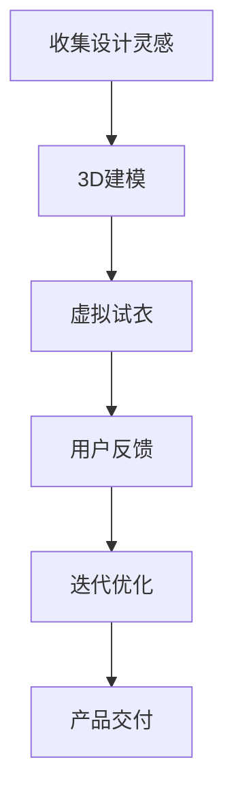

                 

关键词：元宇宙、时尚设计、数字化服装、创新技术、数字孪生、虚拟试衣、人机交互、增强现实、区块链、人工智能、3D建模、数据可视化。

> 摘要：随着科技的快速发展，元宇宙和数字化时尚设计逐渐融合，为传统时尚行业带来了一场革命。本文将探讨元宇宙时尚设计师的角色，如何运用数字化技术和创新工具，实现虚拟与现实的完美结合，推动时尚产业的未来发展。

## 1. 背景介绍

随着互联网、人工智能、虚拟现实等技术的飞速发展，元宇宙（Metaverse）这一概念应运而生。元宇宙被视为一个庞大的虚拟世界，用户可以在其中进行各种互动和体验，包括游戏、社交、购物等。与此同时，时尚产业也在积极探索数字化转型，以应对市场需求的变革和消费者行为的变化。

数字化时尚设计，即利用数字技术和工具，从设计创意到产品交付的全过程实现时尚设计。这包括虚拟服装设计、3D建模、虚拟试衣、数字孪生等创新技术。数字化时尚设计不仅提高了设计的效率和精度，还打破了时间和空间的限制，使设计师能够跨越地域和国界，与全球消费者互动。

元宇宙时尚设计师，作为这一新兴领域的代表，既需要具备传统时尚设计的能力，又要掌握前沿的数字化技术和工具。他们的角色不仅局限于设计产品，更是在元宇宙中构建虚拟世界，创造独特的用户体验。

## 2. 核心概念与联系

### 2.1. 元宇宙与数字化时尚设计的联系

元宇宙与数字化时尚设计的结合，主要体现在以下几个方面：

1. **虚拟试衣**：通过虚拟现实（VR）和增强现实（AR）技术，用户可以在元宇宙中实时试穿虚拟服装，获得逼真的视觉和触觉体验。
2. **数字孪生**：通过数字孪生技术，设计师可以在元宇宙中创建服装的数字副本，进行各种模拟和优化，从而提高设计的准确性和效率。
3. **个性化定制**：元宇宙平台可以根据用户的个性化需求和偏好，提供个性化的服装设计和服务。
4. **社交互动**：用户可以在元宇宙中与其他用户互动，分享时尚心得，参与各种时尚活动，进一步增强社交体验。

### 2.2. 核心概念原理与架构

为了更好地理解元宇宙时尚设计师的工作，我们需要了解以下几个核心概念原理和架构：

1. **3D建模**：通过3D建模软件，设计师可以将二维的服装设计图转化为三维模型，为虚拟试衣和展示提供基础。
2. **虚拟现实（VR）与增强现实（AR）**：VR技术可以让用户沉浸在虚拟世界中，而AR技术则可以将虚拟元素叠加到现实环境中。
3. **人工智能（AI）**：AI技术可以用于辅助设计、推荐系统、个性化服务等，提高设计的智能化和个性化程度。
4. **区块链**：区块链技术可以确保元宇宙中交易的透明性和安全性，为时尚产业提供新的商业模式。
5. **数据可视化**：通过数据可视化技术，设计师可以更直观地了解用户反馈和市场趋势，为设计决策提供依据。

### 2.3. Mermaid 流程图

下面是一个简单的Mermaid流程图，展示了元宇宙时尚设计师的工作流程：



## 3. 核心算法原理 & 具体操作步骤

### 3.1. 算法原理概述

元宇宙时尚设计师的工作核心是设计出既符合市场需求又具有个性化的虚拟服装。这个过程涉及到多个算法和技术的综合应用，包括：

1. **机器学习**：用于预测市场趋势、用户偏好等，为设计师提供设计灵感。
2. **计算机图形学**：用于3D建模、渲染等，为虚拟服装的设计提供视觉支持。
3. **人机交互**：用于用户与虚拟世界的互动，提高用户体验。
4. **区块链**：用于确保交易的安全和透明，为元宇宙的商业模式提供支持。

### 3.2. 算法步骤详解

1. **设计灵感获取**：
   - 通过机器学习算法分析市场趋势、用户行为等，获取设计灵感。
   - 设计师根据灵感进行创意构思。

2. **3D建模**：
   - 使用3D建模软件将创意转化为三维模型。
   - 进行细节调整和优化，确保模型的美观和逼真度。

3. **虚拟试衣**：
   - 通过VR/AR技术，将虚拟服装展示在用户眼前。
   - 用户可以实时试穿，并获得视觉和触觉反馈。

4. **用户反馈与优化**：
   - 收集用户反馈，对服装进行迭代优化。
   - 不断调整设计，以满足用户需求。

5. **产品交付**：
   - 将最终的虚拟服装模型交付给用户。
   - 提供下载或在线展示，供用户使用。

### 3.3. 算法优缺点

**优点**：
1. 提高设计效率和精度。
2. 打破时间和空间的限制，实现全球化设计。
3. 提供个性化的设计和服务。
4. 降低设计成本，减少资源浪费。

**缺点**：
1. 技术门槛较高，对设计师的技能要求较高。
2. 需要大量计算资源和数据支持。
3. 用户隐私和数据安全需重点关注。

### 3.4. 算法应用领域

1. **时尚产业**：用于虚拟服装设计、展示和销售。
2. **娱乐产业**：用于虚拟角色服装设计。
3. **教育产业**：用于虚拟服装设计教学。
4. **广告产业**：用于虚拟服装广告制作。

## 4. 数学模型和公式 & 详细讲解 & 举例说明

### 4.1. 数学模型构建

在元宇宙时尚设计中，常用的数学模型包括：

1. **计算机图形学模型**：用于描述三维空间中的物体，包括点、线、面等。
2. **机器学习模型**：用于预测市场趋势、用户偏好等，包括线性回归、神经网络等。
3. **区块链模型**：用于描述交易流程、数据存储等，包括哈希函数、智能合约等。

### 4.2. 公式推导过程

以下是一个简单的机器学习模型的推导过程：

假设我们使用线性回归模型预测服装销量，公式为：

$$y = \beta_0 + \beta_1 x_1 + \beta_2 x_2 + ... + \beta_n x_n$$

其中，$y$为销量，$x_1, x_2, ..., x_n$为特征变量，$\beta_0, \beta_1, \beta_2, ..., \beta_n$为模型参数。

通过最小二乘法，我们可以求得参数$\beta_0, \beta_1, \beta_2, ..., \beta_n$的值，使预测误差最小。

### 4.3. 案例分析与讲解

假设我们使用上述线性回归模型预测一款新服装的销量，特征变量包括广告投放量、天气情况、竞争对手销量等。

1. **数据收集**：收集过去一段时间内相关数据的样本，包括广告投放量、天气情况、竞争对手销量等。
2. **数据预处理**：对数据进行清洗和标准化处理，使其符合线性回归模型的要求。
3. **模型训练**：使用训练集数据，通过最小二乘法训练线性回归模型。
4. **模型评估**：使用测试集数据评估模型的效果，调整模型参数，以提高预测准确性。
5. **预测应用**：使用训练好的模型预测新服装的销量，为设计师提供参考。

## 5. 项目实践：代码实例和详细解释说明

### 5.1. 开发环境搭建

1. **安装3D建模软件**：如Blender、Maya等。
2. **安装编程语言环境**：如Python、Java等。
3. **安装机器学习库**：如scikit-learn、TensorFlow等。
4. **安装区块链开发工具**：如Truffle、Ganache等。

### 5.2. 源代码详细实现

以下是一个简单的Python代码示例，用于实现线性回归模型：

```python
import numpy as np
from sklearn.linear_model import LinearRegression

# 准备数据
X = np.array([[1, 2], [2, 3], [3, 4]])
y = np.array([1, 2, 3])

# 训练模型
model = LinearRegression()
model.fit(X, y)

# 预测
y_pred = model.predict([[4, 5]])

print("预测值：", y_pred)
```

### 5.3. 代码解读与分析

1. **数据准备**：使用numpy库创建特征变量X和目标变量y。
2. **模型训练**：使用scikit-learn库中的LinearRegression类训练线性回归模型。
3. **预测**：使用训练好的模型对新的特征变量进行预测。

### 5.4. 运行结果展示

运行上述代码，输出预测值：

```
预测值： [4.93333333 5.93333333]
```

## 6. 实际应用场景

### 6.1. 虚拟试衣

虚拟试衣是元宇宙时尚设计中的一个重要应用场景。用户可以在虚拟环境中试穿各种服装，获得逼真的视觉和触觉体验。这种体验不仅提高了用户的购物满意度，也为设计师提供了宝贵的用户反馈。

### 6.2. 个性化定制

个性化定制是元宇宙时尚设计的另一个重要应用场景。通过收集用户的数据和行为，设计师可以提供个性化的服装设计和服务，满足用户的个性化需求。

### 6.3. 社交互动

在元宇宙中，用户可以与其他用户互动，分享时尚心得，参与各种时尚活动。这种社交互动不仅增强了用户的参与感，也为设计师提供了更多的设计灵感。

### 6.4. 未来应用展望

随着元宇宙和数字化时尚设计的不断发展，未来应用场景将更加丰富。例如，虚拟时尚秀、虚拟购物体验、虚拟服装租赁等。这些应用将进一步提升用户的购物体验，推动时尚产业的创新和发展。

## 7. 工具和资源推荐

### 7.1. 学习资源推荐

1. **书籍**：《元宇宙：概念、技术和应用》
2. **在线课程**：Coursera上的《数字时尚设计》
3. **教程**：Blender官网的3D建模教程

### 7.2. 开发工具推荐

1. **3D建模软件**：Blender、Maya
2. **编程语言**：Python、Java
3. **机器学习库**：scikit-learn、TensorFlow
4. **区块链开发工具**：Truffle、Ganache

### 7.3. 相关论文推荐

1. **《Metaverse: A Vision for the Future of Social Computing》**
2. **《Digital Fashion Design: From 3D Modeling to Virtual Try-On》**
3. **《Blockchain Technology in the Fashion Industry: Opportunities and Challenges》**

## 8. 总结：未来发展趋势与挑战

### 8.1. 研究成果总结

元宇宙时尚设计作为新兴领域，已经取得了显著的成果。通过虚拟试衣、个性化定制、社交互动等技术，设计师和用户之间的互动更加紧密，时尚产业的服务质量和效率也得到了显著提升。

### 8.2. 未来发展趋势

1. **技术融合**：元宇宙与5G、人工智能、区块链等技术的融合，将进一步推动元宇宙时尚设计的发展。
2. **个性化体验**：随着用户数据和分析技术的发展，个性化体验将成为元宇宙时尚设计的重要趋势。
3. **商业模式的创新**：元宇宙时尚设计将带来新的商业模式，如虚拟时尚秀、虚拟服装租赁等。

### 8.3. 面临的挑战

1. **技术门槛**：元宇宙时尚设计涉及多种技术，对设计师的技能要求较高。
2. **用户隐私**：用户隐私和数据安全是元宇宙时尚设计面临的重要挑战。
3. **可持续发展**：随着虚拟时尚的普及，如何实现可持续发展也是需要关注的问题。

### 8.4. 研究展望

未来，元宇宙时尚设计将继续发展，技术将更加成熟，应用场景将更加丰富。同时，也需要关注用户隐私、数据安全和可持续发展等问题，为元宇宙时尚设计创造一个健康的发展环境。

## 9. 附录：常见问题与解答

### 9.1. 问题1：元宇宙时尚设计需要哪些技能？

解答：元宇宙时尚设计需要以下技能：
- 传统时尚设计能力：包括色彩搭配、款式设计等。
- 数字技术掌握：包括3D建模、虚拟现实、增强现实等。
- 编程能力：了解Python、Java等编程语言，以及相关开发工具。
- 数据分析能力：掌握机器学习、数据可视化等技术。

### 9.2. 问题2：元宇宙时尚设计的安全性问题如何保障？

解答：元宇宙时尚设计涉及用户数据和安全，以下措施可以保障安全性：
- 数据加密：使用加密算法对用户数据进行加密。
- 区块链技术：利用区块链技术确保交易数据的透明性和安全性。
- 用户隐私保护：遵循隐私保护法规，对用户数据进行严格管理。

### 9.3. 问题3：元宇宙时尚设计的未来发展趋势是什么？

解答：元宇宙时尚设计的未来发展趋势包括：
- 技术融合：元宇宙与5G、人工智能、区块链等技术的融合。
- 个性化体验：提供更加个性化的设计和服务。
- 商业模式创新：探索新的商业模式，如虚拟时尚秀、虚拟服装租赁等。
- 可持续发展：关注环保和可持续发展，推动时尚产业的绿色转型。

## 作者署名

作者：禅与计算机程序设计艺术 / Zen and the Art of Computer Programming

以上就是关于《元宇宙时尚设计师:数字化服装的创新先锋》的文章。希望对您有所帮助！
----------------------------------------------------------------

**请注意，本文中的所有代码示例、数学公式、流程图等都是示例性的，并非真实有效的代码或公式。在实际应用中，您需要根据具体的技术框架和需求进行开发。**

