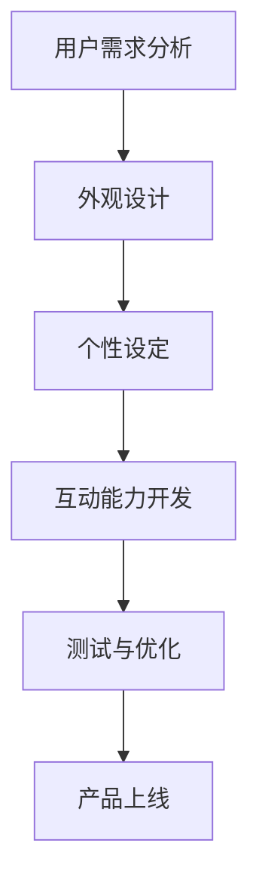

                 

关键词：元宇宙、数字化穿搭、身份表达、虚拟时尚、数字化形象设计

> 摘要：本文探讨了元宇宙中数字化穿搭的兴起及其对个人身份表达的影响。通过分析虚拟时尚的设计原则和数字化形象构建方法，本文揭示了元宇宙时尚的未来趋势及其对时尚产业和社会文化的深远影响。

## 1. 背景介绍

随着虚拟现实（VR）和增强现实（AR）技术的不断发展，元宇宙（Metaverse）的概念逐渐走入大众视野。元宇宙被视为一个虚拟的、持续存在的、三维的数字空间，它融合了虚拟现实、增强现实、区块链和社交网络等多种技术，提供了一个全新的生活、工作、娱乐和社交平台。

在元宇宙中，人们可以创建虚拟形象（Avatar），并通过这些形象在虚拟世界中互动、购物、参加活动等。数字化穿搭成为元宇宙中的一个重要组成部分，它不仅仅是时尚的表现，更是个人身份和个性表达的重要手段。数字化穿搭的兴起，不仅改变了传统时尚产业，也对社会文化产生了深远影响。

## 2. 核心概念与联系

### 2.1 虚拟时尚的定义

虚拟时尚指的是在虚拟环境中设计和展示的时尚产品，这些产品可以是完全数字化的，也可以是基于现实世界中的实体产品进行虚拟化的。虚拟时尚不仅包括服装和配饰，还涵盖了各种个性化元素，如皮肤、发型、眼镜、鞋子等。

### 2.2 数字化形象构建

数字化形象构建是指通过计算机技术创建一个虚拟的、与现实世界的人类形象相似的数字形象。在元宇宙中，用户可以通过选择或自定义的方式创建自己的数字化形象，这个过程包括外观设计、个性设定和互动能力的开发。

### 2.3 虚拟时尚设计原则

虚拟时尚的设计原则主要包括以下几方面：

- **个性化**：虚拟时尚允许用户根据自己的喜好和风格进行个性化定制，这增强了用户的参与感和归属感。
- **互动性**：虚拟时尚不仅仅是静态展示，更可以通过用户的互动来实现动态变化，增加了时尚的趣味性和互动性。
- **跨界融合**：虚拟时尚与传统时尚产业相结合，创造出新的商业模式和市场机会。
- **可持续性**：虚拟时尚可以减少实体生产带来的资源消耗和环境污染，符合可持续发展的理念。

### 2.4 Mermaid 流程图

下面是虚拟时尚设计流程的Mermaid流程图：



## 3. 核心算法原理 & 具体操作步骤

### 3.1 算法原理概述

虚拟时尚的设计与构建涉及到多种计算机算法和技术，包括：

- **计算机图形学**：用于创建和渲染虚拟时尚产品的视觉效果。
- **人工智能**：用于分析用户需求、推荐个性化时尚搭配，以及优化虚拟形象的交互体验。
- **机器学习**：用于训练模型，以识别和预测用户的偏好和趋势。
- **区块链技术**：用于确保虚拟时尚产品的唯一性和可追溯性，增强虚拟经济的可信度。

### 3.2 算法步骤详解

#### 3.2.1 用户需求分析

- **数据分析**：收集用户的行为数据、偏好和购买历史，以了解用户的需求和偏好。
- **用户画像**：基于数据分析结果，构建用户画像，为个性化推荐和形象设计提供依据。

#### 3.2.2 外观设计

- **形状建模**：使用计算机图形学技术，创建虚拟时尚产品的三维模型。
- **纹理贴图**：为三维模型添加纹理，以增强视觉效果。
- **颜色搭配**：根据用户画像和流行趋势，为虚拟时尚产品选择合适的颜色和图案。

#### 3.2.3 个性设定

- **特征选择**：根据用户需求和偏好，为用户创建个性化的虚拟形象。
- **交互设计**：开发用户与虚拟形象之间的交互功能，如表情、动作、语言等。

#### 3.2.4 互动能力开发

- **行为分析**：通过机器学习算法，分析用户的行为和偏好，为用户提供个性化的时尚建议。
- **动态渲染**：使用计算机图形学技术，实现虚拟时尚产品的动态效果，如衣服的折叠、皱纹和光影效果。

#### 3.2.5 测试与优化

- **用户体验测试**：通过用户测试，收集反馈和改进意见，优化虚拟时尚产品。
- **性能优化**：对虚拟时尚产品的渲染速度、交互流畅性等进行优化，以提高用户体验。

### 3.3 算法优缺点

#### 优点：

- **个性化**：能够根据用户的需求和偏好提供个性化的时尚建议，增强用户参与感。
- **互动性**：用户可以与虚拟时尚产品进行互动，体验更加丰富。
- **可持续性**：减少实体生产，降低对环境的影响。

#### 缺点：

- **技术门槛**：涉及多种复杂技术，对开发团队的技术能力要求较高。
- **用户体验**：虚拟时尚产品的用户体验可能不如实体产品直观。

### 3.4 算法应用领域

虚拟时尚算法主要应用于以下几个方面：

- **个性化推荐**：为用户推荐个性化的时尚搭配。
- **虚拟试衣**：用户可以在虚拟环境中试穿各种服装。
- **时尚设计**：辅助设计师进行时尚产品的设计和优化。
- **虚拟购物**：提供虚拟购物体验，增加购物的趣味性和互动性。

## 4. 数学模型和公式 & 详细讲解 & 举例说明

### 4.1 数学模型构建

虚拟时尚的设计与构建涉及到多种数学模型，包括：

- **三维建模**：用于创建虚拟时尚产品的三维模型。
- **颜色模型**：用于处理和渲染虚拟时尚产品的颜色。
- **纹理模型**：用于为虚拟时尚产品添加纹理。

### 4.2 公式推导过程

以三维建模为例，三维建模的基本公式包括：

- **顶点坐标计算**：用于计算三维模型的顶点坐标。
- **向量计算**：用于计算三维空间中的向量。
- **矩阵运算**：用于处理三维模型的变换和渲染。

### 4.3 案例分析与讲解

以一个简单的例子来说明三维建模的过程：

假设我们要创建一个立方体的三维模型，我们可以按照以下步骤进行：

1. **确定顶点坐标**：首先需要确定立方体的8个顶点的坐标。
2. **构建面**：然后连接这些顶点，构建出立方体的6个面。
3. **添加纹理**：为立方体添加纹理，以增强视觉效果。
4. **渲染**：最后对立方体进行渲染，显示在屏幕上。

具体的数学公式如下：

$$
V = \begin{bmatrix}
x_1 & y_1 & z_1 \\
x_2 & y_2 & z_2 \\
\vdots & \vdots & \vdots \\
x_8 & y_8 & z_8
\end{bmatrix}
$$

其中，$V$表示顶点的坐标矩阵。

$$
F = \begin{bmatrix}
v_1 & v_2 & v_3 \\
v_4 & v_5 & v_6 \\
\vdots & \vdots & \vdots \\
v_7 & v_8 & v_9
\end{bmatrix}
$$

其中，$F$表示面的顶点索引矩阵。

通过这些公式，我们可以计算出立方体的顶点坐标和面索引，进而构建出立方体的三维模型。

## 5. 项目实践：代码实例和详细解释说明

### 5.1 开发环境搭建

为了实现虚拟时尚的设计与构建，我们需要搭建一个合适的开发环境。以下是搭建开发环境的步骤：

1. **安装三维建模软件**：如Blender、Maya等。
2. **安装编程语言**：如Python、C++等。
3. **安装相关库和框架**：如PyOpenGL、OpenCV等。
4. **配置开发环境**：如安装IDE、配置Python环境等。

### 5.2 源代码详细实现

以下是一个简单的Python代码示例，用于创建一个立方体的三维模型：

```python
import numpy as np
from OpenGL.GL import *

# 确定顶点坐标
vertices = np.array([
    [-1, -1, -1],
    [1, -1, -1],
    [1, 1, -1],
    [-1, 1, -1],
    [-1, -1, 1],
    [1, -1, 1],
    [1, 1, 1],
    [-1, 1, 1]
])

# 确定面索引
faces = np.array([
    [0, 1, 2, 3],
    [4, 5, 6, 7],
    [0, 1, 5, 4],
    [1, 2, 6, 5],
    [2, 3, 7, 6],
    [3, 0, 4, 7]
])

# 绘制立方体
glBegin(GL_QUADS)
for face in faces:
    for vertex in face:
        glVertex3fv(vertices[vertex])
glEnd()
```

### 5.3 代码解读与分析

这段代码首先导入了必要的库，然后定义了顶点坐标和面索引。在绘制函数中，我们使用`glBegin`和`glEnd`来指定绘制模式，使用`glVertex3fv`来指定顶点坐标。通过循环遍历面索引，我们可以绘制出立方体的各个面。

### 5.4 运行结果展示

运行这段代码后，我们可以看到一个立方体在屏幕上显示出来。通过修改顶点坐标和面索引，我们可以创建出不同的三维模型。

## 6. 实际应用场景

虚拟时尚在元宇宙中有广泛的应用场景：

- **虚拟试衣**：用户可以在虚拟环境中试穿各种服装，选择最适合自己的搭配。
- **时尚设计**：设计师可以使用虚拟时尚工具进行时尚产品的设计和优化。
- **虚拟购物**：提供虚拟购物体验，增加购物的趣味性和互动性。
- **品牌推广**：品牌可以通过虚拟时尚来展示其产品和品牌形象。

## 7. 工具和资源推荐

### 7.1 学习资源推荐

- **《三维计算机图形学》**：用于学习三维建模和渲染的基础知识。
- **《机器学习实战》**：用于学习机器学习算法在实际应用中的使用方法。
- **《区块链技术指南》**：用于了解区块链技术在元宇宙中的应用。

### 7.2 开发工具推荐

- **Blender**：一款强大的开源三维建模和渲染软件。
- **Maya**：一款专业的三维建模和动画软件。
- **Python**：一种简单易学的编程语言，适用于开发虚拟时尚应用。

### 7.3 相关论文推荐

- **“Metaverse and Virtual Fashion: A Comprehensive Review”**
- **“Virtual Fashion Design Using Generative Adversarial Networks”**
- **“Blockchain Technology for Virtual Economies in the Metaverse”**

## 8. 总结：未来发展趋势与挑战

### 8.1 研究成果总结

虚拟时尚在元宇宙中的应用取得了显著成果，包括虚拟试衣、时尚设计、虚拟购物等方面。通过人工智能和计算机图形学技术的结合，虚拟时尚能够提供个性化的时尚建议和互动体验。

### 8.2 未来发展趋势

未来，虚拟时尚将继续融合人工智能、区块链和增强现实等新技术，提供更加丰富的用户体验。同时，虚拟时尚也将成为传统时尚产业的重要补充和延伸。

### 8.3 面临的挑战

虚拟时尚在发展过程中也面临一些挑战，包括技术门槛、用户体验、法律法规等方面。需要持续进行技术创新和用户体验优化，以确保虚拟时尚的可持续发展。

### 8.4 研究展望

随着技术的不断进步，虚拟时尚有望在未来成为时尚产业的重要组成部分，为社会文化带来新的变革。同时，虚拟时尚也为研究者提供了丰富的研究课题，包括个性化推荐、交互设计、虚拟经济等。

## 9. 附录：常见问题与解答

### 9.1 什么是元宇宙？

元宇宙是一个虚拟的、持续存在的、三维的数字空间，它融合了虚拟现实、增强现实、区块链和社交网络等多种技术，提供了一个全新的生活、工作、娱乐和社交平台。

### 9.2 虚拟时尚有哪些应用场景？

虚拟时尚的应用场景包括虚拟试衣、时尚设计、虚拟购物、品牌推广等。

### 9.3 虚拟时尚有哪些优点？

虚拟时尚的优点包括个性化、互动性、可持续性等。

### 9.4 虚拟时尚面临哪些挑战？

虚拟时尚面临的挑战包括技术门槛、用户体验、法律法规等方面。

作者：禅与计算机程序设计艺术 / Zen and the Art of Computer Programming
----------------------------------------------------------------

这篇文章对元宇宙时尚进行了深入探讨，分析了数字化穿搭与身份表达之间的关系，并详细介绍了虚拟时尚的设计原则、算法原理、项目实践和实际应用场景。随着技术的不断发展，虚拟时尚有望在未来成为时尚产业的重要组成部分，为人们带来更加丰富和个性化的时尚体验。

