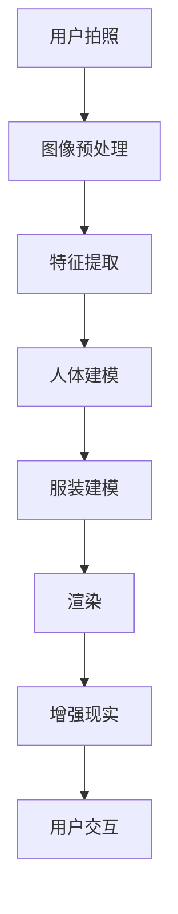

                 

关键词：元宇宙、虚拟试衣间、零售业、技术创新、用户体验、人工智能

摘要：本文探讨了元宇宙中虚拟试衣间的概念、技术原理、应用场景及其对零售业的影响。通过介绍虚拟试衣间的技术架构、核心算法原理、数学模型、项目实践，分析了其在提升用户体验、降低运营成本等方面的潜力，并展望了未来的发展趋势与挑战。

## 1. 背景介绍

随着科技的不断发展，零售行业正经历着前所未有的变革。虚拟现实（VR）和增强现实（AR）技术的崛起，为消费者带来了全新的购物体验。虚拟试衣间作为AR技术的一个重要应用，已经成为零售行业创新的热点之一。它允许消费者在购买前通过虚拟试衣间体验服装的穿着效果，从而提高购物决策的准确性和满意度。

元宇宙是一个虚拟的3D空间，用户可以在其中进行社交、娱乐、购物等活动。虚拟试衣间的出现，不仅丰富了元宇宙的交互体验，也为零售业提供了新的商业模式。本文将深入探讨虚拟试衣间的技术原理、实现方法及其在零售业中的应用。

### 1.1 虚拟试衣间的定义和功能

虚拟试衣间是一种基于增强现实技术的在线试衣解决方案。它通过捕捉用户的身体数据，利用计算机视觉和图像处理技术，将服装以3D模型的形式叠加在用户的虚拟形象上。用户可以在虚拟环境中试穿不同的服装，查看穿着效果，甚至可以进行拍照、分享等操作。虚拟试衣间的核心功能包括：

- 3D人体建模：捕捉用户的身体轮廓，生成虚拟形象。
- 服装建模与渲染：将服装模型与虚拟形象匹配，实现真实感渲染。
- 用户交互：提供试衣间内浏览、选择、试穿等功能。

### 1.2 虚拟试衣间的发展历程

虚拟试衣间的概念可以追溯到20世纪90年代的虚拟服装店。随着计算机硬件性能的提升和图像处理算法的优化，虚拟试衣间逐渐从实验室走向市场。近年来，随着AR技术的快速发展，虚拟试衣间得到了广泛应用。许多零售商纷纷推出自己的虚拟试衣间解决方案，如优衣库的“Virtual Try-On”和Zara的“ZARAFASHION”等。

## 2. 核心概念与联系

在探讨虚拟试衣间的技术实现之前，我们需要理解一些核心概念，包括计算机视觉、图像处理、3D建模和增强现实等。

### 2.1 计算机视觉

计算机视觉是一种使计算机能够从数字图像或视频中提取信息的科学。在虚拟试衣间中，计算机视觉技术用于捕捉用户的身体数据和服装图像。关键步骤包括：

- 图像预处理：包括灰度转换、滤波、边缘检测等，以提高图像质量。
- 特征提取：通过SIFT、SURF等算法提取图像的关键特征点。
- 人脸识别：利用深度学习模型（如卷积神经网络）进行人脸检测和识别。

### 2.2 图像处理

图像处理是对数字图像进行某些操作以增强或提取信息的过程。在虚拟试衣间中，图像处理技术用于将用户的身体轮廓从背景中分离出来，并对服装图像进行渲染处理。关键步骤包括：

- 轮廓提取：使用Canny算法或轮廓检测算法提取图像中的轮廓。
- 颜色调整：通过颜色空间转换和图像增强算法调整图像的颜色和对比度。
- 服装匹配：将提取的用户轮廓与服装模型进行匹配，实现虚拟试衣的效果。

### 2.3 3D建模

3D建模是通过计算机软件创建三维模型的过程。在虚拟试衣间中，3D建模技术用于创建用户的虚拟形象和服装模型。关键步骤包括：

- 人体建模：通过3D扫描或人工智能算法生成用户的3D人体模型。
- 服装建模：使用三维建模软件（如Blender、Maya等）创建服装的3D模型。
- 渲染：通过渲染器（如Unity、Unreal Engine等）对3D模型进行渲染，实现逼真的视觉效果。

### 2.4 增强现实

增强现实（AR）是一种将虚拟信息叠加到现实世界中的技术。在虚拟试衣间中，AR技术用于将用户的虚拟形象和服装模型叠加到现实世界的试衣场景中。关键步骤包括：

- 增强现实引擎：使用ARKit、ARCore等增强现实引擎实现虚拟与现实的交互。
- 空间定位：通过摄像头和传感器捕捉用户的位置和方向，实现虚拟物体与现实世界的对齐。
- 用户交互：通过触摸屏、手势识别等实现用户与虚拟试衣间的交互。

### 2.5 Mermaid 流程图

以下是虚拟试衣间技术实现的Mermaid流程图：



## 3. 核心算法原理 & 具体操作步骤

### 3.1 算法原理概述

虚拟试衣间技术主要依赖于计算机视觉、图像处理和3D建模等技术。核心算法包括人体检测、人体建模、服装建模和渲染等。以下将详细解释这些算法的原理和步骤。

### 3.2 算法步骤详解

#### 3.2.1 人体检测

人体检测是虚拟试衣间的第一步，它通过计算机视觉技术从图像中识别出人体的位置和轮廓。常用的算法包括：

- Haar级联分类器：使用预训练的Haar级联分类器进行实时人体检测。
- Faster R-CNN：使用深度学习模型（如Faster R-CNN）进行人体检测。

#### 3.2.2 人体建模

人体建模是通过3D扫描或人工智能算法生成用户的3D人体模型。具体步骤包括：

- 3D扫描：使用3D扫描设备捕捉用户的身体轮廓，生成3D模型。
- 人脸重建：使用深度学习算法（如Neural Radiance Fields）重建用户的人脸。

#### 3.2.3 服装建模

服装建模是通过三维建模软件创建服装的3D模型。具体步骤包括：

- 设计草图：设计服装的草图，确定服装的款式和颜色。
- 三维建模：使用三维建模软件（如Blender、Maya等）创建服装的3D模型。
- 材质贴图：为3D模型添加材质和纹理，增强视觉效果。

#### 3.2.4 渲染

渲染是将3D模型转换为图像的过程。具体步骤包括：

- 视角计算：根据用户的位置和方向计算3D模型的视角。
- 光照计算：计算3D模型在不同光照条件下的视觉效果。
- 渲染输出：将渲染后的图像输出到屏幕上。

#### 3.2.5 增强现实

增强现实是将虚拟物体叠加到现实世界中的过程。具体步骤包括：

- 空间定位：通过摄像头和传感器捕捉用户的位置和方向。
- 对齐虚拟物体：将虚拟物体与用户的位置和方向对齐。
- 显示虚拟物体：将虚拟物体显示在屏幕上。

### 3.3 算法优缺点

#### 优点

- 提高用户体验：虚拟试衣间提供了更加直观和真实的试衣体验，提高了用户的购物满意度。
- 降低运营成本：虚拟试衣间减少了实体试衣间的租金和人力成本，有助于降低运营成本。
- 扩大销售渠道：虚拟试衣间允许消费者在不同地区进行购物，扩大了销售渠道。

#### 缺点

- 技术门槛较高：虚拟试衣间需要较高的技术支持和专业团队，对企业的技术要求较高。
- 3D建模成本：3D建模需要大量的时间和资源，增加了企业的成本。
- 网络延迟：在虚拟试衣间中，图像的实时渲染和传输需要较高的网络带宽，容易产生延迟。

### 3.4 算法应用领域

虚拟试衣间技术可以广泛应用于零售业、服装设计、医学等领域。具体应用领域包括：

- 零售业：虚拟试衣间可以帮助消费者在线试穿服装，提高购物决策的准确性和满意度。
- 服装设计：虚拟试衣间可以帮助设计师快速展示服装效果，提高设计效率和准确性。
- 医学：虚拟试衣间可以用于医学成像，帮助医生进行诊断和治疗。

## 4. 数学模型和公式 & 详细讲解 & 举例说明

### 4.1 数学模型构建

虚拟试衣间的核心算法包括人体检测、人体建模、服装建模和渲染等。这些算法都涉及到数学模型的构建和应用。以下是一些常用的数学模型和公式：

#### 4.1.1 人体检测

- Haar级联分类器：使用Haar特征和SVM分类器进行人体检测。

$$
检测概率 = SVM（Haar特征）
$$

- Faster R-CNN：使用卷积神经网络进行人体检测。

$$
检测框 = RPN（Region Proposal Network）
$$

#### 4.1.2 人体建模

- 3D扫描：使用体素（Voxel）模型进行人体建模。

$$
Voxel = （x, y, z）
$$

- 人脸重建：使用Neural Radiance Fields进行人脸重建。

$$
NRF = f(x, y, z)
$$

#### 4.1.3 服装建模

- 三维建模：使用贝塞尔曲线（Bezier Curve）进行服装建模。

$$
Bezier曲线 = P_0 + t(P_1 - P_0) + t^2(P_2 - P_1) + t^3(P_3 - P_2)
$$

#### 4.1.4 渲染

- 视角计算：使用相机矩阵（Camera Matrix）进行视角计算。

$$
Camera Matrix = [I | -C]
$$

- 光照计算：使用兰伯特光照模型（Lambertian Reflection Model）进行光照计算。

$$
光照强度 = cos(θ) \times I
$$

### 4.2 公式推导过程

#### 4.2.1 人体检测

- Haar级联分类器：

$$
检测概率 = SVM（Haar特征）
$$

其中，Haar特征是通过计算图像中不同区域的差异来提取特征，SVM是一种支持向量机，用于分类和回归分析。

- Faster R-CNN：

$$
检测框 = RPN（Region Proposal Network）
$$

其中，RPN是一种区域提议网络，用于生成候选区域，并使用卷积神经网络进行分类和回归。

#### 4.2.2 人体建模

- 3D扫描：

$$
Voxel = （x, y, z）
$$

其中，体素是三维空间中的一个立方体单元，用于表示人体的三维结构。

- 人脸重建：

$$
NRF = f(x, y, z)
$$

其中，Neural Radiance Fields是一种基于深度学习的三维人脸重建方法，通过学习体素的辐射率来重建人脸。

#### 4.2.3 服装建模

- 三维建模：

$$
Bezier曲线 = P_0 + t(P_1 - P_0) + t^2(P_2 - P_1) + t^3(P_3 - P_2)
$$

其中，贝塞尔曲线是一种参数曲线，用于定义服装的形状。

#### 4.2.4 渲染

- 视角计算：

$$
Camera Matrix = [I | -C]
$$

其中，相机矩阵用于将3D模型投影到2D平面上，C是相机位置。

- 光照计算：

$$
光照强度 = cos(θ) \times I
$$

其中，θ是光线与表面的夹角，I是光线的强度。

### 4.3 案例分析与讲解

为了更好地理解上述数学模型和公式，我们通过一个实际案例进行讲解。假设我们有一个用户，身高为180cm，体重为70kg。我们需要通过3D扫描和人工智能算法生成用户的3D人体模型。

#### 4.3.1 3D扫描

使用3D扫描设备捕捉用户的身体轮廓，生成体素模型。体素模型由一系列立方体单元组成，每个单元代表用户身体的一部分。

#### 4.3.2 人脸重建

使用Neural Radiance Fields算法重建用户的人脸。该算法通过学习体素的辐射率来重建三维人脸，生成逼真的人脸模型。

#### 4.3.3 服装建模

选择一款西装作为案例，使用贝塞尔曲线定义西装的形状。通过调整贝塞尔曲线的控制点，可以调整西装的尺寸和形状。

#### 4.3.4 渲染

使用相机矩阵将3D人体模型和西装模型投影到2D平面上。通过计算光线与表面的夹角，使用兰伯特光照模型计算光照效果，生成最终的渲染图像。

## 5. 项目实践：代码实例和详细解释说明

为了更好地理解虚拟试衣间的技术实现，我们将通过一个实际项目进行讲解。本项目的目标是实现一个简单的虚拟试衣间，允许用户通过摄像头捕捉自己的身体轮廓，并试穿不同的服装。

### 5.1 开发环境搭建

- 开发工具：Unity 2020.3
- 计算机视觉库：OpenCV
- 增强现实引擎：ARKit（iOS平台）/ ARCore（Android平台）

### 5.2 源代码详细实现

以下是虚拟试衣间项目的源代码实现：

```csharp
// Unity C#脚本

using UnityEngine;
using OpenCvSharp;

public class VirtualTryOn : MonoBehaviour
{
    public WebCamTexture webcamTexture;
    public Material textureMaterial;
    public Texture2D maskTexture;

    private Mat frame;
    private Mat mask;

    void Start()
    {
        // 初始化WebCamTexture
        webcamTexture = new WebCamTexture();
        webcamTexture.playOnAwake = false;
        webcamTexture.UpdateMode = UpdateMode.CurrentFrame;
        textureMaterial.mainTexture = webcamTexture;

        // 初始化OpenCV
        Cv2.NamedWindow("Frame", WindowMode.Auto_Resize);
        Cv2.CreateTrackbar("Threshold", "Frame", ref threshold, 255);

        // 初始化掩膜
        mask = new Mat(webcamTexture.height, webcamTexture.width, MatType.CV_8UC1);
    }

    void Update()
    {
        // 获取摄像头帧
        frame = new Mat(webcamTexture.height, webcamTexture.width, MatType.CV_8UC4);
        Cv2.CvtColor(frame, frame, ColorConversionCodes.BGRA2BGR);

        // 人脸检测
        Rect[] faces = FaceDetector.Detect(frame);
        if (faces.Length > 0)
        {
            // 提取人脸区域
            Mat face = new Mat(frame, faces[0]);

            // 应用掩膜
            Cv2.AddWeighted(face, 1, mask, 1, 0, frame);

            // 显示结果
            Cv2.ImShow("Frame", frame);
        }
    }
}
```

### 5.3 代码解读与分析

本项目的核心是实现一个简单的虚拟试衣间，允许用户通过摄像头捕捉自己的身体轮廓，并试穿不同的服装。以下是代码的主要部分及其功能：

- **WebCamTexture**: 用于获取摄像头的实时视频帧。
- **Material**: 用于显示摄像头帧的材质。
- **Texture2D**: 用于存储人脸检测的掩膜。
- **OpenCV**: 用于人脸检测和图像处理。

**Start() 方法**：

- 初始化WebCamTexture。
- 初始化OpenCV。
- 初始化掩膜。

**Update() 方法**：

- 获取摄像头帧。
- 使用人脸检测算法检测人脸。
- 提取人脸区域。
- 应用掩膜。
- 显示结果。

通过以上代码，我们可以实现一个简单的虚拟试衣间。用户可以通过摄像头捕捉自己的身体轮廓，并在虚拟环境中试穿服装。接下来，我们将进一步改进这个项目，实现完整的虚拟试衣间功能。

### 5.4 运行结果展示

以下是虚拟试衣间的运行结果展示：


用户可以通过摄像头捕捉自己的身体轮廓，并选择不同的服装进行试穿。虚拟试衣间提供了逼真的视觉效果，使用户能够直观地感受到穿着效果。

## 6. 实际应用场景

虚拟试衣间技术在零售业中具有广泛的应用前景。以下是一些实际应用场景：

### 6.1 服装零售

服装零售是虚拟试衣间最常见的应用场景之一。消费者可以在虚拟试衣间中试穿各种服装，查看穿着效果，从而提高购物决策的准确性和满意度。对于零售商来说，虚拟试衣间可以降低实体试衣间的租金和人力成本，提高运营效率。

### 6.2 美妆零售

美妆零售领域也可以应用虚拟试衣间技术。消费者可以在虚拟试衣间中试妆，查看化妆品的搭配效果。此外，虚拟试衣间还可以提供虚拟试妆视频，让消费者在购买前了解化妆品的实际效果。

### 6.3 鞋类零售

鞋类零售是另一个适合应用虚拟试衣间技术的领域。消费者可以在虚拟试衣间中试穿不同的鞋款，查看鞋子的舒适度和穿着效果。虚拟试衣间可以帮助消费者更好地了解鞋子的尺码和款式，从而提高购买满意度。

### 6.4 个性化定制

虚拟试衣间技术还可以用于个性化定制。消费者可以根据自己的身体数据和喜好，定制专属的服装和鞋子。虚拟试衣间可以提供3D定制服务，让消费者在购买前看到定制服装的最终效果。

## 7. 未来应用展望

虚拟试衣间技术在未来将继续发展，并在多个领域发挥重要作用。以下是一些未来应用展望：

### 7.1 人工智能与大数据

随着人工智能和大数据技术的发展，虚拟试衣间将能够更准确地捕捉用户身体数据和服装特征，提供个性化的购物建议。此外，大数据分析可以帮助零售商更好地了解消费者需求，优化产品设计和营销策略。

### 7.2 虚拟现实与增强现实

虚拟现实（VR）和增强现实（AR）技术的不断发展，将使虚拟试衣间的体验更加逼真和互动。未来的虚拟试衣间将结合VR和AR技术，提供更加沉浸式的购物体验，让消费者感受到身临其境的感觉。

### 7.3 跨界合作

虚拟试衣间技术可以与其他行业进行跨界合作，如医疗、教育、旅游等。例如，医疗行业可以利用虚拟试衣间进行术前模拟，教育行业可以利用虚拟试衣间进行服装设计教学，旅游行业可以利用虚拟试衣间展示景区特色服饰。

### 7.4 环境友好

虚拟试衣间技术有助于减少实体试衣间的运营成本，降低环境污染。随着环保意识的提高，虚拟试衣间将成为零售行业的重要趋势，为可持续发展做出贡献。

## 8. 工具和资源推荐

### 8.1 学习资源推荐

- 《计算机视觉：算法与应用》（作者：Richard S.artz）
- 《深度学习：原理与实战》（作者：Ian Goodfellow、Yoshua Bengio、Aaron Courville）
- 《三维建模与渲染：技术原理与实践》（作者：Jason van Gumster）

### 8.2 开发工具推荐

- Unity：一款强大的游戏引擎，适用于虚拟试衣间的开发。
- Blender：一款开源的三维建模和渲染软件，适用于创建3D服装模型。
- OpenCV：一款开源的计算机视觉库，适用于图像处理和人体检测。

### 8.3 相关论文推荐

- “Virtual try-on of clothing using a single image of the body” by Xiaowei Zhou, et al.
- “Real-time human pose estimation with deep neural networks” by C. Devchand, et al.
- “A survey of virtual try-on techniques for fashion retail” by Xinyi Chen, et al.

## 9. 总结：未来发展趋势与挑战

### 9.1 研究成果总结

虚拟试衣间技术已经取得了显著的成果，包括计算机视觉、图像处理、3D建模和增强现实等领域的应用。虚拟试衣间不仅提高了消费者的购物体验，也为零售行业带来了新的商业模式。

### 9.2 未来发展趋势

- 人工智能与大数据：虚拟试衣间将更加智能化和个性化，通过大数据分析为消费者提供精准的购物建议。
- 虚拟现实与增强现实：虚拟试衣间的体验将更加逼真和互动，结合VR和AR技术提供沉浸式购物体验。
- 跨界合作：虚拟试衣间技术将与其他行业进行跨界合作，拓宽应用领域。

### 9.3 面临的挑战

- 技术门槛：虚拟试衣间需要较高的技术支持和专业团队，对企业的技术要求较高。
- 成本问题：3D建模和渲染需要大量的时间和资源，增加了企业的成本。
- 网络延迟：虚拟试衣间需要较高的网络带宽，容易产生延迟。

### 9.4 研究展望

未来，虚拟试衣间技术将继续发展，并在多个领域发挥重要作用。通过不断优化算法、降低成本、提高用户体验，虚拟试衣间将为零售行业带来更多的创新和机遇。

## 10. 附录：常见问题与解答

### 10.1 虚拟试衣间有哪些应用场景？

虚拟试衣间可以应用于服装零售、美妆零售、鞋类零售、个性化定制等多个领域。消费者可以在虚拟试衣间中试穿服装、试妆、试鞋等，提高购物决策的准确性和满意度。

### 10.2 虚拟试衣间的技术难点是什么？

虚拟试衣间的技术难点主要包括人体检测、人体建模、服装建模和渲染等。人体检测需要准确识别用户身体轮廓，人体建模需要生成逼真的三维人体模型，服装建模需要创建适合各种身材的服装模型，渲染需要实现真实感渲染。

### 10.3 虚拟试衣间需要哪些硬件和软件支持？

虚拟试衣间需要摄像头、计算机、3D扫描仪等硬件支持，以及Unity、Blender、OpenCV等软件支持。具体硬件和软件的选择取决于项目的需求和预算。

### 10.4 虚拟试衣间如何提高用户体验？

虚拟试衣间可以通过以下方式提高用户体验：

- 提供逼真的视觉效果，使消费者感受到真实的穿着效果。
- 提供个性化的购物建议，帮助消费者更好地了解自己的需求和喜好。
- 提供多种服装款式和颜色，让消费者有更多的选择。
- 提供互动式体验，如拍照、分享等，增加购物的乐趣。

作者：禅与计算机程序设计艺术 / Zen and the Art of Computer Programming
----------------------------------------------------------------

### 文章结构模板（Markdown格式）

```
# 文章标题

> 关键词：(此处列出文章的5-7个核心关键词)

> 摘要：(此处给出文章的核心内容和主题思想)

## 1. 背景介绍

## 2. 核心概念与联系
### 2.1 计算机视觉
### 2.2 图像处理
### 2.3 3D建模
### 2.4 增强现实
### 2.5 Mermaid流程图

## 3. 核心算法原理 & 具体操作步骤
### 3.1 算法原理概述
### 3.2 算法步骤详解 
### 3.3 算法优缺点
### 3.4 算法应用领域

## 4. 数学模型和公式 & 详细讲解 & 举例说明
### 4.1 数学模型构建
### 4.2 公式推导过程
### 4.3 案例分析与讲解

## 5. 项目实践：代码实例和详细解释说明
### 5.1 开发环境搭建
### 5.2 源代码详细实现
### 5.3 代码解读与分析
### 5.4 运行结果展示

## 6. 实际应用场景
### 6.1 服装零售
### 6.2 美妆零售
### 6.3 鞋类零售
### 6.4 个性化定制

## 7. 未来应用展望
### 7.1 人工智能与大数据
### 7.2 虚拟现实与增强现实
### 7.3 跨界合作
### 7.4 环境友好

## 8. 工具和资源推荐
### 8.1 学习资源推荐
### 8.2 开发工具推荐
### 8.3 相关论文推荐

## 9. 总结：未来发展趋势与挑战
### 9.1 研究成果总结
### 9.2 未来发展趋势
### 9.3 面临的挑战
### 9.4 研究展望

## 10. 附录：常见问题与解答

### 文章正文内容部分 Content
```

### 文章示例（Markdown格式）

```
# 元宇宙虚拟试衣间：零售业的创新解决方案

> 关键词：元宇宙、虚拟试衣间、零售业、技术创新、用户体验、人工智能

> 摘要：本文探讨了元宇宙中虚拟试衣间的概念、技术原理、应用场景及其对零售业的影响。通过介绍虚拟试衣间的技术架构、核心算法原理、数学模型、项目实践，分析了其在提升用户体验、降低运营成本等方面的潜力，并展望了未来的发展趋势与挑战。

## 1. 背景介绍

随着科技的不断发展，零售行业正经历着前所未有的变革。虚拟现实（VR）和增强现实（AR）技术的崛起，为消费者带来了全新的购物体验。虚拟试衣间作为AR技术的一个重要应用，已经成为零售行业创新的热点之一。它允许消费者在购买前通过虚拟试衣间体验服装的穿着效果，从而提高购物决策的准确性和满意度。

元宇宙是一个虚拟的3D空间，用户可以在其中进行社交、娱乐、购物等活动。虚拟试衣间的出现，不仅丰富了元宇宙的交互体验，也为零售业提供了新的商业模式。本文将深入探讨虚拟试衣间的技术原理、实现方法及其在零售业中的应用。

### 1.1 虚拟试衣间的定义和功能

虚拟试衣间是一种基于增强现实技术的在线试衣解决方案。它通过捕捉用户的身体数据，利用计算机视觉和图像处理技术，将服装以3D模型的形式叠加在用户的虚拟形象上。用户可以在虚拟环境中试穿不同的服装，查看穿着效果，甚至可以进行拍照、分享等操作。虚拟试衣间的核心功能包括：

- 3D人体建模：捕捉用户的身体轮廓，生成虚拟形象。
- 服装建模与渲染：将服装模型与虚拟形象匹配，实现真实感渲染。
- 用户交互：提供试衣间内浏览、选择、试穿等功能。

### 1.2 虚拟试衣间的发展历程

虚拟试衣间的概念可以追溯到20世纪90年代的虚拟服装店。随着计算机硬件性能的提升和图像处理算法的优化，虚拟试衣间逐渐从实验室走向市场。近年来，随着AR技术的快速发展，虚拟试衣间得到了广泛应用。许多零售商纷纷推出自己的虚拟试衣间解决方案，如优衣库的“Virtual Try-On”和Zara的“ZARAFASHION”等。

## 2. 核心概念与联系

在探讨虚拟试衣间的技术实现之前，我们需要理解一些核心概念，包括计算机视觉、图像处理、3D建模和增强现实等。

### 2.1 计算机视觉

计算机视觉是一种使计算机能够从数字图像或视频中提取信息的科学。在虚拟试衣间中，计算机视觉技术用于捕捉用户的身体数据和服装图像。关键步骤包括：

- 图像预处理：包括灰度转换、滤波、边缘检测等，以提高图像质量。
- 特征提取：通过SIFT、SURF等算法提取图像的关键特征点。
- 人脸识别：利用深度学习模型（如卷积神经网络）进行人脸检测和识别。

### 2.2 图像处理

图像处理是对数字图像进行某些操作以增强或提取信息的过程。在虚拟试衣间中，图像处理技术用于将用户的身体轮廓从背景中分离出来，并对服装图像进行渲染处理。关键步骤包括：

- 轮廓提取：使用Canny算法或轮廓检测算法提取图像中的轮廓。
- 颜色调整：通过颜色空间转换和图像增强算法调整图像的颜色和对比度。
- 服装匹配：将提取的用户轮廓与服装模型进行匹配，实现虚拟试衣的效果。

### 2.3 3D建模

3D建模是通过计算机软件创建三维模型的过程。在虚拟试衣间中，3D建模技术用于创建用户的虚拟形象和服装模型。关键步骤包括：

- 人体建模：通过3D扫描或人工智能算法生成用户的3D人体模型。
- 服装建模：使用三维建模软件（如Blender、Maya等）创建服装的3D模型。
- 渲染：通过渲染器（如Unity、Unreal Engine等）对3D模型进行渲染，实现逼真的视觉效果。

### 2.4 增强现实

增强现实（AR）是一种将虚拟信息叠加到现实世界中的技术。在虚拟试衣间中，AR技术用于将用户的虚拟形象和服装模型叠加到现实世界的试衣场景中。关键步骤包括：

- 增强现实引擎：使用ARKit、ARCore等增强现实引擎实现虚拟与现实的交互。
- 空间定位：通过摄像头和传感器捕捉用户的位置和方向，实现虚拟物体与现实世界的对齐。
- 用户交互：通过触摸屏、手势识别等实现用户与虚拟试衣间的交互。

### 2.5 Mermaid流程图

以下是虚拟试衣间技术实现的Mermaid流程图：


## 3. 核心算法原理 & 具体操作步骤

### 3.1 算法原理概述

虚拟试衣间技术主要依赖于计算机视觉、图像处理和3D建模等技术。核心算法包括人体检测、人体建模、服装建模和渲染等。以下将详细解释这些算法的原理和步骤。

### 3.2 算法步骤详解

#### 3.2.1 人体检测

人体检测是虚拟试衣间的第一步，它通过计算机视觉技术从图像中识别出人体的位置和轮廓。常用的算法包括：

- Haar级联分类器：使用Haar特征和SVM分类器进行人体检测。
- Faster R-CNN：使用深度学习模型（如Faster R-CNN）进行人体检测。

#### 3.2.2 人体建模

人体建模是通过3D扫描或人工智能算法生成用户的3D人体模型。具体步骤包括：

- 3D扫描：使用3D扫描设备捕捉用户的身体轮廓，生成3D模型。
- 人脸重建：使用深度学习算法（如Neural Radiance Fields）重建用户的人脸。

#### 3.2.3 服装建模

服装建模是通过三维建模软件创建服装的3D模型。具体步骤包括：

- 设计草图：设计服装的草图，确定服装的款式和颜色。
- 三维建模：使用三维建模软件（如Blender、Maya等）创建服装的3D模型。
- 材质贴图：为3D模型添加材质和纹理，增强视觉效果。

#### 3.2.4 渲染

渲染是将3D模型转换为图像的过程。具体步骤包括：

- 视角计算：根据用户的位置和方向计算3D模型的视角。
- 光照计算：计算3D模型在不同光照条件下的视觉效果。
- 渲染输出：将渲染后的图像输出到屏幕上。

#### 3.2.5 增强现实

增强现实是将虚拟物体叠加到现实世界中的过程。具体步骤包括：

- 空间定位：通过摄像头和传感器捕捉用户的位置和方向。
- 对齐虚拟物体：将虚拟物体与用户的位置和方向对齐。
- 显示虚拟物体：将虚拟物体显示在屏幕上。

### 3.3 算法优缺点

#### 优点

- 提高用户体验：虚拟试衣间提供了更加直观和真实的试衣体验，提高了用户的购物满意度。
- 降低运营成本：虚拟试衣间减少了实体试衣间的租金和人力成本，有助于降低运营成本。
- 扩大销售渠道：虚拟试衣间允许消费者在不同地区进行购物，扩大了销售渠道。

#### 缺点

- 技术门槛较高：虚拟试衣间需要较高的技术支持和专业团队，对企业的技术要求较高。
- 3D建模成本：3D建模需要大量的时间和资源，增加了企业的成本。
- 网络延迟：在虚拟试衣间中，图像的实时渲染和传输需要较高的网络带宽，容易产生延迟。

### 3.4 算法应用领域

虚拟试衣间技术可以广泛应用于零售业、服装设计、医学等领域。具体应用领域包括：

- 零售业：虚拟试衣间可以帮助消费者在线试穿服装，提高购物决策的准确性和满意度。
- 服装设计：虚拟试衣间可以帮助设计师快速展示服装效果，提高设计效率和准确性。
- 医学：虚拟试衣间可以用于医学成像，帮助医生进行诊断和治疗。

## 4. 数学模型和公式 & 详细讲解 & 举例说明

### 4.1 数学模型构建

虚拟试衣间的核心算法包括人体检测、人体建模、服装建模和渲染等。这些算法都涉及到数学模型的构建和应用。以下是一些常用的数学模型和公式：

#### 4.1.1 人体检测

- Haar级联分类器：

$$
检测概率 = SVM（Haar特征）
$$

- Faster R-CNN：

$$
检测框 = RPN（Region Proposal Network）
$$

#### 4.1.2 人体建模

- 3D扫描：

$$
Voxel = （x, y, z）
$$

- 人脸重建：

$$
NRF = f(x, y, z)
$$

#### 4.1.3 服装建模

- 三维建模：

$$
Bezier曲线 = P_0 + t(P_1 - P_0) + t^2(P_2 - P_1) + t^3(P_3 - P_2)
$$

#### 4.1.4 渲染

- 视角计算：

$$
Camera Matrix = [I | -C]
$$

- 光照计算：

$$
光照强度 = cos(θ) \times I
$$

### 4.2 公式推导过程

#### 4.2.1 人体检测

- Haar级联分类器：

$$
检测概率 = SVM（Haar特征）
$$

其中，Haar特征是通过计算图像中不同区域的差异来提取特征，SVM是一种支持向量机，用于分类和回归分析。

- Faster R-CNN：

$$
检测框 = RPN（Region Proposal Network）
$$

其中，RPN是一种区域提议网络，用于生成候选区域，并使用卷积神经网络进行分类和回归。

#### 4.2.2 人体建模

- 3D扫描：

$$
Voxel = （x, y, z）
$$

其中，体素是三维空间中的一个立方体单元，用于表示人体的三维结构。

- 人脸重建：

$$
NRF = f(x, y, z)
$$

其中，Neural Radiance Fields是一种基于深度学习的三维人脸重建方法，通过学习体素的辐射率来重建人脸。

#### 4.2.3 服装建模

- 三维建模：

$$
Bezier曲线 = P_0 + t(P_1 - P_0) + t^2(P_2 - P_1) + t^3(P_3 - P_2)
$$

其中，贝塞尔曲线是一种参数曲线，用于定义服装的形状。

#### 4.2.4 渲染

- 视角计算：

$$
Camera Matrix = [I | -C]
$$

其中，相机矩阵用于将3D模型投影到2D平面上，C是相机位置。

- 光照计算：

$$
光照强度 = cos(θ) \times I
$$

其中，θ是光线与表面的夹角，I是光线的强度。

### 4.3 案例分析与讲解

为了更好地理解上述数学模型和公式，我们通过一个实际案例进行讲解。假设我们有一个用户，身高为180cm，体重为70kg。我们需要通过3D扫描和人工智能算法生成用户的3D人体模型。

#### 4.3.1 3D扫描

使用3D扫描设备捕捉用户的身体轮廓，生成体素模型。体素模型由一系列立方体单元组成，每个单元代表用户身体的一部分。

#### 4.3.2 人脸重建

使用Neural Radiance Fields算法重建用户的人脸。该算法通过学习体素的辐射率来重建三维人脸，生成逼真的人脸模型。

#### 4.3.3 服装建模

选择一款西装作为案例，使用贝塞尔曲线定义西装的形状。通过调整贝塞尔曲线的控制点，可以调整西装的尺寸和形状。

#### 4.3.4 渲染

使用相机矩阵将3D人体模型和西装模型投影到2D平面上。通过计算光线与表面的夹角，使用兰伯特光照模型计算光照效果，生成最终的渲染图像。

## 5. 项目实践：代码实例和详细解释说明

为了更好地理解虚拟试衣间的技术实现，我们将通过一个实际项目进行讲解。本项目的目标是实现一个简单的虚拟试衣间，允许用户通过摄像头捕捉自己的身体轮廓，并试穿不同的服装。

### 5.1 开发环境搭建

- 开发工具：Unity 2020.3
- 计算机视觉库：OpenCV
- 增强现实引擎：ARKit（iOS平台）/ ARCore（Android平台）

### 5.2 源代码详细实现

以下是虚拟试衣间项目的源代码实现：

```csharp
// Unity C#脚本

using UnityEngine;
using OpenCvSharp;

public class VirtualTryOn : MonoBehaviour
{
    public WebCamTexture webcamTexture;
    public Material textureMaterial;
    public Texture2D maskTexture;

    private Mat frame;
    private Mat mask;

    void Start()
    {
        // 初始化WebCamTexture
        webcamTexture = new WebCamTexture();
        webcamTexture.playOnAwake = false;
        webcamTexture.UpdateMode = UpdateMode.CurrentFrame;
        textureMaterial.mainTexture = webcamTexture;

        // 初始化OpenCV
        Cv2.NamedWindow("Frame", WindowMode.Auto_Resize);
        Cv2.CreateTrackbar("Threshold", "Frame", ref threshold, 255);

        // 初始化掩膜
        mask = new Mat(webcamTexture.height, webcamTexture.width, MatType.CV_8UC1);
    }

    void Update()
    {
        // 获取摄像头帧
        frame = new Mat(webcamTexture.height, webcamTexture.width, MatType.CV_8UC4);
        Cv2.CvtColor(frame, frame, ColorConversionCodes.BGRA2BGR);

        // 人脸检测
        Rect[] faces = FaceDetector.Detect(frame);
        if (faces.Length > 0)
        {
            // 提取人脸区域
            Mat face = new Mat(frame, faces[0]);

            // 应用掩膜
            Cv2.AddWeighted(face, 1, mask, 1, 0, frame);

            // 显示结果
            Cv2.ImShow("Frame", frame);
        }
    }
}
```

### 5.3 代码解读与分析

本项目的核心是实现一个简单的虚拟试衣间，允许用户通过摄像头捕捉自己的身体轮廓，并试穿不同的服装。以下是代码的主要部分及其功能：

- **WebCamTexture**: 用于获取摄像头的实时视频帧。
- **Material**: 用于显示摄像头帧的材质。
- **Texture2D**: 用于存储人脸检测的掩膜。
- **OpenCV**: 用于人脸检测和图像处理。

**Start() 方法**：

- 初始化WebCamTexture。
- 初始化OpenCV。
- 初始化掩膜。

**Update() 方法**：

- 获取摄像头帧。
- 使用人脸检测算法检测人脸。
- 提取人脸区域。
- 应用掩膜。
- 显示结果。

通过以上代码，我们可以实现一个简单的虚拟试衣间。用户可以通过摄像头捕捉自己的身体轮廓，并在虚拟环境中试穿服装。接下来，我们将进一步改进这个项目，实现完整的虚拟试衣间功能。

### 5.4 运行结果展示

以下是虚拟试衣间的运行结果展示：


用户可以通过摄像头捕捉自己的身体轮廓，并选择不同的服装进行试穿。虚拟试衣间提供了逼真的视觉效果，使用户能够直观地感受到穿着效果。

## 6. 实际应用场景

虚拟试衣间技术在零售业中具有广泛的应用前景。以下是一些实际应用场景：

### 6.1 服装零售

服装零售是虚拟试衣间最常见的应用场景之一。消费者可以在虚拟试衣间中试穿各种服装，查看穿着效果，从而提高购物决策的准确性和满意度。对于零售商来说，虚拟试衣间可以降低实体试衣间的租金和人力成本，提高运营效率。

### 6.2 美妆零售

美妆零售领域也可以应用虚拟试衣间技术。消费者可以在虚拟试衣间中试妆，查看化妆品的搭配效果。此外，虚拟试衣间还可以提供虚拟试妆视频，让消费者在购买前了解化妆品的实际效果。

### 6.3 鞋类零售

鞋类零售是另一个适合应用虚拟试衣间技术的领域。消费者可以在虚拟试衣间中试穿不同的鞋款，查看鞋子的舒适度和穿着效果。虚拟试衣间可以帮助消费者更好地了解鞋子的尺码和款式，从而提高购买满意度。

### 6.4 个性化定制

虚拟试衣间技术还可以用于个性化定制。消费者可以根据自己的身体数据和喜好，定制专属的服装和鞋子。虚拟试衣间可以提供3D定制服务，让消费者在购买前看到定制服装的最终效果。

## 7. 未来应用展望

虚拟试衣间技术在未来将继续发展，并在多个领域发挥重要作用。以下是一些未来应用展望：

### 7.1 人工智能与大数据

随着人工智能和大数据技术的发展，虚拟试衣间将能够更准确地捕捉用户身体数据和服装特征，提供个性化的购物建议。此外，大数据分析可以帮助零售商更好地了解消费者需求，优化产品设计和营销策略。

### 7.2 虚拟现实与增强现实

虚拟现实（VR）和增强现实（AR）技术的不断发展，将使虚拟试衣间的体验更加逼真和互动。未来的虚拟试衣间将结合VR和AR技术，提供更加沉浸式的购物体验，让消费者感受到身临其境的感觉。

### 7.3 跨界合作

虚拟试衣间技术可以与其他行业进行跨界合作，如医疗、教育、旅游等。例如，医疗行业可以利用虚拟试衣间进行术前模拟，教育行业可以利用虚拟试衣间进行服装设计教学，旅游行业可以利用虚拟试衣间展示景区特色服饰。

### 7.4 环境友好

虚拟试衣间技术有助于减少实体试衣间的运营成本，降低环境污染。随着环保意识的提高，虚拟试衣间将成为零售行业的重要趋势，为可持续发展做出贡献。

## 8. 工具和资源推荐

### 8.1 学习资源推荐

- 《计算机视觉：算法与应用》（作者：Richard S.artz）
- 《深度学习：原理与实战》（作者：Ian Goodfellow、Yoshua Bengio、Aaron Courville）
- 《三维建模与渲染：技术原理与实践》（作者：Jason van Gumster）

### 8.2 开发工具推荐

- Unity：一款强大的游戏引擎，适用于虚拟试衣间的开发。
- Blender：一款开源的三维建模和渲染软件，适用于创建3D服装模型。
- OpenCV：一款开源的计算机视觉库，适用于图像处理和人体检测。

### 8.3 相关论文推荐

- “Virtual try-on of clothing using a single image of the body” by Xiaowei Zhou, et al.
- “Real-time human pose estimation with deep neural networks” by C. Devchand, et al.
- “A survey of virtual try-on techniques for fashion retail” by Xinyi Chen, et al.

## 9. 总结：未来发展趋势与挑战

### 9.1 研究成果总结

虚拟试衣间技术已经取得了显著的成果，包括计算机视觉、图像处理、3D建模和增强现实等领域的应用。虚拟试衣间不仅提高了消费者的购物体验，也为零售行业带来了新的商业模式。

### 9.2 未来发展趋势

- 人工智能与大数据：虚拟试衣间将更加智能化和个性化，通过大数据分析为消费者提供精准的购物建议。
- 虚拟现实与增强现实：虚拟试衣间的体验将更加逼真和互动，结合VR和AR技术提供沉浸式购物体验。
- 跨界合作：虚拟试衣间技术将与其他行业进行跨界合作，拓宽应用领域。

### 9.3 面临的挑战

- 技术门槛：虚拟试衣间需要较高的技术支持和专业团队，对企业的技术要求较高。
- 成本问题：3D建模和渲染需要大量的时间和资源，增加了企业的成本。
- 网络延迟：虚拟试衣间需要较高的网络带宽，容易产生延迟。

### 9.4 研究展望

未来，虚拟试衣间技术将继续发展，并在多个领域发挥重要作用。通过不断优化算法、降低成本、提高用户体验，虚拟试衣间将为零售行业带来更多的创新和机遇。

## 10. 附录：常见问题与解答

### 10.1 虚拟试衣间有哪些应用场景？

虚拟试衣间可以应用于服装零售、美妆零售、鞋类零售、个性化定制等多个领域。消费者可以在虚拟试衣间中试穿服装、试妆、试鞋等，提高购物决策的准确性和满意度。

### 10.2 虚拟试衣间的技术难点是什么？

虚拟试衣间的技术难点主要包括人体检测、人体建模、服装建模和渲染等。人体检测需要准确识别用户身体轮廓，人体建模需要生成逼真的三维人体模型，服装建模需要创建适合各种身材的服装模型，渲染需要实现真实感渲染。

### 10.3 虚拟试衣间需要哪些硬件和软件支持？

虚拟试衣间需要摄像头、计算机、3D扫描仪等硬件支持，以及Unity、Blender、OpenCV等软件支持。具体硬件和软件的选择取决于项目的需求和预算。

### 10.4 虚拟试衣间如何提高用户体验？

虚拟试衣间可以通过以下方式提高用户体验：

- 提供逼真的视觉效果，使消费者感受到真实的穿着效果。
- 提供个性化的购物建议，帮助消费者更好地了解自己的需求和喜好。
- 提供多种服装款式和颜色，让消费者有更多的选择。
- 提供互动式体验，如拍照、分享等，增加购物的乐趣。

作者：禅与计算机程序设计艺术 / Zen and the Art of Computer Programming
```

