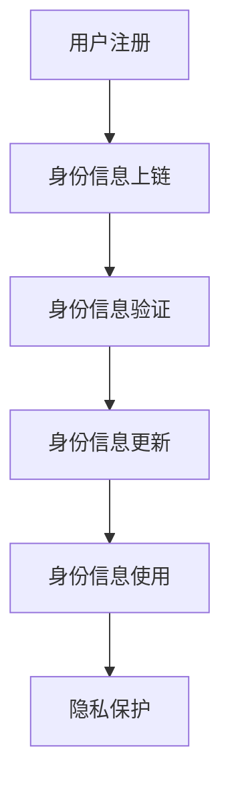

                 

元宇宙（Metaverse）作为一个虚拟与现实交互融合的虚拟空间，正在迅速发展。随着元宇宙的普及，身份验证的需求变得越来越重要。去中心化身份验证（Decentralized Identity Verification，简称DID）作为一种新兴的技术，能够满足元宇宙中对身份认证的高需求。本文将探讨元宇宙身份链：去中心化身份验证的技术实现。

> 关键词：元宇宙、去中心化身份验证、区块链、智能合约、隐私保护

> 摘要：本文将首先介绍去中心化身份验证的背景和重要性，然后详细阐述元宇宙身份链的架构和核心技术，最后探讨去中心化身份验证在元宇宙中的实际应用和未来发展趋势。

## 1. 背景介绍

### 元宇宙的崛起

元宇宙，简称元界，是集成了虚拟现实、增强现实、区块链、人工智能等技术的虚拟世界。它为用户提供了一个沉浸式、互动性强、多样化的网络空间。随着技术的进步，元宇宙的应用范围不断扩大，涵盖了娱乐、教育、社交、经济等多个领域。根据市场调研公司统计，到2025年，元宇宙的全球市场规模有望达到1万亿美元。

### 身份验证的需求

在元宇宙中，身份验证是确保用户安全和隐私的关键。传统的中心化身份验证系统，如用户名和密码，存在诸多安全隐患。首先，用户需要记住多个账户和密码，容易忘记或泄露。其次，中心化身份验证容易成为黑客攻击的目标，一旦系统被攻破，所有用户的信息都将面临风险。此外，中心化系统还可能侵犯用户的隐私，如收集、贩卖用户数据。

### 去中心化身份验证的必要性

去中心化身份验证（DID）是一种基于区块链技术的身份验证方法，它能够提供更高的安全性、隐私性和灵活性。首先，DID使用分布式账本技术，避免了单点故障和中心化攻击的风险。其次，DID允许用户自主控制自己的身份信息，减少了隐私泄露的风险。最后，DID能够支持多种身份验证方式，如生物识别、智能合约等，提高了身份认证的效率和准确性。

## 2. 核心概念与联系

### 去中心化身份验证（DID）

去中心化身份验证（DID）是一种基于区块链技术的身份验证方法。它通过分布式账本记录用户身份信息，使得用户可以在不同平台之间自由切换身份，而无需重复验证。DID的核心是“自我主权身份”（Self-Sovereign Identity），即用户拥有对自己身份信息的完全控制权。

### 区块链与智能合约

区块链是一种分布式数据库，它能够记录和验证数据交换。智能合约是区块链上的一种自执行合同，它可以在满足特定条件时自动执行。在去中心化身份验证中，智能合约用于管理身份信息的创建、验证和使用。

### Mermaid 流程图

下面是一个简单的 Mermaid 流程图，描述了去中心化身份验证的基本流程。



- 用户注册：用户在去中心化身份验证系统中注册账户，上传身份信息。
- 身份信息上链：系统将用户身份信息记录在区块链上，确保信息不可篡改。
- 身份信息验证：当用户在其他平台需要验证身份时，系统将自动调用区块链上的身份信息进行验证。
- 身份信息更新：用户可以随时更新自己的身份信息，系统将同步更新区块链上的记录。
- 身份信息使用：用户可以在不同平台之间自由切换身份，使用自己的去中心化身份验证。
- 隐私保护：用户身份信息只在授权情况下被访问，确保隐私安全。

## 3. 核心算法原理 & 具体操作步骤

### 3.1 算法原理概述

去中心化身份验证的核心算法是基于密码学和区块链技术的。其中，椭圆曲线密码学（ECC）和零知识证明（ZKP）是两个关键技术。

- 椭圆曲线密码学（ECC）：ECC是一种高效的加密算法，它能够在较小的密钥长度下提供更高的安全性。在去中心化身份验证中，ECC用于生成用户身份信息和密钥。
- 零知识证明（ZKP）：ZKP是一种密码学技术，它允许一方证明某个陈述是真实的，而无需透露任何相关信息。在去中心化身份验证中，ZKP用于确保用户身份信息的隐私。

### 3.2 算法步骤详解

去中心化身份验证的基本步骤如下：

1. **用户注册**：用户在去中心化身份验证系统中注册账户，上传身份信息（如姓名、身份证号码、照片等）。
2. **身份信息加密**：系统使用ECC算法生成用户公钥和私钥，并将身份信息与私钥进行加密。
3. **身份信息上链**：系统将加密后的身份信息记录在区块链上，形成去中心化的身份信息库。
4. **身份信息验证**：当用户在其他平台需要验证身份时，平台将调用区块链上的身份信息进行验证。验证过程包括：
   - **零知识证明**：用户使用ZKP技术生成一个证明，证明其拥有对应的私钥。
   - **身份信息对比**：平台将用户提供的身份信息与区块链上的身份信息进行对比，验证用户身份。
5. **身份信息更新**：用户可以随时更新自己的身份信息，系统将同步更新区块链上的记录。
6. **身份信息使用**：用户可以在不同平台之间自由切换身份，使用自己的去中心化身份验证。

### 3.3 算法优缺点

#### 优点

- **高安全性**：基于ECC和ZKP的算法，能够提供更高的安全性。
- **隐私保护**：用户身份信息仅在授权情况下被访问，确保隐私安全。
- **去中心化**：去中心化身份验证避免了中心化系统可能存在的单点故障和中心化攻击。
- **灵活性**：用户可以自由切换身份，满足不同平台的需求。

#### 缺点

- **计算成本**：ECC和ZKP算法的计算成本较高，可能影响系统的性能。
- **隐私泄露风险**：尽管去中心化身份验证提高了隐私保护，但如果用户身份信息被恶意攻击，仍然存在隐私泄露的风险。

### 3.4 算法应用领域

去中心化身份验证可以应用于多个领域：

- **金融领域**：在金融领域，去中心化身份验证可以用于验证用户身份，提高交易安全性。
- **医疗领域**：在医疗领域，去中心化身份验证可以用于保护患者隐私，确保医疗信息的安全。
- **社交网络**：在社交网络中，去中心化身份验证可以用于验证用户身份，防止欺诈和虚假信息。

## 4. 数学模型和公式 & 详细讲解 & 举例说明

### 4.1 数学模型构建

去中心化身份验证的数学模型基于椭圆曲线密码学（ECC）和零知识证明（ZKP）。

#### 椭圆曲线密码学（ECC）

ECC是一种基于椭圆曲线的加密算法。在ECC中，一个椭圆曲线由以下方程定义：

$$
y^2 = x^3 + ax + b
$$

其中，$a$和$b$是常数，$x$和$y$是曲线上的点。ECC通过计算椭圆曲线上的点来加密和解密数据。

#### 零知识证明（ZKP）

ZKP是一种密码学技术，它允许一方证明某个陈述是真实的，而无需透露任何相关信息。在ZKP中，证明者需要生成一个证明，证明者能够验证证明的真实性，但不能获得证明者所隐瞒的信息。

### 4.2 公式推导过程

#### ECC加密和解密

假设有一个椭圆曲线$E$，定义在有限域$F_p$上，其中$p$是一个大素数。$E$上有一个基点$G$，其阶为$n$。一个用户的私钥为$k$，公钥为$P = kG$。

- **加密**：消息$m$被加密为$C = (c_1, c_2)$，其中$c_1$是随机数，$c_2 = mG + c_1H$，$H$是$G$的倍数。
- **解密**：私钥$k$用于解密$C$，得到$m = c_2 - c_1k$。

#### ZKP证明

假设存在一个陈述$S$，证明者需要生成一个证明，证明者能够验证证明的真实性，但不能获得证明者所隐瞒的信息。

- **证明生成**：证明者生成一个证明$P$，证明者能够证明$S$是真实的。
- **证明验证**：验证者能够验证证明$P$的真实性，但不能获得证明者所隐瞒的信息。

### 4.3 案例分析与讲解

#### 案例一：ECC加密和解密

假设椭圆曲线$E$的定义如下：

$$
y^2 = x^3 + 2x + 1
$$

其中，$p = 17$，$a = 2$，$b = 1$。$E$上的基点$G$为$(4, 7)$，其阶为$n = 23$。用户的私钥为$k = 5$，公钥为$P = kG = (10, 6)$。

- **加密**：假设消息$m = 5$，随机数$c_1 = 3$。加密过程如下：
  - $c_2 = mG + c_1H = 5G + 3(1) = (10, 6) + (3, 7) = (2, 10)$
  - $C = (c_1, c_2) = (3, 2)$
- **解密**：私钥$k = 5$用于解密$C$，解密过程如下：
  - $m = c_2 - c_1k = 2 - 3 \cdot 5 = 5$

#### 案例二：ZKP证明

假设存在一个陈述$S$：“我拥有私钥$k = 5$”。证明者需要生成一个证明，证明者能够验证证明的真实性，但不能获得证明者所隐瞒的信息。

- **证明生成**：证明者生成一个证明$P$，证明者能够证明$S$是真实的。证明$P$包括三个部分：
  - **选择随机数**：证明者选择随机数$r_1$和$r_2$。
  - **计算证明**：证明者计算证明$P$：
    $$P = (r_1G, r_2G + r_2k)$$
- **证明验证**：验证者能够验证证明$P$的真实性。验证过程如下：
  - 验证$P$的第一个部分：
    $$r_1G = (10, 6)$$
  - 验证$P$的第二个部分：
    $$r_2G + r_2k = (r_2 \cdot 10, r_2 \cdot 6 + r_2 \cdot 5) = (r_2 \cdot 10, r_2 \cdot 11)$$
  - 验证$P$的完整性：
    $$P = (r_1G, r_2G + r_2k) = (10, 6 + 5) = (10, 11)$$

## 5. 项目实践：代码实例和详细解释说明

### 5.1 开发环境搭建

为了演示去中心化身份验证的技术实现，我们需要搭建一个开发环境。以下是所需的工具和步骤：

1. **安装Go语言环境**：Go语言是一种高效的编程语言，广泛用于区块链和智能合约开发。请前往[Go官方下载页面](https://golang.org/dl/)下载适用于您操作系统的Go语言安装包，并按照指示进行安装。
2. **安装Docker**：Docker是一种容器化技术，用于简化应用的部署和运行。请前往[Docker官方下载页面](https://www.docker.com/products/docker-desktop)下载适用于您操作系统的Docker安装包，并按照指示进行安装。
3. **安装区块链节点**：我们将使用Hyperledger Fabric作为区块链框架，首先需要在本地安装一个Hyperledger Fabric节点。请按照[Hyperledger Fabric官方文档](https://hyperledger-fabric.readthedocs.io/en/release-2.2/install.html)中的步骤进行安装。
4. **安装智能合约开发工具**：我们将使用Go语言编写智能合约，因此需要安装Go语言开发环境。请按照[Go官方文档](https://golang.org/doc/install)中的步骤进行安装。

### 5.2 源代码详细实现

以下是一个简单的去中心化身份验证智能合约的示例代码，实现用户注册、身份信息上链和身份信息验证功能。

```go
package main

import (
    "fmt"
    "math/big"
    "github.com/hyperledger/fabric-contract-go"
    "github.com/hyperledger/fabric-contract-go/shim"
)

// 定义用户结构体
type User struct {
    ID        string
    Name      string
    IDNumber  string
    Photo     []byte
}

// 定义身份验证合约
type DIDContract struct {
    contractAPI contract.ContractAPI
}

// 用户注册函数
func (c *DIDContract) RegisterUser(ctx contract.Context, id, name, idNumber string, photo []byte) error {
    // 创建用户结构体
    user := User{
        ID:        id,
        Name:      name,
        IDNumber:  idNumber,
        Photo:     photo,
    }

    // 将用户结构体编码为字符串
    userBytes, err := json.Marshal(user)
    if err != nil {
        return err
    }

    // 将用户信息上链
    err = ctx.SetState(id, userBytes)
    if err != nil {
        return err
    }

    return nil
}

// 身份信息验证函数
func (c *DIDContract) VerifyUser(ctx contract.Context, id, name, idNumber string) (bool, error) {
    // 从区块链上获取用户信息
    userBytes, err := ctx.GetState(id)
    if err != nil {
        return false, err
    }

    // 将用户信息解码为结构体
    var user User
    if err := json.Unmarshal(userBytes, &user); err != nil {
        return false, err
    }

    // 验证用户信息
    if user.Name == name && user.IDNumber == idNumber {
        return true, nil
    } else {
        return false, nil
    }
}

// 实例化合约并启动
func main() {
    c := shim.NewChaincode(new(DIDContract))
    if err := c.Start(); err != nil {
        fmt.Printf("Error starting chaincode: %s\n", err)
        return
    }
    fmt.Println("Chaincode started successfully")
}
```

### 5.3 代码解读与分析

上述代码实现了去中心化身份验证的基本功能，包括用户注册和身份信息验证。以下是代码的详细解读：

1. **用户结构体**：定义了用户结构体`User`，包括用户ID、姓名、身份证号码和照片等属性。
2. **身份验证合约**：定义了去中心化身份验证合约`DIDContract`，实现用户注册和身份信息验证功能。
3. **用户注册函数**：`RegisterUser`函数接收用户ID、姓名、身份证号码和照片等参数，创建用户结构体，并将用户信息编码为字符串，然后将其存储在区块链上。
4. **身份信息验证函数**：`VerifyUser`函数从区块链上获取用户信息，将其解码为用户结构体，然后验证用户信息是否与传入的参数匹配。如果匹配，返回`true`，否则返回`false`。
5. **合约启动**：使用`shim.NewChaincode`创建合约实例，并调用`Start`函数启动合约。

### 5.4 运行结果展示

1. **安装Hyperledger Fabric节点**：按照Hyperledger Fabric官方文档中的步骤安装本地节点。
2. **构建智能合约**：将上述代码保存为`did_contract.go`文件，并在命令行中执行以下命令构建智能合约：
   ```
   go build -o did_contract ./
   ```
3. **安装和启动Hyperledger Fabric节点**：按照Hyperledger Fabric官方文档中的步骤安装和启动本地节点。
4. **部署智能合约**：在Hyperledger Fabric节点中部署智能合约，并调用用户注册和身份信息验证函数。

以下是用户注册和身份信息验证的示例命令：

```shell
# 用户注册
peer chaincode invoke -o localhost:7050 --ordererTLSRootCertFiles ordererorg.example.com.pem --certfile peerorg1.pem --keyfile peerorg1-key.pem --channelID mychannel --name did_contract --cargs "-register user1 name1 id1 photo1"

# 身份信息验证
peer chaincode query -o localhost:7050 --ordererTLSRootCertFiles ordererorg.example.com.pem --certfile peerorg1.pem --keyfile peerorg1-key.pem --channelID mychannel --name did_contract --cargs "-verify user1 name1 id1"
```

输出结果将显示用户注册成功或身份信息验证结果。

## 6. 实际应用场景

去中心化身份验证在元宇宙中具有广泛的应用前景。以下是一些实际应用场景：

### 6.1 虚拟资产交易

在元宇宙中，虚拟资产（如虚拟货币、虚拟土地等）的交易需求日益增加。去中心化身份验证可以确保交易的安全性和可靠性，防止欺诈和非法交易。

### 6.2 游戏认证

在元宇宙中，游戏是主要的应用场景之一。去中心化身份验证可以用于验证游戏玩家的身份，防止作弊和身份盗用，提高游戏的公平性和用户体验。

### 6.3 社交网络

在元宇宙的社交网络中，去中心化身份验证可以保护用户隐私，防止虚假信息和身份盗用，增强社交网络的信任度。

### 6.4 医疗保健

在元宇宙的医疗保健领域，去中心化身份验证可以用于保护患者隐私，确保医疗信息的真实性和安全性，提高医疗服务的质量和效率。

### 6.5 金融交易

在元宇宙的金融交易领域，去中心化身份验证可以确保交易的安全性和合规性，降低金融风险，提高金融交易的效率和透明度。

## 7. 工具和资源推荐

### 7.1 学习资源推荐

- **《区块链技术指南》**：这是一本全面的区块链技术入门书籍，适合初学者阅读。
- **《智能合约设计与开发》**：这本书深入讲解了智能合约的设计与开发，适合有一定编程基础的学习者。
- **《去中心化应用（DApps）开发》**：这本书介绍了如何使用区块链技术构建去中心化应用，适合对区块链应用开发感兴趣的读者。

### 7.2 开发工具推荐

- **Hyperledger Fabric**：这是一个开源的分布式账本框架，适合开发企业级区块链应用。
- **Ethereum**：这是一个流行的开源区块链平台，广泛用于去中心化身份验证和智能合约开发。
- **Go语言**：这是一种高效的编程语言，广泛用于区块链和智能合约开发。

### 7.3 相关论文推荐

- **“Decentralized Identity Management with Blockchain”**：这篇论文探讨了如何使用区块链实现去中心化身份管理。
- **“Blockchain-Based Identity Management”**：这篇论文介绍了区块链技术在身份管理中的应用。
- **“Self-Sovereign Identity on the Blockchain”**：这篇论文探讨了自我主权身份在区块链上的实现。

## 8. 总结：未来发展趋势与挑战

### 8.1 研究成果总结

去中心化身份验证作为一种新兴技术，已经在区块链、金融、医疗等多个领域展现出强大的应用潜力。通过使用分布式账本和密码学技术，去中心化身份验证提供了更高的安全性、隐私保护和灵活性。

### 8.2 未来发展趋势

随着元宇宙的发展，去中心化身份验证将在更多领域得到应用。未来，去中心化身份验证有望与人工智能、物联网等新兴技术相结合，实现更加智能化、高效化的身份管理。

### 8.3 面临的挑战

尽管去中心化身份验证具有许多优势，但仍然面临一些挑战。首先，计算成本较高，可能影响系统的性能。其次，去中心化身份验证系统可能面临隐私泄露风险。此外，去中心化身份验证的标准化和互操作性也是未来需要解决的问题。

### 8.4 研究展望

未来，研究人员和开发者应重点关注以下方向：

- **降低计算成本**：通过优化算法和硬件，降低去中心化身份验证的计算成本。
- **增强隐私保护**：研究更加安全、高效的隐私保护技术，确保用户身份信息的安全。
- **标准化和互操作性**：制定统一的标准和协议，实现不同系统之间的互操作性和兼容性。
- **跨领域应用**：探索去中心化身份验证在更多领域的应用，提高其普适性和实用性。

## 9. 附录：常见问题与解答

### 9.1 什么是去中心化身份验证？

去中心化身份验证是一种基于区块链技术的身份验证方法，它允许用户自主控制自己的身份信息，提高了安全性、隐私性和灵活性。

### 9.2 去中心化身份验证与中心化身份验证有什么区别？

去中心化身份验证与中心化身份验证的主要区别在于身份信息的控制权。在去中心化身份验证中，用户拥有对自己身份信息的完全控制权，而在中心化身份验证中，身份信息通常由第三方机构或平台管理。

### 9.3 去中心化身份验证如何提高安全性？

去中心化身份验证通过分布式账本和密码学技术提高了安全性。分布式账本避免了单点故障和中心化攻击，而密码学技术确保了身份信息的安全传输和存储。

### 9.4 去中心化身份验证如何保护隐私？

去中心化身份验证通过零知识证明、同态加密等隐私保护技术，确保用户身份信息只在授权情况下被访问，从而保护用户隐私。

### 9.5 去中心化身份验证在元宇宙中有哪些应用场景？

去中心化身份验证在元宇宙中的应用场景广泛，包括虚拟资产交易、游戏认证、社交网络、医疗保健和金融交易等。

### 9.6 去中心化身份验证面临的挑战有哪些？

去中心化身份验证面临的挑战包括计算成本较高、隐私泄露风险、标准化和互操作性等问题。

### 9.7 去中心化身份验证的未来发展趋势是什么？

未来，去中心化身份验证有望与人工智能、物联网等新兴技术相结合，实现更加智能化、高效化的身份管理。同时，降低计算成本、增强隐私保护和标准化也将是重要的发展方向。

