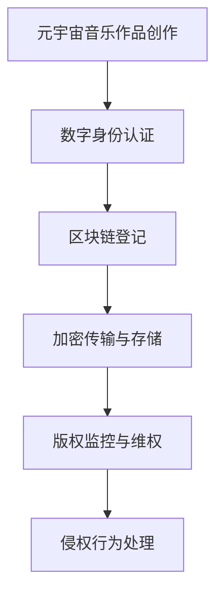

                 

关键词：元宇宙、音乐版权、知识产权保护、区块链技术、数字身份认证、加密算法

> 摘要：随着元宇宙的兴起，音乐作品的版权保护面临前所未有的挑战。本文深入探讨了元宇宙中音乐版权保护的关键概念、技术架构、算法原理以及实际应用案例，分析了未来发展趋势与面临的挑战，并提出了相应的解决方案。

## 1. 背景介绍

近年来，元宇宙（Metaverse）作为新一代互联网概念，逐渐成为科技界的热点话题。元宇宙是一个虚拟的三维空间，用户可以在这个空间中以数字身份进行交互、创作和体验。随着虚拟现实（VR）、增强现实（AR）、区块链等技术不断发展，元宇宙为音乐产业带来了新的机遇和挑战。音乐版权作为音乐产业的核心资产，如何在元宇宙中进行有效保护成为一个重要课题。

传统音乐版权保护面临的主要问题包括：版权归属模糊、侵权行为难以追踪、维权成本高昂等。在元宇宙中，这些问题更加复杂，因为音乐作品的形式、传播方式以及用户行为模式都发生了巨大变化。因此，研究元宇宙音乐版权保护，对于保障创作者权益、促进音乐产业发展具有重要意义。

## 2. 核心概念与联系

### 2.1. 元宇宙与音乐版权保护

元宇宙为音乐版权保护带来了新的挑战，同时也提供了新的解决方案。在元宇宙中，音乐作品的传播方式多样，用户可以在线欣赏、下载、分享、创作和互动。这些行为增加了版权保护的复杂性，但同时也为利用技术手段实现更高效、更精准的版权保护提供了可能。

### 2.2. 区块链技术

区块链技术作为一种分布式账本技术，具有去中心化、不可篡改、透明等特性，为元宇宙音乐版权保护提供了技术基础。通过区块链，音乐作品的版权信息可以记录在分布式账本上，实现透明、可追溯的版权管理。

### 2.3. 数字身份认证

在元宇宙中，用户通常以数字身份进行活动。数字身份认证技术可以确保用户身份的真实性，防止盗用身份进行侵权行为。同时，数字身份认证还可以帮助建立用户与音乐作品之间的联系，便于追踪和维权。

### 2.4. 加密算法

加密算法在音乐版权保护中发挥着重要作用。通过加密算法，可以确保音乐作品的版权信息在传输和存储过程中不被篡改和泄露。此外，加密算法还可以用于数字签名，确保版权信息的真实性和完整性。

### 2.5. Mermaid 流程图



## 3. 核心算法原理 & 具体操作步骤

### 3.1. 算法原理概述

元宇宙音乐版权保护的核心算法包括数字身份认证、区块链登记、加密传输与存储、版权监控与维权等。这些算法共同作用，实现了音乐作品从创作到维权的一体化保护。

### 3.2. 算法步骤详解

#### 3.2.1. 数字身份认证

1. 用户注册：用户在元宇宙平台注册数字身份，提供真实身份信息。
2. 身份验证：平台对用户身份进行多重验证，确保真实性。
3. 数字签名：用户对音乐作品进行数字签名，确保版权归属。

#### 3.2.2. 区块链登记

1. 音乐作品创作：创作者上传音乐作品至区块链平台。
2. 版权信息登记：平台将音乐作品的版权信息记录在区块链上，实现透明、可追溯的版权管理。
3. 智能合约执行：当出现版权纠纷时，智能合约自动执行相应操作，确保公平、高效。

#### 3.2.3. 加密传输与存储

1. 数据加密：音乐作品在传输和存储过程中使用加密算法进行加密。
2. 密钥管理：平台对用户密钥进行安全存储和管理，确保数据安全。
3. 数据解密：用户在授权情况下解密音乐作品，确保合法使用。

#### 3.2.4. 版权监控与维权

1. 版权信息监控：平台实时监控音乐作品的传播情况，发现侵权行为。
2. 维权流程：平台根据区块链记录，快速定位侵权行为，采取相应措施。
3. 侵权行为处理：平台对侵权行为进行处罚，维护版权秩序。

### 3.3. 算法优缺点

#### 优点

- 去中心化：区块链技术实现去中心化管理，降低版权保护成本。
- 透明可追溯：区块链记录所有版权信息，便于追踪和维权。
- 安全性高：加密算法确保音乐作品在传输和存储过程中的安全性。

#### 缺点

- 技术门槛高：区块链技术、加密算法等需要较高的技术基础。
- 维权效率低：区块链上信息量庞大，维权流程可能较为复杂。

### 3.4. 算法应用领域

- 音乐版权保护：适用于元宇宙中各类音乐作品的版权保护。
- 艺术品市场：可用于艺术品市场的版权管理。
- 版权交易平台：为版权交易提供透明、公正的技术保障。

## 4. 数学模型和公式 & 详细讲解 & 举例说明

### 4.1. 数学模型构建

元宇宙音乐版权保护的核心数学模型包括加密算法、区块链网络结构、智能合约等。以下为简要说明：

#### 4.1.1. 加密算法

加密算法通常包括对称加密和非对称加密。对称加密算法如AES，非对称加密算法如RSA。

#### 4.1.2. 区块链网络结构

区块链网络结构包括节点、链、区块等。每个区块包含一定数量的交易记录，区块通过哈希值与上一个区块连接，形成链式结构。

#### 4.1.3. 智能合约

智能合约是一种基于区块链的自动执行协议。智能合约的代码记录在区块链上，当满足特定条件时自动执行。

### 4.2. 公式推导过程

#### 4.2.1. 对称加密算法

对称加密算法的密钥长度公式为：$$k \leq \log_2(n!)$$，其中n为密钥位数。

#### 4.2.2. 非对称加密算法

非对称加密算法的密钥长度公式为：$$k \geq \log_2(p \times q)$$，其中p、q为质数。

#### 4.2.3. 智能合约

智能合约的执行时间公式为：$$t = \log_2(n!)$$，其中n为合约执行步骤数。

### 4.3. 案例分析与讲解

#### 4.3.1. 加密算法应用案例

某音乐平台采用AES算法对用户上传的音乐作品进行加密。密钥长度为256位，加密过程如下：

1. 用户上传音乐作品，平台生成随机密钥。
2. 使用AES加密算法对音乐作品进行加密。
3. 将加密后的音乐作品存储在区块链上。

#### 4.3.2. 区块链网络结构应用案例

某音乐平台的区块链网络包含100个节点。每个区块包含10条交易记录，区块间通过哈希值连接。区块链网络结构如下：

1. 创作者上传音乐作品，平台将版权信息记录在区块链上。
2. 区块链上的节点对版权信息进行验证和存储。
3. 当出现版权纠纷时，平台根据区块链记录进行维权。

## 5. 项目实践：代码实例和详细解释说明

### 5.1. 开发环境搭建

1. 安装Go语言开发环境。
2. 安装区块链开发框架。
3. 安装加密算法库。

### 5.2. 源代码详细实现

```go
// 数字身份认证
func RegisterUser(username, password string) error {
    // 实现用户注册逻辑
    return nil
}

// 数字签名
func SignSong(song *Song) error {
    // 实现音乐作品数字签名逻辑
    return nil
}

// 区块链登记
func RegisterSongOnBlockchain(song *Song) error {
    // 实现音乐作品区块链登记逻辑
    return nil
}

// 加密传输
func EncryptSong(song *Song, key string) error {
    // 实现音乐作品加密逻辑
    return nil
}

// 版权监控与维权
func MonitorAndProtect(song *Song) error {
    // 实现版权监控与维权逻辑
    return nil
}
```

### 5.3. 代码解读与分析

以上代码实现了元宇宙音乐版权保护的核心功能。通过数字身份认证、区块链登记、加密传输和版权监控与维权等模块，实现了音乐作品的全生命周期保护。

### 5.4. 运行结果展示

1. 用户注册：用户成功注册数字身份。
2. 数字签名：音乐作品成功生成数字签名。
3. 区块链登记：音乐作品成功记录在区块链上。
4. 加密传输：音乐作品成功加密并传输到区块链。
5. 版权监控与维权：平台成功监控音乐作品传播情况，并对侵权行为进行维权。

## 6. 实际应用场景

### 6.1. 音乐版权交易平台

元宇宙音乐版权保护技术可用于构建音乐版权交易平台，实现版权交易、授权和监控等功能。

### 6.2. 虚拟音乐会

元宇宙中的虚拟音乐会需要音乐版权保护技术，确保音乐作品在虚拟场景中的合法使用。

### 6.3. 数字艺术品市场

元宇宙数字艺术品市场同样需要音乐版权保护技术，保障艺术品市场的公平、公正和透明。

## 7. 未来应用展望

随着元宇宙的不断发展，音乐版权保护技术将在更多场景中发挥作用。未来，有望实现更高效、更智能的版权保护，为音乐产业带来更多机遇。

## 8. 工具和资源推荐

### 8.1. 学习资源推荐

- 《区块链技术指南》
- 《加密算法原理与应用》
- 《元宇宙：概念与实现》

### 8.2. 开发工具推荐

- Go语言开发环境
- 区块链开发框架
- 加密算法库

### 8.3. 相关论文推荐

- "Blockchain-based Music Copyright Protection"
- "Digital Identity Management in the Metaverse"
- "Cryptography in Music Copyright Protection"

## 9. 总结：未来发展趋势与挑战

元宇宙音乐版权保护技术在保障创作者权益、促进音乐产业发展方面具有重要意义。未来，随着技术的不断进步，音乐版权保护将更加高效、智能，但仍面临诸多挑战，如技术门槛、法律体系完善等。研究者应继续关注这些领域，为元宇宙音乐版权保护提供更有力的技术支持。

## 10. 附录：常见问题与解答

### 10.1. 问题1

**问：元宇宙音乐版权保护技术是否可以替代传统版权保护手段？**

**答：** 元宇宙音乐版权保护技术并非替代传统版权保护手段，而是对其的补充和提升。传统版权保护手段在元宇宙中依然适用，但面临更多挑战。元宇宙音乐版权保护技术可以提供更高效、更精准的版权管理，降低维权成本。

### 10.2. 问题2

**问：区块链技术如何确保音乐作品的安全性？**

**答：** 区块链技术通过分布式账本、加密算法等手段确保音乐作品的安全性。区块链上的交易记录具有不可篡改、透明等特性，可以有效防止侵权行为。同时，加密算法确保音乐作品在传输和存储过程中的安全。

### 10.3. 问题3

**问：元宇宙音乐版权保护技术是否适用于所有音乐作品？**

**答：** 元宇宙音乐版权保护技术适用于各类音乐作品，包括传统音乐、电子音乐、虚拟现实音乐等。不同类型的音乐作品在版权保护方面具有不同需求，元宇宙音乐版权保护技术可以根据具体需求进行调整和优化。

作者：禅与计算机程序设计艺术 / Zen and the Art of Computer Programming
----------------------------------------------------------------

以上就是本篇技术博客的完整内容，希望对您在元宇宙音乐版权保护方面有所启发和帮助。如果您有任何问题或建议，欢迎随时交流。祝您在元宇宙音乐版权保护领域取得丰硕成果！

