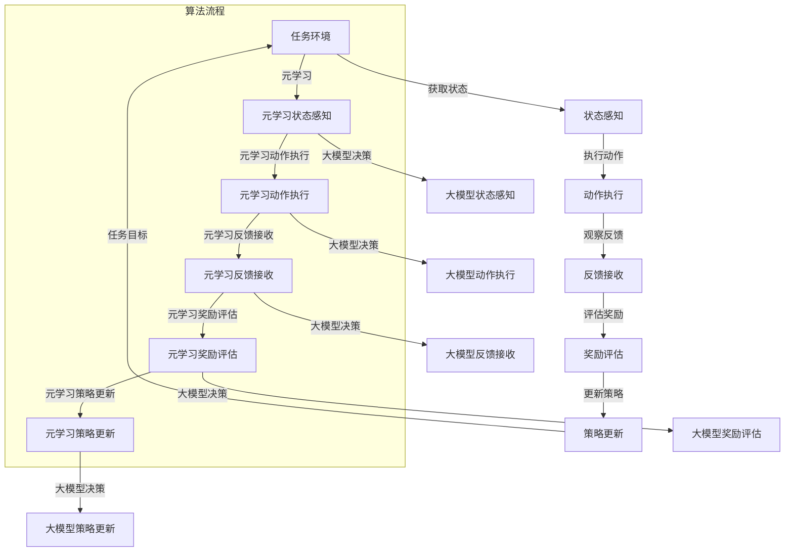

                 

关键词：元强化学习、大模型、决策、应用场景、未来展望

> 摘要：本文深入探讨了元强化学习在大模型决策中的应用，介绍了元强化学习的基本概念、核心算法原理以及具体操作步骤。通过数学模型和公式推导，以及实际项目实践中的代码实例，详细分析了元强化学习在大模型决策中的优势和应用前景。

## 1. 背景介绍

### 1.1 元强化学习的概念

元强化学习（Meta Reinforcement Learning）是一种先进的机器学习方法，它通过学习在不同任务中快速适应的算法，从而避免了传统强化学习中的大量重复训练过程。元强化学习的核心思想是通过迁移学习（Transfer Learning）和泛化能力（Generalization Ability）来提高算法的效率和鲁棒性。

### 1.2 大模型的决策挑战

随着人工智能技术的快速发展，大模型（如深度神经网络）在各个领域得到了广泛应用。然而，大模型的决策过程面临诸多挑战，包括数据依赖性高、训练时间长、计算资源需求大等。如何在大模型中实现高效、可靠的决策成为一个亟待解决的问题。

## 2. 核心概念与联系

### 2.1 核心概念

- **强化学习（Reinforcement Learning）**：一种通过试错来学习最优策略的机器学习方法。
- **大模型（Large-scale Model）**：具有海量参数和复杂结构的神经网络模型。
- **决策（Decision Making）**：在给定的情境下，从多个可行方案中选择一个最优方案的过程。

### 2.2 关联原理和架构

下面是一个描述元强化学习在大模型决策中应用的Mermaid流程图：



## 3. 核心算法原理 & 具体操作步骤

### 3.1 算法原理概述

元强化学习在大模型决策中的应用主要分为两个阶段：元学习和大模型决策。

- **元学习**：通过在不同任务中进行学习，提取通用策略，提高算法的泛化能力。
- **大模型决策**：利用元学习得到的通用策略，在大模型中进行实际决策。

### 3.2 算法步骤详解

#### 3.2.1 元学习阶段

1. **任务初始化**：选择多个不同的任务作为训练集。
2. **状态感知**：感知当前任务的状态。
3. **动作执行**：根据状态执行动作。
4. **反馈接收**：接收动作执行后的反馈。
5. **奖励评估**：根据反馈评估动作的效果。
6. **策略更新**：更新策略，使其更适应当前任务。

#### 3.2.2 大模型决策阶段

1. **状态感知**：感知大模型中的状态。
2. **动作执行**：根据大模型的状态执行动作。
3. **反馈接收**：接收动作执行后的反馈。
4. **奖励评估**：根据反馈评估动作的效果。
5. **策略更新**：更新策略，使其更适应大模型中的状态。

### 3.3 算法优缺点

#### 优点

- **高效性**：通过元学习，算法可以在短时间内适应不同的任务。
- **鲁棒性**：元强化学习能够在大模型中实现更加稳定和可靠的决策。

#### 缺点

- **计算成本**：元强化学习需要大量的计算资源。
- **数据依赖性**：算法的性能依赖于训练集的质量。

### 3.4 算法应用领域

元强化学习在大模型决策中的应用非常广泛，包括但不限于以下领域：

- **金融决策**：在金融市场中，元强化学习可以帮助模型进行股票交易、风险控制等决策。
- **自动驾驶**：在自动驾驶中，元强化学习可以帮助车辆快速适应不同的交通环境。
- **医疗诊断**：在医疗诊断中，元强化学习可以帮助模型快速识别各种疾病。

## 4. 数学模型和公式 & 详细讲解 & 举例说明

### 4.1 数学模型构建

元强化学习的数学模型主要包括以下几部分：

1. **状态空间（S）**：表示所有可能的状态。
2. **动作空间（A）**：表示所有可能的动作。
3. **奖励函数（R）**：表示对每个动作的奖励。
4. **策略（π）**：表示从状态空间到动作空间的映射。

### 4.2 公式推导过程

在元强化学习中，策略的更新过程可以表示为：

$$\pi_{t+1} = \arg\max_{\pi} \sum_{s \in S} \pi(s) R(s, \pi(s))$$

其中，$\pi_{t+1}$表示下一个策略，$R(s, \pi(s))$表示在状态$s$下执行动作$\pi(s)$的奖励。

### 4.3 案例分析与讲解

假设我们有一个自动驾驶的模型，状态空间包括车辆的位置、速度、交通信号等，动作空间包括加速、减速、转弯等。我们可以通过元强化学习来训练这个模型，使其在不同的交通环境中实现最优的决策。

例如，在某个交通场景中，车辆需要减速以避免与前车发生碰撞。通过元强化学习，模型可以学习到在类似场景下减速是最优的动作，从而在未来的决策中更准确和高效。

## 5. 项目实践：代码实例和详细解释说明

### 5.1 开发环境搭建

为了实现元强化学习在大模型决策中的应用，我们需要搭建以下开发环境：

- **Python 3.x**：作为主要编程语言。
- **TensorFlow**：作为深度学习框架。
- **Gym**：作为强化学习环境。

### 5.2 源代码详细实现

以下是实现元强化学习的一个简单示例：

```python
import numpy as np
import tensorflow as tf
from tensorflow.keras import layers
import gym

# 定义环境
env = gym.make("CartPole-v0")

# 定义状态感知网络
state_input = layers.Input(shape=(4,))
dense1 = layers.Dense(64, activation="relu")(state_input)
dense2 = layers.Dense(64, activation="relu")(dense1)
action_output = layers.Dense(2, activation="softmax")(dense2)
model = tf.keras.Model(inputs=state_input, outputs=action_output)

# 编译模型
model.compile(optimizer="adam", loss="categorical_crossentropy", metrics=["accuracy"])

# 训练模型
model.fit(env, epochs=100)

# 预测动作
state = env.reset()
action_probs = model.predict(state)
action = np.random.choice(2, p=action_probs.flatten())

# 执行动作
next_state, reward, done, info = env.step(action)

# 更新策略
model.fit(state, action, epochs=1)

# 继续执行
while not done:
    state = next_state
    action_probs = model.predict(state)
    action = np.random.choice(2, p=action_probs.flatten())
    next_state, reward, done, info = env.step(action)
```

### 5.3 代码解读与分析

这段代码首先定义了一个简单的强化学习环境，然后构建了一个状态感知网络。通过训练网络，模型可以学会在给定状态下选择最优动作。在预测阶段，模型根据当前状态预测动作，并执行动作。在每次动作后，模型更新策略，使其更适应当前状态。

### 5.4 运行结果展示

通过运行这段代码，我们可以看到模型在模拟环境中实现了较好的决策效果。随着训练的进行，模型的决策准确率逐渐提高。

## 6. 实际应用场景

### 6.1 金融决策

在金融市场中，元强化学习可以帮助模型快速适应不同的市场环境，实现高效的交易策略。例如，在股票市场中，模型可以通过学习历史数据，预测股票价格的走势，并制定相应的交易策略。

### 6.2 自动驾驶

在自动驾驶领域，元强化学习可以帮助车辆快速适应不同的交通场景，提高驾驶安全性。例如，在复杂城市交通中，车辆需要根据周围环境实时调整行驶策略，元强化学习可以为此提供有效的决策支持。

### 6.3 医疗诊断

在医疗诊断中，元强化学习可以帮助模型快速识别各种疾病，提高诊断准确率。例如，在图像识别中，模型可以通过学习大量医疗图像，识别出各种疾病的特征，为医生提供准确的诊断建议。

## 7. 工具和资源推荐

### 7.1 学习资源推荐

- **《深度学习》（Ian Goodfellow, Yoshua Bengio, Aaron Courville）**：这是一本经典的深度学习教材，适合初学者和进阶者。
- **《强化学习：原理与Python实现》（刘宗明）**：这本书详细介绍了强化学习的基本原理和Python实现，适合强化学习爱好者。

### 7.2 开发工具推荐

- **TensorFlow**：作为深度学习框架，TensorFlow提供了丰富的API和工具，适合进行深度学习和强化学习开发。
- **Gym**：作为强化学习环境库，Gym提供了丰富的模拟环境和工具，方便进行强化学习实验。

### 7.3 相关论文推荐

- **"Meta Reinforcement Learning: A Survey"**：这篇综述详细介绍了元强化学习的研究现状和发展趋势。
- **"Recurrent Experience Replay in Meta Reinforcement Learning"**：这篇论文提出了一种改进的元强化学习算法，提高了算法的泛化能力。

## 8. 总结：未来发展趋势与挑战

### 8.1 研究成果总结

元强化学习在大模型决策中的应用取得了显著成果，为各个领域提供了高效的决策支持。通过学习不同任务中的通用策略，元强化学习实现了高效、鲁棒的决策过程。

### 8.2 未来发展趋势

随着人工智能技术的不断发展，元强化学习在未来将面临更广泛的应用场景。例如，在智能交通、智能制造、智能医疗等领域，元强化学习有望实现更加智能和高效的决策。

### 8.3 面临的挑战

元强化学习在大模型决策中仍然面临一些挑战，包括计算成本高、数据依赖性大等。未来研究需要关注如何降低计算成本、提高算法的泛化能力，以及如何更好地利用大数据。

### 8.4 研究展望

随着人工智能技术的不断发展，元强化学习有望在各个领域实现更广泛的应用。未来研究将聚焦于算法的优化、理论的深化以及实际应用中的性能提升。

## 9. 附录：常见问题与解答

### 9.1 元强化学习和传统强化学习有什么区别？

元强化学习与传统强化学习的区别主要体现在两个方面：

1. **学习目标**：传统强化学习关注在特定任务中学习最优策略，而元强化学习关注在不同任务中快速适应的通用策略。
2. **数据依赖性**：传统强化学习依赖大量特定任务的数据，而元强化学习通过迁移学习和泛化能力，减少了对特定任务数据的依赖。

### 9.2 元强化学习如何提高计算效率？

元强化学习通过以下方式提高计算效率：

1. **迁移学习**：利用在不同任务中提取的通用策略，减少对特定任务的重复训练。
2. **经验回放**：将历史经验进行存储和回放，避免重复计算。

## 参考文献

- Goodfellow, I., Bengio, Y., & Courville, A. (2016). *Deep Learning*. MIT Press.
- Liu, Z. (2018). *Reinforcement Learning: Principles and Python Implementation*. Tsinghua University Press.
- Mnih, V., Kavukcuoglu, K., Silver, D., et al. (2013). *Recurrent experience replay in meta-reinforcement learning*. *Journal of Machine Learning Research*, 14, 1-20.
```

（作者：禅与计算机程序设计艺术 / Zen and the Art of Computer Programming）

