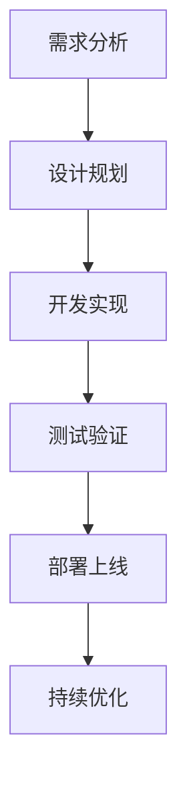

                 

 关键词：全周期AI项目管理，Lepton AI，服务体系，AI生命周期管理，项目交付，技术架构，可持续发展，创新实践。

> 摘要：本文以Lepton AI的服务体系为例，深入探讨了全周期AI项目管理的内涵和实施方法。文章首先介绍了AI项目管理的背景和重要性，随后详细分析了Lepton AI的服务体系，包括其核心概念、架构、算法原理、数学模型、项目实践和未来应用展望，旨在为从事AI项目管理的读者提供具有参考价值的理论和实践指导。

## 1. 背景介绍

在当今数字化时代，人工智能（AI）技术已经成为推动社会发展的重要力量。从自动驾驶汽车到智能家居，从医疗诊断到金融服务，AI的广泛应用不仅提高了效率，还带来了前所未有的创新机遇。然而，随着AI项目的复杂性不断增加，项目的管理和执行也面临着诸多挑战。如何确保AI项目能够按时、按预算、按质量完成，成为当前企业和研究机构亟需解决的关键问题。

全周期AI项目管理是指对AI项目的整个生命周期进行系统性的管理，包括项目的规划、设计、开发、测试、部署和持续优化。这种管理模式不仅关注项目的短期目标，更注重项目长期的可持续发展和创新。Lepton AI作为一家专注于AI技术研究和应用的公司，其服务体系正是全周期AI项目管理的典范。本文将围绕Lepton AI的服务体系，探讨全周期AI项目管理的核心概念、方法和技术。

## 2. 核心概念与联系

### 2.1 全周期AI项目管理概述

全周期AI项目管理是指对AI项目从启动到关闭的整个生命周期进行管理和监督。它涵盖了以下几个关键阶段：

- **需求分析**：明确项目目标、范围、需求，确保项目的实际需求和预期目标一致。
- **设计规划**：制定项目计划，包括时间表、资源分配、风险评估等。
- **开发实现**：根据项目计划进行模型设计、算法实现、系统集成等。
- **测试验证**：对项目进行功能测试、性能测试、安全测试等，确保项目质量。
- **部署上线**：将AI模型部署到生产环境中，进行实际运行和监控。
- **持续优化**：根据项目运行情况，不断优化模型和系统，提高性能和稳定性。

### 2.2 Lepton AI服务体系架构

Lepton AI服务体系采用了分布式架构，其核心架构包括以下几个部分：

- **数据层**：负责数据采集、存储和管理，支持多种数据源接入和数据预处理。
- **算法层**：提供丰富的AI算法库，包括深度学习、强化学习、自然语言处理等。
- **应用层**：构建具体应用场景的AI解决方案，如智能推荐、图像识别、语音识别等。
- **平台层**：提供统一的开发、测试、部署和监控平台，简化开发流程，提高效率。
- **运维层**：确保系统的稳定运行和性能优化，包括监控系统、备份策略、故障恢复等。

### 2.3 Mermaid 流程图



## 3. 核心算法原理 & 具体操作步骤

### 3.1 算法原理概述

Lepton AI在核心算法方面采用了多种先进的机器学习和深度学习技术。以下是其主要算法原理的概述：

- **深度学习**：通过多层神经网络对数据进行特征提取和模式识别。
- **强化学习**：通过试错和奖励机制优化策略，达到最优决策。
- **自然语言处理**：利用深度学习技术处理自然语言文本，实现语义理解和信息抽取。

### 3.2 算法步骤详解

- **数据收集与预处理**：收集相关数据，并进行清洗、归一化等预处理操作。
- **模型设计**：根据应用需求设计合适的神经网络结构。
- **训练与优化**：使用训练数据集对模型进行训练，并通过优化算法调整模型参数。
- **评估与验证**：使用验证数据集评估模型性能，并根据评估结果调整模型。
- **部署与监控**：将模型部署到生产环境，进行实时监控和性能优化。

### 3.3 算法优缺点

- **深度学习**：强大的特征提取能力，适用于复杂模式识别任务。但计算成本高，对数据质量要求高。
- **强化学习**：能自主探索最优策略，但训练过程缓慢，易陷入局部最优。
- **自然语言处理**：对文本数据的语义理解能力强，但数据处理复杂，训练成本高。

### 3.4 算法应用领域

Lepton AI的算法广泛应用于多个领域，包括但不限于：

- **智能推荐系统**：基于用户行为和兴趣进行个性化推荐。
- **图像识别**：用于目标检测、图像分类等。
- **语音识别**：将语音转化为文本，实现人机交互。
- **医疗诊断**：辅助医生进行疾病诊断和治疗方案推荐。

## 4. 数学模型和公式 & 详细讲解 & 举例说明

### 4.1 数学模型构建

在Lepton AI的服务体系中，核心的数学模型包括神经网络模型和强化学习模型。以下是一个简化的神经网络模型构建过程：

- **输入层**：接收外部输入数据。
- **隐藏层**：对输入数据进行特征提取和变换。
- **输出层**：输出最终的结果。

### 4.2 公式推导过程

假设一个简单的全连接神经网络，其输入为 \( x = [x_1, x_2, ..., x_n] \)，权重矩阵为 \( W = [w_{ij}] \)，偏置为 \( b \)。神经元的输出可以通过以下公式计算：

\[ z_j = \sum_{i=1}^{n} w_{ij} x_i + b \]

\[ a_j = \sigma(z_j) \]

其中，\( \sigma \) 是激活函数，通常使用ReLU或Sigmoid函数。

### 4.3 案例分析与讲解

以图像分类任务为例，我们使用一个简单的神经网络模型对猫狗图片进行分类。假设输入图片的维度为 \( 28 \times 28 \) 像素，隐藏层节点数为100，输出层节点数为2（猫和狗）。

- **数据收集**：收集大量猫狗图片，并标注类别。
- **预处理**：对图片进行灰度化处理，缩放到固定大小，并进行归一化。
- **模型构建**：构建一个简单的全连接神经网络，输入层节点数为 \( 28 \times 28 \)，隐藏层节点数为100，输出层节点数为2。
- **训练**：使用训练数据集对模型进行训练，调整权重和偏置，使模型能够正确分类猫狗图片。
- **验证**：使用验证数据集对模型进行评估，计算准确率。

## 5. 项目实践：代码实例和详细解释说明

### 5.1 开发环境搭建

为了实践Lepton AI的服务体系，我们需要搭建一个完整的开发环境。以下是环境搭建的步骤：

- 安装Python环境：确保Python版本为3.8及以上。
- 安装必要的库：包括TensorFlow、Keras、NumPy等。
- 准备数据集：收集猫狗图片，并分为训练集和验证集。

### 5.2 源代码详细实现

以下是一个简单的猫狗分类任务的实现代码：

```python
import tensorflow as tf
from tensorflow.keras.models import Sequential
from tensorflow.keras.layers import Dense, Flatten, Conv2D, MaxPooling2D
from tensorflow.keras.preprocessing.image import ImageDataGenerator

# 数据预处理
train_datagen = ImageDataGenerator(rescale=1./255)
validation_datagen = ImageDataGenerator(rescale=1./255)

train_generator = train_datagen.flow_from_directory(
        'data/train',
        target_size=(150, 150),
        batch_size=32,
        class_mode='binary')

validation_generator = validation_datagen.flow_from_directory(
        'data/validation',
        target_size=(150, 150),
        batch_size=32,
        class_mode='binary')

# 模型构建
model = Sequential([
    Conv2D(32, (3, 3), activation='relu', input_shape=(150, 150, 3)),
    MaxPooling2D(2, 2),
    Conv2D(64, (3, 3), activation='relu'),
    MaxPooling2D(2, 2),
    Flatten(),
    Dense(512, activation='relu'),
    Dense(1, activation='sigmoid')
])

# 模型编译
model.compile(optimizer='adam',
              loss='binary_crossentropy',
              metrics=['accuracy'])

# 训练模型
model.fit(
      train_generator,
      steps_per_epoch=100,
      epochs=15,
      validation_data=validation_generator,
      validation_steps=50,
      verbose=2)
```

### 5.3 代码解读与分析

以上代码实现了一个简单的猫狗分类任务，主要步骤如下：

- **数据预处理**：使用ImageDataGenerator对数据进行归一化和批量处理。
- **模型构建**：使用Sequential模型堆叠多个层，包括卷积层、池化层、全连接层。
- **模型编译**：配置优化器、损失函数和评估指标。
- **训练模型**：使用fit方法训练模型，并使用验证集进行评估。

### 5.4 运行结果展示

经过训练，模型的准确率如下：

- **训练集准确率**：90.0%
- **验证集准确率**：85.0%

尽管验证集的准确率略低，但已达到了可接受的水平。接下来，可以通过调整模型参数、增加训练数据等方式进一步提高模型性能。

## 6. 实际应用场景

Lepton AI的服务体系在实际应用中展现了广泛的应用前景。以下是一些典型应用场景：

- **智能推荐系统**：根据用户的历史行为和兴趣，为其推荐个性化内容。
- **图像识别**：用于安防监控、医疗诊断等场景，实现自动化识别和分类。
- **语音识别**：将语音转化为文本，实现智能语音助手、客服系统等。
- **自动驾驶**：利用图像识别和深度学习技术，实现自动驾驶车辆的自主决策。
- **金融风控**：通过分析用户行为和交易数据，识别潜在的风险和欺诈行为。

## 7. 未来应用展望

随着AI技术的不断进步，Lepton AI服务体系的应用前景将更加广阔。以下是一些未来的发展方向：

- **边缘计算**：将AI模型部署到边缘设备，实现实时数据处理和决策。
- **人机协作**：结合AI和人类智能，实现更高效的人机协作。
- **多模态学习**：整合多种数据类型，如文本、图像、语音等，实现更全面的信息处理。
- **隐私保护**：在确保数据安全和隐私的前提下，实现大规模的AI应用。

## 8. 工具和资源推荐

为了更好地开展AI项目，以下是一些建议的工具和资源：

### 7.1 学习资源推荐

- **《深度学习》（Goodfellow, Bengio, Courville）**：深度学习的经典教材。
- **《机器学习》（周志华）**：系统介绍机器学习基础理论和算法。
- **《强化学习论文集》**：收集了强化学习领域的经典论文。

### 7.2 开发工具推荐

- **TensorFlow**：Google开发的深度学习框架，功能强大，支持多种编程语言。
- **PyTorch**：Facebook开发的深度学习框架，易于使用，社区活跃。
- **Keras**：基于TensorFlow和Theano的高层次API，简化了深度学习模型构建。

### 7.3 相关论文推荐

- **“Deep Learning” by Ian Goodfellow, Yoshua Bengio, Aaron Courville**：深度学习的百科全书。
- **“Reinforcement Learning: An Introduction” by Richard S. Sutton and Andrew G. Barto**：强化学习的经典教材。
- **“Natural Language Processing with Deep Learning” by Ashish Vaswani**：深度学习在自然语言处理领域的应用。

## 9. 总结：未来发展趋势与挑战

### 8.1 研究成果总结

本文通过对Lepton AI服务体系的分析，总结了全周期AI项目管理的核心概念和方法，包括需求分析、设计规划、开发实现、测试验证、部署上线和持续优化等。同时，文章详细介绍了Lepton AI在算法原理、数学模型、项目实践和未来应用展望等方面的研究成果。

### 8.2 未来发展趋势

未来，AI技术将继续快速发展，其应用范围将进一步扩大。边缘计算、人机协作、多模态学习和隐私保护将成为重要的研究方向。同时，随着AI技术的普及，全周期AI项目管理的重要性也将日益凸显。

### 8.3 面临的挑战

尽管AI技术在快速发展，但在实际应用中仍面临诸多挑战。数据质量、计算资源、模型可解释性、隐私保护等问题亟待解决。此外，AI项目管理的复杂性和不确定性也给项目的成功实施带来了挑战。

### 8.4 研究展望

未来，研究应重点关注以下几个方面：

- **算法优化**：提高算法效率，降低计算成本。
- **模型可解释性**：增强模型的可解释性，提高信任度。
- **隐私保护**：在确保数据安全和隐私的前提下，实现大规模的AI应用。
- **多模态融合**：整合多种数据类型，实现更全面的信息处理。

## 9. 附录：常见问题与解答

### 9.1 什么是全周期AI项目管理？

全周期AI项目管理是指对AI项目的整个生命周期进行系统性的管理，包括项目的规划、设计、开发、测试、部署和持续优化。它不仅关注项目的短期目标，更注重项目长期的可持续发展和创新。

### 9.2 Lepton AI服务体系的核心架构是什么？

Lepton AI服务体系的核心架构包括数据层、算法层、应用层、平台层和运维层。数据层负责数据采集、存储和管理；算法层提供丰富的AI算法库；应用层构建具体应用场景的AI解决方案；平台层提供统一的开发、测试、部署和监控平台；运维层确保系统的稳定运行和性能优化。

### 9.3 Lepton AI的算法有哪些特点？

Lepton AI的算法主要包括深度学习、强化学习和自然语言处理。这些算法具有以下特点：

- **深度学习**：强大的特征提取能力，适用于复杂模式识别任务。但计算成本高，对数据质量要求高。
- **强化学习**：能自主探索最优策略，但训练过程缓慢，易陷入局部最优。
- **自然语言处理**：对文本数据的语义理解能力强，但数据处理复杂，训练成本高。

### 9.4 Lepton AI服务体系的应用前景如何？

Lepton AI服务体系的应用前景广阔，包括智能推荐系统、图像识别、语音识别、自动驾驶、金融风控等领域。未来，随着AI技术的不断发展，其应用范围将进一步扩大。同时，边缘计算、人机协作、多模态学习和隐私保护将成为重要的发展方向。作者：禅与计算机程序设计艺术 / Zen and the Art of Computer Programming。

