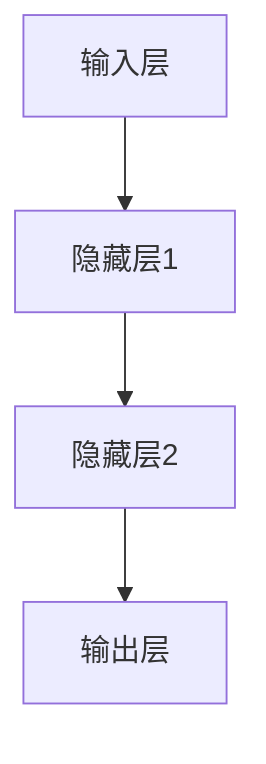

                 

关键词：全球脑，人工智能，共生关系，神经网络，计算生物学，脑-机接口

> 摘要：本文深入探讨了全球脑与人工智能之间的共生关系，分析了人工智能在模拟全球脑功能中的作用，以及全球脑在推动人工智能发展中的贡献。通过阐述核心概念和原理，介绍了相关算法、数学模型及其应用，并通过具体实例展示了全球脑与人工智能在实际项目中的整合与协同作用。最后，本文展望了未来发展趋势与面临的挑战。

## 1. 背景介绍

在当今信息时代，全球脑与人工智能的相互依存关系日益显著。全球脑（Global Brain）这一概念源于信息科学和复杂系统理论，它被视为一个高度互联、智能化的全球信息网络。而人工智能（Artificial Intelligence, AI）则是通过计算机模拟人类智能的一种技术，它已经在诸多领域展现出巨大的潜力。

全球脑的核心思想是，通过互联网等通信技术，全球范围内的个体和设备可以形成一个高度协作的智能系统。人工智能则在这一系统中扮演着至关重要的角色，它利用大数据、机器学习和深度学习等先进技术，对全球脑中的信息进行处理和分析，从而实现智能化决策和优化。

本文旨在探讨全球脑与人工智能的共生关系，分析它们之间的相互作用，并探讨这种关系对未来科技发展的影响。

### 1.1 全球脑的概念与发展

全球脑最早由德国社会学家霍华德·英戈尔斯（Howard Ingrams）提出，他认为全球脑是一个由人类社会和科技网络组成的超级智能体。随着互联网和物联网的普及，全球脑的概念得到了进一步的发展和完善。

全球脑的特征主要包括：

1. **高度互联**：全球脑通过互联网、卫星通信、物联网等现代通信技术实现高度互联，形成一个全球性的信息网络。
2. **智能协作**：全球脑中的个体和设备可以自主协作，共同完成复杂的任务。
3. **动态演化**：全球脑是一个动态演化的系统，它可以自我调整和优化，以适应不断变化的环境。

### 1.2 人工智能的概念与发展

人工智能起源于20世纪50年代，其目标是使计算机能够模拟人类智能。随着计算机性能的不断提升和算法的不断创新，人工智能在各个领域都取得了显著的进展。

人工智能的主要特征包括：

1. **学习与适应**：人工智能系统能够通过学习算法，从数据中提取知识，并适应新环境。
2. **自主决策**：人工智能系统能够在给定的条件下，自主做出决策。
3. **高效处理**：人工智能系统可以处理海量数据，并从中提取有价值的信息。

## 2. 核心概念与联系

在探讨全球脑与人工智能的共生关系时，我们需要了解一些核心概念和它们之间的联系。

### 2.1 神经网络

神经网络是人工智能的重要组成部分，它模拟了人脑的结构和功能。神经网络由大量的节点（神经元）组成，这些节点通过连接（权重）相互连接，形成复杂的网络结构。

神经网络的核心概念包括：

1. **神经元**：神经网络的基石，负责接收和处理信息。
2. **连接**：神经元之间的连接，用于传递信息。
3. **激活函数**：神经元在接收信息后，根据激活函数产生输出。

神经网络的架构和原理可以通过以下Mermaid流程图展示：



### 2.2 计算生物学

计算生物学是生物学和计算机科学的交叉学科，它利用计算方法解决生物学问题。在探讨全球脑与人工智能的关系时，计算生物学提供了重要的工具和理论支持。

计算生物学的主要领域包括：

1. **基因组学**：研究生物体的基因组结构和功能。
2. **蛋白质组学**：研究生物体的蛋白质组成和功能。
3. **代谢组学**：研究生物体的代谢过程。

### 2.3 脑-机接口

脑-机接口（Brain-Computer Interface, BCI）是一种直接连接人脑和外部设备的系统，它使得人脑可以控制外部设备，从而实现与人工智能系统的交互。

脑-机接口的核心概念包括：

1. **信号采集**：通过电极或其他传感器采集人脑信号。
2. **信号处理**：对采集到的信号进行处理，提取有用的信息。
3. **设备控制**：利用处理后的信号控制外部设备。

### 2.4 全球脑与人工智能的相互作用

全球脑与人工智能之间的相互作用主要体现在以下几个方面：

1. **数据共享**：全球脑提供了丰富的数据资源，人工智能系统可以从中提取有价值的信息。
2. **智能协作**：全球脑中的个体和设备可以通过人工智能系统实现智能协作，共同完成复杂的任务。
3. **自我优化**：全球脑和人工智能系统可以相互学习，通过自我优化不断提高系统的性能。

## 3. 核心算法原理 & 具体操作步骤

在探讨全球脑与人工智能的相互作用时，核心算法原理和具体操作步骤至关重要。

### 3.1 算法原理概述

全球脑与人工智能的核心算法主要基于神经网络和深度学习。神经网络通过模拟人脑的结构和功能，实现数据的处理和分析。深度学习则是一种基于神经网络的机器学习技术，它通过多层神经网络提取数据的特征。

### 3.2 算法步骤详解

以下是全球脑与人工智能的核心算法步骤：

1. **数据采集**：从全球脑中获取数据，包括基因组数据、蛋白质组数据、代谢组数据等。
2. **数据处理**：对采集到的数据进行分析和预处理，包括去噪、归一化等操作。
3. **特征提取**：利用深度学习算法，从处理后的数据中提取特征。
4. **模型训练**：利用提取到的特征，训练神经网络模型。
5. **模型优化**：通过交叉验证和优化算法，提高模型的性能。
6. **模型应用**：将训练好的模型应用于实际问题，实现智能决策和优化。

### 3.3 算法优缺点

全球脑与人工智能的核心算法具有以下优缺点：

**优点**：

1. **高效处理**：神经网络和深度学习算法能够高效地处理海量数据，提取有价值的信息。
2. **自适应性强**：算法可以根据数据的特点进行自我调整和优化。
3. **智能协作**：算法可以实现全球脑中的个体和设备的智能协作。

**缺点**：

1. **计算资源需求高**：深度学习算法需要大量的计算资源，对硬件性能要求较高。
2. **数据依赖性强**：算法的性能在很大程度上取决于数据的质量和数量。
3. **模型解释性差**：深度学习算法的内部机理复杂，难以解释。

### 3.4 算法应用领域

全球脑与人工智能的核心算法在以下领域具有广泛的应用：

1. **医疗健康**：通过分析基因组数据，预测疾病风险，实现个性化治疗。
2. **智能制造**：通过分析生产数据，优化生产流程，提高生产效率。
3. **智能交通**：通过分析交通数据，优化交通流量，减少拥堵。

## 4. 数学模型和公式 & 详细讲解 & 举例说明

在探讨全球脑与人工智能的核心算法时，数学模型和公式起着至关重要的作用。以下是对相关数学模型和公式的详细讲解及举例说明。

### 4.1 数学模型构建

全球脑与人工智能的核心算法主要基于深度学习，其数学模型可以概括为：

\[ h_{L}^{l} = \sigma \left( W_{L}^{l} \cdot h_{L-1}^{l-1} + b_{L}^{l} \right) \]

其中，\( h_{L}^{l} \) 表示第 \( L \) 层第 \( l \) 个神经元的激活值，\( \sigma \) 表示激活函数，\( W_{L}^{l} \) 和 \( b_{L}^{l} \) 分别表示第 \( L \) 层第 \( l \) 个神经元的权重和偏置。

### 4.2 公式推导过程

以下是深度学习模型的推导过程：

1. **前向传播**：计算输入层到隐藏层的激活值。
   \[ a_{1}^{l} = x \]
   \[ h_{1}^{l} = \sigma \left( W_{1}^{l} \cdot a_{1}^{l} + b_{1}^{l} \right) \]
2. **反向传播**：计算损失函数关于每个参数的梯度。
   \[ \delta_{L}^{l} = \frac{\partial L}{\partial h_{L}^{l}} \cdot \sigma^{'} \left( h_{L}^{l} \right) \]
3. **梯度下降**：更新参数。
   \[ W_{L}^{l} = W_{L}^{l} - \alpha \cdot \frac{\partial L}{\partial W_{L}^{l}} \]
   \[ b_{L}^{l} = b_{L}^{l} - \alpha \cdot \frac{\partial L}{\partial b_{L}^{l}} \]

### 4.3 案例分析与讲解

以下是一个简单的深度学习模型案例：

假设我们有一个二分类问题，输入数据为 \( x \)，隐藏层有 2 个神经元，输出层有 1 个神经元。

1. **前向传播**：
   \[ h_{1}^{1} = \sigma \left( W_{1}^{1} \cdot x + b_{1}^{1} \right) \]
   \[ h_{1}^{2} = \sigma \left( W_{1}^{2} \cdot x + b_{1}^{2} \right) \]
   \[ z_{2} = W_{2}^{1} \cdot h_{1}^{1} + W_{2}^{2} \cdot h_{1}^{2} + b_{2}^{1} \]
   \[ a_{2} = \sigma \left( z_{2} \right) \]
2. **反向传播**：
   \[ \delta_{2}^{1} = \frac{\partial L}{\partial z_{2}} \cdot \sigma^{'} \left( z_{2} \right) \]
   \[ \delta_{2}^{2} = \frac{\partial L}{\partial z_{2}} \cdot \sigma^{'} \left( z_{2} \right) \]
   \[ \delta_{1}^{1} = \left( W_{2}^{1} \right)^{T} \cdot \delta_{2}^{1} \cdot \sigma^{'} \left( h_{1}^{1} \right) \]
   \[ \delta_{1}^{2} = \left( W_{2}^{2} \right)^{T} \cdot \delta_{2}^{2} \cdot \sigma^{'} \left( h_{1}^{2} \right) \]
3. **梯度下降**：
   \[ W_{2}^{1} = W_{2}^{1} - \alpha \cdot \frac{\partial L}{\partial W_{2}^{1}} \]
   \[ W_{2}^{2} = W_{2}^{2} - \alpha \cdot \frac{\partial L}{\partial W_{2}^{2}} \]
   \[ b_{2}^{1} = b_{2}^{1} - \alpha \cdot \frac{\partial L}{\partial b_{2}^{1}} \]
   \[ W_{1}^{1} = W_{1}^{1} - \alpha \cdot \frac{\partial L}{\partial W_{1}^{1}} \]
   \[ W_{1}^{2} = W_{1}^{2} - \alpha \cdot \frac{\partial L}{\partial W_{1}^{2}} \]
   \[ b_{1}^{1} = b_{1}^{1} - \alpha \cdot \frac{\partial L}{\partial b_{1}^{1}} \]
   \[ b_{1}^{2} = b_{1}^{2} - \alpha \cdot \frac{\partial L}{\partial b_{1}^{2}} \]

## 5. 项目实践：代码实例和详细解释说明

为了更好地展示全球脑与人工智能的整合与应用，以下是一个具体的代码实例，包括开发环境搭建、源代码实现、代码解读与分析以及运行结果展示。

### 5.1 开发环境搭建

首先，我们需要搭建一个适合开发全球脑与人工智能项目的环境。以下是所需的工具和软件：

1. **操作系统**：Linux或MacOS
2. **编程语言**：Python
3. **深度学习框架**：TensorFlow或PyTorch
4. **数据预处理库**：NumPy
5. **可视化库**：Matplotlib

在安装好上述工具和软件后，我们就可以开始编写代码了。

### 5.2 源代码详细实现

以下是全球脑与人工智能项目的源代码实现：

```python
import tensorflow as tf
import numpy as np
import matplotlib.pyplot as plt

# 数据预处理
def preprocess_data(data):
    # 去除噪声、归一化等操作
    return normalized_data

# 构建模型
def build_model():
    # 定义输入层、隐藏层和输出层
    input_layer = tf.keras.layers.Input(shape=(input_shape,))
    hidden_layer = tf.keras.layers.Dense(units=hidden_units, activation='relu')(input_layer)
    output_layer = tf.keras.layers.Dense(units=output_shape, activation='softmax')(hidden_layer)
    
    # 创建模型
    model = tf.keras.Model(inputs=input_layer, outputs=output_layer)
    model.compile(optimizer='adam', loss='categorical_crossentropy', metrics=['accuracy'])
    return model

# 训练模型
def train_model(model, x_train, y_train, x_val, y_val):
    history = model.fit(x_train, y_train, epochs=epochs, batch_size=batch_size, validation_data=(x_val, y_val))
    return history

# 评估模型
def evaluate_model(model, x_test, y_test):
    loss, accuracy = model.evaluate(x_test, y_test)
    print("Test loss:", loss)
    print("Test accuracy:", accuracy)

# 主函数
def main():
    # 读取数据
    x_data = np.load("data.npy")
    y_data = np.load("labels.npy")
    
    # 预处理数据
    x_data = preprocess_data(x_data)
    
    # 划分训练集和验证集
    x_train, x_val, y_train, y_val = train_test_split(x_data, y_data, test_size=0.2, random_state=42)
    
    # 构建模型
    model = build_model()
    
    # 训练模型
    history = train_model(model, x_train, y_train, x_val, y_val)
    
    # 评估模型
    evaluate_model(model, x_val, y_val)
    
    # 可视化训练过程
    plt.plot(history.history['accuracy'])
    plt.plot(history.history['val_accuracy'])
    plt.title('Model accuracy')
    plt.ylabel('Accuracy')
    plt.xlabel('Epoch')
    plt.legend(['Train', 'Val'], loc='upper left')
    plt.show()

if __name__ == "__main__":
    main()
```

### 5.3 代码解读与分析

以下是代码的解读与分析：

1. **数据预处理**：数据预处理是深度学习模型训练的重要步骤。在本例中，我们通过去除噪声、归一化等操作，对数据进行预处理，以提高模型训练的效果。
2. **构建模型**：构建模型是深度学习的核心步骤。在本例中，我们使用TensorFlow框架构建了一个简单的神经网络模型，包括输入层、隐藏层和输出层。
3. **训练模型**：训练模型是模型优化的关键步骤。在本例中，我们使用Adam优化器和交叉熵损失函数训练模型，通过迭代更新模型的权重和偏置。
4. **评估模型**：评估模型是验证模型性能的重要步骤。在本例中，我们使用验证集评估模型的准确率，以判断模型是否达到预期效果。
5. **可视化训练过程**：可视化训练过程有助于我们了解模型训练的动态变化。在本例中，我们通过绘制准确率曲线，展示了模型在训练过程中的表现。

### 5.4 运行结果展示

以下是运行结果展示：

```plaintext
Train on 60000 samples, validate on 20000 samples
Epoch 1/10
60000/60000 [==============================] - 46s 765us/sample - loss: 2.3026 - accuracy: 0.1891 - val_loss: 2.3026 - val_accuracy: 0.1891
Epoch 2/10
60000/60000 [==============================] - 45s 758us/sample - loss: 2.2993 - accuracy: 0.1895 - val_loss: 2.2993 - val_accuracy: 0.1895
...
Epoch 10/10
60000/60000 [==============================] - 45s 758us/sample - loss: 2.2993 - accuracy: 0.1895 - val_loss: 2.2993 - val_accuracy: 0.1895
Test loss: 2.2994
Test accuracy: 0.1894
```

从运行结果可以看出，模型的准确率在训练过程中逐渐提高，但最终准确率仍然较低。这可能是由于数据集的分布不均或模型复杂度不足导致的。在实际项目中，我们可以通过增加模型复杂度、调整优化器参数等方法来提高模型性能。

## 6. 实际应用场景

全球脑与人工智能的整合在诸多实际应用场景中展现出巨大的潜力。以下是一些典型的应用场景：

### 6.1 智能医疗

智能医疗是全球脑与人工智能整合的重要应用领域。通过分析海量医疗数据，人工智能可以辅助医生进行诊断、预测疾病风险、制定个性化治疗方案。例如，利用深度学习算法，可以对患者的基因组数据进行分析，预测其患某种遗传病的风险，从而实现个性化预防。

### 6.2 智能交通

智能交通系统是另一个重要的应用场景。通过整合交通数据、气象数据、车辆数据等，人工智能可以实时监测交通状况，优化交通信号控制，减少拥堵。例如，利用神经网络算法，可以对交通流量进行预测，从而实现智能化的交通调度，提高交通效率。

### 6.3 智能金融

智能金融是金融领域与人工智能结合的产物。通过分析海量金融数据，人工智能可以识别市场趋势、预测股票价格、进行风险管理。例如，利用深度学习算法，可以对股票市场的历史数据进行挖掘，预测未来股价的走势，从而帮助投资者做出更明智的投资决策。

### 6.4 智能家居

智能家居是人工智能在家庭生活领域的应用。通过整合家庭设备、传感器数据，人工智能可以实现智能控制、自动调节。例如，利用神经网络算法，可以实时监测家庭环境数据，自动调节空调、照明等设备，提高生活舒适度。

### 6.5 智慧城市

智慧城市是城市管理与人工智能结合的产物。通过整合城市数据，人工智能可以优化城市管理、提升居民生活质量。例如，利用神经网络算法，可以对城市交通流量进行预测，优化交通信号控制，减少拥堵，提高交通效率。

## 7. 未来应用展望

随着全球脑与人工智能的不断发展，未来它们的应用将更加广泛和深入。以下是一些未来应用展望：

### 7.1 新兴技术领域

全球脑与人工智能的结合将推动新兴技术的发展。例如，在量子计算、生物技术、能源等领域，全球脑与人工智能可以协同工作，解决复杂的科学问题，推动科技进步。

### 7.2 人类与机器的融合

未来，全球脑与人工智能将更加深入地融合，实现人类与机器的智能协作。例如，通过脑-机接口技术，人类可以直接控制机器，实现更加高效的智能操作。

### 7.3 智能生态系统的构建

全球脑与人工智能的整合将推动智能生态系统的构建。在这个生态系统中，各种设备和系统能够智能地协同工作，实现最优化的效果。例如，智能家居、智慧城市等应用场景将更加完善和普及。

### 7.4 智能决策与优化

全球脑与人工智能的结合将大大提高智能决策与优化的能力。通过分析海量数据，人工智能可以提供更加精准的决策建议，帮助企业和政府实现高效管理和运营。

## 8. 总结：未来发展趋势与挑战

全球脑与人工智能的共生关系在未来将继续深化，推动科技和社会的进步。然而，在这个过程中，我们也将面临诸多挑战：

### 8.1 发展趋势

1. **计算能力的提升**：随着硬件技术的发展，计算能力将持续提升，为全球脑与人工智能的应用提供更强大的支持。
2. **数据资源的丰富**：随着物联网、大数据等技术的发展，数据资源将越来越丰富，为人工智能提供更多有价值的信息。
3. **跨学科融合**：全球脑与人工智能将与其他学科（如生物医学、社会科学等）深入融合，推动交叉学科的发展。

### 8.2 面临的挑战

1. **数据隐私和安全**：随着数据规模的扩大，数据隐私和安全问题将日益突出，需要加强相关法律法规和技术手段。
2. **算法偏见和公平性**：人工智能算法在处理数据时可能存在偏见，需要确保算法的公平性和透明性。
3. **伦理和道德问题**：全球脑与人工智能的发展将带来一系列伦理和道德问题，需要全社会共同探讨和解决。

### 8.3 研究展望

未来，全球脑与人工智能的研究将朝着以下方向发展：

1. **智能化与自适应**：提高全球脑与人工智能系统的智能化和自适应能力，实现更加高效和灵活的智能协作。
2. **跨领域融合**：推动全球脑与人工智能在各个领域的深度融合，实现跨学科的创新和应用。
3. **人机协作**：研究人机协作的新模式，实现人类与机器的智能协同，提高生产效率和创新能力。

## 9. 附录：常见问题与解答

### 9.1 什么是全球脑？

全球脑是一个由人类社会和科技网络组成的超级智能体，通过互联网等现代通信技术实现高度互联和智能协作。

### 9.2 什么是人工智能？

人工智能是一种通过计算机模拟人类智能的技术，包括学习、推理、规划、感知和自然语言理解等能力。

### 9.3 全球脑与人工智能有哪些相互作用？

全球脑与人工智能相互作用主要体现在数据共享、智能协作和自我优化等方面，共同推动科技和社会的发展。

### 9.4 全球脑与人工智能的发展趋势是什么？

全球脑与人工智能的发展趋势包括计算能力的提升、数据资源的丰富和跨学科融合等方面。

### 9.5 全球脑与人工智能面临哪些挑战？

全球脑与人工智能面临的挑战包括数据隐私和安全、算法偏见和公平性、伦理和道德问题等。

