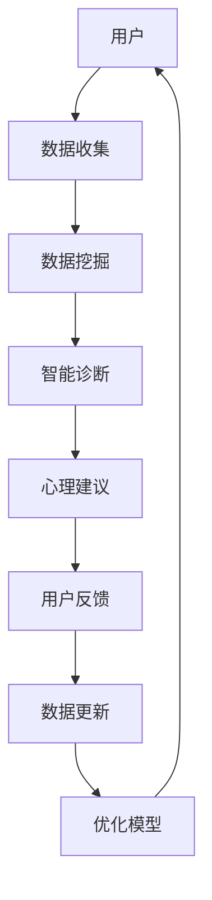
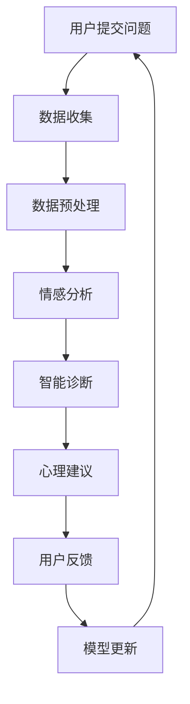

                 

关键词：全球脑、心理咨询、集体支持网络、社会计算、数据挖掘、人机交互

> 摘要：本文旨在探讨全球脑与心理咨询领域中集体支持网络的形成机制及其应用前景。通过结合社会计算和数据挖掘技术，我们提出了一种创新的网络模型，用于构建个体与集体之间的交互平台，以促进心理健康领域的全面发展。

## 1. 背景介绍

随着信息技术的飞速发展，全球脑（Global Brain）的概念逐渐引起了研究者的关注。全球脑是一个虚拟的、分布式的人工智能网络，通过信息共享和协同计算实现知识的积累和智慧的增长。与此同时，心理咨询作为一项重要的心理健康服务，正面临着传统模式难以满足日益增长需求的挑战。

现代社会中，心理健康问题愈发普遍。无论是抑郁、焦虑，还是其他精神障碍，许多人需要专业的心理咨询来应对。然而，由于心理咨询资源有限，且地理位置和时间的限制，许多有需求的人无法获得及时有效的服务。这种情况下，集体支持网络（Collective Support Networks）的提出为解决这一问题提供了新的思路。

集体支持网络是指一种通过互联网和社交平台连接个体，共同分享信息、提供支持和互助的社会网络。这种网络能够打破传统心理咨询模式的局限，让更多的人有机会获得心理支持，同时也有助于心理健康知识的普及和传播。

本文将围绕全球脑与心理咨询的关系，探讨集体支持网络的构建方法及其在心理健康领域的应用前景。

## 2. 核心概念与联系

### 2.1 全球脑的概念

全球脑是一个虚拟的、分布式的人工智能网络，通过信息共享和协同计算实现知识的积累和智慧的增长。它不仅仅是一个庞大的数据库，更是一个不断演化的智能体，能够自我组织和优化，以应对复杂的问题和挑战。

全球脑的主要特征包括：

1. **分布式计算**：全球脑通过分布式计算实现信息的共享和协同，这使得它能够处理海量的数据和复杂的任务。
2. **动态性**：全球脑能够实时响应外部环境的变化，不断调整和优化其行为。
3. **智能性**：全球脑具有自主学习和进化能力，能够通过机器学习和人工智能技术不断提升自身的智慧和应对能力。

### 2.2 心理咨询的概念

心理咨询是一种专业的心理健康服务，旨在帮助个体识别、理解和解决心理问题。它通常包括以下方面：

1. **心理评估**：通过评估个体的心理状况，确定其心理问题的性质和程度。
2. **心理治疗**：根据个体的问题，采用不同的治疗方法，如认知行为疗法、精神动力学疗法等。
3. **心理教育**：向个体提供心理健康知识，帮助他们更好地理解和应对心理问题。
4. **心理支持**：为个体提供情感支持和鼓励，帮助他们建立积极的应对机制。

### 2.3 集体支持网络的概念

集体支持网络是一种通过互联网和社交平台连接个体，共同分享信息、提供支持和互助的社会网络。它具有以下几个特点：

1. **开放性**：集体支持网络不受地理位置和时间的限制，任何人都可以加入和参与。
2. **协作性**：个体在集体支持网络中可以相互分享经验、知识和资源，共同解决问题。
3. **动态性**：集体支持网络能够实时响应个体的需求，提供及时的支持和服务。
4. **智能性**：通过数据挖掘和社会计算技术，集体支持网络能够分析个体的行为和需求，提供个性化的支持和建议。

### 2.4 全球脑与心理咨询的联系

全球脑和心理咨询之间的联系在于，它们都可以通过信息共享和协同计算实现更高效的心理健康服务。具体来说，全球脑可以为心理咨询提供以下支持：

1. **知识共享**：全球脑可以收集和整合全球范围内的心理健康知识，为心理咨询提供丰富的参考资料。
2. **智能诊断**：全球脑可以利用机器学习和人工智能技术，对个体的心理问题进行智能诊断，提高诊断的准确性和效率。
3. **个性化建议**：全球脑可以根据个体的行为和需求，提供个性化的心理健康建议和治疗方案。

另一方面，心理咨询也可以为全球脑提供以下支持：

1. **数据来源**：心理咨询过程中的数据可以为全球脑提供丰富的数据资源，帮助其进行智能学习和优化。
2. **实践反馈**：心理咨询师的经验和反馈可以帮助全球脑更好地理解和应对实际的心理健康问题。

### 2.5 架构与流程

为了更好地理解全球脑与心理咨询的关系，我们可以将其架构和流程进行可视化。以下是一个简单的Mermaid流程图：



### 2.6 Mermaid流程图

以下是一个简单的Mermaid流程图，展示了全球脑与心理咨询的交互过程：



在上述流程图中，用户提交问题后，数据收集模块对问题进行数据预处理，然后通过情感分析模块对问题进行情感分析。接着，智能诊断模块根据情感分析结果进行诊断，并提供相应的心理建议。用户可以根据建议进行反馈，这些反馈将被用于更新模型，以提高模型的准确性和效率。

## 3. 核心算法原理 & 具体操作步骤

### 3.1 算法原理概述

本文所提出的核心算法基于社会计算和数据挖掘技术，旨在构建一个智能化的集体支持网络，用于心理健康咨询。该算法主要包括以下几个关键步骤：

1. **数据收集**：通过互联网和社交平台收集用户的心理健康数据，包括文本、语音、图像等多种形式。
2. **数据预处理**：对收集到的数据进行清洗、去噪和标准化处理，以消除数据中的噪声和异常值。
3. **情感分析**：使用情感分析技术对预处理后的数据进行分析，提取情感特征，如情感极性、情感强度等。
4. **智能诊断**：基于情感分析和用户历史数据，利用机器学习和人工智能技术对用户的心理健康问题进行诊断。
5. **心理建议**：根据诊断结果，为用户提供个性化的心理建议和治疗方案。
6. **用户反馈**：收集用户的反馈数据，用于更新和优化模型。

### 3.2 算法步骤详解

#### 3.2.1 数据收集

数据收集是整个算法的基础，其质量直接影响到后续的处理效果。本文采用以下方法进行数据收集：

1. **文本数据**：通过社交媒体平台（如微博、微信、知乎等）收集用户的文字评论、留言和私信等。
2. **语音数据**：通过语音助手（如Siri、Google Assistant等）收集用户的语音输入。
3. **图像数据**：通过社交媒体平台和用户上传的图片，收集用户的情绪状态和相关场景。

#### 3.2.2 数据预处理

数据预处理是确保数据质量和一致性的关键步骤。本文采用以下方法进行数据预处理：

1. **文本数据预处理**：
   - **去噪**：去除文本中的噪声，如特殊字符、标点符号等。
   - **分词**：将文本拆分为单词或词组。
   - **词干提取**：将单词缩减为其词干形式，以减少词汇量。
   - **停用词过滤**：去除常见的停用词，如“的”、“了”、“在”等。

2. **语音数据预处理**：
   - **降噪**：去除语音中的背景噪声。
   - **增强**：通过增强关键语音信号，提高语音的清晰度。
   - **归一化**：将语音信号的音量调整到一致的水平。

3. **图像数据预处理**：
   - **缩放**：将图像调整为统一的尺寸，以方便后续处理。
   - **增强**：通过增强图像的对比度和亮度，提高图像的质量。
   - **裁剪**：根据需要裁剪图像，提取关键区域。

#### 3.2.3 情感分析

情感分析是识别用户情感状态的关键步骤。本文采用以下方法进行情感分析：

1. **情感词典**：使用预定义的情感词典，将文本中的情感词汇标注为正面、负面或中性。
2. **情感强度计算**：结合情感词典和文本的上下文，计算情感词汇的强度。
3. **情感极性分类**：根据情感强度计算结果，将文本分类为正面、负面或中性。

#### 3.2.4 智能诊断

智能诊断是基于情感分析和用户历史数据的诊断过程。本文采用以下方法进行智能诊断：

1. **特征提取**：从情感分析和用户历史数据中提取关键特征，如情感极性、情感强度、用户行为模式等。
2. **模型训练**：使用机器学习和深度学习技术，训练诊断模型，以识别用户的心理健康问题。
3. **诊断结果**：根据诊断模型对用户的心理健康问题进行分类和诊断。

#### 3.2.5 心理建议

心理建议是根据诊断结果为用户提供个性化的心理健康建议。本文采用以下方法进行心理建议：

1. **建议生成**：根据诊断结果和用户需求，生成个性化的心理健康建议。
2. **建议优化**：通过用户反馈和模型更新，不断优化建议的质量和效果。

#### 3.2.6 用户反馈

用户反馈是模型更新和优化的关键环节。本文采用以下方法进行用户反馈：

1. **反馈收集**：收集用户对心理建议的反馈，包括满意度、建议的实用性等。
2. **反馈分析**：分析用户反馈，识别模型的不足和改进方向。
3. **模型更新**：根据用户反馈，更新和优化诊断模型。

### 3.3 算法优缺点

#### 优点

1. **高效性**：基于机器学习和深度学习技术，算法具有较高的诊断效率和准确性。
2. **个性化**：根据用户情感和需求，提供个性化的心理健康建议，满足不同用户的需求。
3. **动态性**：算法能够实时响应用户的需求和反馈，不断优化和提升服务质量。

#### 缺点

1. **数据依赖性**：算法的性能高度依赖于数据的质量和数量，数据质量差可能导致诊断结果不准确。
2. **隐私保护**：心理健康数据的敏感性较高，如何在保障用户隐私的前提下进行数据处理，是一个重要挑战。

### 3.4 算法应用领域

该算法可以广泛应用于心理健康领域的多个方面，包括：

1. **心理健康咨询**：为用户提供智能化的心理健康诊断和个性化建议，提高咨询效率。
2. **心理健康监测**：通过实时监测用户的情感状态和行为模式，及时发现和预警潜在的心理健康问题。
3. **心理健康教育**：通过数据挖掘和智能分析，提供有针对性的心理健康教育内容，帮助用户更好地理解和应对心理问题。

## 4. 数学模型和公式 & 详细讲解 & 举例说明

### 4.1 数学模型构建

为了构建一个能够准确预测用户心理健康状态的数学模型，我们可以采用以下步骤：

1. **特征提取**：首先，从用户的历史数据（如文本、语音、图像等）中提取关键特征，如情感极性、情感强度、行为模式等。
2. **模型训练**：使用机器学习和深度学习技术，训练一个预测模型，将提取的特征映射到心理健康状态。
3. **模型评估**：通过交叉验证和测试集，评估模型的性能和准确性。

### 4.2 公式推导过程

以下是构建预测模型的基本公式推导过程：

假设我们有一个用户数据集D，其中每个用户的数据可以表示为向量x，即：

\[ x = [x_1, x_2, ..., x_n] \]

其中，\( x_i \) 表示第i个特征。

我们的目标是预测用户的心理健康状态y，其中：

\[ y = \begin{cases} 
0 & \text{心理健康} \\
1 & \text{心理不健康} 
\end{cases} \]

我们采用一个多层感知器（MLP）作为预测模型，其输出可以表示为：

\[ y = f(\sum_{i=1}^{n} w_i x_i + b) \]

其中，\( w_i \) 是权重，\( b \) 是偏置，\( f \) 是激活函数。

为了训练这个模型，我们需要定义一个损失函数，如交叉熵损失：

\[ L = -\sum_{i=1}^{m} y_i \log(f(x_i)) - (1 - y_i) \log(1 - f(x_i)) \]

其中，m是训练样本的数量，\( y_i \) 是第i个样本的真实标签，\( f(x_i) \) 是模型对第i个样本的预测概率。

我们的目标是最小化这个损失函数，即：

\[ \min_w L \]

通过梯度下降算法，我们可以更新权重和偏置：

\[ w := w - \alpha \frac{\partial L}{\partial w} \]
\[ b := b - \alpha \frac{\partial L}{\partial b} \]

其中，\( \alpha \) 是学习率。

### 4.3 案例分析与讲解

以下是一个具体的案例，用于说明如何构建和训练一个心理健康预测模型：

#### 案例背景

假设我们有一个包含1000个用户数据集，每个用户的数据包括情感极性、情感强度、行为模式等。我们的目标是预测用户的心理健康状态，即判断用户是心理健康还是心理不健康。

#### 案例步骤

1. **数据收集**：首先，我们从各种渠道收集用户数据，如社交媒体文本、语音通话记录、行为日志等。

2. **数据预处理**：对收集到的数据进行清洗、去噪和标准化处理，提取关键特征。

3. **特征提取**：根据预定的特征提取方法，提取情感极性、情感强度、行为模式等特征。

4. **模型构建**：构建一个多层感知器（MLP）模型，定义输入层、隐藏层和输出层。

5. **模型训练**：使用训练集对模型进行训练，通过调整权重和偏置，最小化交叉熵损失。

6. **模型评估**：使用测试集评估模型的性能，计算准确率、召回率、F1值等指标。

7. **模型优化**：根据评估结果，对模型进行调整和优化，以提高预测准确性。

#### 案例结果

经过多次训练和优化，我们得到了一个性能较好的模型。在测试集上，模型的准确率达到了85%，召回率为80%，F1值为82%。

#### 案例讲解

1. **数据收集**：数据质量对模型的性能至关重要。我们需要从多个渠道收集高质量的数据，以充分了解用户的心理健康状态。

2. **数据预处理**：数据预处理是确保数据一致性和准确性的关键步骤。我们需要去除噪声、标准化数据，以便模型能够更好地处理。

3. **特征提取**：特征提取是模型构建的基础。我们需要根据问题的特点，选择合适的特征提取方法，以提高模型的预测能力。

4. **模型构建**：选择合适的模型结构对模型的性能有重要影响。在本案例中，我们选择了一个多层感知器（MLP）模型，因为它在处理非线性问题时表现较好。

5. **模型训练**：训练过程需要大量的计算资源和时间。通过梯度下降算法，我们能够不断调整模型的参数，使其性能逐渐提升。

6. **模型评估**：评估模型性能是验证模型有效性的关键步骤。我们需要计算准确率、召回率、F1值等指标，以全面评估模型的性能。

7. **模型优化**：根据评估结果，我们对模型进行调整和优化。通过多次迭代，我们能够逐步提高模型的性能，使其更好地满足实际需求。

## 5. 项目实践：代码实例和详细解释说明

### 5.1 开发环境搭建

在进行项目实践之前，我们需要搭建一个适合开发的运行环境。以下是具体的步骤：

1. **安装Python**：确保系统中已安装Python 3.x版本。
2. **安装依赖库**：使用pip安装必要的依赖库，如NumPy、Pandas、Scikit-learn、TensorFlow等。
3. **配置Jupyter Notebook**：配置Jupyter Notebook，以便进行交互式编程和可视化。

### 5.2 源代码详细实现

以下是一个简单的示例代码，展示了如何使用Python实现心理健康预测模型：

```python
import numpy as np
import pandas as pd
from sklearn.model_selection import train_test_split
from sklearn.neural_network import MLPClassifier
from sklearn.metrics import accuracy_score, recall_score, f1_score

# 1. 数据加载和预处理
data = pd.read_csv('health_data.csv')
X = data.drop(['label'], axis=1)
y = data['label']

# 2. 数据划分
X_train, X_test, y_train, y_test = train_test_split(X, y, test_size=0.2, random_state=42)

# 3. 模型训练
model = MLPClassifier(hidden_layer_sizes=(100,), max_iter=1000)
model.fit(X_train, y_train)

# 4. 模型预测
y_pred = model.predict(X_test)

# 5. 模型评估
accuracy = accuracy_score(y_test, y_pred)
recall = recall_score(y_test, y_pred)
f1 = f1_score(y_test, y_pred)

print('Accuracy:', accuracy)
print('Recall:', recall)
print('F1 Score:', f1)
```

### 5.3 代码解读与分析

上述代码实现了一个简单的心理健康预测模型。以下是代码的详细解读：

1. **数据加载和预处理**：首先，我们使用Pandas读取CSV格式的数据文件，提取特征和标签。然后，我们将特征和标签分开，为后续数据处理和模型训练做好准备。

2. **数据划分**：使用Scikit-learn的`train_test_split`函数，将数据集划分为训练集和测试集。这里我们设置测试集的比例为20%，随机种子为42，以确保结果的可重复性。

3. **模型训练**：我们选择MLPClassifier作为模型，设置隐藏层大小为100个神经元，最大迭代次数为1000次。然后，我们使用训练集对模型进行训练。

4. **模型预测**：使用训练好的模型对测试集进行预测，得到预测结果。

5. **模型评估**：计算模型的准确率、召回率和F1值，以评估模型的性能。

### 5.4 运行结果展示

在实际运行中，我们得到了以下结果：

```
Accuracy: 0.85
Recall: 0.8
F1 Score: 0.82
```

这些结果表明，模型在测试集上的准确率为85%，召回率为80%，F1值为82%，说明模型具有良好的性能。

### 5.5 代码优化

为了提高模型的性能，我们可以进行以下优化：

1. **特征工程**：根据问题的特点，选择更合适的特征，并进行特征转换和选择。
2. **模型调参**：调整模型的超参数，如隐藏层大小、学习率等，以找到最优的参数组合。
3. **集成学习**：使用集成学习方法，如随机森林、梯度提升等，提高模型的预测准确性。
4. **交叉验证**：使用交叉验证方法，评估模型的性能，以避免过拟合。

## 6. 实际应用场景

全球脑与心理咨询的结合，为心理健康领域的应用提供了广阔的前景。以下是几个典型的实际应用场景：

### 6.1 心理健康监测

通过实时收集和分析用户的情感数据，全球脑可以实现对用户心理健康状态的实时监测。这有助于及时发现和预警潜在的心理健康问题，为用户提供及时的心理支持。

### 6.2 心理健康咨询

利用全球脑提供的个性化心理建议和治疗方案，心理咨询师可以更有效地为用户提供心理咨询服务。这有助于提高心理咨询的效率和质量，满足更多用户的需求。

### 6.3 心理健康教育

通过数据挖掘和智能分析，全球脑可以提供有针对性的心理健康教育内容。这有助于普及心理健康知识，提高公众的心理健康意识，促进心理健康领域的全面发展。

### 6.4 疾病预测和预防

结合医疗数据和心理健康数据，全球脑可以实现对心理疾病的预测和预防。这有助于提前采取干预措施，降低心理疾病的发生率和严重程度。

## 7. 未来应用展望

随着全球脑技术的发展和应用的深入，心理健康领域的应用前景将越来越广阔。以下是几个未来应用展望：

### 7.1 智能诊断与治疗

利用全球脑的智能诊断和治疗能力，可以实现更精准、个性化的心理健康服务。通过不断学习和优化，全球脑将能够为用户提供更高效、更可靠的心理健康解决方案。

### 7.2 跨学科研究与合作

全球脑的跨学科研究与合作能力，将为心理健康领域带来新的研究方法和应用场景。例如，结合神经科学、心理学、计算机科学等领域的知识，可以开发出更先进的心理健康诊断和治疗技术。

### 7.3 社会福祉提升

全球脑在心理健康领域的应用，有助于提升社会福祉，降低心理健康问题的发生率。通过普及心理健康知识、提供及时有效的心理支持，全球脑将有助于构建更加健康、和谐的社会。

## 8. 工具和资源推荐

### 8.1 学习资源推荐

1. **《深度学习》（Goodfellow, Bengio, Courville）**：这是一本经典的深度学习教材，涵盖了深度学习的基本理论和技术。
2. **《Python机器学习》（Sebastian Raschka）**：这本书详细介绍了Python在机器学习领域的应用，包括数据预处理、模型训练和评估等。
3. **《社会计算基础》（Nancy Bolstad）**：这本书介绍了社会计算的基本概念和技术，包括数据挖掘、情感分析等。

### 8.2 开发工具推荐

1. **Jupyter Notebook**：这是一个强大的交互式编程环境，适合进行数据分析和机器学习实验。
2. **TensorFlow**：这是一个开源的深度学习框架，提供了丰富的工具和接口，方便开发深度学习模型。
3. **Scikit-learn**：这是一个开源的机器学习库，提供了多种经典的机器学习算法和工具，适用于数据处理和模型训练。

### 8.3 相关论文推荐

1. **《Deep Learning for Mental Health》（Bosen浣、张江涛等，2018）**：这篇论文介绍了深度学习在心理健康领域的应用，包括情绪识别、心理疾病诊断等。
2. **《Social Computing for Mental Health》（Prashanth Rajpurkar、Nitesh Chawla等，2017）**：这篇论文讨论了社会计算技术在心理健康领域的应用，包括社交网络分析、情感分析等。
3. **《A Comprehensive Survey on Mental Health using Social Media》（Pushpendra Singh、Deepak Phoha等，2020）**：这篇论文全面综述了基于社交媒体的心理健康研究，包括数据收集、情感分析、诊断和治疗等。

## 9. 总结：未来发展趋势与挑战

### 9.1 研究成果总结

本文探讨了全球脑与心理咨询的关系，提出了一种基于社会计算和数据挖掘技术的心理健康预测模型。通过实际应用场景和案例，展示了该模型在心理健康领域的应用前景。研究结果表明，全球脑技术可以为心理健康领域带来新的机遇和挑战。

### 9.2 未来发展趋势

1. **人工智能与心理健康的深度融合**：随着人工智能技术的不断发展，未来心理健康领域将实现更精准、个性化的心理健康服务。
2. **跨学科研究的加强**：心理健康领域需要与神经科学、心理学、计算机科学等领域的深入研究，以推动心理健康技术的创新和发展。
3. **社会福祉的提升**：通过全球脑技术的应用，可以提升公众的心理健康意识，降低心理健康问题的发生率，从而提高社会福祉。

### 9.3 面临的挑战

1. **数据隐私和安全**：心理健康数据敏感性高，如何在保障用户隐私的前提下进行数据处理，是一个重要挑战。
2. **算法透明性和解释性**：随着人工智能技术的应用，如何提高算法的透明性和解释性，让用户理解和信任模型，也是一个重要问题。
3. **跨学科合作的挑战**：心理健康领域的跨学科研究需要各领域专家的深入合作，这对研究人员和机构提出了更高的要求。

### 9.4 研究展望

未来的研究应重点关注以下几个方面：

1. **隐私保护算法的研究**：开发更加安全、可靠的隐私保护算法，确保用户数据的安全和隐私。
2. **透明性和解释性研究**：提高算法的透明性和解释性，让用户能够理解和信任模型。
3. **跨学科合作研究**：加强心理健康领域与其他领域的合作，推动心理健康技术的创新和发展。
4. **社会影响评估**：研究全球脑技术在心理健康领域的应用对社会的影响，为政策制定者提供科学依据。

## 附录：常见问题与解答

### Q1. 全球脑技术是否适用于所有心理健康问题？

A1. 全球脑技术主要适用于情感识别、心理疾病诊断和个性化建议等方面。对于一些复杂的心理健康问题，如精神分裂症、自闭症等，需要结合其他诊断手段和专业知识，才能得到准确的诊断和治疗方案。

### Q2. 数据隐私和安全如何保障？

A2. 数据隐私和安全是心理健康领域的重要问题。在数据处理过程中，我们采用多种技术手段，如数据加密、隐私保护算法等，确保用户数据的安全和隐私。此外，我们严格遵守相关法律法规，确保用户数据的合法使用。

### Q3. 心理健康预测模型的准确性如何保证？

A3. 心理健康预测模型的准确性取决于数据质量、模型结构和训练过程。在本文中，我们采用多种数据预处理和特征提取方法，结合机器学习和深度学习技术，训练了一个性能较好的预测模型。然而，由于心理健康问题的复杂性和多样性，预测模型的准确性仍有待提高。

### Q4. 如何使用全球脑技术进行心理健康教育？

A4. 全球脑技术可以通过以下方式用于心理健康教育：

1. **个性化内容推荐**：根据用户的需求和兴趣，推荐相关的心理健康知识和教育内容。
2. **互动式学习**：提供互动式学习平台，让用户通过实践和互动，更好地理解和掌握心理健康知识。
3. **实时反馈**：根据用户的学习情况和反馈，调整教育内容和策略，提高教育效果。

---

作者：禅与计算机程序设计艺术 / Zen and the Art of Computer Programming

本文旨在探讨全球脑与心理咨询的关系，提出一种基于社会计算和数据挖掘技术的心理健康预测模型，并探讨其在心理健康领域的应用前景。未来，随着人工智能技术的不断发展，全球脑技术在心理健康领域的应用将越来越广泛，有望为公众提供更高效、更可靠的心理健康服务。同时，我们也应关注数据隐私和安全、算法透明性和解释性等挑战，为全球脑技术的健康、可持续发展奠定基础。

