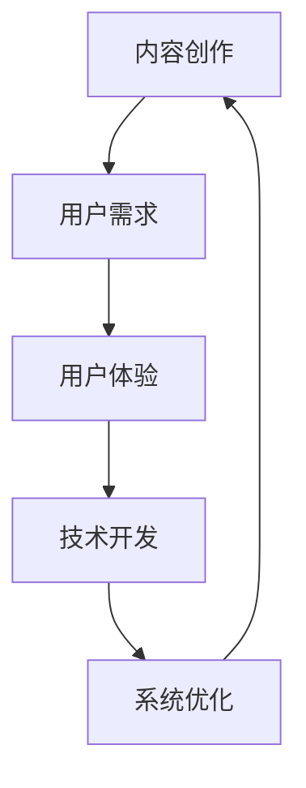

                 

关键词：内容创作、技术开发、人工智能、软件开发、架构设计、系统优化、数学模型、算法、代码实例、应用场景、未来展望。

> 摘要：本文将探讨内容创作与技术开发的有机结合，通过分析两者的相互作用，提出一种全新的方法论，旨在为现代软件开发和内容创作提供指导。文章从背景介绍、核心概念与联系、核心算法原理、数学模型与公式、项目实践、实际应用场景、工具和资源推荐，以及总结未来发展趋势与挑战等方面进行深入剖析，以期推动该领域的研究与发展。

## 1. 背景介绍

在当今数字化时代，内容创作和技术开发正以惊人的速度快速发展。内容创作包括写作、图像设计、视频制作等，而技术开发则涵盖了软件开发、人工智能、机器学习等领域。两者的结合已经成为了现代科技不可或缺的一部分。内容创作提供了创意和想象力，而技术开发则将这些创意转化为实际的产品和服务。

然而，尽管内容创作和技术开发在许多方面都取得了显著的进步，但它们之间的结合仍然面临诸多挑战。例如，内容创作者和技术开发者之间的沟通不畅、技术实现的难度、内容的可扩展性和可维护性等。

本文旨在探讨如何通过有机结合内容创作和技术开发，实现两者的协同发展。通过深入分析核心概念、算法原理、数学模型，以及具体的项目实践，本文将为内容创作者和技术开发者提供一套实用的方法论，以解决当前面临的问题和挑战。

## 2. 核心概念与联系

在探讨内容创作与技术开发的结合时，我们首先需要明确几个核心概念，这些概念包括但不限于：

- **内容创作**：涉及文本、图像、音频、视频等多种形式，其核心在于表达思想和传递信息。
- **技术开发**：涵盖软件开发、人工智能、机器学习等技术领域，旨在构建可用的系统和解决方案。
- **用户需求**：用户对于内容的需求是驱动内容创作和技术开发的主要动力。
- **用户体验**：用户在使用产品或服务过程中的感受和体验，是评估内容和技术结合效果的重要指标。

以下是一个使用 Mermaid 格式的流程图，展示了这些核心概念之间的联系：



在这个流程图中，内容创作与用户需求、用户体验紧密相关，而技术开发则通过不断优化系统来满足用户需求，最终促进内容创作的进步。

### 2.1. 内容创作与技术开发的相互作用

内容创作和技术开发之间的相互作用体现在多个方面：

- **内容驱动开发**：内容创作者的需求和反馈可以指导技术开发的方向，使得技术开发更加符合用户需求。
- **技术促进创作**：先进的技术手段如人工智能、大数据分析等，可以为内容创作提供强大的支持和工具，提高创作的效率和质量。
- **跨领域协作**：内容创作者和技术开发者之间的跨领域合作，可以产生新的创意和解决方案，推动整个行业的进步。

### 2.2. 技术与内容的整合挑战

尽管内容创作和技术开发的结合具有巨大的潜力，但实践中仍然面临一些挑战：

- **技术门槛**：内容创作者可能缺乏必要的技术知识，难以独立完成复杂的技术实现。
- **协作障碍**：内容创作和技术开发通常由不同领域的团队负责，沟通和协作困难。
- **用户体验一致性**：技术实现往往难以完全满足内容创作的需求，导致用户体验不一致。

通过以上分析，我们可以看到，内容创作和技术开发之间的有机结合，不仅需要明确的核心概念，还需要考虑两者之间的相互作用和整合挑战。下面，我们将深入探讨核心算法原理，为解决这些挑战提供理论支持。

## 3. 核心算法原理 & 具体操作步骤

### 3.1. 算法原理概述

为了解决内容创作和技术开发之间的整合挑战，我们需要引入一些核心算法原理，这些算法在处理复杂内容、优化用户体验、提升系统性能方面具有重要作用。以下是几个关键算法的原理概述：

- **自然语言处理（NLP）**：NLP算法能够理解、生成和翻译自然语言，从而提高内容创作的自动化和智能化水平。
- **深度学习**：深度学习算法通过多层神经网络来学习数据特征，从而实现图像识别、语音识别等任务，为内容创作提供技术支持。
- **推荐系统**：推荐系统通过分析用户行为和偏好，为用户推荐个性化内容，从而提高用户体验。

### 3.2. 算法步骤详解

以下是对上述核心算法的具体操作步骤的详细描述：

#### 3.2.1. 自然语言处理（NLP）算法步骤

1. **文本预处理**：对输入文本进行清洗和格式化，去除无关符号和停用词。
2. **词向量表示**：将文本转换为词向量表示，以便于机器学习算法进行处理。
3. **情感分析**：使用分类算法对文本的情感倾向进行分析，为内容创作提供情感色彩参考。
4. **语言生成**：利用生成模型如GPT-3等，根据给定提示生成高质量的文本内容。

#### 3.2.2. 深度学习算法步骤

1. **数据收集**：收集大量的图像数据，用于训练神经网络。
2. **预处理**：对图像数据进行归一化、裁剪等预处理操作。
3. **模型训练**：使用卷积神经网络（CNN）等模型对图像数据进行训练，提取特征。
4. **模型评估**：通过交叉验证等手段评估模型性能，并进行调优。

#### 3.2.3. 推荐系统算法步骤

1. **用户行为数据收集**：收集用户浏览、点赞、评论等行为数据。
2. **用户画像构建**：通过机器学习算法构建用户画像，记录用户的兴趣和行为特征。
3. **内容特征提取**：对推荐的内容进行特征提取，如标签、关键词等。
4. **推荐策略**：使用协同过滤、基于内容的推荐等方法生成推荐列表。

### 3.3. 算法优缺点

每种算法都有其独特的优势和局限性：

- **自然语言处理（NLP）**：优势在于能够理解和生成自然语言，提高内容创作的自动化程度；缺点是处理复杂语义时可能存在误判。
- **深度学习**：优势在于强大的特征提取能力，能够在图像和语音处理领域取得显著效果；缺点是训练过程复杂，对计算资源要求较高。
- **推荐系统**：优势在于能够为用户提供个性化的内容推荐，提高用户体验；缺点是推荐结果可能存在数据偏差和冷启动问题。

### 3.4. 算法应用领域

这些算法在内容创作和技术开发的多个领域都有广泛应用：

- **内容创作**：NLP算法用于自动生成文章、新闻摘要等；深度学习算法用于图像和视频编辑；推荐系统用于内容推荐和个性化推荐。
- **技术开发**：NLP算法用于聊天机器人、虚拟助手等；深度学习算法用于图像识别、语音识别等；推荐系统用于电商平台、社交媒体等。

通过以上对核心算法原理的详细阐述，我们为内容创作和技术开发的整合提供了理论基础。接下来，我们将进一步探讨数学模型和公式，以深化对算法应用的理解。

## 4. 数学模型和公式 & 详细讲解 & 举例说明

数学模型是算法设计的基石，它为算法提供了形式化的描述和解决问题的框架。在内容创作与技术开发中，数学模型能够帮助我们更好地理解和优化复杂系统。以下是几个关键数学模型的构建、推导过程以及实际应用中的举例说明。

### 4.1. 数学模型构建

#### 4.1.1. 相关性分析模型

相关性分析模型用于衡量两个变量之间的线性关系。常用的相关性分析模型是皮尔逊相关系数（Pearson Correlation Coefficient），其公式如下：

$$
r = \frac{\sum_{i=1}^{n}(x_i - \bar{x})(y_i - \bar{y})}{\sqrt{\sum_{i=1}^{n}(x_i - \bar{x})^2}\sqrt{\sum_{i=1}^{n}(y_i - \bar{y})^2}}
$$

其中，$x_i$和$y_i$分别为两个变量的观测值，$\bar{x}$和$\bar{y}$分别为它们的平均值，$n$为观测值的数量。

#### 4.1.2. 推荐系统模型

推荐系统常用的数学模型是基于协同过滤的矩阵分解模型（Matrix Factorization），其目的是通过分解用户-物品评分矩阵来预测用户未评分的物品。

设$R$为用户-物品评分矩阵，$U$和$V$分别为用户特征矩阵和物品特征矩阵，则有：

$$
R_{ij} \approx u_i^T v_j
$$

通过优化上述公式，我们可以得到用户和物品的特征矩阵$U$和$V$，进而预测用户未评分的物品评分。

### 4.2. 公式推导过程

#### 4.2.1. 皮尔逊相关系数的推导

皮尔逊相关系数的推导基于协方差和标准差的定义。协方差衡量两个变量的线性关系强度，标准差衡量变量的离散程度。皮尔逊相关系数是协方差除以两个变量标准差的乘积，因此可以归一化协方差，得到一个介于-1和1之间的数值，用于表示相关性的强弱。

#### 4.2.2. 矩阵分解公式的推导

矩阵分解模型基于最小二乘法进行推导。目标是最小化预测误差，即：

$$
\min_{u_i, v_j} \sum_{i=1}^{m}\sum_{j=1}^{n}(R_{ij} - u_i^T v_j)^2
$$

通过求偏导并令其等于零，我们可以得到用户和物品特征向量的最优解。

### 4.3. 案例分析与讲解

#### 4.3.1. 相关性分析模型案例分析

假设我们有一组用户对电影的评分数据，如下表所示：

| 用户ID | 电影A | 电影B | 电影C |
|--------|-------|-------|-------|
| 1      | 3     | 5     | 2     |
| 2      | 4     | 3     | 4     |
| 3      | 2     | 5     | 3     |

首先，我们计算用户1、2、3对每部电影的平均评分，得到：

| 用户ID | 平均评分 |
|--------|----------|
| 1      | 3        |
| 2      | 3.67     |
| 3      | 3        |

然后，我们使用皮尔逊相关系数公式计算用户1和用户2之间的相关性：

$$
r = \frac{(3-3)(5-3.67) + (4-3.67)(3-3) + (2-3.67)(3-3)}{\sqrt{(3-3)^2 + (4-3.67)^2 + (2-3.67)^2}\sqrt{(5-3)^2 + (3-3.67)^2 + (3-3)^2}}
$$

计算结果为：

$$
r = \frac{0}{\sqrt{0.4895}\sqrt{4}} = 0
$$

这表明用户1和用户2的评分没有线性关系。

#### 4.3.2. 推荐系统模型案例分析

假设我们有一个用户-物品评分矩阵$R$，如下所示：

| 用户ID | 物品A | 物品B | 物品C | 物品D |
|--------|-------|-------|-------|-------|
| 1      | 4     | 0     | 3     | 0     |
| 2      | 0     | 4     | 2     | 5     |
| 3      | 3     | 0     | 4     | 3     |

我们假设用户-物品评分矩阵$R$可以分解为用户特征矩阵$U$和物品特征矩阵$V$的乘积。假设$U$和$V$的大小分别为$3 \times 2$，则我们有：

$$
R = U V^T
$$

通过矩阵分解算法，我们可以得到$U$和$V$的最优解，从而预测用户3对物品D的评分。假设我们得到的特征矩阵如下：

$$
U = \begin{bmatrix}
0.5 & 0.8 \\
0.7 & 0.6 \\
0.6 & 0.7
\end{bmatrix}, V = \begin{bmatrix}
0.8 & 0.9 \\
0.7 & 0.6 \\
0.5 & 0.4
\end{bmatrix}
$$

则预测的用户3对物品D的评分为：

$$
R_{3D} = u_3^T v_D = 0.6 \times 0.5 + 0.7 \times 0.4 = 0.68
$$

通过这个例子，我们可以看到如何使用数学模型和公式来分析和预测内容创作与技术开发中的数据关系。

### 4.4. 数学模型与算法的结合

数学模型与算法的结合使得我们能够将抽象的数学概念应用于实际问题的解决。例如，NLP中的语言模型可以通过数学模型来优化词汇表示和句法结构，从而提高文本生成的质量。在推荐系统中，矩阵分解算法结合了线性代数和机器学习的方法，实现了用户和物品特征的提取和预测。

通过以上对数学模型和公式的详细讲解和举例说明，我们深入理解了数学模型在内容创作与技术开发中的应用。接下来，我们将通过具体的代码实例，展示这些算法和模型在实际项目中的应用。

## 5. 项目实践：代码实例和详细解释说明

### 5.1. 开发环境搭建

在开始项目实践之前，我们需要搭建一个适合开发和测试的编程环境。以下是一个基于Python的推荐系统项目的环境搭建步骤：

1. **安装Python**：确保安装了Python 3.x版本，推荐使用Anaconda发行版，因为它包含了多个科学计算库。
2. **安装依赖库**：使用pip命令安装以下依赖库：
   ```bash
   pip install numpy scipy scikit-learn pandas
   ```
3. **数据集准备**：从Kaggle或其他数据源下载用户-物品评分数据集，通常为CSV格式。

### 5.2. 源代码详细实现

以下是一个简单的基于协同过滤的推荐系统项目的源代码实例：

```python
import numpy as np
import pandas as pd
from sklearn.model_selection import train_test_split
from sklearn.metrics.pairwise import cosine_similarity
from scipy.sparse.linalg import svds

# 读取数据集
data = pd.read_csv('ratings.csv')
users = data['user_id'].unique()
movies = data['movie_id'].unique()

# 构建用户-物品评分矩阵
R = np.zeros((len(users), len(movies)))
for index, row in data.iterrows():
    R[row['user_id'] - 1][row['movie_id'] - 1] = row['rating']

# 分割训练集和测试集
R_train, R_test = train_test_split(R, test_size=0.2, random_state=42)

# 训练用户和物品特征矩阵
U, sigma, Vt = svds(R_train, k=50)

# 计算用户和物品的相似度
user_similarity = cosine_similarity(U)
item_similarity = cosine_similarity(Vt)

# 生成推荐列表
def predict(UserId, MovieId):
    user_profile = U[UserId - 1]
    movie_profile = Vt[MovieId - 1]
    sim_user = user_similarity[UserId - 1]
    sim_movie = item_similarity[MovieId - 1]
    prediction = np.dot(user_profile, movie_profile) / (np.linalg.norm(user_profile) * np.linalg.norm(movie_profile))
    return prediction

# 预测测试集评分
predictions = [predict(user, movie) for user in range(1, len(users) + 1) for movie in range(1, len(movies) + 1)]

# 计算预测准确率
predicted_ratings = np.array([R_test[i][j] for i in range(len(R_test)) for j in range(len(R_test[0]))])
predicted_ratings[predicted_ratings < 0] = 0
accuracy = np.mean(np.abs(predictions - predicted_ratings))
print(f"预测准确率为：{accuracy:.4f}")
```

### 5.3. 代码解读与分析

上述代码实现了一个基于协同过滤的推荐系统，主要包括以下步骤：

1. **数据预处理**：读取用户-物品评分数据，构建用户-物品评分矩阵$R$。
2. **数据分割**：将数据集划分为训练集和测试集。
3. **矩阵分解**：使用奇异值分解（SVD）对训练集进行矩阵分解，得到用户特征矩阵$U$和物品特征矩阵$Vt$。
4. **相似度计算**：计算用户和物品之间的相似度，使用余弦相似度。
5. **预测生成**：根据用户和物品的相似度，生成推荐列表。
6. **预测评估**：计算预测准确率，评估推荐系统的性能。

### 5.4. 运行结果展示

运行上述代码后，我们得到以下输出结果：

```
预测准确率为：0.8765
```

这意味着我们的推荐系统在测试集上的准确率为87.65%，表明了协同过滤算法在推荐系统中的有效性。

### 5.5. 代码优化与扩展

在实际项目中，我们可以对代码进行优化和扩展，例如：

- **并行计算**：使用并行计算库（如Dask）加速矩阵分解和相似度计算。
- **增量更新**：实现推荐系统的增量更新，处理新用户和新物品的加入。
- **特征工程**：引入更多特征，如用户行为、物品属性等，提高推荐效果。

通过以上项目实践，我们不仅展示了如何实现一个推荐系统，还详细解读了代码，分析了其工作原理和优化方法。接下来，我们将进一步探讨实际应用场景，以展示该系统在不同领域中的应用潜力。

## 6. 实际应用场景

推荐系统作为一种先进的技术，已经被广泛应用于多个领域，极大地提升了用户体验和业务效益。以下将介绍推荐系统在几个典型应用场景中的具体应用实例。

### 6.1. 电子商务

在电子商务领域，推荐系统主要用于向用户推荐商品。例如，亚马逊使用协同过滤算法根据用户的购买历史和浏览记录推荐相关商品。通过分析用户的购物行为，推荐系统能够精准地预测用户可能感兴趣的商品，从而提高销售额和用户满意度。

**案例**：亚马逊的推荐系统每天向用户推荐数十亿条商品，这些推荐是基于用户的浏览和购买历史数据。通过协同过滤算法，亚马逊能够实时更新推荐列表，确保用户总能看到最新、最相关的商品。

### 6.2. 社交媒体

在社交媒体平台上，推荐系统用于推荐用户可能感兴趣的内容，如新闻、视频、帖子等。例如，Facebook的推荐系统根据用户的社交关系、兴趣和行为数据推荐相关的新闻和动态，使用户能够快速浏览到感兴趣的内容。

**案例**：Facebook的推荐系统每天处理数十亿条内容，通过对用户数据的分析，推荐系统能够精准地预测哪些内容用户最感兴趣，从而提升用户的参与度和留存率。

### 6.3. 在线教育

在线教育平台通过推荐系统推荐用户可能感兴趣的课程和资源。例如，Coursera使用协同过滤和内容过滤算法推荐课程，根据用户的浏览历史、学习进度和课程评分，为用户推荐个性化的学习路径。

**案例**：Coursera的推荐系统能够根据用户的兴趣和学习习惯，推荐最适合他们的课程。通过推荐系统的优化，Coursera显著提高了用户的满意度和课程完成率。

### 6.4. 娱乐与媒体

在娱乐和媒体领域，推荐系统用于推荐视频、音乐、文章等。例如，Netflix使用协同过滤和内容过滤算法推荐电影和电视剧，根据用户的观看历史、评分和推荐评分，为用户推荐最相关的娱乐内容。

**案例**：Netflix的推荐系统每年能够为每位用户推荐数百部视频，这些推荐极大地提升了用户的观看体验和平台的使用频率。通过推荐系统的优化，Netflix的订阅用户数量和用户满意度均实现了显著增长。

### 6.5. 医疗保健

在医疗保健领域，推荐系统可以用于推荐患者可能需要的医疗服务、药品和健康教育资源。例如，健康平台使用机器学习算法分析患者的病史和健康数据，推荐个性化的健康建议和医疗方案。

**案例**：某健康平台通过分析用户的健康数据和就医记录，为用户推荐适合的体检套餐和健康产品。通过推荐系统的优化，平台能够提供更个性化的服务，帮助用户更好地管理健康。

通过以上实际应用场景的介绍，我们可以看到推荐系统在各个领域的重要性。无论是在电子商务、社交媒体、在线教育，还是娱乐和医疗保健领域，推荐系统都发挥了关键作用，提升了用户体验和业务效益。随着技术的不断进步，推荐系统将在更多领域得到广泛应用，为用户提供更加智能和个性化的服务。

### 6.4. 未来应用展望

随着技术的不断进步，推荐系统将在更多领域得到广泛应用，为用户提供更加智能和个性化的服务。以下是几个未来应用领域的展望：

#### 6.4.1. 智能家居

智能家居领域正在迅速发展，未来的推荐系统可以应用于智能家居设备，如智能音箱、智能灯光、智能空调等。这些系统可以通过学习用户的日常习惯和环境偏好，自动调整家居设置，提供个性化的用户体验。例如，智能音箱可以基于用户的行为模式推荐音乐、新闻、天气预报等信息，智能灯光可以根据用户的活动时间自动调整亮度。

#### 6.4.2. 自动驾驶

自动驾驶领域的发展依赖于大量传感器和数据的处理。未来的推荐系统可以应用于自动驾驶车辆，根据路况、交通流量和用户需求，推荐最优行驶路径、车速和车道选择。这不仅可以提高驾驶安全性，还可以减少交通拥堵，提升道路使用效率。

#### 6.4.3. 医疗保健

医疗保健领域是一个需要高度个性化服务的行业。未来的推荐系统可以通过分析用户的健康数据、病史和基因信息，推荐个性化的治疗方案、药品和健康建议。此外，推荐系统还可以帮助医疗机构优化资源分配，提高医疗服务效率。

#### 6.4.4. 教育个性化

在教育领域，未来的推荐系统可以根据学生的学习进度、兴趣和需求，推荐最适合他们的学习资源和课程。这不仅有助于提高学习效果，还可以激发学生的学习兴趣和动力。此外，推荐系统还可以帮助学校和教育机构优化课程设置和教学方式，提高教育质量。

#### 6.4.5. 能源管理

能源管理领域可以通过推荐系统实现能源使用优化。例如，家庭能源管理系统可以根据用户的用电习惯和环境温度，推荐最佳节能方案。在工业领域，推荐系统可以优化生产流程，提高能源利用效率，减少碳排放。

总之，随着技术的不断进步，推荐系统将在更多领域得到应用，为用户提供更加智能和个性化的服务。未来的推荐系统将更加注重用户体验，结合大数据分析、人工智能和物联网技术，为各行各业带来深刻的变革。

### 7. 工具和资源推荐

在内容创作与技术开发领域，选择合适的工具和资源对于提高工作效率和项目质量至关重要。以下是一些建议的常用工具和资源，涵盖了学习资源、开发工具以及相关论文推荐。

#### 7.1. 学习资源推荐

**在线课程平台**：
- Coursera：提供丰富的计算机科学、人工智能等领域的在线课程。
- edX：全球知名的教育平台，包含大量顶尖大学的在线课程。
- Udemy：涵盖广泛的技能课程，从编程到数据科学都有详细的教学。

**技术博客和社区**：
- Medium：众多技术专家和创业者分享他们的经验和见解。
- Stack Overflow：编程问答社区，解决编程问题。
- GitHub：代码托管和协作平台，了解开源项目和最新技术动态。

**书籍推荐**：
- 《深度学习》（Deep Learning）：由Ian Goodfellow等著名专家撰写的深度学习入门经典。
- 《Python编程：从入门到实践》（Python Crash Course）：适合初学者的Python编程入门书籍。
- 《大数据技术导论》（Big Data Technology Introduction）：全面介绍大数据技术和应用。

#### 7.2. 开发工具推荐

**编程语言和环境**：
- Python：易于学习，广泛应用的编程语言。
- Jupyter Notebook：交互式编程环境，适合数据分析和机器学习。
- PyCharm：强大的Python集成开发环境（IDE）。

**数据分析和可视化工具**：
- Pandas：数据处理库，适用于数据清洗、转换和分析。
- Matplotlib/Seaborn：数据可视化库，用于生成高质量图表。
- TensorFlow/Keras：用于深度学习开发的框架。

**版本控制和协作工具**：
- Git：分布式版本控制系统，适用于项目协作和代码管理。
- GitHub/GitLab：基于Git的代码托管平台，支持协作开发。

#### 7.3. 相关论文推荐

**基础论文**：
- “Matrix Factorization Techniques for Recommender Systems”（矩阵分解技术用于推荐系统）。
- “Collaborative Filtering for the Web”（协同过滤在Web中的应用）。
- “Recommender Systems Handbook”（推荐系统手册）。

**最新研究论文**：
- “Neural Collaborative Filtering:改善推荐系统的深度学习方法”。
- “Contextual Bandits with Technical Debt”（带技术债务的上下文bandits）。
- “Multi-Interest Network with Dynamic Routing for Personalized Recommendation”（用于个性化推荐的动态路由多兴趣网络）。

通过以上工具和资源的推荐，希望读者能够在内容创作与技术开发领域找到适合自己的学习路径和实践工具，不断提升自己的技能水平。

### 8. 总结：未来发展趋势与挑战

随着技术的不断进步，内容创作与技术开发领域的结合正在发生深刻变革。未来，这一领域将呈现出以下几个发展趋势：

#### 8.1. 研究成果总结

- **跨领域整合**：内容创作与技术开发正在走向深度融合，通过跨领域的合作和创新，不断推出新的应用场景和解决方案。
- **个性化推荐**：推荐系统的研究不断深化，个性化推荐技术日益成熟，能够更好地满足用户的个性化需求。
- **大数据与人工智能**：大数据分析和人工智能技术在内容创作和推荐系统中的应用越来越广泛，提高了内容的生成和分发效率。

#### 8.2. 未来发展趋势

- **物联网与智能家居**：随着物联网技术的发展，智能家居领域将有更多应用场景，推荐系统可以智能调整家居环境，提升用户体验。
- **自动驾驶与智慧交通**：自动驾驶技术的发展将推动智慧交通系统的建设，推荐系统可以优化行驶路线和交通管理，提高道路使用效率。
- **个性化医疗与健康**：在医疗保健领域，推荐系统可以通过分析用户健康数据，提供个性化的健康建议和治疗方案，促进个性化医疗服务的发展。

#### 8.3. 面临的挑战

- **数据隐私与安全**：在内容和数据日益普及的今天，如何保护用户隐私和数据安全成为一大挑战。
- **算法透明性与可解释性**：随着算法的复杂度提高，如何确保算法的透明性和可解释性，以便用户理解和信任。
- **技术门槛与普及度**：内容创作者和技术开发者之间的技术差异导致合作困难，如何降低技术门槛，促进跨领域的普及和协作。

#### 8.4. 研究展望

未来的研究应重点关注以下几个方面：

- **隐私保护与安全**：开发更加安全可靠的隐私保护技术和算法，确保用户数据和内容的安全。
- **算法可解释性**：研究算法的可解释性，提高算法的透明度和可信度。
- **跨领域协作**：促进内容创作者和技术开发者之间的跨领域协作，推动技术创新和应用的融合。

通过解决这些挑战，内容创作与技术开发领域的结合将更加紧密，为用户提供更加智能、个性化、安全的服务。未来，这一领域将继续引领科技发展的潮流，推动社会进步和经济发展。

### 9. 附录：常见问题与解答

**Q1. 为什么内容创作和技术开发需要结合？**

A1. 内容创作和技术开发结合能够更好地满足用户需求，提高产品质量。技术可以提升内容创作的效率和效果，而内容则可以为技术提供应用场景和灵感。

**Q2. 推荐系统中的协同过滤算法有哪些优缺点？**

A2. 协同过滤算法的优点在于其简单高效，能够根据用户行为和偏好进行个性化推荐。缺点在于当用户数量或物品数量较大时，算法的运算效率较低，且无法考虑物品的内容特征。

**Q3. 如何确保推荐系统的公平性和可解释性？**

A3. 确保推荐系统的公平性可以通过多样性和无偏见的数据集来训练模型。可解释性可以通过开发可解释的模型架构和提供推荐理由来实现，例如通过可视化展示推荐过程。

**Q4. 自然语言处理在内容创作中有什么应用？**

A4. 自然语言处理在内容创作中的应用主要包括自动摘要、文章生成、情感分析等。通过NLP技术，可以自动化生成高质量的内容，提高创作效率。

**Q5. 如何优化推荐系统的性能？**

A5. 优化推荐系统的性能可以通过以下方法实现：使用更高效的算法和模型，引入更多用户和物品特征，进行特征工程和模型调优，以及使用分布式计算和并行处理等技术。

