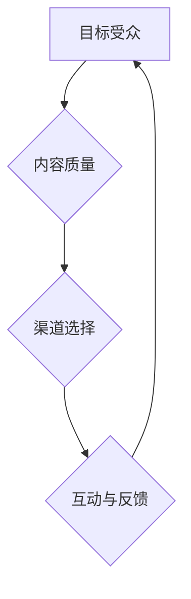

                 

关键词：内容营销、潜在用户、吸引、策略、有效方法

> 摘要：本文将深入探讨内容营销的核心策略，以及如何通过这些策略吸引潜在用户。我们将从多个角度分析，包括核心概念、算法原理、数学模型、项目实践和实际应用场景，为读者提供全方位的内容营销指南。

## 1. 背景介绍

随着互联网的普及和社交媒体的兴起，内容营销已成为企业获取潜在用户、提高品牌知名度和促进销售的重要手段。然而，如何在众多竞争者中脱颖而出，吸引潜在用户的关注，成为了每个企业都需要面对的挑战。

本文将围绕以下核心内容展开：

1. **核心概念与联系**：介绍内容营销的基本概念及其相互关系。
2. **核心算法原理 & 具体操作步骤**：探讨吸引潜在用户的算法原理和实施步骤。
3. **数学模型和公式**：阐述内容营销中使用的数学模型和公式。
4. **项目实践**：通过实际代码实例展示内容营销的具体应用。
5. **实际应用场景**：分析内容营销在不同领域的应用。
6. **工具和资源推荐**：推荐有助于内容营销的工具和资源。
7. **总结**：探讨内容营销的未来发展趋势与挑战。

### 核心概念与联系

首先，让我们定义一些核心概念，并探讨它们之间的联系。

#### 内容营销

内容营销是一种通过创造和分发有价值的内容来吸引潜在用户，提高品牌知名度，并最终实现销售目标的市场营销策略。其核心在于提供有价值的信息，而不是直接推销产品或服务。

#### 潜在用户

潜在用户是指那些可能对企业产品或服务感兴趣，但目前尚未进行购买的人群。吸引潜在用户是内容营销的主要目标。

#### 关键要素

1. **目标受众**：了解潜在用户的需求和兴趣，以便创建相关的内容。
2. **内容质量**：高质量的内容能够吸引和留住潜在用户。
3. **渠道选择**：选择合适的渠道分发内容，以最大化曝光和传播。
4. **互动与反馈**：与潜在用户互动，获取反馈，不断优化内容营销策略。

### Mermaid 流程图

以下是一个简化的 Mermaid 流程图，展示了内容营销的核心概念和其相互关系：



## 2. 核心算法原理 & 具体操作步骤

吸引潜在用户的关键在于理解其行为模式，并制定相应的策略。以下是一些核心算法原理和具体操作步骤：

### 2.1 算法原理概述

1. **用户画像**：通过数据分析构建用户画像，了解潜在用户的基本属性、兴趣和行为模式。
2. **个性化推荐**：基于用户画像，为不同用户推荐个性化的内容。
3. **社交网络传播**：利用社交媒体的传播机制，扩大内容的曝光范围。
4. **A/B 测试**：通过对比不同策略的效果，持续优化内容营销方案。

### 2.2 算法步骤详解

1. **数据收集**：收集用户行为数据，如浏览记录、点击率、评论等。
2. **数据预处理**：清洗和转换数据，为后续分析做准备。
3. **用户画像构建**：利用机器学习算法，如聚类分析、协同过滤等，构建用户画像。
4. **内容推荐**：根据用户画像，为每个用户推荐相关的优质内容。
5. **内容发布与传播**：选择合适的渠道发布内容，并利用社交网络传播。
6. **数据监控与反馈**：监控内容的表现，收集用户反馈，不断优化策略。

### 2.3 算法优缺点

1. **优点**：
   - 提高用户满意度：个性化推荐能够提供更符合用户兴趣的内容。
   - 提高内容传播效率：通过社交网络传播，扩大内容的曝光范围。
   - 提高销售转化率：通过持续优化，提高内容营销的效果。

2. **缺点**：
   - 数据隐私问题：用户数据收集和处理可能涉及隐私问题。
   - 需要大量计算资源：个性化推荐和 A/B 测试需要大量的计算资源。

### 2.4 算法应用领域

1. **电子商务**：通过个性化推荐，提高用户购买转化率。
2. **社交媒体**：通过社交网络传播，扩大品牌影响力。
3. **内容平台**：通过数据分析，优化内容发布策略，提高用户粘性。

## 3. 数学模型和公式

在内容营销中，数学模型和公式扮演着重要的角色，用于分析用户行为、评估内容质量等。以下是一些常用的数学模型和公式：

### 3.1 数学模型构建

1. **用户行为模型**：使用马尔可夫决策过程（MDP）模拟用户在不同状态下的行为。
2. **内容质量评估模型**：使用文本分类和情感分析模型评估内容的受欢迎程度。
3. **社交网络传播模型**：使用随机游走模型模拟用户在社交网络中的传播行为。

### 3.2 公式推导过程

1. **用户行为概率分布**：$$ p(s_t | s_{t-1}, a_{t-1}) = \frac{P(s_t | a_{t-1}) P(a_{t-1} | s_{t-1})}{P(s_{t-1} | a_{t-1})} $$
2. **内容质量评估得分**：$$ Q_c = \frac{1}{|V|} \sum_{v \in V} P(c | v) P(v) $$
3. **社交网络传播概率**：$$ p(w_{t+1} | w_t) = \frac{\sum_{v \in N(w_t)} p(w_t | v) p(v)}{\sum_{v \in N(w_t)} p(v)} $$

### 3.3 案例分析与讲解

#### 案例一：用户行为模型

假设一个用户在电子商务网站上浏览了多个产品，我们使用马尔可夫决策过程（MDP）模拟其行为。

- **状态**：用户当前浏览的产品。
- **动作**：用户点击的链接或进行购买。
- **奖励**：用户对产品或动作的满意度。

通过训练 MDP 模型，我们可以预测用户下一步的行为，从而为其推荐相关产品。

#### 案例二：内容质量评估

假设一个内容平台需要评估其发布的内容质量，我们使用文本分类和情感分析模型。

- **文本分类模型**：将内容分为不同的类别，如技术文章、新闻、娱乐等。
- **情感分析模型**：分析内容的情感倾向，如正面、负面或中性。

通过综合评估结果，平台可以优化内容发布策略，提高用户满意度。

#### 案例三：社交网络传播

假设一个企业在社交媒体上发布了一篇文章，我们使用随机游走模型模拟其传播过程。

- **节点**：文章的点赞、分享、评论等用户行为。
- **边**：用户之间的社交关系。

通过分析随机游走模型，企业可以预测文章的传播范围和速度，从而优化社交媒体营销策略。

## 4. 项目实践：代码实例和详细解释说明

以下是一个简单的 Python 代码实例，展示了如何使用用户画像和个性化推荐算法吸引潜在用户。

### 4.1 开发环境搭建

1. 安装 Python 3.8 及以上版本。
2. 安装必要的库，如 numpy、pandas、scikit-learn 等。

```bash
pip install numpy pandas scikit-learn
```

### 4.2 源代码详细实现

```python
import numpy as np
import pandas as pd
from sklearn.cluster import KMeans
from sklearn.metrics.pairwise import cosine_similarity

# 数据集准备
data = pd.DataFrame({
    'user_id': [1, 1, 1, 2, 2, 2],
    'item_id': [101, 102, 103, 201, 202, 203],
    'rating': [4, 5, 5, 3, 4, 2]
})

# 构建用户画像
kmeans = KMeans(n_clusters=2, random_state=0).fit(data[['item_id', 'rating']])
user_clusters = kmeans.predict(data[['item_id', 'rating']])

# 个性化推荐
def recommend_items(user_id, top_n=5):
    user_data = data[data['user_id'] == user_id]
    user_items = user_data['item_id'].tolist()
    all_items = data['item_id'].unique().tolist()
    items_to_recommend = []

    for item in all_items:
        if item not in user_items:
            similarity = cosine_similarity([item], user_data[['item_id', 'rating']]) 
            items_to_recommend.append((item, similarity[0][0]))

    items_to_recommend.sort(key=lambda x: x[1], reverse=True)
    return [item for item, _ in items_to_recommend[:top_n]]

# 测试推荐
for user_id in [1, 2]:
    print(f"Recommendations for user {user_id}: {recommend_items(user_id)}")
```

### 4.3 代码解读与分析

1. **数据集准备**：使用 pandas 读取数据集，其中包含用户 ID、商品 ID 和评分。
2. **构建用户画像**：使用 KMeans 算法对用户和商品进行聚类，生成用户画像。
3. **个性化推荐**：根据用户画像和商品之间的相似度，推荐与用户兴趣相关的商品。
4. **测试推荐**：为不同的用户生成个性化推荐列表，并打印输出。

通过这个简单的实例，我们可以看到如何利用用户画像和个性化推荐算法吸引潜在用户。在实际应用中，我们可以扩展这个模型，添加更多的特征和算法，以提高推荐效果。

## 5. 实际应用场景

内容营销在不同领域具有广泛的应用，以下是一些实际应用场景：

### 5.1 电子商务

在电子商务领域，内容营销可以通过个性化推荐、用户评论、商品评测等形式吸引潜在用户。例如，亚马逊和淘宝等平台通过分析用户的历史行为，为其推荐相关的商品。

### 5.2 社交媒体

在社交媒体领域，内容营销可以通过发布有价值的内容，吸引粉丝和关注者。例如，微博和抖音等平台上的 KOL（关键意见领袖）通过发布有趣、实用的内容，吸引大量粉丝，实现品牌推广和产品销售。

### 5.3 教育培训

在教育培训领域，内容营销可以通过发布课程介绍、学习心得、行业动态等形式，吸引潜在学员。例如，网易云课堂和 Coursera 等在线教育平台通过发布优质课程内容，吸引学员报名。

### 5.4 咨询服务

在咨询服务领域，内容营销可以通过发布行业报告、解决方案、案例分析等形式，吸引潜在客户。例如，麦肯锡和波士顿咨询集团等咨询公司通过发布深度报告，吸引客户咨询和合作。

## 6. 工具和资源推荐

为了更好地实施内容营销，以下是一些推荐的工具和资源：

### 6.1 学习资源推荐

1. **书籍**：
   - 《内容营销：从零开始构建你的营销策略》
   - 《用户画像：基于大数据的用户行为分析与营销策略》
2. **在线课程**：
   - Coursera 上的“Content Marketing”课程
   - Udemy 上的“Content Marketing Mastery”课程

### 6.2 开发工具推荐

1. **内容管理系统**（CMS）：
   - WordPress
   - Drupal
   - Joomla
2. **数据分析工具**：
   - Google Analytics
   - Tableau
   - Power BI

### 6.3 相关论文推荐

1. **个性化推荐**：
   - “Collaborative Filtering for the Web” by John T. Riedl
   - “Item-Based Top-N Recommendation Algorithms” by Geeta Choudhary and Pramod K. N. Singh
2. **用户画像**：
   - “User Modeling and User-Adapted Interaction” by George A. Hripcsak and John H. Lafferty
   - “Understanding the Deep Structure of Text with a Denoising Autoencoder” by Alexander M. Rush et al.

## 7. 总结：未来发展趋势与挑战

### 7.1 研究成果总结

内容营销在过去几年取得了显著的研究成果，主要表现在：

1. **算法优化**：个性化推荐算法、用户画像构建算法等不断得到优化，提高了内容营销的效果。
2. **应用场景扩展**：内容营销在电子商务、社交媒体、教育培训等领域的应用不断扩展，为企业带来了实际收益。
3. **数据隐私保护**：针对数据隐私保护的研究不断深入，为企业提供了合法、合规的数据处理方法。

### 7.2 未来发展趋势

未来，内容营销将呈现以下发展趋势：

1. **智能化**：随着人工智能技术的发展，内容营销将更加智能化，能够更精准地满足用户需求。
2. **场景化**：内容营销将更加注重场景化应用，为企业提供个性化、定制化的解决方案。
3. **国际化**：随着全球化进程的加速，内容营销将更加关注国际市场，为企业拓展海外市场提供支持。

### 7.3 面临的挑战

内容营销在发展过程中也面临一些挑战：

1. **数据隐私**：如何平衡数据收集和用户隐私保护，是内容营销领域亟待解决的问题。
2. **算法透明度**：如何提高算法的透明度，让用户了解其推荐机制，是内容营销企业需要关注的问题。
3. **法律法规**：随着数据保护法规的不断完善，内容营销企业需要遵守相关法规，确保其营销活动的合法性。

### 7.4 研究展望

未来，内容营销的研究可以从以下几个方面展开：

1. **跨模态内容推荐**：结合文本、图像、音频等多种模态，提高内容推荐的准确性。
2. **社交网络分析**：深入挖掘社交网络中的用户行为和传播规律，提高内容传播效果。
3. **伦理与道德**：关注内容营销中的伦理与道德问题，确保其对社会的影响是积极和正面的。

## 8. 附录：常见问题与解答

### 8.1 什么是内容营销？

内容营销是一种通过创造和分发有价值的内容来吸引潜在用户、提高品牌知名度并实现销售目标的市场营销策略。

### 8.2 内容营销的核心要素有哪些？

内容营销的核心要素包括目标受众、内容质量、渠道选择和互动与反馈。

### 8.3 如何构建用户画像？

构建用户画像的方法包括数据收集、数据预处理和机器学习算法，如聚类分析、协同过滤等。

### 8.4 如何进行个性化推荐？

个性化推荐的方法包括基于内容的推荐、基于协同过滤的推荐和基于模型的推荐等。

### 8.5 内容营销在电子商务中的应用有哪些？

内容营销在电子商务中的应用包括个性化推荐、用户评论和商品评测等，以提高用户购买转化率。

### 8.6 内容营销的未来发展趋势是什么？

内容营销的未来发展趋势包括智能化、场景化和国际化，以及关注数据隐私、算法透明度和伦理与道德问题。

## 9. 作者署名

本文作者：禅与计算机程序设计艺术 / Zen and the Art of Computer Programming

----------------------------------------------------------------

这篇文章详细探讨了内容营销策略，涵盖了从核心概念、算法原理到数学模型、项目实践和实际应用场景的各个方面。希望这篇文章能为读者提供有价值的参考和启示，帮助企业在激烈的市场竞争中脱颖而出，吸引更多潜在用户。

