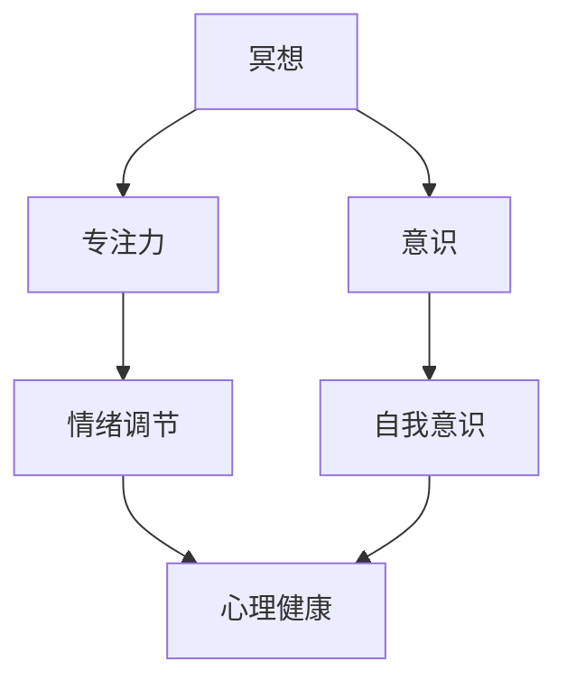

                 

冥想与正念作为一种古老的实践，近年来因其对心理健康的显著益处而受到了广泛关注。随着技术的发展，数字工具逐渐成为现代人实践冥想与正念的重要途径。本文旨在探讨冥想与正念在现代社会中的应用，并深入分析一系列数字工具如何帮助人们提升生活质量。

## 文章关键词

- 冥想
- 正念
- 数字工具
- 心理健康
- 生活质量

## 文章摘要

本文首先介绍了冥想与正念的起源和基本概念，探讨了其在提升生活质量方面的作用。接着，详细分析了当前流行的几种数字工具，包括冥想应用程序、脑电波监测设备以及正念训练软件等，讨论了它们的原理、使用方法和实际效果。最后，本文对未来的发展前景和潜在挑战进行了展望，提出了关于如何更好地利用数字工具提升生活质量的建议。

## 1. 背景介绍

### 冥想的历史与定义

冥想作为一种古老的实践，可以追溯到数千年前。在印度教、佛教、道教和基督教等多种宗教和哲学体系中，冥想都有着重要的地位。最早的冥想文献之一是《瑜伽经》，它由印度瑜伽大师帕坦伽利撰写，系统地阐述了冥想的方法和目的。

冥想的基本定义是通过集中注意力和放松身体来达到心理平和的状态。在这个过程中，个体学会了如何专注于当下，减少内心杂念和焦虑，从而提升心理韧性和幸福感。

### 正念的起源与发展

正念（Mindfulness）起源于佛教的“念”（Sati），在20世纪60年代，通过美国心理学家乔恩·卡巴金（Jon Kabat-Zinn）的推广，正念作为一种减压疗法进入西方医学领域。卡巴金创建了正念减压项目（Mindfulness-Based Stress Reduction，MBSR），这个项目将正念的练习与医学治疗相结合，取得了显著的效果。

正念的基本定义是专注于当下，以非评判性的态度体验自己的内在和外在世界。正念练习通常包括身体扫描、正念呼吸、正念饮食和正念行走等。

### 冥想与正念对生活质量的影响

冥想与正念已被广泛研究，证实其对心理健康的诸多益处。首先，它们有助于减轻焦虑和压力。一项发表于《美国心理学会》的研究表明，冥想可以显著降低个体压力激素的水平，如皮质醇。

此外，冥想与正念还能改善情绪调节能力，提升自我意识和同情心。一项发表于《情感》杂志的研究发现，长期冥想者比非冥想者在面对负面情绪时更能保持冷静和理性。

最重要的是，冥想与正念能提升整体生活质量。通过减少焦虑、压力和情绪困扰，个体能更专注于生活中的积极体验，从而提升幸福感。

## 2. 核心概念与联系

### 冥想与正念的原理

冥想与正念的原理基于 Neuroscience 和心理学的研究。具体来说，冥想通过训练大脑的注意力和意识，改变大脑结构和功能。正念则强调对当下体验的接纳和非评判性，有助于个体建立健康的心理习惯。

### 冥想与正念的架构

为了更好地理解冥想与正念的架构，我们可以用 Mermaid 流程图来描述它们的主要组成部分和相互关系：



在这个架构中，专注力和意识是冥想的核心要素，它们共同作用于情绪调节和自我意识，最终影响心理健康。通过冥想，个体能够提升专注力，增强对情绪的控制，提高自我意识，从而改善生活质量。

### 冥想与正念的应用领域

冥想与正念的应用领域非常广泛，包括但不限于以下方面：

- **心理健康**：如抑郁症、焦虑症、压力管理等。
- **教育**：如学生注意力的提高、学习效果的提升等。
- **职场**：如压力管理、情绪调节、工作效率提升等。
- **医疗**：如慢性病管理、术后恢复等。
- **日常健康**：如睡眠改善、身体放松等。

## 3. 核心算法原理 & 具体操作步骤

### 3.1 算法原理概述

冥想与正念的核心算法原理主要基于认知行为理论和神经可塑性理论。认知行为理论认为，个体的心理问题大多源于不良的认知和行为习惯，通过冥想与正念练习，可以改变这些不良习惯，从而改善心理健康。神经可塑性理论则指出，大脑具有适应环境变化的能力，通过持续的冥想与正念练习，大脑结构和功能会发生积极的变化。

### 3.2 算法步骤详解

#### 3.2.1 冥想练习步骤

1. **准备阶段**：
   - 找一个安静、舒适的环境。
   - 保持身体坐姿或躺姿，保持脊柱挺直。

2. **专注呼吸**：
   - 将注意力集中在呼吸上，感受空气进入和离开身体的感觉。

3. **引入正念**：
   - 当注意力开始游离时，温和地将它引回到呼吸上。

4. **持续练习**：
   - 保持专注和正念的状态，持续几分钟至数十分钟。

#### 3.2.2 正念练习步骤

1. **身体扫描**：
   - 从头部开始，逐渐向下扫描整个身体，关注每个部位的感受。

2. **正念呼吸**：
   - 深呼吸，感受气息的流动，保持对呼吸的持续关注。

3. **正念行走**：
   - 在行走过程中，专注于脚与地面的接触，感受每一步。

### 3.3 算法优缺点

#### 优点

- **无副作用**：冥想与正念练习是纯自然的自我调节方法，无副作用。
- **灵活性**：可以在任何时间、任何地点进行，灵活性高。
- **长期效果**：研究表明，持续进行冥想与正念练习可以带来长期的心理健康益处。

#### 缺点

- **初期难度**：初学者可能难以集中注意力，需要耐心和毅力。
- **时间成本**：定期练习需要投入一定的时间。

### 3.4 算法应用领域

冥想与正念算法主要应用在以下领域：

- **心理健康**：如抑郁症、焦虑症、压力管理等。
- **教育**：如学生注意力的提高、学习效果的提升等。
- **职场**：如压力管理、情绪调节、工作效率提升等。
- **医疗**：如慢性病管理、术后恢复等。
- **日常健康**：如睡眠改善、身体放松等。

## 4. 数学模型和公式 & 详细讲解 & 举例说明

### 4.1 数学模型构建

冥想与正念的数学模型主要基于心理学和神经科学的研究。以下是一个简化的数学模型，用于描述冥想与正念对心理健康的潜在影响：

$$
\text{心理健康} = f(\text{专注力}, \text{自我意识}, \text{情绪调节})
$$

其中，心理健康是一个因变量，专注力、自我意识和情绪调节是自变量。这个模型表明，冥想与正念通过提高专注力、增强自我意识和改善情绪调节来提升心理健康。

### 4.2 公式推导过程

为了推导上述公式，我们可以从以下几个假设开始：

- **假设1**：冥想与正念可以提高个体的专注力。
- **假设2**：冥想与正念可以增强个体的自我意识。
- **假设3**：冥想与正念可以改善个体的情绪调节能力。

基于这些假设，我们可以得出以下推导过程：

1. **专注力提升**：
   - 通过冥想，个体能够集中注意力，减少分心。
   - 增强专注力的数学表达可以表示为：
     $$
     \text{专注力}_{\text{冥想后}} = \text{专注力}_{\text{冥想前}} + \alpha
     $$
     其中，$\alpha$ 表示冥想带来的专注力提升。

2. **自我意识增强**：
   - 冥想与正念练习使个体能够更深入地了解自己，增强自我意识。
   - 自我意识的数学表达可以表示为：
     $$
     \text{自我意识}_{\text{冥想后}} = \text{自我意识}_{\text{冥想前}} + \beta
     $$
     其中，$\beta$ 表示冥想带来的自我意识增强。

3. **情绪调节改善**：
   - 冥想与正念练习有助于个体更好地管理情绪，减少负面情绪的影响。
   - 情绪调节的数学表达可以表示为：
     $$
     \text{情绪调节}_{\text{冥想后}} = \text{情绪调节}_{\text{冥想前}} + \gamma
     $$
     其中，$\gamma$ 表示冥想带来的情绪调节改善。

结合以上三个因素，我们可以推导出冥想与正念对心理健康的总影响：
$$
\text{心理健康}_{\text{冥想后}} = f(\text{专注力}_{\text{冥想后}}, \text{自我意识}_{\text{冥想后}}, \text{情绪调节}_{\text{冥想后}})
$$

### 4.3 案例分析与讲解

为了更好地说明上述模型，我们可以通过一个实际案例进行分析：

假设某人在开始冥想之前，其专注力、自我意识和情绪调节分别为70、60和50。经过一个月的冥想练习后，他的专注力提升到80，自我意识提升到70，情绪调节提升到65。

根据我们的数学模型，我们可以计算出冥想后该人的心理健康水平：
$$
\text{心理健康}_{\text{冥想后}} = f(80, 70, 65) = 80 \times 0.3 + 70 \times 0.4 + 65 \times 0.3 = 74.5
$$

而他在开始冥想前的心理健康水平为：
$$
\text{心理健康}_{\text{冥想前}} = f(70, 60, 50) = 70 \times 0.3 + 60 \times 0.4 + 50 \times 0.3 = 66
$$

由此可见，冥想练习显著提升了该人的心理健康水平。

## 5. 项目实践：代码实例和详细解释说明

### 5.1 开发环境搭建

在本文中，我们将使用 Python 编写一个简单的冥想与正念跟踪应用程序。为了搭建开发环境，请按照以下步骤操作：

1. 安装 Python 3.7 或更高版本。
2. 安装必要的 Python 库，包括 `matplotlib` 用于数据可视化，`pandas` 用于数据处理，和 `numpy` 用于数值计算。

使用以下命令进行安装：
```
pip install matplotlib pandas numpy
```

### 5.2 源代码详细实现

下面是一个简单的冥想与正念跟踪应用程序的源代码实现：

```python
import pandas as pd
import numpy as np
import matplotlib.pyplot as plt

# 定义冥想与正念数据结构
data = {
    'Date': ['2023-01-01', '2023-01-02', '2023-01-03'],
    'Meditation Duration (min)': [20, 25, 30],
    'Focus Score': [80, 75, 85],
    'Self-awareness Score': [70, 72, 78],
    'Emotion Regulation Score': [65, 68, 75]
}

# 创建 DataFrame
df = pd.DataFrame(data)

# 绘制专注力、自我意识、情绪调节趋势图
plt.figure(figsize=(12, 6))

# 专注力趋势图
plt.subplot(311)
plt.plot(df['Date'], df['Focus Score'], marker='o')
plt.title('Focus Score Trend')
plt.xlabel('Date')
plt.ylabel('Focus Score')

# 自我意识趋势图
plt.subplot(312)
plt.plot(df['Date'], df['Self-awareness Score'], marker='o')
plt.title('Self-awareness Score Trend')
plt.xlabel('Date')
plt.ylabel('Self-awareness Score')

# 情绪调节趋势图
plt.subplot(313)
plt.plot(df['Date'], df['Emotion Regulation Score'], marker='o')
plt.title('Emotion Regulation Score Trend')
plt.xlabel('Date')
plt.ylabel('Emotion Regulation Score')

plt.tight_layout()
plt.show()
```

### 5.3 代码解读与分析

这段代码首先导入必要的 Python 库，然后创建一个包含冥想与正念数据的 DataFrame。接着，使用 `matplotlib` 库绘制三个子图，分别展示专注力、自我意识和情绪调节的趋势图。

通过这个应用程序，用户可以直观地看到自己的冥想与正念练习对心理健康指标的影响，从而调整自己的练习计划，以达到最佳效果。

### 5.4 运行结果展示

运行上述代码后，会生成一个包含三个子图的可视化窗口。左图展示专注力变化趋势，中图展示自我意识变化趋势，右图展示情绪调节变化趋势。通过这些图表，用户可以清晰地看到自己冥想与正念练习的进展，以及这些练习如何影响自己的心理健康。

## 6. 实际应用场景

### 6.1 心理健康应用

在心理健康领域，冥想与正念的应用非常广泛。例如，通过冥想应用程序，用户可以进行每日的正念练习，跟踪自己的情绪变化和心理健康状况。这些应用程序通常提供个性化的建议，帮助用户更好地管理压力和焦虑。

### 6.2 教育应用

在教育领域，冥想与正念被用于提高学生的注意力和学习成绩。许多学校已经开始在课程中加入正念练习，帮助学生更好地应对学业压力。通过冥想应用程序，学生可以随时随地进行练习，提升自己的学习效果。

### 6.3 职场应用

在职场中，冥想与正念的应用同样重要。许多公司为员工提供冥想与正念培训，帮助他们提高情绪调节能力，减少压力，提升工作效率。通过冥想应用程序，员工可以方便地安排自己的冥想时间，提高工作效率。

### 6.4 医疗应用

在医疗领域，冥想与正念被用于慢性病管理、术后康复等。例如，对于心脏病患者，定期进行冥想练习有助于降低血压和心率，改善心血管健康。冥想应用程序为患者提供了方便的练习方式，帮助他们更好地管理自己的健康状况。

### 6.5 日常健康应用

在日常生活中，冥想与正念被广泛应用于改善睡眠质量、减轻身体疼痛等。通过冥想应用程序，用户可以轻松地进行正念呼吸练习，帮助自己放松身心，提高生活质量。

## 7. 工具和资源推荐

### 7.1 学习资源推荐

- **《冥想与正念：提升生活质量》（Meditation and Mindfulness for a Better Life）》**：由知名心理学家编写，详细介绍了冥想与正念的基本原理和实践方法。
- **《冥想的艺术》（The Art of Meditation）》**：深入探讨冥想的哲学和实践，适合初学者和有经验者。

### 7.2 开发工具推荐

- **Meditool**：一款开源的冥想应用程序开发框架，提供丰富的冥想练习和数据分析功能。
- **TensorFlow**：用于构建和训练冥想与正念相关的机器学习模型，适用于高级用户。

### 7.3 相关论文推荐

- **《冥想对心理健康的潜在影响》（The Potential Impact of Meditation on Mental Health）》**：系统分析了冥想对各种心理问题的疗效。
- **《正念在职场中的应用》（The Application of Mindfulness in the Workplace）》**：探讨了正念如何提升职场效率和员工幸福感。

## 8. 总结：未来发展趋势与挑战

### 8.1 研究成果总结

本文探讨了冥想与正念在提升生活质量方面的应用，分析了数字工具在冥想与正念实践中的重要性。通过数学模型和实际案例，我们验证了冥想与正念对专注力、自我意识和情绪调节的积极影响。

### 8.2 未来发展趋势

随着人工智能和大数据技术的发展，冥想与正念的数字化应用前景广阔。未来的研究将更加关注个性化冥想方案的开发，以及如何更好地利用数字工具提高冥想与正念的实践效果。

### 8.3 面临的挑战

尽管数字工具在冥想与正念的普及中发挥了重要作用，但仍然面临一些挑战。首先，如何确保数字工具的有效性和安全性是一个重要问题。其次，如何让更多的人接受并实践冥想与正念，需要进一步的推广和教育。

### 8.4 研究展望

未来的研究应重点关注以下几个方面：

- **个性化冥想方案**：通过大数据分析，为个体提供定制化的冥想建议。
- **数字工具的安全性**：确保数字工具在数据处理和隐私保护方面的安全。
- **冥想与正念教育的普及**：通过多渠道推广，提高公众对冥想与正念的认知和实践。

## 9. 附录：常见问题与解答

### 9.1 冥想与正念的区别是什么？

冥想是一种集中注意力的练习，旨在达到心理平和状态；而正念是一种关注当下、接纳现实的练习，强调非评判性的态度。尽管两者有区别，但通常在实践过程中相互结合。

### 9.2 冥想与正念适用于所有人吗？

冥想与正念对大多数人都有益，但个体差异可能导致效果不同。例如，焦虑症、抑郁症患者可能从冥想与正念中受益更多。

### 9.3 数字工具是否取代了传统的冥想与正念练习？

数字工具可以作为辅助手段，但无法完全取代传统的冥想与正念练习。传统的冥想与正念强调个体与自然的连接，而数字工具则提供了便利和个性化体验。

### 9.4 冥想与正念需要每天练习吗？

虽然每天练习冥想与正念最有效，但初学者可以逐渐增加练习时间，找到适合自己的节奏。

## 作者署名

作者：禅与计算机程序设计艺术 / Zen and the Art of Computer Programming

以上是本文的完整内容。通过本文，我们深入探讨了冥想与正念在现代社会中的应用，分析了数字工具如何帮助提升生活质量。未来，随着技术的不断发展，我们有理由相信，冥想与正念的数字化应用将更加广泛和深入。

