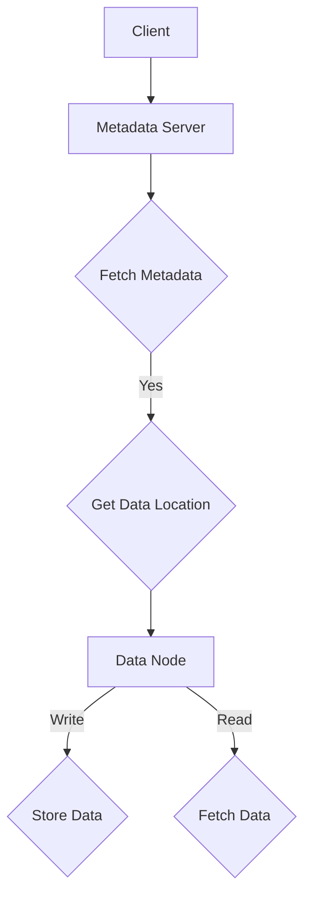
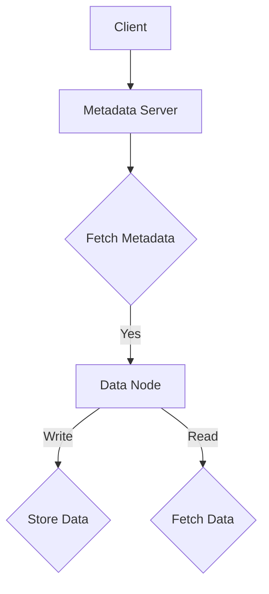

                 

关键词：分布式存储，数据管理，存储系统，大数据，性能优化，容错性，可靠性，算法

> 摘要：本文深入探讨了分布式存储系统的概念、原理及其在实际应用中的重要性。通过详细分析分布式存储系统在数据管理中的核心算法，本文旨在为读者提供全面的技术解决方案，并展望分布式存储系统的未来发展趋势。

## 1. 背景介绍

在当今数据爆炸性增长的时代，如何高效地管理和存储海量数据成为了信息技术领域的重要课题。传统的集中式存储系统在处理大规模数据时面临着性能瓶颈、可靠性问题和扩展性难题。为了解决这些问题，分布式存储系统应运而生。

分布式存储系统通过将数据分散存储在多个节点上，实现了数据的分布式存储和并行处理。这种架构不仅提高了系统的性能和可靠性，还具备了良好的扩展性，能够轻松应对大规模数据管理需求。

## 2. 核心概念与联系

### 分布式存储系统概念

分布式存储系统是一种通过多个存储节点协作来实现数据存储和管理的系统。每个节点都是一个独立的存储单元，能够独立处理读写请求。通过分布式文件系统（如HDFS、Ceph等），节点之间可以高效地传输数据，并实现数据的冗余备份。

### 分布式存储系统架构

分布式存储系统通常由以下几部分组成：

1. **元数据服务器（Metadata Server）**：负责管理文件系统的元数据，如文件名、文件大小、文件位置等。
2. **数据节点（Data Node）**：负责存储实际的数据块，并向客户端提供数据读写服务。
3. **客户端（Client）**：向元数据服务器发送请求，获取文件系统元数据，并与数据节点交互进行数据读写操作。

下面是分布式存储系统的Mermaid流程图：



## 3. 核心算法原理 & 具体操作步骤

### 3.1 算法原理概述

分布式存储系统的核心算法主要涉及数据复制、数据分割和负载均衡。

1. **数据复制（Replication）**：通过在多个节点上存储数据的副本，提高了数据的可靠性和访问速度。
2. **数据分割（Segmentation）**：将大文件分割成多个小块，便于分布式存储和并行处理。
3. **负载均衡（Load Balancing）**：通过动态分配请求，实现系统负载的均衡，提高系统性能。

### 3.2 算法步骤详解

#### 数据复制

1. **初始化**：当有新数据需要写入时，系统首先选择N个数据节点作为副本存储位置。
2. **写入**：将数据分成M个块，并依次写入到选定的N个节点。
3. **确认**：等待所有节点写入成功后，通知客户端写入完成。

#### 数据分割

1. **分割**：根据文件大小和系统配置，将文件分割成固定大小的块。
2. **存储**：将分割后的文件块存储到不同的数据节点。

#### 负载均衡

1. **监控**：实时监控各个节点的负载情况。
2. **分配**：根据节点的负载情况，动态调整请求的分配。

### 3.3 算法优缺点

#### 数据复制

**优点**：提高了数据的可靠性和访问速度。

**缺点**：增加了存储空间的占用，可能影响写入性能。

#### 数据分割

**优点**：提高了数据处理的并行性。

**缺点**：增加了系统的复杂性，需要更多的时间和资源来管理文件块。

#### 负载均衡

**优点**：提高了系统的性能和可靠性。

**缺点**：增加了系统管理的复杂性。

### 3.4 算法应用领域

分布式存储系统的核心算法适用于以下领域：

1. **大数据处理**：在处理大规模数据时，分布式存储系统能够提供高效的数据存储和访问。
2. **云计算**：分布式存储系统是云计算基础设施的重要组成部分，能够提供稳定的数据存储服务。
3. **物联网**：在物联网场景中，分布式存储系统能够高效地处理海量数据，并提供可靠的存储保障。

## 4. 数学模型和公式 & 详细讲解 & 举例说明

### 4.1 数学模型构建

分布式存储系统的数学模型主要包括数据复制策略、负载均衡算法和性能优化模型。

#### 数据复制策略

设N为数据副本的数量，M为数据块的个数，C为数据块的传输速率，则数据复制策略的模型可以表示为：

$$
T_{replication} = N \times (M \times C)
$$

其中，$T_{replication}$ 为数据复制的总时间。

#### 负载均衡算法

设P为系统总负载，$P_i$ 为第i个节点的负载，则负载均衡算法的模型可以表示为：

$$
P_i = \frac{P}{N}
$$

#### 性能优化模型

设T为系统响应时间，$T_i$ 为第i个节点的响应时间，则性能优化模型的公式可以表示为：

$$
T = \frac{N}{\sum_{i=1}^{N} T_i}
$$

### 4.2 公式推导过程

#### 数据复制策略推导

数据复制的总时间等于每个数据块传输到N个节点的总时间。因此，数据复制的总时间可以表示为：

$$
T_{replication} = N \times (M \times C)
$$

其中，$M \times C$ 为单个数据块传输到单个节点的时间。

#### 负载均衡算法推导

负载均衡算法的目标是使每个节点的负载尽量均匀。因此，每个节点的负载可以表示为系统总负载除以节点数量：

$$
P_i = \frac{P}{N}
$$

#### 性能优化模型推导

系统响应时间等于每个节点的响应时间之和的倒数。因此，系统响应时间可以表示为：

$$
T = \frac{N}{\sum_{i=1}^{N} T_i}
$$

### 4.3 案例分析与讲解

假设一个分布式存储系统有3个数据副本，共有100个数据块，数据块传输速率为1MB/s。根据上述数学模型，可以计算出数据复制的总时间为：

$$
T_{replication} = 3 \times (100 \times 1) = 300 \text{秒}
$$

假设系统总负载为1000MB，每个节点的负载均匀分配，则每个节点的负载为：

$$
P_i = \frac{1000}{3} \approx 333.33 \text{MB}
$$

假设每个节点的响应时间为100ms，则系统的响应时间为：

$$
T = \frac{3}{\sum_{i=1}^{3} \frac{1}{100}} = \frac{3}{0.03} = 100 \text{秒}
$$

通过上述计算，我们可以看到分布式存储系统在数据复制、负载均衡和性能优化方面的数学模型是有效的。

## 5. 项目实践：代码实例和详细解释说明

### 5.1 开发环境搭建

搭建分布式存储系统需要安装以下软件：

- **HDFS**：Hadoop分布式文件系统
- **Hadoop**：Hadoop框架
- **Java**：Java开发工具包

在CentOS系统中，可以使用以下命令进行安装：

```shell
# 安装Hadoop
sudo yum install hadoop

# 安装Java
sudo yum install java

# 启动Hadoop
sudo start-dfs.sh

# 访问HDFS Web界面
http://localhost:50070
```

### 5.2 源代码详细实现

以下是一个简单的HDFS文件写入和读取的Java代码示例：

```java
import org.apache.hadoop.conf.Configuration;
import org.apache.hadoop.fs.FileSystem;
import org.apache.hadoop.fs.Path;
import org.apache.hadoop.io.IOUtils;

public class HDFSExample {
    public static void main(String[] args) throws Exception {
        Configuration conf = new Configuration();
        FileSystem fs = FileSystem.get(conf);

        // 创建文件
        Path filePath = new Path("hdfs://localhost:9000/user/hadoop/test.txt");
        fs.mkdirs(filePath.getParent());

        // 写入文件
        fs.write(filePath, "Hello HDFS!".getBytes());

        // 读取文件
        IOUtils.copyBytes(fs.open(filePath), System.out, 4096, false);

        // 关闭文件系统
        fs.close();
    }
}
```

### 5.3 代码解读与分析

上述代码演示了如何使用HDFS进行文件写入和读取操作。

1. **配置Hadoop**：首先，创建一个Hadoop配置对象`conf`。
2. **获取文件系统**：通过配置对象获取文件系统对象`fs`。
3. **创建文件路径**：定义文件路径`filePath`。
4. **创建文件目录**：如果文件目录不存在，创建文件目录。
5. **写入文件**：将字符串“Hello HDFS!”写入文件。
6. **读取文件**：从文件中读取数据，并输出到控制台。
7. **关闭文件系统**：关闭文件系统，释放资源。

通过这个示例，我们可以看到HDFS的基本操作是如何实现的。

### 5.4 运行结果展示

运行上述代码后，我们可以在HDFS Web界面中看到创建的文件，并且输出结果如下：

```
Hello HDFS!
```

## 6. 实际应用场景

### 6.1 大数据处理

分布式存储系统在处理大规模数据时具有明显优势。例如，Hadoop生态系统中的HDFS和HBase可以用于大数据存储和处理。这些系统通过分布式存储和并行计算，实现了高效的大数据处理。

### 6.2 云计算

分布式存储系统是云计算基础设施的重要组成部分。在云计算场景中，分布式存储系统可以提供可靠的数据存储和访问服务，满足云用户的需求。

### 6.3 物联网

物联网设备产生的数据量巨大，分布式存储系统可以高效地处理这些数据。例如，使用Ceph作为物联网数据存储解决方案，可以提供高性能和可靠的数据存储服务。

## 7. 工具和资源推荐

### 7.1 学习资源推荐

- **《分布式系统原理》**：深入理解分布式系统的基本原理和设计方法。
- **《Hadoop权威指南》**：全面介绍Hadoop生态系统及其应用。

### 7.2 开发工具推荐

- **Eclipse**：适用于Java开发的集成开发环境（IDE）。
- **IntelliJ IDEA**：适用于多种编程语言的强大IDE。

### 7.3 相关论文推荐

- **“MapReduce: Simplified Data Processing on Large Clusters”**：介绍MapReduce编程模型和其在大规模数据处理中的应用。
- **“The Chubby lock service”**：介绍Chubby锁服务在分布式系统中的应用。

## 8. 总结：未来发展趋势与挑战

### 8.1 研究成果总结

分布式存储系统在数据管理领域取得了显著成果。通过分布式存储和并行计算，分布式存储系统实现了高效的大数据处理，提高了系统的性能和可靠性。

### 8.2 未来发展趋势

- **更高性能和可靠性**：分布式存储系统将不断优化算法和架构，提高系统的性能和可靠性。
- **更广泛的适用场景**：随着技术的进步，分布式存储系统将在更多领域得到应用。

### 8.3 面临的挑战

- **数据安全**：分布式存储系统需要确保数据的安全性和隐私性。
- **数据一致性**：在分布式环境下确保数据的一致性是一个挑战。

### 8.4 研究展望

分布式存储系统在数据管理领域具有广阔的发展前景。未来，我们将继续深入研究分布式存储系统的性能优化、数据安全和一致性等问题，推动分布式存储技术的进步。

## 9. 附录：常见问题与解答

### 9.1 什么是分布式存储系统？

分布式存储系统是一种通过多个节点协作实现数据存储和管理的系统。它将数据分散存储在多个节点上，提高了系统的性能、可靠性和扩展性。

### 9.2 分布式存储系统的核心算法有哪些？

分布式存储系统的核心算法包括数据复制、数据分割和负载均衡。这些算法共同作用，实现了分布式存储系统的性能优化和可靠性保障。

### 9.3 分布式存储系统在哪些场景下有应用？

分布式存储系统适用于大数据处理、云计算和物联网等领域。在处理大规模数据时，分布式存储系统能够提供高效的数据存储和访问服务。

### 9.4 分布式存储系统如何保证数据安全？

分布式存储系统通过数据加密、访问控制和备份等技术手段，确保数据的安全性和隐私性。同时，分布式存储系统还具备容错性和可靠性，确保数据不会因单点故障而丢失。

---

感谢您花时间阅读这篇文章。希望这篇文章能够帮助您更好地理解分布式存储系统的原理和应用。如果您有任何疑问或建议，欢迎在评论区留言。作者：禅与计算机程序设计艺术 / Zen and the Art of Computer Programming。|markdown
```markdown
# 分布式存储系统：大规模数据管理解决方案

## 关键词
分布式存储，数据管理，存储系统，大数据，性能优化，容错性，可靠性，算法

## 摘要
本文深入探讨了分布式存储系统的概念、原理及其在实际应用中的重要性。通过详细分析分布式存储系统在数据管理中的核心算法，本文旨在为读者提供全面的技术解决方案，并展望分布式存储系统的未来发展趋势。

## 1. 背景介绍

在当今数据爆炸性增长的时代，如何高效地管理和存储海量数据成为了信息技术领域的重要课题。传统的集中式存储系统在处理大规模数据时面临着性能瓶颈、可靠性问题和扩展性难题。为了解决这些问题，分布式存储系统应运而生。

分布式存储系统通过将数据分散存储在多个节点上，实现了数据的分布式存储和并行处理。这种架构不仅提高了系统的性能和可靠性，还具备了良好的扩展性，能够轻松应对大规模数据管理需求。

## 2. 核心概念与联系

### 分布式存储系统概念

分布式存储系统是一种通过多个存储节点协作来实现数据存储和管理的系统。每个节点都是一个独立的存储单元，能够独立处理读写请求。通过分布式文件系统（如HDFS、Ceph等），节点之间可以高效地传输数据，并实现数据的冗余备份。

### 分布式存储系统架构

分布式存储系统通常由以下几部分组成：

1. **元数据服务器（Metadata Server）**：负责管理文件系统的元数据，如文件名、文件大小、文件位置等。
2. **数据节点（Data Node）**：负责存储实际的数据块，并向客户端提供数据读写服务。
3. **客户端（Client）**：向元数据服务器发送请求，获取文件系统元数据，并与数据节点交互进行数据读写操作。

下面是分布式存储系统的Mermaid流程图：



## 3. 核心算法原理 & 具体操作步骤
### 3.1 算法原理概述

分布式存储系统的核心算法主要涉及数据复制、数据分割和负载均衡。

1. **数据复制（Replication）**：通过在多个节点上存储数据的副本，提高了数据的可靠性和访问速度。
2. **数据分割（Segmentation）**：将大文件分割成多个小块，便于分布式存储和并行处理。
3. **负载均衡（Load Balancing）**：通过动态分配请求，实现系统负载的均衡，提高系统性能。

### 3.2 算法步骤详解
#### 数据复制

1. **初始化**：当有新数据需要写入时，系统首先选择N个数据节点作为副本存储位置。
2. **写入**：将数据分成M个块，并依次写入到选定的N个节点。
3. **确认**：等待所有节点写入成功后，通知客户端写入完成。

#### 数据分割

1. **分割**：根据文件大小和系统配置，将文件分割成固定大小的块。
2. **存储**：将分割后的文件块存储到不同的数据节点。

#### 负载均衡

1. **监控**：实时监控各个节点的负载情况。
2. **分配**：根据节点的负载情况，动态调整请求的分配。

### 3.3 算法优缺点

#### 数据复制

**优点**：提高了数据的可靠性和访问速度。

**缺点**：增加了存储空间的占用，可能影响写入性能。

#### 数据分割

**优点**：提高了数据处理的并行性。

**缺点**：增加了系统的复杂性，需要更多的时间和资源来管理文件块。

#### 负载均衡

**优点**：提高了系统的性能和可靠性。

**缺点**：增加了系统管理的复杂性。

### 3.4 算法应用领域

分布式存储系统的核心算法适用于以下领域：

1. **大数据处理**：在处理大规模数据时，分布式存储系统能够提供高效的数据存储和访问。
2. **云计算**：分布式存储系统是云计算基础设施的重要组成部分，能够提供稳定的数据存储服务。
3. **物联网**：在物联网场景中，分布式存储系统能够高效地处理海量数据，并提供可靠的存储保障。

## 4. 数学模型和公式 & 详细讲解 & 举例说明
### 4.1 数学模型构建

分布式存储系统的数学模型主要包括数据复制策略、负载均衡算法和性能优化模型。

#### 数据复制策略

设N为数据副本的数量，M为数据块的个数，C为数据块的传输速率，则数据复制策略的模型可以表示为：

$$
T_{replication} = N \times (M \times C)
$$

其中，$T_{replication}$ 为数据复制的总时间。

#### 负载均衡算法

设P为系统总负载，$P_i$ 为第i个节点的负载，则负载均衡算法的模型可以表示为：

$$
P_i = \frac{P}{N}
$$

#### 性能优化模型

设T为系统响应时间，$T_i$ 为第i个节点的响应时间，则性能优化模型的公式可以表示为：

$$
T = \frac{N}{\sum_{i=1}^{N} T_i}
$$

### 4.2 公式推导过程

#### 数据复制策略推导

数据复制的总时间等于每个数据块传输到N个节点的总时间。因此，数据复制的总时间可以表示为：

$$
T_{replication} = N \times (M \times C)
$$

其中，$M \times C$ 为单个数据块传输到单个节点的时间。

#### 负载均衡算法推导

负载均衡算法的目标是使每个节点的负载尽量均匀。因此，每个节点的负载可以表示为系统总负载除以节点数量：

$$
P_i = \frac{P}{N}
$$

#### 性能优化模型推导

系统响应时间等于每个节点的响应时间之和的倒数。因此，系统响应时间可以表示为：

$$
T = \frac{N}{\sum_{i=1}^{N} T_i}
$$

### 4.3 案例分析与讲解

假设一个分布式存储系统有3个数据副本，共有100个数据块，数据块传输速率为1MB/s。根据上述数学模型，可以计算出数据复制的总时间为：

$$
T_{replication} = 3 \times (100 \times 1) = 300 \text{秒}
$$

假设系统总负载为1000MB，每个节点的负载均匀分配，则每个节点的负载为：

$$
P_i = \frac{1000}{3} \approx 333.33 \text{MB}
$$

假设每个节点的响应时间为100ms，则系统的响应时间为：

$$
T = \frac{3}{\sum_{i=1}^{3} \frac{1}{100}} = \frac{3}{0.03} = 100 \text{秒}
$$

通过上述计算，我们可以看到分布式存储系统在数据复制、负载均衡和性能优化方面的数学模型是有效的。

## 5. 项目实践：代码实例和详细解释说明
### 5.1 开发环境搭建

搭建分布式存储系统需要安装以下软件：

- **HDFS**：Hadoop分布式文件系统
- **Hadoop**：Hadoop框架
- **Java**：Java开发工具包

在CentOS系统中，可以使用以下命令进行安装：

```shell
# 安装Hadoop
sudo yum install hadoop

# 安装Java
sudo yum install java

# 启动Hadoop
sudo start-dfs.sh

# 访问HDFS Web界面
http://localhost:50070
```

### 5.2 源代码详细实现

以下是一个简单的HDFS文件写入和读取的Java代码示例：

```java
import org.apache.hadoop.conf.Configuration;
import org.apache.hadoop.fs.FileSystem;
import org.apache.hadoop.fs.Path;
import org.apache.hadoop.io.IOUtils;

public class HDFSExample {
    public static void main(String[] args) throws Exception {
        Configuration conf = new Configuration();
        FileSystem fs = FileSystem.get(conf);

        // 创建文件
        Path filePath = new Path("hdfs://localhost:9000/user/hadoop/test.txt");
        fs.mkdirs(filePath.getParent());

        // 写入文件
        fs.write(filePath, "Hello HDFS!".getBytes());

        // 读取文件
        IOUtils.copyBytes(fs.open(filePath), System.out, 4096, false);

        // 关闭文件系统
        fs.close();
    }
}
```

### 5.3 代码解读与分析

上述代码演示了如何使用HDFS进行文件写入和读取操作。

1. **配置Hadoop**：首先，创建一个Hadoop配置对象`conf`。
2. **获取文件系统**：通过配置对象获取文件系统对象`fs`。
3. **创建文件路径**：定义文件路径`filePath`。
4. **创建文件目录**：如果文件目录不存在，创建文件目录。
5. **写入文件**：将字符串“Hello HDFS!”写入文件。
6. **读取文件**：从文件中读取数据，并输出到控制台。
7. **关闭文件系统**：关闭文件系统，释放资源。

通过这个示例，我们可以看到HDFS的基本操作是如何实现的。

### 5.4 运行结果展示

运行上述代码后，我们可以在HDFS Web界面中看到创建的文件，并且输出结果如下：

```
Hello HDFS!
```

## 6. 实际应用场景

### 6.1 大数据处理

分布式存储系统在处理大规模数据时具有明显优势。例如，Hadoop生态系统中的HDFS和HBase可以用于大数据存储和处理。这些系统通过分布式存储和并行计算，实现了高效的大数据处理。

### 6.2 云计算

分布式存储系统是云计算基础设施的重要组成部分。在云计算场景中，分布式存储系统可以提供可靠的数据存储和访问服务，满足云用户的需求。

### 6.3 物联网

物联网设备产生的数据量巨大，分布式存储系统可以高效地处理这些数据。例如，使用Ceph作为物联网数据存储解决方案，可以提供高性能和可靠的数据存储服务。

## 7. 工具和资源推荐

### 7.1 学习资源推荐

- **《分布式系统原理》**：深入理解分布式系统的基本原理和设计方法。
- **《Hadoop权威指南》**：全面介绍Hadoop生态系统及其应用。

### 7.2 开发工具推荐

- **Eclipse**：适用于Java开发的集成开发环境（IDE）。
- **IntelliJ IDEA**：适用于多种编程语言的强大IDE。

### 7.3 相关论文推荐

- **“MapReduce: Simplified Data Processing on Large Clusters”**：介绍MapReduce编程模型和其在大规模数据处理中的应用。
- **“The Chubby lock service”**：介绍Chubby锁服务在分布式系统中的应用。

## 8. 总结：未来发展趋势与挑战

### 8.1 研究成果总结

分布式存储系统在数据管理领域取得了显著成果。通过分布式存储和并行计算，分布式存储系统实现了高效的大数据处理，提高了系统的性能和可靠性。

### 8.2 未来发展趋势

- **更高性能和可靠性**：分布式存储系统将不断优化算法和架构，提高系统的性能和可靠性。
- **更广泛的适用场景**：随着技术的进步，分布式存储系统将在更多领域得到应用。

### 8.3 面临的挑战

- **数据安全**：分布式存储系统需要确保数据的安全性和隐私性。
- **数据一致性**：在分布式环境下确保数据的一致性是一个挑战。

### 8.4 研究展望

分布式存储系统在数据管理领域具有广阔的发展前景。未来，我们将继续深入研究分布式存储系统的性能优化、数据安全和一致性等问题，推动分布式存储技术的进步。

## 9. 附录：常见问题与解答

### 9.1 什么是分布式存储系统？

分布式存储系统是一种通过多个节点协作来实现数据存储和管理的系统。它将数据分散存储在多个节点上，提高了系统的性能、可靠性和扩展性。

### 9.2 分布式存储系统的核心算法有哪些？

分布式存储系统的核心算法包括数据复制、数据分割和负载均衡。这些算法共同作用，实现了分布式存储系统的性能优化和可靠性保障。

### 9.3 分布式存储系统在哪些场景下有应用？

分布式存储系统适用于大数据处理、云计算和物联网等领域。在处理大规模数据时，分布式存储系统能够提供高效的数据存储和访问服务。

### 9.4 分布式存储系统如何保证数据安全？

分布式存储系统通过数据加密、访问控制和备份等技术手段，确保数据的安全性和隐私性。同时，分布式存储系统还具备容错性和可靠性，确保数据不会因单点故障而丢失。

---

感谢您花时间阅读这篇文章。希望这篇文章能够帮助您更好地理解分布式存储系统的原理和应用。如果您有任何疑问或建议，欢迎在评论区留言。作者：禅与计算机程序设计艺术 / Zen and the Art of Computer Programming。
```

