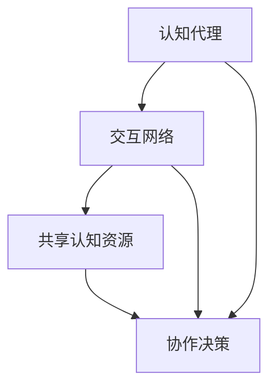
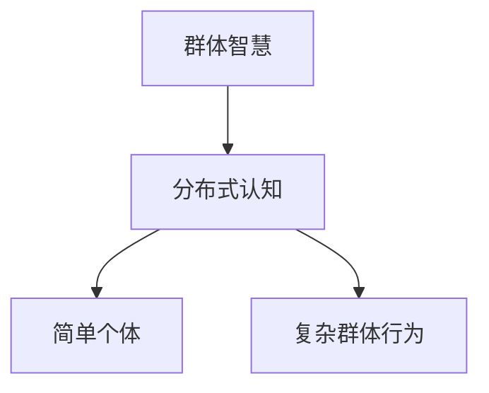

                 

关键词：分布式认知、群体智慧、人工智能、分布式系统、协作算法

> 摘要：本文深入探讨了分布式认知领域的核心概念、算法原理、数学模型及其实际应用。通过分析分布式认知在人工智能和分布式系统中的应用，本文揭示了群体智慧的潜力与挑战，并提出了未来研究方向。

## 1. 背景介绍

### 1.1 分布式认知的定义与重要性

分布式认知（Distributed Cognition）是一个涉及心理学、认知科学和计算机科学等多学科交叉的研究领域。它探讨了个体认知如何在多个分布式实体（如计算机节点或个体）之间交互和共享，以实现更复杂和高效的任务。分布式认知的重要性在于它为我们理解人类智能和社会互动提供了新的视角，同时也为人工智能系统的发展带来了新的机遇。

### 1.2 群体智慧的概念与特征

群体智慧（Swarm Intelligence）是指由大量简单个体通过局部信息交换和简单规则相互作用所形成的集体行为。这些个体通常不具备全局知识，但整体表现出复杂的适应性和智能行为。群体智慧在自然界中广泛存在，如鸟群飞行、蚂蚁觅食等。随着计算机技术的进步，群体智慧在人工系统中的应用日益广泛，如分布式传感器网络、无人驾驶车队等。

### 1.3 分布式认知在人工智能中的应用

分布式认知与人工智能（AI）的结合，使得人工智能系统能够更有效地处理复杂任务。例如，在多智能体系统（Multi-Agent Systems）中，分布式认知能够帮助多个智能体协同工作，实现更高效的决策和任务分配。此外，分布式认知还促进了机器学习和深度学习领域的发展，通过分布式训练和推理，提升模型性能和计算效率。

## 2. 核心概念与联系

### 2.1 分布式认知的基本概念

分布式认知的核心概念包括：

- **认知代理（Cognitive Agent）**：具有认知能力的实体，可以是人类个体或人工智能系统。
- **交互网络（Interaction Network）**：描述代理之间信息交换的拓扑结构。
- **共享认知资源（Shared Cognition Resources）**：代理共享的信息和知识，如数据、模型和规则。
- **协作决策（Collaborative Decision-Making）**：多个代理共同做出决策的过程。

### 2.2 分布式认知架构的Mermaid流程图



### 2.3 群体智慧与分布式认知的关系

群体智慧是分布式认知的一个典型应用场景。群体智慧中的简单个体通过分布式认知机制实现协同工作，形成复杂的群体行为。两者之间的关系如图：



## 3. 核心算法原理 & 具体操作步骤

### 3.1 算法原理概述

分布式认知算法的核心原理包括：

- **局部信息处理**：每个代理仅使用局部信息做出决策。
- **简单规则**：代理遵循简单规则进行交互和协作。
- **自适应调整**：代理根据环境变化调整行为和策略。

### 3.2 算法步骤详解

分布式认知算法的步骤通常包括：

1. **初始化**：设置代理和交互网络。
2. **信息收集**：代理收集局部信息。
3. **规则应用**：代理根据简单规则处理信息。
4. **决策生成**：代理生成决策。
5. **更新策略**：代理根据决策更新行为策略。
6. **迭代**：重复上述步骤，直至达到目标。

### 3.3 算法优缺点

**优点**：

- **高效性**：分布式算法能够利用局部信息快速处理复杂任务。
- **容错性**：系统具备一定程度的容错性，即使部分代理失效，整体系统仍能运行。

**缺点**：

- **局限性**：代理只能基于局部信息决策，可能无法获得全局最优解。
- **复杂性**：算法设计和管理较为复杂。

### 3.4 算法应用领域

分布式认知算法广泛应用于：

- **智能交通**：优化交通流量，减少拥堵。
- **机器人协作**：实现多机器人系统的协同作业。
- **物联网**：优化物联网设备的管理和协作。

## 4. 数学模型和公式 & 详细讲解 & 举例说明

### 4.1 数学模型构建

分布式认知的数学模型通常基于图论和概率论。以下是一个简单的分布式认知模型的构建：

$$
P_t = (1 - \epsilon)P_{t-1} + \epsilon N(P_{t-1})
$$

其中，$P_t$ 表示时间 $t$ 时刻的代理状态，$\epsilon$ 是调整参数，$N(P_{t-1})$ 是基于前一时间步的邻居状态进行的信息更新。

### 4.2 公式推导过程

公式的推导基于局部信息处理和简单规则的原理。通过迭代更新代理状态，模型能够实现分布式决策。

### 4.3 案例分析与讲解

以下是一个简单的案例，描述如何使用分布式认知算法优化交通流量：

**案例**：假设一个交通网络中有多个路口，每个路口的信号灯由不同的代理控制。代理根据本地交通流量信息调整信号灯的状态。

**步骤**：

1. **初始化**：每个代理记录当前路口的交通流量。
2. **信息收集**：每个代理与邻居代理交换交通流量信息。
3. **规则应用**：代理根据邻居的交通流量信息调整信号灯状态。
4. **迭代**：重复上述步骤，直至达到最优交通流量配置。

通过数学模型和算法，系统能够自动调整信号灯状态，优化交通流量。

## 5. 项目实践：代码实例和详细解释说明

### 5.1 开发环境搭建

- **编程语言**：Python
- **库**：NumPy，Matplotlib

### 5.2 源代码详细实现

以下是一个简单的分布式认知算法实现：

```python
import numpy as np
import matplotlib.pyplot as plt

def distributed_cognition(state, neighbors, epsilon=0.1):
    updated_state = (1 - epsilon) * state
    for neighbor in neighbors:
        updated_state += epsilon * neighbor
    return updated_state

def plot_state(state):
    plt.scatter(range(len(state)), state)
    plt.xlabel('Agent Index')
    plt.ylabel('State')
    plt.show()

# 初始化代理状态
state = np.random.rand(10)
neighbors = np.random.rand(10)

# 运行分布式认知算法
for _ in range(100):
    state = distributed_cognition(state, neighbors)

# 绘制结果
plot_state(state)
```

### 5.3 代码解读与分析

代码实现了一个简单的分布式认知算法，通过迭代更新代理状态。`distributed_cognition` 函数实现了算法的核心逻辑，`plot_state` 函数用于可视化代理状态变化。

### 5.4 运行结果展示

运行代码后，我们可以看到代理状态随时间的变化。通过可视化，我们可以观察到系统逐渐趋向稳定状态。

## 6. 实际应用场景

### 6.1 智能交通系统

分布式认知算法可以用于智能交通系统，优化交通流量和信号灯控制，减少交通拥堵。

### 6.2 物联网

分布式认知在物联网中具有广泛的应用，如智能家居、智能城市等，用于设备管理和协同工作。

### 6.3 机器人协作

在机器人协作领域，分布式认知算法可以实现多机器人系统的协同作业，提高任务执行效率。

## 7. 工具和资源推荐

### 7.1 学习资源推荐

- 《群体智能：算法、模型与应用》（刘挺著）
- 《分布式系统原理与范型》（郭宇光著）

### 7.2 开发工具推荐

- Python
- TensorFlow
- Keras

### 7.3 相关论文推荐

- "Distributed Cognition: Theory and Applications"（David Kirsh 著）
- "Swarm Intelligence: From Natural to Artificial Systems"（Marco Dorigo 著）

## 8. 总结：未来发展趋势与挑战

### 8.1 研究成果总结

分布式认知在人工智能、物联网和机器人协作等领域取得了显著成果，推动了群体智慧的应用与发展。

### 8.2 未来发展趋势

- **跨学科融合**：分布式认知与其他领域（如生物学、社会学）的融合，将带来更多创新。
- **高性能计算**：分布式认知算法在高性能计算环境下的优化与实现，将提高系统效率。

### 8.3 面临的挑战

- **复杂性**：分布式认知系统的复杂性增加，如何设计高效算法和管理策略仍是一个挑战。
- **实时性**：如何保证分布式认知系统的实时性和鲁棒性，仍需进一步研究。

### 8.4 研究展望

分布式认知的未来研究将关注于跨学科融合、高性能计算和实时性优化等方面，以实现更高效、智能的分布式系统。

## 9. 附录：常见问题与解答

### 9.1 什么是分布式认知？

分布式认知是指多个认知代理通过交互和共享认知资源，共同完成复杂任务的过程。

### 9.2 分布式认知与群体智慧有何区别？

分布式认知强调认知代理之间的协作和信息共享，而群体智慧侧重于简单个体通过局部信息交换形成的集体行为。

### 9.3 分布式认知算法如何应用于实际场景？

分布式认知算法可以应用于智能交通、物联网和机器人协作等领域，优化系统的效率与性能。

### 9.4 分布式认知算法有哪些优缺点？

分布式认知算法的优点包括高效性和容错性，缺点包括局限性和复杂性。

### 9.5 分布式认知的未来研究方向有哪些？

未来的研究将关注跨学科融合、高性能计算和实时性优化等方面，以实现更高效的分布式系统。

---

**作者：禅与计算机程序设计艺术 / Zen and the Art of Computer Programming**  
本文通过深入探讨分布式认知和群体智慧的核心概念、算法原理、数学模型及实际应用，展示了这一领域的重要性和潜力。随着技术的发展，分布式认知将在更多领域发挥重要作用，为人工智能和智能系统的发展提供新思路。未来研究将继续探索跨学科融合、高性能计算和实时性优化等方面的挑战，以推动分布式认知领域的发展。

