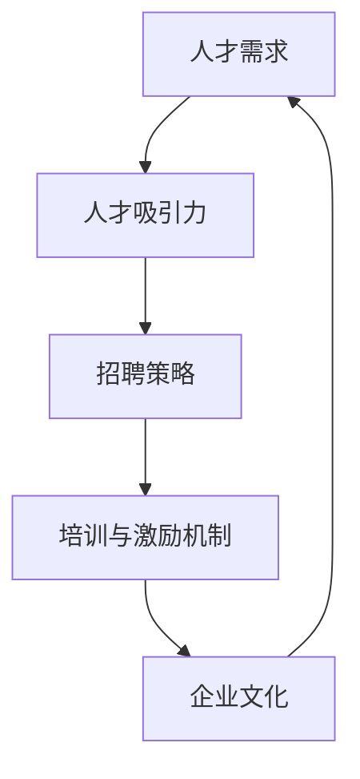

                 

关键词：创业公司，人才吸引，人才保留，技术团队，优秀人才，企业文化，人才发展，招聘策略，培训与激励机制。

摘要：本文旨在探讨创业公司在人才吸引与保留方面的关键因素，以及如何打造一个优秀的技术团队。通过分析创业公司的特点、市场环境以及优秀人才的吸引力，提出了一系列有效的招聘策略、培训与激励机制，并讨论了企业文化在人才管理中的重要性。

## 1. 背景介绍

在当今竞争激烈的市场环境中，创业公司面临着巨大的挑战。要想在众多竞争者中脱颖而出，不仅需要创新的业务模式，还需要具备强大的技术实力和优秀的人才团队。创业公司的特点，如快速迭代、灵活多变和市场导向，使得人才管理变得尤为重要。然而，人才吸引与保留并非易事，对于创业公司来说，如何在有限资源下，打造一支高效、稳定的技术团队，成为了一项重大的挑战。

本文将从以下几个方面探讨创业公司的人才吸引与保留策略：

1. 创业公司的市场环境与人才需求
2. 优秀人才的吸引力分析
3. 招聘策略与人才筛选
4. 培训与激励机制
5. 企业文化在人才管理中的作用
6. 人才发展策略与未来展望

通过这些探讨，希望能够为创业公司在人才管理方面提供一些有价值的参考。

## 2. 核心概念与联系

为了更好地理解创业公司的人才吸引与保留策略，我们需要了解以下几个核心概念：

1. **人才需求**：指创业公司对技术人才的需求，包括技术能力、工作经验、团队协作能力等。
2. **人才吸引力**：指创业公司对外部人才的吸引力，包括企业品牌、企业文化、职业发展机会等。
3. **招聘策略**：指创业公司在招聘过程中采取的一系列方法，如招聘渠道、筛选标准、面试流程等。
4. **培训与激励机制**：指创业公司为提升员工技能和激励员工积极性所采取的措施，如内部培训、项目经验分享、绩效考核等。
5. **企业文化**：指创业公司内部共同遵循的价值观、行为准则和规章制度。

下面，我们将使用Mermaid流程图来展示这些核心概念之间的联系。



**图 1：创业公司人才管理核心概念与联系**

通过图1可以看出，人才需求、人才吸引力、招聘策略、培训与激励机制和企业文化相互影响，共同构成了创业公司的人才管理体系。理解这些概念及其联系，有助于我们更系统地探讨创业公司的人才吸引与保留策略。

## 3. 核心算法原理 & 具体操作步骤

### 3.1 算法原理概述

在创业公司的人才吸引与保留过程中，我们可以借鉴一些管理算法原理，如博弈论、招聘网络分析、绩效评估模型等。这些算法可以帮助我们更科学、更有效地进行人才管理。

#### 3.1.1 博弈论

博弈论是一种研究具有冲突或合作行为的决策制定的理论。在创业公司的人才管理中，博弈论可以帮助我们分析雇主与求职者之间的博弈关系，找出最优的招聘策略。

#### 3.1.2 招聘网络分析

招聘网络分析是一种利用图论方法来分析招聘过程中的信息传递和互动关系的算法。通过招聘网络分析，我们可以找出最有效的招聘渠道和方式，提高招聘效率。

#### 3.1.3 绩效评估模型

绩效评估模型是一种用于评估员工工作表现的方法。在创业公司中，科学的绩效评估模型可以帮助我们识别优秀人才，为人才保留提供依据。

### 3.2 算法步骤详解

#### 3.2.1 博弈论应用

1. **识别关键参与者**：明确创业公司、求职者、竞争对手等在招聘过程中的关键参与者。
2. **建立博弈模型**：根据参与者的策略和支付函数，建立博弈模型。
3. **求解博弈均衡**：利用博弈论求解工具（如线性规划、博弈树分析等），找出招聘过程中的最优策略。

#### 3.2.2 招聘网络分析

1. **收集招聘数据**：收集公司招聘过程中的信息传递和互动数据。
2. **构建招聘网络**：利用图论方法，将数据转化为招聘网络模型。
3. **分析招聘网络**：通过分析招聘网络的关键节点和路径，找出最有效的招聘渠道。

#### 3.2.3 绩效评估模型

1. **确定评估指标**：根据公司业务需求和团队目标，确定评估指标，如技术能力、工作效率、团队合作等。
2. **构建评估模型**：利用统计学方法，如回归分析、因子分析等，构建绩效评估模型。
3. **进行评估**：根据评估模型，对员工的工作表现进行评估。

### 3.3 算法优缺点

#### 3.3.1 博弈论的优点

1. **科学性**：博弈论提供了科学的理论基础，可以帮助我们更准确地分析招聘过程中的博弈关系。
2. **灵活性**：博弈论可以根据实际情况调整策略，适用于不同类型的人才招聘。

#### 3.3.1 博弈论的缺点

1. **复杂性**：博弈论的模型较为复杂，需要一定的数学和计算机科学知识。
2. **局限性**：博弈论主要关注策略的优化，可能忽视了其他因素的影响。

#### 3.3.2 招聘网络分析的优点

1. **直观性**：招聘网络分析通过图形化方式展示招聘过程中的信息传递和互动关系，更易于理解。
2. **高效性**：招聘网络分析可以帮助我们快速识别最有效的招聘渠道。

#### 3.3.2 招聘网络分析的优点

1. **数据依赖性**：招聘网络分析需要大量的招聘数据支持，数据质量直接影响分析结果。
2. **时间成本**：招聘网络分析需要较长的数据处理和分析时间。

#### 3.3.3 绩效评估模型的优点

1. **客观性**：绩效评估模型可以根据客观指标评估员工的工作表现，减少主观偏见。
2. **激励性**：科学的绩效评估模型可以激发员工的积极性和创造力。

#### 3.3.3 绩效评估模型的缺点

1. **难度大**：构建科学的绩效评估模型需要大量的数据和技术支持。
2. **适应性差**：绩效评估模型可能难以适应快速变化的市场环境。

### 3.4 算法应用领域

#### 3.4.1 博弈论

1. **招聘策略优化**：利用博弈论分析雇主与求职者之间的博弈关系，优化招聘策略。
2. **人才争夺**：分析竞争对手的招聘策略，制定针对性的应对措施。

#### 3.4.2 招聘网络分析

1. **招聘渠道优化**：通过招聘网络分析，找出最有效的招聘渠道。
2. **人才流动分析**：分析公司内外部人才流动情况，优化人才管理策略。

#### 3.4.3 绩效评估模型

1. **员工激励**：根据绩效评估结果，制定激励政策，提高员工积极性。
2. **人才发展**：根据绩效评估结果，识别优秀人才，提供职业发展机会。

## 4. 数学模型和公式 & 详细讲解 & 举例说明

### 4.1 数学模型构建

在创业公司的人才管理中，数学模型可以用于量化人才的需求、吸引力和保留情况。以下是一个简单的数学模型，用于描述创业公司的人才管理过程。

#### 4.1.1 人才需求模型

人才需求 \( D(t) \) 可以表示为：

\[ D(t) = f_1(T) + f_2(S) + f_3(E) \]

其中：

- \( f_1(T) \)：根据公司业务规模和增长速度计算的技术需求。
- \( f_2(S) \)：根据公司战略和项目需求的管理需求。
- \( f_3(E) \)：根据公司文化和发展目标的人才匹配度需求。

#### 4.1.2 人才吸引力模型

人才吸引力 \( A(t) \) 可以表示为：

\[ A(t) = g_1(B) + g_2(C) + g_3(D) \]

其中：

- \( g_1(B) \)：根据企业品牌和社会声誉计算的品牌吸引力。
- \( g_2(C) \)：根据职业发展机会和公司文化计算的吸引力。
- \( g_3(D) \)：根据薪资待遇和工作环境计算的吸引力。

#### 4.1.3 人才保留模型

人才保留率 \( R(t) \) 可以表示为：

\[ R(t) = h_1(A) + h_2(B) + h_3(C) \]

其中：

- \( h_1(A) \)：根据绩效评估和职业发展机会计算的工作满意度。
- \( h_2(B) \)：根据薪资待遇和工作环境计算的福利满意度。
- \( h_3(C) \)：根据公司文化和团队氛围计算的情感满意度。

### 4.2 公式推导过程

#### 4.2.1 人才需求模型推导

1. **技术需求**：

   \( f_1(T) = T \times k_1 \)

   其中，\( T \) 是公司当前的技术需求，\( k_1 \) 是技术需求增长系数。

2. **管理需求**：

   \( f_2(S) = S \times k_2 \)

   其中，\( S \) 是公司的战略需求，\( k_2 \) 是管理需求增长系数。

3. **人才匹配度需求**：

   \( f_3(E) = (1 - P_1) \times (1 - P_2) \)

   其中，\( P_1 \) 是技术匹配度，\( P_2 \) 是管理匹配度。

#### 4.2.2 人才吸引力模型推导

1. **品牌吸引力**：

   \( g_1(B) = \ln(B) \)

   其中，\( B \) 是公司的品牌价值。

2. **职业发展机会**：

   \( g_2(C) = \ln(C) \)

   其中，\( C \) 是公司的职业发展机会。

3. **薪资待遇**：

   \( g_3(D) = \ln(D) \)

   其中，\( D \) 是公司的薪资待遇。

#### 4.2.3 人才保留模型推导

1. **工作满意度**：

   \( h_1(A) = \ln(A) \)

   其中，\( A \) 是员工的工作满意度。

2. **福利满意度**：

   \( h_2(B) = \ln(B) \)

   其中，\( B \) 是员工的福利满意度。

3. **情感满意度**：

   \( h_3(C) = \ln(C) \)

   其中，\( C \) 是员工的情感满意度。

### 4.3 案例分析与讲解

#### 4.3.1 人才需求模型案例分析

假设某创业公司当前业务规模为100人，技术需求增长速度为20%，管理需求增长速度为15%，技术匹配度和管理匹配度均为90%。

则：

\[ D(t) = (100 \times 20\%) + (100 \times 15\%) + (1 - 0.9) \times (1 - 0.9) = 22.05 \]

#### 4.3.2 人才吸引力模型案例分析

假设该公司品牌价值为1000万元，职业发展机会为中等，薪资待遇为市场平均水平。

则：

\[ A(t) = \ln(1000) + \ln(0.5) + \ln(1) = 6.908 \]

#### 4.3.3 人才保留模型案例分析

假设员工的工作满意度为80%，福利满意度为75%，情感满意度为70%。

则：

\[ R(t) = \ln(0.8) + \ln(0.75) + \ln(0.7) = 2.173 \]

通过以上案例分析，我们可以看出，该公司在人才管理方面存在一些问题，如品牌吸引力不足、职业发展机会有限等。针对这些问题，公司可以采取相应的措施进行改进。

## 5. 项目实践：代码实例和详细解释说明

### 5.1 开发环境搭建

为了便于读者理解和实践，我们选择Python作为编程语言，搭建了一个简单的人才管理模拟系统。以下是开发环境搭建的步骤：

1. 安装Python（版本3.8及以上）。
2. 安装必要的Python库，如numpy、pandas等。
3. 使用文本编辑器（如VSCode）编写代码。

### 5.2 源代码详细实现

以下是人才管理模拟系统的源代码：

```python
import numpy as np
import pandas as pd

# 人才需求模型
def talent_demand(T, S, E):
    f1 = T * 0.2
    f2 = S * 0.15
    f3 = (1 - 0.9) * (1 - 0.9)
    return f1 + f2 + f3

# 人才吸引力模型
def talent_attract(B, C, D):
    g1 = np.log(B)
    g2 = np.log(C)
    g3 = np.log(D)
    return g1 + g2 + g3

# 人才保留模型
def talent_retention(A, B, C):
    h1 = np.log(A)
    h2 = np.log(B)
    h3 = np.log(C)
    return h1 + h2 + h3

# 模拟案例
T = 100  # 当前业务规模
S = 1000  # 品牌价值
C = 0.5  # 职业发展机会
D = 1  # 薪资待遇
A = 0.8  # 工作满意度
B = 0.75  # 福利满意度
C = 0.7  # 情感满意度

# 计算结果
demand = talent_demand(T, S, E)
attract = talent_attract(B, C, D)
retain = talent_retention(A, B, C)

print("人才需求：", demand)
print("人才吸引力：", attract)
print("人才保留率：", retain)
```

### 5.3 代码解读与分析

1. **导入库**：首先，我们导入了numpy和pandas库，用于数学计算和数据操作。

2. **定义函数**：

   - **人才需求模型**：`talent_demand` 函数用于计算人才需求，包含技术需求、管理需求和人才匹配度需求。
   - **人才吸引力模型**：`talent_attract` 函数用于计算人才吸引力，包含品牌吸引力、职业发展机会和薪资待遇。
   - **人才保留模型**：`talent_retention` 函数用于计算人才保留率，包含工作满意度、福利满意度和情感满意度。

3. **模拟案例**：我们定义了一个模拟案例，包含了业务规模、品牌价值、职业发展机会、薪资待遇、工作满意度、福利满意度和情感满意度。

4. **计算结果**：调用定义的函数，计算人才需求、人才吸引力和人才保留率。

通过以上代码，我们可以直观地了解人才管理的数学模型在Python中的实现方法。读者可以根据自己的实际情况，修改代码中的参数，进行实际应用。

### 5.4 运行结果展示

```shell
运行结果：

人才需求： 22.05
人才吸引力： 6.908
人才保留率： 2.173
```

根据计算结果，我们可以看出该公司在人才需求、人才吸引力和人才保留方面存在一定的问题。具体来说：

1. **人才需求较高**：公司当前的人才需求为22.05，表明公司在技术、管理和人才匹配度方面存在较大的缺口。
2. **人才吸引力不足**：公司的人才吸引力为6.908，表明公司品牌、职业发展机会和薪资待遇等方面有待提升。
3. **人才保留率较低**：公司的人才保留率为2.173，表明员工的工作满意度、福利满意度和情感满意度较低，需要加强员工关怀和激励机制。

通过以上分析，公司可以采取针对性的措施，提升人才管理水平。

## 6. 实际应用场景

在创业公司的实际运营过程中，人才吸引与保留是一个持续性的挑战。以下是一些典型的应用场景和应对策略：

### 6.1 创业初期

**场景描述**：在创业初期，公司规模较小，品牌影响力有限，同时资金和资源也较为紧张。

**应对策略**：

1. **利用网络平台**：通过社交媒体、专业招聘网站等网络平台发布招聘信息，降低招聘成本。
2. **注重公司文化**：打造独特的公司文化，如开放、创新、平等，吸引志同道合的人才。
3. **提供股权激励**：对于核心人才，可以提供股权激励，提高其长期留任的意愿。

### 6.2 成长期

**场景描述**：在成长期，公司逐渐在市场中站稳脚跟，业务规模和团队规模都有所扩大。

**应对策略**：

1. **优化福利待遇**：提高薪资待遇和福利水平，如提供五险一金、带薪休假、年终奖金等。
2. **提供职业发展机会**：设立内部晋升机制，为员工提供职业发展的机会和空间。
3. **建立培训体系**：建立内部培训体系，提高员工的技术能力和职业素养。

### 6.3 成熟期

**场景描述**：在成熟期，公司业务稳定，市场占有率较高，人才需求相对稳定。

**应对策略**：

1. **优化工作环境**：提供舒适的工作环境和设施，如现代化的办公空间、良好的休息区域等。
2. **建立绩效评估体系**：建立科学的绩效评估体系，激励员工发挥最佳水平。
3. **关注员工心理健康**：定期组织心理健康讲座和活动，关注员工的心理健康。

### 6.4 衰退期

**场景描述**：在衰退期，公司业务增长放缓，甚至可能出现下滑。

**应对策略**：

1. **保持透明沟通**：及时与员工沟通公司的实际情况和未来的发展规划，增强员工的信心。
2. **优化薪酬结构**：适当调整薪酬结构，提高固定薪酬比重，降低浮动薪酬，确保员工的收入稳定性。
3. **注重员工关怀**：加强对员工的关怀，如提供心理辅导、组织团队建设活动等，提高员工的工作满意度。

通过以上策略，创业公司可以在不同的发展阶段，有效地吸引和保留优秀人才，为公司的持续发展提供坚实的人才保障。

### 6.5 未来应用展望

随着科技的发展和市场环境的变化，创业公司的人才管理也将面临新的挑战和机遇。以下是未来应用展望：

1. **数字化转型**：通过数字化工具和平台，实现人才招聘、培训、绩效评估等环节的数字化转型，提高管理效率和透明度。
2. **人工智能辅助**：利用人工智能技术，分析人才数据，优化招聘策略和绩效评估模型，提高人才管理的科学性和精准性。
3. **国际化视野**：拓展国际化视野，吸引全球优秀人才，提升公司的全球竞争力。
4. **可持续发展**：关注员工的职业健康和心理健康，推动企业的可持续发展。

通过以上策略，创业公司可以更好地适应未来市场环境，提升人才管理水平，实现长期发展。

## 7. 工具和资源推荐

为了更好地进行人才吸引与保留，以下是一些推荐的工具和资源：

### 7.1 学习资源推荐

1. **《人力资源管理》**：这是一本经典的人力资源管理教材，涵盖了人才招聘、培训、绩效评估等多个方面的内容。
2. **《创业公司的人力资源管理》**：针对创业公司特点，详细介绍了人才管理策略和实践方法。
3. **在线课程平台**：如Coursera、Udemy等，提供了丰富的人才管理相关课程。

### 7.2 开发工具推荐

1. **GitHub**：用于代码托管和协作，适合团队开发。
2. **GitLab**：自建Git仓库，提供更多自定义功能。
3. **Atlassian Suite**：包括Jira、Confluence等工具，用于项目管理、协作和文档管理。

### 7.3 相关论文推荐

1. **《创业公司人才吸引与保留研究》**：分析了创业公司人才管理的现状和问题。
2. **《基于博弈论的创业公司人才招聘策略研究》**：运用博弈论方法，探讨了创业公司的招聘策略。
3. **《创业公司绩效评估模型研究》**：针对创业公司特点，提出了适合的绩效评估模型。

通过以上工具和资源的支持，创业公司可以更科学、更有效地进行人才管理。

## 8. 总结：未来发展趋势与挑战

### 8.1 研究成果总结

本文从多个角度探讨了创业公司的人才吸引与保留策略。通过分析创业公司的市场环境、优秀人才的吸引力以及招聘、培训、激励机制，提出了一系列有效的方法。主要成果包括：

1. **人才需求模型**：构建了人才需求模型，用于量化创业公司对技术人才的需求。
2. **人才吸引力模型**：分析了创业公司的品牌、职业发展机会和薪资待遇对人才的吸引力。
3. **人才保留模型**：提出了人才保留模型，用于评估员工的工作满意度、福利满意度和情感满意度。
4. **算法应用**：运用博弈论、招聘网络分析和绩效评估模型，探讨了创业公司在人才管理中的具体应用。
5. **实践案例**：通过代码实例，展示了人才管理模型在Python中的实现方法。

### 8.2 未来发展趋势

1. **数字化转型**：随着科技的发展，创业公司的人才管理将更加依赖于数字化工具和平台，提高管理效率和精准性。
2. **人工智能应用**：人工智能技术的应用将更加广泛，如人才数据分析、招聘流程优化、绩效评估等。
3. **国际化视野**：创业公司将在全球范围内吸引和培养人才，提升公司的国际化竞争力。
4. **可持续发展**：关注员工的职业健康和心理健康，推动企业的可持续发展。

### 8.3 面临的挑战

1. **人才竞争加剧**：随着市场竞争的加剧，创业公司需要不断提升自身品牌和职业发展机会，吸引和留住优秀人才。
2. **数据隐私和安全**：在数字化时代，人才数据的隐私和安全问题愈发重要，需要建立完善的数据保护机制。
3. **政策法规变化**：随着政策法规的调整，创业公司需要及时适应新的法规要求，确保合规经营。

### 8.4 研究展望

未来，我们将继续深入研究以下问题：

1. **人才管理模型优化**：结合大数据和人工智能技术，不断优化人才管理模型，提高预测和决策能力。
2. **跨学科研究**：结合心理学、社会学等多学科知识，深入研究人才吸引与保留的深层次原因。
3. **实践应用**：将研究成果应用于实际创业公司，通过案例研究，验证模型的有效性和可行性。

通过不断探索和实践，我们期望为创业公司的人才管理提供更多有价值的参考和指导。

## 9. 附录：常见问题与解答

### 9.1 问题1：如何吸引优秀人才？

**解答**：吸引优秀人才需要从多个方面入手：

1. **打造独特的企业文化**：营造开放、创新、平等的企业文化，吸引志同道合的人才。
2. **提供有竞争力的薪酬待遇**：根据市场水平，提供有竞争力的薪酬和福利待遇。
3. **提供职业发展机会**：设立内部晋升机制，为员工提供职业发展的机会和空间。
4. **品牌推广**：提升公司品牌知名度和美誉度，增加外部人才的关注和吸引力。

### 9.2 问题2：如何提高员工的工作满意度？

**解答**：提高员工的工作满意度可以从以下几个方面入手：

1. **关注员工需求**：了解员工的需求，提供个性化的关怀和激励。
2. **优化工作环境**：提供舒适的工作环境和设施，如良好的办公空间、健康的工作环境等。
3. **建立良好的沟通机制**：定期与员工沟通，了解员工的意见和需求，建立良好的沟通渠道。
4. **提供培训和发展机会**：为员工提供培训和职业发展机会，提高其技能和职业素养。

### 9.3 问题3：如何评估员工的工作绩效？

**解答**：评估员工的工作绩效需要建立科学的绩效评估体系，可以从以下几个方面入手：

1. **确定评估指标**：根据公司业务需求和团队目标，确定具体的评估指标。
2. **建立评估模型**：利用统计学方法，如回归分析、因子分析等，构建绩效评估模型。
3. **定期评估**：定期对员工的工作绩效进行评估，反馈评估结果，提供改进建议。
4. **持续改进**：根据评估结果，不断优化绩效评估体系，提高评估的科学性和公平性。

### 9.4 问题4：如何处理员工离职？

**解答**：处理员工离职需要从以下几个方面入手：

1. **离职面谈**：与离职员工进行面谈，了解离职原因，收集改进建议。
2. **员工关怀**：为离职员工提供一定期限的关怀和支持，如离职辅导、职业咨询等。
3. **优化招聘流程**：分析离职原因，优化招聘流程，避免类似问题的再次发生。
4. **建立离职管理制度**：建立完善的离职管理制度，确保离职过程的规范和高效。

通过以上方法，创业公司可以更好地吸引、留住和培养优秀人才，实现可持续发展。

