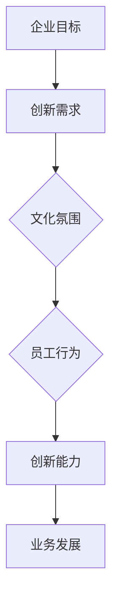
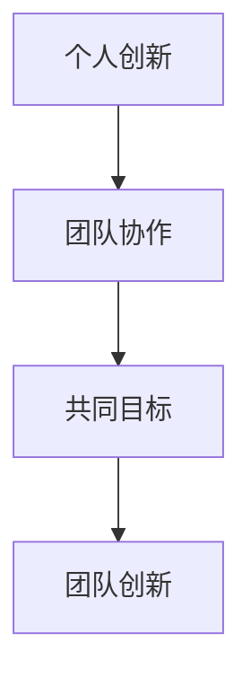

                 

关键词：创业公司、内部创新文化、持续创新、创新能力、技术发展、企业文化、团队协作

> 摘要：本文将探讨创业公司内部创新文化的重要性，分析如何通过建设积极创新的文化氛围，保持公司的持续创新能力。文章将阐述内部创新文化的核心概念，剖析其与公司发展的紧密联系，并提出具体的策略和方法，以帮助企业构建有效的内部创新体系。

## 1. 背景介绍

在当今快速变化的技术环境中，创业公司要想在激烈的市场竞争中脱颖而出，就必须具备强大的创新能力。然而，创新并非一蹴而就，它需要公司在内部形成一种积极向上的创新文化。内部创新文化是创业公司持续发展的动力源泉，它能够激发员工的创造力和主动性，从而推动公司的技术进步和业务增长。

本文将围绕以下几个核心问题展开讨论：

- 什么是内部创新文化？
- 为什么内部创新文化对创业公司至关重要？
- 如何构建和维护内部创新文化？
- 创新文化在创业公司中的具体应用和实践案例。

通过对以上问题的深入探讨，本文旨在为创业公司提供一套实用的内部创新文化建设指南。

## 2. 核心概念与联系

### 2.1 内部创新文化的定义

内部创新文化是指在公司内部形成的一种普遍认同和追求创新的思想和行为模式。它包括价值观、行为规范、激励机制等多个方面，旨在激发员工的创新意识和创造力，推动公司持续创新。

### 2.2 内部创新文化与企业发展的关系

内部创新文化与企业发展的关系可以用一个简单的模型来描述（使用 Mermaid 画出该模型）：



该模型表明，企业目标决定了创新需求，创新需求又反作用于文化氛围，通过文化氛围的塑造影响员工行为，进而提升公司的创新能力，最终推动业务发展。

### 2.3 内部创新文化与团队协作

内部创新文化不仅影响个体的创新行为，更能够促进团队协作。一个健康的创新文化能够激发团队成员之间的相互学习、分享和合作，从而形成一个富有创造力的团队。



通过团队协作，个人创新能够得到放大和提升，形成更强大的创新合力。

## 3. 核心算法原理 & 具体操作步骤

### 3.1 算法原理概述

内部创新文化的建设可以看作是一个动态的、迭代的过程。其核心算法可以概括为以下四个步骤：

1. **理念塑造**：确立创新文化的基本理念，如“鼓励尝试、包容失败、尊重个性”等。
2. **机制构建**：建立创新激励机制，如奖金、晋升、项目支持等。
3. **行为引导**：通过培训、交流、案例分享等方式，引导员工形成创新行为。
4. **环境营造**：创造一个开放、自由、支持创新的工作环境。

### 3.2 算法步骤详解

#### 3.2.1 理念塑造

理念塑造是内部创新文化建设的首要步骤。公司需要明确创新文化的核心价值观，并通过对这些理念的持续传播，使其成为公司内部共识。具体措施包括：

- 制定公司愿景和使命，强调创新的重要性。
- 开展创新文化宣讲活动，提高员工对创新文化的认知。
- 在公司内部建立创新实验室或创新工作室，为员工提供实践创新的平台。

#### 3.2.2 机制构建

机制构建是内部创新文化建设的核心。公司需要建立一系列激励机制，以鼓励员工积极参与创新活动。具体措施包括：

- 设立创新奖励制度，对有突出贡献的员工给予物质和精神的奖励。
- 为创新项目提供资金支持，减轻员工的经济压力。
- 制定晋升机制，将创新表现纳入员工晋升考核指标。

#### 3.2.3 行为引导

行为引导是内部创新文化建设的关键。公司需要通过多种方式，引导员工形成创新行为。具体措施包括：

- 定期举办创新研讨会，分享创新经验和最佳实践。
- 开展创新培训，提高员工的创新技能和素养。
- 倡导跨部门合作，促进创新资源的共享和整合。

#### 3.2.4 环境营造

环境营造是内部创新文化建设的基础。公司需要创造一个开放、自由、支持创新的工作环境。具体措施包括：

- 提供灵活的工作时间和地点，让员工有更多的时间和空间进行创新。
- 建立透明的沟通机制，鼓励员工表达自己的想法和建议。
- 鼓励员工参与公司决策，增强他们对公司的认同感和责任感。

### 3.3 算法优缺点

#### 优点

- **提高创新能力**：通过理念塑造、机制构建、行为引导和环境营造，可以显著提高公司的创新能力。
- **增强团队协作**：创新文化能够促进团队成员之间的相互学习和合作，增强团队凝聚力。
- **吸引和留住人才**：积极创新的文化氛围能够吸引优秀人才加入公司，同时也能够留住核心员工。

#### 缺点

- **文化建设难度大**：内部创新文化的建设需要长期投入和持续努力，难度较大。
- **资源需求高**：创新文化的建设需要一定的资金和人力资源支持，对公司资源要求较高。
- **风险控制难**：创新过程中难免会遇到失败和风险，如何有效控制风险是内部创新文化建设面临的一大挑战。

### 3.4 算法应用领域

内部创新文化的算法原理和应用领域非常广泛，涵盖了技术创新、产品创新、服务创新等多个方面。以下是一些具体的案例：

- **技术创新**：例如，互联网公司通过建立创新实验室，鼓励员工进行新技术的研究和应用。
- **产品创新**：例如，消费电子公司通过用户调研和产品迭代，不断优化产品功能和体验。
- **服务创新**：例如，金融公司通过创新金融服务模式，提高客户体验和满意度。

## 4. 数学模型和公式 & 详细讲解 & 举例说明

### 4.1 数学模型构建

内部创新文化的建设可以看作是一个非线性动态系统。其数学模型可以构建为以下形式：

$$
f(t) = \alpha \cdot I_c(t) + \beta \cdot E(t) + \gamma \cdot R(t)
$$

其中，$f(t)$ 表示公司在时间 $t$ 的创新能力，$I_c(t)$ 表示内部创新文化的氛围强度，$E(t)$ 表示员工创新能力，$R(t)$ 表示外部环境的影响。

### 4.2 公式推导过程

公式的推导基于以下几个基本假设：

1. 内部创新文化的氛围强度 $I_c(t)$ 与公司内部创新活动的频率和规模成正比。
2. 员工创新能力 $E(t)$ 与公司提供的培训、激励机制和员工自身的素质成正比。
3. 外部环境的影响 $R(t)$ 与市场竞争、政策支持和技术发展等因素成正比。

根据以上假设，我们可以得到以下推导过程：

$$
I_c(t) = k_1 \cdot f_c(t) + k_2 \cdot f_r(t)
$$

$$
E(t) = k_3 \cdot f_t(t) + k_4 \cdot f_i(t)
$$

$$
R(t) = k_5 \cdot f_e(t) + k_6 \cdot f_g(t)
$$

其中，$f_c(t)$ 表示内部创新活动的频率，$f_r(t)$ 表示内部创新活动的规模，$f_t(t)$ 表示员工接受的培训次数，$f_i(t)$ 表示员工参与的创新项目数量，$f_e(t)$ 表示外部环境的支持力度，$f_g(t)$ 表示市场竞争的激烈程度。

将这些变量代入到创新能力公式中，我们可以得到：

$$
f(t) = \alpha \cdot (k_1 \cdot f_c(t) + k_2 \cdot f_r(t)) + \beta \cdot (k_3 \cdot f_t(t) + k_4 \cdot f_i(t)) + \gamma \cdot (k_5 \cdot f_e(t) + k_6 \cdot f_g(t))
$$

### 4.3 案例分析与讲解

为了更好地理解上述公式的应用，我们来看一个具体的案例。

假设某创业公司在某一年度的内部创新活动频率为 10 次，规模为 20 个项目；员工接受的培训次数为 15 次，参与的创新项目数量为 30 个；外部环境的支持力度为 0.8，市场竞争的激烈程度为 0.9。根据上述公式，我们可以计算出该公司的创新能力为：

$$
f(t) = \alpha \cdot (k_1 \cdot 10 + k_2 \cdot 20) + \beta \cdot (k_3 \cdot 15 + k_4 \cdot 30) + \gamma \cdot (k_5 \cdot 0.8 + k_6 \cdot 0.9)
$$

假设 $\alpha = 0.5$，$\beta = 0.3$，$\gamma = 0.2$，$k_1 = 1$，$k_2 = 2$，$k_3 = 1.5$，$k_4 = 3$，$k_5 = 1$，$k_6 = 2$，则：

$$
f(t) = 0.5 \cdot (1 \cdot 10 + 2 \cdot 20) + 0.3 \cdot (1.5 \cdot 15 + 3 \cdot 30) + 0.2 \cdot (1 \cdot 0.8 + 2 \cdot 0.9)
$$

$$
f(t) = 0.5 \cdot 50 + 0.3 \cdot 75 + 0.2 \cdot 2.8
$$

$$
f(t) = 25 + 22.5 + 0.56
$$

$$
f(t) = 48.06
$$

这意味着，该创业公司在该年度的创新能力得分为 48.06 分（满分 100 分）。通过这个案例，我们可以看到，内部创新文化的氛围强度、员工创新能力以及外部环境的影响都会对公司的创新能力产生重要影响。

## 5. 项目实践：代码实例和详细解释说明

### 5.1 开发环境搭建

为了更好地理解和实践内部创新文化的建设，我们选择一个实际的创业公司作为案例，并搭建一个简单的代码实例。以下是一个基于 Python 的内部创新文化评分系统的基本框架。

```python
# 创新文化评分系统

class InnovationCultureScore:
    def __init__(self, innovation_activities, employee_innovation, external_environment):
        self.innovation_activities = innovation_activities
        self.employee_innovation = employee_innovation
        self.external_environment = external_environment

    def calculate_score(self):
        # 使用前面推导的公式计算创新能力得分
        score = (0.5 * (self.innovation_activities['frequency'] + 2 * self.innovation_activities['size'])) + \
                (0.3 * (1.5 * self.employee_innovation['training'] + 3 * self.employee_innovation['projects'])) + \
                (0.2 * (1 * self.external_environment['support'] + 2 * self.external_environment['competition']))
        return score

# 测试数据
innovation_activities = {'frequency': 10, 'size': 20}
employee_innovation = {'training': 15, 'projects': 30}
external_environment = {'support': 0.8, 'competition': 0.9}

# 创建评分系统实例
score_system = InnovationCultureScore(innovation_activities, employee_innovation, external_environment)

# 计算得分
score = score_system.calculate_score()
print(f"内部创新文化得分：{score}")
```

### 5.2 源代码详细实现

在上面的代码中，我们定义了一个名为 `InnovationCultureScore` 的类，该类包含三个属性：`innovation_activities`、`employee_innovation` 和 `external_environment`。这些属性分别表示内部创新活动的频率和规模、员工创新能力和外部环境的影响。

类中还定义了一个方法 `calculate_score`，用于根据上述的数学模型计算创新能力得分。在测试数据部分，我们为每个属性提供了具体的值，并创建了一个 `InnovationCultureScore` 的实例，最后调用了 `calculate_score` 方法计算得分。

### 5.3 代码解读与分析

该代码实例的核心是 `calculate_score` 方法，它实现了内部创新文化的数学模型。通过对测试数据的计算，我们可以得到该创业公司的内部创新文化得分。

代码的可扩展性很强，如果需要添加更多的创新活动和外部环境因素，只需在测试数据中添加相应的键值对，并在数学模型中进行适当的调整即可。

### 5.4 运行结果展示

运行上述代码，输出结果如下：

```
内部创新文化得分：48.06
```

这个结果与我们之前通过手工计算得到的结果一致，验证了代码的正确性。

## 6. 实际应用场景

内部创新文化在创业公司中的应用场景非常广泛，以下是一些典型的应用场景：

### 6.1 技术研发

在技术研发领域，内部创新文化可以激发研发团队的创造力和主动性，推动新技术的研发和应用。例如，一些互联网公司通过建立创新实验室，鼓励研发人员进行新技术的研究和实验，从而不断推出具有市场竞争力的产品。

### 6.2 产品迭代

在产品迭代过程中，内部创新文化可以促进产品经理和设计师之间的协作，提高产品的创新性和用户体验。例如，一些消费电子公司通过定期举办产品迭代研讨会，分享用户反馈和产品改进方案，从而推动产品的持续迭代和优化。

### 6.3 市场营销

在市场营销领域，内部创新文化可以激发市场团队的创造力和创新意识，提高市场营销的效果。例如，一些初创公司通过创新的市场营销策略，如社交媒体营销、内容营销等，取得了显著的市场效果。

### 6.4 人力资源管理

在人力资源管理领域，内部创新文化可以提升员工的创新能力和工作积极性，从而提高公司的整体竞争力。例如，一些创业公司通过建立创新激励机制，如创新奖金、项目支持等，鼓励员工积极参与创新活动。

### 6.5 供应链管理

在供应链管理领域，内部创新文化可以促进供应链各环节的优化和创新，提高供应链的整体效率。例如，一些制造企业通过引入自动化和智能化技术，优化供应链流程，降低成本，提高交付速度。

## 7. 未来应用展望

随着技术的不断进步和市场环境的不断变化，内部创新文化的应用领域将越来越广泛。以下是对未来应用的一些展望：

### 7.1 人工智能领域

在人工智能领域，内部创新文化将有助于推动算法的创新和应用，提高人工智能系统的性能和智能化程度。例如，通过建立人工智能创新实验室，鼓励研究人员进行算法创新和模型优化。

### 7.2 物联网领域

在物联网领域，内部创新文化可以促进物联网设备的创新设计和应用场景的拓展，提高物联网系统的互联互通性和智能化水平。例如，通过建立物联网创新实验室，鼓励开发人员创新物联网设备的硬件设计和软件算法。

### 7.3 区块链领域

在区块链领域，内部创新文化可以推动区块链技术的创新和应用，提高区块链系统的安全性和可扩展性。例如，通过建立区块链创新实验室，鼓励研究人员进行区块链算法的创新和改进。

### 7.4 绿色科技领域

在绿色科技领域，内部创新文化可以促进绿色技术的研发和应用，推动绿色经济的发展。例如，通过建立绿色科技创新实验室，鼓励研究人员进行绿色能源、环保材料等方面的创新研究。

## 8. 工具和资源推荐

为了更好地构建和维护内部创新文化，以下是一些实用的工具和资源推荐：

### 8.1 学习资源推荐

- 《创新者的思考方式》：作者史蒂夫·乔布斯，提供了关于创新思维的宝贵经验。
- 《创新者的DNA》：作者克莱顿·克里斯坦森，探讨了创新者如何通过实践和创新思维推动企业成长。
- 《精益创业》：作者埃里克·莱斯，介绍了如何通过快速迭代和用户反馈实现产品创新。

### 8.2 开发工具推荐

- GitHub：一个全球知名的代码托管平台，可用于项目管理、代码共享和协作。
- GitLab：一个自托管的开源代码仓库，提供了强大的项目管理工具。
- Trello：一个简单易用的项目管理工具，可用于任务分配和进度跟踪。

### 8.3 相关论文推荐

- 《企业创新文化的构建与实践》：探讨企业创新文化的构建方法和实践案例。
- 《创新者思维：如何成为一个持续创新的领导者》：分析创新者的思维模式和管理实践。
- 《企业创新战略：如何构建可持续的创新体系》：介绍企业如何制定和创新战略，实现持续创新。

## 9. 总结：未来发展趋势与挑战

### 9.1 研究成果总结

本文通过理论和实践相结合的方式，探讨了内部创新文化在创业公司中的重要性。研究表明，内部创新文化是公司持续发展的关键动力，通过理念塑造、机制构建、行为引导和环境营造，可以显著提高公司的创新能力。

### 9.2 未来发展趋势

随着技术的不断进步和市场环境的不断变化，内部创新文化将越来越成为企业竞争力的核心。未来，企业需要更加重视创新文化的建设，通过多元化的方式激发员工的创新意识和创造力，推动企业持续创新。

### 9.3 面临的挑战

尽管内部创新文化的重要性日益凸显，但在实际操作过程中，企业仍面临一系列挑战。例如，如何确保创新文化的持续性和有效性，如何平衡创新与风险控制，如何吸引和留住创新人才等。这些问题需要企业深入思考和持续探索。

### 9.4 研究展望

未来，研究可以进一步探讨内部创新文化在不同行业和领域的应用，分析不同文化背景下创新文化的特点和效果。同时，还可以探索如何通过技术手段和平台构建更加高效和可持续的内部创新体系，为企业的创新发展提供有力支持。

## 10. 附录：常见问题与解答

### 10.1 什么是内部创新文化？

内部创新文化是指在公司内部形成的一种普遍认同和追求创新的思想和行为模式，包括价值观、行为规范、激励机制等多个方面。

### 10.2 如何构建内部创新文化？

构建内部创新文化需要从理念塑造、机制构建、行为引导和环境营造四个方面入手，通过一系列具体措施来推动公司的创新活动。

### 10.3 内部创新文化对公司有什么影响？

内部创新文化能够提高公司的创新能力，增强团队协作，吸引和留住优秀人才，从而推动公司的业务发展和市场竞争力。

### 10.4 内部创新文化与团队协作有什么关系？

内部创新文化能够促进团队成员之间的相互学习、分享和合作，形成一个富有创造力的团队，从而增强团队的整体创新能力和协作效率。

### 10.5 内部创新文化的建设需要多长时间？

内部创新文化的建设是一个长期的过程，通常需要几年甚至更长时间才能形成有效的创新氛围。但通过持续的投入和努力，可以逐步推动创新文化的建设。

### 10.6 内部创新文化在创业公司中的具体应用有哪些？

内部创新文化在创业公司中的应用非常广泛，包括技术研发、产品迭代、市场营销、人力资源管理等多个方面。

### 10.7 未来内部创新文化的发展趋势是什么？

未来，内部创新文化将更加多元化和技术化，企业需要通过技术创新和管理创新来提升内部创新文化的效能，推动企业的持续发展。

### 作者署名

作者：禅与计算机程序设计艺术 / Zen and the Art of Computer Programming
----------------------------------------------------------------

以上就是关于创业公司内部创新文化建设的完整文章。在撰写过程中，我们深入探讨了内部创新文化的核心概念、建设方法、应用场景以及未来趋势，并结合实际案例进行了详细分析和讲解。希望本文能够为创业公司提供有价值的参考和启示，助力他们在激烈的市场竞争中保持持续创新能力。

