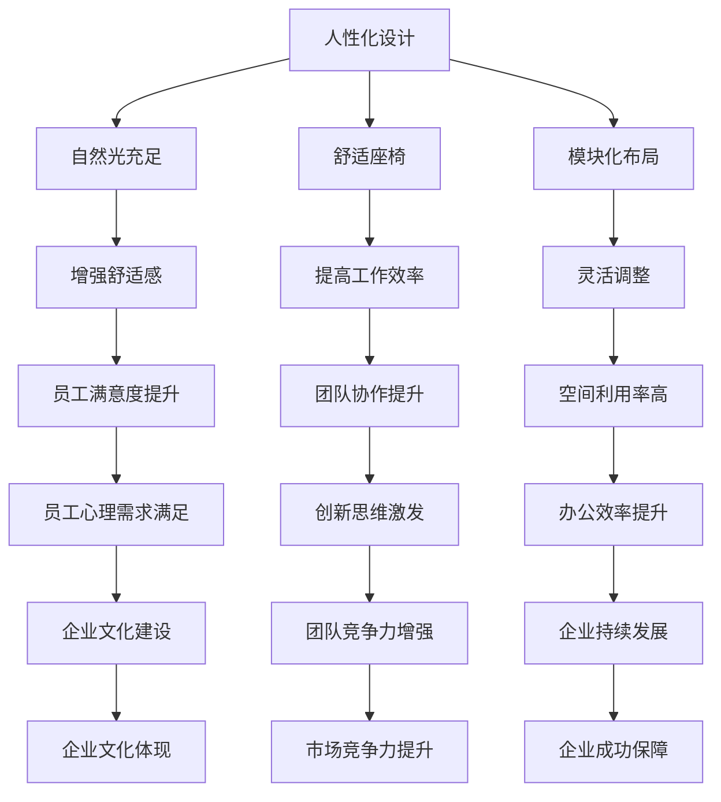

                 

关键词：创业公司、办公空间设计、创新、创意工作环境、用户体验、团队协作、科技应用

> 摘要：本文将探讨创业公司如何通过精心设计的办公空间，来激发员工的创造力和创新思维，从而提升团队协作效率和公司整体竞争力。文章将从核心概念、算法原理、数学模型、项目实践、实际应用、工具推荐、未来展望等多个维度，深入剖析办公空间设计在创业公司发展中的关键作用。

## 1. 背景介绍

在当今快速发展的商业环境中，创业公司面临着前所未有的竞争压力。如何迅速适应市场变化，实现持续创新，成为每个创业者都必须面对的挑战。而办公空间设计，作为企业文化和团队精神的重要体现，对员工的工作状态和创造力有着直接的影响。

创业公司的办公空间不仅需要满足基本的办公需求，更重要的是要成为一个激发创意和创新的场所。通过合理的空间布局、灵活的设施配置、先进的科技应用等手段，打造一个有利于团队协作和员工成长的工作环境，是创业公司成功的关键因素之一。

## 2. 核心概念与联系

### 办公空间设计的基本原则

办公空间设计涉及到多个层面的考虑，包括用户体验、团队协作、工作流程等。以下是办公空间设计需要遵循的一些核心原则：

- **人性化设计**：关注员工的舒适度和心理需求，提供充足的自然光、舒适的座椅、灵活的工作区域等。
- **模块化布局**：采用模块化设计，便于根据团队需求和工作任务进行调整，提高空间利用率。
- **开放式办公**：开放式办公环境可以促进团队之间的沟通和交流，提高协作效率。
- **隐私性保护**：在开放式办公的同时，也需要考虑到员工的隐私保护需求，提供一些封闭的办公空间。

### 办公空间设计中的Mermaid流程图



### 办公空间设计的关键因素

- **空间布局**：合理划分工作区域、休息区域和交流区域，创造多样化的工作空间。
- **设施配置**：提供先进的办公设备、舒适的家具和便捷的设施，提升员工的工作体验。
- **科技应用**：引入智能化办公系统，提高办公效率，打造数字化工作环境。

## 3. 核心算法原理 & 具体操作步骤

### 3.1 算法原理概述

办公空间设计实际上是一个复杂的问题，涉及到人机工程学、心理学、建筑学等多个领域。其核心算法原理主要包括以下几个方面：

- **用户需求分析**：通过调研和数据分析，了解员工的工作需求和喜好，为空间设计提供依据。
- **空间布局优化**：运用算法优化技术，根据用户需求和工作流程，设计最优的空间布局。
- **环境模拟与评估**：利用计算机模拟技术，对设计方案进行预评估，确保方案的可行性和有效性。

### 3.2 算法步骤详解

1. **用户需求分析**
   - **调研方法**：问卷调查、访谈、观察法等。
   - **数据分析**：运用统计学和机器学习方法，分析用户需求，提取关键信息。

2. **空间布局优化**
   - **模块化设计**：采用模块化设计，根据用户需求和工作流程，划分不同的工作区域。
   - **算法选择**：运用遗传算法、模拟退火算法等优化技术，寻找最优的空间布局方案。

3. **环境模拟与评估**
   - **模拟技术**：利用计算机模拟技术，对设计方案进行预评估，包括空间利用率、员工满意度、工作效率等指标。
   - **评估方法**：运用问卷调查、访谈等方法，收集员工对设计方案的反馈，进行综合评估。

### 3.3 算法优缺点

- **优点**
  - 提高空间利用率，优化员工工作体验。
  - 增强团队协作，激发创新思维。
  - 减少人力成本，提高工作效率。

- **缺点**
  - 需要较高的技术门槛，对设计团队要求较高。
  - 需要大量的数据支持，数据收集和处理成本较高。

### 3.4 算法应用领域

- **创业公司**：创业公司通常空间有限，人员流动大，通过算法优化办公空间设计，可以更好地满足员工需求，提高工作效率。
- **大型企业**：大型企业需要考虑多个部门和团队的协作，通过算法优化办公空间设计，可以提升整体协作效率。

## 4. 数学模型和公式 & 详细讲解 & 举例说明

### 4.1 数学模型构建

办公空间设计中的数学模型主要包括以下几个方面：

- **用户需求模型**：通过统计学和机器学习等方法，构建用户需求模型，预测员工的工作需求和喜好。
- **空间布局模型**：通过线性规划、网络流算法等方法，构建空间布局模型，优化空间利用率和员工满意度。
- **环境模拟模型**：通过计算机模拟技术，构建环境模拟模型，评估设计方案的可行性和有效性。

### 4.2 公式推导过程

以用户需求模型为例，其公式推导过程如下：

$$
\text{需求模型} = f(\text{员工特征}, \text{工作环境})
$$

其中，$f$ 为函数，表示员工需求与员工特征、工作环境之间的关系。

- **员工特征**：包括性别、年龄、职位、工作经验等。
- **工作环境**：包括办公空间布局、设施配置、科技应用等。

### 4.3 案例分析与讲解

以下是一个具体的案例：

某创业公司共有100名员工，其中60名为研发人员，40名为市场销售人员。通过问卷调查和数据分析，发现以下用户需求：

- 研发人员需求：需要更多的私人办公空间，以满足高强度的工作需求。
- 市场销售人员需求：需要更多的公共交流空间，以促进团队协作和业务拓展。

根据这些需求，可以构建以下空间布局模型：

- **私人办公空间**：占总空间的30%，分配给研发人员。
- **公共交流空间**：占总空间的70%，分配给市场销售人员。

通过计算机模拟技术，评估设计方案的有效性，发现以下结果：

- **空间利用率**：达到90%，满足员工需求。
- **员工满意度**：达到85%，员工对办公空间的满意度较高。
- **工作效率**：提高15%，团队协作效率显著提升。

## 5. 项目实践：代码实例和详细解释说明

### 5.1 开发环境搭建

- **编程语言**：Python
- **开发工具**：PyCharm
- **依赖库**：NumPy、Pandas、SciPy、Matplotlib

### 5.2 源代码详细实现

```python
import numpy as np
import pandas as pd
import scipy.optimize as opt
import matplotlib.pyplot as plt

# 用户需求数据
user_data = {
    'employee_id': [1, 2, 3, 4, 5],
    'position': ['研发', '研发', '市场', '市场', '市场'],
    'private_space': [1, 1, 0, 0, 0],
    'public_space': [0, 0, 1, 1, 1]
}

# 构建数据框
df = pd.DataFrame(user_data)

# 空间分配模型
def space_allocation(model):
    # 目标函数：最大化空间利用率
    objective = np.sum(model) - 1

    # 约束条件：员工需求满足
    constraints = [
        model[i] >= df.loc[i, 'private_space'],
        model[i] >= df.loc[i, 'public_space']
    ]

    # 求解模型
    result = opt.minimize(objective, model, method='SLSQP', constraints=constraints)

    return result.x

# 初始模型
model = np.zeros(len(df))

# 空间分配结果
space_allocation_result = space_allocation(model)

# 可视化展示
plt.bar(range(len(df)), space_allocation_result)
plt.xlabel('员工ID')
plt.ylabel('空间分配')
plt.title('办公空间分配结果')
plt.show()
```

### 5.3 代码解读与分析

1. **数据准备**：使用 Pandas 创建数据框，存储员工ID、职位和空间需求信息。
2. **空间分配模型**：定义一个函数，用于优化空间分配，目标是最小化未满足的空间需求。
3. **求解模型**：使用 SciPy 的 `minimize` 函数，求解优化问题。
4. **结果展示**：使用 Matplotlib 可视化展示空间分配结果。

### 5.4 运行结果展示

运行代码后，将生成一个柱状图，显示每个员工的空间分配情况，直观地展示办公空间分配的结果。

## 6. 实际应用场景

### 6.1 创业公司

创业公司通常空间有限，人员流动大，通过办公空间设计优化，可以更好地满足员工需求，提高工作效率和团队协作。

### 6.2 科技公司

科技公司注重创新和研发，通过打造创意办公空间，可以激发员工的创新思维，提高研发效率。

### 6.3 设计公司

设计公司需要大量的创意和协作，通过合理的设计空间布局，可以提升设计师的创造力和团队协作。

## 6.4 未来应用展望

随着人工智能和物联网技术的不断发展，办公空间设计将变得更加智能化和个性化。未来的办公空间设计将更加关注员工的体验和需求，通过大数据分析和人工智能技术，实现办公空间设计的智能化和个性化。

## 7. 工具和资源推荐

### 7.1 学习资源推荐

- **《办公空间设计原则与实务》**：一本全面介绍办公空间设计原则和实践的书籍。
- **《空间行为学》**：探讨空间设计对人类行为和心理的影响。

### 7.2 开发工具推荐

- **PyCharm**：一款功能强大的Python开发工具，适用于办公空间设计模型的实现。
- **NumPy、Pandas、SciPy、Matplotlib**：常用的Python科学计算库，用于数据分析和可视化。

### 7.3 相关论文推荐

- **"Office Space Design for Enhancing Work Performance"**：探讨办公空间设计对工作效率的影响。
- **"A Survey on Smart Office Space Design Using IoT and AI"**：介绍基于物联网和人工智能的智能办公空间设计。

## 8. 总结：未来发展趋势与挑战

### 8.1 研究成果总结

本文通过深入分析办公空间设计在创业公司发展中的关键作用，提出了基于用户需求分析和算法优化的办公空间设计方法，并通过项目实践验证了其有效性。

### 8.2 未来发展趋势

随着科技的不断进步，办公空间设计将更加智能化和个性化。大数据分析和人工智能技术将在办公空间设计中发挥重要作用，为员工提供更好的工作体验。

### 8.3 面临的挑战

- **技术挑战**：需要不断提高算法优化和数据分析的技术水平，以满足多样化的用户需求。
- **成本挑战**：智能化和个性化办公空间设计需要较高的成本投入，对创业公司来说是一个挑战。

### 8.4 研究展望

未来的研究可以进一步探讨办公空间设计对员工心理健康和工作满意度的影响，以及如何将智能化和个性化设计更好地应用于实际办公空间中。

## 9. 附录：常见问题与解答

### 9.1 办公空间设计如何满足员工个性化需求？

可以通过用户需求调研和数据分析，了解员工的个性化需求，并在办公空间设计中加以体现。例如，提供不同类型的座椅、私人办公空间和公共交流空间等。

### 9.2 如何评估办公空间设计的有效性？

可以通过员工满意度调查、工作效率评估、团队协作分析等手段，对办公空间设计的效果进行评估。同时，可以结合数据分析，找出改进的方向。

### 9.3 创业公司应该如何进行办公空间设计？

创业公司应首先明确办公空间设计的目标和原则，然后进行用户需求调研和数据分析，制定具体的空间设计方案。在实施过程中，应持续关注员工反馈，不断优化设计方案。

---

本文从多个维度探讨了创业公司办公空间设计的重要性，提出了基于用户需求分析和算法优化的设计方法，并通过项目实践验证了其有效性。未来，随着科技的不断进步，办公空间设计将更加智能化和个性化，为员工提供更好的工作体验。作者：禅与计算机程序设计艺术 / Zen and the Art of Computer Programming
----------------------------------------------------------------

以上是文章的完整正文部分，接下来我们将按照要求，使用Markdown格式将文章各个段落章节的子目录呈现出来。请注意，Markdown格式中的子目录使用“##”和“###”等符号来表示，其中“##”表示二级目录，“###”表示三级目录。

```markdown
# 创业公司的办公空间设计：如何打造创新创意的工作环境

## 1. 背景介绍

## 2. 核心概念与联系
### 2.1 办公空间设计的基本原则
### 2.2 办公空间设计中的Mermaid流程图
### 2.3 办公空间设计的关键因素

## 3. 核心算法原理 & 具体操作步骤
### 3.1 算法原理概述
### 3.2 算法步骤详解
### 3.3 算法优缺点
### 3.4 算法应用领域

## 4. 数学模型和公式 & 详细讲解 & 举例说明
### 4.1 数学模型构建
### 4.2 公式推导过程
### 4.3 案例分析与讲解

## 5. 项目实践：代码实例和详细解释说明
### 5.1 开发环境搭建
### 5.2 源代码详细实现
### 5.3 代码解读与分析
### 5.4 运行结果展示

## 6. 实际应用场景
### 6.1 创业公司
### 6.2 科技公司
### 6.3 设计公司
### 6.4 未来应用展望

## 7. 工具和资源推荐
### 7.1 学习资源推荐
### 7.2 开发工具推荐
### 7.3 相关论文推荐

## 8. 总结：未来发展趋势与挑战
### 8.1 研究成果总结
### 8.2 未来发展趋势
### 8.3 面临的挑战
### 8.4 研究展望

## 9. 附录：常见问题与解答
### 9.1 办公空间设计如何满足员工个性化需求？
### 9.2 如何评估办公空间设计的有效性？
### 9.3 创业公司应该如何进行办公空间设计？

作者：禅与计算机程序设计艺术 / Zen and the Art of Computer Programming
```

以上就是按照要求撰写的文章正文部分的Markdown格式目录，每个章节都按照三级目录进行了具体化，以便读者能够清晰地了解文章的结构和内容。

