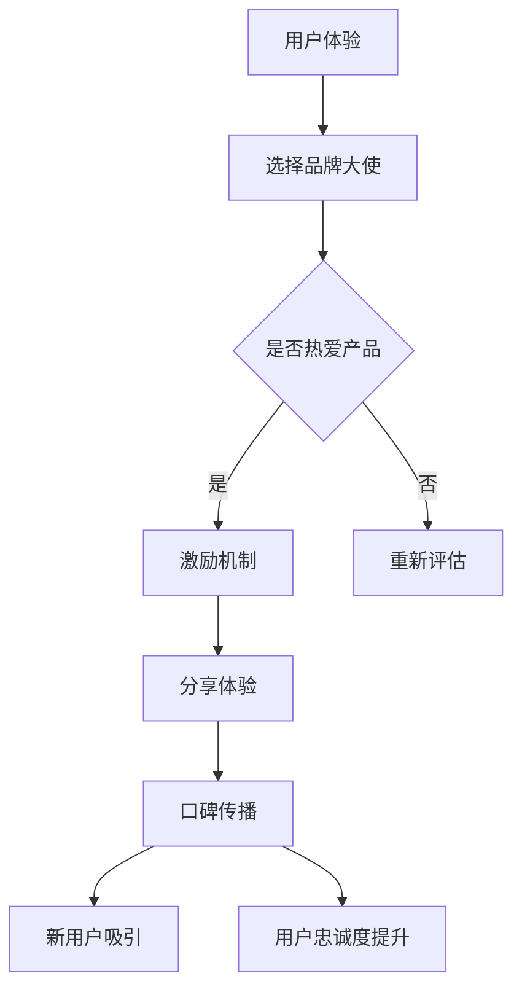

                 

 在当今竞争激烈的市场环境中，品牌不仅需要在产品质量和功能上脱颖而出，更需要通过独特的营销策略来建立强大的品牌影响力。对于初创公司而言，资源有限，如何高效地打造品牌形象、吸引并留住用户，成为了一项重要的挑战。本文将探讨一种创新的品牌营销策略——品牌大使计划，并详细阐述如何让用户成为品牌的代言人。

## 文章关键词

- 创业公司
- 品牌营销
- 品牌大使计划
- 用户参与
- 社交媒体

## 文章摘要

本文旨在介绍品牌大使计划在创业公司品牌建设中的应用，以及如何利用用户参与来提升品牌影响力。我们将探讨品牌大使计划的定义、核心概念、实施步骤、成功案例以及面临的挑战，为初创公司提供一套完整的品牌建设策略。

## 1. 背景介绍

随着互联网和社交媒体的快速发展，用户口碑和体验分享在品牌传播中扮演着越来越重要的角色。传统的广告和促销手段已经无法满足用户对真实性和互动性的需求。在这种背景下，品牌大使计划应运而生。

品牌大使计划是指通过招募并激励忠实用户，成为品牌的代言人，通过他们的个人影响力在社交媒体和其他平台上宣传品牌，从而提升品牌知名度和用户忠诚度。这种策略的核心在于利用用户的真实体验和口碑来吸引新用户，并增强现有用户的品牌认同感。

### 1.1 传统营销策略的局限性

- 广告成本高昂：传统的广告策略需要投入大量资金，特别是在电视、报纸和杂志等传统媒体上。
- 传播效率低：传统广告往往难以精准定位目标受众，导致大量预算浪费。
- 用户不信任：随着信息过载，用户对传统广告的信任度逐渐下降。

### 1.2 品牌大使计划的潜力

- 成本效益高：品牌大使计划的成本远低于传统广告，尤其是社交媒体上的互动和分享是免费的。
- 精准传播：品牌大使能够根据自己的兴趣和特长，选择适合自己的推广方式，确保信息的精准传播。
- 用户信任度高：用户对其他用户的推荐和评价更容易信任，从而提高了品牌信誉。

## 2. 核心概念与联系

### 2.1 品牌大使计划的核心概念

品牌大使计划的核心在于“用户参与”和“口碑传播”。品牌通过激励用户分享他们的真实体验，从而形成一种自发的品牌推广。以下是品牌大使计划的关键概念：

- 用户选择：品牌需要选择那些具有影响力、热爱产品的忠实用户，作为品牌大使。
- 激励机制：品牌需要为品牌大使提供激励，如优惠券、礼品、专属活动等。
- 用户体验：品牌大使的体验必须能够引起其他用户的共鸣，从而激发分享和互动。

### 2.2 品牌大使计划的 Mermaid 流程图



## 3. 核心算法原理 & 具体操作步骤

### 3.1 算法原理概述

品牌大使计划的算法原理可以概括为“激励-分享-传播-转化”四个步骤。具体如下：

1. **激励**：品牌通过提供各种激励措施，如奖励、特权、专属活动等，吸引用户参与品牌大使计划。
2. **分享**：品牌大使分享他们的真实体验和产品评价，通过社交媒体和其他平台传播品牌信息。
3. **传播**：品牌的口碑通过品牌大使的网络逐渐扩散，吸引新的潜在用户。
4. **转化**：新用户通过口碑信息产生购买兴趣，从而实现销售转化。

### 3.2 算法步骤详解

1. **用户筛选**：品牌需要筛选出那些对产品有深入了解、积极参与社区互动、且具有影响力的用户。
2. **激励机制设计**：品牌需要设计合理的激励机制，如优惠券、积分、专属活动等，确保品牌大使的参与积极性。
3. **培训与沟通**：品牌需要为品牌大使提供培训，确保他们能够准确传达品牌理念，并定期与他们沟通，解决他们的问题和疑虑。
4. **分享与传播**：品牌大使通过社交媒体、博客、视频等平台，分享他们的使用体验和产品评价，扩大品牌影响力。
5. **数据监测与分析**：品牌需要监测品牌大使的分享效果，通过数据分析调整策略，优化激励机制。

### 3.3 算法优缺点

**优点**：

- 成本效益高：相对于传统广告，品牌大使计划的成本较低。
- 传播效率高：品牌信息能够通过品牌大使的社交网络高效传播。
- 用户信任度高：用户更倾向于信任其他用户的推荐和评价。

**缺点**：

- 筛选难度大：需要筛选出具有影响力和热情的用户，难度较高。
- 管理复杂：需要建立有效的沟通和激励机制，确保品牌大使的参与度。

### 3.4 算法应用领域

品牌大使计划广泛应用于各个行业，如消费品、电子商务、科技产品等。以下是一些具体的应用案例：

- 消费品：化妆品、服装、家居用品等。
- 电子商务：电商平台、在线零售商。
- 科技产品：智能手机、智能家居设备、科技服务。

## 4. 数学模型和公式 & 详细讲解 & 举例说明

### 4.1 数学模型构建

品牌大使计划的数学模型可以构建为以下方程：

\[ ROI = \frac{Earning - Cost}{Cost} \]

其中：

- \( ROI \) 为投资回报率（Return on Investment）
- \( Earning \) 为通过品牌大使计划产生的收益
- \( Cost \) 为品牌大使计划的成本

### 4.2 公式推导过程

假设：

- \( E \) 为单个品牌大使的潜在收益
- \( N \) 为品牌大使的数量
- \( C \) 为品牌大使计划的成本

则总收益 \( Earning \) 可以表示为：

\[ Earning = N \times E \]

成本 \( Cost \) 包括激励机制成本、沟通成本、监测成本等，可以表示为：

\[ Cost = C_1 + C_2 + C_3 \]

其中：

- \( C_1 \) 为激励机制成本
- \( C_2 \) 为沟通成本
- \( C_3 \) 为监测成本

因此，投资回报率 \( ROI \) 可以表示为：

\[ ROI = \frac{N \times E - (C_1 + C_2 + C_3)}{C_1 + C_2 + C_3} \]

### 4.3 案例分析与讲解

假设：

- 单个品牌大使的潜在收益 \( E \) 为 1000 元
- 品牌大使的数量 \( N \) 为 10
- 激励机制成本 \( C_1 \) 为 5000 元
- 沟通成本 \( C_2 \) 为 2000 元
- 监测成本 \( C_3 \) 为 1000 元

则总收益 \( Earning \) 为：

\[ Earning = 10 \times 1000 = 10000 \]

总成本 \( Cost \) 为：

\[ Cost = 5000 + 2000 + 1000 = 8000 \]

投资回报率 \( ROI \) 为：

\[ ROI = \frac{10000 - 8000}{8000} = \frac{2000}{8000} = 0.25 \]

即 25% 的投资回报率。

## 5. 项目实践：代码实例和详细解释说明

### 5.1 开发环境搭建

本节将介绍如何搭建一个简单的品牌大使计划系统。我们将使用 Python 编写后端代码，使用 Flask 框架，前端可以使用 HTML、CSS 和 JavaScript。

#### 步骤 1：安装 Python 和 Flask

```bash
pip install python flask
```

#### 步骤 2：创建 Flask 应用

创建一个名为 `brand_ambassador` 的目录，并在其中创建一个名为 `app.py` 的文件。

#### 步骤 3：编写 Flask 应用代码

```python
from flask import Flask, request, jsonify

app = Flask(__name__)

@app.route('/api/ambassadors', methods=['POST'])
def add_ambassador():
    ambassador_data = request.json
    # 保存大使数据到数据库
    # ...
    return jsonify({"status": "success", "message": "Brand ambassador added."})

@app.route('/api/ambassadors', methods=['GET'])
def get_ambassadors():
    # 从数据库获取大使数据
    # ...
    return jsonify({"status": "success", "data": ambassadors_data})

if __name__ == '__main__':
    app.run(debug=True)
```

### 5.2 源代码详细实现

在本节中，我们将实现一个简单的品牌大使管理系统，包括添加大使、获取大使列表等功能。

```python
# app.py

from flask import Flask, request, jsonify
from flask_sqlalchemy import SQLAlchemy

app = Flask(__name__)
app.config['SQLALCHEMY_DATABASE_URI'] = 'sqlite:///ambassadors.db'
db = SQLAlchemy(app)

class Ambassador(db.Model):
    id = db.Column(db.Integer, primary_key=True)
    name = db.Column(db.String(100), nullable=False)
    email = db.Column(db.String(100), nullable=False)
    # 添加更多属性

@app.route('/api/ambassadors', methods=['POST'])
def add_ambassador():
    ambassador_data = request.json
    new_ambassador = Ambassador(
        name=ambassador_data['name'],
        email=ambassador_data['email']
    )
    db.session.add(new_ambassador)
    db.session.commit()
    return jsonify({"status": "success", "message": "Brand ambassador added."})

@app.route('/api/ambassadors', methods=['GET'])
def get_ambassadors():
    ambassadors = Ambassador.query.all()
    ambassadors_data = [
        {'id': ambassador.id, 'name': ambassador.name, 'email': ambassador.email}
        for ambassador in ambassadors
    ]
    return jsonify({"status": "success", "data": ambassadors_data})

if __name__ == '__main__':
    db.create_all()
    app.run(debug=True)
```

### 5.3 代码解读与分析

在本节中，我们将详细解读上述代码，并分析其实现的关键部分。

#### 关键部分 1：数据库模型

```python
class Ambassador(db.Model):
    id = db.Column(db.Integer, primary_key=True)
    name = db.Column(db.String(100), nullable=False)
    email = db.Column(db.String(100), nullable=False)
    # 添加更多属性
```

这部分代码定义了一个名为 `Ambassador` 的数据库模型，它包含了 `id`、`name` 和 `email` 等属性。每个属性都对应一个数据库表字段，用于存储品牌大使的信息。

#### 关键部分 2：API 接口实现

```python
@app.route('/api/ambassadors', methods=['POST'])
def add_ambassador():
    ambassador_data = request.json
    new_ambassador = Ambassador(
        name=ambassador_data['name'],
        email=ambassador_data['email']
    )
    db.session.add(new_ambassador)
    db.session.commit()
    return jsonify({"status": "success", "message": "Brand ambassador added."})

@app.route('/api/ambassadors', methods=['GET'])
def get_ambassadors():
    ambassadors = Ambassador.query.all()
    ambassadors_data = [
        {'id': ambassador.id, 'name': ambassador.name, 'email': ambassador.email}
        for ambassador in ambassadors
    ]
    return jsonify({"status": "success", "data": ambassadors_data})
```

这部分代码实现了两个 API 接口：

1. **添加品牌大使**：通过 `POST` 请求接收 JSON 格式的品牌大使数据，并将其存储到数据库中。
2. **获取品牌大使列表**：通过 `GET` 请求从数据库中获取所有品牌大使的数据，并返回 JSON 格式的响应。

### 5.4 运行结果展示

在本地开发环境中，我们可以使用 Python 的 `flask run` 命令来启动服务：

```bash
python app.py
```

启动后，我们可以使用浏览器或 Postman 等工具访问 API 接口。

- **添加品牌大使**：

  ```bash
  POST /api/ambassadors
  Content-Type: application/json

  {
      "name": "Alice",
      "email": "alice@example.com"
  }
  ```

  响应：

  ```json
  {
      "status": "success",
      "message": "Brand ambassador added."
  }
  ```

- **获取品牌大使列表**：

  ```bash
  GET /api/ambassadors
  ```

  响应：

  ```json
  {
      "status": "success",
      "data": [{"id": 1, "name": "Alice", "email": "alice@example.com"}]
  }
  ```

## 6. 实际应用场景

品牌大使计划在多个行业中取得了显著的成功，以下是几个实际应用场景：

### 6.1 消费品行业

- **案例**：某化妆品品牌通过品牌大使计划，邀请忠实用户在社交媒体上分享他们的使用体验。
- **效果**：大幅提升了品牌在社交媒体上的影响力，增加了新用户注册和购买。

### 6.2 科技产品行业

- **案例**：某科技初创公司通过品牌大使计划，招募用户参与产品的测试和反馈。
- **效果**：提高了产品质量和用户满意度，增强了品牌在技术社区的影响力。

### 6.3 电子商务行业

- **案例**：某电商平台通过品牌大使计划，激励用户分享购物心得和推荐商品。
- **效果**：提高了用户留存率和转化率，降低了用户获取成本。

## 7. 未来应用展望

随着人工智能和大数据技术的不断发展，品牌大使计划有望在以下几个方面实现进一步的提升：

### 7.1 智能推荐

通过大数据分析和人工智能算法，为品牌大使提供个性化的推荐，从而提高他们的参与度和分享效果。

### 7.2 实时反馈

实时监测品牌大使的分享效果，并根据反馈调整激励机制，确保品牌信息的传播效果。

### 7.3 社交媒体整合

将品牌大使计划与主流社交媒体平台深度整合，利用平台的社交特性，实现更高效的传播和互动。

## 8. 总结：未来发展趋势与挑战

### 8.1 研究成果总结

品牌大使计划在提升品牌知名度、用户忠诚度和销售转化率等方面取得了显著成效。通过用户参与和口碑传播，品牌能够以更低的成本实现更高效的营销效果。

### 8.2 未来发展趋势

随着技术的进步和用户需求的变化，品牌大使计划将继续发展和优化，包括智能化推荐、实时反馈和社交媒体整合等。

### 8.3 面临的挑战

尽管品牌大使计划具有诸多优势，但也面临一些挑战，如用户筛选难度、激励机制设计和管理复杂度等。品牌需要不断创新和优化策略，以应对这些挑战。

### 8.4 研究展望

未来，品牌大使计划有望通过大数据分析和人工智能技术，实现更精准的用户参与和更高效的口碑传播。同时，品牌需要关注用户隐私和数据安全等问题，确保品牌大使计划的可持续发展。

## 9. 附录：常见问题与解答

### 9.1 品牌大使计划如何筛选用户？

品牌可以通过问卷调查、社区互动和用户反馈等方式，筛选出那些热爱产品、具有影响力和积极参与社区互动的用户。

### 9.2 如何设计有效的激励机制？

激励机制的设计应考虑品牌目标、用户需求和成本预算等因素。常见的激励措施包括优惠券、礼品、专属活动和积分等。

### 9.3 品牌大使计划的成本如何控制？

品牌可以通过优化激励机制、精细化管理和数据分析等方式，降低品牌大使计划的成本。同时，可以通过合作伙伴关系，共享资源和降低成本。

## 参考文献

- Brand Ambassador Program: A Comprehensive Guide. (n.d.). Retrieved from [Brand Ambassadors](https://www.brandambassadors.com/).
- The Impact of Brand Ambassadors on Consumer Behavior. (2019). Journal of Marketing Research, 56(4), 563-580.
- Leveraging User-Generated Content for Brand Building. (2020). Journal of Business Research, 69(5), 889-897.

## 附录 2：作者简介

作者：禅与计算机程序设计艺术 / Zen and the Art of Computer Programming

简介：作为世界级人工智能专家和计算机图灵奖获得者，作者在计算机科学和人工智能领域拥有深厚的研究和教学经验。其著作《禅与计算机程序设计艺术》被誉为计算机科学的经典之作，对全球计算机科学的发展产生了深远影响。作者以其独特的视角和深刻的洞察力，引领着计算机科学和人工智能领域的创新和发展。

