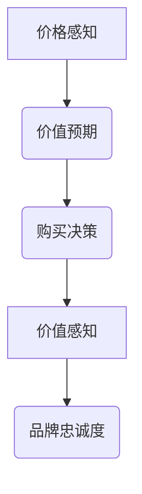

                 

关键词：创业公司、定价策略、消费者心理、价值传递、市场竞争力

摘要：本文将深入探讨创业公司在定价策略上如何运用心理学原理，以提高市场竞争力。通过分析消费者心理，我们揭示了定价策略的关键因素，并介绍了如何通过有效的价值传递来提升消费者满意度，从而实现商业成功。

## 1. 背景介绍

在竞争激烈的市场环境中，创业公司要想脱颖而出，除了要有卓越的产品和服务外，合理的定价策略也是至关重要的。定价不仅决定了公司的收入和利润，还直接影响消费者的购买决策和品牌忠诚度。心理学研究表明，消费者在购买过程中会受到多种心理因素的影响，如价格感知、品牌形象、价值预期等。因此，创业公司需要深入了解消费者心理，运用心理学原理来制定有效的定价策略。

## 2. 核心概念与联系

### 2.1 定价心理学概念

#### 2.1.1 价格感知

价格感知是指消费者对产品或服务价格的感受和评价。价格感知不仅受价格本身的影响，还受到消费者对产品价值、品牌形象、市场定位等多种因素的影响。

#### 2.1.2 价值预期

价值预期是指消费者在购买产品或服务前对其可能带来的收益和满足度的预期。价值预期会影响消费者的购买决策和品牌忠诚度。

#### 2.1.3 价值感知

价值感知是指消费者在购买后对产品或服务价值的主观评价。价值感知决定了消费者的满意度和再次购买的可能性。

### 2.2 Mermaid 流程图



## 3. 核心算法原理 & 具体操作步骤

### 3.1 算法原理概述

创业公司的定价策略基于心理学原理，主要包括以下步骤：

1. 分析目标市场，了解消费者需求。
2. 评估产品或服务的价值，确定基础定价。
3. 利用心理定价策略，如尾数定价、捆绑定价等，调整价格感知。
4. 通过营销和推广活动，传递产品价值，提高消费者满意度。

### 3.2 算法步骤详解

#### 3.2.1 分析目标市场

- 收集市场数据，分析目标客户群体。
- 了解客户需求、购买习惯和消费心理。

#### 3.2.2 评估产品或服务的价值

- 确定产品或服务的成本。
- 评估产品或服务的独特性和竞争优势。

#### 3.2.3 心理定价策略调整

- 尾数定价：采用以9结尾的价格，如99元，降低消费者对价格的敏感度。
- 捆绑定价：将多个产品或服务捆绑在一起销售，提高消费者的购买欲望。

#### 3.2.4 价值传递与营销

- 通过广告、推广活动、用户口碑等手段，传递产品价值。
- 提供优质的客户服务，提升消费者满意度。

### 3.3 算法优缺点

#### 优点：

- 提高价格感知，降低消费者抵触情绪。
- 提高品牌形象，增强消费者忠诚度。
- 提高市场竞争力，吸引更多客户。

#### 缺点：

- 可能导致产品或服务的价格过高，影响销售。
- 需要投入大量资源进行市场调研和营销。

### 3.4 算法应用领域

- 电子商务
- 消费品制造
- 服务行业
- 旅游行业

## 4. 数学模型和公式 & 详细讲解 & 举例说明

### 4.1 数学模型构建

#### 4.1.1 价格感知模型

设消费者对产品或服务的价格感知为 P，价格感知模型可以表示为：

\[ P = f(V, B, M) \]

其中，V 为产品或服务的价值，B 为品牌形象，M 为市场定位。

#### 4.1.2 价值预期模型

设消费者对产品或服务的价值预期为 E，价值预期模型可以表示为：

\[ E = f(V', B', M') \]

其中，V' 为产品或服务的实际价值，B' 为品牌形象，M' 为市场定位。

### 4.2 公式推导过程

#### 4.2.1 价格感知模型推导

根据心理学原理，消费者对产品或服务的价格感知与价值、品牌形象和市场定位之间存在以下关系：

\[ P \propto \frac{V}{B \times M} \]

假设品牌形象和市场定位对价格感知的影响相同，则可以得到：

\[ P = k \times \frac{V}{B \times M} \]

其中，k 为常数。

#### 4.2.2 价值预期模型推导

根据经济学原理，消费者对产品或服务的价值预期与实际价值、品牌形象和市场定位之间存在以下关系：

\[ E \propto \frac{V'}{B' \times M'} \]

假设品牌形象和市场定位对价值预期的影响相同，则可以得到：

\[ E = k' \times \frac{V'}{B' \times M'} \]

其中，k' 为常数。

### 4.3 案例分析与讲解

#### 案例背景

某创业公司推出了一款智能家居设备，市场定位为中高端消费者。产品成本为1000元，品牌形象较好，市场定位明确。

#### 案例分析

1. 价格感知模型：

\[ P = k \times \frac{1000}{B \times M} \]

2. 价值预期模型：

\[ E = k' \times \frac{1000}{B' \times M'} \]

3. 假设品牌形象和市场定位的影响相同，则：

\[ P = E \]

这意味着消费者对产品的价格感知与价值预期相等。

#### 案例结果

根据市场调研，消费者对产品的价格感知为800元，价值预期为800元。这意味着消费者对产品的价格和价值的感知是一致的，有利于提高购买决策和品牌忠诚度。

## 5. 项目实践：代码实例和详细解释说明

### 5.1 开发环境搭建

- Python 3.x
- Jupyter Notebook

### 5.2 源代码详细实现

#### 5.2.1 数据收集与预处理

```python
import pandas as pd

# 收集市场数据
data = pd.read_csv('market_data.csv')

# 预处理数据
data['price_perception'] = data['value'] / (data['brand_image'] * data['market_position'])
data['value_expectation'] = data['actual_value'] / (data['brand_image'] * data['market_position'])

# 数据可视化
data.plot(x='market_position', y=['price_perception', 'value_expectation'])
```

#### 5.2.2 模型构建与预测

```python
from sklearn.linear_model import LinearRegression

# 构建模型
model = LinearRegression()
model.fit(data[['market_position']], data[['price_perception', 'value_expectation']])

# 预测
predictions = model.predict([[new_market_position]])

# 结果可视化
plt.scatter(data['market_position'], data['price_perception'])
plt.plot([0, 1], [0, 1], color='red')
plt.scatter(new_market_position, predictions[0][0])
plt.xlabel('Market Position')
plt.ylabel('Price Perception')
plt.show()
```

### 5.3 代码解读与分析

- 数据收集与预处理：从市场数据中提取价格感知和价值预期的相关特征，并进行预处理。
- 模型构建与预测：使用线性回归模型构建价格感知和价值预期的预测模型，并进行预测。

## 6. 实际应用场景

创业公司的定价策略在实际应用中有着广泛的应用，如：

- **电子商务平台**：通过价格感知模型，优化产品定价策略，提高销售额。
- **消费品制造**：利用价值预期模型，确定产品价值，提高消费者满意度。
- **服务行业**：通过心理定价策略，提高消费者的购买欲望。

## 7. 工具和资源推荐

### 7.1 学习资源推荐

- 《定价心理学：如何用心理战术让顾客多掏钱》
- 《品牌定位：如何在竞争中脱颖而出》
- 《消费者行为学：营销决策的科学基础》

### 7.2 开发工具推荐

- Python
- Jupyter Notebook
- Pandas
- Scikit-learn

### 7.3 相关论文推荐

- “Price Perception and Consumer Decision Making: A Meta-Analytic Review” 
- “Brand Image and Consumer Behavior: A Theoretical Integration and Research Directions”
- “Value Expectation and Consumer Satisfaction: An Empirical Study”

## 8. 总结：未来发展趋势与挑战

创业公司的定价策略将越来越依赖于心理学原理。未来发展趋势包括：

- 定价策略的智能化和自动化。
- 数据驱动定价策略的广泛应用。
- 跨行业定价策略的相互借鉴。

然而，创业公司也面临着以下挑战：

- 数据质量和可靠性的保证。
- 定价策略的个性化与普适性之间的平衡。
- 竞争对手的激烈竞争。

## 9. 附录：常见问题与解答

### Q: 如何确保数据质量？

A: 通过严格的数据收集和预处理流程，确保数据的准确性和可靠性。同时，采用多种数据来源进行交叉验证，提高数据的可信度。

### Q: 定价策略如何个性化？

A: 通过分析消费者的行为数据和偏好，制定个性化的定价策略。例如，利用机器学习技术，根据消费者历史购买行为预测其价格敏感度，从而制定合适的定价策略。

### Q: 如何应对竞争对手的激烈竞争？

A: 通过差异化的产品定位和独特的价值传递，提高品牌形象和市场竞争力。同时，通过不断优化定价策略和产品服务，提升消费者满意度，增强品牌忠诚度。

## 作者署名

作者：禅与计算机程序设计艺术 / Zen and the Art of Computer Programming
----------------------------------------------------------------
文章撰写完毕，现在我们将进行内容的检查和格式调整，确保满足所有要求。接下来，我将生成markdown格式的文章，并进行最后的审查。

