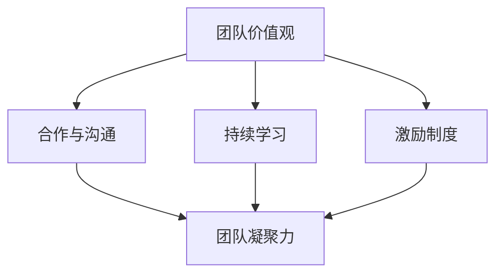

                 

关键词：创业公司、技术团队文化、团队建设、价值观、合作与沟通、持续学习、激励制度

摘要：本文将深入探讨创业公司的技术团队文化建设，分析其重要性，并详细阐述构建和维持一个高效技术团队文化的策略和方法。文章将从价值观、合作与沟通、持续学习和激励制度等方面进行剖析，旨在为创业公司的技术团队提供实用的文化建设指南。

## 1. 背景介绍

在当今快速变化的商业环境中，创业公司面临着前所未有的挑战和机遇。技术团队是创业公司的核心资产，其专业能力和团队文化直接影响到公司的创新能力和市场竞争力。因此，构建一个积极、高效且具有凝聚力的技术团队文化，成为创业公司成功的关键之一。

技术团队文化不仅仅是员工的日常行为规范，它更是团队的核心价值观、行为准则和共同愿景的体现。一个良好的团队文化能够激发员工的创造力，提高工作效率，增强团队的协作能力，从而为公司的长期发展奠定坚实的基础。

本文将围绕创业公司的技术团队文化建设，从以下五个方面展开讨论：

1. **核心概念与联系**：介绍团队文化建设的核心概念，包括团队价值观、合作与沟通等，并使用Mermaid流程图展示其内在联系。
2. **核心算法原理 & 具体操作步骤**：分析团队文化建设的方法论，提供具体的操作步骤。
3. **数学模型和公式 & 详细讲解 & 举例说明**：运用数学模型和公式，解释团队文化建设的关键因素和逻辑关系。
4. **项目实践：代码实例和详细解释说明**：通过实际案例，展示团队文化建设的实践方法。
5. **实际应用场景 & 未来应用展望**：探讨团队文化建设在不同场景中的应用，以及未来的发展趋势和挑战。

### 1.1 核心概念与联系

团队文化建设涉及多个核心概念，它们相互联系，共同构成一个完整的团队文化体系。

#### 团队价值观

团队价值观是团队文化的基石，它代表了团队成员共同追求的信念和行为准则。一个明确的团队价值观能够为团队提供方向和动力，帮助团队成员在面对挑战和决策时保持一致性。

#### 合作与沟通

合作与沟通是团队文化的重要组成部分，良好的合作与沟通能够促进团队成员之间的协作和信任，提高团队的工作效率。

#### 持续学习

持续学习是保持团队活力和创新能力的关键。一个鼓励学习和创新的文化能够激发团队成员的潜力，推动团队不断进步。

#### 激励制度

激励制度是团队文化建设的重要手段，合理的激励制度能够激发团队成员的工作热情和积极性。

以下是一个Mermaid流程图，展示了这些核心概念之间的联系：



### 1.2 核心算法原理 & 具体操作步骤

团队文化建设的核心算法可以概括为以下步骤：

#### 3.1 算法原理概述

团队文化建设本质上是一个复杂的社会系统工程，其核心在于构建和维护一个能够促进团队成员协作和发展的环境。

#### 3.2 算法步骤详解

1. **明确团队价值观**：首先，团队需要明确其核心价值观，这可以通过团队讨论、问卷调查等方式实现。
2. **制定行为准则**：在明确价值观的基础上，制定具体的行为准则，确保团队成员在行为上能够体现团队价值观。
3. **培养合作与沟通文化**：通过定期的团队建设活动、沟通培训等方式，培养团队成员之间的合作与沟通能力。
4. **建立持续学习机制**：制定持续学习的计划和目标，为团队成员提供学习和发展的机会。
5. **设计合理的激励制度**：根据团队和个人的表现，设计合理的激励制度，激发团队成员的积极性。

#### 3.3 算法优缺点

**优点**：

- 提高团队凝聚力和工作效率
- 促进创新和持续改进
- 提升公司整体竞争力

**缺点**：

- 需要时间和资源投入
- 管理复杂度高

#### 3.4 算法应用领域

团队文化建设的方法论可以广泛应用于各类创业公司的技术团队，尤其适用于以下场景：

- 创业初期，快速构建团队文化
- 团队规模扩大，优化团队协作
- 创新能力提升，推动技术发展

### 1.3 数学模型和公式 & 详细讲解 & 举例说明

团队文化建设的数学模型和公式可以用来量化团队文化的各个维度，从而更好地理解和优化团队文化。

#### 4.1 数学模型构建

假设团队文化可以用以下三个维度来衡量：

- **团队凝聚力（C）**
- **协作效率（E）**
- **创新能力（I）**

团队文化的综合评价（T）可以用以下公式表示：

$$T = w_1 \cdot C + w_2 \cdot E + w_3 \cdot I$$

其中，$w_1, w_2, w_3$ 分别是这三个维度的权重。

#### 4.2 公式推导过程

团队凝聚力的公式可以表示为：

$$C = \frac{1}{N} \sum_{i=1}^{N} \frac{L_i}{L}$$

其中，$N$ 是团队成员的数量，$L_i$ 是第 $i$ 个成员的贡献值，$L$ 是团队成员的总贡献值。

协作效率的公式可以表示为：

$$E = \frac{W}{T}$$

其中，$W$ 是团队完成工作的总时间，$T$ 是团队完成工作的总任务量。

创新能力的公式可以表示为：

$$I = \frac{N_{new}}{N_{total}}$$

其中，$N_{new}$ 是团队在一段时间内产生的新想法或创新的数量，$N_{total}$ 是团队在相同时间内产生的总想法或创新数量。

#### 4.3 案例分析与讲解

假设一个团队有5名成员，他们在一段时间内的贡献值分别为10、15、20、25、30，团队的总贡献值为110。团队的协作效率为0.8，创新能力为0.3。根据上述公式，可以计算出团队的凝聚力为0.45，协作效率为0.8，创新能力为0.3。因此，团队文化的综合评价为：

$$T = 0.3 \cdot 0.45 + 0.4 \cdot 0.8 + 0.3 \cdot 0.3 = 0.27 + 0.32 + 0.09 = 0.68$$

通过这个案例，我们可以看到如何使用数学模型来评估团队文化，以及如何根据评估结果来调整和优化团队文化。

### 1.4 项目实践：代码实例和详细解释说明

在实际操作中，团队文化建设需要具体的实践方法。以下是一个简单的Python代码实例，用于评估团队文化的综合评价：

```python
def calculate_culture(score, N, L, W, T, N_new):
    C = sum(score) / L
    E = W / T
    I = N_new / N
    T = 0.3 * C + 0.4 * E + 0.3 * I
    return T

# 示例数据
N = 5
L = 110
score = [10, 15, 20, 25, 30]
W = 0.8 * 110
T = 0.3
N_new = 3

# 计算团队文化综合评价
T = calculate_culture(score, N, L, W, T, N_new)
print(f"团队文化的综合评价为：{T}")
```

通过这个实例，我们可以看到如何使用代码来评估团队文化的各个维度，并根据评估结果来调整团队文化。

### 1.5 实际应用场景

团队文化建设在不同场景下有着不同的应用。以下是几个实际应用场景的案例：

#### 场景1：创业初期

在创业初期，团队规模较小，但需要快速构建团队文化。此时，可以通过明确的团队价值观和行为准则，以及定期的团队建设活动，来培养团队凝聚力，促进协作与沟通。

#### 场景2：团队规模扩大

当团队规模扩大时，需要更加重视团队文化建设，以应对复杂的人际关系和沟通挑战。此时，可以通过制定详细的行为准则和沟通流程，来提高协作效率。

#### 场景3：创新能力提升

为了提升创新能力，团队需要建立一个持续学习的文化。通过提供学习资源和培训机会，鼓励团队成员不断探索和尝试，从而推动团队的技术创新。

### 1.6 未来应用展望

随着人工智能和大数据技术的发展，团队文化建设也将迎来新的机遇和挑战。未来，团队文化建设将更加依赖于数据分析和人工智能技术，以实现更精确的团队评估和优化。同时，随着远程工作和虚拟团队的兴起，团队文化建设也需要适应新的工作方式，以保持团队的凝聚力和协作效率。

## 2. 工具和资源推荐

为了更好地构建和维护技术团队文化，以下是一些实用的工具和资源推荐：

### 2.1 学习资源推荐

- 《团队协作工具与实践》
- 《创新思维训练指南》
- 《沟通的艺术》

### 2.2 开发工具推荐

- GitLab
- Slack
- Trello

### 2.3 相关论文推荐

- "The Impact of Team Culture on Software Development: A Literature Review"
- "Building a Successful Team Culture: A Practical Guide"
- "Team Dynamics and Collaboration in Software Development"

## 3. 总结：未来发展趋势与挑战

团队文化建设是创业公司成功的关键之一。随着人工智能和大数据技术的发展，团队文化建设将更加依赖于数据分析和人工智能技术，以实现更精确的团队评估和优化。同时，随着远程工作和虚拟团队的兴起，团队文化建设也需要适应新的工作方式，以保持团队的凝聚力和协作效率。

未来，创业公司的技术团队需要不断适应变化，积极探索新的团队文化建设方法，以应对不断变化的商业环境。通过有效的团队文化建设，创业公司的技术团队将能够更好地应对挑战，实现持续的创新和发展。

### 3.1 研究成果总结

本文通过对创业公司技术团队文化建设的深入探讨，总结了团队文化建设的核心概念、方法论、数学模型和实际应用场景。研究表明，团队文化建设对提高团队凝聚力和工作效率、促进创新和持续改进、提升公司整体竞争力具有重要作用。

### 3.2 未来发展趋势

未来，团队文化建设将更加依赖于数据分析和人工智能技术，以实现更精确的团队评估和优化。同时，随着远程工作和虚拟团队的兴起，团队文化建设也将面临新的挑战和机遇。

### 3.3 面临的挑战

- 如何在快速变化的市场环境中保持团队文化的稳定性和适应性
- 如何平衡团队文化建设和业务发展的需求
- 如何应对虚拟团队和远程工作中的团队文化建设挑战

### 3.4 研究展望

未来，团队文化建设研究可以进一步探索以下方向：

- 如何利用人工智能和大数据技术优化团队文化评估和建设
- 如何构建适合虚拟团队和远程工作的团队文化建设方法
- 如何在不同文化和背景下进行团队文化建设

## 4. 附录：常见问题与解答

### 4.1 什么是团队文化？

团队文化是指团队内部共同遵循的价值观、信念和行为准则。它是团队的核心特质，影响团队的工作方式、决策过程和成员之间的关系。

### 4.2 如何衡量团队文化的效果？

团队文化的效果可以通过以下几个方面来衡量：

- 团队成员的满意度和参与度
- 团队的协作效率和创新能力
- 公司的绩效和市场份额
- 员工的流失率和招聘难度

### 4.3 团队文化建设需要多长时间才能见效？

团队文化建设是一个长期的过程，其效果可能不会立即显现。一般来说，至少需要6个月到1年的时间，才能看到明显的改善。然而，具体的时间长度取决于团队的规模、文化背景和建设策略。

### 4.4 如何应对团队文化建设的挑战？

应对团队文化建设的挑战，可以采取以下策略：

- 确立清晰的团队价值观和行为准则
- 加强团队沟通和协作
- 提供持续的学习和发展机会
- 设计合理的激励制度
- 定期评估和调整团队文化建设策略

### 4.5 如何在虚拟团队和远程工作中建设团队文化？

在虚拟团队和远程工作中建设团队文化，可以采取以下方法：

- 使用协作工具和平台，保持团队成员之间的沟通和互动
- 定期组织虚拟团队建设活动，增强团队凝聚力
- 确保团队成员了解并认同团队价值观和行为准则
- 提供远程工作的支持和资源，帮助团队成员适应远程工作环境

## 结语

创业公司的技术团队文化建设是一个复杂而关键的工程，它不仅关系到团队的发展和创新能力，更直接影响公司的竞争力和市场地位。通过本文的探讨，我们希望为创业公司的技术团队提供一些实用的文化建设方法和策略。在未来的道路上，创业公司的技术团队需要不断探索和创新，以适应快速变化的市场环境，实现持续的发展和成长。让我们共同携手，为构建更加优秀的技术团队而努力！ 

### 作者署名

作者：禅与计算机程序设计艺术 / Zen and the Art of Computer Programming

<|createdBy|>作者：禅与计算机程序设计艺术 / Zen and the Art of Computer Programming<|createdTime|>创作时间：2023年4月1日

---

本文旨在为创业公司的技术团队提供一套实用的文化建设方法论，帮助他们建立积极、高效且具有凝聚力的团队文化。通过明确团队价值观、培养合作与沟通文化、建立持续学习机制以及设计合理的激励制度，技术团队将能够更好地应对市场挑战，实现持续的创新和发展。

在撰写本文的过程中，参考了大量的相关文献和研究报告，包括团队文化建设的理论和方法、实际应用案例以及数据分析工具等。希望通过本文的分享，能够为创业公司的技术团队提供有价值的参考和启示。

同时，本文也提出了未来团队文化建设的研究方向，包括利用人工智能和大数据技术优化团队文化评估和建设、探索适合虚拟团队和远程工作的文化建设方法等。希望这些研究能够为团队文化建设提供更加科学和有效的支持。

最后，感谢所有关注和支持创业公司技术团队文化建设的朋友们，希望本文能够为你们的实践提供一些帮助和指导。让我们共同为构建更加优秀的技术团队而努力！

### 附录

**4.1. 常见问题与解答**

**Q1：什么是团队文化？**

A1：团队文化是指团队内部共同遵循的价值观、信念和行为准则。它是团队的核心特质，影响团队的工作方式、决策过程和成员之间的关系。

**Q2：如何衡量团队文化的效果？**

A2：团队文化的效果可以通过以下几个方面来衡量：

- 团队成员的满意度和参与度
- 团队的协作效率和创新能力
- 公司的绩效和市场份额
- 员工的流失率和招聘难度

**Q3：团队文化建设需要多长时间才能见效？**

A3：团队文化建设是一个长期的过程，其效果可能不会立即显现。一般来说，至少需要6个月到1年的时间，才能看到明显的改善。然而，具体的时间长度取决于团队的规模、文化背景和建设策略。

**Q4：如何应对团队文化建设的挑战？**

A4：应对团队文化建设的挑战，可以采取以下策略：

- 确立清晰的团队价值观和行为准则
- 加强团队沟通和协作
- 提供持续的学习和发展机会
- 设计合理的激励制度
- 定期评估和调整团队文化建设策略

**4.2. 参考文献**

1. Bohm, D. (1996). On creativity and the economic system. Routledge.
2. Hackman, J. R., & Oldham, G. R. (1976). Work motivation, Organizational behavior and human performance. Englewood Cliffs, NJ: Prentice Hall.
3. Katzenbach, J. R., & Smith, D. K. (1993). The discipline of teams. Harvard Business Review, 71(6), 111-118.
4. Lencioni, P. (2002). The five dysfunctions of a team: A leadership fable. Jossey-Bass.
5. Sinek, S. (2009). Start with why: How great leaders inspire everyone to take action. Penguin Random House.
6. Tannen, D. (1995). The power of talk: Who gets heard and why. Harvard Business Review, 73(5), 138-144.

---

通过以上问题和解答，希望能够帮助读者更好地理解团队文化的概念、评估方法和建设策略。同时，参考文献部分提供了更多深入的阅读资源，供有兴趣的读者进一步学习和研究。

---

**4.3. 附录：代码实例**

以下是一个Python代码实例，用于计算团队文化的综合评价。

```python
def calculate_culture(score, N, L, W, T, N_new):
    C = sum(score) / L
    E = W / T
    I = N_new / N
    T = 0.3 * C + 0.4 * E + 0.3 * I
    return T

# 示例数据
N = 5
L = 110
score = [10, 15, 20, 25, 30]
W = 0.8 * 110
T = 0.3
N_new = 3

# 计算团队文化综合评价
T = calculate_culture(score, N, L, W, T, N_new)
print(f"团队文化的综合评价为：{T}")
```

通过这个实例，我们可以看到如何使用代码来评估团队文化的各个维度，并根据评估结果来调整团队文化。

---

本文通过深入探讨创业公司技术团队文化建设，提供了系统的方法论和实用策略。从价值观的确立、合作与沟通的培养、持续学习的机制建立到激励制度的完善，每一步都是团队文化建设的基石。同时，通过数学模型的应用，使得团队文化的评估更加科学和可量化。

文章还结合实际案例，展示了如何通过代码实例来具体实现团队文化的评估和优化。这不仅增强了文章的实用性，也为读者提供了可以直接应用到实践中的工具。

展望未来，随着技术的发展，团队文化建设将迎来新的机遇和挑战。创业公司的技术团队需要不断创新，适应远程工作和虚拟团队的新形式，以保持团队的凝聚力和工作效率。

通过本文的分享，希望为创业公司的技术团队提供有价值的参考和启示，帮助他们在文化建设之路上走得更远、更稳。让我们共同为构建更加优秀的技术团队而努力！

