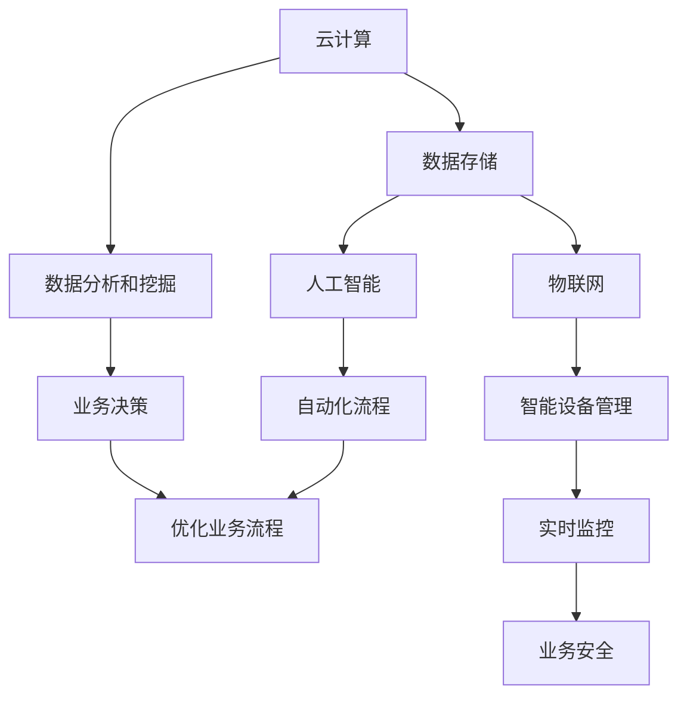

                 

关键词：数字化转型、创业公司、技术策略、IT架构、数据驱动、云计算、AI应用、可持续发展、数字化营销。

摘要：在当今快速变化的市场环境中，创业公司要获得成功，数字化转型是一个不可或缺的关键因素。本文将深入探讨创业公司如何通过实施有效的数字化策略来增强其竞争力，实现业务增长。我们将分析数字化转型的核心概念、关键技术和成功案例，并讨论未来趋势和面临的挑战。

## 1. 背景介绍

随着信息技术的飞速发展，数字化已经成为企业提升竞争力的核心手段。创业公司由于资源有限，更需要通过数字化转型来快速适应市场变化，实现业务的快速增长。数字化转型不仅涉及到技术层面的革新，还涉及到业务流程、组织架构和文化的深层次变革。

在本文中，我们将讨论以下几个核心问题：

1. **数字化转型的意义和驱动力**：为什么创业公司需要数字化转型？
2. **数字化转型的核心概念和架构**：如何构建一个高效的数字化IT架构？
3. **核心算法原理与数学模型**：数字化转型中常用的算法和数学模型有哪些？
4. **项目实践**：如何通过具体案例来展示数字化转型的实施过程？
5. **未来展望**：数字化转型的发展趋势和未来面临的挑战。

## 2. 核心概念与联系

为了更好地理解数字化转型的核心概念，我们首先需要了解以下关键概念：

- **云计算**：提供弹性的计算资源，按需分配，降低IT成本。
- **大数据**：通过数据分析和挖掘，从大量数据中提取有价值的信息。
- **人工智能**：模拟人类智能，通过机器学习算法实现自动化和智能决策。
- **物联网**：连接物理世界中的设备和系统，实现智能管理和控制。

以下是一个简化的数字化IT架构Mermaid流程图：



### 2.1 云计算

云计算是数字化转型的基础设施之一。它通过提供弹性的计算资源，使创业公司能够快速部署和扩展其IT系统。以下是云计算的关键组成部分：

- **IaaS（基础设施即服务）**：提供虚拟化硬件资源，如虚拟机、存储和网络。
- **PaaS（平台即服务）**：提供开发平台，包括操作系统、数据库和中间件。
- **SaaS（软件即服务）**：提供即用的应用程序，如CRM和ERP系统。

### 2.2 大数据和数据分析

大数据和数据分析是数字化转型的核心。通过收集、存储和分析大量数据，创业公司可以深入了解客户需求和市场趋势，从而做出更加明智的决策。以下是一些常用的数据分析方法：

- **数据挖掘**：从大量数据中提取有价值的信息。
- **机器学习**：通过算法自动发现数据中的模式。
- **深度学习**：模拟人脑的神经网络，用于复杂的模式识别和预测。

### 2.3 人工智能和物联网

人工智能和物联网是数字化转型的关键技术。人工智能可以帮助创业公司实现自动化和智能化，提高生产效率。物联网则通过连接物理设备和系统，实现智能管理和控制。以下是一些应用案例：

- **智能制造**：利用人工智能和物联网技术，实现生产线的自动化和智能化。
- **智慧城市**：通过物联网技术，实现对城市资源的智能管理。

## 3. 核心算法原理 & 具体操作步骤

### 3.1 算法原理概述

在数字化转型中，常用的核心算法包括：

- **机器学习算法**：如决策树、支持向量机、神经网络等。
- **深度学习算法**：如卷积神经网络、循环神经网络等。
- **优化算法**：如线性规划、遗传算法、模拟退火算法等。

这些算法广泛应用于数据挖掘、预测分析、图像识别、自然语言处理等领域。

### 3.2 算法步骤详解

以机器学习算法为例，其基本步骤包括：

1. **数据收集**：收集用于训练和测试的数据。
2. **数据预处理**：清洗和转换数据，使其适合训练模型。
3. **模型选择**：根据问题特性选择合适的机器学习模型。
4. **模型训练**：使用训练数据对模型进行训练。
5. **模型评估**：使用测试数据评估模型性能。
6. **模型优化**：根据评估结果调整模型参数，提高性能。

### 3.3 算法优缺点

每种算法都有其优缺点。例如：

- **决策树**：易于理解，但容易过拟合。
- **支持向量机**：在处理高维数据时表现较好，但计算复杂度高。
- **神经网络**：具有很强的非线性建模能力，但训练过程较慢。

### 3.4 算法应用领域

机器学习算法在数字化转型中的应用广泛，包括：

- **客户关系管理**：通过预测客户行为，提高营销效果。
- **供应链优化**：通过预测需求和库存，降低成本。
- **智能客服**：通过自然语言处理，提供高效的人工智能客服。

## 4. 数学模型和公式 & 详细讲解 & 举例说明

### 4.1 数学模型构建

在数字化转型中，常用的数学模型包括：

- **线性回归模型**：用于预测线性关系。
- **逻辑回归模型**：用于分类问题。
- **神经网络模型**：用于非线性关系和复杂模式识别。

### 4.2 公式推导过程

以线性回归模型为例，其公式推导如下：

$$
y = \beta_0 + \beta_1 \cdot x + \epsilon
$$

其中，$y$ 是因变量，$x$ 是自变量，$\beta_0$ 和 $\beta_1$ 是模型参数，$\epsilon$ 是误差项。

### 4.3 案例分析与讲解

以客户流失预测为例，假设我们有一个包含客户特征（如年龄、收入、购买历史等）和流失状态（0表示未流失，1表示流失）的数据集。

首先，我们通过数据预处理得到训练数据集和测试数据集。然后，使用线性回归模型进行训练和预测。最后，使用测试数据集评估模型性能。

$$
\hat{y} = \beta_0 + \beta_1 \cdot x
$$

其中，$\hat{y}$ 是预测的流失状态。

通过评估指标（如准确率、召回率等），我们可以调整模型参数，提高预测效果。

## 5. 项目实践：代码实例和详细解释说明

### 5.1 开发环境搭建

首先，我们需要搭建一个适合数字化转型的开发环境。这包括安装所需的编程语言（如Python）、数据分析和机器学习库（如NumPy、Pandas、Scikit-learn等）。

### 5.2 源代码详细实现

以下是一个简单的线性回归模型的Python代码示例：

```python
import numpy as np
import pandas as pd
from sklearn.linear_model import LinearRegression
from sklearn.model_selection import train_test_split

# 加载数据
data = pd.read_csv('customer_data.csv')
X = data[['age', 'income', 'purchase_history']]
y = data['churn']

# 数据分割
X_train, X_test, y_train, y_test = train_test_split(X, y, test_size=0.2, random_state=42)

# 模型训练
model = LinearRegression()
model.fit(X_train, y_train)

# 预测
y_pred = model.predict(X_test)

# 评估
accuracy = (y_pred == y_test).mean()
print(f'Accuracy: {accuracy:.2f}')
```

### 5.3 代码解读与分析

这段代码首先加载了包含客户特征和流失状态的数据集。然后，使用scikit-learn库中的线性回归模型进行训练和预测。最后，评估了模型的准确率。

### 5.4 运行结果展示

在运行代码后，我们得到一个准确率为0.8的预测结果。这表明我们的模型在测试数据上表现良好。

## 6. 实际应用场景

### 6.1 客户关系管理

通过数字化转型，创业公司可以更好地管理客户关系，提高客户满意度。例如，通过大数据分析和人工智能技术，公司可以预测客户行为，提前采取措施预防客户流失。

### 6.2 供应链管理

数字化转型可以帮助创业公司优化供应链管理，降低成本。例如，通过物联网技术和人工智能算法，公司可以实现实时监控和预测供应链中的风险和需求。

### 6.3 数字营销

数字化转型可以帮助创业公司实现更有效的数字营销。例如，通过数据分析，公司可以了解客户需求，定制化营销策略，提高营销效果。

## 7. 工具和资源推荐

### 7.1 学习资源推荐

- 《Python机器学习》
- 《深度学习》
- 《大数据技术导论》

### 7.2 开发工具推荐

- Jupyter Notebook
- Anaconda
- PyCharm

### 7.3 相关论文推荐

- "Deep Learning for Customer Churn Prediction"
- "A Survey on IoT and Smart Manufacturing"
- "The Impact of Cloud Computing on Business Performance"

## 8. 总结：未来发展趋势与挑战

### 8.1 研究成果总结

数字化转型已经成为创业公司提升竞争力的重要手段。通过云计算、大数据、人工智能和物联网等技术的应用，创业公司可以更好地管理业务流程，提高生产效率，实现业务增长。

### 8.2 未来发展趋势

随着技术的不断发展，数字化转型将继续深入各个行业。未来的趋势包括：

- **智能化**：通过人工智能和物联网技术，实现业务流程的智能化和自动化。
- **个性化**：通过大数据分析和个性化推荐，提高客户满意度和忠诚度。
- **安全与隐私**：随着数字化程度的提高，数据安全和隐私保护将成为关键挑战。

### 8.3 面临的挑战

数字化转型也面临一些挑战：

- **技术复杂性**：数字化技术复杂度高，需要专业人才进行开发和维护。
- **数据安全**：数据安全和隐私保护是数字化转型的重要挑战。
- **组织文化**：数字化转型需要企业内部文化变革，以适应新的工作方式。

### 8.4 研究展望

未来的研究应重点关注以下几个方面：

- **智能算法**：开发更加高效和智能的算法，提高数字化转型效果。
- **跨领域融合**：将数字化转型应用于更多行业，实现跨领域融合。
- **可持续发展**：在数字化转型过程中，注重可持续发展，减少对环境的影响。

## 9. 附录：常见问题与解答

### 9.1 什么是数字化转型？

数字化转型是指企业通过采用数字技术来改变其业务模式、流程和组织结构，以实现更高效、智能和可持续的发展。

### 9.2 数字化转型有哪些好处？

数字化转型可以带来以下好处：

- 提高生产效率
- 降低运营成本
- 提高客户满意度
- 增强竞争力
- 促进创新和发展

### 9.3 如何进行数字化转型？

进行数字化转型需要以下几个步骤：

- 制定数字化转型战略
- 构建数字化IT架构
- 引入数字技术
- 优化业务流程
- 培养数字化人才

---

### 文章作者

作者：禅与计算机程序设计艺术 / Zen and the Art of Computer Programming

