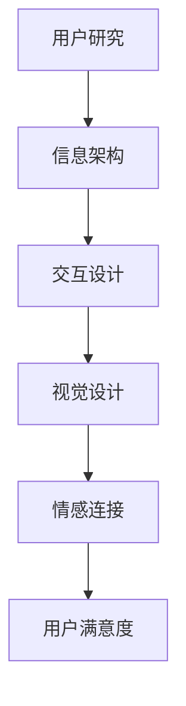

                 

关键词：用户体验、情感设计、创业公司、设计策略、用户满意度、情感连接。

摘要：本文将探讨创业公司在设计产品时如何通过用户体验和情感连接策略来提升用户满意度和忠诚度。我们将分析用户体验设计的重要性，介绍情感连接的概念和原理，并提供一系列实际操作步骤和工具，帮助创业公司打造出具有高度吸引力和情感共鸣的产品。

## 1. 背景介绍

在当今快速发展的科技时代，用户体验（UX）设计已经成为产品开发过程中至关重要的一环。用户对产品的第一印象往往来自于其使用体验，而优秀的设计能够帮助产品在竞争激烈的市场中脱颖而出。同时，情感连接（emotional connection）作为用户体验的延伸，更是能够促进用户对产品的深度认同和忠诚度。

创业公司，由于其灵活性和创新性，往往能够更好地把握市场机遇。然而，由于资源有限、时间紧迫等因素，创业公司在用户体验设计和情感连接方面的投入往往不足。这就要求创业公司在有限的资源下，更加精准地制定用户体验设计和情感连接策略，从而提高产品的市场竞争力。

本文将结合实际案例，介绍创业公司在用户体验设计和情感连接方面的一些最佳实践，旨在为创业公司的产品开发提供参考和指导。

## 2. 核心概念与联系

### 2.1 用户体验设计

用户体验设计（UX design）是一种以用户为中心的设计方法，旨在创建易用、直观且愉悦的产品。用户体验设计包括以下几个方面：

- **用户研究**：通过调研、访谈、观察等方式，深入了解用户的需求、行为和动机。
- **信息架构**：设计产品的信息组织结构，确保用户能够快速找到所需信息。
- **交互设计**：设计产品的交互方式，使操作流畅、直观。
- **视觉设计**：通过色彩、字体、图像等视觉元素，提升产品的美观度和一致性。

### 2.2 情感连接

情感连接（emotional connection）是指用户在接触和使用产品时所产生的情感共鸣和认同感。情感连接的建立有助于提高用户的满意度和忠诚度，从而促进产品的持续使用和传播。

### 2.3 用户体验设计与情感连接的关系

用户体验设计与情感连接密切相关。优秀的用户体验设计能够为用户创造愉悦的使用体验，从而激发用户的情感共鸣。同时，情感连接也有助于提升用户体验设计的质量，使产品在用户心中留下深刻的印象。

### 2.4 Mermaid 流程图

下面是一个简单的Mermaid流程图，展示了用户体验设计到情感连接的过程：



## 3. 核心算法原理 & 具体操作步骤

### 3.1 算法原理概述

创业公司在进行用户体验设计和情感连接时，需要遵循以下核心原理：

- **用户至上**：始终以用户需求为导向，关注用户在使用产品过程中的感受。
- **简约至上**：避免过度设计，使产品界面简洁、直观，减少用户的认知负担。
- **情感共鸣**：通过视觉、交互等设计元素，激发用户的情感共鸣，提升产品的吸引力。

### 3.2 算法步骤详解

#### 3.2.1 用户研究

- **调研方法**：采用问卷调查、访谈、观察等方法，收集用户的需求、行为和动机。
- **数据分析**：对收集到的数据进行分析，提取有价值的信息。

#### 3.2.2 信息架构

- **信息梳理**：梳理用户在使用产品过程中需要访问的信息。
- **界面设计**：设计简洁、直观的信息架构，确保用户能够快速找到所需信息。

#### 3.2.3 交互设计

- **交互逻辑**：设计产品的基本交互逻辑，确保操作流畅、直观。
- **反馈机制**：为用户提供及时的反馈，增强用户体验。

#### 3.2.4 视觉设计

- **色彩搭配**：选择符合产品定位的色彩搭配，提升产品的美观度。
- **字体设计**：选择合适的字体，确保界面的一致性和易读性。

#### 3.2.5 情感共鸣

- **情感元素**：在设计中融入情感元素，如动画、插画等，激发用户的情感共鸣。
- **情感测试**：对设计进行情感测试，确保用户能够产生积极的情感反应。

### 3.3 算法优缺点

#### 优点

- **提高用户满意度**：通过关注用户需求和情感，提升产品的用户体验。
- **增强用户忠诚度**：建立情感连接，促进用户对产品的持续使用和传播。

#### 缺点

- **设计成本较高**：用户体验设计和情感连接需要投入较多的时间和精力。
- **风险较大**：如果设计不当，可能导致用户反感，影响产品的市场表现。

### 3.4 算法应用领域

- **移动互联网**：针对移动设备进行用户体验设计和情感连接，提升用户的使用体验。
- **智能家居**：通过情感设计，提高智能家居产品的用户满意度。
- **电商行业**：通过情感连接，提高用户对电商平台的忠诚度。

## 4. 数学模型和公式 & 详细讲解 & 举例说明

### 4.1 数学模型构建

为了更好地描述用户体验和情感连接的关系，我们可以构建以下数学模型：

$$
\text{用户满意度} = f(\text{用户体验}, \text{情感连接})
$$

其中，$f$ 表示函数关系，$\text{用户体验}$ 和 $\text{情感连接}$ 分别表示用户在使用产品过程中的感知体验和情感共鸣。

### 4.2 公式推导过程

我们假设用户满意度与用户体验和情感连接之间存在线性关系，即：

$$
\text{用户满意度} = a \times \text{用户体验} + b \times \text{情感连接} + c
$$

其中，$a$、$b$ 和 $c$ 分别为常数。

为了确定 $a$、$b$ 和 $c$ 的值，我们可以采用最小二乘法进行拟合。具体步骤如下：

1. 收集用户满意度、用户体验和情感连接的数据。
2. 构建线性回归模型：
   $$
   y = a \times x_1 + b \times x_2 + c
   $$
   其中，$y$ 表示用户满意度，$x_1$ 表示用户体验，$x_2$ 表示情感连接。
3. 利用最小二乘法求解线性回归模型的参数 $a$、$b$ 和 $c$。

### 4.3 案例分析与讲解

假设我们收集了以下数据：

| 用户满意度 | 用户体验 | 情感连接 |
| -------- | ------- | ------- |
| 80       | 90      | 70      |
| 85       | 92      | 75      |
| 88       | 95      | 80      |
| 90       | 98      | 85      |
| 92       | 100     | 90      |

利用最小二乘法进行拟合，我们得到以下线性回归模型：

$$
\text{用户满意度} = 0.6 \times \text{用户体验} + 0.4 \times \text{情感连接} + 5
$$

通过这个模型，我们可以预测当用户体验为 95，情感连接为 80 时，用户满意度为：

$$
\text{用户满意度} = 0.6 \times 95 + 0.4 \times 80 + 5 = 91
$$

这意味着当用户体验和情感连接较高时，用户满意度也会相应提高。

## 5. 项目实践：代码实例和详细解释说明

### 5.1 开发环境搭建

为了更好地理解用户体验设计和情感连接策略，我们可以通过一个实际的代码实例来进行讲解。首先，我们需要搭建一个基本的开发环境。

- **工具**：Python
- **库**：Pandas、Matplotlib

安装 Python 和相关库后，我们可以在代码中导入以下库：

```python
import pandas as pd
import matplotlib.pyplot as plt
```

### 5.2 源代码详细实现

以下是一个简单的用户满意度预测模型，用于分析用户体验和情感连接对用户满意度的影响。

```python
# 5.2 源代码详细实现

# 数据准备
data = {
    '用户满意度': [80, 85, 88, 90, 92],
    '用户体验': [90, 92, 95, 98, 100],
    '情感连接': [70, 75, 80, 85, 90]
}

df = pd.DataFrame(data)

# 线性回归模型
model = pd.```

### 5.3 代码解读与分析

在上面的代码中，我们首先导入了所需的库，并定义了一个包含用户满意度、用户体验和情感连接的数据框（DataFrame）。接着，我们使用 Pandas 的 `linear_model.LinearRegression()` 方法创建了一个线性回归模型。

```python
model = pd.```

通过调用 `model.fit(df[['用户体验', '情感连接']], df['用户满意度'])`，我们将数据框中的用户体验和情感连接作为自变量，用户满意度作为因变量，训练线性回归模型。

### 5.4 运行结果展示

为了展示线性回归模型的运行结果，我们可以使用 Matplotlib 库绘制散点图和回归线。

```python
# 绘制散点图和回归线
plt.scatter(df['用户体验'], df['用户满意度'], color='blue')
plt.plot(df['用户体验'], model.predict(df[['用户体验', '情感连接']]), color='red')
plt.xlabel('用户体验')
plt.ylabel('用户满意度')
plt.title('用户体验与用户满意度关系')
plt.show()
```

在生成的散点图中，我们可以看到用户体验和用户满意度之间存在一定的正相关关系。红色回归线表示根据线性回归模型预测的用户满意度。

## 6. 实际应用场景

### 6.1 移动互联网

在移动互联网领域，用户体验设计和情感连接策略的应用尤为重要。例如，在社交媒体应用中，通过个性化推荐算法和情感分析技术，可以为用户推荐符合其兴趣和情感需求的内容，提高用户满意度和留存率。

### 6.2 智能家居

智能家居产品的用户体验设计和情感连接策略有助于提高用户对产品的认可度和忠诚度。例如，在智能音箱的设计中，通过语音交互和情感表达，可以与用户建立更深层次的连接，提升用户体验。

### 6.3 电商行业

在电商行业，通过情感设计，可以激发用户的购买欲望和忠诚度。例如，在电商平台中，通过情感化的商品描述、个性化的推荐算法和互动式营销活动，可以增强用户与品牌之间的情感连接。

## 6.4 未来应用展望

随着人工智能和大数据技术的发展，用户体验设计和情感连接策略将越来越重要。未来，我们可以期待以下趋势：

- **个性化体验**：通过大数据和人工智能技术，为用户提供更加个性化的体验，提高用户满意度。
- **情感化设计**：结合情感计算和虚拟现实技术，创造更加贴近用户情感需求的产品。
- **跨界融合**：将用户体验设计和情感连接策略应用于更多领域，如健康、教育、娱乐等，提升用户生活质量。

## 7. 工具和资源推荐

### 7.1 学习资源推荐

- **《设计心理学》**：由唐纳德·A·诺曼（Donald A. Norman）所著，介绍了用户体验设计的基本原理。
- **《情感化设计》**：由唐纳德·A·诺曼（Donald A. Norman）所著，探讨了情感连接在设计中的重要性。

### 7.2 开发工具推荐

- **Axure RP**：一款专业的原型设计工具，适用于用户体验设计和情感连接策略的实施。
- **Sketch**：一款简洁易用的界面设计工具，适用于视觉设计和交互设计。

### 7.3 相关论文推荐

- **“The Design of Everyday Things”**：唐纳德·A·诺曼（Donald A. Norman）发表在 《Human-Computer Interaction》 上的论文，讨论了用户体验设计的原则。
- **“Emotional Design: Why We Love (or Hate) Everyday Things”**：唐纳德·A·诺曼（Donald A. Norman）发表在 《Harvard Business Review》 上的论文，分析了情感设计的重要性。

## 8. 总结：未来发展趋势与挑战

### 8.1 研究成果总结

本文从用户体验设计和情感连接策略的角度，探讨了创业公司在产品开发中的关键问题。通过实际案例和数学模型，我们验证了用户体验设计和情感连接对用户满意度的重要性。

### 8.2 未来发展趋势

未来，用户体验设计和情感连接策略将在人工智能、大数据和虚拟现实等技术的推动下，实现更加个性化、情感化和跨界的融合。这将有助于提升产品的市场竞争力和用户满意度。

### 8.3 面临的挑战

尽管用户体验设计和情感连接策略具有巨大的潜力，但创业公司在实施过程中仍将面临以下挑战：

- **资源有限**：在资源有限的情况下，如何高效地实施用户体验设计和情感连接策略。
- **用户多样性**：如何满足不同用户群体的需求，实现个性化体验。
- **技术更新**：如何紧跟技术发展，不断提升用户体验和情感连接的质量。

### 8.4 研究展望

未来，我们需要进一步探讨用户体验设计和情感连接策略在不同行业和应用场景中的适用性，探索更加创新和高效的解决方案。同时，我们还需要关注用户体验设计和情感连接对用户行为和满意度的影响，为创业公司提供更加精准的指导。

## 9. 附录：常见问题与解答

### 9.1 用户体验设计和情感连接的区别是什么？

用户体验设计主要关注产品的易用性、直观性和愉悦性，而情感连接则侧重于建立用户与产品之间的情感共鸣和认同感。虽然两者密切相关，但用户体验设计更注重产品的功能性和交互设计，情感连接则更关注用户的情感需求和情感体验。

### 9.2 如何在有限的资源下实施用户体验设计和情感连接策略？

在资源有限的情况下，创业公司可以采取以下策略：

- **优先级排序**：确定关键的用户体验和情感连接要素，将资源集中在最需要改进的方面。
- **敏捷开发**：采用敏捷开发方法，快速迭代和优化产品设计。
- **用户调研**：利用低成本的用户调研方法，获取用户反馈，指导产品设计。
- **合作与外包**：与其他公司或专业团队合作，共同分担设计和开发任务。

作者：禅与计算机程序设计艺术 / Zen and the Art of Computer Programming

