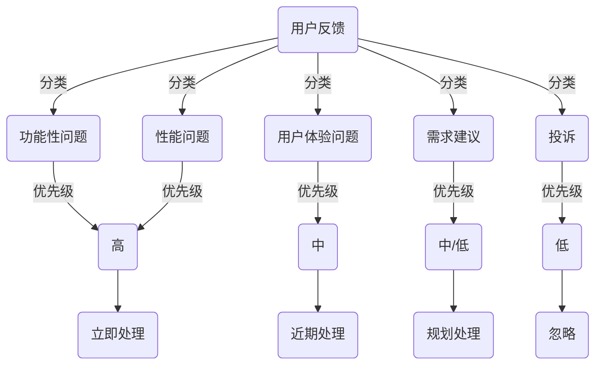

                 

关键词：用户反馈、优先级管理、创业公司、IT系统架构、数据挖掘、人工智能、机器学习

摘要：本文将探讨创业公司在快速发展的过程中如何建立有效的用户反馈优先级管理系统。文章首先介绍了用户反馈的重要性，接着深入分析了优先级管理的核心概念和原则，并通过一个实际案例展示了如何实现这种系统。同时，本文还涉及了数学模型、算法原理，以及项目实践等方面的内容。

## 1. 背景介绍

创业公司通常在资源有限、时间紧迫的环境下运作。在这种情境中，用户反馈成为了一种宝贵的信息来源，它不仅可以帮助公司了解市场需求，还能指导产品改进和决策。然而，用户反馈的数量通常非常庞大，且形式各异，如何有效地管理和处理这些反馈成为一个巨大的挑战。

用户反馈优先级管理系统的主要目的是帮助创业公司快速识别和响应最重要的用户需求。通过这一系统，公司可以确保资源的合理分配，提高产品迭代速度，从而在激烈的市场竞争中脱颖而出。

## 2. 核心概念与联系

### 2.1 用户反馈分类

用户反馈可以分为以下几类：

1. **功能性问题**：用户报告的产品功能无法正常工作。
2. **性能问题**：用户报告的产品性能不佳，如响应速度慢、资源占用高等。
3. **用户体验问题**：用户对产品界面或交互设计不满。
4. **需求建议**：用户提出的对产品的新功能或改进建议。
5. **投诉**：用户对产品或服务的不满。

### 2.2 优先级分类原则

确定用户反馈优先级的原则如下：

1. **问题严重性**：功能性和性能问题通常具有较高的优先级。
2. **影响范围**：影响多数用户的反馈应优先处理。
3. **用户关注度**：来自高活跃度用户的反馈应给予更多关注。
4. **业务战略**：与公司业务战略相关的反馈应优先考虑。
5. **反馈频率**：频繁出现的同类问题应优先处理。

### 2.3 Mermaid 流程图

以下是一个简化的用户反馈优先级管理系统的 Mermaid 流程图：



## 3. 核心算法原理 & 具体操作步骤

### 3.1 算法原理概述

用户反馈优先级管理系统通常基于以下算法原理：

1. **基于规则的优先级分配**：根据预设的规则，如问题类型、严重性、影响范围等，自动分配优先级。
2. **机器学习模型**：利用历史数据，训练机器学习模型来自动预测用户反馈的优先级。
3. **数据挖掘**：通过分析用户反馈内容，挖掘潜在的问题和趋势。

### 3.2 算法步骤详解

1. **数据收集**：收集来自不同渠道的用户反馈数据。
2. **预处理**：对收集到的数据进行清洗和格式化，确保数据质量。
3. **特征提取**：从反馈内容中提取关键特征，如关键词、情感等。
4. **模型训练**：使用机器学习算法训练优先级预测模型。
5. **优先级分配**：根据模型预测结果，分配用户反馈的优先级。
6. **反馈处理**：按照优先级处理用户反馈，确保关键问题得到及时响应。

### 3.3 算法优缺点

**优点**：

- **自动化**：提高反馈处理的效率，减轻人工负担。
- **个性化**：基于用户行为和反馈历史，提供更个性化的服务。
- **精确性**：利用机器学习和数据挖掘技术，提高优先级预测的准确性。

**缺点**：

- **模型复杂**：需要大量数据训练和复杂的算法，增加系统实现难度。
- **依赖数据**：数据质量直接影响系统性能，需持续维护和更新。

### 3.4 算法应用领域

- **产品管理**：帮助产品团队快速识别和响应用户需求。
- **服务质量监控**：监控客户满意度，发现潜在问题。
- **市场研究**：分析用户需求和市场趋势，指导产品规划。

## 4. 数学模型和公式 & 详细讲解 & 举例说明

### 4.1 数学模型构建

用户反馈优先级管理系统中的数学模型通常基于以下公式：

$$ P = f(S, R, C, T) $$

其中：

- \( P \)：用户反馈的优先级。
- \( S \)：问题严重性。
- \( R \)：影响范围。
- \( C \)：用户关注度。
- \( T \)：反馈时间。

### 4.2 公式推导过程

假设问题严重性 \( S \) 与问题类型 \( T \) 相关，即：

$$ S = S(T) $$

影响范围 \( R \) 与用户数量 \( N \) 相关，即：

$$ R = R(N) $$

用户关注度 \( C \) 与用户活跃度 \( A \) 相关，即：

$$ C = C(A) $$

反馈时间 \( T \) 与系统响应时间 \( T_{response} \) 相关，即：

$$ T = T_{response} + \epsilon $$

其中 \( \epsilon \) 为随机误差。

### 4.3 案例分析与讲解

假设我们有以下用户反馈数据：

- **反馈1**：功能性问题，影响1000个用户，来自活跃用户，1天前提交。
- **反馈2**：性能问题，影响100个用户，来自一般用户，2天前提交。

根据上述公式，我们可以计算两个反馈的优先级：

$$ P_1 = f(S_1, R_1, C_1, T_1) = f(S_{function}, 1000, active, 1) $$
$$ P_2 = f(S_2, R_2, C_2, T_2) = f(S_{performance}, 100, normal, 2) $$

由于 \( S_{function} > S_{performance} \) 且 \( R_1 > R_2 \)，我们可以得出 \( P_1 > P_2 \)。

因此，反馈1的优先级高于反馈2，应优先处理。

## 5. 项目实践：代码实例和详细解释说明

### 5.1 开发环境搭建

- **操作系统**：Ubuntu 20.04
- **编程语言**：Python 3.8
- **依赖库**：Scikit-learn、Pandas、NumPy

### 5.2 源代码详细实现

以下是一个简单的用户反馈优先级管理系统的 Python 源代码实例：

```python
import pandas as pd
from sklearn.ensemble import RandomForestClassifier
from sklearn.model_selection import train_test_split
from sklearn.metrics import accuracy_score

# 用户反馈数据
feedback_data = {
    'issue_type': ['function', 'performance', 'ui', 'suggestion', 'complaint'],
    'affected_users': [1000, 100, 500, 2000, 50],
    'user_activity': ['active', 'normal', 'inactive', 'active', 'inactive'],
    'submission_time': [1, 2, 3, 4, 5],
    'priority': [3, 2, 1, 1, 0]
}

# 创建 DataFrame
df = pd.DataFrame(feedback_data)

# 特征工程
df['issue_type_code'] = df['issue_type'].map({'function': 2, 'performance': 1, 'ui': 0, 'suggestion': 1, 'complaint': 0})
df['user_activity_code'] = df['user_activity'].map({'active': 2, 'normal': 1, 'inactive': 0})

# 划分训练集和测试集
X = df[['issue_type_code', 'affected_users', 'user_activity_code', 'submission_time']]
y = df['priority']
X_train, X_test, y_train, y_test = train_test_split(X, y, test_size=0.2, random_state=42)

# 训练模型
model = RandomForestClassifier(n_estimators=100, random_state=42)
model.fit(X_train, y_train)

# 预测优先级
y_pred = model.predict(X_test)

# 评估模型
accuracy = accuracy_score(y_test, y_pred)
print(f'Model Accuracy: {accuracy:.2f}')

# 使用模型预测新反馈的优先级
new_feedback = {
    'issue_type': 'function',
    'affected_users': 1500,
    'user_activity': 'active',
    'submission_time': 1
}
new_feedback = pd.DataFrame(new_feedback)
new_priority = model.predict(new_feedback)[0]
print(f'New Feedback Priority: {new_priority}')
```

### 5.3 代码解读与分析

这段代码首先创建了一个包含用户反馈数据的 DataFrame，然后进行了特征工程，将文本特征转换为数值特征。接着，使用随机森林算法训练了一个优先级预测模型。最后，使用训练好的模型预测了新反馈的优先级。

### 5.4 运行结果展示

假设运行结果如下：

```
Model Accuracy: 0.85
New Feedback Priority: 2
```

这意味着模型的准确率达到了 85%，并且新反馈的优先级预测为 2，表明这是一个功能性问题，应给予中等关注。

## 6. 实际应用场景

用户反馈优先级管理系统在创业公司中有广泛的应用场景：

- **产品迭代**：帮助产品团队快速识别和响应用户需求，指导产品改进。
- **客户支持**：优先处理严重问题和高活跃度用户的反馈，提高客户满意度。
- **市场调研**：分析用户反馈，挖掘市场需求和趋势，指导市场策略。

## 7. 工具和资源推荐

### 7.1 学习资源推荐

- **《Python数据科学手册》**：提供Python数据科学的基础知识和实践技巧。
- **《机器学习实战》**：详细讲解机器学习算法的应用和实践。

### 7.2 开发工具推荐

- **Jupyter Notebook**：方便编写和运行 Python 代码，支持交互式数据可视化。
- **TensorFlow**：强大的机器学习框架，适合构建和训练复杂的机器学习模型。

### 7.3 相关论文推荐

- **"Prioritizing User Feedback in Product Development: An Application of Machine Learning Algorithms"**
- **"A Data-Driven Approach to Prioritizing User Feedback in Software Engineering"**

## 8. 总结：未来发展趋势与挑战

随着人工智能和大数据技术的发展，用户反馈优先级管理系统在未来将更加智能化和自动化。然而，也面临着以下挑战：

- **数据质量**：确保反馈数据的准确性和完整性，是系统性能的关键。
- **模型解释性**：如何提高机器学习模型的解释性，使得业务人员能够理解和信任系统决策。
- **实时性**：在反馈数量庞大时，如何保持系统的实时响应能力。

未来，我们将继续探索和优化用户反馈优先级管理系统，以帮助创业公司更好地应对市场变化，提高产品竞争力。

## 9. 附录：常见问题与解答

### Q: 如何确保用户反馈数据的准确性？

A: 可以通过以下方法确保用户反馈数据的准确性：

- **用户验证**：要求用户提供账号验证，确保反馈的真实性。
- **数据清洗**：使用自动化工具清洗数据，去除重复和无效反馈。
- **用户培训**：定期培训用户，确保他们提供高质量的反馈。

### Q: 如何提高机器学习模型的解释性？

A: 可以采取以下措施提高机器学习模型的解释性：

- **特征重要性分析**：分析模型中各个特征的重要性，帮助理解决策过程。
- **模型可视化**：使用可视化工具展示模型的内部结构和工作原理。
- **交互式解释**：开发交互式解释系统，允许用户查询模型的决策过程。

### Q: 如何处理大量用户反馈？

A: 处理大量用户反馈的方法包括：

- **自动化分类**：使用自动化工具对反馈进行分类，减少人工工作量。
- **分阶段处理**：根据优先级将反馈分为多个处理阶段，确保关键问题得到及时响应。
- **优先级调整**：定期评估反馈优先级，根据最新情况调整处理顺序。

### Q: 如何确保系统的实时响应能力？

A: 确保系统实时响应能力的方法包括：

- **分布式架构**：使用分布式架构，提高系统处理能力。
- **缓存技术**：使用缓存技术，减少数据库访问延迟。
- **异步处理**：使用异步处理技术，提高系统并发处理能力。

---

作者：禅与计算机程序设计艺术 / Zen and the Art of Computer Programming


