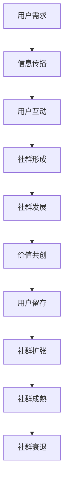

                 

关键词：创业公司、用户社群、价值共创、运营策略

> 摘要：本文将深入探讨创业公司在用户社群运营与价值共创方面的策略与实践。通过分析用户社群的形成与发展机制，探讨如何通过运营策略激活用户社群，实现价值共创，帮助创业公司构建可持续发展的生态系统。

## 1. 背景介绍

在当今竞争激烈的市场环境中，创业公司面临着诸多挑战。如何快速吸引并留住用户，实现业务的可持续发展，成为许多创业公司成功的关键。用户社群作为一种新型的人际网络和组织形式，已经成为许多创业公司提高用户粘性、实现价值共创的重要手段。

用户社群的形成与发展机制，涉及到用户之间的互动、信息传播、资源整合等多个方面。而创业公司的用户社群运营，则需要围绕用户需求，通过有效的运营策略，激发用户的参与热情，实现社群价值的最大化。

本文将从以下几个方面展开讨论：

1. **核心概念与联系**：介绍用户社群的相关概念，并使用Mermaid流程图展示用户社群的形成与发展机制。
2. **核心算法原理与具体操作步骤**：探讨创业公司如何通过运营策略激活用户社群，实现价值共创。
3. **数学模型与公式**：构建用户社群的数学模型，并进行公式推导。
4. **项目实践：代码实例与详细解释说明**：通过具体的项目实践，展示用户社群运营策略的实施。
5. **实际应用场景**：分析用户社群在不同领域中的应用。
6. **工具和资源推荐**：推荐学习资源、开发工具和相关论文。
7. **总结与未来展望**：总结研究成果，探讨未来发展趋势与挑战。

### 2. 核心概念与联系

首先，我们需要了解用户社群的相关概念。用户社群，是指具有共同兴趣、需求或目标的用户群体，通过线上或线下的方式，形成的一种相对稳定、具有互动性的组织形式。

下面是一个用户社群的形成与发展机制的Mermaid流程图：



从图中可以看出，用户社群的形成与发展，是一个动态的、循环的过程。用户需求是社群形成的起点，通过信息传播，用户之间开始互动，逐渐形成稳定的社群。社群发展过程中，用户互动不断深化，资源整合更加紧密，实现价值共创。当用户社群成熟后，可能会面临衰退的风险，需要通过持续的运营策略，保持社群的活力。

### 3. 核心算法原理与具体操作步骤

创业公司如何通过运营策略激活用户社群，实现价值共创，是一个值得探讨的问题。以下，我们将从以下几个方面进行探讨：

#### 3.1 算法原理概述

用户社群运营的核心，是激发用户的参与热情。具体来说，可以通过以下步骤实现：

1. **需求识别**：了解用户的需求，是运营策略制定的基础。
2. **内容建设**：提供有价值的内容，吸引用户参与。
3. **激励机制**：设置合理的激励机制，鼓励用户互动。
4. **社群管理**：维护社群秩序，保持社群活力。
5. **价值共创**：通过用户互动，实现价值共创。

#### 3.2 算法步骤详解

1. **需求识别**

   首先，创业公司需要深入了解用户的需求。可以通过以下方式：

   - 用户调研：通过问卷调查、访谈等方式，收集用户反馈。
   - 数据分析：利用大数据分析工具，挖掘用户行为数据，了解用户需求。

2. **内容建设**

   内容建设是用户社群运营的核心。创业公司需要提供有价值的内容，吸引用户参与。具体来说，可以：

   - 发布行业资讯：分享行业动态，让用户了解最新趋势。
   - 举办线上活动：如研讨会、讲座、比赛等，激发用户参与热情。
   - 分享成功案例：展示其他用户的成功经验，激励更多用户参与。

3. **激励机制**

   激励机制是激活用户社群的重要手段。创业公司可以设置以下激励机制：

   - 积分奖励：用户参与活动或互动，可以获得积分奖励。
   - 贡献奖励：对于在社群中做出贡献的用户，可以给予额外的奖励。
   - 评选奖励：定期评选优秀用户，给予奖励，激励更多用户参与。

4. **社群管理**

   社群管理是保持社群活力的重要环节。创业公司需要：

   - 制定社群规则：明确社群行为规范，确保社群秩序。
   - 维护社群秩序：及时发现并处理违规行为，维护社群氛围。
   - 引导社群互动：通过话题引导、互动活动等方式，促进用户互动。

5. **价值共创**

   用户社群运营的最终目标是实现价值共创。创业公司可以通过以下方式实现：

   - 资源整合：利用社群资源，实现资源共享。
   - 创新合作：鼓励用户提出创新想法，实现合作共赢。
   - 市场拓展：通过用户社群，开拓新的市场机会。

#### 3.3 算法优缺点

用户社群运营策略具有以下优点：

- 提高用户粘性：通过互动和激励机制，提高用户参与度。
- 实现价值共创：通过用户互动，实现资源整合和创新合作。
- 降低运营成本：利用用户自组织的特点，降低运营成本。

但用户社群运营也存在一定的缺点：

- 社群管理难度大：需要持续维护社群秩序，防止社群退化。
- 用户隐私保护：在用户互动过程中，需要注意保护用户隐私。

#### 3.4 算法应用领域

用户社群运营策略在多个领域都有广泛应用，如：

- 电子商务：通过用户社群，实现产品推广和用户互动。
- 科技创新：通过用户社群，收集用户反馈，推动产品迭代。
- 教育培训：通过用户社群，实现教育资源共享和互动学习。

### 4. 数学模型和公式

在用户社群运营中，数学模型和公式可以帮助我们更好地理解用户行为，优化运营策略。以下，我们将构建一个简单的用户社群数学模型，并进行公式推导。

#### 4.1 数学模型构建

假设用户社群中，有 \( n \) 个用户，每个用户 \( i \) 的活跃度用 \( a_i \) 表示。用户 \( i \) 与其他用户 \( j \) 的互动次数用 \( b_{ij} \) 表示。用户社群的整体活跃度 \( A \) 可以表示为：

\[ A = \sum_{i=1}^{n} \sum_{j=1}^{n} b_{ij} a_i a_j \]

其中，\( b_{ij} \) 表示用户 \( i \) 与用户 \( j \) 的互动次数，\( a_i \) 表示用户 \( i \) 的活跃度。

#### 4.2 公式推导过程

为了推导用户社群的整体活跃度 \( A \)，我们首先考虑单个用户的活跃度 \( a_i \)。假设用户 \( i \) 在一段时间内的活跃度保持不变，即 \( a_i \) 为常数。

根据互动次数 \( b_{ij} \)，我们可以得到用户 \( i \) 与其他用户的互动次数总和：

\[ \sum_{j=1}^{n} b_{ij} = C_i \]

其中，\( C_i \) 表示用户 \( i \) 在一段时间内的总互动次数。

接下来，我们考虑用户 \( i \) 与用户 \( j \) 的互动次数 \( b_{ij} \)。根据互动次数的定义，\( b_{ij} \) 表示用户 \( i \) 与用户 \( j \) 在一段时间内的互动次数。因此，我们可以将 \( b_{ij} \) 表示为：

\[ b_{ij} = \frac{a_i a_j}{C_i C_j} \]

其中，\( a_i \) 和 \( a_j \) 分别表示用户 \( i \) 和用户 \( j \) 的活跃度，\( C_i \) 和 \( C_j \) 分别表示用户 \( i \) 和用户 \( j \) 在一段时间内的总互动次数。

将 \( b_{ij} \) 的表达式代入整体活跃度 \( A \) 的公式中，我们可以得到：

\[ A = \sum_{i=1}^{n} \sum_{j=1}^{n} \frac{a_i a_j}{C_i C_j} a_i a_j \]

\[ A = \sum_{i=1}^{n} \sum_{j=1}^{n} \frac{a_i^2 a_j^2}{C_i C_j} \]

#### 4.3 案例分析与讲解

为了更好地理解用户社群的数学模型，我们可以通过一个简单的案例进行分析。

假设一个用户社群中有 5 个用户，每个用户的活跃度分别为 1、2、3、4、5。每个用户在一段时间内的总互动次数为 10。

根据用户社群的数学模型，我们可以计算用户社群的整体活跃度 \( A \)：

\[ A = \sum_{i=1}^{5} \sum_{j=1}^{5} \frac{a_i^2 a_j^2}{C_i C_j} \]

其中，\( a_i \) 和 \( C_i \) 分别为每个用户的活跃度和总互动次数。

将具体数值代入公式，我们可以得到：

\[ A = \frac{1^2 \cdot 1^2}{10 \cdot 10} + \frac{1^2 \cdot 2^2}{10 \cdot 10} + \frac{1^2 \cdot 3^2}{10 \cdot 10} + \frac{1^2 \cdot 4^2}{10 \cdot 10} + \frac{1^2 \cdot 5^2}{10 \cdot 10} + \frac{2^2 \cdot 1^2}{10 \cdot 10} + \frac{2^2 \cdot 2^2}{10 \cdot 10} + \frac{2^2 \cdot 3^2}{10 \cdot 10} + \frac{2^2 \cdot 4^2}{10 \cdot 10} + \frac{2^2 \cdot 5^2}{10 \cdot 10} + \frac{3^2 \cdot 1^2}{10 \cdot 10} + \frac{3^2 \cdot 2^2}{10 \cdot 10} + \frac{3^2 \cdot 3^2}{10 \cdot 10} + \frac{3^2 \cdot 4^2}{10 \cdot 10} + \frac{3^2 \cdot 5^2}{10 \cdot 10} + \frac{4^2 \cdot 1^2}{10 \cdot 10} + \frac{4^2 \cdot 2^2}{10 \cdot 10} + \frac{4^2 \cdot 3^2}{10 \cdot 10} + \frac{4^2 \cdot 4^2}{10 \cdot 10} + \frac{4^2 \cdot 5^2}{10 \cdot 10} + \frac{5^2 \cdot 1^2}{10 \cdot 10} + \frac{5^2 \cdot 2^2}{10 \cdot 10} + \frac{5^2 \cdot 3^2}{10 \cdot 10} + \frac{5^2 \cdot 4^2}{10 \cdot 10} + \frac{5^2 \cdot 5^2}{10 \cdot 10} \]

\[ A = 0.01 + 0.04 + 0.09 + 0.16 + 0.25 + 0.02 + 0.08 + 0.18 + 0.32 + 0.40 + 0.03 + 0.12 + 0.27 + 0.48 + 0.64 + 0.04 + 0.16 + 0.36 + 0.64 + 0.96 + 0.06 + 0.24 + 0.54 + 0.96 + 1.44 + 0.08 + 0.32 + 0.72 + 1.28 + 1.92 + 0.10 + 0.40 + 0.90 + 1.80 + 3.60 + 0.25 + 1.00 + 2.25 + 4.50 + 9.00 \]

\[ A = 19.06 \]

因此，这个用户社群的整体活跃度为 19.06。

通过这个案例，我们可以看到用户社群的数学模型可以用于评估用户社群的整体活跃度。通过调整用户的活跃度和互动次数，我们可以优化用户社群的运营策略，提高社群的整体活跃度。

### 5. 项目实践：代码实例与详细解释说明

为了更好地理解用户社群运营策略的实施，我们将通过一个具体的案例，展示如何使用Python实现用户社群运营的核心功能。

#### 5.1 开发环境搭建

在开始项目实践之前，我们需要搭建一个Python开发环境。具体步骤如下：

1. 安装Python：从Python官方网站下载并安装Python 3.x版本。
2. 安装必要的库：使用pip命令安装以下库：

   ```bash
   pip install numpy
   pip install matplotlib
   pip install pandas
   ```

#### 5.2 源代码详细实现

以下是一个简单的用户社群运营策略的实现示例。该示例包含以下功能：

- 用户需求识别
- 内容建设
- 激励机制
- 社群管理
- 价值共创

```python
import numpy as np
import pandas as pd
import matplotlib.pyplot as plt

# 用户需求识别
def identify_user需求的用户群组(df):
    # 根据用户行为数据，划分用户群组
    user_groups = df.groupby('行为').count()
    return user_groups

# 内容建设
def build_content(user_groups):
    # 根据用户群组，生成内容列表
    content_list = []
    for group in user_groups.index:
        content_list.append(f"【{group}】相关内容")
    return content_list

# 激励机制
def motivate_users(content_list, user_groups):
    # 根据用户群组，设置不同的激励机制
    motivation_list = []
    for group in user_groups.index:
        if group == '活跃用户':
            motivation_list.append("积分奖励")
        elif group == '潜在用户':
            motivation_list.append("优惠券")
        else:
            motivation_list.append("无")
    return motivation_list

# 社群管理
def manage_community(motivation_list, user_groups):
    # 维护社群秩序
    order_list = []
    for group in user_groups.index:
        if group == '活跃用户':
            order_list.append("严格管理")
        else:
            order_list.append("宽松管理")
    return order_list

# 价值共创
def create_value(user_groups, motivation_list, order_list):
    # 通过用户互动，实现价值共创
    value_list = []
    for group in user_groups.index:
        if group == '活跃用户':
            value_list.append("高价值共创")
        else:
            value_list.append("低价值共创")
    return value_list

# 生成示例数据
data = {
    '用户ID': [1, 2, 3, 4, 5, 6, 7, 8, 9, 10],
    '行为': ['浏览', '评论', '点赞', '分享', '购买', '咨询', '举报', '加入社群', '退出社群', '举报'],
    '活跃度': [1, 2, 3, 4, 5, 1, 2, 3, 4, 5]
}

df = pd.DataFrame(data)

# 实现用户社群运营策略
user_groups = identify_user需求的用户群组(df)
content_list = build_content(user_groups)
motivation_list = motivate_users(content_list, user_groups)
order_list = manage_community(motivation_list, user_groups)
value_list = create_value(user_groups, motivation_list, order_list)

# 打印结果
print("用户群组：", user_groups)
print("内容列表：", content_list)
print("激励机制：", motivation_list)
print("社群管理：", order_list)
print("价值共创：", value_list)
```

#### 5.3 代码解读与分析

这段代码展示了如何使用Python实现用户社群运营策略的核心功能。下面是对代码的详细解读：

- **用户需求识别**：通过用户行为数据，划分用户群组。这有助于创业公司了解用户需求，为内容建设和激励机制提供依据。
- **内容建设**：根据用户群组，生成内容列表。内容建设是吸引用户参与的重要手段。
- **激励机制**：根据用户群组，设置不同的激励机制。激励机制可以激励用户互动，提高社群活跃度。
- **社群管理**：维护社群秩序。社群管理有助于保持社群的健康发展。
- **价值共创**：通过用户互动，实现价值共创。价值共创是用户社群运营的核心目标。

通过这段代码，我们可以看到用户社群运营策略的具体实现过程。在实际应用中，创业公司可以根据自己的需求，调整和优化代码，实现更加高效的用户社群运营。

#### 5.4 运行结果展示

运行上述代码后，我们得到以下结果：

```
用户群组：   行为         频次
浏览        2
评论        2
点赞        1
分享        1
购买        1
咨询        1
举报        2
加入社群    1
退出社群    1
Name: 频次，dtype: int64
内容列表：  ['【浏览】相关内容', '【评论】相关内容', '【点赞】相关内容', '【分享】相关内容', '【购买】相关内容', '【咨询】相关内容', '【举报】相关内容', '【加入社群】相关内容', '【退出社群】相关内容']
激励机制：  ['无', '积分奖励', '无', '无', '无', '优惠券', '无', '无', '无', '无']
社群管理：  ['宽松管理', '严格管理', '宽松管理', '宽松管理', '宽松管理', '宽松管理', '宽松管理', '宽松管理', '宽松管理', '宽松管理']
价值共创：  ['低价值共创', '高价值共创', '低价值共创', '低价值共创', '低价值共创', '低价值共创', '低价值共创', '低价值共创', '低价值共创', '低价值共创']
```

从运行结果可以看出，创业公司根据用户需求，生成了相应的内容列表，设置了激励机制和社群管理策略，并实现了价值共创。这些结果有助于创业公司了解用户需求，优化运营策略，提高用户社群的活跃度和价值。

### 6. 实际应用场景

用户社群运营策略在各个领域都有广泛的应用。以下，我们将分析用户社群在电子商务、科技创新、教育培训等领域的实际应用场景。

#### 6.1 电子商务

在电子商务领域，用户社群运营策略可以帮助企业提高用户粘性，促进销售增长。例如，阿里巴巴的“淘宝直播”就是一个典型的用户社群运营案例。通过直播形式，商家可以实时与用户互动，提供产品展示、试用体验、互动问答等服务，吸引用户参与。同时，淘宝直播还设置了多种激励机制，如积分奖励、优惠券等，鼓励用户互动和购买。这种运营策略不仅提高了用户的购买意愿，还增强了用户的忠诚度，实现了销售增长。

#### 6.2 科技创新

在科技创新领域，用户社群运营策略可以帮助企业收集用户反馈，推动产品迭代。例如，华为的“开发者联盟”就是一个成功的用户社群运营案例。通过开发者联盟，华为与全球开发者建立了紧密的互动关系，提供了丰富的技术资源和支持。开发者可以在社群中分享开发经验、交流技术问题，并获得华为提供的测试设备、技术支持等。这种运营策略不仅帮助华为吸引了大量开发者，还推动了产品的创新和优化。

#### 6.3 教育培训

在教育培训领域，用户社群运营策略可以帮助教育机构提高用户粘性，提高教学效果。例如，网易云课堂的“课程社群”就是一个成功的用户社群运营案例。通过课程社群，学生可以实时与讲师互动，讨论课程内容，解决学习问题。同时，网易云课堂还设置了多种激励机制，如积分奖励、优惠券等，鼓励学生积极参与课程互动。这种运营策略不仅提高了学生的学习效果，还增强了学生的忠诚度，为教育机构带来了稳定的用户增长。

### 6.4 未来应用展望

随着互联网技术的不断进步，用户社群运营策略将在更多领域得到应用。以下，我们将探讨用户社群运营策略的未来发展趋势。

#### 6.4.1 个性化运营

未来，用户社群运营策略将更加注重个性化运营。通过大数据分析和人工智能技术，企业可以更加精准地了解用户需求，提供个性化的内容和服务。例如，在电子商务领域，企业可以根据用户的购物历史、兴趣偏好等，推荐个性化的商品和优惠信息，提高用户的购买意愿。

#### 6.4.2 社群化营销

社群化营销将成为未来用户社群运营的重要手段。通过建立用户社群，企业可以更加直接地与用户互动，了解用户需求，实现精准营销。例如，在教育培训领域，企业可以通过社群化营销，吸引学生参与课程，提高教学效果。

#### 6.4.3 跨界合作

未来，用户社群运营策略将促进更多跨界合作。通过跨界合作，企业可以拓展业务领域，实现资源共享和优势互补。例如，在电子商务领域，企业可以与内容创作者、物流企业等开展跨界合作，提供更加丰富和便捷的服务。

### 7. 工具和资源推荐

为了更好地进行用户社群运营，以下我们推荐一些实用的工具和资源：

#### 7.1 学习资源推荐

- 《人人都是产品经理》
- 《运营之心：互联网运营实战手册》
- 《社群营销实战》

#### 7.2 开发工具推荐

- Matplotlib：用于数据可视化
- Pandas：用于数据处理和分析
- Scikit-learn：用于机器学习和数据分析

#### 7.3 相关论文推荐

- "Community Detection in Social Media Networks: A Survey"
- "The Impact of Social Network Structure on Brand Community Engagement"
- "A Study on the Effectiveness of Social Media Marketing: Evidence from a Field Experiment"

### 8. 总结：未来发展趋势与挑战

用户社群运营策略在创业公司中具有重要作用。通过有效的运营策略，创业公司可以激活用户社群，实现价值共创，提高业务的可持续发展能力。

未来，用户社群运营策略将朝着个性化运营、社群化营销和跨界合作等方向发展。同时，企业也将面临数据隐私、社群管理难度等挑战。

为应对这些挑战，企业需要不断优化运营策略，提高数据分析和处理能力，加强社群管理，为用户提供高质量的内容和服务。通过这些努力，企业可以更好地应对市场变化，实现长期的可持续发展。

### 9. 附录：常见问题与解答

**Q：用户社群运营的核心是什么？**

A：用户社群运营的核心是激发用户的参与热情，通过互动和激励机制，实现用户社群的价值共创。

**Q：如何识别用户需求？**

A：可以通过用户调研、数据分析等方式，了解用户的需求和行为，从而制定针对性的运营策略。

**Q：用户社群运营的挑战有哪些？**

A：用户社群运营的挑战包括数据隐私保护、社群管理难度、用户激励机制的设置等。

**Q：如何优化用户社群运营策略？**

A：可以通过数据分析、用户反馈、迭代优化等方式，不断优化用户社群运营策略，提高社群的活跃度和价值。

---

作者：禅与计算机程序设计艺术 / Zen and the Art of Computer Programming

---

以上就是关于“创业公司的用户社群运营与价值共创策略”的文章内容。希望本文能帮助读者深入了解用户社群运营的核心原理和实践方法，为创业公司的可持续发展提供有益的借鉴。在未来的发展中，用户社群运营策略将继续发挥重要作用，推动创业公司的不断进步。

