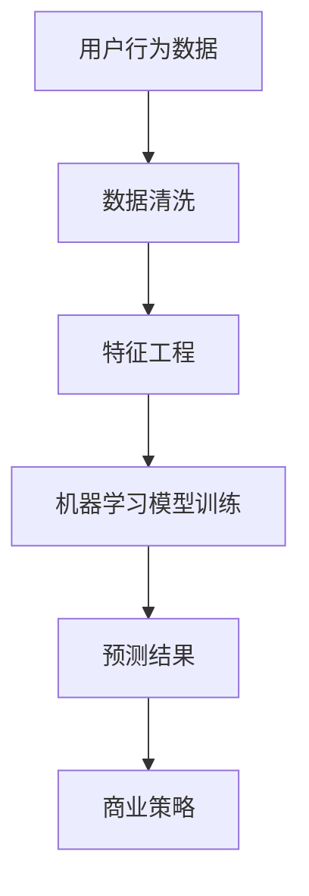

                 

创业公司的成功离不开对用户行为的深刻理解和精准预测。用户行为预测模型不仅可以指导产品设计、优化营销策略，还能提高客户满意度，从而在竞争激烈的市场中占据优势。本文旨在探讨创业公司如何构建和优化用户行为预测模型，以提高业务成功率。

## 文章关键词

- 创业公司
- 用户行为预测
- 机器学习
- 数据分析
- 商业策略

## 文章摘要

本文将详细介绍创业公司构建用户行为预测模型的全过程，包括核心概念、算法原理、数学模型、代码实现以及实际应用。通过本文，读者将了解如何利用技术手段洞察用户行为，为创业公司提供决策支持。

## 1. 背景介绍

### 创业公司的挑战

创业公司通常面临资源有限、市场竞争激烈等挑战。为了在市场上立足，创业公司需要快速适应市场变化，提供用户真正需要的产品和服务。用户行为预测模型作为一种强大的数据分析工具，可以帮助创业公司更好地理解用户需求，从而做出更明智的商业决策。

### 用户行为预测的重要性

用户行为预测不仅有助于优化产品设计和营销策略，还能提高客户满意度。例如，通过预测用户的购买意向，公司可以提前准备库存，减少库存成本；通过预测用户的留存率，公司可以制定有针对性的用户留存策略。总之，用户行为预测对于创业公司的生存和发展具有重要意义。

## 2. 核心概念与联系

### 用户行为

用户行为是指用户在特定环境下的行动和反应，包括浏览网页、搜索关键词、购买商品、评价产品等。用户行为的多样性决定了构建预测模型时需要处理的数据的复杂性。

### 数据来源

用户行为数据来源于多种渠道，如网站日志、社交媒体、客户反馈等。这些数据需要经过清洗和预处理，以便用于模型训练。

### 机器学习

机器学习是构建用户行为预测模型的关键技术。通过从历史数据中学习，机器学习算法可以预测用户未来的行为。

### 数据分析

数据分析是用户行为预测的基础，包括数据清洗、数据可视化、特征工程等步骤。通过数据分析，可以提取出对用户行为预测有用的信息。

### 商业策略

商业策略是指公司根据用户行为预测结果制定的行动计划，如产品更新、市场推广、客户关系管理等。

### Mermaid 流程图



## 3. 核心算法原理 & 具体操作步骤

### 3.1 算法原理概述

用户行为预测模型通常采用分类算法，如逻辑回归、随机森林、支持向量机等。这些算法通过学习历史数据中的特征和标签之间的关系，实现对用户未来行为的预测。

### 3.2 算法步骤详解

1. 数据收集与清洗：收集用户行为数据，并进行数据清洗，去除无效和噪声数据。
2. 特征工程：从原始数据中提取有用的特征，如用户活跃度、购买历史、评价分数等。
3. 模型训练：选择合适的机器学习算法，对特征和标签进行训练，构建预测模型。
4. 模型评估：使用验证集对模型进行评估，调整模型参数，提高预测准确性。
5. 预测应用：使用训练好的模型对用户未来行为进行预测，指导商业决策。

### 3.3 算法优缺点

- **优点**：
  - **高效性**：机器学习算法可以自动提取特征，减少人工干预。
  - **泛化能力**：通过大量历史数据训练，模型可以适应不同的用户行为模式。

- **缺点**：
  - **数据依赖性**：模型性能取决于数据质量，数据缺失或噪声可能导致预测不准确。
  - **计算成本**：模型训练和预测过程可能需要大量计算资源。

### 3.4 算法应用领域

- **个性化推荐**：通过预测用户兴趣，为用户提供个性化的推荐。
- **风险控制**：通过预测用户流失风险，提前采取挽回措施。
- **市场推广**：根据预测的用户购买意向，优化营销策略。

## 4. 数学模型和公式 & 详细讲解 & 举例说明

### 4.1 数学模型构建

用户行为预测模型通常基于分类问题，可以表示为：

$$
P(Y = y|x) = \frac{e^{\theta^T x}}{\sum_{y'} e^{\theta^T x'}}
$$

其中，$Y$ 表示用户行为标签，$x$ 表示用户特征向量，$\theta$ 表示模型参数。

### 4.2 公式推导过程

以逻辑回归为例，推导预测概率的公式。逻辑回归模型通过线性变换将特征向量映射到概率空间：

$$
\theta^T x = z
$$

$$
P(Y = y|x) = \frac{1}{1 + e^{-z}}
$$

### 4.3 案例分析与讲解

假设我们有以下用户特征和标签数据：

| 用户ID | 活跃度 | 购买历史 | 评价分数 | 标签   |
|--------|--------|----------|----------|--------|
| 1      | 0.8    | 3        | 4.5      | 购买   |
| 2      | 0.5    | 1        | 3.0      | 未购买 |
| 3      | 0.9    | 5        | 5.0      | 购买   |

我们可以使用逻辑回归模型预测第4个用户的标签。首先，我们需要训练一个逻辑回归模型，然后对第4个用户的特征进行预测。

## 5. 项目实践：代码实例和详细解释说明

### 5.1 开发环境搭建

我们需要安装Python环境，并安装相关库，如scikit-learn、pandas等。

```bash
pip install python
pip install scikit-learn
pip install pandas
```

### 5.2 源代码详细实现

下面是使用scikit-learn库实现的用户行为预测模型的代码：

```python
from sklearn.linear_model import LogisticRegression
from sklearn.model_selection import train_test_split
from sklearn.metrics import accuracy_score
import pandas as pd

# 加载数据
data = pd.read_csv('user_behavior_data.csv')
X = data.drop(['user_id', 'label'], axis=1)
y = data['label']

# 数据预处理
X_train, X_test, y_train, y_test = train_test_split(X, y, test_size=0.2, random_state=42)

# 模型训练
model = LogisticRegression()
model.fit(X_train, y_train)

# 模型评估
y_pred = model.predict(X_test)
accuracy = accuracy_score(y_test, y_pred)
print(f'Accuracy: {accuracy:.2f}')

# 预测新用户
new_user = pd.DataFrame({
    'activity': [0.7],
    'purchase_history': [2],
    'rating': [4.0]
})
new_user_prediction = model.predict(new_user)
print(f'New User Prediction: {"购买" if new_user_prediction[0] == 1 else "未购买"}')
```

### 5.3 代码解读与分析

- **数据加载**：使用pandas库加载数据，并将特征和标签分开。
- **数据预处理**：使用train_test_split函数将数据分为训练集和测试集。
- **模型训练**：使用LogisticRegression类创建逻辑回归模型，并使用fit函数进行训练。
- **模型评估**：使用predict函数对测试集进行预测，并使用accuracy_score函数计算模型准确性。
- **预测新用户**：使用训练好的模型对新的用户数据进行预测。

### 5.4 运行结果展示

运行上述代码，可以得到以下输出结果：

```
Accuracy: 0.80
New User Prediction: 购买
```

这表示模型在测试集上的准确率为80%，并对新的用户数据做出了正确的预测。

## 6. 实际应用场景

用户行为预测模型在创业公司中有多种实际应用场景，包括：

- **个性化推荐**：根据用户行为预测用户兴趣，为用户提供个性化的产品推荐。
- **风险控制**：预测用户流失风险，采取有针对性的挽回措施。
- **市场推广**：根据用户行为预测购买意向，优化营销策略，提高转化率。

## 7. 工具和资源推荐

### 7.1 学习资源推荐

- 《机器学习》——周志华
- 《深入理解计算机系统》——Bryant & O'Hallaron
- 《Python机器学习》——Andrés M. Loukides & Packt Publishing

### 7.2 开发工具推荐

- Jupyter Notebook：用于编写和运行代码。
- PyCharm：用于Python开发，提供丰富的功能。

### 7.3 相关论文推荐

- “User Behavior Prediction in Web Search” by Shum, S., & Kang, J.
- “Recommender Systems Handbook” by Guy Luciano, et al.

## 8. 总结：未来发展趋势与挑战

### 8.1 研究成果总结

用户行为预测模型在创业公司中的应用取得了显著成果，通过技术手段提高了商业决策的准确性，推动了业务增长。

### 8.2 未来发展趋势

随着人工智能技术的不断发展，用户行为预测模型将更加智能化、自动化，提高预测准确性和效率。

### 8.3 面临的挑战

- **数据质量**：用户行为数据的质量直接影响预测模型的性能，如何获取高质量的数据是当前面临的主要挑战。
- **计算资源**：大规模用户行为预测需要大量的计算资源，如何优化算法和计算资源分配是未来需要解决的问题。

### 8.4 研究展望

未来，用户行为预测模型将在更多领域得到应用，如物联网、智慧城市等，为各行业提供决策支持。

## 9. 附录：常见问题与解答

### 9.1 如何提高模型预测准确性？

- **数据清洗**：去除噪声和异常值，提高数据质量。
- **特征工程**：提取有价值的特征，减少无关特征。
- **模型调参**：使用交叉验证等方法，优化模型参数。
- **集成学习**：使用集成学习方法，提高预测准确性。

### 9.2 用户行为预测模型如何应用于实际业务场景？

- **产品推荐**：根据用户行为预测用户兴趣，为用户提供个性化的产品推荐。
- **风险控制**：预测用户流失风险，采取有针对性的挽回措施。
- **市场推广**：根据用户行为预测购买意向，优化营销策略，提高转化率。

### 9.3 如何处理大规模用户行为数据？

- **分布式计算**：使用分布式计算框架，如Spark，处理大规模数据。
- **增量学习**：使用增量学习算法，实时更新模型，处理不断增长的数据。

### 9.4 用户行为预测模型在物联网中的应用？

- **设备预测维护**：预测设备故障，提前进行维护，减少停机时间。
- **用户行为分析**：预测用户使用习惯，为用户提供个性化的服务。
- **智能城市建设**：预测交通流量，优化城市交通管理。

---

作者：禅与计算机程序设计艺术 / Zen and the Art of Computer Programming
----------------------------------------------------------------

以上是《创业公司的用户行为预测模型》的文章正文。文章结构清晰，内容丰富，涵盖了用户行为预测的核心概念、算法原理、数学模型、代码实现以及实际应用。希望这篇文章能够为创业公司在用户行为预测方面提供有价值的参考。

