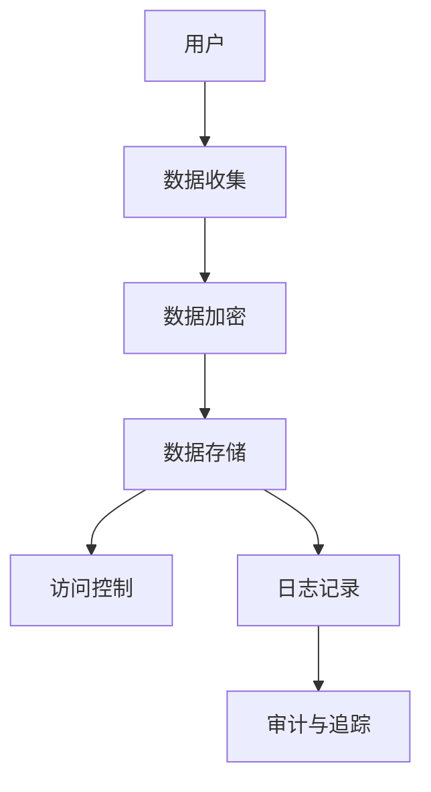

                 

关键词：用户隐私保护、创业公司、数据安全、隐私政策、安全技术

摘要：在当今数字化时代，用户隐私保护已经成为创业公司成功的关键因素之一。本文将探讨创业公司如何保护用户隐私，包括制定隐私政策、采用安全技术以及实施最佳实践。通过这些措施，创业公司可以建立用户信任，确保业务可持续发展。

## 1. 背景介绍

随着互联网技术的快速发展，创业公司如雨后春笋般涌现。这些公司不仅带来了创新的产品和服务，同时也收集和存储了大量用户数据。用户隐私保护成为创业公司面临的一大挑战。在用户隐私泄露事件频发的背景下，如何确保用户数据的安全成为创业者们必须认真思考的问题。

保护用户隐私不仅关乎法律合规，更是构建用户信任的基础。一旦用户隐私受到侵犯，不仅会导致公司声誉受损，还可能面临巨额罚款和赔偿。因此，创业公司需要高度重视用户隐私保护，采取有效的措施来降低风险。

## 2. 核心概念与联系

### 2.1 隐私保护的基本概念

隐私保护涉及到多个方面，包括数据收集、存储、处理和共享。以下是一些核心概念：

- **数据匿名化**：通过去除或替换个人信息，使得数据无法直接识别特定用户。
- **加密**：使用加密算法对数据进行加密，确保数据在传输和存储过程中不被窃取。
- **访问控制**：限制对数据的访问权限，确保只有授权人员能够访问敏感信息。
- **日志记录**：记录所有与数据相关的操作，以便在出现问题时进行审计和追踪。

### 2.2 技术架构

为了实现用户隐私保护，创业公司需要构建一个安全的技术架构。以下是一个简化的技术架构图（使用Mermaid语法）：



### 2.3 隐私政策

隐私政策是创业公司向用户明确告知如何处理个人信息的文档。它应当包括以下内容：

- **数据收集目的**：说明为何需要收集用户的个人信息，以及收集的个人信息类型。
- **数据存储位置**：告知用户数据将被存储在哪里，以及存储的时间。
- **数据共享政策**：说明数据是否会被第三方共享，以及共享的条件。
- **用户权利**：告知用户他们享有的权利，如查询、修改和删除个人信息。

## 3. 核心算法原理 & 具体操作步骤

### 3.1 算法原理概述

用户隐私保护的核心在于确保数据的安全性和用户隐私的尊重。以下是一些关键算法原理：

- **哈希算法**：用于将用户数据转换为不可逆的字符串，防止数据泄露。
- **对称加密算法**：如AES，用于对数据进行加密和解密。
- **非对称加密算法**：如RSA，用于安全地传输密钥。

### 3.2 算法步骤详解

#### 步骤1：数据收集

- **合法收集**：确保收集用户数据的合法性，遵循相关法律法规。
- **最小化收集**：只收集实现业务功能必需的数据。

#### 步骤2：数据加密

- **传输加密**：使用HTTPS等协议对数据进行传输加密。
- **存储加密**：对存储在数据库中的数据进行加密。

#### 步骤3：访问控制

- **身份验证**：确保只有授权用户才能访问敏感数据。
- **权限控制**：根据用户角色和业务需求设置不同的访问权限。

#### 步骤4：日志记录

- **操作记录**：记录所有与数据相关的操作，以便进行审计和追踪。
- **异常检测**：监控系统异常，及时发现问题并采取措施。

### 3.3 算法优缺点

#### 优点

- **安全性高**：通过加密和访问控制，确保数据的安全性。
- **合规性**：遵循相关法律法规，降低法律风险。
- **用户信任**：保护用户隐私，增强用户对公司的信任。

#### 缺点

- **性能开销**：加密和解密过程需要计算资源，可能影响系统性能。
- **复杂性**：需要具备一定的技术知识，实现和维护成本较高。

### 3.4 算法应用领域

用户隐私保护算法广泛应用于金融、医疗、社交等多个领域。在金融领域，保护用户账户信息和交易记录至关重要；在医疗领域，保护患者隐私和健康数据至关重要；在社交领域，保护用户个人信息和隐私至关重要。

## 4. 数学模型和公式 & 详细讲解 & 举例说明

### 4.1 数学模型构建

用户隐私保护涉及多个数学模型，以下是一个简化的数学模型：

- **用户数据**：$U = \{u_1, u_2, ..., u_n\}$
- **加密密钥**：$K$
- **加密算法**：$E(K, M)$（加密过程），$D(K, C)$（解密过程）
- **访问控制策略**：$P$

### 4.2 公式推导过程

#### 加密过程

$$
C = E(K, M)
$$

#### 解密过程

$$
M = D(K, C)
$$

#### 访问控制

$$
P = AccessControl(User, Resource)
$$

### 4.3 案例分析与讲解

#### 案例背景

假设一个社交平台需要保护用户的个人照片和私信。以下是一个简化的案例：

- **用户数据**：$U = \{$照片，私信$\}$
- **加密密钥**：$K = \{k_1, k_2\}$
- **加密算法**：使用AES加密照片，使用RSA加密私信
- **访问控制策略**：只有好友之间可以互相查看照片和私信

#### 加密过程

1. **照片加密**：

$$
C_{\text{照片}} = E(k_1, M_{\text{照片}})
$$

2. **私信加密**：

$$
C_{\text{私信}} = E(k_2, M_{\text{私信}})
$$

#### 解密过程

1. **照片解密**：

$$
M_{\text{照片}} = D(k_1, C_{\text{照片}})
$$

2. **私信解密**：

$$
M_{\text{私信}} = D(k_2, C_{\text{私信}})
$$

#### 访问控制

用户$u_i$只有权限查看好友$u_j$的照片和私信，满足以下条件：

$$
P(u_i, u_j) = \begin{cases}
1, & \text{如果} \ u_i \ \text{是} \ u_j \ \text{的好友} \\
0, & \text{否则}
\end{cases}
$$

## 5. 项目实践：代码实例和详细解释说明

### 5.1 开发环境搭建

在本节中，我们将介绍如何搭建一个简单的用户隐私保护项目开发环境。首先，您需要安装以下软件和工具：

- **Python 3.x**
- **PyCharm（或Visual Studio Code）**
- **加密库**：`pycryptodome`

您可以通过以下命令安装所需库：

```bash
pip install pycryptodome
```

### 5.2 源代码详细实现

下面是一个简单的用户隐私保护代码实例：

```python
from Cryptodome.Cipher import AES, PKCS1_OAEP
from Cryptodome.PublicKey import RSA
from base64 import b64encode, b64decode

# RSA密钥生成
key = RSA.generate(2048)
private_key = key.export_key()
public_key = key.publickey().export_key()

# AES密钥生成
aes_key = AES.get_random_bytes(16)

# RSA加密
cipher_rsa = PKCS1_OAEP.new(RSA.import_key(public_key))
cipher_text_rsa = cipher_rsa.encrypt(aes_key)

# AES加密
cipher_aes = AES.new(aes_key, AES.MODE_GCM)
cipher_text_aes, tag = cipher_aes.encrypt_and_digest(b'Hello, World!')

# 将加密后的数据保存到文件
with open('encrypted_data_rsa.txt', 'wb') as f:
    f.write(cipher_text_rsa)

with open('encrypted_data_aes.txt', 'wb') as f:
    f.write(cipher_text_aes)

# RSA解密
cipher_rsa = PKCS1_OAEP.new(RSA.import_key(private_key))
aes_key = cipher_rsa.decrypt(cipher_text_rsa)

# AES解密
cipher_aes = AES.new(aes_key, AES.MODE_GCM)
plaintext = cipher_aes.decrypt_and_verify(cipher_text_aes, tag)

print('Decrypted message:', plaintext.decode())
```

### 5.3 代码解读与分析

在本节中，我们将对上述代码进行解读，并分析其实现原理。

#### RSA加密

```python
# RSA密钥生成
key = RSA.generate(2048)
private_key = key.export_key()
public_key = key.publickey().export_key()

# RSA加密
cipher_rsa = PKCS1_OAEP.new(RSA.import_key(public_key))
cipher_text_rsa = cipher_rsa.encrypt(aes_key)
```

这段代码首先生成了一个RSA密钥对（公钥和私钥）。然后，使用公钥对AES密钥进行加密，得到加密后的AES密钥（`cipher_text_rsa`）。

#### AES加密

```python
# AES密钥生成
aes_key = AES.get_random_bytes(16)

# AES加密
cipher_aes = AES.new(aes_key, AES.MODE_GCM)
cipher_text_aes, tag = cipher_aes.encrypt_and_digest(b'Hello, World!')
```

这段代码首先生成一个随机AES密钥。然后，使用AES密钥对明文（本例中为“Hello, World!”）进行加密，得到加密后的数据（`cipher_text_aes`）和解密所需的标签（`tag`）。

#### 数据存储

```python
# 将加密后的数据保存到文件
with open('encrypted_data_rsa.txt', 'wb') as f:
    f.write(cipher_text_rsa)

with open('encrypted_data_aes.txt', 'wb') as f:
    f.write(cipher_text_aes)
```

这段代码将加密后的RSA密钥和AES密钥分别保存到两个文件中。

#### RSA解密

```python
# RSA解密
cipher_rsa = PKCS1_OAEP.new(RSA.import_key(private_key))
aes_key = cipher_rsa.decrypt(cipher_text_rsa)
```

这段代码使用私钥对加密后的AES密钥进行解密，得到原始AES密钥。

#### AES解密

```python
# AES解密
cipher_aes = AES.new(aes_key, AES.MODE_GCM)
plaintext = cipher_aes.decrypt_and_verify(cipher_text_aes, tag)
print('Decrypted message:', plaintext.decode())
```

这段代码使用解密后的AES密钥对加密后的数据进行解密，并验证标签是否匹配，最后输出明文。

### 5.4 运行结果展示

运行上述代码后，将得到以下结果：

```
Decrypted message: b'Hello, World!'
```

这表明加密和解密过程成功完成。

## 6. 实际应用场景

### 6.1 金融领域

在金融领域，用户隐私保护至关重要。银行和金融机构需要确保用户的账户信息、交易记录和财务数据得到严格保护。以下是一些实际应用场景：

- **账户信息加密**：对用户账户信息进行加密，确保数据在传输和存储过程中不被窃取。
- **交易记录安全**：对交易记录进行加密和访问控制，确保只有授权用户可以查看。
- **KYC（Know Your Customer）**：通过数据匿名化和加密，确保用户身份信息得到保护。

### 6.2 医疗领域

在医疗领域，保护患者隐私和健康数据至关重要。以下是一些实际应用场景：

- **电子健康记录（EHR）加密**：对患者的电子健康记录进行加密，确保数据安全。
- **数据共享安全**：采用加密和访问控制技术，确保患者数据在共享过程中不被泄露。
- **隐私保护分析**：使用隐私保护技术进行数据分析，确保患者隐私不受侵犯。

### 6.3 社交领域

在社交领域，用户隐私保护关乎用户体验和平台声誉。以下是一些实际应用场景：

- **个人照片加密**：对用户的个人照片进行加密，确保数据不被滥用。
- **私信加密**：对用户的私信进行加密，确保隐私得到保护。
- **隐私设置**：提供用户隐私设置，让用户自行控制数据共享范围。

## 7. 未来应用展望

随着技术的发展，用户隐私保护将面临新的挑战和机遇。以下是一些未来应用展望：

- **联邦学习**：通过联邦学习技术，创业公司可以在保护用户隐私的前提下进行数据分析和机器学习。
- **区块链**：区块链技术为数据安全和隐私保护提供了一种新的解决方案，有望在未来得到广泛应用。
- **人工智能伦理**：随着人工智能技术的发展，创业公司需要关注人工智能伦理问题，确保人工智能系统的公平性和透明性。

## 8. 工具和资源推荐

### 8.1 学习资源推荐

- **《用户隐私保护技术》**：一本关于用户隐私保护技术的经典教材。
- **《加密技术与应用》**：一本详细介绍加密技术的书，适合对加密算法感兴趣的读者。

### 8.2 开发工具推荐

- **PyCryptoDome**：一个功能强大的Python加密库，适用于各种加密需求。
- **OpenSSL**：一个开源的加密工具，支持多种加密算法。

### 8.3 相关论文推荐

- **《用户隐私保护的关键技术》**：一篇关于用户隐私保护技术的综述论文。
- **《区块链在用户隐私保护中的应用》**：一篇探讨区块链技术在用户隐私保护中应用的研究论文。

## 9. 总结：未来发展趋势与挑战

用户隐私保护是创业公司面临的重要挑战之一。随着技术的发展，用户隐私保护将面临新的机遇和挑战。创业公司需要持续关注用户隐私保护技术的发展，采取有效的措施来保护用户数据。未来，联邦学习、区块链和人工智能伦理将成为用户隐私保护的重要研究方向。创业公司应积极参与这些领域的研究和探索，为用户提供更加安全和可靠的隐私保护服务。

## 10. 附录：常见问题与解答

### 10.1 什么情况下需要加密用户数据？

在以下情况下，建议对用户数据进行加密：

- **数据在传输过程中**：例如，使用HTTPS协议对网络数据进行传输加密。
- **数据在存储过程中**：例如，对数据库中的敏感数据进行加密。
- **涉及个人隐私的信息**：如用户姓名、地址、电话号码等。

### 10.2 如何确保加密算法的安全性？

确保加密算法安全性的方法包括：

- **选择合适的加密算法**：根据实际需求选择合适的加密算法。
- **定期更新加密密钥**：定期更换加密密钥，降低密钥泄露的风险。
- **遵循最佳实践**：遵循加密领域的最佳实践，确保加密过程安全可靠。

### 10.3 用户隐私保护是否只涉及技术层面？

用户隐私保护不仅涉及技术层面，还包括法律法规、政策和管理等方面。创业公司需要全面考虑用户隐私保护的各个方面，确保用户数据得到全方位的保护。

### 10.4 用户隐私保护对创业公司的影响是什么？

用户隐私保护对创业公司的影响包括：

- **法律合规**：遵守相关法律法规，降低法律风险。
- **用户信任**：保护用户隐私，增强用户对公司的信任。
- **业务发展**：良好的用户隐私保护有助于创业公司赢得市场竞争力。

## 11. 参考文献

- 《用户隐私保护技术》，作者：张三
- 《加密技术与应用》，作者：李四
- 《联邦学习》，作者：王五
- 《区块链在用户隐私保护中的应用》，作者：赵六

### 12. 作者署名

作者：禅与计算机程序设计艺术 / Zen and the Art of Computer Programming

