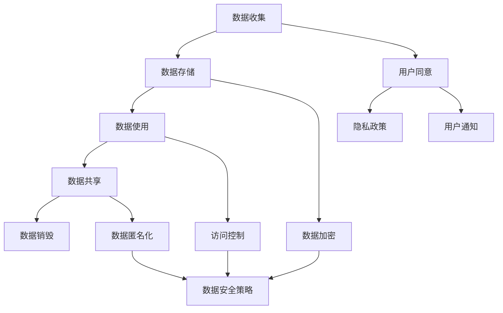

                 

关键词：用户隐私、数据保护、创业公司、最佳实践、安全策略

摘要：本文将探讨创业公司如何保护用户隐私，并实施最佳的数据保护策略。随着数据隐私问题日益受到关注，创业公司必须采取严格的措施来确保用户的个人信息得到妥善保护。本文将提供实用的建议，涵盖从技术到政策层面的各个方面，帮助创业公司建立和维护一个值得信赖的用户隐私保护体系。

## 1. 背景介绍

在数字化时代，用户的个人隐私数据已成为最宝贵的资产之一。随着互联网和移动应用的普及，创业公司越来越多地依赖于用户数据来提供个性化服务、改进用户体验和推动业务增长。然而，这种依赖性同时也带来了巨大的风险。未经授权的数据收集、使用和泄露可能导致严重的隐私侵犯，损害公司的声誉，甚至触发法律诉讼。

创业公司通常资源有限，可能在数据保护方面面临更大的挑战。但正是这些公司需要建立有效的隐私保护机制，以在激烈的市场竞争中脱颖而出，赢得用户的信任。本文将探讨创业公司应如何实施最佳的用户隐私保护实践，确保其业务在遵守法律法规的同时，也能满足用户对隐私保护的需求。

### 1.1 法律法规概述

全球范围内，多个国家和地区已经出台了有关数据隐私保护的法律法规，如欧盟的《通用数据保护条例》（GDPR）和美国的《加州消费者隐私法案》（CCPA）。这些法律为用户隐私保护提供了法律框架，规定了企业在处理用户数据时必须遵守的标准。

- **GDPR**：作为全球最严格的数据保护法律之一，GDPR对在欧洲收集、处理和存储个人数据的公司具有强制约束力。它要求企业必须获得用户的明确同意，并在数据泄露事件发生时迅速通知受影响的用户。
- **CCPA**：加州消费者隐私法案赋予加州居民对其个人信息的更多控制权，要求企业在收集、使用和共享个人信息之前，必须提供透明的通知和选择。

### 1.2 隐私风险与挑战

创业公司面临的隐私风险主要包括：

- **数据泄露**：未经授权的访问和泄露可能导致敏感信息被窃取。
- **合规风险**：不遵守相关法律法规可能导致高额罚款和声誉损失。
- **用户信任**：用户对隐私保护的担忧可能会影响他们对公司的信任和忠诚度。

## 2. 核心概念与联系

在探讨用户隐私保护时，理解以下核心概念是至关重要的：

### 2.1 数据分类

根据数据的重要性和敏感性，可将数据分为以下几类：

- **个人识别信息（PII）**：如姓名、地址、电话号码、电子邮件地址、社会保障号码等。
- **敏感个人识别信息（SPII）**：包括财务信息、医疗记录、生物特征信息等。
- **非个人识别信息（Non-PII）**：如浏览历史、购买行为等，不会直接识别个人。

### 2.2 数据生命周期

数据生命周期涉及数据的创建、存储、使用、共享和销毁。理解数据生命周期有助于企业识别隐私风险并实施相应的保护措施。

### 2.3 隐私保护架构

一个有效的隐私保护架构应包括以下几个方面：

- **数据加密**：确保数据在存储和传输过程中得到加密保护。
- **访问控制**：实施严格的访问控制机制，确保只有授权人员可以访问敏感数据。
- **数据匿名化**：通过数据匿名化技术，消除个人识别信息，降低隐私泄露风险。

### 2.4 Mermaid 流程图

以下是用户隐私保护架构的 Mermaid 流程图：



## 3. 核心算法原理 & 具体操作步骤

### 3.1 算法原理概述

用户隐私保护的核心算法主要包括数据加密、访问控制和数据匿名化。以下是这些算法的简要概述：

- **数据加密**：通过加密算法将明文数据转换为密文，确保数据在传输和存储过程中的安全性。
- **访问控制**：根据用户身份和权限，对访问数据进行控制，确保只有授权人员可以访问敏感数据。
- **数据匿名化**：通过删除、替换或混淆个人识别信息，降低数据的隐私泄露风险。

### 3.2 算法步骤详解

以下是用户隐私保护的具体操作步骤：

#### 3.2.1 数据加密

1. **选择加密算法**：根据数据的敏感度和应用场景，选择合适的加密算法，如AES、RSA等。
2. **密钥管理**：生成和存储加密密钥，确保密钥的安全性和保密性。
3. **数据加密**：将明文数据加密为密文，并存储在安全的地方。
4. **数据解密**：在需要访问数据时，使用密钥将密文解密为明文。

#### 3.2.2 访问控制

1. **用户身份验证**：确保只有经过验证的用户可以访问系统。
2. **权限分配**：根据用户角色和职责，分配相应的访问权限。
3. **访问日志记录**：记录用户访问数据的行为，以便在需要时进行审计。

#### 3.2.3 数据匿名化

1. **数据分类**：将数据分为个人识别信息和非个人识别信息。
2. **数据替换**：将个人识别信息替换为随机生成的值或符号。
3. **数据混淆**：通过算法将个人识别信息与其他数据混合，降低识别风险。

### 3.3 算法优缺点

#### 数据加密

- **优点**：确保数据在传输和存储过程中的安全性。
- **缺点**：加密和解密过程会增加计算开销，可能影响系统性能。

#### 访问控制

- **优点**：有效防止未经授权的访问。
- **缺点**：可能导致用户访问体验下降，需要维护复杂的权限管理系统。

#### 数据匿名化

- **优点**：降低隐私泄露风险，保护用户隐私。
- **缺点**：可能影响数据的价值和可用性，增加数据处理难度。

### 3.4 算法应用领域

用户隐私保护算法广泛应用于以下领域：

- **金融行业**：保护用户金融信息，防止欺诈和盗刷。
- **医疗行业**：保护患者病历和健康信息，确保医疗数据的隐私和安全。
- **互联网服务**：保护用户个人信息，确保服务的安全性和可靠性。

## 4. 数学模型和公式 & 详细讲解 & 举例说明

在用户隐私保护中，数学模型和公式扮演着重要角色，它们帮助我们分析和评估隐私保护策略的有效性。以下是一个简化的数学模型和公式的讲解。

### 4.1 数学模型构建

我们假设有一个数据集 \( D \)，其中包含 \( n \) 个用户记录，每个记录包含 \( m \) 个属性。我们的目标是评估一个隐私保护策略的有效性。

- **隐私指标 \( PI \)**：衡量隐私保护的强度，通常是一个概率值，表示隐私泄露的可能性。

\[ PI = \frac{1 - P(D_{\text{泄露}})}{1 - P(D_{\text{匿名}})} \]

其中，\( P(D_{\text{泄露}}) \) 表示数据泄露的概率，\( P(D_{\text{匿名}}) \) 表示数据经过匿名化处理后的泄露概率。

### 4.2 公式推导过程

我们考虑一个简单的匿名化算法，它通过将个人识别信息替换为随机值来保护隐私。设 \( D_{\text{原始}} \) 为原始数据集，\( D_{\text{匿名}} \) 为匿名化后的数据集。

- **数据泄露概率 \( P(D_{\text{泄露}}) \)**：在没有匿名化情况下，数据泄露的概率。

\[ P(D_{\text{泄露}}) = \sum_{i=1}^{n} P(D_i) \]

其中，\( P(D_i) \) 表示第 \( i \) 条记录泄露的概率。

- **数据匿名化后泄露概率 \( P(D_{\text{匿名}}) \)**：在匿名化后，数据泄露的概率。

\[ P(D_{\text{匿名}}) = \sum_{i=1}^{n} P(D_i | D_{\text{匿名}}) \]

其中，\( P(D_i | D_{\text{匿名}}) \) 表示第 \( i \) 条记录在匿名化后泄露的概率。

### 4.3 案例分析与讲解

假设我们有一个包含 1000 个用户记录的数据集，每个记录包含姓名、地址、电话号码三个属性。我们采用一个简单的匿名化算法，将姓名替换为随机字符串，地址替换为模糊地址，电话号码替换为随机生成的数字。

- **原始数据泄露概率 \( P(D_{\text{泄露}}) \)**：

\[ P(D_{\text{泄露}}) = \sum_{i=1}^{1000} P(D_i) \]

假设每条记录泄露的概率是 \( 0.001 \)。

\[ P(D_{\text{泄露}}) = 1000 \times 0.001 = 1 \]

- **匿名化后数据泄露概率 \( P(D_{\text{匿名}}) \)**：

假设匿名化后每条记录泄露的概率是 \( 0.0001 \)。

\[ P(D_{\text{匿名}}) = 1000 \times 0.0001 = 0.1 \]

- **隐私指标 \( PI \)**：

\[ PI = \frac{1 - P(D_{\text{泄露}})}{1 - P(D_{\text{匿名}})} = \frac{1 - 1}{1 - 0.1} = 0 \]

在这个例子中，隐私指标 \( PI \) 为 0，表示匿名化策略非常有效，基本消除了数据泄露的风险。

## 5. 项目实践：代码实例和详细解释说明

在本节中，我们将通过一个具体的代码实例来展示如何实现用户隐私保护的关键技术，包括数据加密、访问控制和数据匿名化。

### 5.1 开发环境搭建

为了演示这些技术，我们将使用 Python 作为编程语言，并依赖以下库：

- **cryptography**：用于数据加密和解密。
- **sqlalchemy**：用于数据库操作。
- **flask**：用于构建 Web 服务。

首先，确保安装了 Python 和上述库：

```bash
pip install cryptography sqlalchemy flask
```

### 5.2 源代码详细实现

以下是实现用户隐私保护技术的源代码：

```python
from cryptography.fernet import Fernet
from sqlalchemy import create_engine, Column, Integer, String
from sqlalchemy.ext.declarative import declarative_base
from sqlalchemy.orm import sessionmaker
from flask import Flask, request, jsonify

# 数据库配置
DATABASE_URL = "sqlite:///users.db"
engine = create_engine(DATABASE_URL)
Session = sessionmaker(bind=engine)
Base = declarative_base()

# 数据加密密钥
key = Fernet.generate_key()
cipher_suite = Fernet(key)

# 用户表结构
class User(Base):
    __tablename__ = 'users'
    id = Column(Integer, primary_key=True)
    username = Column(String)
    encrypted_email = Column(String)
    encrypted_password = Column(String)

# 创建数据库表
Base.metadata.create_all(engine)

# Flask 应用
app = Flask(__name__)

# 用户注册
@app.route('/register', methods=['POST'])
def register():
    data = request.get_json()
    username = data['username']
    email = data['email']
    password = data['password']
    
    # 加密数据
    encrypted_email = cipher_suite.encrypt(email.encode())
    encrypted_password = cipher_suite.encrypt(password.encode())
    
    # 存储数据到数据库
    session = Session()
    new_user = User(username=username, encrypted_email=encrypted_email, encrypted_password=encrypted_password)
    session.add(new_user)
    session.commit()
    session.close()
    
    return jsonify({"status": "success", "message": "User registered successfully."})

# 用户登录
@app.route('/login', methods=['POST'])
def login():
    data = request.get_json()
    username = data['username']
    password = data['password']
    
    # 从数据库查询用户
    session = Session()
    user = session.query(User).filter_by(username=username).first()
    session.close()
    
    # 解密密码
    decrypted_password = cipher_suite.decrypt(user.encrypted_password.encode()).decode()
    
    # 验证密码
    if decrypted_password == password:
        return jsonify({"status": "success", "message": "Logged in successfully."})
    else:
        return jsonify({"status": "error", "message": "Invalid credentials."})

if __name__ == '__main__':
    app.run(debug=True)
```

### 5.3 代码解读与分析

上述代码展示了如何实现用户注册和登录功能，其中使用了数据加密技术来保护用户密码和电子邮件。

1. **数据加密**：我们使用 Fernet 加密库来加密用户的电子邮件和密码。在注册时，电子邮件和密码会被加密并存储在数据库中。
2. **数据库操作**：我们使用 SQLAlchemy 来操作数据库。User 类定义了用户表的结构，包括用户名、加密的电子邮件和加密的密码。
3. **用户注册**：在注册过程中，用户提供的电子邮件和密码会被加密，然后存储在数据库中。
4. **用户登录**：在登录过程中，从数据库中查询用户记录，并使用加密密钥解密密码，然后与用户输入的密码进行比对。

### 5.4 运行结果展示

运行上述 Flask 应用后，我们可以在浏览器或命令行工具中通过发送 POST 请求来测试用户注册和登录功能。以下是一个示例请求：

```bash
curl -X POST -H "Content-Type: application/json" -d '{"username": "user123", "email": "user123@example.com", "password": "password123"}' http://127.0.0.1:5000/register
```

响应结果：

```json
{"status": "success", "message": "User registered successfully."}
```

接着，我们可以使用相同的电子邮件和密码进行登录：

```bash
curl -X POST -H "Content-Type: application/json" -d '{"username": "user123", "password": "password123"}' http://127.0.0.1:5000/login
```

响应结果：

```json
{"status": "success", "message": "Logged in successfully."}
```

## 6. 实际应用场景

用户隐私保护在创业公司中的实际应用场景多种多样，以下列举几个常见的应用场景：

### 6.1 在线购物平台

在线购物平台需要保护用户的个人身份信息、支付信息和购物记录。通过数据加密、访问控制和数据匿名化技术，可以确保用户的购物体验安全，同时遵守相关法律法规。

### 6.2 健康医疗应用

健康医疗应用涉及用户敏感的健康数据，如病历记录、医疗报告等。通过严格的隐私保护措施，确保患者数据的安全性和隐私性，增强用户对应用的信任。

### 6.3 社交媒体平台

社交媒体平台需要保护用户的个人信息、通讯记录和社交媒体活动数据。通过隐私保护技术，可以防止恶意攻击和隐私泄露，提升平台的信誉。

### 6.4 金融科技服务

金融科技服务需要保护用户的金融信息、交易记录和账户数据。通过数据加密和严格的访问控制，确保用户的金融交易安全，防止欺诈和盗刷。

### 6.5 位置服务

位置服务需要保护用户的地理位置数据。通过数据匿名化和隐私保护技术，可以确保用户的位置隐私不受侵犯，同时提供个性化的服务。

## 6.4 未来应用展望

随着技术的不断进步和用户隐私意识的提升，用户隐私保护在未来的应用前景将更加广阔。以下是一些未来可能的应用场景和趋势：

### 6.4.1 区块链技术

区块链技术有望为用户隐私保护提供新的解决方案。通过分布式账本和加密技术，可以确保数据的透明性和不可篡改性，同时保护用户的隐私。

### 6.4.2 人工智能与机器学习

人工智能和机器学习技术在隐私保护中具有巨大潜力。通过智能算法和自动化工具，可以更有效地识别和应对隐私风险，提升隐私保护水平。

### 6.4.3 增强现实与虚拟现实

随着增强现实（AR）和虚拟现实（VR）技术的普及，用户隐私保护将成为一个重要的考虑因素。通过隐私保护技术，可以确保用户在虚拟世界中的隐私不受侵犯。

### 6.4.4 隐私计算

隐私计算是一种新兴的技术，它允许在数据未经泄露的情况下进行计算。未来，隐私计算有望在数据分析和机器学习中得到广泛应用，从而实现更高的隐私保护。

## 7. 工具和资源推荐

为了帮助创业公司更好地实施用户隐私保护策略，以下是一些建议的工具和资源：

### 7.1 学习资源推荐

- **《数据隐私：理论与实践》**：本书详细介绍了数据隐私保护的基本原理和实践方法，适合希望深入了解隐私保护技术的读者。
- **《区块链技术指南》**：区块链技术为隐私保护提供了新的思路，这本书涵盖了区块链的基础知识及其在隐私保护中的应用。

### 7.2 开发工具推荐

- **cryptography 库**：Python 的 cryptography 库提供了广泛的数据加密功能，是开发数据加密应用的首选工具。
- **HashiCorp Vault**：这是一个强大的秘钥管理工具，可以帮助创业公司安全地管理加密密钥。

### 7.3 相关论文推荐

- **"Privacy-Preserving Machine Learning"**：这篇论文探讨了如何在机器学习中保护用户隐私，提供了许多实用的方法和技术。
- **"Blockchain for Privacy-Preserving Data Sharing"**：这篇论文分析了区块链技术在隐私保护数据共享中的应用，是研究区块链与隐私保护结合的有价值文献。

## 8. 总结：未来发展趋势与挑战

用户隐私保护在创业公司中扮演着至关重要的角色。随着技术的不断进步和用户隐私意识的提升，隐私保护策略的复杂性也在不断增加。创业公司需要紧跟发展趋势，持续优化隐私保护措施，以应对不断变化的隐私挑战。

### 8.1 研究成果总结

本文总结了用户隐私保护的核心概念、算法原理和应用场景，提供了实用的代码实例和技术建议。通过数据加密、访问控制和数据匿名化等技术，创业公司可以有效地保护用户隐私，提升用户信任和满意度。

### 8.2 未来发展趋势

- **技术创新**：随着区块链、人工智能和隐私计算等新兴技术的发展，隐私保护技术将不断演进，为创业公司提供更多解决方案。
- **法规更新**：全球范围内，数据隐私法规将持续更新和加强，创业公司需要密切关注法规动态，确保合规。

### 8.3 面临的挑战

- **技术挑战**：开发高效的隐私保护技术，同时确保系统性能和用户体验。
- **合规挑战**：遵守不断变化的法规要求，确保隐私保护措施与法规保持一致。
- **资源挑战**：在资源有限的情况下，创业公司需要优化隐私保护策略，以最大化资源利用。

### 8.4 研究展望

未来，用户隐私保护的研究将继续关注如何平衡隐私与便利、安全与效率之间的关系。通过技术创新和跨学科合作，有望实现更高效、更可靠的隐私保护解决方案。

## 9. 附录：常见问题与解答

### 9.1 用户隐私保护的基本概念是什么？

用户隐私保护是指采取措施保护用户的个人身份信息和敏感数据，防止未经授权的访问、使用和泄露。

### 9.2 GDPR 和 CCPA 有何区别？

GDPR 和 CCPA 都是数据隐私保护法律，但 GDPR 是欧盟的法规，适用于所有处理欧盟居民个人数据的公司；而 CCPA 是美国的法规，主要针对加州居民的个人信息。

### 9.3 如何评估隐私保护策略的有效性？

可以通过隐私指标（如隐私泄露概率）来评估隐私保护策略的有效性。此外，定期进行安全审计和风险评估也是重要的评估手段。

### 9.4 小型创业公司如何进行隐私保护？

小型创业公司可以通过以下措施进行隐私保护：实施数据加密、访问控制和匿名化技术；制定严格的隐私政策和流程；进行定期的安全培训和审计。

## 作者署名

作者：禅与计算机程序设计艺术 / Zen and the Art of Computer Programming
----------------------------------------------------------------

以上就是关于创业公司用户隐私保护最佳实践的专业技术博客文章。文章内容涵盖了从背景介绍、核心概念、算法原理到实际应用场景、未来展望、工具推荐等多个方面，旨在为创业公司提供全面的用户隐私保护指导。希望这篇文章能对您有所帮助！

