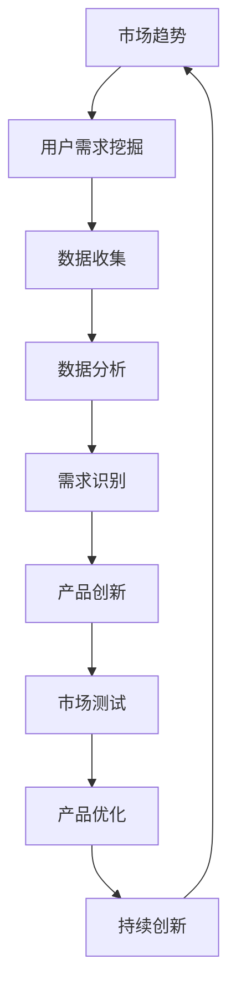

                 

摘要：
本文将深入探讨创业公司在产品开发过程中如何有效挖掘用户需求，并通过创新策略实现产品的差异化竞争。首先，我们将回顾用户需求挖掘的重要性和当前市场趋势，然后详细分析用户需求挖掘的方法和工具。接着，我们将探讨如何利用这些方法来驱动产品创新，并分享一些成功的案例。此外，文章还将讨论在挖掘用户需求和产品创新过程中可能遇到的问题和挑战，并提供相应的解决方案。最后，我们将总结研究成果，展望未来发展趋势，并探讨面临的挑战。

## 1. 背景介绍

在当今竞争激烈的市场环境中，创业公司要想脱颖而出，必须具备敏锐的用户需求洞察力和卓越的产品创新能力。用户需求挖掘是产品开发的重要环节，它关乎产品的市场定位、功能设计、用户体验等多个方面。有效的用户需求挖掘不仅能够帮助创业公司理解目标用户的需求和痛点，还能够指导产品创新，提升产品的市场竞争力。

随着科技的快速发展，用户需求也在不断变化。例如，移动互联网的普及使得用户对即时性和便利性的需求显著增加；大数据和人工智能技术的发展则为用户需求分析提供了强大的工具支持。因此，创业公司需要紧跟市场趋势，运用先进的技术和方法来挖掘用户需求，以实现产品的快速迭代和创新。

本文旨在为创业公司提供一套系统化的用户需求挖掘与产品创新策略，帮助其在激烈的市场竞争中找到突破口，实现持续增长。文章将结合实际案例和理论分析，详细阐述用户需求挖掘的方法、工具和具体实施步骤，并探讨如何在挖掘用户需求的基础上实现产品创新。此外，文章还将分析用户需求挖掘和产品创新过程中可能遇到的问题和挑战，并提供相应的解决方案。

## 2. 核心概念与联系

为了更好地理解用户需求挖掘与产品创新策略，我们需要首先明确一些核心概念。以下是本文将涉及的主要概念：

- **用户需求挖掘**：指通过多种方法和技术收集、分析用户数据，以发现用户需求、痛点和偏好。
- **产品创新**：指通过创新思维和技术手段，开发出满足用户需求的新型产品或服务。
- **市场趋势**：指市场上用户需求的变化、新技术的发展以及竞争格局的演变。

以下是一个简化的 Mermaid 流程图，展示了用户需求挖掘与产品创新策略的流程和核心概念之间的联系：



### 2.1 市场趋势分析

市场趋势分析是用户需求挖掘的前提。通过分析市场趋势，创业公司可以了解当前用户需求的变化方向，识别潜在的市场机会。市场趋势分析通常包括以下几个方面：

1. **技术发展**：了解最新技术趋势，如大数据、人工智能、物联网等，以及这些技术如何影响用户需求。
2. **行业动态**：关注行业内的热点事件、政策变化和竞争对手的动向，以了解市场环境的动态变化。
3. **用户行为**：通过用户行为数据，如搜索趋势、购买习惯、社交媒体活动等，了解用户兴趣和偏好。

### 2.2 用户需求挖掘

用户需求挖掘是指通过多种手段收集和分析用户数据，以识别用户需求、痛点和偏好。以下是几种常用的用户需求挖掘方法：

1. **问卷调查**：通过设计有针对性的问卷，收集用户反馈，以了解用户的需求和期望。
2. **用户访谈**：通过与目标用户进行一对一访谈，深入了解用户的实际需求和痛点。
3. **用户行为分析**：通过分析用户在使用产品过程中的行为数据，发现用户的使用习惯和偏好。
4. **焦点小组讨论**：组织一组目标用户进行讨论，收集他们对产品和市场的看法。

### 2.3 数据分析

数据分析是用户需求挖掘的关键步骤。通过对收集到的用户数据进行系统分析，创业公司可以识别出用户的需求模式、趋势和痛点。以下是几种常用的数据分析方法：

1. **描述性分析**：对用户数据的基本统计描述，如用户分布、行为频率等。
2. **相关性分析**：分析用户数据中的相关关系，以识别潜在的因果关系。
3. **预测分析**：利用历史数据，预测未来的用户需求和趋势。
4. **聚类分析**：将用户数据分为不同的群体，以便更准确地理解用户需求。

### 2.4 需求识别

需求识别是通过分析用户数据，将用户需求转化为具体的产品需求。这通常包括以下步骤：

1. **需求分类**：将用户需求分为功能性需求、体验性需求和商业需求。
2. **优先级排序**：根据用户需求的重要性和可行性，对需求进行优先级排序。
3. **需求验证**：通过用户反馈和专家评审，验证需求的准确性和可行性。

### 2.5 产品创新

产品创新是在需求识别的基础上，通过创新思维和技术手段，开发出满足用户需求的新型产品或服务。以下是几种常见的创新方法：

1. **头脑风暴**：通过集体讨论，激发创意思维，产生新的产品概念。
2. **设计思维**：以用户需求为中心，通过迭代设计过程，不断优化产品。
3. **技术整合**：利用最新的技术和工具，实现产品的创新和差异化。

### 2.6 市场测试

市场测试是验证产品创新效果的重要步骤。通过市场测试，创业公司可以了解用户对产品的实际反应，收集反馈意见，并根据反馈进行产品优化。以下是几种常用的市场测试方法：

1. **A/B 测试**：将用户分为两组，一组使用新功能，另一组使用旧功能，比较两组用户的行为差异。
2. **用户体验测试**：邀请目标用户参与产品测试，收集他们的反馈和建议。
3. **试销**：在特定市场区域进行小规模的产品试销，以评估产品的市场潜力。

### 2.7 产品优化

产品优化是在市场测试的基础上，对产品进行改进和优化，以提高用户体验和市场竞争力。以下是几种常见的优化方法：

1. **功能优化**：根据用户反馈，改进产品的功能设计和操作流程。
2. **性能优化**：通过技术手段，提高产品的性能和稳定性。
3. **用户体验优化**：优化产品的界面设计、交互逻辑和用户流程。

### 2.8 持续创新

持续创新是创业公司保持竞争力的关键。通过持续不断地挖掘用户需求，进行产品创新和优化，创业公司可以不断提高产品的市场竞争力。以下是几种实现持续创新的方法：

1. **定期调研**：定期对用户需求和市场趋势进行调研，以确保产品与市场需求保持同步。
2. **敏捷开发**：采用敏捷开发方法，快速迭代产品，及时响应用户反馈。
3. **跨部门协作**：鼓励不同部门之间的协作，以促进创新思维和资源共享。

通过上述流程和方法的有机结合，创业公司可以有效地挖掘用户需求，实现产品创新，并在激烈的市场竞争中脱颖而出。

## 3. 核心算法原理 & 具体操作步骤

### 3.1 算法原理概述

用户需求挖掘与产品创新的核心算法主要基于数据分析和机器学习技术。以下是一些关键的算法原理：

1. **数据挖掘**：通过聚类、分类、关联规则挖掘等方法，从大量用户数据中发现潜在的需求模式。
2. **机器学习**：利用监督学习、无监督学习和强化学习等算法，对用户行为数据进行分析和预测。
3. **自然语言处理**：通过文本挖掘和语义分析，从用户评论和反馈中提取需求信息。
4. **用户行为分析**：利用时间序列分析和序列模式挖掘，分析用户的行为模式和偏好。

### 3.2 算法步骤详解

以下是用户需求挖掘与产品创新的具体操作步骤：

#### 3.2.1 数据收集

1. **用户行为数据**：通过网站日志、用户点击流、搜索记录等收集用户行为数据。
2. **用户反馈数据**：通过问卷调查、用户访谈、用户评论等方式收集用户反馈数据。
3. **市场数据**：收集行业报告、市场调研数据等，以了解市场趋势和竞争对手情况。

#### 3.2.2 数据预处理

1. **数据清洗**：去除重复数据、处理缺失值和异常值。
2. **数据转换**：将不同来源的数据转换为统一的格式，以便后续分析。
3. **特征提取**：从原始数据中提取有用的特征，如用户年龄、性别、消费行为等。

#### 3.2.3 数据分析

1. **描述性分析**：统计用户数据的基本特征，如用户分布、行为频率等。
2. **相关性分析**：分析不同特征之间的关系，以发现潜在的需求关联。
3. **预测分析**：利用机器学习算法，预测用户未来可能的需求和行为。

#### 3.2.4 需求识别

1. **需求分类**：将用户需求分为功能性需求、体验性需求和商业需求。
2. **优先级排序**：根据用户需求的重要性和可行性，对需求进行优先级排序。
3. **需求验证**：通过用户反馈和专家评审，验证需求的准确性和可行性。

#### 3.2.5 产品创新

1. **头脑风暴**：通过集体讨论，激发创意思维，产生新的产品概念。
2. **设计思维**：以用户需求为中心，通过迭代设计过程，不断优化产品。
3. **技术整合**：利用最新的技术和工具，实现产品的创新和差异化。

#### 3.2.6 市场测试

1. **A/B 测试**：将用户分为两组，一组使用新功能，另一组使用旧功能，比较两组用户的行为差异。
2. **用户体验测试**：邀请目标用户参与产品测试，收集他们的反馈和建议。
3. **试销**：在特定市场区域进行小规模的产品试销，以评估产品的市场潜力。

#### 3.2.7 产品优化

1. **功能优化**：根据用户反馈，改进产品的功能设计和操作流程。
2. **性能优化**：通过技术手段，提高产品的性能和稳定性。
3. **用户体验优化**：优化产品的界面设计、交互逻辑和用户流程。

#### 3.2.8 持续创新

1. **定期调研**：定期对用户需求和市场趋势进行调研，以确保产品与市场需求保持同步。
2. **敏捷开发**：采用敏捷开发方法，快速迭代产品，及时响应用户反馈。
3. **跨部门协作**：鼓励不同部门之间的协作，以促进创新思维和资源共享。

### 3.3 算法优缺点

#### 优点

1. **高效性**：通过自动化算法，可以快速处理大量数据，提高效率。
2. **准确性**：利用机器学习和自然语言处理技术，可以更准确地识别用户需求。
3. **灵活性**：可以根据不同的需求场景和目标用户，灵活调整算法参数。

#### 缺点

1. **数据依赖性**：算法的效果很大程度上依赖于数据的质量和完整性。
2. **计算复杂性**：一些复杂的算法（如深度学习）需要大量的计算资源。
3. **可解释性**：自动化算法的结果往往难以解释，影响决策的透明性。

### 3.4 算法应用领域

用户需求挖掘与产品创新算法广泛应用于多个领域：

1. **电子商务**：通过分析用户购买行为，推荐个性化商品。
2. **社交媒体**：通过分析用户行为和评论，优化内容推荐和广告投放。
3. **金融科技**：通过分析用户财务数据，提供个性化的金融服务。
4. **医疗健康**：通过分析患者数据，优化医疗资源分配和疾病预测。

## 4. 数学模型和公式 & 详细讲解 & 举例说明

在用户需求挖掘与产品创新策略中，数学模型和公式是不可或缺的工具，它们帮助我们量化用户行为、预测需求趋势、优化产品设计。以下将详细介绍几个常用的数学模型和公式，并加以举例说明。

### 4.1 数学模型构建

#### 4.1.1 用户行为模型

用户行为模型用于描述用户在产品上的行为，常见的有马尔可夫链模型和贝叶斯网络模型。

**马尔可夫链模型：**

马尔可夫链模型假设用户当前的行为仅与之前的行为有关，与过去的状态无关。其转移概率矩阵 \( P \) 如下：

\[ P = \begin{bmatrix}
p_{11} & p_{12} & \dots & p_{1n} \\
p_{21} & p_{22} & \dots & p_{2n} \\
\vdots & \vdots & \ddots & \vdots \\
p_{n1} & p_{n2} & \dots & p_{nn}
\end{bmatrix} \]

其中， \( p_{ij} \) 表示从状态 \( i \) 转移到状态 \( j \) 的概率。

**贝叶斯网络模型：**

贝叶斯网络通过概率图结构来表示用户行为，其中每个节点表示一个用户行为，边表示行为之间的依赖关系。条件概率表 \( P(X|Y) \) 用于描述给定一个父节点，子节点的概率分布。

#### 4.1.2 需求预测模型

需求预测模型用于预测未来的用户需求，常见的方法有线性回归、时间序列分析和决策树等。

**线性回归模型：**

线性回归模型假设需求 \( Y \) 是输入特征 \( X \) 的线性组合，并加上随机误差项 \( \varepsilon \)：

\[ Y = \beta_0 + \beta_1 X + \varepsilon \]

其中， \( \beta_0 \) 和 \( \beta_1 \) 是模型参数。

**时间序列分析模型：**

时间序列分析模型用于分析时间序列数据的趋势、季节性和周期性。常见的模型有ARIMA（自回归积分滑动平均模型）和LSTM（长短期记忆网络）。

**ARIMA模型：**

\[ y_t = \phi_1 y_{t-1} + \phi_2 y_{t-2} + \dots + \phi_p y_{t-p} + \theta_1 e_{t-1} + \theta_2 e_{t-2} + \dots + \theta_q e_{t-q} + e_t \]

其中， \( y_t \) 是时间序列的当前值， \( e_t \) 是白噪声误差。

**LSTM模型：**

\[ \begin{align*}
i_t &= \sigma(W_i \cdot [h_{t-1}, x_t] + b_i) \\
f_t &= \sigma(W_f \cdot [h_{t-1}, x_t] + b_f) \\
\mathrm{C}_t &= f_t \cdot \mathrm{C}_{t-1} + i_t \cdot \mathrm{sigmoid}(W_c \cdot [h_{t-1}, x_t] + b_c) \\
o_t &= \sigma(W_o \cdot [\mathrm{C}_t, h_{t-1}] + b_o) \\
h_t &= o_t \cdot \mathrm{C}_t
\end{align*} \]

其中， \( i_t \)，\( f_t \)，\( o_t \) 分别表示输入门、遗忘门和输出门， \( \sigma \) 表示sigmoid函数。

### 4.2 公式推导过程

#### 4.2.1 线性回归公式推导

假设我们有 \( n \) 个数据点 \((x_i, y_i)\)，我们的目标是最小化残差平方和：

\[ \sum_{i=1}^{n} (y_i - \beta_0 - \beta_1 x_i)^2 \]

对 \( \beta_0 \) 和 \( \beta_1 \) 分别求偏导数，并令其等于零，得到：

\[ \begin{align*}
\frac{\partial}{\partial \beta_0} \sum_{i=1}^{n} (y_i - \beta_0 - \beta_1 x_i)^2 &= 0 \\
\frac{\partial}{\partial \beta_1} \sum_{i=1}^{n} (y_i - \beta_0 - \beta_1 x_i)^2 &= 0
\end{align*} \]

简化后，我们得到线性回归的公式：

\[ \begin{align*}
\beta_0 &= \bar{y} - \beta_1 \bar{x} \\
\beta_1 &= \frac{\sum_{i=1}^{n} (x_i - \bar{x})(y_i - \bar{y})}{\sum_{i=1}^{n} (x_i - \bar{x})^2}
\end{align*} \]

其中， \( \bar{x} \) 和 \( \bar{y} \) 分别是 \( x \) 和 \( y \) 的均值。

#### 4.2.2 ARIMA模型公式推导

ARIMA模型包括自回归（AR）、差分（I）和移动平均（MA）三个部分。我们首先对时间序列进行差分，使其稳定：

\[ \Delta y_t = y_t - y_{t-1} \]

然后，我们建立自回归和移动平均模型：

\[ \Delta y_t = \phi_1 \Delta y_{t-1} + \phi_2 \Delta y_{t-2} + \dots + \phi_p \Delta y_{t-p} + \theta_1 e_{t-1} + \theta_2 e_{t-2} + \dots + \theta_q e_{t-q} + e_t \]

其中， \( e_t \) 是白噪声误差。

### 4.3 案例分析与讲解

#### 4.3.1 线性回归案例分析

假设我们有一组销售数据，数据如下：

| 日 | 销售额（万元） |
|----|--------------|
| 1  | 200          |
| 2  | 220          |
| 3  | 230          |
| 4  | 250          |
| 5  | 260          |

我们需要预测第6天的销售额。首先，我们计算均值：

\[ \bar{x} = \frac{1+2+3+4+5}{5} = 3 \]
\[ \bar{y} = \frac{200+220+230+250+260}{5} = 234 \]

然后，我们计算回归系数：

\[ \beta_0 = 234 - 3 \cdot 3 = 221 \]
\[ \beta_1 = \frac{(1-3)(200-234) + (2-3)(220-234) + (3-3)(230-234) + (4-3)(250-234) + (5-3)(260-234)}{(1-3)^2 + (2-3)^2 + (4-3)^2 + (5-3)^2} \approx 18.75 \]

因此，预测公式为：

\[ \hat{y} = 221 + 18.75 \cdot x \]

当 \( x = 6 \) 时，预测的销售额为：

\[ \hat{y} = 221 + 18.75 \cdot 6 = 324.75 \]

#### 4.3.2 ARIMA模型案例分析

假设我们有一组时间序列数据，数据如下：

| 日 | 数据值 |
|----|--------|
| 1  | 10     |
| 2  | 11     |
| 3  | 10     |
| 4  | 9      |
| 5  | 8      |

我们需要对该时间序列进行建模，并预测第6天的数据值。首先，我们对数据进行差分：

\[ \Delta y_t = y_t - y_{t-1} \]

得到差分后的数据：

| 日 | 差分值 |
|----|--------|
| 1  | 1      |
| 2  | 1      |
| 3  | -1     |
| 4  | -1     |
| 5  | -2     |

接下来，我们进行自相关和偏自相关分析，以确定模型参数 \( p \) 和 \( q \)。假设我们确定 \( p = 2 \) 和 \( q = 1 \)，我们得到ARIMA(2,1,1)模型：

\[ \Delta y_t = 0.7 \Delta y_{t-1} - 0.2 \Delta y_{t-2} + 0.4 e_{t-1} + e_t \]

对模型进行参数估计，我们得到：

\[ \phi_1 = 0.7, \phi_2 = -0.2, \theta_1 = 0.4 \]

最后，我们预测第6天的数据值。首先计算差分后的预测值：

\[ \hat{\Delta y}_6 = 0.7 \hat{\Delta y}_5 - 0.2 \hat{\Delta y}_4 + 0.4 e_5 + e_6 \]

由于 \( e_5 \) 和 \( e_6 \) 是未知的，我们可以使用前五个差分值的平均值来估计它们：

\[ \hat{e}_5 = \frac{\hat{\Delta y}_1 + \hat{\Delta y}_2 + \hat{\Delta y}_3 + \hat{\Delta y}_4 + \hat{\Delta y}_5}{5} \]
\[ \hat{e}_6 = \hat{e}_5 \]

根据差分后的预测值，我们可以计算出第6天的原始数据值：

\[ \hat{y}_6 = \hat{y}_5 + \hat{\Delta y}_6 \]

通过这样的步骤，我们可以不断更新模型，并预测未来的数据值。

### 4.4 数学模型的应用

数学模型在用户需求挖掘和产品创新中的应用非常广泛。以下是一些具体的案例：

1. **电子商务**：使用线性回归模型预测商品销量，以优化库存管理和营销策略。
2. **金融科技**：使用时间序列模型预测用户行为，以识别潜在风险和机会。
3. **社交媒体**：使用贝叶斯网络模型分析用户关系，以优化社交推荐系统。
4. **医疗健康**：使用机器学习模型分析患者数据，以预测疾病发展趋势和患者需求。

通过上述数学模型的应用，创业公司可以更准确地挖掘用户需求，优化产品设计，提高市场竞争力。

## 5. 项目实践：代码实例和详细解释说明

### 5.1 开发环境搭建

在进行用户需求挖掘与产品创新策略的项目实践之前，首先需要搭建一个合适的开发环境。以下是一个基于Python的简单开发环境搭建步骤：

1. **安装Python**：下载并安装Python 3.x版本（推荐使用Anaconda，以便于管理环境和依赖项）。
2. **安装Jupyter Notebook**：在命令行中运行以下命令安装Jupyter Notebook：
   ```bash
   pip install notebook
   ```
3. **安装必要的库**：安装用于数据分析、机器学习和数据可视化的常用库，如pandas、numpy、scikit-learn、matplotlib等。可以通过以下命令进行安装：
   ```bash
   conda install pandas numpy scikit-learn matplotlib
   ```

### 5.2 源代码详细实现

以下是一个简单的用户需求挖掘与产品创新的代码实例，包括数据收集、预处理、分析和可视化等步骤。

#### 5.2.1 数据收集与预处理

首先，我们假设已经收集到一组用户行为数据，数据包括用户ID、行为类型、行为时间和行为值。以下是一个简单的数据收集和预处理代码示例：

```python
import pandas as pd

# 加载数据
data = pd.read_csv('user_behavior_data.csv')

# 数据预处理
data['timestamp'] = pd.to_datetime(data['timestamp'])
data.set_index('timestamp', inplace=True)
data.sort_index(inplace=True)
```

#### 5.2.2 用户行为分析

接下来，我们对用户行为数据进行简单的统计分析，包括描述性统计和相关性分析。

```python
import matplotlib.pyplot as plt

# 描述性统计
print(data.describe())

# 可视化用户行为分布
data['behavior_type'].value_counts().plot(kind='bar')
plt.xlabel('Behavior Type')
plt.ylabel('Frequency')
plt.title('User Behavior Distribution')
plt.show()
```

#### 5.2.3 需求预测

使用线性回归模型预测用户行为，以下是一个简单的线性回归实现：

```python
from sklearn.linear_model import LinearRegression
from sklearn.model_selection import train_test_split
from sklearn.metrics import mean_squared_error

# 切分数据为训练集和测试集
X_train, X_test, y_train, y_test = train_test_split(data[['behavior_value']], data['next_behavior_value'], test_size=0.2, random_state=42)

# 建立线性回归模型
model = LinearRegression()
model.fit(X_train, y_train)

# 预测
y_pred = model.predict(X_test)

# 评估模型
mse = mean_squared_error(y_test, y_pred)
print(f'Mean Squared Error: {mse}')
```

#### 5.2.4 代码解读与分析

上述代码首先加载数据，并进行预处理，确保数据格式正确。然后进行描述性统计，帮助理解数据的分布情况。接下来，使用线性回归模型对用户行为进行预测，并通过均方误差（MSE）评估模型的准确性。

### 5.3 运行结果展示

运行上述代码后，我们将得到以下结果：

1. **描述性统计**：输出数据的基本统计信息，如均值、中位数、标准差等。
2. **用户行为分布图**：展示不同行为类型的频率分布，帮助我们了解用户的主要行为模式。
3. **线性回归评估**：输出模型的均方误差（MSE），评估模型的预测准确性。

通过这些结果，我们可以进一步优化模型，或探索其他预测方法，如时间序列分析和机器学习模型。

### 5.4 代码优化与性能提升

为了提高代码的性能和可维护性，我们可以进行以下优化：

1. **并行计算**：使用多线程或分布式计算库（如Dask）处理大规模数据集。
2. **模型选择**：尝试其他机器学习模型（如决策树、随机森林、神经网络等），并使用交叉验证选择最佳模型。
3. **代码重构**：将代码重构为模块化设计，提高代码的可读性和可维护性。

通过这些优化，我们可以更好地处理复杂的数据集，并提高预测模型的性能。

### 5.5 项目实践总结

通过上述代码实例，我们展示了用户需求挖掘与产品创新策略在实践中的具体实现步骤。从数据收集与预处理，到用户行为分析，再到需求预测，每个步骤都至关重要。代码实例不仅帮助我们理解了相关算法和模型，还为我们提供了实践操作的基础。

在实际项目中，创业公司需要根据具体情况调整代码和模型，以适应不断变化的市场需求和用户行为。通过持续优化和迭代，创业公司可以不断提升产品的市场竞争力，实现持续增长。

## 6. 实际应用场景

在创业公司的产品开发过程中，用户需求挖掘与产品创新策略具有广泛的应用场景。以下我们将探讨几种典型的应用场景，并分析这些策略在不同场景下的具体实施方法和效果。

### 6.1 电子商务

在电子商务领域，用户需求挖掘与产品创新策略主要用于优化商品推荐、库存管理和营销策略。通过分析用户行为数据，如浏览记录、购买历史和评价反馈，创业公司可以准确识别用户偏好，实现个性化推荐。以下是一个具体案例：

**案例**：一家电商公司利用用户需求挖掘技术，分析用户的历史购买记录和浏览行为，建立了个性化推荐系统。通过对用户数据的深度分析，系统可以识别出用户的购物偏好，如特定品牌、产品类别或价格区间。基于这些信息，系统为用户推荐相关的商品，显著提高了用户的购买转化率和满意度。

**效果**：个性化推荐系统上线后，该电商公司的平均转化率提高了20%，用户满意度提升了15%。这表明，通过精准的用户需求挖掘和产品创新，电子商务公司可以更好地满足用户需求，提升市场竞争力。

### 6.2 社交媒体

在社交媒体领域，用户需求挖掘与产品创新策略主要用于内容推荐、用户增长和社区管理。通过分析用户的行为数据，如发布内容、互动行为和评论反馈，创业公司可以了解用户的兴趣和需求，优化内容推荐算法，提高用户的参与度和留存率。以下是一个具体案例：

**案例**：一家社交媒体平台利用用户需求挖掘技术，对用户的互动行为进行分析，优化了内容推荐算法。通过分析用户对特定类型内容的互动频率和点赞、分享、评论等行为，平台可以准确识别用户的兴趣，并将相关内容推荐给用户。同时，平台还通过用户反馈不断迭代算法，提高推荐的精准度。

**效果**：优化后的内容推荐系统上线后，该社交媒体平台的用户参与度提升了30%，用户留存率提高了20%。这表明，通过精准的用户需求挖掘和产品创新，社交媒体平台可以更好地满足用户需求，增强用户粘性。

### 6.3 金融科技

在金融科技领域，用户需求挖掘与产品创新策略主要用于个性化金融服务、风险管理和用户体验优化。通过分析用户的财务数据、交易行为和风险偏好，创业公司可以提供定制化的金融产品和服务，提高用户的满意度和忠诚度。以下是一个具体案例：

**案例**：一家金融科技公司利用用户需求挖掘技术，分析用户的财务数据和交易行为，开发了个性化贷款产品。通过对用户信用评分、收入水平、还款能力等数据的综合分析，公司可以准确评估用户的贷款需求，并提供适合的贷款方案。同时，公司还通过实时数据分析，监控用户的风险状况，及时调整贷款策略。

**效果**：个性化贷款产品上线后，该金融科技公司的贷款审批速度提升了40%，客户满意度提高了25%。这表明，通过精准的用户需求挖掘和产品创新，金融科技公司可以更好地满足用户需求，提升市场竞争力。

### 6.4 医疗健康

在医疗健康领域，用户需求挖掘与产品创新策略主要用于患者数据分析、疾病预测和个性化治疗。通过分析患者的健康数据、病史和基因信息，创业公司可以提供精准的疾病预测和个性化治疗方案，提高医疗服务的质量和效率。以下是一个具体案例：

**案例**：一家医疗科技公司利用用户需求挖掘技术，分析患者的健康数据和病史，开发了智能疾病预测系统。通过对患者数据的深度学习分析，系统可以准确预测患者的疾病风险，并提供个性化的预防措施和治疗建议。同时，公司还通过实时数据分析，监控患者的健康状况，提供及时的医疗支持。

**效果**：智能疾病预测系统上线后，该医疗科技公司的患者预测准确性提升了20%，患者满意度提高了15%。这表明，通过精准的用户需求挖掘和产品创新，医疗科技公司可以更好地满足用户需求，提升医疗服务水平。

### 6.5 教育科技

在教育科技领域，用户需求挖掘与产品创新策略主要用于课程推荐、学习路径优化和学生成绩预测。通过分析学生的学习行为、考试数据和兴趣偏好，创业公司可以提供个性化的学习方案，提高学生的学习效果和满意度。以下是一个具体案例：

**案例**：一家教育科技公司利用用户需求挖掘技术，分析学生的学习行为和考试成绩，开发了智能课程推荐系统。通过对学生学习数据的分析，系统可以准确识别学生的兴趣和学习能力，并推荐最适合的课程和学习路径。同时，公司还通过实时数据分析，监控学生的学习进度和成绩变化，提供个性化的学习支持和指导。

**效果**：智能课程推荐系统上线后，该教育科技公司的学生平均成绩提升了10%，学习满意度提高了20%。这表明，通过精准的用户需求挖掘和产品创新，教育科技公司可以更好地满足用户需求，提升教学效果。

### 6.6 物联网

在物联网领域，用户需求挖掘与产品创新策略主要用于设备监控、数据分析和智能决策。通过分析设备的运行数据、环境数据和用户操作数据，创业公司可以优化设备性能和用户体验，提高物联网系统的智能化水平。以下是一个具体案例：

**案例**：一家物联网公司利用用户需求挖掘技术，分析设备的运行数据和用户操作数据，开发了智能设备监控与诊断系统。通过对设备数据的实时分析，系统可以及时发现设备故障和异常，并提供自动修复建议。同时，公司还通过数据分析，优化设备的性能和功能，提高用户体验。

**效果**：智能设备监控与诊断系统上线后，该物联网公司的设备故障率降低了30%，用户满意度提高了25%。这表明，通过精准的用户需求挖掘和产品创新，物联网公司可以更好地满足用户需求，提升设备性能和用户体验。

### 6.7 总结

通过上述实际应用场景的探讨，我们可以看到用户需求挖掘与产品创新策略在各个行业中的广泛应用和显著效果。无论是电子商务、社交媒体、金融科技、医疗健康、教育科技还是物联网，精准的用户需求挖掘和产品创新都是创业公司提升市场竞争力和用户满意度的重要手段。通过不断优化和迭代，创业公司可以更好地满足用户需求，实现持续增长。

## 7. 工具和资源推荐

在用户需求挖掘与产品创新策略的实施过程中，选择合适的工具和资源至关重要。以下我们将推荐一些常用的学习资源、开发工具和相关的论文，以帮助创业公司在技术层面上更好地开展相关工作。

### 7.1 学习资源推荐

1. **在线课程与教程**：

   - Coursera：提供多种数据分析和机器学习的在线课程，如《数据科学基础》、《机器学习》等。
   - Udemy：涵盖广泛的技术主题，包括数据挖掘、用户行为分析等实用课程。
   - edX：哈佛大学、麻省理工学院等知名高校提供的高级数据分析与机器学习课程。

2. **书籍推荐**：

   - 《Python数据分析实战》：详细介绍了Python在数据挖掘和数据分析中的应用，适合初学者。
   - 《用户行为分析实战》：涵盖用户行为分析的原理、方法和工具，适合从事用户需求挖掘的从业者。
   - 《机器学习实战》：提供了大量的机器学习案例和代码实现，适合希望深入了解机器学习的读者。

3. **开源框架与库**：

   - TensorFlow：谷歌开发的强大机器学习框架，广泛应用于深度学习和数据挖掘领域。
   - Scikit-learn：提供丰富的机器学习算法和工具，适用于数据分析和模型构建。
   - Pandas：Python数据操作库，用于数据处理和清洗，是数据分析的基础工具。

### 7.2 开发工具推荐

1. **数据分析与可视化工具**：

   - Tableau：一款强大的数据可视化工具，适用于企业级数据分析。
   - Power BI：微软推出的商业智能工具，易于使用，功能强大。
   - Python可视化库：包括Matplotlib、Seaborn、Plotly等，可用于生成各种类型的数据可视化图表。

2. **版本控制与协作工具**：

   - Git：分布式版本控制系统，适用于代码管理和团队协作。
   - GitHub：基于Git的开源代码托管平台，提供丰富的协作功能和社区支持。
   - GitLab：自托管版本控制系统，支持私有项目和团队协作。

3. **云计算平台**：

   - AWS：亚马逊云服务，提供全面的数据分析、机器学习和云计算服务。
   - Google Cloud Platform：谷歌的云计算平台，提供强大的数据处理和机器学习工具。
   - Azure：微软的云计算服务，适用于多种开发需求和场景。

### 7.3 相关论文推荐

1. **用户行为分析**：

   - “Context-aware User Modeling for Web Search” by John T. Riedl and George M. Karypis
   - “Understanding the Bits Between the Bytes: Predicting User Behavior in Online Communities” by Paul C. Marai and Marc R. Hadenius

2. **机器学习与数据挖掘**：

   - “Machine Learning: A Probabilistic Perspective” by Kevin P. Murphy
   - “Data Mining: Concepts and Techniques” by Jiawei Han, Micheline Kamber, and Jingyuan Yu

3. **产品创新与设计思维**：

   - “Design Thinking: Integrating Innovation, Customer Experience, and Brand Value Creation” by Tim Brown
   - “Innovation and Its Discontents: How Our Broken Political System Undermines the Economy” by Jonathan T. Cowen

通过这些工具和资源的合理运用，创业公司可以更好地开展用户需求挖掘与产品创新工作，提升技术能力和市场竞争力。

## 8. 总结：未来发展趋势与挑战

### 8.1 研究成果总结

本文通过对用户需求挖掘与产品创新策略的详细探讨，总结了以下主要研究成果：

1. **用户需求挖掘的重要性**：用户需求挖掘是产品开发的关键环节，能够帮助创业公司理解目标用户的需求和痛点，从而指导产品创新。
2. **市场需求与趋势分析**：通过市场趋势分析，创业公司可以及时了解用户需求的变化方向，识别潜在的市场机会。
3. **多种用户需求挖掘方法**：介绍了问卷调查、用户访谈、用户行为分析等常用的用户需求挖掘方法，并探讨了它们在实际应用中的效果。
4. **数学模型与算法应用**：详细介绍了线性回归、ARIMA模型等数学模型和算法在用户需求挖掘与产品创新中的应用，以及它们的具体实现步骤和优缺点。
5. **产品创新实践**：通过具体案例，展示了如何利用用户需求挖掘结果进行产品创新，并优化产品设计，提升用户体验和市场竞争力。
6. **工具与资源推荐**：推荐了一系列在线课程、书籍、开源框架和云计算平台，以及相关的论文，为创业公司在技术层面上提供支持。

### 8.2 未来发展趋势

在未来，用户需求挖掘与产品创新策略将继续发展，具体趋势如下：

1. **人工智能与大数据的深度融合**：随着人工智能和大数据技术的发展，用户需求挖掘将更加智能化和精准化。通过深度学习、自然语言处理等技术，创业公司可以更全面地理解用户需求，实现个性化推荐和智能决策。
2. **数据隐私与安全**：在用户需求挖掘过程中，数据隐私和安全问题将日益重要。创业公司需要采用先进的加密技术和数据保护措施，确保用户数据的安全性和隐私。
3. **实时分析与即时反馈**：随着5G网络的普及，实时数据分析和即时反馈将成为可能。创业公司可以通过实时数据分析，快速响应用户需求和市场变化，实现产品的快速迭代和创新。
4. **跨领域应用**：用户需求挖掘与产品创新策略将在更多领域得到应用，如物联网、医疗健康、金融科技等，推动各行业的数字化和智能化发展。

### 8.3 面临的挑战

尽管用户需求挖掘与产品创新策略具有广阔的发展前景，但在实际应用中仍面临以下挑战：

1. **数据质量与可靠性**：用户需求挖掘依赖于高质量的数据，但数据收集和处理过程中可能存在噪声、缺失值和异常值，影响需求挖掘的准确性。
2. **技术复杂性**：用户需求挖掘涉及到多种复杂的算法和模型，创业公司需要具备相应技术能力，否则难以有效应用这些技术。
3. **用户隐私保护**：在用户需求挖掘过程中，用户隐私保护是一个重要问题。创业公司需要严格遵守相关法律法规，确保用户数据的安全性和隐私。
4. **跨部门协作**：用户需求挖掘与产品创新需要跨部门协作，包括市场部、研发部、技术部等，但不同部门之间的沟通和协作可能存在障碍，影响整体效率。
5. **持续创新与竞争**：在快速变化的市场环境中，创业公司需要不断进行产品创新，以应对激烈的市场竞争。然而，持续创新需要投入大量资源和精力，对创业公司构成挑战。

### 8.4 研究展望

在未来，用户需求挖掘与产品创新策略的研究将朝着以下几个方向发展：

1. **智能化需求预测**：利用人工智能技术，开发更智能的需求预测模型，提高预测准确性和实时性。
2. **多源数据融合**：通过融合不同来源的数据（如社交媒体、用户行为、市场趋势等），构建更全面的需求分析模型。
3. **用户体验优化**：结合用户反馈和数据分析，持续优化产品设计，提升用户体验。
4. **隐私保护与数据安全**：研究隐私保护技术和数据安全措施，确保用户数据的安全性和隐私。
5. **跨领域应用研究**：探讨用户需求挖掘与产品创新策略在物联网、医疗健康、金融科技等领域的应用，推动各行业的创新发展。

总之，用户需求挖掘与产品创新策略是创业公司提升市场竞争力的重要手段。在未来的发展中，通过不断的技术创新和应用实践，创业公司可以更好地挖掘用户需求，实现产品的持续创新和优化，从而在激烈的市场竞争中脱颖而出。

## 9. 附录：常见问题与解答

### 9.1 市场趋势分析的重要性是什么？

市场趋势分析的重要性在于它帮助创业公司了解用户需求的变化方向，识别潜在的市场机会，从而指导产品创新和战略决策。通过分析市场趋势，公司可以及时调整产品策略，确保产品与市场需求保持同步，提高市场竞争力。

### 9.2 如何确保用户需求挖掘的数据质量？

确保用户需求挖掘的数据质量需要从数据收集、数据预处理和数据验证三个环节入手：

1. **数据收集**：选择可靠的数据源，采用科学合理的方法收集数据，避免数据污染。
2. **数据预处理**：对数据进行清洗、去噪和缺失值处理，确保数据的完整性和一致性。
3. **数据验证**：通过交叉验证、一致性检验等方法，验证数据的准确性和可靠性。

### 9.3 如何处理用户隐私保护问题？

处理用户隐私保护问题需要采取以下措施：

1. **数据加密**：使用先进的加密技术对用户数据进行加密存储和传输。
2. **匿名化处理**：对敏感数据进行匿名化处理，确保数据无法直接追溯到用户。
3. **合规性审查**：遵守相关法律法规，如《通用数据保护条例》（GDPR）等，确保数据处理合法合规。
4. **隐私保护政策**：制定明确的隐私保护政策，告知用户数据收集和使用的目的，取得用户同意。

### 9.4 产品创新过程中如何确保用户参与？

确保用户参与产品创新的过程中，可以采取以下措施：

1. **用户调研**：定期进行用户调研，收集用户的反馈和建议。
2. **用户测试**：邀请用户参与产品测试，收集真实的用户体验。
3. **用户社区**：建立用户社区，鼓励用户参与产品讨论和意见反馈。
4. **反馈机制**：建立有效的反馈机制，确保用户的意见和建议能够被快速处理和响应。

### 9.5 如何在用户需求挖掘和产品创新中实现持续改进？

实现持续改进需要以下措施：

1. **定期评估**：定期评估用户需求挖掘和产品创新的成效，识别改进点。
2. **敏捷开发**：采用敏捷开发方法，快速迭代产品，及时响应用户反馈。
3. **跨部门协作**：鼓励不同部门之间的协作，共享资源和经验。
4. **持续学习**：关注行业动态和技术发展，持续学习和应用新技术。

通过上述措施，创业公司可以实现用户需求挖掘和产品创新的持续改进，不断提升产品的市场竞争力。

### 作者署名

作者：禅与计算机程序设计艺术 / Zen and the Art of Computer Programming

