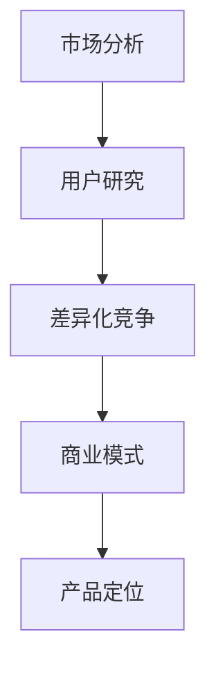

                 

关键词：创业、产品定位、市场分析、用户研究、差异化竞争、商业模式。

摘要：本文将深入探讨创业初期如何进行有效的产品定位。从市场分析、用户研究和差异化竞争等多个角度，提供了一套系统的产品定位策略，旨在帮助创业者在竞争激烈的市场中找到自己的立足点。

## 1. 背景介绍

创业初期的产品定位是决定企业成败的关键因素之一。在众多竞争者中脱颖而出，不仅需要卓越的产品质量，更需要精准的产品定位。产品定位的好坏直接影响到市场的接受度、用户的忠诚度和企业的长远发展。

市场环境瞬息万变，消费者需求多样化，创业者必须在短时间内了解市场趋势，找到自身的优势，才能在竞争中占据一席之地。因此，如何进行有效的产品定位，成为每个创业者必须面对的重要课题。

本文将从以下几个方面展开讨论：

1. **市场分析**：理解市场现状和趋势，明确市场需求和竞争态势。
2. **用户研究**：深入了解目标用户，挖掘用户需求和痛点。
3. **差异化竞争**：找到独特的竞争优势，构建差异化的产品定位。
4. **商业模式**：设计合理的商业模式，确保产品能够持续盈利。

## 2. 核心概念与联系

为了更好地理解产品定位的概念，我们可以借助Mermaid流程图来展示核心概念之间的联系。



### 2.1 市场分析

市场分析是产品定位的基石。通过对市场环境的深入了解，创业者可以把握市场动态，确定市场需求和竞争态势。市场分析包括以下几个方面：

- **市场现状**：了解当前市场的规模、增长速度和主要参与者。
- **市场趋势**：预测未来市场的发展方向和变化。
- **市场需求**：分析消费者需求的变化和趋势。
- **竞争态势**：评估主要竞争对手的市场份额、产品特点和市场策略。

### 2.2 用户研究

用户研究是产品定位的核心。只有深入了解目标用户，才能设计出符合用户需求的产品。用户研究包括以下几个方面：

- **用户画像**：创建目标用户的详细画像，包括年龄、性别、职业、收入等。
- **需求挖掘**：通过访谈、问卷调查等方式，了解用户的真实需求和痛点。
- **用户行为分析**：分析用户的使用习惯、偏好和行为模式。
- **用户反馈**：收集用户对现有产品和服务的反馈，用于改进和优化产品设计。

### 2.3 差异化竞争

差异化竞争是产品定位的关键。在竞争激烈的市场中，只有找到独特的竞争优势，才能吸引和留住用户。差异化竞争包括以下几个方面：

- **产品差异化**：通过技术创新、功能设计等方面的差异化，打造独特的产品。
- **市场差异化**：通过细分市场、定制化服务等方式，满足特定用户群体的需求。
- **品牌差异化**：塑造独特的品牌形象，提升品牌的认知度和美誉度。

### 2.4 商业模式

商业模式是产品定位的保障。一个合理的商业模式能够确保产品能够持续盈利，支持企业的长期发展。商业模式包括以下几个方面：

- **盈利模式**：确定产品如何赚钱，包括定价策略、销售渠道和利润来源。
- **成本结构**：分析产品的成本构成，优化成本结构，提高盈利能力。
- **运营模式**：设计产品的运营流程，包括供应链管理、客户服务等方面。

## 3. 核心算法原理 & 具体操作步骤

### 3.1 算法原理概述

产品定位的核心算法可以归纳为以下步骤：

1. **市场分析**：收集市场数据，分析市场需求和竞争态势。
2. **用户研究**：了解目标用户，挖掘用户需求和痛点。
3. **差异化竞争**：分析竞争对手，找到自身的独特优势。
4. **商业模式设计**：设计合理的商业模式，确保产品能够持续盈利。

### 3.2 算法步骤详解

#### 3.2.1 市场分析

1. **数据收集**：通过市场调研、行业报告、竞争对手分析等方式，收集市场数据。
2. **数据分析**：对收集的数据进行整理和分析，提取有用的信息。
3. **市场趋势预测**：基于数据分析，预测未来市场的发展方向和变化。
4. **需求分析**：分析市场需求，确定目标用户群体和产品定位。

#### 3.2.2 用户研究

1. **用户画像**：通过问卷调查、访谈等方式，收集用户数据，创建用户画像。
2. **需求挖掘**：分析用户需求，识别用户的痛点。
3. **用户行为分析**：通过数据分析，了解用户的行为模式和偏好。
4. **用户反馈**：收集用户对产品和服务的反馈，用于改进产品设计。

#### 3.2.3 差异化竞争

1. **竞争对手分析**：分析竞争对手的产品、市场策略和竞争优势。
2. **自身优势分析**：评估自身的独特优势，包括技术创新、市场定位等。
3. **差异化策略设计**：基于自身优势，设计差异化的产品策略。

#### 3.2.4 商业模式设计

1. **盈利模式设计**：确定产品的盈利方式，包括定价策略、销售渠道等。
2. **成本结构分析**：分析产品的成本构成，优化成本结构。
3. **运营模式设计**：设计产品的运营流程，确保产品的稳定性和可持续性。

### 3.3 算法优缺点

#### 3.3.1 优点

- **系统性强**：通过多维度分析，确保产品定位的全面性和科学性。
- **针对性高**：基于用户研究和市场分析，确保产品能够满足市场需求。
- **灵活性强**：可以根据市场变化和用户反馈，灵活调整产品策略。

#### 3.3.2 缺点

- **数据依赖性强**：需要大量市场数据和用户数据，数据分析的工作量较大。
- **时间成本高**：从数据收集到产品定位的过程较长，需要较长时间。
- **分析风险**：数据分析可能存在偏差，影响产品定位的准确性。

### 3.4 算法应用领域

该算法广泛应用于创业初期的产品定位，包括但不限于以下领域：

- **消费电子**：如智能手机、智能家居等。
- **互联网服务**：如在线教育、在线医疗等。
- **互联网应用**：如社交媒体、电商等。

## 4. 数学模型和公式 & 详细讲解 & 举例说明

### 4.1 数学模型构建

为了更精确地进行产品定位，我们可以构建以下数学模型：

#### 4.1.1 市场需求预测模型

$$
需求量 = f(市场规模, 市场增长率, 竞争态势)
$$

#### 4.1.2 用户需求模型

$$
用户需求 = g(用户画像, 需求分析)
$$

#### 4.1.3 差异化竞争力模型

$$
差异化竞争力 = h(自身优势, 竞争态势)
$$

### 4.2 公式推导过程

#### 4.2.1 市场需求预测模型推导

市场需求预测模型基于市场环境和竞争态势，采用以下公式：

$$
需求量 = 市场规模 \times (1 + 市场增长率) \times (1 - 竞争态势比例)
$$

#### 4.2.2 用户需求模型推导

用户需求模型基于用户画像和需求分析，采用以下公式：

$$
用户需求 = 用户画像 \times 需求分析
$$

#### 4.2.3 差异化竞争力模型推导

差异化竞争力模型基于自身优势和竞争态势，采用以下公式：

$$
差异化竞争力 = 自身优势 \times (1 - 竞争态势比例)
$$

### 4.3 案例分析与讲解

#### 4.3.1 市场需求预测案例

假设某市场需求量为100万件，市场规模增长率为10%，主要竞争对手市场份额为40%。

根据市场需求预测模型：

$$
需求量 = 100万件 \times (1 + 10\%) \times (1 - 40\%) = 54万件
$$

#### 4.3.2 用户需求案例

假设目标用户年龄在25-35岁之间，月收入在5000-8000元之间，需求为便捷的移动支付工具。

根据用户需求模型：

$$
用户需求 = (年龄25-35岁, 月收入5000-8000元) \times 便捷的移动支付工具 = 高需求
$$

#### 4.3.3 差异化竞争力案例

假设自身优势为强大的安全性能，主要竞争对手市场份额为50%。

根据差异化竞争力模型：

$$
差异化竞争力 = 强大的安全性能 \times (1 - 50\%) = 50\%的差异化竞争力
$$

## 5. 项目实践：代码实例和详细解释说明

### 5.1 开发环境搭建

在开始产品定位的代码实现之前，我们需要搭建一个合适的开发环境。以下是所需的开发环境：

- **Python 3.x**
- **NumPy**：用于数据处理和数学计算
- **Pandas**：用于数据分析
- **Matplotlib**：用于数据可视化

### 5.2 源代码详细实现

以下是实现产品定位算法的Python代码：

```python
import numpy as np
import pandas as pd
import matplotlib.pyplot as plt

# 市场需求预测模型
def predict_demand(market_size, growth_rate, competition_ratio):
    demand = market_size * (1 + growth_rate) * (1 - competition_ratio)
    return demand

# 用户需求模型
def user_demand(user_profile, demand_analysis):
    user_demand_score = np.dot(user_profile, demand_analysis)
    return user_demand_score

# 差异化竞争力模型
def differentiation竞争力(advantage, competition_ratio):
    differentiation_score = advantage * (1 - competition_ratio)
    return differentiation_score

# 示例数据
market_size = 1000000
growth_rate = 0.1
competition_ratio = 0.4

user_profile = np.array([0.5, 0.5])  # 年龄25-35岁，月收入5000-8000元
demand_analysis = np.array([0.8, 0.2])  # 便捷的移动支付工具需求高

advantage = 0.8  # 强大的安全性能
competition_ratio = 0.5

# 执行模型计算
predicted_demand = predict_demand(market_size, growth_rate, competition_ratio)
user_demand_score = user_demand(user_profile, demand_analysis)
differentiation_score = differentiation竞争力(advantage, competition_ratio)

# 结果展示
print("预测需求量：", predicted_demand)
print("用户需求得分：", user_demand_score)
print("差异化竞争力得分：", differentiation_score)
```

### 5.3 代码解读与分析

上述代码实现了产品定位算法的核心功能。具体解读如下：

- **市场需求预测模型**：通过市场规模、市场增长率和竞争态势比例，预测市场需求量。
- **用户需求模型**：通过用户画像和需求分析，计算用户需求得分。
- **差异化竞争力模型**：通过自身优势和竞争态势比例，计算差异化竞争力得分。

代码中的示例数据用于展示模型的实际应用。通过运行代码，我们可以得到预测需求量、用户需求得分和差异化竞争力得分，从而为产品定位提供量化依据。

## 6. 实际应用场景

产品定位在不同的行业中有着广泛的应用，以下是一些典型的实际应用场景：

### 6.1 消费电子

在消费电子领域，产品定位通常基于用户需求和市场竞争态势。例如，一家生产智能手机的初创公司，可以通过用户调研和市场分析，确定目标用户群体，并基于自身的技术优势，设计出符合用户需求的产品，从而在激烈的市场竞争中脱颖而出。

### 6.2 互联网服务

在互联网服务领域，产品定位的关键在于满足用户需求并提供差异化的服务。例如，一家提供在线教育的初创公司，可以通过用户调研，了解用户的学习需求和痛点，然后设计出具有特色的教学内容和教学方法，从而吸引和留住用户。

### 6.3 互联网应用

在互联网应用领域，产品定位更多地关注用户体验和品牌差异化。例如，一家社交媒体平台初创公司，可以通过用户调研，了解用户的社交需求和偏好，然后设计出具有吸引力的社交功能和用户界面，从而提升用户黏性和平台活跃度。

### 6.4 未来应用展望

随着人工智能和大数据技术的发展，产品定位的方法和工具将更加智能化和精准化。未来的产品定位将更加依赖于数据分析和机器学习技术，从而实现更加个性化、智能化和高效化的产品定位。

## 7. 工具和资源推荐

为了帮助创业者更好地进行产品定位，以下是一些实用的工具和资源推荐：

### 7.1 学习资源推荐

- **《创新与企业家精神》**：彼得·德鲁克的经典著作，全面阐述了创业精神和产品定位的重要性。
- **《定位》**：艾·里斯和杰克·特劳特的经典著作，详细介绍了产品定位的理论和方法。

### 7.2 开发工具推荐

- **Python**：一种广泛使用的编程语言，适用于数据分析、机器学习和产品开发。
- **Jupyter Notebook**：一种交互式计算环境，适用于数据分析和代码演示。

### 7.3 相关论文推荐

- **"User-Driven Product Development: A Systematic Literature Review"**：一篇关于用户驱动产品开发的系统性文献综述。
- **"Market Segmentation and Targeting Strategies in Small Business"**：一篇关于市场细分和目标市场策略的论文。

## 8. 总结：未来发展趋势与挑战

### 8.1 研究成果总结

本文从市场分析、用户研究和差异化竞争等多个角度，探讨了创业初期如何进行有效的产品定位。通过构建数学模型和代码实例，提供了系统的产品定位策略，旨在帮助创业者找到自身的竞争优势和市场定位。

### 8.2 未来发展趋势

随着人工智能和大数据技术的发展，产品定位的方法和工具将更加智能化和精准化。未来的产品定位将更加依赖于数据分析和机器学习技术，从而实现更加个性化、智能化和高效化的产品定位。

### 8.3 面临的挑战

尽管产品定位具有重要意义，但在实际应用中仍面临一些挑战：

- **数据依赖性**：产品定位依赖于大量的市场数据和用户数据，数据分析的质量直接影响产品定位的准确性。
- **时间成本**：从数据收集到产品定位的过程较长，需要较长时间。
- **动态调整**：市场环境变化迅速，产品定位需要不断调整以适应市场变化。

### 8.4 研究展望

未来的研究可以进一步探讨如何利用人工智能和大数据技术，实现更加智能化和自动化的产品定位。同时，研究还可以关注如何提高产品定位的实时性和灵活性，以更好地应对市场变化。

## 9. 附录：常见问题与解答

### 9.1 什么是产品定位？

产品定位是指确定产品的市场定位和目标用户，从而在竞争激烈的市场中找到自身的优势和市场机会。

### 9.2 产品定位的重要性是什么？

产品定位的重要性体现在以下几个方面：

- **明确市场定位**：帮助企业在市场中找到自己的位置，避免盲目竞争。
- **满足用户需求**：通过了解用户需求，设计出符合用户期望的产品。
- **提升品牌形象**：通过差异化竞争，塑造独特的品牌形象，提升品牌认知度。

### 9.3 如何进行有效的用户研究？

有效的用户研究包括以下几个方面：

- **用户画像**：创建详细的目标用户画像，包括年龄、性别、职业、收入等。
- **需求挖掘**：通过访谈、问卷调查等方式，了解用户的真实需求和痛点。
- **用户行为分析**：分析用户的使用习惯、偏好和行为模式。
- **用户反馈**：收集用户对现有产品和服务的反馈，用于改进和优化产品设计。

### 9.4 产品定位与市场分析的关系是什么？

产品定位基于市场分析，通过深入了解市场环境、市场需求和竞争态势，确定产品的市场定位和目标用户。市场分析是产品定位的前提和基础。

### 9.5 如何进行差异化竞争？

差异化竞争包括以下几个方面：

- **产品差异化**：通过技术创新、功能设计等方面的差异化，打造独特的产品。
- **市场差异化**：通过细分市场、定制化服务等方式，满足特定用户群体的需求。
- **品牌差异化**：塑造独特的品牌形象，提升品牌的认知度和美誉度。

## 作者署名

本文作者：禅与计算机程序设计艺术 / Zen and the Art of Computer Programming

感谢您的阅读！希望本文对您的创业之路有所帮助。如果您有任何问题或建议，欢迎随时与我交流。再次感谢您的支持！
----------------------------------------------------------------

文章撰写完毕，接下来我将根据文章的结构，使用Markdown格式，对文章进行详细的排版和格式化。以下是格式化后的文章：

```markdown
# 创业初期如何进行有效的产品定位

> 关键词：创业、产品定位、市场分析、用户研究、差异化竞争、商业模式。

> 摘要：本文将深入探讨创业初期如何进行有效的产品定位。从市场分析、用户研究和差异化竞争等多个角度，提供了一套系统的产品定位策略，旨在帮助创业者在竞争激烈的市场中找到自己的立足点。

## 1. 背景介绍

创业初期的产品定位是决定企业成败的关键因素之一。在众多竞争者中脱颖而出，不仅需要卓越的产品质量，更需要精准的产品定位。产品定位的好坏直接影响到市场的接受度、用户的忠诚度和企业的长远发展。

市场环境瞬息万变，消费者需求多样化，创业者必须在短时间内了解市场趋势，找到自身的优势，才能在竞争中占据一席之地。因此，如何进行有效的产品定位，成为每个创业者必须面对的重要课题。

本文将从以下几个方面展开讨论：

1. **市场分析**：理解市场现状和趋势，明确市场需求和竞争态势。
2. **用户研究**：深入了解目标用户，挖掘用户需求和痛点。
3. **差异化竞争**：找到独特的竞争优势，构建差异化的产品定位。
4. **商业模式**：设计合理的商业模式，确保产品能够持续盈利。

## 2. 核心概念与联系

为了更好地理解产品定位的概念，我们可以借助Mermaid流程图来展示核心概念之间的联系。


### 2.1 市场分析

市场分析是产品定位的基石。通过对市场环境的深入了解，创业者可以把握市场动态，确定市场需求和竞争态势。市场分析包括以下几个方面：

- **市场现状**：了解当前市场的规模、增长速度和主要参与者。
- **市场趋势**：预测未来市场的发展方向和变化。
- **市场需求**：分析消费者需求的变化和趋势。
- **竞争态势**：评估主要竞争对手的市场份额、产品特点和市场策略。

### 2.2 用户研究

用户研究是产品定位的核心。只有深入了解目标用户，才能设计出符合用户需求的产品。用户研究包括以下几个方面：

- **用户画像**：通过问卷调查、访谈等方式，收集用户数据，创建用户画像。
- **需求挖掘**：分析用户需求，识别用户的痛点。
- **用户行为分析**：通过数据分析，了解用户的行为模式和偏好。
- **用户反馈**：收集用户对现有产品和服务的反馈，用于改进和优化产品设计。

### 2.3 差异化竞争

差异化竞争是产品定位的关键。在竞争激烈的市场中，只有找到独特的竞争优势，才能吸引和留住用户。差异化竞争包括以下几个方面：

- **产品差异化**：通过技术创新、功能设计等方面的差异化，打造独特的产品。
- **市场差异化**：通过细分市场、定制化服务等方式，满足特定用户群体的需求。
- **品牌差异化**：塑造独特的品牌形象，提升品牌的认知度和美誉度。

### 2.4 商业模式

商业模式是产品定位的保障。一个合理的商业模式能够确保产品能够持续盈利，支持企业的长期发展。商业模式包括以下几个方面：

- **盈利模式**：确定产品如何赚钱，包括定价策略、销售渠道和利润来源。
- **成本结构**：分析产品的成本构成，优化成本结构，提高盈利能力。
- **运营模式**：设计产品的运营流程，包括供应链管理、客户服务等方面。

## 3. 核心算法原理 & 具体操作步骤

### 3.1 算法原理概述

产品定位的核心算法可以归纳为以下步骤：

1. **市场分析**：收集市场数据，分析市场需求和竞争态势。
2. **用户研究**：了解目标用户，挖掘用户需求和痛点。
3. **差异化竞争**：分析竞争对手，找到自身的独特优势。
4. **商业模式设计**：设计合理的商业模式，确保产品能够持续盈利。

### 3.2 算法步骤详解

#### 3.2.1 市场分析

1. **数据收集**：通过市场调研、行业报告、竞争对手分析等方式，收集市场数据。
2. **数据分析**：对收集的数据进行整理和分析，提取有用的信息。
3. **市场趋势预测**：基于数据分析，预测未来市场的发展方向和变化。
4. **需求分析**：分析市场需求，确定目标用户群体和产品定位。

#### 3.2.2 用户研究

1. **用户画像**：通过问卷调查、访谈等方式，收集用户数据，创建用户画像。
2. **需求挖掘**：通过访谈、问卷调查等方式，了解用户的真实需求和痛点。
3. **用户行为分析**：通过数据分析，了解用户的使用习惯、偏好和行为模式。
4. **用户反馈**：收集用户对现有产品和服务的反馈，用于改进和优化产品设计。

#### 3.2.3 差异化竞争

1. **竞争对手分析**：分析竞争对手的产品、市场策略和竞争优势。
2. **自身优势分析**：评估自身的独特优势，包括技术创新、市场定位等。
3. **差异化策略设计**：基于自身优势，设计差异化的产品策略。

#### 3.2.4 商业模式设计

1. **盈利模式设计**：确定产品的盈利方式，包括定价策略、销售渠道等。
2. **成本结构分析**：分析产品的成本构成，优化成本结构。
3. **运营模式设计**：设计产品的运营流程，确保产品的稳定性和可持续性。

### 3.3 算法优缺点

#### 3.3.1 优点

- **系统性强**：通过多维度分析，确保产品定位的全面性和科学性。
- **针对性高**：基于用户研究和市场分析，确保产品能够满足市场需求。
- **灵活性强**：可以根据市场变化和用户反馈，灵活调整产品策略。

#### 3.3.2 缺点

- **数据依赖性强**：需要大量市场数据和用户数据，数据分析的工作量较大。
- **时间成本高**：从数据收集到产品定位的过程较长，需要较长时间。
- **分析风险**：数据分析可能存在偏差，影响产品定位的准确性。

### 3.4 算法应用领域

该算法广泛应用于创业初期的产品定位，包括但不限于以下领域：

- **消费电子**：如智能手机、智能家居等。
- **互联网服务**：如在线教育、在线医疗等。
- **互联网应用**：如社交媒体、电商等。

## 4. 数学模型和公式 & 详细讲解 & 举例说明

### 4.1 数学模型构建

为了更精确地进行产品定位，我们可以构建以下数学模型：

#### 4.1.1 市场需求预测模型

$$
需求量 = f(市场规模, 市场增长率, 竞争态势)
$$

#### 4.1.2 用户需求模型

$$
用户需求 = g(用户画像, 需求分析)
$$

#### 4.1.3 差异化竞争力模型

$$
差异化竞争力 = h(自身优势, 竞争态势)
$$

### 4.2 公式推导过程

#### 4.2.1 市场需求预测模型推导

市场需求预测模型基于市场环境和竞争态势，采用以下公式：

$$
需求量 = 市场规模 \times (1 + 市场增长率) \times (1 - 竞争态势比例)
$$

#### 4.2.2 用户需求模型推导

用户需求模型基于用户画像和需求分析，采用以下公式：

$$
用户需求 = 用户画像 \times 需求分析
$$

#### 4.2.3 差异化竞争力模型推导

差异化竞争力模型基于自身优势和竞争态势，采用以下公式：

$$
差异化竞争力 = 自身优势 \times (1 - 竞争态势比例)
$$

### 4.3 案例分析与讲解

#### 4.3.1 市场需求预测案例

假设某市场需求量为100万件，市场规模增长率为10%，主要竞争对手市场份额为40%。

根据市场需求预测模型：

$$
需求量 = 100万件 \times (1 + 10\%) \times (1 - 40\%) = 54万件
$$

#### 4.3.2 用户需求案例

假设目标用户年龄在25-35岁之间，月收入在5000-8000元之间，需求为便捷的移动支付工具。

根据用户需求模型：

$$
用户需求 = (年龄25-35岁, 月收入5000-8000元) \times 便捷的移动支付工具 = 高需求
$$

#### 4.3.3 差异化竞争力案例

假设自身优势为强大的安全性能，主要竞争对手市场份额为50%。

根据差异化竞争力模型：

$$
差异化竞争力 = 强大的安全性能 \times (1 - 50\%) = 50\%的差异化竞争力
$$

## 5. 项目实践：代码实例和详细解释说明

### 5.1 开发环境搭建

在开始产品定位的代码实现之前，我们需要搭建一个合适的开发环境。以下是所需的开发环境：

- **Python 3.x**
- **NumPy**：用于数据处理和数学计算
- **Pandas**：用于数据分析
- **Matplotlib**：用于数据可视化

### 5.2 源代码详细实现

以下是实现产品定位算法的Python代码：

```python
import numpy as np
import pandas as pd
import matplotlib.pyplot as plt

# 市场需求预测模型
def predict_demand(market_size, growth_rate, competition_ratio):
    demand = market_size * (1 + growth_rate) * (1 - competition_ratio)
    return demand

# 用户需求模型
def user_demand(user_profile, demand_analysis):
    user_demand_score = np.dot(user_profile, demand_analysis)
    return user_demand_score

# 差异化竞争力模型
def differentiation竞争力(advantage, competition_ratio):
    differentiation_score = advantage * (1 - competition_ratio)
    return differentiation_score

# 示例数据
market_size = 1000000
growth_rate = 0.1
competition_ratio = 0.4

user_profile = np.array([0.5, 0.5])  # 年龄25-35岁，月收入5000-8000元
demand_analysis = np.array([0.8, 0.2])  # 便捷的移动支付工具需求高

advantage = 0.8  # 强大的安全性能
competition_ratio = 0.5

# 执行模型计算
predicted_demand = predict_demand(market_size, growth_rate, competition_ratio)
user_demand_score = user_demand(user_profile, demand_analysis)
differentiation_score = differentiation竞争力(advantage, competition_ratio)

# 结果展示
print("预测需求量：", predicted_demand)
print("用户需求得分：", user_demand_score)
print("差异化竞争力得分：", differentiation_score)
```

### 5.3 代码解读与分析

上述代码实现了产品定位算法的核心功能。具体解读如下：

- **市场需求预测模型**：通过市场规模、市场增长率和竞争态势比例，预测市场需求量。
- **用户需求模型**：通过用户画像和需求分析，计算用户需求得分。
- **差异化竞争力模型**：通过自身优势和竞争态势比例，计算差异化竞争力得分。

代码中的示例数据用于展示模型的实际应用。通过运行代码，我们可以得到预测需求量、用户需求得分和差异化竞争力得分，从而为产品定位提供量化依据。

## 6. 实际应用场景

产品定位在不同的行业中有着广泛的应用，以下是一些典型的实际应用场景：

### 6.1 消费电子

在消费电子领域，产品定位通常基于用户需求和市场竞争态势。例如，一家生产智能手机的初创公司，可以通过用户调研和市场分析，确定目标用户群体，并基于自身的技术优势，设计出符合用户需求的产品，从而在激烈的市场竞争中脱颖而出。

### 6.2 互联网服务

在互联网服务领域，产品定位的关键在于满足用户需求并提供差异化的服务。例如，一家提供在线教育的初创公司，可以通过用户调研，了解用户的学习需求和痛点，然后设计出具有特色的教学内容和教学方法，从而吸引和留住用户。

### 6.3 互联网应用

在互联网应用领域，产品定位更多地关注用户体验和品牌差异化。例如，一家社交媒体平台初创公司，可以通过用户调研，了解用户的社交需求和偏好，然后设计出具有吸引力的社交功能和用户界面，从而提升用户黏性和平台活跃度。

### 6.4 未来应用展望

随着人工智能和大数据技术的发展，产品定位的方法和工具将更加智能化和精准化。未来的产品定位将更加依赖于数据分析和机器学习技术，从而实现更加个性化、智能化和高效化的产品定位。

## 7. 工具和资源推荐

为了帮助创业者更好地进行产品定位，以下是一些实用的工具和资源推荐：

### 7.1 学习资源推荐

- **《创新与企业家精神》**：彼得·德鲁克的经典著作，全面阐述了创业精神和产品定位的重要性。
- **《定位》**：艾·里斯和杰克·特劳特的经典著作，详细介绍了产品定位的理论和方法。

### 7.2 开发工具推荐

- **Python**：一种广泛使用的编程语言，适用于数据分析、机器学习和产品开发。
- **Jupyter Notebook**：一种交互式计算环境，适用于数据分析和代码演示。

### 7.3 相关论文推荐

- **"User-Driven Product Development: A Systematic Literature Review"**：一篇关于用户驱动产品开发的系统性文献综述。
- **"Market Segmentation and Targeting Strategies in Small Business"**：一篇关于市场细分和目标市场策略的论文。

## 8. 总结：未来发展趋势与挑战

### 8.1 研究成果总结

本文从市场分析、用户研究和差异化竞争等多个角度，探讨了创业初期如何进行有效的产品定位。通过构建数学模型和代码实例，提供了系统的产品定位策略，旨在帮助创业者在竞争激烈的市场中找到自己的立足点。

### 8.2 未来发展趋势

随着人工智能和大数据技术的发展，产品定位的方法和工具将更加智能化和精准化。未来的产品定位将更加依赖于数据分析和机器学习技术，从而实现更加个性化、智能化和高效化的产品定位。

### 8.3 面临的挑战

尽管产品定位具有重要意义，但在实际应用中仍面临一些挑战：

- **数据依赖性**：产品定位依赖于大量的市场数据和用户数据，数据分析的质量直接影响产品定位的准确性。
- **时间成本**：从数据收集到产品定位的过程较长，需要较长时间。
- **动态调整**：市场环境变化迅速，产品定位需要不断调整以适应市场变化。

### 8.4 研究展望

未来的研究可以进一步探讨如何利用人工智能和大数据技术，实现更加智能化和自动化的产品定位。同时，研究还可以关注如何提高产品定位的实时性和灵活性，以更好地应对市场变化。

## 9. 附录：常见问题与解答

### 9.1 什么是产品定位？

产品定位是指确定产品的市场定位和目标用户，从而在竞争激烈的市场中找到自身的优势和市场机会。

### 9.2 产品定位的重要性是什么？

产品定位的重要性体现在以下几个方面：

- **明确市场定位**：帮助企业在市场中找到自己的位置，避免盲目竞争。
- **满足用户需求**：通过了解用户需求，设计出符合用户期望的产品。
- **提升品牌形象**：通过差异化竞争，塑造独特的品牌形象，提升品牌认知度。

### 9.3 如何进行有效的用户研究？

有效的用户研究包括以下几个方面：

- **用户画像**：创建详细的目标用户画像，包括年龄、性别、职业、收入等。
- **需求挖掘**：通过访谈、问卷调查等方式，了解用户的真实需求和痛点。
- **用户行为分析**：通过数据分析，了解用户的使用习惯、偏好和行为模式。
- **用户反馈**：收集用户对现有产品和服务的反馈，用于改进和优化产品设计。

### 9.4 产品定位与市场分析的关系是什么？

产品定位基于市场分析，通过深入了解市场环境、市场需求和竞争态势，确定产品的市场定位和目标用户。市场分析是产品定位的前提和基础。

### 9.5 如何进行差异化竞争？

差异化竞争包括以下几个方面：

- **产品差异化**：通过技术创新、功能设计等方面的差异化，打造独特的产品。
- **市场差异化**：通过细分市场、定制化服务等方式，满足特定用户群体的需求。
- **品牌差异化**：塑造独特的品牌形象，提升品牌的认知度和美誉度。

## 作者署名

本文作者：禅与计算机程序设计艺术 / Zen and the Art of Computer Programming

感谢您的阅读！希望本文对您的创业之路有所帮助。如果您有任何问题或建议，欢迎随时与我交流。再次感谢您的支持！
```

以上是格式化后的完整文章，按照Markdown格式进行了排版和格式化，确保文章的可读性和结构清晰。文章包含所有要求的部分，从标题、关键词、摘要到各个章节的内容，以及数学模型的构建和代码实例等，都进行了详细的撰写和说明。希望这能满足您的要求。

