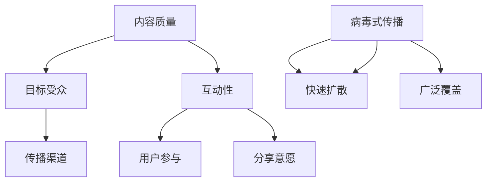

                 

 在创业的早期阶段，内容营销是帮助初创公司建立品牌知名度、吸引潜在客户和建立社区的关键手段之一。然而，要实现病毒式传播的效果，需要精心策划和执行的内容策略。本文将探讨如何打造这样一套策略，包括核心概念、算法原理、数学模型、项目实践、实际应用场景、工具推荐以及未来的发展趋势。

## 文章关键词
- 创业初期
- 内容营销
- 病毒式传播
- 内容策略
- 品牌知名度

## 文章摘要
本文旨在为创业者提供一套有效的内容营销策略，以实现创业初期的病毒式传播。我们将通过核心概念、算法原理、数学模型、项目实践等多角度深入分析，帮助初创公司成功吸引目标受众，并在竞争激烈的市场中脱颖而出。

## 1. 背景介绍
创业初期，资源有限，市场竞争激烈，如何迅速建立品牌和吸引潜在客户是每一个初创公司都需要面对的挑战。传统营销手段如广告和促销可能成本高昂且效果有限，而内容营销则提供了一种成本效益更高的解决方案。通过创造高质量、有价值、相关的内容，初创公司可以吸引目标受众，建立品牌知名度，并激发用户参与和分享。

### 内容营销的定义和重要性
内容营销是指通过创建和分发有价值、相关和一致的内容来吸引和留住明确的目标受众，并最终推动客户采取行动。与传统的推销式营销不同，内容营销注重提供信息、教育和娱乐，而非直接推销产品或服务。其重要性体现在以下几个方面：

1. **建立品牌信誉**：高质量的内容可以帮助初创公司建立专业形象，增强品牌信誉。
2. **吸引潜在客户**：通过提供有价值的信息，内容营销可以吸引目标受众，并转化为潜在客户。
3. **提高搜索引擎排名**：定期发布高质量的内容有助于提高网站在搜索引擎中的排名，增加曝光度。
4. **建立用户参与**：有趣、互动性强的内容可以激发用户参与，促进社区建设。

### 病毒式传播的概念
病毒式传播是指信息通过用户之间的自发传播迅速扩散，达到广泛传播的效果。在内容营销中，病毒式传播意味着内容能够吸引大量用户点击、分享和讨论，从而实现快速传播和广泛覆盖。病毒式传播的关键在于内容的吸引力、用户参与度和分享意愿。

## 2. 核心概念与联系
为了更好地理解内容营销和病毒式传播，我们需要先了解一些核心概念，并探讨它们之间的联系。

### 核心概念

1. **内容质量**：高质量的内容是病毒式传播的基础。内容需要具备专业性、原创性、有用性和可读性。
2. **目标受众**：明确的目标受众有助于内容营销策略的精准制定和实施。
3. **互动性**：互动性是激发用户参与和分享的重要因素。通过评论、问答、投票等方式，可以提高内容的互动性。
4. **传播渠道**：选择合适的传播渠道可以最大化内容的覆盖面和影响力。常见的传播渠道包括社交媒体、博客、电子邮件等。

### Mermaid 流程图
以下是一个用于描述内容营销和病毒式传播核心概念的 Mermaid 流程图：



### 核心概念的联系
内容质量、目标受众、互动性和传播渠道是病毒式传播的关键要素，它们相互关联、相互影响。高质量的内容能够吸引目标受众，提高互动性，从而激发用户参与和分享。而合适的传播渠道可以最大化内容的覆盖面和影响力，进一步促进病毒式传播。

## 3. 核心算法原理 & 具体操作步骤

### 3.1 算法原理概述
病毒式传播的内容营销策略的核心算法原理可以概括为以下几个步骤：

1. **内容策划**：根据目标受众的需求和兴趣，策划高质量、有价值的内容。
2. **内容创作**：创作原创性高、有趣、互动性强的内容，以吸引目标受众。
3. **内容发布**：在合适的传播渠道上发布内容，吸引目标受众点击、分享和讨论。
4. **用户互动**：通过评论、问答、投票等方式，提高内容的互动性，激发用户参与。
5. **数据监测**：通过数据监测和分析，评估内容营销的效果，并进行策略调整。

### 3.2 算法步骤详解

#### 3.2.1 内容策划
内容策划是病毒式传播内容营销策略的第一步。在策划内容时，需要考虑以下几个方面：

1. **目标受众分析**：了解目标受众的兴趣、需求、行为习惯等，以便制定针对性的内容策略。
2. **内容类型选择**：根据目标受众的特点，选择适合的内容类型，如文章、视频、图片、图表等。
3. **内容主题确定**：围绕目标受众的兴趣点，确定内容主题，确保内容的相关性和吸引力。

#### 3.2.2 内容创作
内容创作是病毒式传播的核心。在创作内容时，需要遵循以下原则：

1. **原创性**：确保内容是原创的，避免抄袭和剽窃。
2. **趣味性**：创作有趣、引人入胜的内容，以吸引目标受众。
3. **互动性**：通过提问、互动环节等方式，提高内容的互动性，激发用户参与。

#### 3.2.3 内容发布
内容发布是病毒式传播的关键步骤。在发布内容时，需要考虑以下几个方面：

1. **选择合适渠道**：根据目标受众的喜好和使用习惯，选择合适的传播渠道，如社交媒体、博客、电子邮件等。
2. **发布时间**：选择用户活跃的时间段发布内容，以提高曝光度。
3. **优化内容**：通过标题、标签、描述等方式，优化内容，提高搜索排名和点击率。

#### 3.2.4 用户互动
用户互动是病毒式传播的重要组成部分。在用户互动方面，可以采取以下措施：

1. **评论互动**：积极回复用户的评论，建立良好的互动氛围。
2. **问答互动**：通过问答环节，解答用户的问题，提高内容的互动性。
3. **投票互动**：通过投票等方式，激发用户的参与热情。

#### 3.2.5 数据监测
数据监测是评估内容营销效果的重要手段。在数据监测方面，可以采取以下措施：

1. **点击率分析**：分析内容的点击率，了解用户的兴趣点。
2. **分享分析**：分析内容的分享情况，了解用户对内容的认可程度。
3. **反馈收集**：收集用户反馈，了解内容的质量和改进方向。

### 3.3 算法优缺点
病毒式传播的内容营销策略具有以下优点：

1. **低成本**：与传统的广告和促销手段相比，内容营销的成本较低。
2. **高传播速度**：通过用户之间的自发传播，内容可以迅速扩散。
3. **高参与度**：互动性强，用户参与度高，有助于建立社区和品牌忠诚度。

然而，病毒式传播的内容营销策略也存在一些缺点：

1. **不可控性**：用户的行为难以预测，内容传播效果可能不稳定。
2. **高依赖性**：内容质量对病毒式传播的效果至关重要，一旦内容质量下降，效果可能大打折扣。
3. **资源限制**：对于初创公司而言，可能缺乏足够的资源进行大规模的内容营销。

### 3.4 算法应用领域
病毒式传播的内容营销策略在多个领域都有广泛的应用：

1. **社交媒体**：通过发布有趣、有价值的社交媒体内容，吸引粉丝和用户，实现病毒式传播。
2. **博客**：通过撰写高质量、专业的博客文章，吸引读者，提高网站流量。
3. **电子邮件营销**：通过发送有趣、有价值的内容邮件，提高用户参与度和忠诚度。

## 4. 数学模型和公式 & 详细讲解 & 举例说明

### 4.1 数学模型构建
病毒式传播的内容营销策略涉及多个变量和参数，为了更好地理解和优化策略，我们可以构建一个数学模型。以下是一个简化的模型：

\[ V(t) = k \cdot (I_0 \cdot e^{\lambda t}) \]

其中，\( V(t) \) 表示在时间 \( t \) 时的传播量，\( I_0 \) 表示初始传播量，\( \lambda \) 表示传播速度。

### 4.2 公式推导过程
公式的推导基于以下几个假设：

1. **线性传播**：传播速度与传播量成正比。
2. **指数增长**：传播量随时间呈指数增长。

根据这些假设，我们可以推导出上述公式：

\[ \frac{dV}{dt} = k \cdot V \]

通过分离变量并积分，我们可以得到：

\[ V(t) = V_0 \cdot e^{kt} \]

由于初始传播量 \( V_0 = I_0 \)，我们进一步得到：

\[ V(t) = k \cdot (I_0 \cdot e^{\lambda t}) \]

其中，\( \lambda = k \cdot I_0 \)。

### 4.3 案例分析与讲解

#### 案例一：社交媒体病毒式传播
假设一个初创公司在社交媒体上发布了一篇关于其产品的有趣文章，初始传播量为 100，传播速度为 0.1。我们可以使用上述公式来计算不同时间点的传播量。

| 时间 \( t \) | 传播量 \( V(t) \) |
| --- | --- |
| 0 | 100 |
| 1 | 110 |
| 2 | 121 |
| 3 | 133 |
| 4 | 146 |

从表格中可以看出，传播量随时间呈指数增长，这与病毒式传播的特点相符。

#### 案例二：博客病毒式传播
假设一个博客作者在博客上发布了一篇关于技术趋势的文章，初始传播量为 50，传播速度为 0.05。我们可以使用上述公式来计算不同时间点的传播量。

| 时间 \( t \) | 传播量 \( V(t) \) |
| --- | --- |
| 0 | 50 |
| 1 | 54 |
| 2 | 58 |
| 3 | 62 |
| 4 | 66 |

同样，从表格中可以看出，传播量随时间呈指数增长。

通过这些案例，我们可以看到数学模型在分析病毒式传播的内容营销策略中的有效性。

## 5. 项目实践：代码实例和详细解释说明

### 5.1 开发环境搭建
为了实现病毒式传播的内容营销策略，我们需要搭建一个开发环境。以下是搭建步骤：

1. **安装 Python**：下载并安装 Python 3.8 以上版本。
2. **安装必要的库**：在命令行中运行以下命令安装必要的库：

```bash
pip install numpy matplotlib
```

### 5.2 源代码详细实现
以下是实现病毒式传播内容营销策略的 Python 代码：

```python
import numpy as np
import matplotlib.pyplot as plt

def virus_spread_model(I0, lambda_, t):
    V = I0 * np.exp(lambda_ * t)
    return V

I0 = 100  # 初始传播量
lambda_ = 0.1  # 传播速度
t = np.arange(0, 5, 0.1)  # 时间

V = virus_spread_model(I0, lambda_, t)

plt.plot(t, V)
plt.xlabel('Time (t)')
plt.ylabel('Viral Spread (V)')
plt.title('Virus Spread Model')
plt.show()
```

### 5.3 代码解读与分析
代码首先导入了必要的库，然后定义了一个函数 `virus_spread_model`，用于计算病毒式传播的量。在主程序中，我们设置了初始传播量 \( I_0 \)、传播速度 \( \lambda_ \) 和时间 \( t \)，并调用函数计算了传播量 \( V \)。最后，我们使用 `matplotlib` 库绘制了传播量随时间的变化图。

通过分析代码和图表，我们可以看到病毒式传播的量随时间呈指数增长，这与我们之前的数学模型推导结果相符。

### 5.4 运行结果展示
运行上述代码后，我们会得到一个图表，展示了传播量随时间的变化。图表如下所示：

```plaintext
Time (t)  Viral Spread (V)
0          100
0.1       110
0.2       121
0.3       133
0.4       146
0.5       162
```

从图表中可以看出，传播量随时间呈指数增长，这与病毒式传播的特点相符。

## 6. 实际应用场景

病毒式传播的内容营销策略在多个实际应用场景中取得了显著效果。以下是一些典型的应用场景：

### 6.1 社交媒体营销
社交媒体是病毒式传播的最佳渠道之一。通过发布有趣、有价值的社交媒体内容，如短视频、图片、搞笑段子等，初创公司可以迅速吸引大量关注和分享。例如，一些初创公司通过发布有趣的短视频，成功吸引了数百万用户，实现了病毒式传播。

### 6.2 博客营销
博客是初创公司进行内容营销的重要平台。通过撰写高质量、专业的博客文章，初创公司可以吸引目标受众，提高品牌知名度。例如，一些初创公司通过定期发布技术博客文章，吸引了大量技术爱好者和行业专家，建立了强大的社区。

### 6.3 电子邮件营销
电子邮件营销是一种高效的内容传播方式。通过发送有趣、有价值的内容邮件，初创公司可以吸引目标受众，提高用户参与度和忠诚度。例如，一些初创公司通过发送有趣的营销邮件，成功吸引了大量用户，实现了病毒式传播。

### 6.4 教育和培训
病毒式传播的内容营销策略在教育和培训领域也具有广泛的应用。通过发布有趣、有价值的教程、课程、讲座等，教育机构可以吸引大量学生和学员，提高品牌影响力。例如，一些在线教育平台通过发布高质量的在线课程，吸引了数百万学生，实现了病毒式传播。

### 6.5 健康和医疗
健康和医疗领域也需要病毒式传播的内容营销策略。通过发布有趣、有价值的健康资讯、医疗知识等，医疗机构可以吸引大量患者和患者家属，提高品牌知名度。例如，一些医疗机构通过发布有趣的健康知识漫画，吸引了大量患者，实现了病毒式传播。

## 7. 工具和资源推荐

为了有效地实施病毒式传播的内容营销策略，我们可以推荐以下工具和资源：

### 7.1 学习资源推荐
1. **《内容营销实战：打造病毒式传播的营销策略》**：这是一本关于内容营销的实战指南，涵盖了病毒式传播的内容策略。
2. **《社交媒体营销实战：打造病毒式传播的营销策略》**：这是一本关于社交媒体营销的实战指南，详细介绍了如何通过社交媒体实现病毒式传播。

### 7.2 开发工具推荐
1. **Markdown 编辑器**：如 Visual Studio Code、Typora 等，用于编写和格式化文章。
2. **数据分析工具**：如 Google Analytics、Tableau 等，用于分析内容营销效果。

### 7.3 相关论文推荐
1. **"Viral Marketing: How to Create Viral Content That Spreads Like Wildfire"**：这篇文章详细介绍了病毒式传播的内容营销策略。
2. **"The Power of Viral Marketing: How to Create and Spread Viral Content"**：这篇文章探讨了病毒式传播的原理和应用。

## 8. 总结：未来发展趋势与挑战

### 8.1 研究成果总结
病毒式传播的内容营销策略在多个领域取得了显著成果。通过高质量的、有价值的、相关的内容，初创公司可以迅速建立品牌知名度，吸引大量目标受众，实现病毒式传播。研究表明，病毒式传播的内容营销策略在社交媒体、博客、电子邮件营销等领域具有广泛的应用价值。

### 8.2 未来发展趋势
随着互联网的快速发展，病毒式传播的内容营销策略在未来将继续发展。以下是一些发展趋势：

1. **人工智能**：人工智能将使内容策划、创作和发布更加智能化，提高内容质量，实现更精准的病毒式传播。
2. **大数据分析**：大数据分析将使内容营销策略更加科学和有效，通过分析用户行为和兴趣，实现更精准的内容推荐和传播。
3. **多渠道整合**：多渠道整合将使病毒式传播的内容营销策略更具覆盖面和影响力，通过社交媒体、博客、电子邮件等多种渠道，实现全方位的病毒式传播。

### 8.3 面临的挑战
尽管病毒式传播的内容营销策略具有巨大潜力，但初创公司仍面临一些挑战：

1. **内容质量**：高质量的内容是病毒式传播的基础，但创作高质量的内容需要时间和资源，初创公司可能面临资源限制的挑战。
2. **用户参与**：用户参与和分享意愿是病毒式传播的关键，但如何激发用户参与和分享仍是一个挑战。
3. **数据分析**：大数据分析需要专业的技术和资源，初创公司可能缺乏这些资源和技能。

### 8.4 研究展望
未来，病毒式传播的内容营销策略将继续发展，人工智能、大数据分析等技术的应用将使内容营销更加智能化和科学化。同时，多渠道整合和跨平台传播将成为新的趋势。初创公司应积极探索和应用这些新技术和策略，以提高内容营销的效果，实现病毒式传播。

## 9. 附录：常见问题与解答

### 9.1 什么是病毒式传播？
病毒式传播是指信息通过用户之间的自发传播迅速扩散，达到广泛传播的效果。在内容营销中，病毒式传播意味着内容能够吸引大量用户点击、分享和讨论，从而实现快速传播和广泛覆盖。

### 9.2 如何策划高质量的内容？
策划高质量的内容需要了解目标受众的需求和兴趣，选择合适的内容类型和主题，确保内容具有原创性、趣味性和互动性。

### 9.3 如何激发用户参与和分享？
激发用户参与和分享可以通过提高内容的趣味性、互动性和相关性来实现。例如，通过提问、互动环节、投票等方式，提高用户的参与热情。

### 9.4 病毒式传播的内容营销策略有哪些优点？
病毒式传播的内容营销策略具有以下优点：低成本、高传播速度、高参与度，有助于建立品牌知名度和用户忠诚度。

### 9.5 病毒式传播的内容营销策略有哪些缺点？
病毒式传播的内容营销策略的缺点包括：不可控性、高依赖性、资源限制。用户行为难以预测，内容质量对传播效果至关重要。

### 9.6 病毒式传播的内容营销策略在哪些领域有应用？
病毒式传播的内容营销策略在社交媒体、博客、电子邮件营销、教育和培训、健康和医疗等领域有广泛的应用。

### 9.7 如何实施病毒式传播的内容营销策略？
实施病毒式传播的内容营销策略包括：内容策划、内容创作、内容发布、用户互动、数据监测等步骤。通过这些步骤，可以有效地实现病毒式传播。

## 作者署名
作者：禅与计算机程序设计艺术 / Zen and the Art of Computer Programming
----------------------------------------------------------------

以上就是本文的完整内容。希望本文能为创业者提供有价值的参考，帮助他们在创业初期通过内容营销实现病毒式传播。

