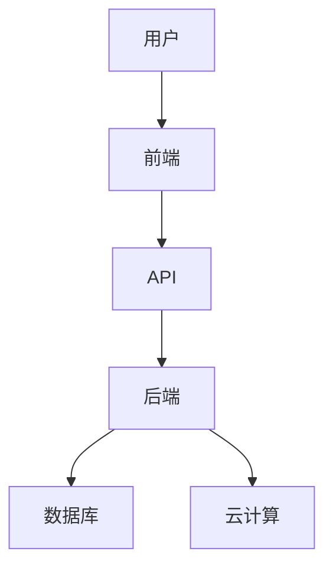

                 

关键词：创业型互联网医疗平台、技术架构、API设计、用户体验、数据安全

摘要：本文将探讨创业型互联网医疗平台的搭建方案，从技术架构、API设计、用户体验、数据安全等方面进行分析，为创业者提供切实可行的指导和参考。

## 1. 背景介绍

随着互联网技术的飞速发展，医疗健康行业也迎来了前所未有的变革。互联网医疗平台凭借其便捷、高效的特点，受到了广大用户的青睐。对于创业者而言，搭建一个高效、可靠的互联网医疗平台，不仅需要理解医疗行业的特点，还需要掌握先进的技术和设计理念。

本文将从以下几个方面展开讨论：

1. **技术架构**：探讨适合互联网医疗平台的技术架构，包括前端、后端、数据库、云计算等。
2. **API设计**：分析如何设计高效、安全的API，以满足医疗数据传输的需求。
3. **用户体验**：研究如何通过良好的用户体验设计，提升用户满意度和平台粘性。
4. **数据安全**：介绍如何保障医疗数据的安全性和隐私性。

## 2. 核心概念与联系

为了更好地理解互联网医疗平台的搭建，我们需要先了解几个核心概念：

- **前端技术**：包括HTML、CSS、JavaScript等，用于构建用户界面。
- **后端技术**：如Node.js、Java、Python等，用于处理业务逻辑和数据存储。
- **数据库**：如MySQL、MongoDB等，用于存储医疗数据。
- **云计算**：如AWS、阿里云等，提供强大的计算和存储能力。

下面是一个简化的Mermaid流程图，展示互联网医疗平台的核心组成部分和它们之间的联系：



### 2.1 前端技术

前端技术负责与用户直接交互，是用户与平台之间的桥梁。一个优秀的前端设计不仅需要美观，还需要具备良好的用户体验和性能。

- **HTML**：用于构建网页的结构。
- **CSS**：用于美化网页。
- **JavaScript**：用于实现网页的动态效果和用户交互。

### 2.2 后端技术

后端技术负责处理业务逻辑和数据存储，是互联网医疗平台的核心。常见的后端技术包括：

- **Node.js**：基于JavaScript的运行环境，适合构建高性能的Web应用程序。
- **Java**：是一种成熟的编程语言，广泛用于企业级应用开发。
- **Python**：具有丰富的库和框架，适合快速开发。

### 2.3 数据库

数据库用于存储和管理医疗数据。根据应用场景的不同，可以选择不同的数据库：

- **关系型数据库**：如MySQL、PostgreSQL，适合存储结构化数据。
- **非关系型数据库**：如MongoDB、Cassandra，适合存储大规模的、非结构化数据。

### 2.4 云计算

云计算提供了强大的计算和存储能力，使得互联网医疗平台可以轻松应对高并发、大数据的需求。常见的云计算平台包括：

- **AWS**：提供丰富的云服务和工具。
- **阿里云**：在中国拥有广泛的用户基础。

## 3. 核心算法原理 & 具体操作步骤

### 3.1 算法原理概述

互联网医疗平台的核心算法主要包括：

- **数据加密算法**：用于保障医疗数据的安全性。
- **数据压缩算法**：用于优化数据传输效率。
- **机器学习算法**：用于分析医疗数据，提供个性化服务。

### 3.2 算法步骤详解

#### 3.2.1 数据加密算法

数据加密算法的步骤通常包括：

1. **选择加密算法**：如AES、RSA等。
2. **生成密钥**：用于加密和解密数据。
3. **加密数据**：将明文数据转换为密文。
4. **解密数据**：将密文数据转换为明文。

#### 3.2.2 数据压缩算法

数据压缩算法的步骤通常包括：

1. **数据预处理**：如去除空格、换行等。
2. **选择压缩算法**：如Huffman编码、LZ77等。
3. **压缩数据**：将数据转换为更小的形式。
4. **解压缩数据**：将压缩后的数据还原为原始数据。

#### 3.2.3 机器学习算法

机器学习算法的步骤通常包括：

1. **数据收集**：收集医疗数据。
2. **数据预处理**：如数据清洗、归一化等。
3. **模型选择**：选择合适的机器学习模型。
4. **模型训练**：使用训练数据训练模型。
5. **模型评估**：评估模型性能。
6. **模型部署**：将训练好的模型部署到生产环境。

### 3.3 算法优缺点

#### 数据加密算法

- 优点：保障数据安全性，防止数据泄露。
- 缺点：加密和解密过程需要消耗计算资源，可能影响性能。

#### 数据压缩算法

- 优点：优化数据传输效率，降低带宽消耗。
- 缺点：压缩和解压过程需要消耗计算资源，可能影响性能。

#### 机器学习算法

- 优点：能够自动分析大量数据，提供个性化服务。
- 缺点：需要大量训练数据，模型训练和部署过程复杂。

### 3.4 算法应用领域

- **数据加密算法**：广泛应用于医疗数据存储和传输领域。
- **数据压缩算法**：广泛应用于医疗数据传输和存储领域。
- **机器学习算法**：广泛应用于医疗数据分析、诊断和预测领域。

## 4. 数学模型和公式 & 详细讲解 & 举例说明

### 4.1 数学模型构建

在互联网医疗平台中，常用的数学模型包括：

- **线性回归模型**：用于预测医疗数据。
- **神经网络模型**：用于分析和预测医疗数据。
- **决策树模型**：用于分类和预测医疗数据。

### 4.2 公式推导过程

以线性回归模型为例，其基本公式为：

\[ y = \beta_0 + \beta_1x \]

其中，\( y \) 是因变量，\( x \) 是自变量，\( \beta_0 \) 和 \( \beta_1 \) 是模型参数。

### 4.3 案例分析与讲解

#### 案例一：线性回归模型在医疗数据预测中的应用

假设我们要预测某种疾病的发病概率，使用线性回归模型进行分析。首先，我们需要收集相关数据，如患者的年龄、性别、血压、血糖等。然后，使用线性回归模型进行训练，得到模型参数 \( \beta_0 \) 和 \( \beta_1 \)。最后，使用训练好的模型进行预测，输入患者的特征数据，得到发病概率。

#### 案例二：神经网络模型在医疗数据分析中的应用

假设我们要分析大量医疗数据，以发现潜在的医疗问题。使用神经网络模型进行分析，首先需要收集医疗数据，然后对数据预处理，包括数据清洗、归一化等。接着，选择合适的神经网络模型，如卷积神经网络（CNN）或循环神经网络（RNN），对数据进行训练。最后，使用训练好的模型对新的医疗数据进行分析，提取出关键信息。

## 5. 项目实践：代码实例和详细解释说明

### 5.1 开发环境搭建

在搭建互联网医疗平台之前，我们需要先搭建开发环境。以下是一个简单的步骤：

1. 安装Node.js。
2. 安装MySQL。
3. 安装Python。
4. 安装相关库和框架，如React、Django等。

### 5.2 源代码详细实现

以下是一个简单的示例代码，用于实现一个简单的互联网医疗平台。

```javascript
// 前端代码示例（使用React）
import React from 'react';

function App() {
  return (
    <div>
      <h1>互联网医疗平台</h1>
      <p>欢迎使用我们的平台。</p>
    </div>
  );
}

export default App;

// 后端代码示例（使用Node.js）
const express = require('express');
const app = express();

app.get('/', (req, res) => {
  res.send('欢迎使用我们的互联网医疗平台！');
});

const PORT = process.env.PORT || 3000;
app.listen(PORT, () => {
  console.log(`服务器正在运行，端口：${PORT}`);
});
```

### 5.3 代码解读与分析

以上代码是一个简单的互联网医疗平台示例。前端部分使用React框架构建，后端部分使用Node.js框架实现。前端代码定义了一个名为`App`的组件，用于渲染页面。后端代码使用Express框架创建了一个HTTP服务器，用于处理HTTP请求。

### 5.4 运行结果展示

运行以上代码，打开浏览器访问 `http://localhost:3000`，可以看到一个简单的互联网医疗平台页面。

## 6. 实际应用场景

### 6.1 患者管理

互联网医疗平台可以帮助医院和诊所管理患者信息，包括患者的基本信息、就诊记录、检查报告等。

### 6.2 医疗咨询

患者可以通过互联网医疗平台向医生咨询问题，获取专业的医疗建议。

### 6.3 医疗数据分析

通过互联网医疗平台，医生可以收集和分析大量医疗数据，为临床决策提供依据。

### 6.4 健康管理

互联网医疗平台可以为用户提供健康数据监测、健康建议等服务，帮助用户管理健康。

## 7. 工具和资源推荐

### 7.1 学习资源推荐

- **《互联网医疗平台开发实战》**：适合初学者入门。
- **《深度学习与医疗大数据》**：适合对机器学习在医疗领域应用感兴趣的学习者。

### 7.2 开发工具推荐

- **React**：用于构建前端界面。
- **Node.js**：用于构建后端服务。
- **MySQL**：用于存储和管理数据。

### 7.3 相关论文推荐

- **"Deep Learning for Healthcare: A Survey"**：对深度学习在医疗领域的应用进行了详细综述。
- **"Healthcare Data Mining: A Survey"**：对医疗数据挖掘的研究进行了全面回顾。

## 8. 总结：未来发展趋势与挑战

### 8.1 研究成果总结

本文总结了创业型互联网医疗平台的搭建方案，从技术架构、API设计、用户体验、数据安全等方面进行了深入分析。

### 8.2 未来发展趋势

随着人工智能、大数据等技术的发展，互联网医疗平台将更加智能化、个性化。

### 8.3 面临的挑战

数据安全、隐私保护、用户体验等方面仍然是互联网医疗平台面临的重大挑战。

### 8.4 研究展望

未来，互联网医疗平台将在个性化医疗、远程诊疗等方面取得更多突破。

## 9. 附录：常见问题与解答

### 9.1 互联网医疗平台的技术架构是什么？

互联网医疗平台的技术架构通常包括前端技术（如React、Vue.js等）、后端技术（如Node.js、Java等）、数据库（如MySQL、MongoDB等）和云计算（如AWS、阿里云等）。

### 9.2 如何保证医疗数据的安全？

可以通过数据加密、访问控制、安全审计等措施来保障医疗数据的安全。

### 9.3 互联网医疗平台的用户体验设计要注意什么？

用户体验设计要注意简洁性、易用性和可访问性，确保用户能够轻松、高效地使用平台。

### 9.4 互联网医疗平台在机器学习方面有哪些应用？

互联网医疗平台可以在疾病预测、诊断辅助、治疗方案推荐等方面应用机器学习技术。

[END]

# 创业型互联网医疗平台搭建方案

作者：禅与计算机程序设计艺术 / Zen and the Art of Computer Programming

