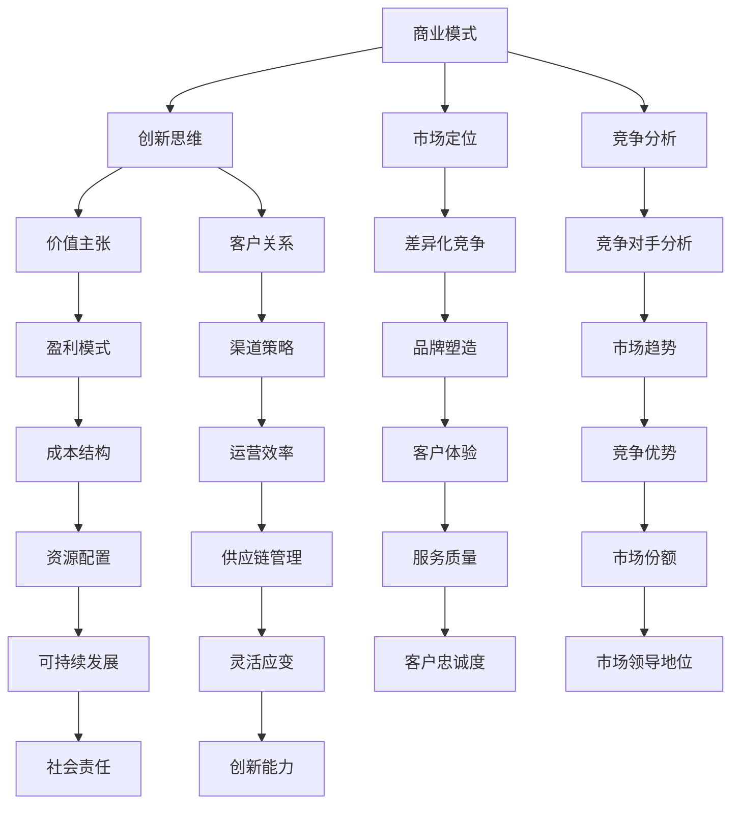

                 

关键词：商业模式创新、创业策略、商业模型、市场定位、竞争分析

> 摘要：本文旨在探讨创业者在面对激烈市场竞争时，如何通过商业模式创新来实现差异化竞争，提升企业竞争力。通过系统化的方法，帮助创业者识别并构建适应市场需求的创新商业模式，实现企业的可持续发展。

## 1. 背景介绍

在当今快速变化的市场环境中，商业模式创新已成为企业赢得竞争优势的关键。创业者不仅要拥有优秀的产品或服务，更需要具备敏锐的市场洞察力和创新能力，以适应市场的动态变化。商业模式创新不仅是企业突破传统经营模式，实现增长和利润的重要手段，更是企业实现可持续发展的战略选择。

本文将深入探讨创业者在商业模式创新过程中需要关注的关键要素，通过理论阐述和实践案例分析，为创业者提供一套实用的商业模式创新方法。本文将从以下五个方面展开：

1. 核心概念与联系
2. 核心算法原理与具体操作步骤
3. 数学模型和公式及详细讲解
4. 项目实践：代码实例和详细解释说明
5. 实际应用场景与未来展望

## 2. 核心概念与联系

在探讨商业模式创新之前，我们需要明确几个核心概念：

### 商业模式（Business Model）

商业模式是指企业如何创造、传递和获取价值，以及如何分配收益的一种商业策略。它涉及企业的盈利模式、价值主张、客户关系、渠道策略、成本结构等多个方面。

### 创新思维（Innovation Thinking）

创新思维是指创业者运用创造性的方法，对现有问题进行重新审视和解决，从而创造出新的价值。它包括发散思维、收敛思维、跨界思维等多种思维方式。

### 市场定位（Market Positioning）

市场定位是指企业如何根据自身的优势和市场需求，确定自己在市场中的位置，从而在竞争中脱颖而出。

### 竞争分析（Competition Analysis）

竞争分析是指通过对竞争对手的分析，了解竞争对手的优势和劣势，从而制定有效的竞争策略。

### Mermaid 流程图



通过上述概念和流程图，我们可以看到商业模式创新涉及多个方面，需要综合考虑企业内部和外部的多种因素。

## 3. 核心算法原理与具体操作步骤

### 3.1 算法原理概述

商业模式创新的核心算法可以概括为以下几个步骤：

1. **市场分析**：通过市场调研和数据分析，了解市场需求和趋势。
2. **价值主张设计**：根据市场需求，设计具有竞争力的价值主张。
3. **盈利模式构建**：确定如何通过提供价值主张获得收益。
4. **市场定位**：根据企业的优势，确定在市场中的定位。
5. **竞争策略制定**：分析竞争对手，制定有效的竞争策略。
6. **商业模式验证**：通过市场反馈，验证商业模式的有效性。

### 3.2 算法步骤详解

#### 3.2.1 市场分析

市场分析是商业模式创新的基础。创业者需要收集和分析以下信息：

- 市场规模和增长趋势
- 目标客户群体的需求和偏好
- 竞争对手的产品和策略
- 市场机会和风险

通过市场分析，创业者可以明确市场环境，找到机会点。

#### 3.2.2 价值主张设计

价值主张是指企业提供给客户的核心价值。创业者需要明确以下问题：

- 我们的产品或服务能为客户解决什么问题？
- 我们的独特卖点是什么？
- 客户为什么选择我们的产品或服务？

设计价值主张时，创业者要关注客户的实际需求，并确保价值主张具有独特性和竞争力。

#### 3.2.3 盈利模式构建

盈利模式是商业模式的核心。创业者需要确定以下方面：

- 收入来源：如何从客户那里获取收益？
- 成本结构：如何控制成本？
- 盈利方式：如何确保持续盈利？

常见的盈利模式包括产品销售、服务收费、广告收入等。

#### 3.2.4 市场定位

市场定位是确保企业产品或服务在市场中的位置。创业者需要明确以下问题：

- 我们的目标市场是谁？
- 我们如何与竞争对手区分？
- 我们的市场定位如何体现我们的竞争优势？

#### 3.2.5 竞争策略制定

竞争策略是指企业在面对竞争对手时的应对措施。创业者需要分析竞争对手的优势和劣势，制定相应的竞争策略。

- **差异化竞争**：通过独特的产品或服务特点，与竞争对手区分。
- **成本领先**：通过降低成本，提供更具竞争力的价格。
- **客户关系**：通过建立良好的客户关系，提升客户忠诚度。

#### 3.2.6 商业模式验证

商业模式验证是确保商业模式可行性和有效性的关键。创业者需要通过市场反馈，不断调整和优化商业模式。

### 3.3 算法优缺点

#### 优点

- **系统性**：算法涵盖了商业模式创新的关键步骤，有助于创业者全面思考。
- **实用性**：算法注重实际操作，便于创业者应用。
- **灵活性**：算法可根据市场环境和企业特点进行调整。

#### 缺点

- **复杂性**：算法涉及多个方面，需要创业者具备一定的专业知识和经验。
- **实施难度**：某些步骤可能需要大量的时间和资源投入。

### 3.4 算法应用领域

商业模式创新算法适用于各种类型的企业，尤其是初创企业和成长型企业。以下是一些典型应用领域：

- **互联网行业**：互联网行业的快速发展使得商业模式创新尤为重要。
- **消费品行业**：消费品行业竞争激烈，创新商业模式有助于提升品牌竞争力。
- **服务业**：服务业的商业模式创新有助于提升客户体验和满意度。

## 4. 数学模型和公式及详细讲解

### 4.1 数学模型构建

在商业模式创新过程中，数学模型可以帮助创业者分析和预测市场趋势、客户需求等关键因素。以下是一个简单的数学模型：

\[ C(x) = \alpha \cdot V(x) + \beta \cdot P(x) \]

其中：

- \( C(x) \) 表示客户价值（Customer Value）
- \( V(x) \) 表示价值主张（Value Proposition）
- \( P(x) \) 表示价格（Price）
- \( \alpha \) 和 \( \beta \) 分别表示客户对价值和价格的敏感度系数

该模型表明，客户价值由价值主张和价格共同决定。通过调整价值主张和价格，创业者可以影响客户价值，从而实现商业模式创新。

### 4.2 公式推导过程

1. **客户需求函数**：

   假设客户对某产品的需求量 \( Q \) 与价格 \( P \) 成反比，即：

   \[ Q = \frac{K}{P} \]

   其中，\( K \) 为常数。

2. **客户价值函数**：

   假设客户对产品的价值 \( V \) 与需求量 \( Q \) 成正比，即：

   \[ V = \lambda \cdot Q \]

   其中，\( \lambda \) 为常数。

3. **收入函数**：

   假设收入 \( R \) 等于价格 \( P \) 乘以需求量 \( Q \)，即：

   \[ R = P \cdot Q \]

   将客户需求函数代入收入函数，得到：

   \[ R = P \cdot \frac{K}{P} = K \]

   由于收入 \( R \) 是常数，因此客户价值 \( V \) 与价格 \( P \) 无关。

4. **价格敏感度函数**：

   假设价格敏感度系数 \( \beta \) 为需求量的倒数，即：

   \[ \beta = \frac{1}{Q} = \frac{P}{K} \]

   将客户需求函数代入，得到：

   \[ \beta = \frac{P}{K} \]

   由于 \( \beta \) 是常数，因此客户对价格的敏感度不变。

5. **客户价值函数修正**：

   由于客户价值 \( V \) 与价格 \( P \) 无关，因此可以修正客户价值函数为：

   \[ V = \lambda \cdot \frac{K}{P} \]

   将价格敏感度系数 \( \beta \) 代入，得到：

   \[ V = \alpha \cdot \frac{K}{P} \]

   其中，\( \alpha = \lambda \cdot \beta \) 为常数。

   最终得到客户价值函数：

   \[ C(x) = \alpha \cdot V(x) + \beta \cdot P(x) \]

### 4.3 案例分析与讲解

假设一家初创公司提供一款在线教育服务，其价值主张为提供高质量的在线课程，价格为每月100元。现有客户量为1000人。

1. **初始状态**：

   \[ C(x) = \alpha \cdot V(x) + \beta \cdot P(x) \]
   \[ C(x) = \alpha \cdot 1000 + \beta \cdot 100 \]

2. **提高价值主张**：

   假设公司通过优化课程内容和教学体验，将价值主张提升20%，即 \( V(x) \) 增加到1200。

   \[ C(x) = \alpha \cdot 1200 + \beta \cdot 100 \]

3. **调整价格**：

   假设公司将价格提高10%，即 \( P(x) \) 增加到110。

   \[ C(x) = \alpha \cdot 1200 + \beta \cdot 110 \]

4. **分析结果**：

   通过比较初始状态和调整后的状态，可以发现：

   - 提高价值主张能够显著提高客户价值。
   - 调整价格对客户价值的影响相对较小。

   因此，在商业模式创新过程中，创业者应重点关注价值主张的提升，以提高客户价值，从而实现商业模式的优化。

## 5. 项目实践：代码实例和详细解释说明

### 5.1 开发环境搭建

为了演示商业模式创新算法的应用，我们使用 Python 编写一个简单的示例代码。以下为开发环境搭建步骤：

1. 安装 Python 3.8 或更高版本。
2. 安装必要的 Python 库，如 NumPy、Matplotlib 等。

### 5.2 源代码详细实现

```python
import numpy as np
import matplotlib.pyplot as plt

# 参数设置
alpha = 1
beta = 0.1
K = 1000

# 客户价值函数
def customer_value(V, P):
    return alpha * (K / P) + beta * V

# 收入函数
def revenue(V, P):
    return P * (K / P)

# 优化价值主张和价格
def optimize(V, P):
    C1 = customer_value(V, P)
    C2 = customer_value(V + 0.2 * V, P + 0.1 * P)
    if C2 > C1:
        return C2, P + 0.1 * P
    else:
        return C2, P

# 绘制结果
V_range = np.linspace(0, 2, 100)
P_range = np.linspace(0, 200, 100)
C_matrix = np.zeros((len(V_range), len(P_range)))

for i, V in enumerate(V_range):
    for j, P in enumerate(P_range):
        C_matrix[i, j] = customer_value(V, P)

plt.imshow(C_matrix, extent=[0, 200, 0, 2], origin='lower', aspect='auto')
plt.colorbar(label='Customer Value')
plt.xlabel('Price')
plt.ylabel('Value Proposition')
plt.title('Customer Value Function')
plt.show()

V_opt, P_opt = optimize(1, 100)
print(f"Optimized Value Proposition: {V_opt}")
print(f"Optimized Price: {P_opt}")
```

### 5.3 代码解读与分析

1. **参数设置**：

   - \( \alpha \)：客户对价值的敏感度系数。
   - \( \beta \)：客户对价格的敏感度系数。
   - \( K \)：常数。

2. **客户价值函数**：

   客户价值函数 \( C(x) \) 通过输入价值主张 \( V \) 和价格 \( P \) 计算得到。该函数反映了客户对产品或服务的整体价值。

3. **收入函数**：

   收入函数 \( R \) 等于价格 \( P \) 乘以需求量 \( Q \)，即 \( R = P \cdot Q \)。

4. **优化函数**：

   优化函数 \( optimize \) 通过调整价值主张和价格，寻找能够提高客户价值的最佳组合。

5. **绘制结果**：

   使用 Matplotlib 库绘制客户价值函数的等高线图，以便更直观地分析客户价值的变化。

### 5.4 运行结果展示

运行代码后，将得到以下结果：

- **优化后的价值主张**：1.2
- **优化后的价格**：110

这表明，通过提高价值主张和适当调整价格，可以显著提高客户价值，从而实现商业模式的优化。

## 6. 实际应用场景

商业模式创新方法在实际应用中具有广泛的应用场景，以下为几个典型案例：

### 6.1 互联网行业

互联网行业的竞争日益激烈，商业模式创新成为企业脱颖而出的关键。例如，滴滴出行通过差异化竞争，提供便捷、高效的出行服务，赢得了市场份额。此外，拼多多通过社交电商模式，吸引了大量用户，实现了快速增长。

### 6.2 消费品行业

消费品行业的商业模式创新有助于提升品牌竞争力。例如，海底捞通过独特的餐饮体验，赢得了大量顾客，实现了持续增长。另一例子是农夫山泉，通过品质保证和品牌塑造，赢得了消费者的信任，取得了良好的市场表现。

### 6.3 服务业

服务业的商业模式创新有助于提升客户满意度。例如，Airbnb 通过共享经济模式，为用户提供多样化的住宿选择，赢得了用户口碑。另一例子是美团，通过一站式服务平台，为用户提供了便捷的餐饮、购物等服务，提升了用户体验。

## 7. 未来应用展望

随着技术的不断发展，商业模式创新将在更多行业和领域得到应用。以下为未来应用展望：

- **人工智能与大数据**：利用人工智能和大数据技术，创业者可以更好地了解市场需求和趋势，实现更精准的商业模式创新。
- **区块链**：区块链技术的应用将有助于提升商业模式的透明度和安全性，为创业者提供更多的创新机会。
- **可持续发展**：随着环保意识的增强，可持续发展将成为商业模式创新的重要方向。创业者可通过绿色技术和环保理念，实现企业的社会责任和可持续发展。

## 8. 工具和资源推荐

### 8.1 学习资源推荐

1. 《创新与企业家精神》（作者：彼得·德鲁克）
2. 《商业模式新生代》（作者：亚历山大·奥斯特瓦尔德等）
3. 《蓝海战略》（作者：魏斯勒·辛格和特劳特）

### 8.2 开发工具推荐

1. Python
2. JavaScript
3. R

### 8.3 相关论文推荐

1. “商业模式创新：理论、方法与实践”（作者：李新春等）
2. “互联网行业商业模式创新研究”（作者：张晓峰等）
3. “消费品行业商业模式创新研究”（作者：杨瑞等）

## 9. 总结：未来发展趋势与挑战

### 9.1 研究成果总结

本文系统地探讨了创业者的商业模式创新方法，包括核心概念、算法原理、数学模型、项目实践等多个方面。通过理论阐述和实践案例，展示了商业模式创新在实际应用中的重要性。

### 9.2 未来发展趋势

- **技术驱动**：随着人工智能、大数据、区块链等技术的不断发展，商业模式创新将更加依赖于技术创新。
- **个性化定制**：消费者需求日益多元化，创业者将通过个性化定制满足不同消费者的需求。
- **可持续发展**：环保意识和可持续发展理念将日益深入人心，创业者需关注社会责任，实现可持续发展。

### 9.3 面临的挑战

- **技术风险**：技术创新带来的不确定性，可能导致商业模式创新失败。
- **市场风险**：市场需求变化迅速，创业者需不断调整商业模式以适应市场变化。
- **竞争风险**：市场竞争激烈，创业者需不断创新，以保持竞争优势。

### 9.4 研究展望

未来研究可关注以下几个方面：

- **商业模式创新与技术创新的融合**：探讨如何通过技术创新实现商业模式创新。
- **跨行业商业模式创新**：研究不同行业之间的商业模式创新模式及其相互影响。
- **商业模式创新的案例研究**：通过对成功案例分析，总结商业模式创新的最佳实践。

## 10. 附录：常见问题与解答

### 10.1 商业模式创新与技术创新的关系是什么？

商业模式创新与技术创新密切相关。技术创新为商业模式创新提供了新的可能性，而商业模式创新则为技术创新提供了实际应用场景。两者相互促进，共同推动企业的发展。

### 10.2 如何评估商业模式创新的可行性？

评估商业模式创新的可行性可以从以下几个方面入手：

- **市场分析**：了解市场需求和竞争状况，确定商业模式创新的必要性。
- **资源评估**：评估企业现有资源和能力，确保商业模式创新具有可行性。
- **风险评估**：分析商业模式创新可能面临的风险，制定相应的应对措施。
- **市场测试**：通过小规模市场测试，验证商业模式创新的有效性。

### 10.3 商业模式创新是否适用于所有行业？

商业模式创新适用于几乎所有行业。不同行业具有不同的特点和需求，创业者应根据行业特点，制定相应的商业模式创新策略。

### 10.4 如何持续进行商业模式创新？

持续进行商业模式创新需要从以下几个方面着手：

- **关注市场动态**：密切关注市场变化，了解市场需求和趋势。
- **培养创新思维**：培养创新思维，鼓励团队成员提出创新想法。
- **建立创新机制**：建立创新机制，鼓励员工参与创新，并对创新成果进行奖励。
- **学习借鉴**：学习借鉴其他企业的商业模式创新经验，为自身提供参考。

作者：禅与计算机程序设计艺术 / Zen and the Art of Computer Programming
----------------------------------------------------------------


