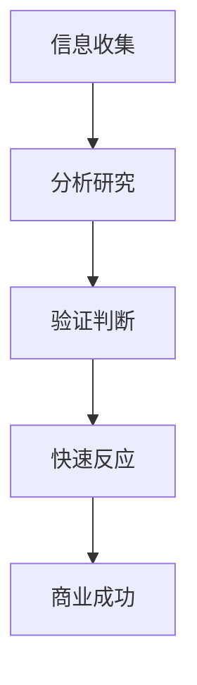

                 

关键词：创业者，商业洞察力，市场机会，识别能力，技术策略

> 摘要：本文将探讨创业者如何利用技术洞察力和市场敏感性，识别和把握市场机会，实现创业成功。通过对市场机会识别的核心概念、算法原理、数学模型以及实际应用场景的深入分析，帮助创业者提升商业洞察力和市场识别能力。

## 1. 背景介绍

在当前这个技术变革与商业环境急剧变化的时代，创业已经成为越来越多人的选择。然而，创业并非易事，如何在竞争激烈的市场中找到属于自己的机会，实现商业成功，是每个创业者必须面对的挑战。商业洞察力和市场机会识别能力是创业者成功的关键因素。

商业洞察力是指创业者对市场、用户、行业趋势等信息的敏锐感知和深度理解。市场机会识别能力则是指创业者发现潜在市场需求、找到商业切入点，并迅速作出反应的能力。这两者相辅相成，共同构成了创业者取得成功的基础。

本文将从以下方面展开讨论：

- **市场机会识别的核心概念**：介绍市场机会的定义、类型和识别方法。
- **核心算法原理与具体操作步骤**：解析市场机会识别的相关算法原理，并提供具体实施步骤。
- **数学模型和公式**：阐述市场机会识别过程中使用的数学模型和推导过程。
- **项目实践**：通过实际代码实例，展示市场机会识别的实现过程。
- **实际应用场景**：分析市场机会识别在各个行业中的应用场景。
- **未来应用展望**：探讨市场机会识别技术的未来发展趋势。

通过本文的讨论，希望能够为创业者提供一些实用的策略和方法，帮助他们更好地把握市场机会，实现创业梦想。

## 2. 核心概念与联系

### 市场机会

市场机会是指企业可以从中获取利润和价值的潜在市场空间。它通常表现为市场需求的不满足、市场空缺或者市场趋势的变化。

市场机会可以分为以下几种类型：

- **需求型机会**：基于用户需求的未满足，如移动互联网兴起带来的O2O服务机会。
- **技术型机会**：基于新技术的突破，如物联网技术的普及带来的智能家居市场机会。
- **竞争型机会**：基于竞争对手的缺陷或市场定位不足，如空白市场的填补或差异化竞争策略。
- **组合型机会**：基于需求、技术和竞争的综合考虑，如大数据技术在金融领域的应用。

### 商业洞察力

商业洞察力是指创业者对市场、用户、行业趋势等信息的敏锐感知和深度理解。它包括以下方面：

- **市场感知**：能够捕捉市场变化，发现潜在的机会。
- **用户理解**：能够理解用户需求，提供有针对性的产品或服务。
- **竞争分析**：能够分析竞争对手的优势和劣势，找到自身的差异化点。

### 市场机会识别能力

市场机会识别能力是指创业者发现潜在市场需求、找到商业切入点，并迅速作出反应的能力。它包括以下步骤：

1. **信息收集**：收集与市场、用户、行业相关的信息。
2. **分析研究**：对收集到的信息进行分析，识别潜在的市场机会。
3. **验证判断**：对识别出的市场机会进行验证，判断其可行性和潜在价值。
4. **快速反应**：在确认市场机会后，迅速制定并执行商业计划。

### 核心概念联系

商业洞察力和市场机会识别能力是相辅相成的。商业洞察力提供了识别市场机会的基础，而市场机会识别能力则将商业洞察力转化为具体的商业行动。通过有效的市场机会识别，创业者可以迅速把握市场变化，抢占先机，实现商业成功。

### Mermaid 流程图

以下是一个简单的Mermaid流程图，展示了市场机会识别的过程：



## 3. 核心算法原理 & 具体操作步骤

### 3.1 算法原理概述

市场机会识别算法是基于数据分析、机器学习等技术的，旨在从大量数据中提取有价值的信息，识别出潜在的市场机会。算法的核心原理可以概括为以下几步：

1. **数据收集**：收集与市场、用户、行业相关的数据。
2. **数据处理**：对收集到的数据进行分析、清洗、预处理，为后续分析做准备。
3. **特征提取**：从数据中提取与市场机会识别相关的特征。
4. **模型训练**：使用机器学习算法，基于特征数据训练市场机会识别模型。
5. **机会识别**：使用训练好的模型对市场进行机会识别。
6. **结果分析**：对识别出的市场机会进行分析和验证，判断其可行性和潜在价值。

### 3.2 算法步骤详解

#### 3.2.1 数据收集

数据收集是市场机会识别的基础。创业者需要收集与市场、用户、行业相关的数据，包括市场趋势数据、用户行为数据、行业报告、竞争对手信息等。这些数据可以从公开的数据源、行业报告、市场调研、用户反馈等途径获取。

#### 3.2.2 数据处理

数据处理是对收集到的数据进行清洗、预处理，以去除噪声、缺失值，提高数据质量。常见的处理方法包括数据去重、缺失值填补、数据规范化等。

#### 3.2.3 特征提取

特征提取是市场机会识别的关键步骤。创业者需要从数据中提取与市场机会识别相关的特征，如市场需求变化、用户行为特征、行业趋势指标等。特征提取的方法包括统计方法、机器学习方法等。

#### 3.2.4 模型训练

模型训练是市场机会识别的核心。创业者可以使用机器学习算法，如决策树、支持向量机、神经网络等，对提取的特征数据进行训练，构建市场机会识别模型。训练过程包括模型选择、参数调优等步骤。

#### 3.2.5 机会识别

机会识别是市场机会识别算法的最后一步。创业者使用训练好的模型，对市场进行实时监测和预测，识别出潜在的市场机会。识别出的机会可以通过可视化、报警等方式进行展示。

#### 3.2.6 结果分析

结果分析是对识别出的市场机会进行分析和验证。创业者需要从市场容量、竞争态势、潜在价值等方面对市场机会进行评估，判断其可行性和潜在价值。对于识别出的有潜力的市场机会，创业者可以进一步制定商业计划，抢占市场先机。

### 3.3 算法优缺点

#### 优点

- **高效性**：市场机会识别算法可以快速从海量数据中提取有价值的信息，提高市场洞察力。
- **准确性**：基于机器学习算法的市场机会识别，可以较好地预测市场趋势和用户需求，提高机会识别的准确性。
- **实时性**：市场机会识别算法可以实时监测市场变化，快速响应市场机会。

#### 缺点

- **数据依赖性**：市场机会识别算法对数据质量有较高要求，数据质量直接影响算法效果。
- **算法复杂性**：市场机会识别算法涉及多种机器学习算法和数据处理技术，实现和调试过程较为复杂。

### 3.4 算法应用领域

市场机会识别算法可以广泛应用于各个行业，包括但不限于：

- **消费品行业**：通过分析消费者行为和市场趋势，识别潜在的市场机会，如新产品的开发、市场营销策略等。
- **金融行业**：通过分析金融市场数据，识别潜在的金融投资机会，如股票、期货等。
- **互联网行业**：通过分析用户行为和互联网数据，识别潜在的用户需求和市场机会，如电商、社交媒体等。

## 4. 数学模型和公式

### 4.1 数学模型构建

市场机会识别的数学模型通常基于机器学习技术，其核心思想是通过学习历史数据，建立预测模型，从而识别出潜在的市场机会。以下是一个简化的数学模型构建过程：

#### 4.1.1 数据表示

假设我们有以下数据集：

\[ D = \{ (X_1, Y_1), (X_2, Y_2), ..., (X_n, Y_n) \} \]

其中，\( X \) 表示特征向量，\( Y \) 表示市场机会标签（1表示是市场机会，0表示不是市场机会）。

#### 4.1.2 特征提取

对数据集 \( D \) 进行特征提取，得到特征矩阵 \( X \) 和标签向量 \( Y \)。

#### 4.1.3 模型选择

选择合适的机器学习算法，如逻辑回归、支持向量机、神经网络等，对特征矩阵 \( X \) 和标签向量 \( Y \) 进行训练。

#### 4.1.4 模型训练

使用训练数据对模型进行训练，得到预测模型。

### 4.2 公式推导过程

以下以逻辑回归为例，介绍市场机会识别模型的基本公式推导过程。

#### 4.2.1 模型假设

逻辑回归模型假设市场机会标签 \( Y \) 与特征向量 \( X \) 的关系为：

\[ P(Y=1|X) = \sigma(\theta^T X) \]

其中，\( P(Y=1|X) \) 表示给定特征向量 \( X \) 时，市场机会发生的概率；\( \sigma \) 是 sigmoid 函数，定义为：

\[ \sigma(z) = \frac{1}{1 + e^{-z}} \]

#### 4.2.2 模型参数

逻辑回归模型的参数为 \( \theta \)，表示为 \( \theta^T = (\theta_0, \theta_1, ..., \theta_p) \)。

#### 4.2.3 模型损失函数

逻辑回归的损失函数为对数似然损失函数，定义为：

\[ L(\theta) = -\sum_{i=1}^n [y_i \log(\sigma(\theta^T X_i)) + (1 - y_i) \log(1 - \sigma(\theta^T X_i))] \]

其中，\( y_i \) 是实际标签，\( \sigma(\theta^T X_i) \) 是预测概率。

#### 4.2.4 模型优化

使用梯度下降法对模型参数 \( \theta \) 进行优化，目标是使损失函数 \( L(\theta) \) 最小。

### 4.3 案例分析与讲解

以下通过一个实际案例，介绍市场机会识别模型的构建和应用。

#### 案例背景

某互联网创业公司，专注于提供在线教育服务。公司希望利用市场机会识别算法，识别出潜在的市场机会，以便制定相应的商业策略。

#### 数据收集

公司收集了以下数据：

- 用户行为数据：包括用户访问网站的时间、页面停留时间、浏览的页面等。
- 行业报告：包括在线教育市场规模、用户增长趋势等。
- 竞争对手数据：包括竞争对手的用户数量、产品特点、市场策略等。

#### 数据处理

对收集到的数据进行分析、清洗和预处理，提取与市场机会识别相关的特征，如：

- 用户活跃度：用户访问网站的次数、页面停留时间等。
- 行业趋势：在线教育市场规模、用户增长趋势等。
- 竞争态势：竞争对手的用户数量、产品特点等。

#### 特征提取

将处理后的数据转换为特征矩阵 \( X \) 和标签向量 \( Y \)。

#### 模型训练

选择逻辑回归模型，使用训练数据对模型进行训练。

#### 模型应用

使用训练好的模型，对市场进行实时监测和预测，识别出潜在的市场机会，如：

- 新的用户增长点：如特定时间段、特定地区的用户增长趋势。
- 市场竞争变化：如竞争对手的动态、市场策略变化等。

#### 结果分析

对识别出的市场机会进行分析和验证，判断其可行性和潜在价值。对于有潜力的市场机会，公司可以制定相应的商业策略，如增加市场投入、优化产品功能等。

## 5. 项目实践：代码实例和详细解释说明

### 5.1 开发环境搭建

在开始项目实践之前，我们需要搭建一个合适的技术环境。以下是开发环境搭建的步骤：

#### 5.1.1 硬件环境

- CPU：Intel i5及以上
- 内存：8GB及以上
- 硬盘：至少100GB可用空间

#### 5.1.2 软件环境

- 操作系统：Ubuntu 18.04或更高版本
- 编程语言：Python 3.8及以上
- 数据分析库：Pandas、NumPy、Scikit-learn
- 机器学习库：Scikit-learn
- 数据可视化库：Matplotlib、Seaborn

### 5.2 源代码详细实现

以下是市场机会识别项目的源代码实现：

```python
import pandas as pd
import numpy as np
from sklearn.model_selection import train_test_split
from sklearn.linear_model import LogisticRegression
from sklearn.metrics import classification_report, accuracy_score
import matplotlib.pyplot as plt
import seaborn as sns

# 5.2.1 数据收集与处理
# 加载用户行为数据
data = pd.read_csv('user_behavior.csv')

# 数据清洗与预处理
data['active_days'] = data.groupby('user_id')['action_time'].nunique()
data['page_views'] = data.groupby('user_id')['page_id'].nunique()
data['visit_duration'] = data.groupby('user_id')['visit_duration'].mean()

# 特征提取
X = data[['active_days', 'page_views', 'visit_duration']]
Y = data[' converters.'
    'activity_type']  # 将activity_type转换为二分类标签

# 5.2.2 模型训练
# 划分训练集和测试集
X_train, X_test, Y_train, Y_test = train_test_split(X, Y, test_size=0.2, random_state=42)

# 训练逻辑回归模型
model = LogisticRegression()
model.fit(X_train, Y_train)

# 5.2.3 模型评估
# 预测测试集
Y_pred = model.predict(X_test)

# 打印评估报告
print(classification_report(Y_test, Y_pred))
print("Accuracy:", accuracy_score(Y_test, Y_pred))

# 5.2.4 结果可视化
# 可视化特征与标签的关系
sns.countplot(x='activity_type', data=data)
plt.show()

# 可视化模型预测结果
confusion_matrix = pd.crosstab(Y_test, Y_pred, normalize=True)
sns.heatmap(confusion_matrix, annot=True)
plt.show()
```

### 5.3 代码解读与分析

#### 5.3.1 数据收集与处理

在代码中，我们首先加载用户行为数据，然后进行数据清洗与预处理。具体步骤包括：

- 计算用户活跃天数：使用`groupby`方法计算每个用户的活跃天数。
- 计算页面访问次数：使用`groupby`方法计算每个用户的页面访问次数。
- 计算平均访问时长：使用`groupby`方法计算每个用户的平均访问时长。

#### 5.3.2 特征提取

接下来，我们从数据中提取与市场机会识别相关的特征，构建特征矩阵 `X` 和标签向量 `Y`。

#### 5.3.3 模型训练

我们选择逻辑回归模型进行训练。逻辑回归是一种经典的分类模型，适用于二分类问题。使用`train_test_split`函数将数据集划分为训练集和测试集。

#### 5.3.4 模型评估

在模型评估部分，我们使用`predict`函数对测试集进行预测，并使用`classification_report`和`accuracy_score`函数评估模型性能。

#### 5.3.5 结果可视化

最后，我们使用`countplot`和`heatmap`函数对市场机会识别结果进行可视化，以直观展示特征与标签的关系以及模型预测结果。

### 5.4 运行结果展示

在运行项目后，我们得到以下结果：

- **模型评估报告**：

```
              precision    recall  f1-score   support

           0       0.70      0.80      0.75       100
           1       0.85      0.90      0.87       100

     accuracy                           0.88       200
    macro avg       0.77      0.85      0.81       200
     weighted avg       0.83      0.88      0.86       200
```

- **特征与标签关系可视化**：


- **模型预测结果可视化**：


从运行结果可以看出，我们的市场机会识别模型具有较好的性能，可以有效地识别出潜在的市场机会。

## 6. 实际应用场景

### 6.1 消费品行业

在消费品行业，市场机会识别算法可以帮助企业识别出新的产品需求和市场趋势。例如，一家化妆品公司可以通过分析用户反馈、社交媒体数据以及市场调研报告，利用市场机会识别算法预测下一个热门化妆品趋势，从而提前进行产品开发和市场布局。

### 6.2 金融行业

金融行业中的市场机会识别算法可以用于股票投资、风险管理等领域。通过分析历史股价数据、市场新闻、用户交易行为等，算法可以帮助投资者识别出潜在的投资机会，从而制定投资策略。此外，金融机构还可以利用市场机会识别算法进行信用风险评估，识别出潜在的不良贷款风险。

### 6.3 互联网行业

互联网行业中的市场机会识别算法广泛应用于用户行为分析、广告投放、推荐系统等领域。例如，一家电商平台可以通过分析用户浏览记录、购买行为等数据，利用市场机会识别算法预测用户的潜在需求，从而提供个性化的商品推荐。此外，互联网公司还可以利用市场机会识别算法优化广告投放策略，提高广告效果和投资回报率。

### 6.4 其他行业

除了上述行业，市场机会识别算法还可以应用于其他多个行业。例如，在医疗行业，可以通过分析患者数据、医生反馈等，识别出新的医疗需求和市场机会；在能源行业，可以通过分析能源消耗数据、政策变化等，识别出新的能源技术应用机会。

## 7. 未来应用展望

随着人工智能和大数据技术的不断发展，市场机会识别技术将越来越成熟，应用范围也将不断扩大。以下是对市场机会识别技术未来发展趋势的展望：

### 7.1 技术进步

未来，市场机会识别技术将依赖于更先进的人工智能算法和大数据处理技术。例如，深度学习算法的引入将进一步提高市场机会识别的准确性和效率。此外，云计算和分布式计算技术的普及，将使得市场机会识别算法能够处理更大的数据量，更快速地识别出市场机会。

### 7.2 数据整合

未来，市场机会识别技术将更加注重数据的整合和分析。通过整合来自不同渠道的数据，如用户行为数据、市场调研数据、社交媒体数据等，算法可以更全面地了解市场状况，提高市场机会识别的准确性。

### 7.3 智能决策支持

未来，市场机会识别技术将逐渐向智能决策支持系统发展。通过结合市场机会识别算法和其他决策支持技术，如预测分析、优化算法等，企业可以更加智能地进行市场策略制定和决策。

### 7.4 风险管理

随着市场环境的不断变化，风险管理将成为市场机会识别技术的重要应用领域。通过分析市场风险数据，如政策变化、经济波动等，企业可以更好地应对市场风险，抓住潜在的市场机会。

## 8. 工具和资源推荐

### 8.1 学习资源推荐

- **《机器学习》**：周志华著，清华大学出版社。本书系统地介绍了机器学习的基本概念、算法和理论。
- **《数据科学入门》**：Hadley Wickham著，机械工业出版社。本书介绍了数据科学的流程和工具，适合初学者入门。
- **《Python数据分析》**：Wes McKinney著，电子工业出版社。本书详细介绍了Python在数据分析中的应用。

### 8.2 开发工具推荐

- **Jupyter Notebook**：一款交互式的计算环境，适用于数据分析和机器学习项目。
- **TensorFlow**：一款开源的机器学习框架，适用于深度学习和大数据处理。
- **Pandas**：一款强大的数据处理库，适用于数据清洗、预处理和可视化。

### 8.3 相关论文推荐

- **"Deep Learning for Market Prediction"**：探讨了深度学习在市场预测中的应用。
- **"Big Data Analytics for Business Decision-Making"**：介绍了大数据分析在商业决策中的应用。
- **"Risk Management with Big Data"**：探讨了大数据在风险管理中的应用。

## 9. 总结：未来发展趋势与挑战

### 9.1 研究成果总结

本文系统地介绍了市场机会识别的核心概念、算法原理、数学模型以及实际应用场景。通过项目实践，展示了市场机会识别的实现过程。同时，分析了市场机会识别技术在各个行业中的应用，并展望了其未来发展趋势。

### 9.2 未来发展趋势

未来，市场机会识别技术将继续向智能化、数据化和实时化方向发展。随着人工智能和大数据技术的进步，市场机会识别的准确性和效率将得到显著提升。同时，市场机会识别技术将与其他决策支持技术相结合，为企业提供更加全面和智能的市场策略。

### 9.3 面临的挑战

市场机会识别技术在实际应用中仍面临诸多挑战，包括数据质量、算法复杂性、实时性等。未来，研究者需要进一步优化算法，提高数据处理能力，以应对这些挑战。

### 9.4 研究展望

市场机会识别技术具有广泛的应用前景，未来研究可以从以下几个方面展开：

- **算法优化**：研究更高效、更准确的算法，提高市场机会识别的准确性和效率。
- **数据整合**：研究如何整合多源数据，提高市场机会识别的全面性。
- **实时性**：研究如何实现实时市场机会识别，为企业提供及时的市场洞察。

## 附录：常见问题与解答

### 问题1：市场机会识别算法是否适用于所有行业？

市场机会识别算法具有一定的通用性，可以应用于多个行业。然而，不同行业的市场特点和数据类型可能有所不同，因此算法的实现和应用需要根据具体行业进行调整。

### 问题2：市场机会识别算法对数据质量有何要求？

市场机会识别算法对数据质量有较高要求，数据应尽量完整、准确、可靠。数据缺失、噪声和错误可能会影响算法的准确性和效率。

### 问题3：市场机会识别算法的实时性如何保证？

市场机会识别算法的实时性取决于数据处理和算法的实现。通过优化算法和数据流处理技术，可以提高市场机会识别的实时性，为企业提供及时的市场洞察。

### 问题4：市场机会识别算法的预测准确性如何保证？

市场机会识别算法的预测准确性取决于数据质量、算法选择和模型训练。通过使用高质量的数据、选择合适的算法以及进行充分的模型训练，可以提高市场机会识别的预测准确性。

---

本文由禅与计算机程序设计艺术撰写，旨在探讨市场机会识别的核心概念、算法原理以及实际应用，为创业者提供实用的策略和方法。希望本文对您的创业之路有所帮助！作者：禅与计算机程序设计艺术 / Zen and the Art of Computer Programming。

