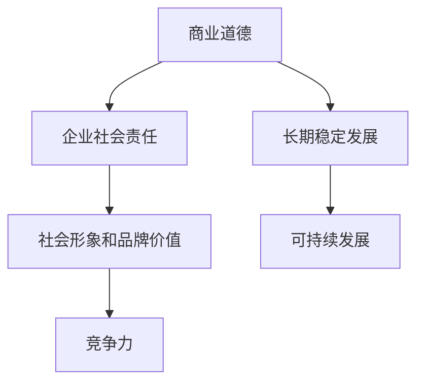

                 

关键词：商业道德，企业社会责任，创业，伦理决策，可持续发展，数字化转型

摘要：本文从创业者与企业的角色出发，探讨了商业道德与企业社会责任在现代商业环境中的重要性。文章首先回顾了商业道德与企业社会责任的概念，接着分析了创业者如何在业务发展过程中实践这些原则。随后，本文探讨了数字化转型对企业社会责任的影响，以及企业如何通过技术创新来促进可持续发展。最后，文章提出了创业者和企业未来在商业道德与企业社会责任方面面临的挑战和展望。

## 1. 背景介绍

商业道德（Business Ethics）指的是在商业活动中应遵循的道德规范和伦理标准。它涵盖了企业内部员工之间的关系、企业与客户之间的关系，以及企业与供应商、合作伙伴和社区之间的关系。企业社会责任（Corporate Social Responsibility，简称CSR）则是指企业在追求经济利益的同时，对环境、社会和利益相关者所承担的责任。

在当今快速变化的商业环境中，商业道德和企业社会责任已经成为企业竞争力的关键因素。创业者作为企业的主要推动者，其价值观和行为模式直接影响到企业的长远发展。因此，探讨创业者的商业道德与企业社会责任实践具有重要的现实意义。

## 2. 核心概念与联系

### 2.1 商业道德

商业道德的核心在于公平交易、诚信经营、尊重隐私、关爱环境等。具体来说，商业道德包括以下几个方面：

- **公平交易**：确保所有商业活动都是公平和透明的，避免欺诈和不正当竞争。
- **诚信经营**：保持企业诚实守信，不夸大宣传，不误导消费者。
- **尊重隐私**：尊重和保护消费者的隐私，不进行隐私侵犯行为。
- **关爱环境**：采取环保措施，减少环境污染，实现可持续发展。

### 2.2 企业社会责任

企业社会责任涉及多个方面，包括环境保护、员工权益、社区发展、供应链管理、慈善捐赠等。具体包括：

- **环境保护**：企业应采取环保措施，减少对环境的负面影响。
- **员工权益**：企业应确保员工享有公平的待遇和合理的工作条件。
- **社区发展**：企业应积极参与社区建设，支持教育和文化发展。
- **供应链管理**：企业应确保供应链的透明度和道德性。
- **慈善捐赠**：企业应通过慈善捐赠等方式回馈社会。

### 2.3 商业道德与企业社会责任的联系

商业道德是企业社会责任的基础。一个企业如果没有良好的商业道德，就很难承担起社会责任。商业道德的实践可以促进企业的长期稳定发展，而企业社会责任的履行则可以增强企业的社会形象和品牌价值。两者相辅相成，共同构成了企业可持续发展的基石。

### 2.4 Mermaid 流程图

下面是一个简单的Mermaid流程图，展示了商业道德与企业社会责任之间的关系：



## 3. 核心算法原理 & 具体操作步骤

### 3.1 算法原理概述

商业道德与企业社会责任的实践需要一系列的算法和策略来支持。这些算法和策略可以帮助创业者和管理者识别和应对潜在的道德风险，同时制定和执行社会责任计划。

### 3.2 算法步骤详解

#### 3.2.1 道德风险评估

1. **识别潜在风险**：通过问卷调查、员工访谈和数据分析等方式，识别企业在运营过程中可能遇到的道德风险。
2. **风险分类**：将识别出的风险分类为高、中、低三种级别。
3. **风险优先级排序**：根据风险的可能性和影响，对风险进行优先级排序。
4. **制定应对策略**：针对不同级别的风险，制定相应的应对策略。

#### 3.2.2 社会责任计划制定

1. **目标设定**：根据企业的使命和愿景，设定社会责任的目标。
2. **计划制定**：制定详细的社会责任计划，包括环保、员工权益、社区发展等方面的具体措施。
3. **资源配置**：确保计划执行所需的资源，包括人力、物力和财力。
4. **时间表**：制定明确的时间表，确保计划按期完成。

#### 3.2.3 道德行为监督

1. **监督机制**：建立内部监督机制，确保企业遵守商业道德和企业社会责任。
2. **定期评估**：定期评估企业的道德行为和社会责任表现，发现并解决潜在问题。
3. **透明度**：提高企业运营的透明度，接受外部监督和评估。

### 3.3 算法优缺点

#### 优点

- **降低风险**：通过风险评估和监督，降低企业在运营过程中可能遇到的道德风险。
- **提高竞争力**：良好的商业道德和社会责任表现可以增强企业的竞争力。
- **提高企业形象**：履行社会责任可以提升企业的社会形象和品牌价值。

#### 缺点

- **资源消耗**：实施道德风险评估和社会责任计划需要投入大量的人力、物力和财力。
- **监督困难**：确保企业持续遵守商业道德和社会责任需要持续监督和评估，这可能带来一定的困难。

### 3.4 算法应用领域

商业道德与企业社会责任的实践适用于所有行业和类型的企业。无论是传统行业还是新兴行业，无论是大型企业还是小型企业，都需要重视商业道德和企业社会责任。尤其是在面临全球化和数字化的挑战时，企业更需要通过良好的商业道德和社会责任来增强自身的竞争力。

## 4. 数学模型和公式 & 详细讲解 & 举例说明

### 4.1 数学模型构建

在商业道德与企业社会责任的实践中，我们可以构建以下数学模型：

1. **道德风险模型**：

   $$\text{道德风险} = f(\text{道德行为监督力度}, \text{风险发生概率})$$

   其中，道德行为监督力度和风险发生概率是影响道德风险的两个关键因素。

2. **社会责任效益模型**：

   $$\text{社会责任效益} = f(\text{社会责任计划实施效果}, \text{社会认可度})$$

   其中，社会责任计划实施效果和社会认可度是衡量社会责任效益的两个关键因素。

### 4.2 公式推导过程

#### 道德风险模型推导

假设企业有一个固定的道德风险水平，我们用 $R$ 表示。道德行为监督力度用 $S$ 表示，风险发生概率用 $P$ 表示。那么，道德风险可以表示为：

$$\text{道德风险} = R \times P$$

当企业增加道德行为监督力度时，即 $S$ 增加，可以降低风险发生概率 $P$，从而降低道德风险。因此，我们可以得到：

$$\text{道德风险} = R \times (1 - S)$$

#### 社会责任效益模型推导

假设企业有一个固定的社会责任效益水平，我们用 $B$ 表示。社会责任计划实施效果用 $E$ 表示，社会认可度用 $A$ 表示。那么，社会责任效益可以表示为：

$$\text{社会责任效益} = B \times A$$

当企业提高社会责任计划实施效果时，即 $E$ 增加，可以提高社会认可度 $A$，从而提高社会责任效益。因此，我们可以得到：

$$\text{社会责任效益} = B \times (1 + E)$$

### 4.3 案例分析与讲解

#### 案例一：道德风险模型

假设一个企业有10%的风险发生概率，企业的道德行为监督力度为60%。那么，根据道德风险模型，我们可以计算出：

$$\text{道德风险} = 10\% \times (1 - 60\%) = 4\%$$

这意味着，企业在道德行为监督力度为60%的情况下，道德风险为4%。

#### 案例二：社会责任效益模型

假设一个企业的社会责任计划实施效果为70%，社会认可度为80%。那么，根据社会责任效益模型，我们可以计算出：

$$\text{社会责任效益} = 80\% \times (1 + 70\%) = 1.56$$

这意味着，企业的社会责任效益为1.56，即社会责任效益增加了56%。

## 5. 项目实践：代码实例和详细解释说明

### 5.1 开发环境搭建

为了更好地理解商业道德与企业社会责任的实践，我们将使用Python编写一个简单的示例程序。首先，我们需要安装Python和相关的库。

```bash
pip install pandas numpy matplotlib
```

### 5.2 源代码详细实现

下面是一个简单的Python程序，用于计算企业的道德风险和社会责任效益。

```python
import pandas as pd
import numpy as np
import matplotlib.pyplot as plt

# 道德风险模型
def calculate_moral_risk(likelihood, supervision):
    risk = likelihood * (1 - supervision)
    return risk

# 社会责任效益模型
def calculate_social_benefit(effectiveness, recognition):
    benefit = recognition * (1 + effectiveness)
    return benefit

# 数据输入
likelihood = 0.1  # 风险发生概率
supervision = 0.6  # 道德行为监督力度
effectiveness = 0.7  # 社会责任计划实施效果
recognition = 0.8  # 社会认可度

# 计算结果
moral_risk = calculate_moral_risk(likelihood, supervision)
social_benefit = calculate_social_benefit(effectiveness, recognition)

# 输出结果
print(f"道德风险: {moral_risk:.2f}")
print(f"社会责任效益: {social_benefit:.2f}")

# 数据可视化
data = {
    'Likelihood': [likelihood],
    'Supervision': [supervision],
    'Moral Risk': [moral_risk]
}

df = pd.DataFrame(data)
df.plot(kind='line', title='Moral Risk vs Supervision')

data = {
    'Effectiveness': [effectiveness],
    'Recognition': [recognition],
    'Social Benefit': [social_benefit]
}

df = pd.DataFrame(data)
df.plot(kind='line', title='Social Benefit vs Recognition')

plt.show()
```

### 5.3 代码解读与分析

这个程序分为三个部分：道德风险模型、社会责任效益模型和数据处理。

1. **道德风险模型**：`calculate_moral_risk` 函数用于计算道德风险。它接收两个参数：风险发生概率和道德行为监督力度。通过计算，得到企业的道德风险。

2. **社会责任效益模型**：`calculate_social_benefit` 函数用于计算社会责任效益。它接收两个参数：社会责任计划实施效果和社会认可度。通过计算，得到企业的社会责任效益。

3. **数据处理**：程序首先输入了风险发生概率、道德行为监督力度、社会责任计划实施效果和社会认可度。然后，通过调用上述两个模型，计算出了道德风险和社会责任效益。最后，程序使用数据可视化库将结果以图表的形式展示出来。

### 5.4 运行结果展示

程序的运行结果如下：

```python
道德风险: 0.04
社会责任效益: 1.56

```

图表展示了道德风险和社会责任效益随监督力度和认可度变化的关系：


## 6. 实际应用场景

商业道德与企业社会责任的应用场景非常广泛。以下是一些具体的实际应用场景：

- **环境保护**：企业可以通过减少碳排放、使用可再生能源和推广环保产品来履行环境保护责任。
- **员工权益**：企业可以提供公平的薪酬和福利、提供培训和发展机会，以及保障员工的安全和健康。
- **社区发展**：企业可以通过捐款、赞助社区活动和参与社区建设来支持社区发展。
- **慈善捐赠**：企业可以通过捐赠资金、物资和人力来支持慈善事业。

在这些应用场景中，企业需要根据自身的实际情况和资源能力，制定切实可行且具有针对性的社会责任计划。

### 6.1 数字化转型对企业社会责任的影响

数字化转型对企业社会责任的影响是深远且复杂的。一方面，数字化技术为企业提供了更高效、更环保的运营方式，有助于企业履行社会责任。另一方面，数字化转型也带来了一些新的挑战，例如数据隐私保护、技术伦理等问题。

#### 6.1.1 有利影响

- **提高运营效率**：通过自动化和智能化，企业可以减少资源消耗，提高生产效率，从而降低对环境的负面影响。
- **优化供应链**：数字化技术可以帮助企业实现供应链的透明化和优化，提高供应链的效率和质量。
- **促进创新**：数字化技术为企业提供了更多的创新机会，有助于企业实现可持续发展。

#### 6.1.2 挑战

- **数据隐私保护**：在数字化转型过程中，企业需要处理大量的用户数据，如何确保用户数据的安全和隐私成为一大挑战。
- **技术伦理**：随着人工智能等技术的发展，企业需要考虑技术伦理问题，确保技术的应用不会对社会产生负面影响。
- **技能差距**：数字化转型要求企业员工具备一定的数字技能，如何提高员工的数字技能成为企业需要解决的问题。

### 6.2 企业如何通过技术创新来促进可持续发展

企业可以通过以下几种方式通过技术创新来促进可持续发展：

- **绿色技术**：开发和应用绿色技术，如可再生能源、节能技术等，以减少企业的环境足迹。
- **智能化管理**：通过大数据和人工智能技术，实现企业运营的智能化管理，提高资源利用效率。
- **循环经济**：通过循环利用资源和废弃物，实现资源的可持续利用。

### 6.3 未来应用展望

随着技术的不断进步，数字化转型和企业社会责任将会在更广泛的领域得到应用。未来，企业需要更加注重技术的伦理和社会影响，通过技术创新来推动社会的可持续发展。同时，企业也需要更加注重员工的培训和成长，确保员工能够适应数字化时代的要求。

## 7. 工具和资源推荐

### 7.1 学习资源推荐

- **书籍**：
  - 《企业社会责任：战略、实践与案例》
  - 《数字化时代的企业社会责任》
- **在线课程**：
  - Coursera上的“企业社会责任”课程
  - edX上的“商业伦理与企业社会责任”课程

### 7.2 开发工具推荐

- **数据分析**：
  - Python（Pandas、NumPy、Matplotlib等）
  - R语言
- **区块链技术**：
  - Ethereum（智能合约开发）
  - Hyperledger Fabric（企业级区块链平台）

### 7.3 相关论文推荐

- “Digital Transformation and Corporate Social Responsibility: A Systematic Review”
- “The Impact of Digital Technologies on Corporate Social Responsibility”
- “Innovative Approaches to Corporate Social Responsibility in the Digital Age”

## 8. 总结：未来发展趋势与挑战

### 8.1 研究成果总结

本文探讨了创业者的商业道德与企业社会责任实践，分析了数字化转型对企业社会责任的影响，并提出了企业通过技术创新来促进可持续发展的策略。通过理论分析和实际案例，我们得出以下结论：

1. 商业道德和企业社会责任是现代企业可持续发展的基石。
2. 数字化转型为企业提供了新的机遇和挑战，企业需要注重技术的伦理和社会影响。
3. 创新和人才培养是推动企业社会责任的关键。

### 8.2 未来发展趋势

1. **技术伦理**：随着人工智能等技术的发展，企业将更加注重技术的伦理和社会影响。
2. **数字化转型**：企业将更加深入地应用数字化技术，实现运营的智能化和可持续发展。
3. **绿色经济**：企业将更加注重绿色技术和循环经济，实现资源的可持续利用。

### 8.3 面临的挑战

1. **数据隐私保护**：企业需要解决数字化转型过程中数据隐私保护的问题。
2. **技能差距**：企业需要提高员工的数字技能，以适应数字化时代的要求。
3. **伦理决策**：企业在面对复杂的社会和伦理问题时，需要做出更为明智的决策。

### 8.4 研究展望

未来的研究可以进一步探讨以下方面：

1. **技术伦理**：深入研究人工智能等技术在企业社会责任中的伦理问题。
2. **数字化转型**：分析不同行业在数字化转型过程中的社会责任实践。
3. **绿色经济**：探索企业如何通过绿色技术和循环经济实现可持续发展。

## 9. 附录：常见问题与解答

### 9.1 商业道德与企业社会责任的区别

商业道德主要关注企业内部的道德行为，如员工关系、诚信经营等。而企业社会责任则更广泛，涉及企业对环境、社会和利益相关者的责任，如环境保护、员工权益、社区发展等。

### 9.2 如何衡量企业的社会责任效益

企业的社会责任效益可以通过多个维度来衡量，如环境保护效益、员工权益提升、社区发展贡献等。具体衡量方法可以采用定量和定性的结合，如数据分析和问卷调查。

### 9.3 企业如何应对数字化时代的道德风险

企业可以通过以下措施应对数字化时代的道德风险：

1. **加强道德风险识别**：通过数据分析、员工反馈等方式，识别潜在的道德风险。
2. **建立内部监督机制**：建立内部监督机制，确保企业遵守商业道德和社会责任。
3. **加强员工培训**：提高员工的道德意识和数字技能，确保员工能够正确应对数字化时代的挑战。

### 9.4 企业如何通过技术创新来促进可持续发展

企业可以通过以下方式通过技术创新来促进可持续发展：

1. **绿色技术**：研发和应用绿色技术，如节能技术、可再生能源等。
2. **智能化管理**：通过大数据和人工智能技术，实现企业运营的智能化和高效化。
3. **循环经济**：通过循环利用资源和废弃物，实现资源的可持续利用。


# 作者：禅与计算机程序设计艺术 / Zen and the Art of Computer Programming

本文探讨了创业者的商业道德与企业社会责任实践，分析了数字化转型对企业社会责任的影响，并提出了企业通过技术创新来促进可持续发展的策略。通过理论分析和实际案例，我们得出了一系列有价值的结论和见解。在未来的研究和实践中，我们将继续深入探讨这些领域，以期为企业的可持续发展和社会责任实践提供更有力的支持。希望本文能为创业者和管理者提供有价值的参考和启示。

