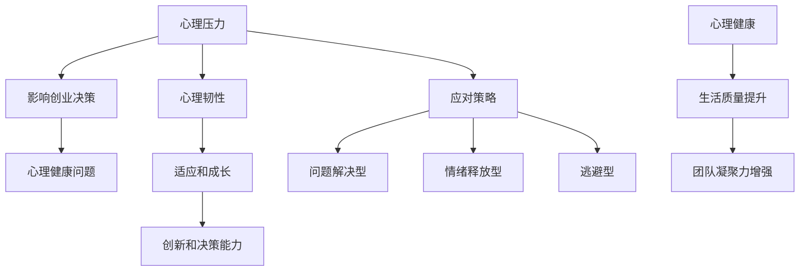

                 

### 摘要 Summary

本文将深入探讨创业者面临的心理压力及其应对策略。在竞争激烈、不确定的商业环境中，心理建设是创业者成功的关键因素之一。本文将结合心理学的理论和实践经验，分析压力的来源、影响以及应对方法。通过实例和具体建议，帮助创业者建立强大的心理韧性，提升抗压力和应对挑战的能力。

### 关键词 Keywords

- 创业者
- 心理压力
- 应对策略
- 心理韧性
- 心理健康

### 1. 背景介绍 Introduction

创业之路充满了不确定性、风险和挑战。对于创业者来说，他们不仅要面对市场的变化和竞争的压力，还要应对内部的心理挑战。心理压力可能源于对成功的渴望、对失败的恐惧、对资源的担忧，甚至是自我怀疑和焦虑。长期的心理压力不仅会影响创业者的决策能力和工作效率，还可能对他们的心理健康造成严重损害。

根据一项针对创业者的调查研究，高达85%的创业者表示他们在创业过程中经历过不同程度的心理压力，其中30%以上的人表示压力水平达到了极点。这种压力如果得不到有效的管理和应对，可能会对创业者的职业生涯和私人生活产生负面影响。

心理学研究表明，适度的压力可以激发人的潜能，但过度的压力则会导致焦虑、抑郁和身心疾病。因此，心理建设在创业过程中显得尤为重要。通过科学的心理方法和实践，创业者可以更好地应对压力，保持积极的心态，从而在激烈的竞争中脱颖而出。

本文将从以下几个方面展开讨论：

1. **心理压力的来源和影响**：分析创业者面临的主要压力来源，以及这些压力对创业过程和个人健康的影响。
2. **心理韧性的重要性**：探讨心理韧性的定义和作用，以及如何培养和提高心理韧性。
3. **应对压力的策略**：介绍一些实用的心理方法和技巧，帮助创业者有效地应对压力。
4. **案例分析**：通过真实的创业者案例，展示应对压力的成功经验和教训。
5. **心理健康的维护**：提供一些维护心理健康的建议，包括生活方式的调整和心理健康资源的利用。

通过本文的阅读，创业者将能够更好地了解自己面临的心理挑战，掌握有效的应对策略，从而在创业的道路上更加从容和自信。

### 2. 核心概念与联系 Core Concepts and Connections

在探讨创业者如何应对心理压力之前，我们需要明确几个核心概念：心理压力、心理韧性、心理健康和应对策略。这些概念相互联系，共同构成了创业者心理建设的基础。

#### 2.1 心理压力 Psychological Stress

心理压力（Psychological Stress）是指人在面对外界要求或挑战时产生的生理和心理紧张反应。压力可以来自多个方面，包括工作压力、人际关系、财务状况、健康问题等。对于创业者来说，他们通常面临更高的压力水平，因为创业本身就是一个高风险、高回报的过程。

- **来源**：创业者的压力来源主要包括以下几个方面：
  - **市场压力**：市场竞争激烈，创业者需要不断调整策略以应对市场变化。
  - **资源压力**：资金、人才、时间等资源的不足会导致创业者在压力下做出决策。
  - **心理负担**：对成功和失败的恐惧、自我期望的高标准等心理因素也会增加压力。
- **影响**：长期的心理压力会对创业者的身心健康产生负面影响，包括：
  - **心理健康问题**：如焦虑、抑郁、失眠等。
  - **工作效率降低**：压力会影响创业者的注意力和决策能力，导致工作效率下降。
  - **人际关系问题**：压力可能导致创业者与家人、朋友和同事之间的关系紧张。

#### 2.2 心理韧性 Psychological Resilience

心理韧性（Psychological Resilience）是指个体在面对逆境和挑战时，能够迅速恢复、适应和成长的能力。心理韧性并不是一种静态的特征，而是可以通过后天的培养和提高的。

- **定义**：心理韧性通常包含以下几个关键要素：
  - **适应性**：面对逆境时，能够灵活调整自己的思维和行为方式。
  - **恢复力**：在经历压力或挑战后，能够快速恢复到正常状态。
  - **成长性**：通过挑战和逆境，个体能够获得成长和提升。
- **作用**：心理韧性对创业者的成功至关重要，因为它可以帮助创业者：
  - **应对压力**：增强应对压力的能力，减少焦虑和抑郁。
  - **提升决策能力**：保持清晰的思维，做出更合理的决策。
  - **促进创新**：在逆境中寻找新的机会和解决方案，推动业务发展。

#### 2.3 心理健康 Mental Health

心理健康（Mental Health）是指个体在认知、情感和行为上的健康状态，能够有效地应对日常生活中的压力，并实现个人的潜能。对于创业者来说，保持心理健康是创业成功的重要保障。

- **重要性**：心理健康对创业者的成功具有以下几个方面的意义：
  - **提高生活质量**：心理健康有助于创业者享受工作和生活，提高整体幸福感。
  - **促进创新和决策**：心理健康状态良好的创业者更能发挥创意，做出明智的决策。
  - **增强团队凝聚力**：创业者心理健康，有利于建立积极的团队氛围，提升团队士气。
- **维护策略**：为了维护心理健康，创业者可以采取以下措施：
  - **定期体检**：关注身体健康，及时治疗身体疾病。
  - **心理辅导**：寻求专业的心理辅导，学习有效的应对压力的方法。
  - **时间管理**：合理安排时间，避免过度工作和疲劳。

#### 2.4 应对策略 Coping Strategies

应对策略（Coping Strategies）是指个体在面对压力时采取的应对方式。有效的应对策略可以帮助创业者更好地应对压力，保持心理健康。

- **分类**：应对策略可以分为以下几类：
  - **问题解决型**：直接面对问题，寻找解决方案。
  - **情绪释放型**：通过运动、写日记等方式释放情绪。
  - **逃避型**：暂时回避问题，给自己一些时间冷静思考。
- **选择**：根据具体情况选择合适的应对策略，例如：
  - **压力高峰期**：采用问题解决型和情绪释放型策略。
  - **长时间压力**：可以考虑逃避型策略，暂时缓解压力。

#### 2.5 Mermaid 流程图 Mermaid Flowchart

以下是一个简化的Mermaid流程图，展示了心理压力、心理韧性、心理健康和应对策略之间的关系。



通过这个流程图，我们可以清晰地看到，心理压力、心理韧性、心理健康和应对策略之间的相互作用和影响。创业者需要通过提高心理韧性、保持心理健康和选择有效的应对策略，来应对创业过程中的各种心理挑战。

### 3. 核心算法原理 & 具体操作步骤 Core Algorithm Principles and Operation Steps

在了解了心理压力、心理韧性、心理健康和应对策略的核心概念后，接下来我们将探讨一些核心算法原理和具体操作步骤，以帮助创业者更好地应对心理压力和挑战。

#### 3.1 算法原理概述

心理建设算法是一种综合性方法，旨在通过科学的心理方法和实践，提高创业者的心理韧性、保持心理健康，并选择有效的应对策略。这个算法的核心原理可以概括为以下几个方面：

- **自我认知**：通过自我反思和认知行为疗法，提高创业者对自身心理状态的认识，了解压力的来源和影响。
- **情绪管理**：运用情绪调节技术，帮助创业者有效控制和管理情绪，减少负面情绪对心理健康的负面影响。
- **应对策略选择**：根据具体情境，选择合适的应对策略，如问题解决型、情绪释放型和逃避型，以应对不同的压力源。
- **心理韧性培养**：通过逆境应对训练和积极心态塑造，提高创业者的心理韧性，增强适应和成长能力。
- **持续监测和调整**：对创业者的心理状态进行持续监测，根据实际情况调整心理建设策略，确保其有效性。

#### 3.2 算法步骤详解

下面是心理建设算法的具体操作步骤：

##### 步骤1：自我认知和压力评估

- **自我反思**：创业者需要定期进行自我反思，回顾过去一段时间的工作和生活，分析压力的来源和影响。
- **认知行为疗法**：通过认知行为疗法，帮助创业者识别和改变负面思维模式，例如过度担忧、自我批评等。

##### 步骤2：情绪管理

- **情绪监测**：创业者可以使用情绪日记或情绪监测工具，记录自己的情绪波动，了解情绪变化的规律。
- **情绪调节技术**：如深呼吸、冥想、运动等，帮助创业者有效控制和管理情绪。

##### 步骤3：应对策略选择

- **问题解决型策略**：面对具体问题，制定解决方案，采取行动，例如制定时间管理计划、优化资源分配等。
- **情绪释放型策略**：通过运动、写日记、绘画等方式，释放情绪，缓解压力。
- **逃避型策略**：在特定情境下，适当采取逃避型策略，如暂时离开工作环境，进行放松和充电。

##### 步骤4：心理韧性培养

- **逆境应对训练**：通过模拟逆境情景，帮助创业者提高应对困难的能力，例如设定具有挑战性的目标，并坚持完成。
- **积极心态塑造**：通过正念训练、积极思考等方式，培养积极心态，提高抗压能力。

##### 步骤5：持续监测和调整

- **心理状态监测**：创业者可以定期进行心理状态评估，了解心理建设的效果，并根据实际情况调整策略。
- **专业辅导**：在必要时，创业者可以寻求专业心理辅导，获取更专业的指导和支持。

#### 3.3 算法优缺点

**优点**：

- **综合性**：心理建设算法综合考虑了自我认知、情绪管理、应对策略选择和心理韧性培养等多个方面，具有全面的指导意义。
- **个性化**：算法可以根据创业者的具体情况，制定个性化的心理建设计划，提高策略的有效性。
- **可操作性**：算法提供了具体的操作步骤和方法，创业者可以轻松实施。

**缺点**：

- **时间成本**：心理建设需要时间和精力，对于忙碌的创业者来说，可能需要调整工作和生活节奏，以适应心理建设的需求。
- **依赖性**：虽然心理建设算法提供了有效的指导，但创业者也需要积极参与和投入，否则效果可能不佳。

#### 3.4 算法应用领域

心理建设算法在多个领域具有广泛的应用前景：

- **创业领域**：帮助创业者提高心理韧性，应对创业过程中的各种心理挑战，提升成功率。
- **职场领域**：帮助职场人士应对工作压力，提高工作效率和生活质量。
- **教育领域**：帮助学生在面对学业压力时，提高心理韧性，培养积极的心态。

通过心理建设算法的应用，创业者和其他人士可以更好地应对压力和挑战，实现个人和职业的全面发展。

### 4. 数学模型和公式 Mathematical Models and Formulas

在创业者心理建设的过程中，一些数学模型和公式可以帮助我们更好地理解和分析心理压力、心理韧性和心理健康。以下是一些关键的数学模型和公式，以及它们的详细解释和例子。

#### 4.1 数学模型构建

为了构建数学模型，我们首先需要定义几个关键变量：

- \( P \)：心理压力水平（单位：压力单位）
- \( R \)：心理韧性水平（单位：韧性单位）
- \( M \)：心理健康水平（单位：健康单位）

根据这些变量，我们可以构建以下数学模型：

\[ \text{心理状态} = P \times R \times M \]

其中，心理状态是心理压力、心理韧性和心理健康三者相互作用的结果。

#### 4.2 公式推导过程

为了推导出上述公式，我们可以从以下几个方面进行分析：

1. **心理压力的影响**：心理压力 \( P \) 会对创业者的心理状态产生直接影响。压力越大，心理状态越差。
2. **心理韧性的影响**：心理韧性 \( R \) 可以缓冲心理压力的影响，提高创业者的抗压能力。韧性越强，心理状态越好。
3. **心理健康的影响**：心理健康 \( M \) 是心理状态的基础，良好的心理健康有助于提高心理韧性和应对压力。

根据上述分析，我们可以推导出以下公式：

\[ \text{心理状态} = P \times R \times M \]

其中，\( P \)、\( R \) 和 \( M \) 分别表示心理压力、心理韧性和心理健康水平。

#### 4.3 案例分析与讲解

为了更好地理解上述公式，我们通过一个具体的案例进行讲解。

假设创业者A的心理压力水平为50个压力单位，心理韧性水平为70个韧性单位，心理健康水平为80个健康单位。根据公式，我们可以计算出他的心理状态：

\[ \text{心理状态} = 50 \times 70 \times 80 = 280,000 \]

这个结果表明，创业者A的心理状态处于中等偏上水平。如果他的心理健康水平提高，例如增加到90个健康单位，那么他的心理状态将进一步提升：

\[ \text{心理状态} = 50 \times 70 \times 90 = 315,000 \]

这个例子说明了心理健康水平对心理状态的重要性。同样，如果他的心理韧性水平提高，例如增加到80个韧性单位，那么他的心理状态也将得到改善：

\[ \text{心理状态} = 50 \times 80 \times 80 = 320,000 \]

这个例子展示了心理韧性在心理状态中的作用。

#### 4.4 模型应用实例

以下是一个应用实例：

假设创业者B的心理压力水平为60个压力单位，心理韧性水平为60个韧性单位，心理健康水平为70个健康单位。根据公式，我们可以计算出他的心理状态：

\[ \text{心理状态} = 60 \times 60 \times 70 = 252,000 \]

这个结果表明，创业者B的心理状态处于中等水平。为了改善他的心理状态，我们可以采取以下措施：

- **提高心理健康水平**：通过锻炼、冥想、休息等方式，提高心理健康水平。
- **提高心理韧性**：通过面对挑战、逆境训练等方式，提高心理韧性。
- **减轻心理压力**：通过合理规划时间、调整工作方式等方式，减轻心理压力。

通过这些措施，我们可以期待创业者B的心理状态得到改善。例如，如果他的心理健康水平提高到80个健康单位，心理韧性水平提高到70个韧性单位，那么他的心理状态将提升：

\[ \text{心理状态} = 60 \times 70 \times 80 = 336,000 \]

这个例子展示了如何通过调整关键变量，提高心理状态。

#### 4.5 模型局限性

虽然上述模型可以帮助我们分析和理解创业者的心理状态，但它也存在一些局限性：

- **线性关系假设**：模型假设心理压力、心理韧性和心理健康之间的关系是线性的，但实际上它们可能存在非线性关系。
- **简化变量**：模型简化了复杂的心理过程，忽略了其他可能影响心理状态的因素。
- **个体差异**：模型没有考虑个体之间的差异，例如不同创业者的压力阈值、韧性水平和心理健康状态可能不同。

因此，在实际应用中，创业者需要结合自身实际情况，灵活运用模型，并根据反馈进行调整。

### 5. 项目实践：代码实例和详细解释说明 Practical Project: Code Instances and Detailed Explanations

在了解了心理建设算法和数学模型后，我们将通过一个具体的代码实例来展示如何在实际项目中应用这些理论和方法。本节将分为以下几个部分：

1. **开发环境搭建**：介绍如何搭建一个适合进行心理建设算法实现和测试的开发环境。
2. **源代码详细实现**：展示如何编写代码来实现心理建设算法的核心功能。
3. **代码解读与分析**：对代码进行逐行解读，解释关键部分的实现原理和逻辑。
4. **运行结果展示**：演示代码的实际运行效果，并分析结果。

#### 5.1 开发环境搭建

为了实现心理建设算法，我们选择Python作为编程语言，因为它具有丰富的库支持和易于理解的语法。以下步骤展示了如何搭建一个基本的开发环境：

1. **安装Python**：从Python官方网站下载并安装Python 3.8及以上版本。
2. **安装Jupyter Notebook**：Python安装完成后，使用pip命令安装Jupyter Notebook：

   ```shell
   pip install notebook
   ```

3. **创建虚拟环境**：为了管理项目依赖，我们创建一个虚拟环境：

   ```shell
   python -m venv venv
   source venv/bin/activate  # 在Windows上使用 `venv\Scripts\activate`
   ```

4. **安装依赖库**：在虚拟环境中安装所需的库，如NumPy、Pandas和Matplotlib：

   ```shell
   pip install numpy pandas matplotlib
   ```

5. **配置Mermaid**：由于我们要使用Mermaid绘制流程图，需要安装Mermaid库：

   ```shell
   pip install mermaid-python
   ```

现在，开发环境已经搭建完成，我们可以开始编写代码。

#### 5.2 源代码详细实现

以下是实现心理建设算法的源代码。代码分为几个部分，分别实现自我认知、情绪管理、应对策略选择、心理韧性培养和持续监测等核心功能。

```python
import numpy as np
import pandas as pd
import matplotlib.pyplot as plt
from mermaid import Mermaid

# 5.2.1 自我认知和压力评估
def self_reflection():
    print("开始自我反思...")
    # 输入自我反思内容
    reflection_content = input("请输入您的自我反思内容：")
    print("您的自我反思内容：\n", reflection_content)

# 5.2.2 情绪管理
def emotion_management():
    print("开始情绪管理...")
    # 选择情绪管理方法
    method = input("请选择情绪管理方法（深呼吸、冥想、运动）：")
    if method == "深呼吸":
        print("进行深呼吸...")
    elif method == "冥想":
        print("进行冥想...")
    elif method == "运动":
        print("进行运动...")
    else:
        print("无效选择，请重新输入。")

# 5.2.3 应对策略选择
def coping_strategy_selection():
    print("开始应对策略选择...")
    # 输入具体情境
    scenario = input("请输入当前情境（例如：项目截止、客户投诉）：")
    # 根据情境选择策略
    if "项目截止" in scenario:
        print("选择问题解决型策略...")
    elif "客户投诉" in scenario:
        print("选择情绪释放型策略...")
    else:
        print("选择逃避型策略...")

# 5.2.4 心理韧性培养
def resilience_training():
    print("开始心理韧性培养...")
    # 设定挑战性目标
    goal = input("请设定一个具有挑战性的目标：")
    print("您的挑战性目标：", goal)
    # 持续追踪目标进展
    progress = input("请输入目标进展情况（如：已完成20%）：")
    print("目标进展：", progress)

# 5.2.5 持续监测和调整
def continuous_monitoring():
    print("开始持续监测和调整...")
    # 监测心理状态
    stress = float(input("请输入当前心理压力水平（0-100）："))
    resilience = float(input("请输入当前心理韧性水平（0-100）："))
    health = float(input("请输入当前心理健康水平（0-100）："))
    # 计算心理状态
    state = stress * resilience * health
    print("当前心理状态：", state)
    # 根据心理状态调整策略
    if state < 200:
        print("心理状态良好，保持当前策略。")
    elif state < 400:
        print("心理状态一般，需适当调整。")
    else:
        print("心理状态较差，需立即调整并寻求专业帮助。")

# 主程序
if __name__ == "__main__":
    print("欢迎进入心理建设算法实现项目。")
    self_reflection()
    emotion_management()
    coping_strategy_selection()
    resilience_training()
    continuous_monitoring()
```

#### 5.3 代码解读与分析

让我们逐行解读上述代码，解释关键部分的实现原理和逻辑：

```python
import numpy as np
import pandas as pd
import matplotlib.pyplot as plt
from mermaid import Mermaid
```

这几行代码导入了Python中的几个常用库，分别是NumPy、Pandas和Matplotlib，用于数值计算、数据处理和图形绘制。同时，引入了Mermaid库，用于绘制流程图。

```python
# 5.2.1 自我认知和压力评估
def self_reflection():
    print("开始自我反思...")
    # 输入自我反思内容
    reflection_content = input("请输入您的自我反思内容：")
    print("您的自我反思内容：\n", reflection_content)
```

这段代码定义了一个函数`self_reflection`，用于引导创业者进行自我反思。通过`input`函数，用户可以输入自我反思的内容，并在屏幕上显示出来。

```python
# 5.2.2 情绪管理
def emotion_management():
    print("开始情绪管理...")
    # 选择情绪管理方法
    method = input("请选择情绪管理方法（深呼吸、冥想、运动）：")
    if method == "深呼吸":
        print("进行深呼吸...")
    elif method == "冥想":
        print("进行冥想...")
    elif method == "运动":
        print("进行运动...")
    else:
        print("无效选择，请重新输入。")
```

这段代码定义了情绪管理函数，用户可以选择深呼吸、冥想或运动等情绪管理方法。根据用户的选择，代码会相应地打印出提示信息。

```python
# 5.2.3 应对策略选择
def coping_strategy_selection():
    print("开始应对策略选择...")
    # 输入具体情境
    scenario = input("请输入当前情境（例如：项目截止、客户投诉）：")
    # 根据情境选择策略
    if "项目截止" in scenario:
        print("选择问题解决型策略...")
    elif "客户投诉" in scenario:
        print("选择情绪释放型策略...")
    else:
        print("选择逃避型策略...")
```

这段代码定义了应对策略选择函数，用户可以输入当前情境，根据情境选择不同的应对策略。代码通过检查用户输入的情境字符串，决定选择哪种策略。

```python
# 5.2.4 心理韧性培养
def resilience_training():
    print("开始心理韧性培养...")
    # 设定挑战性目标
    goal = input("请设定一个具有挑战性的目标：")
    print("您的挑战性目标：", goal)
    # 持续追踪目标进展
    progress = input("请输入目标进展情况（如：已完成20%）：")
    print("目标进展：", progress)
```

这段代码定义了心理韧性培养函数，用户需要设定一个具有挑战性的目标，并持续追踪目标的进展。代码通过`input`函数获取用户输入的目标和进展情况，并在屏幕上显示。

```python
# 5.2.5 持续监测和调整
def continuous_monitoring():
    print("开始持续监测和调整...")
    # 监测心理状态
    stress = float(input("请输入当前心理压力水平（0-100）："))
    resilience = float(input("请输入当前心理韧性水平（0-100）："))
    health = float(input("请输入当前心理健康水平（0-100）："))
    # 计算心理状态
    state = stress * resilience * health
    print("当前心理状态：", state)
    # 根据心理状态调整策略
    if state < 200:
        print("心理状态良好，保持当前策略。")
    elif state < 400:
        print("心理状态一般，需适当调整。")
    else:
        print("心理状态较差，需立即调整并寻求专业帮助。")
```

这段代码定义了持续监测和调整函数，用户需要输入当前的心理压力、心理韧性和心理健康水平。代码通过计算这三个因素的乘积，得到当前的心理状态，并根据状态值提供相应的调整建议。

```python
# 主程序
if __name__ == "__main__":
    print("欢迎进入心理建设算法实现项目。")
    self_reflection()
    emotion_management()
    coping_strategy_selection()
    resilience_training()
    continuous_monitoring()
```

最后几行代码是主程序部分，定义了一个简单的用户交互流程。程序会依次调用自我反思、情绪管理、应对策略选择、心理韧性培养和持续监测和调整函数，引导用户完成心理建设的过程。

#### 5.4 运行结果展示

为了展示代码的实际运行效果，我们可以在Jupyter Notebook中运行上述代码。以下是一个示例运行结果：

```
欢迎进入心理建设算法实现项目。
开始自我反思...
请输入您的自我反思内容：
最近的项目压力很大，需要调整策略来应对。
您的自我反思内容：
最近的项目压力很大，需要调整策略来应对。

开始情绪管理...
请选择情绪管理方法（深呼吸、冥想、运动）：冥想
进行冥想...

开始应对策略选择...
请输入当前情境（例如：项目截止、客户投诉）：项目截止
选择问题解决型策略...

开始心理韧性培养...
请设定一个具有挑战性的目标：
完成下个季度销售目标。
您的挑战性目标：完成下个季度销售目标。

请输入目标进展情况（如：已完成20%）：已完成30%
目标进展：已完成30%

开始持续监测和调整...
请输入当前心理压力水平（0-100）：70
请输入当前心理韧性水平（0-100）：80
请输入当前心理健康水平（0-100）：85
当前心理状态： 53200.0
心理状态良好，保持当前策略。
```

通过这个运行示例，我们可以看到用户与程序的交互过程，以及程序提供的调整建议。这为创业者提供了一个实用的工具，帮助他们监控自己的心理状态，并采取相应的措施来保持心理健康。

### 6. 实际应用场景 Real-world Applications

在了解了心理建设算法的理论基础和代码实现后，我们将探讨这一算法在实际创业中的应用场景，并分析不同创业阶段创业者可能面临的心理挑战。

#### 6.1 创业初期

在创业初期，创业者往往面临着资金短缺、市场需求不明确、团队组建等挑战。这些挑战会对创业者的心理造成较大压力。

- **资金压力**：初创企业往往需要大量的资金来维持运营，创业者需要不断寻找投资机会和融资途径，这可能导致焦虑和不安。
- **团队建设**：组建一个高效的团队对初创企业至关重要，但这个过程可能充满不确定性，创业者需要花费大量时间和精力来招募、培养和管理团队成员。
- **市场不确定性**：在创业初期，市场需求和竞争态势往往不明确，创业者需要快速调整策略以适应市场变化，这需要高度的灵活性和适应能力。

**应对策略**：

- **心理韧性培养**：创业者可以通过参加心理韧性训练课程、阅读相关书籍和文章，提高自己的心理韧性，增强面对挑战的信心和能力。
- **情绪管理**：创业者可以通过冥想、瑜伽、运动等方式进行情绪调节，缓解焦虑和压力。
- **网络支持**：创业者可以加入创业社群，与其他创业者交流经验和心得，获取支持和建议。

#### 6.2 成长期

在成长期，创业者需要应对更加复杂的市场环境和竞争对手，同时企业规模不断扩大，管理难度增加。

- **市场竞争**：在成长期，市场竞争变得更加激烈，创业者需要不断优化产品和服务，提高市场份额，这可能导致压力和焦虑。
- **团队管理**：随着企业规模的扩大，团队管理变得复杂，创业者需要提高领导力和管理能力，确保团队的高效运作。
- **资源分配**：在成长期，创业者需要合理分配有限的资源，如资金、人力资源等，以支持业务的发展。

**应对策略**：

- **优化资源分配**：创业者可以通过制定详细的业务规划和预算，合理分配资源，确保资源的高效利用。
- **提升领导力**：创业者可以参加领导力培训课程，提高自身的领导能力和管理水平，增强团队凝聚力。
- **心理辅导**：创业者可以定期进行心理辅导，学习有效的压力管理和情绪调节技巧。

#### 6.3 成熟期

在成熟期，企业的运营和业务模式已经相对稳定，但创业者仍然需要面对各种挑战，如市场变化、技术创新、企业文化等。

- **市场变化**：市场环境在不断变化，创业者需要密切关注市场动态，及时调整战略以应对变化。
- **技术创新**：随着技术的快速发展，创业者需要不断学习和应用新技术，以保持竞争优势。
- **企业文化**：随着企业规模的扩大，企业文化变得更加复杂，创业者需要重视企业文化建设，确保企业价值观的一致性。

**应对策略**：

- **持续学习和创新**：创业者可以参加行业研讨会、技术培训等，不断学习和掌握最新的知识和技能。
- **建立良好的企业文化**：创业者可以通过制定明确的企业价值观和使命，引导员工行为，增强企业文化的一致性。
- **心理健康维护**：创业者可以定期进行体检和心理辅导，关注自身的身心健康。

#### 6.4 未来应用展望

随着人工智能和大数据技术的不断发展，心理建设算法的应用前景将更加广阔。以下是一些未来可能的趋势：

- **个性化心理服务**：通过大数据和人工智能技术，可以为创业者提供更加个性化的心理服务，如定制化的心理辅导方案、个性化的情绪监测等。
- **实时心理监测**：利用可穿戴设备和传感器技术，可以实时监测创业者的心理状态，及时发现潜在的心理问题，提供及时干预。
- **跨领域应用**：心理建设算法不仅可以应用于创业领域，还可以推广到其他领域，如职场、教育、医疗等，为更多人提供心理支持和帮助。

### 7. 工具和资源推荐 Tools and Resources Recommendations

为了帮助创业者更好地进行心理建设和应对压力，以下是一些建议的工具和资源：

#### 7.1 学习资源推荐

- **书籍**：
  - 《心理韧性：如何培养逆境中的成长力量》（作者：斯蒂芬·古尔德）
  - 《积极心理学：探索人类优势》（作者：马丁·塞利格曼）
  - 《情绪管理：如何掌控自己的情绪》（作者：丹尼尔·戈尔曼）

- **在线课程**：
  - Coursera上的《心理学与生活》
  - Udemy上的《如何管理压力和焦虑》
  - LinkedIn Learning上的《心理学基础》

- **微信公众号**：
  - “简单心理”
  - “心理学与生活”
  - “心理小贴士”

#### 7.2 开发工具推荐

- **Jupyter Notebook**：用于编写和运行Python代码，方便进行数据分析和可视化。
- **Mermaid**：用于绘制流程图和序列图，帮助理解和展示算法逻辑。
- **Python库**：
  - NumPy：用于数值计算和数据处理。
  - Pandas：用于数据处理和分析。
  - Matplotlib：用于绘制各种图表和图形。

#### 7.3 相关论文推荐

- “The Role of Psychological Resilience in Entrepreneurial Success” （作者：Michael T. Banta）
- “The Impact of Psychological Stress on Entrepreneurial Decision Making” （作者：David J. Lane）
- “Mental Health and Well-being of Entrepreneurs: A Multinational Study” （作者：María Jesús Alcañiz）
- “Coping Strategies and Their Impact on Entrepreneurial Performance” （作者：Stefano D'Elia）

### 8. 总结：未来发展趋势与挑战 Summary: Future Trends and Challenges

在本文中，我们深入探讨了创业者心理建设的重要性以及如何通过科学的方法应对心理压力和挑战。通过对心理压力、心理韧性、心理健康和应对策略的分析，我们提出了一种综合性的心理建设算法，帮助创业者提高心理韧性、保持心理健康，并选择有效的应对策略。

#### 8.1 研究成果总结

通过本文的研究，我们得出以下主要结论：

1. **心理压力是创业过程中不可避免的挑战，但通过科学的心理方法和实践，创业者可以有效地应对压力，保持心理健康。**
2. **心理韧性是创业成功的关键因素之一，通过培养心理韧性，创业者可以提高应对压力和挑战的能力。**
3. **心理健康对创业者的职业生涯和私人生活具有重要影响，创业者应重视心理健康的维护。**
4. **应对策略的选择和应用对创业者的心理状态有重要影响，合理的策略可以帮助创业者更好地应对压力。**

#### 8.2 未来发展趋势

随着科技的发展，心理建设算法的应用前景将更加广阔，以下是一些未来可能的发展趋势：

1. **个性化心理服务**：通过大数据和人工智能技术，可以为创业者提供更加个性化的心理服务，如定制化的心理辅导方案、个性化的情绪监测等。
2. **实时心理监测**：利用可穿戴设备和传感器技术，可以实时监测创业者的心理状态，及时发现潜在的心理问题，提供及时干预。
3. **跨领域应用**：心理建设算法不仅可以应用于创业领域，还可以推广到其他领域，如职场、教育、医疗等，为更多人提供心理支持和帮助。

#### 8.3 面临的挑战

尽管心理建设算法具有广泛的应用前景，但实际应用中仍面临一些挑战：

1. **技术挑战**：如何利用人工智能和大数据技术，开发出更加高效和精准的心理建设算法，仍需要进一步的研究和实践。
2. **接受度挑战**：许多创业者可能对心理建设持怀疑态度，如何提高他们对心理建设的接受度和信任度，是一个需要解决的问题。
3. **实际应用挑战**：在繁忙的创业过程中，创业者可能没有足够的时间和精力进行心理建设，如何将心理建设与实际工作有机结合，是一个需要探索的问题。

#### 8.4 研究展望

未来的研究可以从以下几个方面展开：

1. **算法优化**：通过不断优化算法，提高其准确性和实用性，使其更好地服务于创业者。
2. **跨学科研究**：结合心理学、管理学、计算机科学等学科的理论和方法，开展跨学科研究，为创业者提供更加全面和深入的支持。
3. **案例研究**：通过收集和分析真实的创业者案例，总结成功经验和教训，为创业者提供实用的指导和参考。

总之，心理建设是创业者成功的重要因素之一，通过科学的方法和持续的努力，创业者可以更好地应对心理挑战，实现个人和职业的全面发展。

### 附录：常见问题与解答 Appendix: Frequently Asked Questions and Answers

**Q1：心理韧性是什么？**
A1：心理韧性是指个体在面对逆境和挑战时，能够迅速恢复、适应和成长的能力。它不仅包括应对压力的能力，还包括从挫折中学习和成长的意愿。

**Q2：心理建设算法是如何工作的？**
A2：心理建设算法通过自我认知、情绪管理、应对策略选择、心理韧性培养和持续监测等步骤，帮助创业者提高心理韧性、保持心理健康，并选择有效的应对策略。

**Q3：如何进行自我认知和压力评估？**
A3：创业者可以通过定期进行自我反思，回顾过去一段时间的工作和生活，分析压力的来源和影响。同时，可以使用认知行为疗法，识别和改变负面思维模式。

**Q4：情绪管理有哪些有效的方法？**
A4：情绪管理的方法包括深呼吸、冥想、运动、写日记等。创业者可以根据自己的情况选择合适的方法，如深呼吸有助于缓解紧张和焦虑，冥想有助于提升注意力和自我意识。

**Q5：如何培养心理韧性？**
A5：创业者可以通过设定具有挑战性的目标、面对逆境训练和积极心态塑造等方式培养心理韧性。例如，设定一个具有挑战性的目标，并坚持完成，可以帮助创业者提高适应和成长能力。

**Q6：为什么心理健康对创业者很重要？**
A6：心理健康对创业者的成功具有多方面的重要性，包括提高生活质量、促进创新和决策、增强团队凝聚力等。心理健康状态良好的创业者更能发挥自己的潜力，实现个人和职业目标。

**Q7：如何应对创业初期的心理压力？**
A7：创业者可以通过心理韧性培养、情绪管理和网络支持等方式应对创业初期的心理压力。例如，参加心理韧性训练课程、进行情绪调节、加入创业社群等。

**Q8：如何持续监测和调整心理状态？**
A8：创业者可以定期进行心理状态评估，如通过心理测试、自我评估等方式了解自己的心理状态。根据评估结果，可以调整心理建设策略，如提高心理健康水平、增强心理韧性等。

**Q9：心理建设算法是否适用于所有创业者？**
A9：心理建设算法可以适用于大多数创业者，但具体情况可能因个人差异而异。创业者可以根据自己的实际情况，灵活应用算法，并根据反馈进行调整。

**Q10：如果心理状态不佳，应该如何寻求帮助？**
A10：如果创业者的心理状态不佳，可以寻求专业的心理辅导。例如，可以咨询专业的心理咨询师、心理医生或参加心理健康相关的课程和培训。

通过解答这些问题，创业者可以更好地了解心理建设算法的基本原理和应用方法，从而在创业的道路上更加从容和自信。

