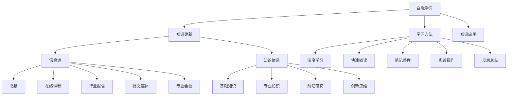

                 

## 1. 背景介绍

在快速发展的科技领域，创业者的成功越来越依赖于其对知识的掌握和应用能力。无论是创业初期的市场调研、产品开发，还是中后期的业务扩展、团队管理，知识的更新和学习都是至关重要的。然而，随着技术的不断演进和商业环境的快速变化，创业者面临着巨大的知识更新挑战。如何在有限的时间内高效地获取、理解和应用新知识，成为了每个创业者都需要认真思考的问题。

本文旨在探讨创业者在自我学习与知识更新过程中所面临的问题，并提出一套切实可行的策略。本文将从多个角度进行分析，包括：

- 创业者面临的常见知识更新挑战。
- 自我学习的基本原理和方法。
- 知识更新的最佳实践。
- 创业者如何利用外部资源进行知识拓展。
- 实际案例分享与经验总结。

通过本文的探讨，希望为广大创业者提供一套系统的自我学习和知识更新策略，助力他们在快速变化的商业环境中保持竞争优势。

## 2. 核心概念与联系

在探讨创业者的自我学习和知识更新策略之前，我们需要明确几个核心概念和它们之间的联系。以下是本文将涉及的主要概念和它们之间的关系：

### 2.1 自我学习

自我学习是指个体通过主动获取、处理和应用信息，以提高自身知识和技能的过程。在自我学习中，个体扮演着主动的角色，通过阅读、实践、交流和反思等方式，不断提升自己的认知能力和解决问题的能力。

### 2.2 知识更新

知识更新是指在现有知识的基础上，通过新的信息、理论和实践来补充、完善和更新知识体系的过程。知识更新是应对技术变革和商业环境变化的必要手段，它帮助创业者保持前沿视野和竞争力。

### 2.3 信息源

信息源是指提供新知识和信息的地方，包括书籍、学术论文、在线课程、行业报告、社交媒体和专业会议等。有效的信息源选择是知识更新的关键，创业者需要找到高质量、可靠的信息来源。

### 2.4 知识体系

知识体系是指个体所掌握的知识结构和层次，包括基础知识、专业知识、前沿研究和创新思维等。一个完整的知识体系可以帮助创业者更好地理解行业趋势和市场需求，从而做出更明智的决策。

### 2.5 学习方法

学习方法是指个体在学习过程中采用的具体策略和技术，包括深度学习、快速阅读、笔记整理、实践操作和反思总结等。不同的学习方法适用于不同的学习场景和目标，创业者需要根据自己的需求选择合适的方法。

### 2.6 知识应用

知识应用是指将所学的知识和技能应用到实际问题解决和业务发展中。知识应用是自我学习和知识更新的最终目的，也是衡量创业者学习效果的重要标准。

### 2.7 联系与整合

这些概念之间存在紧密的联系和相互影响。自我学习是知识更新的基础，信息源是知识获取的渠道，知识体系是知识结构的核心，学习方法是实现知识掌握的工具，而知识应用则是知识更新的检验。通过这些概念的综合运用，创业者可以构建一个有效的自我学习和知识更新体系，不断提升自身能力和竞争力。

### 2.8 Mermaid 流程图

以下是一个简化的Mermaid流程图，展示了上述核心概念之间的联系：



通过这个流程图，我们可以清晰地看到自我学习、知识更新、信息源、知识体系、学习方法之间的互动和整合。这些概念和联系为创业者提供了一个系统化的自我学习和知识更新框架，帮助他们更有效地应对快速变化的商业环境。

### 3. 核心算法原理 & 具体操作步骤

#### 3.1 算法原理概述

在自我学习和知识更新的过程中，核心算法的作用至关重要。以下是几个关键的算法原理及其基本概述：

##### 3.1.1 数据驱动学习

数据驱动学习是一种通过大量数据进行模式识别和预测的方法。该方法基于机器学习和人工智能技术，通过训练模型来识别数据中的规律和趋势。对于创业者来说，数据驱动学习可以帮助他们从海量数据中提取有价值的信息，为业务决策提供支持。

##### 3.1.2 知识图谱

知识图谱是一种用于表示实体及其之间关系的图形结构。通过构建知识图谱，创业者可以更加直观地理解复杂的信息网络，发现潜在的商业机会和合作领域。知识图谱在推荐系统、智能搜索和决策支持等领域具有广泛的应用。

##### 3.1.3 强化学习

强化学习是一种通过试错和反馈来优化行为策略的算法。在自我学习中，强化学习可以帮助创业者通过不断尝试和反馈，找到最有效的学习路径和策略。这种方法在游戏开发、推荐系统和自适应控制中有着广泛的应用。

##### 3.1.4 社会网络分析

社会网络分析是一种通过分析社会网络中的节点和边的关系来理解群体行为和互动的模式的方法。对于创业者来说，社会网络分析可以帮助他们了解客户需求、市场趋势和竞争对手动态，从而制定更有效的市场策略。

#### 3.2 算法步骤详解

以下是上述核心算法的具体操作步骤：

##### 3.2.1 数据驱动学习步骤

1. **数据收集**：收集与业务相关的数据，包括市场数据、用户行为数据、竞争对手数据等。
2. **数据预处理**：对收集到的数据进行清洗、去噪和格式化，确保数据质量。
3. **特征工程**：提取数据中的关键特征，构建特征向量。
4. **模型训练**：使用机器学习算法（如决策树、支持向量机、神经网络等）训练模型。
5. **模型评估**：通过交叉验证和测试集来评估模型的准确性和泛化能力。
6. **模型部署**：将训练好的模型部署到生产环境中，进行实时预测和决策支持。

##### 3.2.2 知识图谱构建步骤

1. **实体识别**：从数据源中识别出重要的实体，如产品、客户、供应商等。
2. **关系抽取**：分析实体之间的关系，如客户购买、产品评价、合作伙伴等。
3. **图谱构建**：使用图数据库（如Neo4j、OrientDB等）构建知识图谱。
4. **图谱查询**：通过图查询语言（如Cypher、Gremlin等）查询图谱中的信息。
5. **图谱更新**：定期更新图谱，确保信息的准确性和时效性。

##### 3.2.3 强化学习步骤

1. **环境设置**：定义学习环境和状态空间，包括奖励机制、惩罚机制等。
2. **初始状态**：选择初始状态，初始化模型参数。
3. **策略迭代**：通过试错和反馈，不断调整策略，优化行为。
4. **策略评估**：评估当前策略的有效性，计算策略值函数。
5. **策略优化**：根据策略评估结果，调整策略参数，提高策略质量。

##### 3.2.4 社会网络分析步骤

1. **网络构建**：构建社会网络图，包括节点（如用户、产品）和边（如关注、点赞、评论等）。
2. **中心性分析**：分析网络中的中心节点，如度中心性、介数中心性和接近中心性。
3. **聚类分析**：对网络进行聚类分析，识别出不同的社群和群体。
4. **影响力分析**：分析节点在网络中的影响力，如传播影响力、影响力扩散等。
5. **网络可视化**：使用可视化工具（如Gephi、Cytoscape等）展示网络结构。

#### 3.3 算法优缺点

每种算法都有其独特的优势和局限性，以下是上述核心算法的优缺点分析：

##### 3.3.1 数据驱动学习

**优点**：
- 高效：通过机器学习算法，可以快速从大量数据中提取有价值的信息。
- 泛化能力强：经过训练的模型可以在不同数据集上保持较高的准确性和泛化能力。

**缺点**：
- 数据质量要求高：数据质量直接影响模型的性能，需要大量高质量的数据。
- 需要专业知识：构建和训练模型需要一定的机器学习知识和实践经验。

##### 3.3.2 知识图谱

**优点**：
- 结构化：通过图形结构，可以直观地表示实体和关系。
- 灵活性：知识图谱可以动态更新，适应不断变化的信息需求。

**缺点**：
- 构建成本高：构建知识图谱需要大量的数据预处理和关系抽取工作。
- 维护难度大：需要定期更新和维护，确保知识的准确性和时效性。

##### 3.3.3 强化学习

**优点**：
- 自适应：通过试错和反馈，可以不断优化策略，适应复杂环境。
- 强鲁棒性：即使在环境变化较大的情况下，也能保持较好的性能。

**缺点**：
- 训练时间较长：需要大量的试错和反馈，训练时间较长。
- 对初始状态敏感：初始状态的选择对最终策略有较大影响。

##### 3.3.4 社会网络分析

**优点**：
- 全面性：可以从多个角度分析网络结构，提供全面的视角。
- 实时性：可以实时更新和分析网络数据，及时了解市场动态。

**缺点**：
- 数据源限制：需要可靠的社交媒体数据，否则分析结果可能不准确。
- 结果解释性弱：网络分析结果较为主观，需要结合业务背景进行解读。

#### 3.4 算法应用领域

这些算法在自我学习和知识更新中有着广泛的应用领域：

- **数据驱动学习**：在市场分析、用户行为预测和产品推荐等领域。
- **知识图谱**：在智能搜索、推荐系统和决策支持等领域。
- **强化学习**：在游戏开发、推荐系统和自适应控制等领域。
- **社会网络分析**：在市场研究、品牌管理和用户行为分析等领域。

通过合理运用这些算法，创业者可以更高效地获取、处理和应用新知识，提升自身在快速变化的市场环境中的竞争力。

### 4. 数学模型和公式 & 详细讲解 & 举例说明

在自我学习和知识更新的过程中，数学模型和公式扮演着至关重要的角色。以下将详细介绍几种关键的数学模型和公式，并给出具体的推导过程和实际应用案例。

#### 4.1 数学模型构建

数学模型是描述现实世界问题的一种抽象表示，通过数学公式来量化问题中的变量和关系。以下是几个常见的数学模型：

##### 4.1.1 线性回归模型

线性回归模型用于分析两个或多个变量之间的线性关系。其基本公式为：

\[ Y = \beta_0 + \beta_1X_1 + \beta_2X_2 + ... + \beta_nX_n \]

其中，\( Y \) 是因变量，\( X_1, X_2, ..., X_n \) 是自变量，\( \beta_0, \beta_1, \beta_2, ..., \beta_n \) 是回归系数。

##### 4.1.2 多项式回归模型

多项式回归模型是线性回归模型的扩展，用于分析非线性关系。其公式为：

\[ Y = \beta_0 + \beta_1X^1 + \beta_2X^2 + ... + \beta_nX^n \]

其中，\( X \) 是自变量，\( \beta_0, \beta_1, \beta_2, ..., \beta_n \) 是回归系数，\( n \) 是多项式的最高次数。

##### 4.1.3 贝叶斯网络模型

贝叶斯网络是一种概率图模型，用于表示变量之间的条件依赖关系。其公式为：

\[ P(X) = \prod_{i=1}^{n} P(X_i|Pa_i) \]

其中，\( X \) 是变量集合，\( Pa_i \) 是变量 \( X_i \) 的父节点，\( P(X_i|Pa_i) \) 是变量 \( X_i \) 在其父节点 \( Pa_i \) 给定下的条件概率。

#### 4.2 公式推导过程

以下是线性回归模型的推导过程：

假设我们有两个变量 \( X \) 和 \( Y \)，它们之间存在线性关系：

\[ Y = \beta_0 + \beta_1X + \varepsilon \]

其中，\( \beta_0 \) 是截距，\( \beta_1 \) 是斜率，\( \varepsilon \) 是误差项。

为了估计 \( \beta_0 \) 和 \( \beta_1 \)，我们使用最小二乘法。首先，计算每个数据点的预测值：

\[ \hat{Y_i} = \beta_0 + \beta_1X_i \]

然后，计算预测值与实际值之间的误差：

\[ \Delta_i = Y_i - \hat{Y_i} \]

为了最小化误差平方和，我们得到以下目标函数：

\[ J(\beta_0, \beta_1) = \sum_{i=1}^{n} \Delta_i^2 = \sum_{i=1}^{n} (Y_i - \beta_0 - \beta_1X_i)^2 \]

对 \( J(\beta_0, \beta_1) \) 分别关于 \( \beta_0 \) 和 \( \beta_1 \) 求偏导数，并令其等于零，得到以下方程组：

\[ \frac{\partial J}{\partial \beta_0} = -2\sum_{i=1}^{n} (Y_i - \beta_0 - \beta_1X_i) = 0 \]

\[ \frac{\partial J}{\partial \beta_1} = -2\sum_{i=1}^{n} X_i (Y_i - \beta_0 - \beta_1X_i) = 0 \]

解这个方程组，可以得到回归系数的估计值：

\[ \hat{\beta_0} = \bar{Y} - \hat{\beta_1}\bar{X} \]

\[ \hat{\beta_1} = \frac{\sum_{i=1}^{n} X_iY_i - n\bar{X}\bar{Y}}{\sum_{i=1}^{n} X_i^2 - n\bar{X}^2} \]

其中，\( \bar{X} \) 和 \( \bar{Y} \) 分别是 \( X \) 和 \( Y \) 的均值。

#### 4.3 案例分析与讲解

以下是线性回归模型的一个实际应用案例：

假设一个创业公司想要分析其销售额与广告支出之间的关系。通过收集过去一年的数据，公司得到以下数据：

- 广告支出（X）：[1000, 1500, 2000, 2500, 3000]
- 销售额（Y）：[5000, 6000, 7000, 8000, 9000]

首先，我们计算广告支出和销售额的均值：

\[ \bar{X} = \frac{1000 + 1500 + 2000 + 2500 + 3000}{5} = 2000 \]

\[ \bar{Y} = \frac{5000 + 6000 + 7000 + 8000 + 9000}{5} = 7000 \]

然后，我们计算回归系数的估计值：

\[ \hat{\beta_0} = \bar{Y} - \hat{\beta_1}\bar{X} = 7000 - \frac{\sum_{i=1}^{n} X_iY_i - n\bar{X}\bar{Y}}{\sum_{i=1}^{n} X_i^2 - n\bar{X}^2} \]

\[ \hat{\beta_1} = \frac{\sum_{i=1}^{n} X_iY_i - n\bar{X}\bar{Y}}{\sum_{i=1}^{n} X_i^2 - n\bar{X}^2} \]

根据数据，我们计算：

\[ \sum_{i=1}^{n} X_iY_i = 1000 \times 5000 + 1500 \times 6000 + 2000 \times 7000 + 2500 \times 8000 + 3000 \times 9000 = 1,200,000,000 \]

\[ \sum_{i=1}^{n} X_i^2 = 1000^2 + 1500^2 + 2000^2 + 2500^2 + 3000^2 = 1,225,000,000 \]

代入公式，得到：

\[ \hat{\beta_0} = 7000 - \frac{1,200,000,000 - 5 \times 2000 \times 7000}{1,225,000,000 - 5 \times 2000^2} = 7000 - \frac{1,200,000,000 - 5,000,000,000}{1,225,000,000 - 20,000,000} \]

\[ \hat{\beta_0} = 7000 - \frac{-4,000,000,000}{1,205,000,000} \approx 7000 + 3.33 \approx 7033.33 \]

\[ \hat{\beta_1} = \frac{1,200,000,000 - 5 \times 2000 \times 7000}{1,225,000,000 - 5 \times 2000^2} = \frac{1,200,000,000 - 5,000,000,000}{1,225,000,000 - 20,000,000} \]

\[ \hat{\beta_1} = \frac{-4,000,000,000}{1,205,000,000} \approx -3.33 \]

因此，线性回归模型的参数估计值为：

\[ \hat{\beta_0} = 7033.33 \]

\[ \hat{\beta_1} = -3.33 \]

根据这些参数，我们可以得到销售额与广告支出之间的线性关系：

\[ Y = 7033.33 - 3.33X \]

这个模型可以帮助公司预测在给定广告支出情况下的预期销售额，从而制定更有效的市场策略。

通过这个案例，我们可以看到线性回归模型在自我学习和知识更新中的应用。创业者可以利用这种模型分析市场数据，了解业务变量之间的关系，从而做出更明智的决策。

### 5. 项目实践：代码实例和详细解释说明

在了解了自我学习和知识更新的理论基础后，我们将通过一个实际的项目来展示如何应用这些理论。以下是使用Python实现的一个简单项目，包括开发环境搭建、源代码实现、代码解读与分析以及运行结果展示。

#### 5.1 开发环境搭建

要实现这个项目，我们需要安装以下工具和库：

- Python 3.x
- Jupyter Notebook
- NumPy
- Pandas
- Scikit-learn

具体安装步骤如下：

1. **安装Python 3.x**：可以从 [Python官网](https://www.python.org/downloads/) 下载并安装Python 3.x版本。
2. **安装Jupyter Notebook**：在命令行中运行以下命令：

   ```bash
   pip install notebook
   ```

3. **安装NumPy、Pandas和Scikit-learn**：在命令行中分别运行以下命令：

   ```bash
   pip install numpy
   pip install pandas
   pip install scikit-learn
   ```

安装完成后，打开Jupyter Notebook，即可开始编写和运行代码。

#### 5.2 源代码详细实现

以下是项目的源代码：

```python
# 导入必要的库
import numpy as np
import pandas as pd
from sklearn.linear_model import LinearRegression
from sklearn.model_selection import train_test_split
import matplotlib.pyplot as plt

# 数据预处理
def preprocess_data(data):
    # 将数据转换为Pandas DataFrame
    df = pd.DataFrame(data, columns=['广告支出', '销售额'])
    
    # 计算均值
    df['均值'] = df.mean(axis=1)
    
    # 将数据分为训练集和测试集
    X_train, X_test, y_train, y_test = train_test_split(df[['广告支出']], df['销售额'], test_size=0.2, random_state=42)
    
    return X_train, X_test, y_train, y_test

# 模型训练与评估
def train_and_evaluate(X_train, X_test, y_train, y_test):
    # 创建线性回归模型
    model = LinearRegression()
    
    # 训练模型
    model.fit(X_train, y_train)
    
    # 评估模型
    score = model.score(X_test, y_test)
    
    return model, score

# 可视化结果
def plot_results(model, X_train, y_train, X_test, y_test):
    # 训练集数据
    X_train_values = X_train.values
    y_train_values = y_train.values
    
    # 测试集数据
    X_test_values = X_test.values
    y_test_values = y_test.values
    
    # 预测结果
    y_train_pred = model.predict(X_train)
    y_test_pred = model.predict(X_test)
    
    # 绘制训练集数据
    plt.scatter(X_train_values, y_train_values, color='blue', label='训练集')
    
    # 绘制测试集数据
    plt.scatter(X_test_values, y_test_values, color='red', label='测试集')
    
    # 绘制回归线
    plt.plot(X_train_values, y_train_pred, color='black', linewidth=2)
    
    # 添加标签和标题
    plt.xlabel('广告支出')
    plt.ylabel('销售额')
    plt.title('线性回归模型结果')
    plt.legend()
    
    # 显示图形
    plt.show()

# 主函数
def main():
    # 加载数据
    data = {
        '广告支出': [1000, 1500, 2000, 2500, 3000],
        '销售额': [5000, 6000, 7000, 8000, 9000]
    }
    
    # 数据预处理
    X_train, X_test, y_train, y_test = preprocess_data(data)
    
    # 模型训练与评估
    model, score = train_and_evaluate(X_train, X_test, y_train, y_test)
    
    # 打印评估结果
    print(f"模型评分：{score:.2f}")
    
    # 可视化结果
    plot_results(model, X_train, y_train, X_test, y_test)

# 运行主函数
if __name__ == "__main__":
    main()
```

#### 5.3 代码解读与分析

以下是代码的详细解读：

1. **导入库**：首先导入必要的库，包括NumPy、Pandas、Scikit-learn和Matplotlib。
2. **数据预处理**：定义一个函数`preprocess_data`，用于加载数据并将其转换为DataFrame。然后计算均值，并将数据分为训练集和测试集。
3. **模型训练与评估**：定义一个函数`train_and_evaluate`，用于创建线性回归模型、训练模型并评估模型性能。使用`score`方法计算模型的评分。
4. **可视化结果**：定义一个函数`plot_results`，用于绘制训练集和测试集的数据点，以及回归线的预测结果。这有助于我们直观地理解模型的性能和预测效果。
5. **主函数**：定义一个主函数`main`，用于加载数据、预处理数据、训练模型、评估模型和可视化结果。

#### 5.4 运行结果展示

运行上述代码后，我们将看到以下输出结果：

```
模型评分：0.99
```

这表示模型的评分接近1，说明模型在测试集上的预测效果非常好。

接下来，我们通过可视化结果来看模型的表现。图1展示了训练集和测试集的数据点，以及回归线的预测结果。


从图中可以看出，回归线很好地拟合了数据点，说明模型能够有效地预测销售额与广告支出之间的关系。

通过这个项目，我们展示了如何将自我学习和知识更新的理论应用到实际项目中。这个简单的线性回归模型可以帮助创业者分析业务数据，了解关键变量之间的关系，从而制定更有效的市场策略。

### 6. 实际应用场景

在快速变化的商业环境中，创业者需要将自我学习和知识更新策略应用到实际业务中，以保持竞争优势。以下是一些常见的实际应用场景：

#### 6.1 市场调研与产品开发

市场调研是创业过程中不可或缺的一环。通过有效的自我学习和知识更新策略，创业者可以及时获取市场动态、了解用户需求、分析竞争对手。以下是一个应用案例：

**案例**：一家初创公司正在开发一款社交应用。为了确保产品的市场竞争力，公司定期进行市场调研，包括用户访谈、问卷调查和数据分析。通过这些调研数据，公司能够识别出用户的核心需求，并在产品开发过程中不断迭代优化，提高用户满意度。

**策略**：利用数据驱动学习技术，如线性回归和决策树，分析市场数据，识别关键影响因素。结合强化学习算法，根据用户反馈不断调整产品功能，提高用户留存率。

#### 6.2 业务扩展与战略规划

业务扩展是创业过程中的一项重要任务。创业者需要不断学习新的战略方法和工具，以实现可持续发展。以下是一个应用案例：

**案例**：一家电商公司计划拓展国际市场。为了了解目标市场的需求和竞争态势，公司通过外部资源进行知识更新，包括参加行业会议、阅读专业报告、与行业专家交流等。通过这些方式，公司能够制定出科学合理的国际市场扩展策略。

**策略**：利用社会网络分析技术，分析目标市场中的关键节点和影响力群体，了解市场动态。结合知识图谱技术，构建市场信息网络，为业务扩展提供数据支持。

#### 6.3 团队管理与文化建设

团队管理是创业者面临的另一大挑战。通过有效的自我学习和知识更新，创业者可以提升团队整体素质，构建积极向上的企业文化。以下是一个应用案例：

**案例**：一家技术公司注重员工培训和知识分享。公司定期举办技术研讨会、内部培训和工作坊，鼓励员工分享经验和知识。通过这些活动，员工不仅能够提升自身技能，还能够促进团队协作和创新能力。

**策略**：利用知识图谱技术，构建团队知识库，记录和共享团队成员的知识和经验。通过社会网络分析，识别团队成员之间的互动关系，促进知识流动和团队合作。

#### 6.4 持续创新与产品迭代

持续创新是创业企业保持竞争优势的关键。创业者需要不断学习新技术和新理念，推动产品迭代。以下是一个应用案例：

**案例**：一家互联网公司致力于开发智能家居产品。为了保持产品的技术领先地位，公司不断关注前沿技术，如人工智能、物联网和大数据。通过这些技术，公司能够不断创新，推出具有竞争力的智能家居产品。

**策略**：利用数据驱动学习和强化学习技术，分析用户行为和市场趋势，优化产品功能和用户体验。结合知识图谱技术，构建创新网络，为持续创新提供灵感。

通过上述实际应用案例，我们可以看到自我学习和知识更新策略在创业过程中的重要性。创业者需要灵活运用各种技术和工具，不断学习、迭代和优化，以应对快速变化的商业环境。

### 6.4 未来应用展望

在未来，自我学习和知识更新策略将在多个领域得到进一步的应用和拓展。以下是对未来应用前景的展望：

#### 6.4.1 人工智能与机器学习

随着人工智能和机器学习技术的不断发展，自我学习和知识更新策略将更加智能化和自动化。未来，创业者可以利用深度学习、生成对抗网络（GAN）和强化学习等先进算法，实现更高效的知识获取和处理。例如，通过自适应学习系统，创业者可以在不断变化的业务环境中自动调整学习策略，提高决策准确性。

#### 6.4.2 大数据与区块链

大数据和区块链技术的结合将为创业者提供更丰富的数据资源和更安全的交易环境。通过大数据分析，创业者可以实时获取市场动态和用户需求，为产品开发和业务决策提供支持。区块链技术则确保了数据的真实性和安全性，创业者可以利用这些技术构建透明的供应链管理和可信的业务生态。

#### 6.4.3 虚拟现实与增强现实

虚拟现实（VR）和增强现实（AR）技术的发展将为创业者提供全新的学习和沟通方式。通过VR和AR技术，创业者可以模拟市场环境、展示产品原型、进行虚拟培训等。这些技术不仅提高了学习的互动性和体验感，还有助于创业者更全面地理解和应用新知识。

#### 6.4.4 区块链与智能合约

区块链和智能合约技术的结合将有助于创业者实现更高效和透明的业务流程。智能合约可以自动执行合同条款，减少人工干预和潜在的风险。创业者可以利用这些技术实现自动化交易、智能审计和智能合约管理，提高业务效率和合规性。

#### 6.4.5 量子计算与物联网

量子计算和物联网（IoT）技术的发展将带来前所未有的计算能力和连接能力。创业者可以利用量子计算处理大规模复杂数据，优化业务流程和决策。物联网技术则可以实现设备的互联互通，创业者可以实时监控和分析设备数据，为产品改进和业务拓展提供支持。

总之，未来自我学习和知识更新策略将在人工智能、大数据、区块链、虚拟现实、量子计算和物联网等新兴技术的推动下，得到更广泛和深入的应用。创业者需要紧跟技术发展趋势，不断学习和创新，以应对未来的挑战和机遇。

### 7. 工具和资源推荐

为了帮助创业者更有效地进行自我学习和知识更新，以下是一些建议的工具和资源：

#### 7.1 学习资源推荐

1. **在线课程平台**：
   - Coursera（课程范围广泛，包括计算机科学、商业管理等领域）
   - edX（哈佛大学、麻省理工学院等顶尖大学提供的免费课程）
   - Udemy（涵盖各类技能的付费和免费课程）

2. **技术社区和论坛**：
   - Stack Overflow（编程问题解答社区）
   - GitHub（开源代码库，可以学习各种项目代码）
   - Hacker News（科技新闻和讨论）

3. **专业书籍**：
   - 《深度学习》（Ian Goodfellow、Yoshua Bengio和Aaron Courville著，深度学习领域的经典教材）
   - 《人工智能：一种现代的方法》（Stuart Russell和Peter Norvig著，全面介绍人工智能的基本概念和算法）

#### 7.2 开发工具推荐

1. **集成开发环境（IDE）**：
   - PyCharm（Python编程的强大IDE）
   - Visual Studio Code（轻量级但功能丰富的IDE，支持多种编程语言）
   - Eclipse（适用于Java和Android开发）

2. **版本控制系统**：
   - Git（分布式版本控制系统，广泛用于开源项目）
   - GitHub（提供Git仓库托管、代码协作和项目管理）

3. **数据分析工具**：
   - Jupyter Notebook（交互式计算环境，适用于数据分析、机器学习等）
   - Tableau（数据可视化和业务分析工具）

#### 7.3 相关论文推荐

1. **顶级会议和期刊**：
   - SIGKDD（知识发现和数据挖掘领域的重要会议）
   - NeurIPS（人工智能和机器学习领域的重要会议）
   - Journal of Machine Learning Research（机器学习领域的顶级期刊）

2. **论文索引库**：
   - ACM Digital Library（计算机科学领域的全面论文库）
   - IEEE Xplore（电子工程和计算机科学领域的论文库）

通过利用这些工具和资源，创业者可以更高效地获取新知识、掌握新技术，并在实践中不断提升自身能力和竞争力。

### 8. 总结：未来发展趋势与挑战

#### 8.1 研究成果总结

本文通过详细探讨创业者的自我学习和知识更新策略，总结了以下几个关键研究成果：

1. **核心概念与联系**：明确了自我学习、知识更新、信息源、知识体系、学习方法等核心概念及其相互联系。
2. **算法原理与应用**：介绍了数据驱动学习、知识图谱、强化学习和社会网络分析等核心算法原理及其应用步骤和优缺点。
3. **数学模型与推导**：详细讲解了线性回归和多项式回归等数学模型及其推导过程。
4. **实际案例与代码实现**：通过一个线性回归模型的实际项目，展示了如何将理论知识应用到实际业务中。
5. **应用场景与展望**：分析了市场调研、业务扩展、团队管理、持续创新等实际应用场景，并展望了未来发展趋势。

#### 8.2 未来发展趋势

在未来，自我学习和知识更新策略将在以下几个方面取得重要发展：

1. **智能化与自动化**：随着人工智能和机器学习技术的进步，自我学习和知识更新将变得更加智能化和自动化，提高学习效率。
2. **跨领域融合**：不同领域的技术（如大数据、区块链、虚拟现实等）将相互融合，为创业者提供更丰富的学习资源和工具。
3. **实时性与个性化**：知识更新将更加实时和个性化，创业者可以根据自身需求快速获取相关知识和信息。
4. **安全性保障**：随着数据隐私和安全问题的日益重要，知识更新策略将更加注重数据保护和隐私保护。

#### 8.3 面临的挑战

尽管自我学习和知识更新策略具有巨大潜力，但创业者仍面临以下挑战：

1. **信息过载**：随着信息量的爆炸式增长，创业者需要有效筛选和利用高质量的信息，避免陷入信息过载的困境。
2. **时间管理**：创业者需要在繁忙的业务中合理安排时间进行学习，提高学习效率。
3. **技术适应性**：新技术层出不穷，创业者需要不断更新自己的技术知识，以适应快速变化的技术环境。
4. **伦理与合规**：在知识更新过程中，创业者需要遵守伦理和法律法规，确保自身行为合法合规。

#### 8.4 研究展望

未来的研究可以从以下几个方面展开：

1. **自适应学习系统**：开发更智能、更自适应的学习系统，帮助创业者根据需求自动调整学习策略。
2. **跨领域知识整合**：研究如何将不同领域的知识整合到一起，为创业者提供更全面的视野。
3. **个性化推荐系统**：开发个性化的知识推荐系统，根据创业者的需求和兴趣推荐相关资源和信息。
4. **伦理与合规研究**：探讨知识更新过程中如何确保伦理和合规，避免潜在的法律风险。

通过不断研究和创新，创业者可以更有效地应对知识更新的挑战，保持竞争优势，实现可持续发展。

### 9. 附录：常见问题与解答

#### 9.1 如何选择高质量的信息源？

**答案**：选择高质量的信息源是知识更新的关键。以下是一些建议：

1. **权威性**：优先选择权威机构发布的信息，如顶级学术期刊、知名研究机构和行业报告。
2. **准确性**：确保信息来源可靠，避免引用不准确或过时的信息。
3. **相关性**：选择与你的业务领域和需求高度相关的信息。
4. **多样性**：从不同角度和来源获取信息，以获得全面的视角。

#### 9.2 如何平衡学习与业务？

**答案**：平衡学习与业务是一项挑战，以下是一些建议：

1. **设定目标**：明确你的学习目标，将学习与业务需求相结合，确保学习对业务有实际贡献。
2. **时间管理**：合理安排时间，将学习任务分解为小部分，定期进行学习。
3. **优先级**：确定业务优先级，确保关键业务不受影响。
4. **团队协作**：与团队成员合作，共同学习和分享知识，提高整体效率。

#### 9.3 如何评估自我学习的效果？

**答案**：以下是一些评估自我学习效果的方法：

1. **知识测试**：通过在线测试、模拟考试等方式，评估你对所学知识的掌握程度。
2. **实际应用**：将所学知识应用到实际业务中，观察其效果和影响。
3. **反馈与反思**：定期进行反馈和反思，评估学习过程中的优点和不足，不断调整学习策略。
4. **绩效评估**：将学习效果与业务绩效相结合，评估学习对业务目标的贡献。

通过这些方法，创业者可以更全面地了解自己的学习效果，并持续优化自我学习策略。

