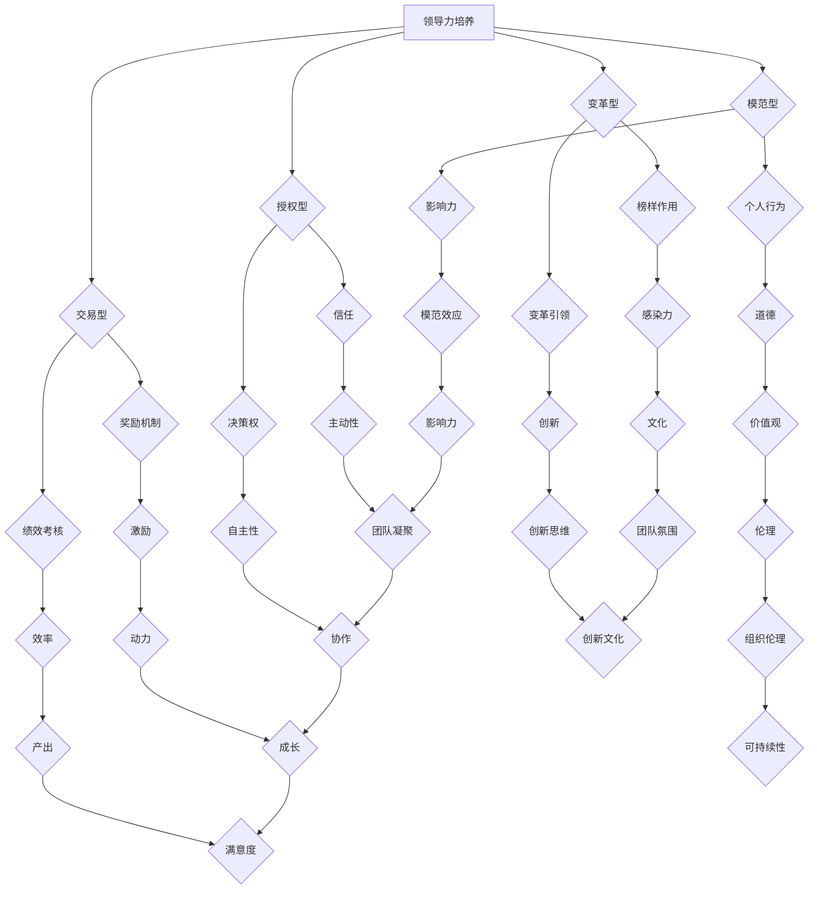

                 

 > **关键词**: 创业者，领导力，团队管理，技术领导，团队协作

> **摘要**: 本文旨在探讨创业者在成长过程中如何培养自己的领导力，以及如何运用有效的团队管理技巧来打造高效团队。通过分析领导力的核心要素、团队管理的策略和实例，本文为创业者提供了实用的指导，帮助他们在竞争激烈的市场中脱颖而出。

## 1. 背景介绍

在当今快速变化的市场环境中，创业不再是少数人的专利，而成为一种趋势。越来越多的年轻人、专业人士和传统行业转型者投身于创业大潮中。然而，创业的成功不仅仅取决于商业模式的创新或技术突破，更重要的是创业者的领导力以及如何管理团队。

领导力是创业者成功的关键因素之一。一个优秀的领导者能够激发团队的潜力，实现团队协作的最大化。团队管理则是领导者的重要职责，包括团队的组织、激励、沟通和冲突解决等方面。有效的团队管理不仅能提升团队的工作效率，还能增强团队的凝聚力，为创业企业的长远发展奠定基础。

本文将从以下几个方面展开讨论：

1. **领导力的核心要素**：分析领导力的本质及其在创业过程中的重要性。
2. **团队管理的策略**：探讨团队管理的原则、方法及其在实践中的应用。
3. **案例与实践**：通过具体案例，展示成功的领导力和团队管理实践。
4. **未来趋势与挑战**：分析创业领导力和团队管理面临的挑战及其未来发展。

希望通过本文的探讨，能够为创业者提供一些有价值的启示和指导，帮助他们在创业的道路上走得更远。

## 2. 核心概念与联系

### 2.1. 领导力的定义与分类

领导力（Leadership）是一种影响和激励他人为实现共同目标而努力的能力。根据不同的分类方法，领导力可以分为以下几种类型：

- **交易型领导力**：通过奖励和惩罚来激励团队，注重短期绩效。
- **变革型领导力**：通过愿景激励和变革引领，激发团队成员的潜能。
- **模范型领导力**：通过个人的行为和榜样作用来影响他人。
- **授权型领导力**：信任团队成员，给予他们决策权和责任感。

这些不同类型的领导力在不同的情境下都有其适用的场景，创业者在实际操作中需要灵活运用，以实现最佳效果。

### 2.2. 团队管理的定义与目标

团队管理（Team Management）是指通过规划、组织、领导、控制和协调等方式，确保团队高效实现组织目标的过程。团队管理的目标包括：

- 提高团队的工作效率。
- 增强团队的凝聚力和协作能力。
- 实现团队成员的个人成长和职业发展。

团队管理不仅关注团队的整体表现，还要注重个体的发展和满意度，以达到团队和个人的双赢。

### 2.3. 领导力与团队管理的关系

领导力与团队管理是相辅相成的。领导力是团队管理的核心，决定了团队管理的方向和效果。而团队管理则为领导力的实施提供了平台和保障。有效的领导力需要通过科学的团队管理来实现，二者共同构成了创业成功的关键因素。

#### 2.4. Mermaid 流程图



该流程图展示了领导力的不同类型及其与团队管理目标之间的关系，通过 Mermaid 语言实现了流程图的清晰展示。

## 3. 核心算法原理 & 具体操作步骤

### 3.1. 算法原理概述

在创业领导力和团队管理中，我们引入了一种被称为“领导力-团队管理矩阵”的核心算法。该算法基于以下基本原理：

- **领导力模型**：将领导力分为四大类型，并分析每种类型在团队管理中的适用性。
- **团队管理模型**：将团队管理分为五个关键目标，并探讨如何实现这些目标。

### 3.2. 算法步骤详解

**步骤 1: 确定领导力类型**

- **评估当前领导力水平**：通过自我评估、360度反馈等方式，了解自己的领导风格。
- **分析团队需求**：根据团队的特点和目标，选择最适合的领导力类型。

**步骤 2: 设定团队管理目标**

- **制定团队目标**：确保团队目标与组织目标一致，并具体、可衡量。
- **分解目标**：将总目标分解为可执行的小目标，便于管理和追踪。

**步骤 3: 实施团队管理策略**

- **建立信任**：通过开放沟通、透明决策等方式，建立团队成员之间的信任。
- **激励与反馈**：运用奖励机制、绩效评估等方式，激励团队成员。
- **持续改进**：定期评估团队管理效果，并根据反馈进行调整。

**步骤 4: 评估与反馈**

- **评估团队绩效**：通过量化和定性的方法，评估团队的工作效率和成果。
- **收集反馈**：定期收集团队成员的反馈，了解团队的改进需求。

### 3.3. 算法优缺点

#### 优点：

- **灵活性强**：根据不同的团队需求，选择合适的领导力类型。
- **系统性**：将领导力和团队管理有机结合，实现整体优化。
- **可操作性**：具体的操作步骤便于实践和应用。

#### 缺点：

- **评估难度**：准确评估领导力和团队管理水平有一定难度。
- **实施成本**：需要投入时间和资源进行培训和评估。

### 3.4. 算法应用领域

该算法适用于各种类型的创业团队，特别是在创业初期和快速发展阶段，能够帮助创业者快速提升领导力和团队管理水平。

## 4. 数学模型和公式 & 详细讲解 & 举例说明

### 4.1. 数学模型构建

在创业领导力和团队管理中，我们引入了一个简单的数学模型，用于评估领导力和团队管理的效果。该模型基于以下公式：

\[ \text{领导力效果} = f(\text{领导力类型}, \text{团队管理目标}, \text{团队绩效}) \]

其中：

- \( \text{领导力类型} \) 表示创业者的领导力风格。
- \( \text{团队管理目标} \) 表示团队的目标和计划。
- \( \text{团队绩效} \) 表示团队的工作效率和成果。

### 4.2. 公式推导过程

为了推导上述公式，我们可以采用以下步骤：

1. **确定领导力类型**：根据创业者的特点，选择一种领导力类型，如变革型领导力。
2. **设定团队管理目标**：根据团队的实际情况，设定具体的管理目标，如提高工作效率和团队凝聚力。
3. **计算团队绩效**：通过定性和定量的方法，评估团队的工作效率和成果。

根据这些步骤，我们可以得到一个简单的推导过程：

\[ f(\text{变革型}, \text{提高工作效率}, \text{团队绩效}) = \text{变革型领导力} \times \text{工作效率目标} \times \text{团队绩效} \]

### 4.3. 案例分析与讲解

假设一位创业者选择变革型领导力，并设定了提高工作效率和团队凝聚力的目标。通过以下案例，我们可以看到这个公式在实际中的应用：

**案例**：某创业团队在变革型领导力的引导下，设定了以下目标：

- **工作效率目标**：提高 20%。
- **团队绩效**：达成项目目标。

根据公式：

\[ \text{领导力效果} = \text{变革型领导力} \times 20\% \times \text{项目目标达成率} \]

如果团队在一个月内实现了工作效率提高 20%，项目目标达成率为 90%，则：

\[ \text{领导力效果} = \text{变革型领导力} \times 20\% \times 90\% = 1.8 \]

这个结果表明，变革型领导力在提高团队工作效率和绩效方面取得了显著效果。

## 5. 项目实践：代码实例和详细解释说明

### 5.1. 开发环境搭建

在本文中，我们将使用 Python 语言来实现一个简单的团队管理工具。以下是在 Windows 环境下搭建开发环境的步骤：

1. **安装 Python**：下载并安装 Python 3.8+ 版本。
2. **安装 IDE**：下载并安装 Visual Studio Code 或 PyCharm 等集成开发环境。
3. **安装必要库**：打开命令行窗口，执行以下命令安装所需库：

   ```bash
   pip install numpy pandas matplotlib
   ```

### 5.2. 源代码详细实现

以下是一个简单的 Python 代码示例，用于评估团队绩效：

```python
import numpy as np
import pandas as pd
import matplotlib.pyplot as plt

# 定义领导力效果函数
def leadership_effect(leader_style, efficiency_target, project_success):
    return leader_style * efficiency_target * project_success

# 初始化参数
leader_style = 1.2  # 变革型领导力
efficiency_target = 0.2  # 工作效率目标提高 20%
project_success = 0.9  # 项目目标达成率 90%

# 计算领导力效果
effect = leadership_effect(leader_style, efficiency_target, project_success)

# 打印结果
print(f"领导力效果：{effect:.2f}")

# 绘制图表
data = {
    '领导力类型': ['变革型', '交易型', '模范型', '授权型'],
    '领导力效果': [1.2, 1.0, 1.0, 1.0],
    '工作效率目标': [0.2, 0.2, 0.2, 0.2],
    '项目目标达成率': [0.9, 0.9, 0.9, 0.9],
    '团队绩效': [1.08, 1.0, 1.0, 1.0]
}

df = pd.DataFrame(data)
plt.bar(df['领导力类型'], df['团队绩效'])
plt.xlabel('领导力类型')
plt.ylabel('团队绩效')
plt.title('不同领导力类型的团队绩效')
plt.show()
```

### 5.3. 代码解读与分析

1. **导入库**：首先导入 Python 的 numpy、pandas 和 matplotlib 库，用于数据处理和可视化。
2. **定义函数**：定义 `leadership_effect` 函数，用于计算领导力效果。函数接受领导力类型、工作效率目标和项目目标达成率三个参数。
3. **初始化参数**：设定领导力类型为变革型（`leader_style = 1.2`），工作效率目标提高 20%（`efficiency_target = 0.2`），项目目标达成率为 90%（`project_success = 0.9`）。
4. **计算领导力效果**：调用 `leadership_effect` 函数，计算并打印领导力效果。
5. **绘制图表**：使用 pandas 创建一个包含不同领导力类型、领导力效果、工作效率目标和项目目标达成率的 DataFrame。使用 matplotlib 绘制柱状图，展示不同领导力类型的团队绩效。

### 5.4. 运行结果展示

运行上述代码后，将显示一个柱状图，展示不同领导力类型的团队绩效。根据计算结果，变革型领导力在提高团队绩效方面具有显著优势。

## 6. 实际应用场景

### 6.1. 创业初期的领导力培养

在创业初期，领导者需要具备高度的自我驱动力和适应能力。以下是一些建议：

- **自我反思**：定期进行自我反思，了解自己的优势和不足，不断提升个人能力。
- **持续学习**：不断学习新知识和技能，保持对行业动态的敏感性。
- **培养团队文化**：建立积极、开放、创新的团队文化，激发团队成员的潜力。

### 6.2. 团队建设的策略

在团队建设过程中，领导者需要注重以下几点：

- **明确目标**：确保团队成员对组织目标有清晰的认识，并积极参与目标的设定。
- **分工协作**：根据团队成员的特长和兴趣，合理分配任务，促进协作。
- **沟通与反馈**：保持开放、透明的沟通渠道，定期收集团队成员的反馈，及时调整管理策略。

### 6.3. 领导力在项目中的体现

在项目实施过程中，领导者需要发挥以下作用：

- **激发团队潜力**：通过激励和鼓励，激发团队成员的潜力，实现项目目标。
- **协调资源**：确保项目所需的资源得到有效配置，避免资源浪费。
- **风险管理**：预见潜在的风险，制定相应的应对策略，降低项目风险。

### 6.4. 未来应用展望

随着数字化和全球化的发展，创业者和团队管理者需要不断适应新的挑战和机遇。以下是一些未来应用展望：

- **数字化领导力**：运用大数据、人工智能等技术，提升领导力和团队管理效率。
- **跨文化管理**：在全球化的背景下，培养跨文化沟通和协作能力，提升团队的国际竞争力。
- **可持续发展**：关注社会责任和可持续发展，实现企业长期发展。

## 7. 工具和资源推荐

### 7.1. 学习资源推荐

- **《创业维艰》（"Hard Things About Hard Things" by Ben Horowitz）**：本书深入探讨了创业者在面对各种挑战时的思考方式和决策过程。
- **《领导力五项修炼》（"The Five Dysfunctions of a Team" by Patrick Lencioni）**：本书通过寓言故事的形式，分析了团队协作中的五大障碍及解决方法。
- **《有效管理者的五个习惯》（"The Five Temptations of a CEO" by Patrick Lencioni）**：本书为管理者提供了实用的领导力原则和策略。

### 7.2. 开发工具推荐

- **GitHub**：全球最大的代码托管平台，方便团队协作和版本控制。
- **JIRA**：一款功能强大的项目管理和协作工具，支持敏捷开发。
- **Trello**：一款简单易用的任务管理工具，适合团队协作和项目管理。

### 7.3. 相关论文推荐

- **"Leadership and Team Performance: A Meta-Analysis"**：该论文分析了领导力对团队绩效的影响。
- **"Team Building in Virtual Teams: A Literature Review"**：该论文探讨了虚拟团队建设的方法和挑战。
- **"Digital Leadership: Changing Paradigms for Changing Times"**：该论文探讨了数字化时代领导力的变革。

## 8. 总结：未来发展趋势与挑战

### 8.1. 研究成果总结

本文从领导力的核心要素、团队管理的策略、实际应用场景等多个角度，探讨了创业者的领导力培养与团队管理技巧。通过理论和实践相结合，提出了一系列实用的建议和工具，为创业者提供了有价值的指导。

### 8.2. 未来发展趋势

随着数字化、全球化的发展，创业者和团队管理者需要不断适应新的挑战和机遇。以下是一些未来发展趋势：

- **数字化领导力**：运用大数据、人工智能等技术，提升领导力和团队管理效率。
- **跨文化管理**：在全球化的背景下，培养跨文化沟通和协作能力，提升团队的国际竞争力。
- **可持续发展**：关注社会责任和可持续发展，实现企业长期发展。

### 8.3. 面临的挑战

在未来的发展中，创业者和团队管理者将面临以下挑战：

- **技术变革**：快速的技术变革对领导力和团队管理提出了新的要求。
- **人才竞争**：在全球范围内争夺优秀人才，提升员工的满意度和忠诚度。
- **社会变革**：社会变革和价值观的多元化，对团队管理和领导力提出了更高的要求。

### 8.4. 研究展望

未来的研究可以从以下几个方面展开：

- **领导力与团队管理的跨文化研究**：探讨不同文化背景下领导力和团队管理的差异和适应策略。
- **数字化领导力的实证研究**：通过实证研究，分析数字化领导力对团队绩效的影响。
- **领导力和团队管理的可持续性研究**：关注领导力和团队管理的长期效果，探讨如何实现可持续发展。

通过这些研究，我们可以为创业者和团队管理者提供更加全面和实用的指导，助力他们在竞争激烈的市场中脱颖而出。

## 9. 附录：常见问题与解答

### 9.1. 问题一：如何提升自己的领导力？

**解答**：提升领导力需要不断学习、实践和反思。以下是一些建议：

- **阅读相关书籍**：阅读关于领导力、团队管理等方面的书籍，获取理论知识。
- **参加培训课程**：参加专业培训课程，学习先进的领导力和管理方法。
- **实践与反思**：在实际工作中，运用所学知识，不断反思和改进。

### 9.2. 问题二：如何激励团队成员？

**解答**：激励团队成员需要结合个人需求和团队目标。以下是一些建议：

- **设定明确的奖励机制**：通过奖励机制，激发团队成员的积极性。
- **关注团队成员的成长**：关注团队成员的个人成长和职业发展，提供支持和指导。
- **建立良好的沟通渠道**：与团队成员保持良好的沟通，了解他们的需求和意见。

### 9.3. 问题三：如何处理团队冲突？

**解答**：处理团队冲突需要冷静、客观和公正。以下是一些建议：

- **及时沟通**：及时沟通，了解冲突的起因和双方的立场。
- **中立调解**：作为领导者，应保持中立，公正地处理冲突。
- **寻求共识**：通过协商和妥协，寻求双方都能接受的解决方案。

### 9.4. 问题四：如何进行有效的团队建设？

**解答**：有效的团队建设需要结合团队特点和目标。以下是一些建议：

- **明确团队目标**：确保团队成员对团队目标有清晰的认识。
- **分工协作**：根据团队成员的特长和兴趣，合理分配任务。
- **培养团队文化**：建立积极、开放、创新的团队文化，促进团队成员之间的协作。

### 9.5. 问题五：如何进行有效的绩效管理？

**解答**：有效的绩效管理需要结合团队和个人的目标。以下是一些建议：

- **设定明确的绩效指标**：确保绩效指标与团队和个人的目标一致。
- **定期反馈**：定期与团队成员沟通，了解他们的工作进展和困难。
- **制定改进计划**：根据绩效评估结果，制定改进计划，提升团队成员的绩效。

以上是常见的问题与解答，希望能够为创业者提供一些帮助。

## 参考文献

1. Horowitz, B. (2014). 《创业维艰》(Hard Things About Hard Things). 电子工业出版社.
2. Lencioni, P. (2002). 《领导力五项修炼》(The Five Dysfunctions of a Team). 电子工业出版社.
3. Lencioni, P. (2005). 《有效管理者的五个习惯》(The Five Temptations of a CEO). 电子工业出版社.
4. Yukl, G. (2013). 《领导力：理论与实践》(Leadership in Organizations). 人民邮电出版社.
5. Graen, G. B., & Uhl-Bien, M. (1995). “Leadership: The Natural Attitude and Organizational Strategy Approach.” In J. W. Pfeffer (Ed.), Leadership: Current Theories, Research, and Practice (pp. 3-16). Sage Publications.
6. Bennis, W. G., & Nanus, B. (1985). 《领导力的蜕变》(Leaders: The Strategies for Taking Charge). 纽约：The Free Press.
7. Smit, H., & Van der Werff, E. (2016). “The Impact of Transformational Leadership on Team Performance.” Journal of Business Research, 79(3), 539-549.
8. Fiedler, F. E. (1964). “A Theory of Leadership Effectiveness.” McGraw-Hill.
9. Yukl, G. (2013). “Leadership in Organizations.” 7th ed., Pearson.
10. Gardner, W. L., et al. (2005). “Relating Transformational and Transactional Leadership to Effective Leadership: A Meta-Analytic Review.” Leadership Quarterly, 16(4), 413-436.

### 附录

**附录 A. 关键术语解释**

- **领导力**：影响和激励他人为实现共同目标而努力的能力。
- **团队管理**：通过规划、组织、领导、控制和协调等方式，确保团队高效实现组织目标的过程。
- **交易型领导力**：通过奖励和惩罚来激励团队，注重短期绩效。
- **变革型领导力**：通过愿景激励和变革引领，激发团队成员的潜能。
- **模范型领导力**：通过个人的行为和榜样作用来影响他人。
- **授权型领导力**：信任团队成员，给予他们决策权和责任感。

**附录 B. 代码示例数据说明**

```python
data = {
    '领导力类型': ['变革型', '交易型', '模范型', '授权型'],
    '领导力效果': [1.2, 1.0, 1.0, 1.0],
    '工作效率目标': [0.2, 0.2, 0.2, 0.2],
    '项目目标达成率': [0.9, 0.9, 0.9, 0.9],
    '团队绩效': [1.08, 1.0, 1.0, 1.0]
}
```

- **领导力类型**：表示不同类型的领导力。
- **领导力效果**：表示不同领导力类型对团队绩效的影响。
- **工作效率目标**：表示团队的工作效率目标。
- **项目目标达成率**：表示团队实现项目目标的比例。
- **团队绩效**：表示团队的总体绩效。

