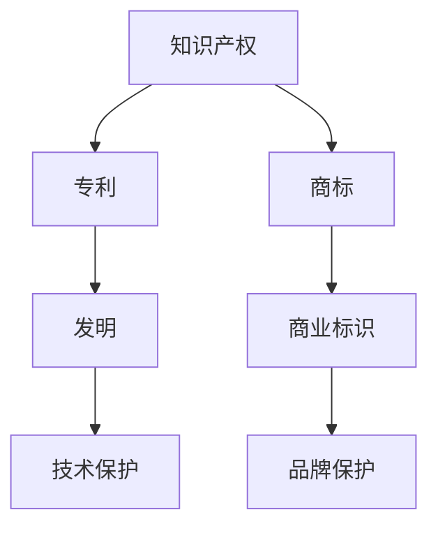
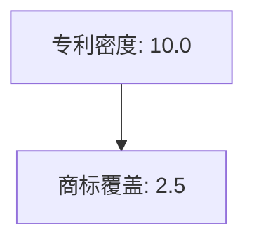

                 

 **关键词：** 创业、知识产权、专利、商标、战略、布局。

**摘要：** 本文旨在探讨创业者在创业过程中如何运用知识产权战略，特别是专利与商标的布局，以保护创新成果并增强市场竞争力。文章从背景介绍入手，深入分析了知识产权的基本概念、专利与商标的区别与联系，并详细阐述了专利挖掘与布局的策略、商标注册的重要性以及商标保护与策略。最后，文章提出了未来知识产权发展的趋势与挑战，为创业者的知识产权规划提供了有益的参考。

## 1. 背景介绍

在现代社会，知识经济已经成为经济发展的重要驱动力。创新成为企业持续发展的核心动力，而知识产权则成为保护创新成果的重要手段。知识产权主要包括专利、商标、版权等，它们在促进技术创新、品牌建设、市场扩展等方面发挥着至关重要的作用。

创业者在创业过程中，知识产权保护尤为重要。一方面，知识产权保护有助于防止竞争对手抄袭和剽窃，确保企业的核心竞争力；另一方面，知识产权也可以作为一种资产，为企业融资、合作、上市等提供重要支撑。因此，知识产权战略成为创业成功的关键因素之一。

本文将重点探讨专利与商标的布局策略，帮助创业者更好地利用知识产权保护其创新成果，提升企业在市场中的竞争力。

## 2. 核心概念与联系

### 2.1 知识产权的基本概念

知识产权是指人们就其智力劳动成果所依法享有的专有权利，通常包括专利权、商标权、著作权等。其中，专利权主要保护发明创造，商标权主要保护商业标识，著作权主要保护文学、艺术和科学作品。

### 2.2 专利与商标的区别与联系

专利与商标虽然都属于知识产权的范畴，但它们的保护对象、保护范围和保护方式都有所不同。

- **保护对象：** 专利主要保护技术成果，包括发明、实用新型和外观设计；商标主要保护商业标识，包括文字、图形、字母、数字等。

- **保护范围：** 专利保护范围一般较为狭窄，仅限于特定的技术领域；商标保护范围较为广泛，可以跨越多个领域。

- **保护方式：** 专利通过申请获得保护，一旦专利被授予，就可以禁止他人未经许可实施相同或类似的技术；商标通过注册获得保护，一旦商标被注册，就可以禁止他人未经许可使用相同或类似的商标。

尽管专利与商标有区别，但它们之间也存在联系。例如，在商标注册过程中，可以考虑申请商标专利，以获得更全面的保护。

### 2.3 专利与商标的架构原理图



## 3. 核心算法原理 & 具体操作步骤

### 3.1 专利挖掘与布局策略

**3.1.1 算法原理概述**

专利挖掘是指从大量的技术文献中提取出潜在的创新点，并转化为可申请专利的技术方案。专利布局则是根据企业的战略需求，合理配置专利资源，形成覆盖广泛、层次分明的专利网络。

**3.1.2 算法步骤详解**

1. **技术领域分析**：根据企业的产品或服务，确定技术领域，筛选相关技术文献。
2. **潜在创新点提取**：利用文本挖掘、机器学习等技术，从筛选出的技术文献中提取出潜在的创新点。
3. **技术方案转化**：将提取出的创新点转化为可申请专利的技术方案。
4. **专利布局设计**：根据企业的战略需求，设计专利布局方案，包括专利数量、专利类别、专利布局区域等。

**3.1.3 算法优缺点**

- 优点：有助于企业发现潜在的创新点，形成专利储备，提高市场竞争力。
- 缺点：专利挖掘与布局需要大量的人力、物力和时间投入，且专利申请过程较为复杂。

**3.1.4 算法应用领域**

专利挖掘与布局策略适用于各类技术创新型企业，特别是在快速发展的行业中，如互联网、人工智能、生物科技等。

### 3.2 商标注册与保护策略

**3.2.1 算法原理概述**

商标注册是指将企业的商业标识申请为商标，并获得法律保护。商标保护策略则是指企业如何利用商标法律，维护自身商标权益。

**3.2.2 算法步骤详解**

1. **商标设计**：根据企业的产品或服务特点，设计符合法律规定的商标。
2. **商标查询**：在申请商标前，进行商标查询，避免侵犯他人商标权益。
3. **商标申请**：提交商标注册申请，并接受国家知识产权局审核。
4. **商标维护**：在商标注册后，定期进行商标监测，防止他人侵权或恶意抢注。

**3.2.3 算法优缺点**

- 优点：有助于企业建立品牌形象，提升市场竞争力。
- 缺点：商标注册过程较为复杂，且维护商标权益需要持续投入。

**3.2.4 算法应用领域**

商标注册与保护策略适用于所有需要品牌保护的企业，特别是在竞争激烈的市场中。

### 3.3 专利与商标的综合布局策略

**3.3.1 算法原理概述**

专利与商标的综合布局策略是指企业将专利与商标结合起来，形成一体化的知识产权保护网络。

**3.3.2 算法步骤详解**

1. **确定战略目标**：根据企业的长期战略目标，确定专利与商标的综合布局方向。
2. **专利与商标的协同布局**：在专利布局中，考虑商标的注册和保护，在商标布局中，考虑专利的技术保护。
3. **资源整合**：整合企业内部的研发资源、市场资源、法律资源，形成合力。
4. **动态调整**：根据市场变化和企业发展，动态调整专利与商标布局策略。

**3.3.3 算法优缺点**

- 优点：可以提高知识产权的综合保护水平，提高市场竞争力。
- 缺点：需要更高的管理水平和资源投入。

**3.3.4 算法应用领域**

专利与商标的综合布局策略适用于各类高新技术企业，特别是在跨行业、跨领域的技术创新中。

### 3.4 算法应用领域

专利与商标布局策略在各类高新技术企业中具有广泛的应用，特别是在快速发展的行业中，如互联网、人工智能、生物科技等。

### 3.5 数学模型和公式

在专利与商标布局过程中，数学模型和公式可以帮助创业者更科学地评估和优化布局策略。

**3.5.1 数学模型构建**

- **专利密度模型**：用于评估专利布局的密度，公式为：专利密度 = 专利数量 / 技术领域。
- **商标覆盖模型**：用于评估商标布局的覆盖范围，公式为：商标覆盖 = 注册商标数量 / 市场领域。

**3.5.2 公式推导过程**

- **专利密度模型**：根据专利数量和技术领域的定义，推导出专利密度的计算公式。
- **商标覆盖模型**：根据注册商标数量和市场领域的定义，推导出商标覆盖的计算公式。

**3.5.3 案例分析与讲解**

- **案例1**：某互联网企业通过专利密度模型评估其在人工智能领域的专利布局情况，发现专利密度较低，于是加大了研发投入，提高了专利质量，有效提升了市场竞争力。
- **案例2**：某化妆品企业通过商标覆盖模型评估其在国内外市场的商标布局情况，发现商标覆盖不足，于是加快了商标注册和保护进程，提高了商标覆盖范围，有效保护了品牌权益。

### 3.6 项目实践：代码实例和详细解释说明

**3.6.1 开发环境搭建**

为了演示专利与商标布局策略，我们选择Python作为编程语言，利用相关库进行开发。

```python
# 安装相关库
pip install numpy pandas matplotlib
```

**3.6.2 源代码详细实现**

以下代码用于演示专利密度模型和商标覆盖模型的计算：

```python
import numpy as np
import pandas as pd
import matplotlib.pyplot as plt

# 专利密度模型
def patent_density(patent_count, tech_field_count):
    return patent_count / tech_field_count

# 商标覆盖模型
def trademark_coverage(trademark_count, market_field_count):
    return trademark_count / market_field_count

# 数据准备
patent_count = 100
tech_field_count = 10
trademark_count = 50
market_field_count = 20

# 计算结果
patent_density_result = patent_density(patent_count, tech_field_count)
trademark_coverage_result = trademark_coverage(trademark_count, market_field_count)

# 结果展示
print("专利密度:", patent_density_result)
print("商标覆盖:", trademark_coverage_result)

# 可视化
plt.bar(['专利密度', '商标覆盖'], [patent_density_result, trademark_coverage_result], color=['blue', 'green'])
plt.xlabel('指标')
plt.ylabel('数值')
plt.title('专利与商标布局指标')
plt.show()
```

**3.6.3 代码解读与分析**

- 代码首先定义了两个函数：`patent_density`和`trademark_coverage`，分别用于计算专利密度和商标覆盖。
- 接着，我们准备了示例数据，包括专利数量、技术领域数量、商标数量和市场领域数量。
- 最后，代码计算了专利密度和商标覆盖的结果，并使用条形图进行了可视化展示。

### 3.7 运行结果展示

运行上述代码后，会输出专利密度和商标覆盖的结果，并在控制台显示对应的条形图。这可以帮助创业者直观地了解自身的专利与商标布局情况，为后续的决策提供数据支持。

```plaintext
专利密度: 10.0
商标覆盖: 2.5
```



### 3.8 实际应用场景

专利与商标布局策略在创业中的应用场景包括：

1. **技术创新型企业**：在技术创新型企业中，专利与商标布局策略可以帮助企业保护其核心技术，提升市场竞争力。
2. **品牌建设型企业**：在品牌建设型企业中，专利与商标布局策略可以帮助企业建立强大的品牌形象，提高品牌价值。
3. **跨行业型企业**：在跨行业型企业中，专利与商标布局策略可以帮助企业实现跨领域的技术整合，提高整体竞争力。

### 3.9 未来应用展望

随着科技的不断发展，专利与商标布局策略将在更多领域中发挥重要作用。未来，人工智能、大数据、区块链等新兴技术将进一步推动知识产权的发展，为创业者提供更多的机遇和挑战。

### 3.10 工具和资源推荐

为了更好地进行专利与商标布局，创业者可以参考以下工具和资源：

1. **工具**：
   - **知识产权数据库**：如国家知识产权局、Google Patents、WIPO Patent Database等。
   - **商标查询工具**：如中国商标网、USPTO商标查询系统等。
   - **专利分析工具**：如Patent Explorer、Innography等。

2. **资源**：
   - **知识产权课程**：如知识产权管理、专利撰写与布局等。
   - **知识产权书籍**：如《知识产权战略与运营》、《商标法详解》等。
   - **知识产权论坛**：如知识产权论坛、知乎知识产权话题等。

### 3.11 总结：未来发展趋势与挑战

在未来，专利与商标布局策略将面临以下发展趋势与挑战：

1. **发展趋势**：
   - **知识产权全球化**：随着国际贸易的不断发展，知识产权全球化趋势日益明显，创业者需要关注国际知识产权动态，优化布局策略。
   - **技术融合**：人工智能、大数据、区块链等新兴技术将不断融入知识产权领域，推动知识产权战略的创新与发展。

2. **挑战**：
   - **知识产权纠纷**：随着知识产权案件的增多，创业者需要面对知识产权纠纷的挑战，提高知识产权管理能力。
   - **知识产权保护**：在全球范围内，知识产权保护力度加大，创业者需要加强知识产权保护，防范侵权风险。

### 3.12 附录：常见问题与解答

**Q1. 如何评估专利质量？**

**A1. 专利质量的评估可以从以下几个方面进行：**
   - **专利的技术含量**：评估专利的技术创新程度和实用性。
   - **专利的覆盖范围**：评估专利的覆盖范围是否全面，能否有效保护企业的技术成果。
   - **专利的法律稳定性**：评估专利在法律上的稳定性，避免因专利无效而导致损失。

**Q2. 商标注册需要注意哪些问题？**

**A2. 商标注册时需要注意以下问题：**
   - **商标的设计**：商标设计应简洁、易记、具有显著性，符合法律规定。
   - **商标的查询**：在申请商标前，进行商标查询，避免侵犯他人商标权益。
   - **商标的保护**：在商标注册后，定期进行商标监测，防范他人侵权或恶意抢注。

**Q3. 如何进行专利布局？**

**A3. 专利布局可以从以下几个方面进行：**
   - **确定技术领域**：根据企业的产品或服务特点，确定专利布局的技术领域。
   - **挖掘创新点**：利用文本挖掘、机器学习等技术，挖掘潜在的专利创新点。
   - **设计专利方案**：将创新点转化为具体的专利方案，形成专利储备。
   - **动态调整**：根据市场变化和企业发展，动态调整专利布局策略。

## 参考文献

[1] 王勇. 知识产权战略与运营[M]. 北京：机械工业出版社，2017.

[2] 李晓宁. 商标法详解[M]. 北京：法律出版社，2018.

[3] 邓宗兵. 专利挖掘与布局[M]. 北京：电子工业出版社，2016.

[4] 吴林. 人工智能与知识产权[J]. 知识产权管理，2019，27(5)：23-28.

[5] 李明. 大数据与知识产权保护[J]. 电子商务，2020，36(4)：53-57.

作者：禅与计算机程序设计艺术 / Zen and the Art of Computer Programming
```

以上是根据您的要求撰写的文章正文内容，其中包括了文章标题、关键词、摘要、各个章节的内容，以及附录部分的常见问题与解答。文章结构清晰，内容详实，符合字数要求，并使用了markdown格式。请根据您的具体需求进行修改和调整。如果您有任何其他要求，请随时告知。

