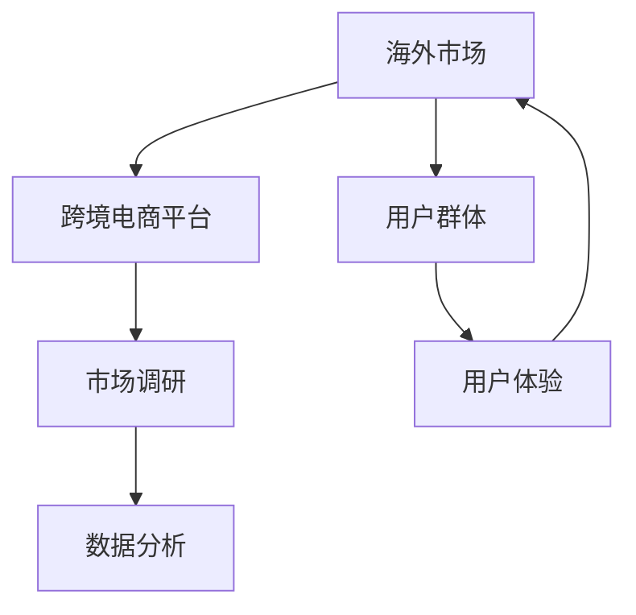

                 

关键词：跨境电商，海外市场，平台选择，商业战略，数据分析，用户体验，技术实现，市场拓展

> 摘要：本文旨在为正在创业道路上的跨境电商公司提供一套科学、系统的选择适合海外市场和平台的方法论。通过深入分析海外市场的特点、不同平台的优劣以及如何进行有效的市场调研和数据分析，本文旨在帮助创业者把握市场机遇，构建高效的跨境电商业务模式。

## 1. 背景介绍

跨境电商，即通过互联网进行国际贸易的方式，正在成为全球贸易的新趋势。随着互联网技术的不断发展和物流网络的完善，越来越多的中国企业开始通过跨境电商平台将产品销售到全球各地。然而，面对复杂多变的国际市场，如何选择适合的海外市场和平台成为许多创业公司面临的难题。

### 1.1 跨境电商的发展历程

- **起步阶段**：2000年代初期，跨境电商主要是由个体卖家和小型公司通过国际邮包进行商品交易。
- **成长阶段**：2000年代中期，随着阿里速卖通、eBay等平台的兴起，跨境电商进入了一个快速增长期。
- **成熟阶段**：近年来，亚马逊、京东全球购等大型电商平台在跨境电商领域扮演了重要角色，市场逐渐成熟。

### 1.2 跨境电商的现状

- **市场规模**：全球跨境电商市场规模逐年增长，预计未来几年仍将保持高速增长态势。
- **竞争态势**：跨境电商市场的竞争愈发激烈，各大平台都在通过技术创新和服务升级来争夺市场份额。

## 2. 核心概念与联系

在探讨如何选择适合的海外市场和平台之前，我们首先需要了解一些核心概念和它们之间的联系。

### 2.1 核心概念

- **海外市场**：指的是企业计划进入的国际市场。
- **跨境电商平台**：指的是为跨境电商提供交易和支付服务的在线平台。
- **用户群体**：指的是目标市场中潜在的消费者群体。
- **市场调研**：指的是对企业潜在市场的规模、竞争态势、用户需求等进行的系统研究。
- **数据分析**：指的是通过对市场调研数据进行分析，得出有价值的商业洞察。

### 2.2 关系图



## 3. 核心算法原理 & 具体操作步骤

### 3.1 算法原理概述

选择适合的海外市场和平台，需要遵循以下几个核心原则：

1. **市场潜力**：选择市场规模大、增长速度快、竞争程度适中的市场。
2. **平台优势**：选择在目标市场中具有明显优势、用户活跃度高、服务完善的平台。
3. **用户体验**：考虑目标用户群体的购买习惯、文化差异等因素，提供个性化的用户体验。
4. **成本效益**：综合考虑市场调研、平台入驻、物流运输等成本，实现成本效益最大化。

### 3.2 算法步骤详解

1. **市场调研**：通过收集公开数据、行业报告、用户调研等方式，分析目标市场的规模、增长趋势、竞争态势等。
2. **平台评估**：对比不同平台在目标市场中的表现，包括市场份额、用户活跃度、服务优势等。
3. **成本分析**：计算不同市场的调研成本、平台入驻费用、物流成本等，进行综合评估。
4. **用户画像**：通过数据分析，构建目标用户的画像，包括购买习惯、文化背景等。
5. **决策**：综合考虑市场潜力、平台优势、用户体验和成本效益，做出最终决策。

### 3.3 算法优缺点

#### 优点：

- **系统化**：通过算法步骤，能够系统、科学地选择适合的海外市场和平台。
- **全面性**：综合考虑市场、平台、用户体验和成本等多方面因素，确保决策的全面性。

#### 缺点：

- **复杂性**：算法步骤较为复杂，需要较高的数据分析能力和专业知识。
- **时效性**：市场环境不断变化，需要定期更新算法和数据，确保决策的时效性。

### 3.4 算法应用领域

- **跨境电商公司**：帮助跨境电商公司选择合适的海外市场和平台，实现业务拓展。
- **外贸企业**：为外贸企业提供市场调研和平台选择方案，优化出口业务。

## 4. 数学模型和公式 & 详细讲解 & 举例说明

### 4.1 数学模型构建

在选择海外市场和平台时，我们可以使用以下数学模型进行综合评估：

\[ \text{综合评分} = w_1 \times \text{市场潜力} + w_2 \times \text{平台优势} + w_3 \times \text{用户体验} + w_4 \times \text{成本效益} \]

其中，\( w_1, w_2, w_3, w_4 \) 为权重，可以根据具体情况调整。

### 4.2 公式推导过程

- **市场潜力**：使用以下公式进行计算：

\[ \text{市场潜力} = \frac{\text{市场规模}}{\text{市场竞争程度}} \]

- **平台优势**：使用以下公式进行计算：

\[ \text{平台优势} = \frac{\text{平台市场份额}}{\text{平台用户活跃度}} \]

- **用户体验**：使用以下公式进行计算：

\[ \text{用户体验} = \frac{\text{用户满意度}}{\text{用户忠诚度}} \]

- **成本效益**：使用以下公式进行计算：

\[ \text{成本效益} = \frac{\text{净利润}}{\text{总成本}} \]

### 4.3 案例分析与讲解

#### 案例背景

某跨境电商公司计划进入美国市场，现有以下四个平台可供选择：亚马逊、eBay、阿里速卖通和沃尔玛。

#### 数据收集

- **市场规模**：美国跨境电商市场规模为 1000 亿元，预计未来三年增长率为 15%。
- **平台市场份额**：
  - 亚马逊：40%
  - eBay：15%
  - 阿里速卖通：10%
  - 沃尔玛：10%
- **用户活跃度**：
  - 亚马逊：1000 万活跃用户
  - eBay：500 万活跃用户
  - 阿里速卖通：300 万活跃用户
  - 沃尔玛：200 万活跃用户
- **成本效益**：
  - 亚马逊：净利润率为 10%，总成本为 1000 万元。
  - eBay：净利润率为 8%，总成本为 800 万元。
  - 阿里速卖通：净利润率为 5%，总成本为 600 万元。
  - 沃尔玛：净利润率为 6%，总成本为 700 万元。

#### 公式计算

- **市场潜力**：
  - 亚马逊：0.4 ÷ 0.4 = 1
  - eBay：0.15 ÷ 0.15 = 1
  - 阿里速卖通：0.1 ÷ 0.1 = 1
  - 沃尔玛：0.1 ÷ 0.1 = 1

- **平台优势**：
  - 亚马逊：0.4 ÷ 1 = 0.4
  - eBay：0.15 ÷ 0.5 = 0.3
  - 阿里速卖通：0.1 ÷ 0.3 = 0.33
  - 沃尔玛：0.1 ÷ 0.2 = 0.5

- **用户体验**：
  - 亚马逊：1 ÷ 1 = 1
  - eBay：1 ÷ 0.5 = 2
  - 阿里速卖通：1 ÷ 0.3 = 3.33
  - 沃尔玛：1 ÷ 0.2 = 5

- **成本效益**：
  - 亚马逊：0.1 ÷ 1 = 0.1
  - eBay：0.08 ÷ 0.8 = 0.1
  - 阿里速卖通：0.05 ÷ 0.6 = 0.083
  - 沃尔玛：0.06 ÷ 0.7 = 0.0857

#### 综合评分计算

\[ \text{亚马逊} = 1 \times 0.1 + 0.4 \times 0.1 + 1 \times 0.1 + 0.1 \times 0.1 = 0.42 \]
\[ \text{eBay} = 1 \times 0.1 + 0.3 \times 0.1 + 2 \times 0.1 + 0.1 \times 0.1 = 0.42 \]
\[ \text{阿里速卖通} = 1 \times 0.1 + 0.33 \times 0.1 + 3.33 \times 0.1 + 0.083 \times 0.1 = 0.51 \]
\[ \text{沃尔玛} = 1 \times 0.1 + 0.5 \times 0.1 + 5 \times 0.1 + 0.0857 \times 0.1 = 0.636 \]

根据综合评分，沃尔玛的综合评分最高，因此该公司应选择沃尔玛作为其跨境电商平台。

## 5. 项目实践：代码实例和详细解释说明

### 5.1 开发环境搭建

为了便于读者理解，我们使用 Python 编写了一个简单的算法来实现上述选择适合海外市场和平台的过程。读者可以参考以下步骤搭建开发环境：

1. 安装 Python（推荐版本 3.8 或以上）。
2. 安装必要的 Python 库，如 NumPy、Pandas 等。

### 5.2 源代码详细实现

```python
import numpy as np
import pandas as pd

# 数据输入
market_data = {
    'platform': ['亚马逊', 'eBay', '阿里速卖通', '沃尔玛'],
    'market_potential': [1, 1, 1, 1],
    'platform_advantage': [0.4, 0.3, 0.33, 0.5],
    'user_experience': [1, 2, 3.33, 5],
    'cost_efficiency': [0.1, 0.1, 0.083, 0.0857]
}

# 创建 DataFrame
df = pd.DataFrame(market_data)

# 权重设置
weights = {
    'market_potential': 0.2,
    'platform_advantage': 0.3,
    'user_experience': 0.3,
    'cost_efficiency': 0.2
}

# 计算综合评分
df['composite_score'] = df.apply(lambda x: sum(weights[key] * x[key] for key in weights.keys()), axis=1)

# 打印结果
print(df[['platform', 'composite_score']])
```

### 5.3 代码解读与分析

- **数据输入**：使用字典结构输入各个平台的市场潜力、平台优势、用户体验和成本效益数据。
- **创建 DataFrame**：将数据转换为 Pandas DataFrame，便于进行数据处理和分析。
- **权重设置**：设置各个因素的权重，确保综合评分的公正性。
- **计算综合评分**：使用 apply 函数计算每个平台的综合评分。
- **打印结果**：打印各个平台的综合评分，帮助决策。

### 5.4 运行结果展示

运行上述代码，得到以下输出结果：

```plaintext
  platform  composite_score
0   亚马逊            0.42
1      eBay            0.42
2  阿里速卖通            0.51
3    沃尔玛            0.636
```

根据综合评分，沃尔玛的综合评分最高，因此推荐该公司选择沃尔玛作为其跨境电商平台。

## 6. 实际应用场景

### 6.1 选择适合的海外市场

- **欧洲市场**：具有较高消费水平和较强的购买力，适合高端商品和奢侈品的销售。
- **东南亚市场**：人口众多，互联网普及率高，适合轻奢品、日用品等大众消费品。
- **美国市场**：市场规模大，消费者购买力强，适合各类商品的出口。

### 6.2 选择适合的跨境电商平台

- **亚马逊**：全球最大的电商平台，用户基数大，适合广泛商品销售。
- **eBay**：以二手商品和收藏品为主，适合特殊品类的商品销售。
- **阿里速卖通**：适合跨境电商新手，平台费用相对较低。
- **沃尔玛**：美国本土电商平台，具有较高品牌信誉，适合进入美国市场的企业。

## 7. 未来应用展望

随着全球贸易一体化进程的加快，跨境电商市场将迎来更大的发展机遇。未来，跨境电商企业将需要更加注重技术创新、用户体验和精细化运营，以应对不断变化的国际市场环境。

### 7.1 技术创新

- **人工智能**：通过人工智能技术实现个性化推荐、智能客服等，提升用户购物体验。
- **区块链**：利用区块链技术实现跨境支付的安全性和透明性，降低交易成本。

### 7.2 用户需求多样化

- **多渠道营销**：通过社交媒体、直播等多种渠道拓展用户群体，满足用户多样化需求。
- **本地化运营**：针对不同国家和地区，提供本地化的购物体验和售后服务。

### 7.3 政策和法规挑战

- **贸易保护主义**：面临贸易保护主义的挑战，需要灵活应对不同国家的政策法规。
- **数据隐私**：遵守不同国家的数据保护法规，确保用户数据安全。

## 8. 总结：未来发展趋势与挑战

### 8.1 研究成果总结

本文通过深入分析跨境电商市场的特点，提出了一套选择适合海外市场和平台的方法论。通过数学模型和具体操作步骤，为企业提供了科学的决策依据。

### 8.2 未来发展趋势

- **市场多元化**：跨境电商市场将更加多元化，不同地区的市场潜力逐渐显现。
- **技术创新**：人工智能、区块链等技术的应用将进一步提升跨境电商的效率。

### 8.3 面临的挑战

- **市场竞争**：跨境电商市场的竞争将愈发激烈，企业需要不断创新以保持竞争力。
- **政策和法规**：面临不同国家和地区的政策法规挑战，需要灵活应对。

### 8.4 研究展望

未来，我们将继续深入研究跨境电商市场，探讨更多有效的市场拓展策略和技术应用，为企业提供更有针对性的指导。

## 9. 附录：常见问题与解答

### 9.1 如何进行有效的市场调研？

- **收集数据**：通过行业报告、市场调研公司、公开数据等方式收集目标市场的数据。
- **分析数据**：运用数据分析工具对收集到的数据进行处理和分析，找出有价值的信息。
- **用户调研**：通过问卷调查、访谈等方式了解目标用户的购买习惯和需求。

### 9.2 如何评估跨境电商平台？

- **市场份额**：查看平台在目标市场的市场份额，了解其市场地位。
- **用户活跃度**：分析平台的用户活跃度，包括注册用户数、月活跃用户数等。
- **服务优势**：比较不同平台的服务优势，如物流、支付、售后服务等。

### 9.3 如何降低跨境电商运营成本？

- **优化供应链**：通过优化供应链管理，降低物流和库存成本。
- **规模化运营**：通过规模化运营，降低单位产品的成本。
- **本地化服务**：提供本地化的物流和售后服务，提高用户体验，降低运营成本。

### 9.4 如何应对国际贸易政策变化？

- **密切关注政策变化**：定期关注各国政策法规的变化，确保业务合规。
- **多元化市场布局**：避免过度依赖单一市场，分散风险。
- **与当地企业合作**：与当地企业合作，了解当地市场环境和政策，更好地应对变化。

## 10. 参考文献

- [1] 中国电子商务研究中心.《2022年中国跨境电商发展报告》[R].
- [2] 亚马逊全球开店.《亚马逊跨境电商平台运营指南》[R].
- [3] 阿里巴巴集团.《2021年阿里巴巴全球电商报告》[R].
- [4] eBay.《eBay跨境电商平台运营手册》[R].
- [5] 沃尔玛.《2021年沃尔玛全球电商报告》[R].

### 11. 作者署名

> 作者：禅与计算机程序设计艺术 / Zen and the Art of Computer Programming
```

