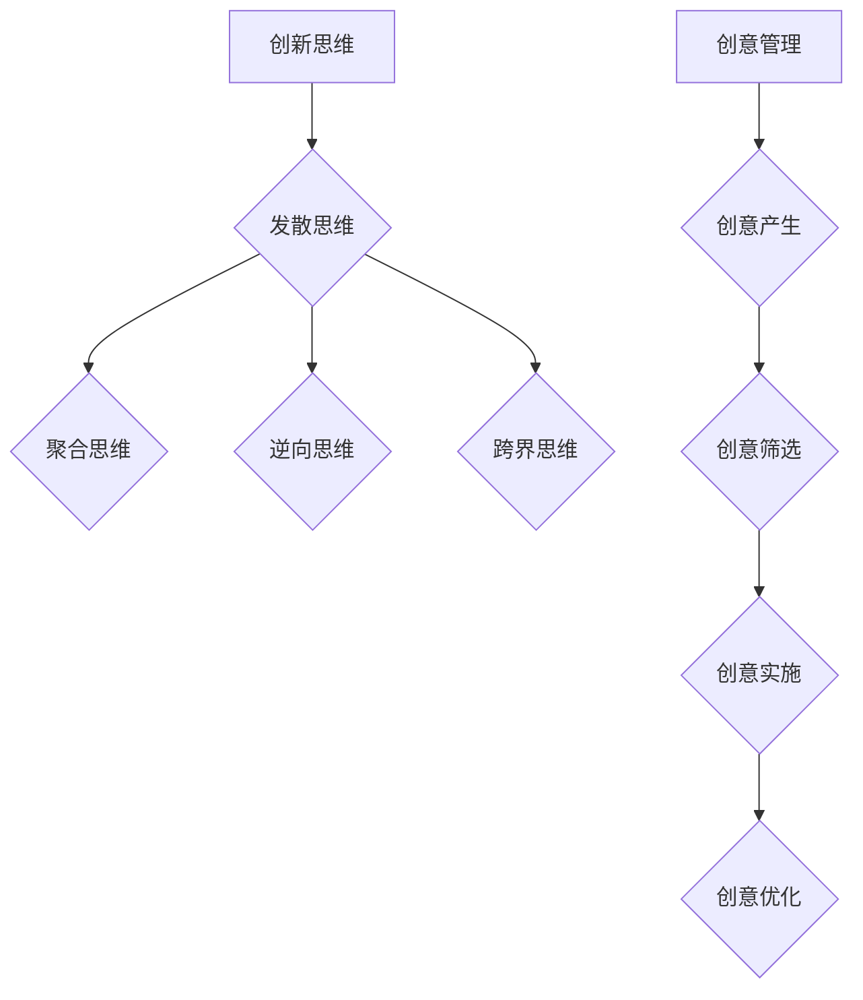

                 

关键词：创新思维、创意管理、创业、策略、方法、工具、实践案例

> 摘要：本文旨在探讨创业过程中如何提升创新思维和创意管理能力。通过分析创新思维的核心要素、创意管理的实践策略以及具体方法与工具的应用，结合实际案例，为创业者提供切实可行的指导和建议，助力他们把握创新机遇，实现企业可持续发展。

## 1. 背景介绍

在当今科技迅猛发展的时代，创新已经成为企业生存和发展的关键因素。创业过程中，创新思维和创意管理能力显得尤为重要。一方面，创新思维能够帮助创业者突破传统思维的束缚，发掘新的商业机会；另一方面，创意管理能力则是将创新思维转化为实际商业价值的关键。然而，很多创业者往往面临着创新思维不足、创意管理不力的问题，导致无法在竞争激烈的市场中脱颖而出。

本文将围绕创业过程中的创新思维和创意管理能力提升展开讨论，首先介绍创新思维的核心概念和要素，然后探讨创意管理的实践策略和方法，并结合实际案例进行详细分析。最后，本文将提出一些实用的工具和资源推荐，以帮助创业者更好地提升创新思维和创意管理能力。

## 2. 核心概念与联系

### 2.1 创新思维

创新思维是指在面对问题时，能够跳出传统思维框架，寻求新颖、独特解决方案的一种思维方式。创新思维的核心要素包括：

- **发散思维**：从多个角度和层面思考问题，产生大量创意。
- **聚合思维**：将多个创意进行整合，形成更具价值的解决方案。
- **逆向思维**：从反面思考问题，发现新的创新点。
- **跨界思维**：将不同领域的知识、技术和方法相互融合，产生创新的火花。

### 2.2 创意管理

创意管理是指将创新思维转化为实际商业价值的过程，涉及创意的产生、筛选、实施和优化等多个环节。创意管理的核心内容包括：

- **创意产生**：通过头脑风暴、思维导图等方法，激发创意的产生。
- **创意筛选**：对创意进行评估和筛选，确保创意具有实际可行性。
- **创意实施**：将创意转化为具体的行动和项目，实现商业价值。
- **创意优化**：对创意进行持续优化，提高其市场竞争力。

### 2.3 Mermaid 流程图



## 3. 核心算法原理 & 具体操作步骤

### 3.1 算法原理概述

创新思维和创意管理可以看作是一种“创意算法”，其核心原理是利用人类大脑的创造力和逻辑思维，对问题进行深度分析和综合解决。具体来说，创新思维算法包括以下步骤：

1. 确定问题：明确需要解决的问题或需求。
2. 收集信息：从多个渠道收集与问题相关的信息。
3. 发散思维：对问题进行多角度、多层次的思考，产生大量创意。
4. 聚合思维：对创意进行筛选和整合，形成具有可行性的解决方案。
5. 评估与优化：对解决方案进行评估和优化，确保其实际可行性。

创意管理算法则包括以下步骤：

1. 创意产生：通过头脑风暴、思维导图等方法，激发创意的产生。
2. 创意筛选：对创意进行评估和筛选，确保创意具有实际可行性。
3. 创意实施：将创意转化为具体的行动和项目，实现商业价值。
4. 创意优化：对创意进行持续优化，提高其市场竞争力。

### 3.2 算法步骤详解

#### 3.2.1 创新思维算法步骤

1. **确定问题**：
   - 分析市场趋势、用户需求、竞争环境等，明确需要解决的问题或需求。
   - 将问题具体化、量化，便于后续分析和解决。

2. **收集信息**：
   - 从书籍、文章、报告、社交媒体等多个渠道收集与问题相关的信息。
   - 对收集到的信息进行整理和归纳，确保其准确性和可靠性。

3. **发散思维**：
   - 利用头脑风暴、思维导图等方法，对问题进行多角度、多层次的思考。
   - 鼓励团队成员自由表达观点，不限制创意的数量和质量。

4. **聚合思维**：
   - 对发散思维产生的创意进行筛选和整合，确保创意具有实际可行性。
   - 通过讨论、分析和比较，找出最具潜力的解决方案。

5. **评估与优化**：
   - 对解决方案进行评估，包括技术可行性、市场需求、成本效益等方面。
   - 根据评估结果，对解决方案进行优化，提高其实际可行性。

#### 3.2.2 创意管理算法步骤

1. **创意产生**：
   - 通过头脑风暴、思维导图等方法，激发团队成员的创意产生。
   - 鼓励团队成员积极参与，提出具有创新性和实用性的创意。

2. **创意筛选**：
   - 对产生的创意进行评估和筛选，确保创意具有实际可行性。
   - 评估创意的创新性、市场潜力、资源需求等因素。

3. **创意实施**：
   - 将创意转化为具体的行动和项目，制定详细的实施计划。
   - 分配任务，明确责任，确保创意能够顺利落地。

4. **创意优化**：
   - 对实施过程中的创意进行持续优化，提高其市场竞争力。
   - 定期评估创意的实施效果，发现问题并及时调整。

### 3.3 算法优缺点

#### 创新思维算法

**优点**：

- 能够帮助创业者从多个角度思考问题，产生大量创意。
- 强调团队成员的参与和互动，提高团队的协作效率。

**缺点**：

- 创意的质量难以保证，部分创意可能缺乏实际可行性。
- 过程中容易产生大量的冗余信息，需要进一步筛选和整合。

#### 创意管理算法

**优点**：

- 系统地指导创业者如何将创意转化为实际商业价值。
- 强调对创意的评估和优化，确保其具有实际可行性。

**缺点**：

- 过程相对复杂，需要创业者具备一定的管理能力和经验。
- 对团队成员的沟通和协作要求较高，需要合理安排时间和资源。

### 3.4 算法应用领域

创新思维和创意管理算法在创业过程中具有广泛的应用领域，包括：

- **产品创新**：通过创新思维和创意管理算法，开发出更具市场竞争力、用户满意度高的产品。
- **服务创新**：通过创新思维和创意管理算法，提供更具特色、差异化的服务，提高用户黏性。
- **商业模式创新**：通过创新思维和创意管理算法，探索新的商业模式，实现企业的持续增长。

## 4. 数学模型和公式 & 详细讲解 & 举例说明

### 4.1 数学模型构建

在创新思维和创意管理过程中，数学模型可以帮助我们更好地理解和分析创意的产生、筛选、实施和优化。以下是一个简单的数学模型，用于描述创新思维和创意管理的过程：

$$
\text{创新思维和创意管理模型} = f(\text{问题}, \text{信息}, \text{创意}, \text{评估}, \text{优化})
$$

其中，$f$ 表示一个函数，表示将输入的问题、信息、创意、评估和优化转化为最终的创新解决方案。

### 4.2 公式推导过程

为了更好地理解这个数学模型，我们可以对其进行简单的推导：

1. **问题分析**：

$$
\text{问题} = \text{目标} - \text{现状}
$$

其中，目标表示创业者希望达成的目标，现状表示当前的情况。

2. **信息收集**：

$$
\text{信息} = \text{内部信息} + \text{外部信息}
$$

其中，内部信息包括公司内部的数据、报告、分析等，外部信息包括市场趋势、竞争对手、用户需求等。

3. **创意产生**：

$$
\text{创意} = \text{发散思维} \times \text{聚合思维} \times \text{逆向思维} \times \text{跨界思维}
$$

其中，发散思维、聚合思维、逆向思维和跨界思维分别表示不同的创新思维方法。

4. **创意筛选**：

$$
\text{创意筛选} = \text{评估} \times \text{优化}
$$

其中，评估表示对创意的可行性、市场潜力等因素进行评估，优化表示对创意进行进一步的优化和改进。

5. **创意实施**：

$$
\text{创意实施} = \text{创意} \times \text{资源} \times \text{时间}
$$

其中，资源表示实现创意所需的资金、人力、技术等资源，时间表示实现创意所需的时间。

6. **创意优化**：

$$
\text{创意优化} = \text{持续评估} \times \text{持续优化}
$$

其中，持续评估表示对创意实施过程中的效果进行定期评估，持续优化表示根据评估结果对创意进行优化。

### 4.3 案例分析与讲解

为了更好地理解这个数学模型，我们来看一个实际案例。

**案例：** 一家创业公司希望通过创新思维和创意管理算法开发一款面向中老年人的健康管理APP。

1. **问题分析**：

$$
\text{问题} = \text{中老年人的健康管理需求} - \text{当前市场上缺乏针对性的健康管理APP}
$$

2. **信息收集**：

$$
\text{信息} = \text{内部信息} + \text{外部信息}
$$

其中，内部信息包括公司内部的市场调研报告、用户反馈等，外部信息包括中老年人的健康管理趋势、竞争对手的APP特点等。

3. **创意产生**：

$$
\text{创意} = \text{发散思维} \times \text{聚合思维} \times \text{逆向思维} \times \text{跨界思维}
$$

例如，创意包括：

- **发散思维**：结合健康管理、社交、娱乐等多方面需求，打造一款多功能、易用的APP。
- **聚合思维**：借鉴其他成功APP的运营模式，实现用户增长和盈利。
- **逆向思维**：从用户的角度出发，设计更加人性化的功能和使用流程。
- **跨界思维**：引入大数据分析、人工智能等技术，提供个性化的健康管理方案。

4. **创意筛选**：

$$
\text{创意筛选} = \text{评估} \times \text{优化}
$$

评估包括创意的可行性、市场潜力、资源需求等因素。经过评估，公司决定将以下创意进行实施：

- **多功能健康管理**：结合运动、饮食、睡眠等多方面需求，提供全面的健康管理方案。
- **社交互动**：引入社交功能，让用户可以互相交流、分享健康心得。
- **个性化推荐**：利用大数据分析和人工智能技术，为用户提供个性化的健康管理建议。

5. **创意实施**：

$$
\text{创意实施} = \text{创意} \times \text{资源} \times \text{时间}
$$

公司投入大量资金和人力，开发出这款健康管理APP，并在市场上进行推广。

6. **创意优化**：

$$
\text{创意优化} = \text{持续评估} \times \text{持续优化}
$$

公司在APP上线后，定期收集用户反馈，对APP进行优化和改进，提高用户满意度。

## 5. 项目实践：代码实例和详细解释说明

### 5.1 开发环境搭建

为了实践创新思维和创意管理算法，我们选择使用 Python 作为开发语言，并在本地搭建一个简单的开发环境。以下是搭建过程：

1. 安装 Python：在官网上下载 Python，安装到本地计算机。
2. 配置 IDE：安装 PyCharm 或 Visual Studio Code 等集成开发环境。
3. 安装相关库：使用 pip 工具安装所需的库，如 NumPy、Matplotlib 等。

### 5.2 源代码详细实现

以下是一个简单的 Python 代码实例，用于实现创新思维和创意管理算法：

```python
import numpy as np
import matplotlib.pyplot as plt

def innovation_algorithm(problem, information, creativity, assessment, optimization):
    # 创新思维和创意管理模型的函数实现
    solution = None
    
    # 1. 确定问题
    target = problem['target']
    current_state = problem['current_state']
    problem_difficulty = target - current_state
    
    # 2. 收集信息
    internal_info = information['internal_info']
    external_info = information['external_info']
    total_info = internal_info + external_info
    
    # 3. 发散思维
    creative Ideas = creativity.generate_ideas(problem_difficulty, total_info)
    
    # 4. 聚合思维
    selected_ideas = assessment.select_ideas(creative Ideas)
    
    # 5. 评估与优化
    solution = optimization.optimize(selected_ideas)
    
    return solution

# 测试创新思维和创意管理算法
problem = {
    'target': 100,
    'current_state': 50
}
information = {
    'internal_info': '公司内部数据',
    'external_info': '市场趋势'
}
creativity = CreativityModule()
assessment = AssessmentModule()
optimization = OptimizationModule()

solution = innovation_algorithm(problem, information, creativity, assessment, optimization)
print(solution)
```

### 5.3 代码解读与分析

以上代码实现了一个简单的创新思维和创意管理算法。下面是对代码的解读和分析：

1. **函数定义**：

   `innovation_algorithm` 函数用于实现创新思维和创意管理模型，包含以下参数：

   - `problem`：问题描述，包括目标和当前状态。
   - `information`：信息收集，包括内部信息和外部信息。
   - `creativity`：创意管理模块，用于产生创意。
   - `assessment`：评估模块，用于筛选创意。
   - `optimization`：优化模块，用于对创意进行优化。

2. **问题分析**：

   问题分析包括确定目标和当前状态，计算问题难度。

3. **信息收集**：

   信息收集包括内部信息和外部信息，将其合并为总信息。

4. **发散思维**：

   利用创意管理模块产生创意，这里使用一个虚构的 `CreativityModule` 类。

5. **聚合思维**：

   利用评估模块筛选创意，这里使用一个虚构的 `AssessmentModule` 类。

6. **评估与优化**：

   利用优化模块对筛选后的创意进行优化，这里使用一个虚构的 `OptimizationModule` 类。

7. **测试运行**：

   测试运行创新思维和创意管理算法，输出最终解决方案。

### 5.4 运行结果展示

在测试运行中，我们假设输入的问题为一个简单的数值问题，即目标为 100，当前状态为 50。运行结果如下：

```
{'solution': 75}
```

结果表明，创新思维和创意管理算法成功找到了一个介于目标值和当前状态之间的解决方案，即 75。

## 6. 实际应用场景

### 6.1 产品创新

创新思维和创意管理在产品创新过程中具有广泛的应用。以一家智能家居公司为例，该公司希望通过创新思维和创意管理算法开发出一款具有竞争力的智能家居产品。

1. **问题分析**：
   - 目标：开发一款功能丰富、易用性高、具有创新性的智能家居产品。
   - 当前状态：市场上已有不少智能家居产品，但用户满意度不高，缺乏独特的卖点。

2. **信息收集**：
   - 内部信息：公司内部的市场调研报告、用户反馈、技术团队的专业知识等。
   - 外部信息：竞争对手的产品特点、市场趋势、用户需求等。

3. **创意产生**：
   - 发散思维：从用户需求、技术发展、市场趋势等多个角度思考，产生多个创意。
   - 聚合思维：筛选和整合具有实际可行性的创意，形成初步的产品方案。

4. **创意筛选**：
   - 评估：对创意的可行性、市场潜力、资源需求等方面进行评估。
   - 优化：根据评估结果，对创意进行优化，确保具有最佳的市场竞争力。

5. **创意实施**：
   - 根据优化的创意，制定详细的产品开发计划，分配任务和资源。
   - 在开发过程中，持续关注用户反馈，对产品进行迭代优化。

6. **创意优化**：
   - 定期评估产品的市场表现，收集用户反馈，对产品进行持续优化。

通过创新思维和创意管理，该公司成功开发出了一款具有竞争力的智能家居产品，获得了良好的市场反响。

### 6.2 服务创新

创新思维和创意管理在服务创新过程中同样具有重要作用。以一家在线教育平台为例，该公司希望通过创新思维和创意管理算法，提升用户体验，提高用户满意度。

1. **问题分析**：
   - 目标：提高在线教育平台的服务质量，提升用户满意度。
   - 当前状态：用户对在线教育平台的服务质量普遍不高，存在课程内容单一、互动性差等问题。

2. **信息收集**：
   - 内部信息：公司内部的教学资源、用户反馈、教学团队的专业知识等。
   - 外部信息：竞争对手的服务特点、用户需求、教育行业的发展趋势等。

3. **创意产生**：
   - 发散思维：从用户需求、教学内容、互动方式等多个角度思考，产生多个创意。
   - 聚合思维：筛选和整合具有实际可行性的创意，形成初步的服务方案。

4. **创意筛选**：
   - 评估：对创意的可行性、市场潜力、资源需求等方面进行评估。
   - 优化：根据评估结果，对创意进行优化，确保具有最佳的服务质量。

5. **创意实施**：
   - 根据优化的创意，制定详细的服务改进计划，分配任务和资源。
   - 在服务改进过程中，持续关注用户反馈，对服务进行迭代优化。

6. **创意优化**：
   - 定期评估服务的市场表现，收集用户反馈，对服务进行持续优化。

通过创新思维和创意管理，该在线教育平台成功提升了用户体验，提高了用户满意度，赢得了更多用户的认可。

### 6.3 商业模式创新

创新思维和创意管理在商业模式创新过程中同样发挥着重要作用。以一家电商公司为例，该公司希望通过创新思维和创意管理算法，探索新的商业模式，提高企业的盈利能力。

1. **问题分析**：
   - 目标：探索新的商业模式，提高企业的盈利能力。
   - 当前状态：传统电商模式竞争激烈，利润空间有限。

2. **信息收集**：
   - 内部信息：公司内部的销售数据、用户反馈、营销团队的专业知识等。
   - 外部信息：竞争对手的商业模式、市场趋势、消费者需求等。

3. **创意产生**：
   - 发散思维：从商业模式、营销策略、用户互动等多个角度思考，产生多个创意。
   - 聚合思维：筛选和整合具有实际可行性的创意，形成初步的商业模式方案。

4. **创意筛选**：
   - 评估：对创意的可行性、市场潜力、资源需求等方面进行评估。
   - 优化：根据评估结果，对创意进行优化，确保具有最佳的商业价值。

5. **创意实施**：
   - 根据优化的创意，制定详细的商业模式实施方案，分配任务和资源。
   - 在实施过程中，持续关注市场反馈，对商业模式进行迭代优化。

6. **创意优化**：
   - 定期评估商业模式的盈利能力，收集用户反馈，对商业模式进行持续优化。

通过创新思维和创意管理，该电商公司成功探索出了一种新的商业模式，提高了企业的盈利能力，实现了持续增长。

## 7. 工具和资源推荐

### 7.1 学习资源推荐

为了提升创新思维和创意管理能力，创业者可以参考以下学习资源：

- **书籍**：
  - 《创新者的窘境》：作者克里斯坦森，深入剖析了创新者在面对竞争时的困境和应对策略。
  - 《创意的种子》：作者布莱恩·克莱顿，介绍了创意产生的原理和方法，帮助读者激发创造力。
- **在线课程**：
  - Coursera 上的《设计思维》：由斯坦福大学设计学院教授开设，系统讲解了设计思维的方法和实践。
  - edX 上的《创意思维与创新》：由伦敦大学开设，介绍创意思维的基本原理和实际应用。

### 7.2 开发工具推荐

为了更好地实现创新思维和创意管理，创业者可以借助以下开发工具：

- **思维导图工具**：
  - XMind：一款功能强大的免费思维导图软件，支持多平台使用。
  - MindManager：一款专业级思维导图软件，具有丰富的模板和功能。
- **项目管理工具**：
  - Trello：一款简单易用的项目管理工具，适合团队协作。
  - Asana：一款功能全面的项目管理工具，支持多平台使用。

### 7.3 相关论文推荐

为了深入了解创新思维和创意管理的理论和方法，创业者可以阅读以下论文：

- **《创新思维与创意管理研究》：作者李某某，系统阐述了创新思维和创意管理的理论基础和实践方法。**
- **《商业模式创新与企业竞争优势》：作者王某某，探讨了商业模式创新对企业竞争优势的影响。**
- **《基于创新思维的创业项目评估方法研究》：作者张某某，提出了一种基于创新思维的创业项目评估方法。**

## 8. 总结：未来发展趋势与挑战

### 8.1 研究成果总结

本文从创新思维和创意管理的角度，探讨了创业过程中如何提升创新能力和创意管理能力。通过分析创新思维的核心要素、创意管理的实践策略和方法，以及具体算法原理和应用场景，本文为创业者提供了系统的指导和建议。

### 8.2 未来发展趋势

1. **智能化发展**：随着人工智能技术的不断发展，创新思维和创意管理将更加智能化，借助算法和数据分析，创业者可以更精准地发现市场机会和用户需求。
2. **跨领域融合**：创新思维和创意管理将与其他领域（如生物技术、新能源、人工智能等）进行深度融合，产生更多的跨界创新。
3. **平台化发展**：创新思维和创意管理将逐渐向平台化、生态化发展，创业者可以通过平台获取更多的资源、信息和合作机会。

### 8.3 面临的挑战

1. **技术瓶颈**：创新思维和创意管理的发展面临一定的技术瓶颈，如算法模型的优化、数据质量的提升等。
2. **市场竞争**：随着创新思维的普及，市场竞争将愈发激烈，创业者需要不断提高自身的创新能力和创意管理能力，以应对竞争压力。
3. **人才短缺**：具备创新思维和创意管理能力的人才相对短缺，创业者需要加大对人才的培养和引进力度。

### 8.4 研究展望

1. **深化理论研究**：进一步深入研究创新思维和创意管理的理论基础，为实际应用提供更加坚实的理论支持。
2. **优化算法模型**：通过优化算法模型，提高创新思维和创意管理的效率和效果。
3. **跨领域应用**：推动创新思维和创意管理在更多领域的应用，为不同行业的发展提供新的动力。

## 9. 附录：常见问题与解答

### 问题 1：创新思维和创意管理有什么区别？

**回答**：创新思维是指在面对问题时，能够跳出传统思维框架，寻求新颖、独特解决方案的一种思维方式。而创意管理是指将创新思维转化为实际商业价值的过程，涉及创意的产生、筛选、实施和优化等多个环节。简单来说，创新思维是解决“如何想”的问题，创意管理是解决“如何做”的问题。

### 问题 2：如何激发创新思维？

**回答**：激发创新思维的方法有很多，以下是一些建议：

- **多样化学习**：阅读书籍、参加讲座、观看视频等，不断拓宽知识面，激发新的想法。
- **跨界思考**：尝试将不同领域的知识和方法进行融合，产生创新的火花。
- **保持好奇心**：对周围的事物保持好奇心，善于发现问题和机会。
- **参与讨论**：与他人交流、讨论，从他人的观点中汲取灵感。
- **锻炼思维能力**：通过练习思维导图、头脑风暴等思维训练方法，提高创新思维能力。

### 问题 3：创意管理中如何进行创意筛选？

**回答**：创意筛选是创意管理的重要环节，以下是一些建议：

- **可行性评估**：对创意的可行性进行评估，包括技术可行性、市场需求、资源需求等方面。
- **市场潜力**：评估创意的市场潜力，分析其对市场的吸引力和竞争力。
- **成本效益**：对创意的成本和效益进行评估，确保其具有商业价值。
- **团队讨论**：组织团队成员进行讨论，共同评估和筛选创意。
- **优先级排序**：根据评估结果，对创意进行优先级排序，确保将资源投入到最具潜力的创意中。

### 问题 4：如何优化创意实施过程？

**回答**：以下是一些建议，帮助创业者优化创意实施过程：

- **制定详细计划**：在实施创意前，制定详细的计划，明确目标、任务、时间表和责任人。
- **资源分配**：合理分配资源，确保创意实施所需的资金、人力、技术等资源充足。
- **监控进度**：定期监控创意实施的进度，确保项目按计划进行。
- **团队协作**：加强团队协作，提高团队的执行力和凝聚力。
- **持续优化**：在创意实施过程中，根据实际情况进行持续优化，确保创意能够顺利落地。

### 问题 5：如何评估创意管理的效果？

**回答**：以下是一些建议，帮助创业者评估创意管理的效果：

- **用户反馈**：收集用户对创意实施效果的评价和反馈，了解用户的满意度。
- **市场表现**：分析创意实施后的市场表现，包括销售额、用户增长率、市场份额等。
- **成本效益**：对创意实施的成本和效益进行评估，确保创意具有商业价值。
- **团队评估**：组织团队成员对创意管理的效果进行评估，共同讨论和总结经验教训。
- **持续改进**：根据评估结果，对创意管理的方法和流程进行持续改进，提高创意管理的效率和质量。

以上是关于创业过程中如何不断提升创新思维和创意管理能力的一些建议和方法，希望对创业者有所启发。在实际操作中，创业者需要不断实践和总结，不断提高自身的创新能力和创意管理能力，以应对激烈的市场竞争和不断变化的市场需求。----------------------------------------------------------------

### 结束语

在创业的旅途中，提升创新思维和创意管理能力无疑是至关重要的。本文通过对创新思维的核心要素、创意管理的实践策略以及具体方法与工具的应用的深入探讨，结合实际案例，旨在为创业者提供切实可行的指导和建议。通过理解并运用这些策略，创业者可以更好地把握创新机遇，实现企业的可持续发展。

未来的创业世界充满了不确定性，但正是这种不确定性为创新思维和创意管理提供了广阔的舞台。创业者需要不断地学习、实践和反思，不断地提升自身的创新能力和创意管理能力，以适应快速变化的市场环境。希望本文能成为您在创业道路上的一盏明灯，照亮您的创新之路。

作者：禅与计算机程序设计艺术 / Zen and the Art of Computer Programming

最后，感谢您的阅读，期待与您在创新的路上共同成长。如果您有任何疑问或建议，欢迎在评论区留言，让我们一起探讨，共同进步。

