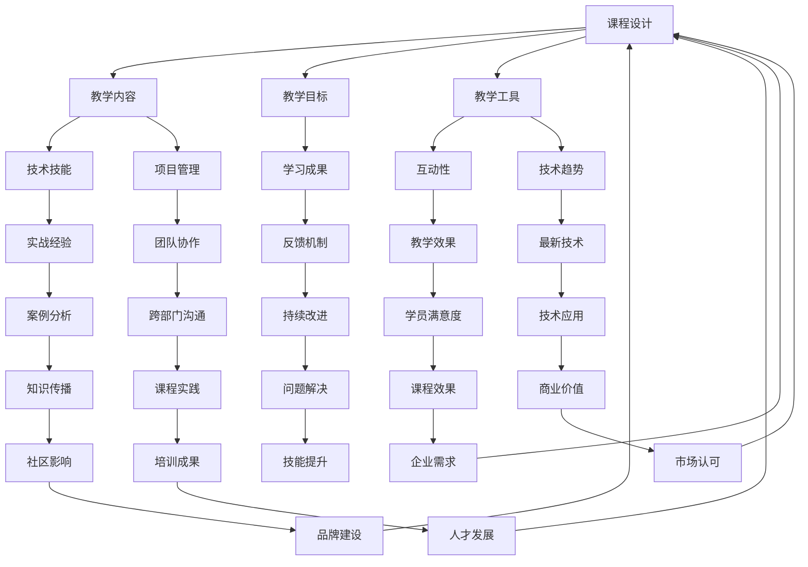

                 

 

## 摘要

本文旨在探讨如何创建一个适用于企业级开源项目的培训课程。课程设计将涵盖从基础概念到高级应用的全面内容，同时强调课程的组织、教学方法和营销策略。本文将结合实际案例，提供详细的课程设计步骤、营销方法，以及如何利用开源项目和企业合作来增强课程的实用性和吸引力。通过这篇论文，我们希望为那些致力于推广开源技术和培养专业人才的机构提供实用的指导和建议。

## 1. 背景介绍

随着技术的快速发展，开源项目已经成为推动创新和知识共享的重要力量。许多企业通过开源项目不仅能够吸引顶尖技术人才，还可以提升自身的品牌影响力。然而，为了有效利用开源项目，企业往往需要对其员工进行系统的培训。这种培训不仅仅局限于技术层面，还包括项目管理、合作文化、社区参与等多个方面。

企业级开源项目的培训课程设计，要求充分考虑企业的具体需求和行业趋势。一方面，课程需要涵盖从入门到高级的各个层次，满足不同技术水平和经验背景的学员需求。另一方面，课程内容必须与时俱进，紧密跟踪行业最新技术动态，确保学员掌握最前沿的知识和技能。

此外，企业级培训课程的营销也是一个关键环节。如何将课程的亮点和价值传递给潜在学员，如何通过有效的渠道推广课程，吸引企业参与，这些都是需要深入探讨的问题。有效的营销策略不仅能提高课程的知名度，还能为企业带来更多的合作机会。

本文将围绕以下方面展开讨论：

- **课程设计的原则和步骤**：详细阐述如何制定课程大纲，选择教学内容，设计教学活动。
- **教学方法和工具**：探讨适用于企业级培训的多种教学方法，以及如何利用现代技术提高教学效果。
- **营销策略**：分析如何通过多种渠道和方式推广课程，包括社交媒体、合作伙伴关系等。
- **课程评估和反馈**：介绍如何进行课程评估，以及如何根据反馈进行持续改进。
- **实际应用案例**：分享一些成功的开源项目培训课程案例，提供实用的经验和教训。
- **未来展望**：探讨开源项目培训课程的未来发展方向和面临的挑战。

通过本文的探讨，我们希望能够为那些致力于创建高质量、高影响力的企业级开源项目培训课程的教育机构和公司提供有价值的参考。

## 2. 核心概念与联系

在创建一个企业级开源项目培训课程之前，我们需要明确几个核心概念，并理解它们之间的联系。以下是一个用Mermaid绘制的流程图，展示了这些核心概念和它们之间的关系。



### 2.1. 课程设计

课程设计是整个培训过程的基础，它决定了教学内容、教学目标和教学方法的选择。课程设计需要考虑以下几个关键方面：

1. **课程大纲**：详细列出课程的模块、主题和章节，确保内容系统、逻辑清晰。
2. **教学内容**：选择与课程目标相关的内容，确保技术技能、项目管理和团队协作等方面都得到充分的覆盖。
3. **教学目标**：明确学员通过课程学习应达到的能力和知识水平。
4. **教学方法**：根据学员的背景和需求选择合适的教学方法，如讲授、实践、讨论等。

### 2.2. 教学内容

教学内容是课程的核心，它决定了学员能否在实际工作中应用所学知识。教学内容应该包括以下方面：

1. **技术技能**：教授学员如何使用特定的编程语言、框架和工具。
2. **项目管理**：介绍项目管理的基本概念、方法和工具，如敏捷开发、迭代管理等。
3. **团队协作**：培养学员在团队合作中所需的沟通、协作和领导能力。
4. **实战经验**：通过案例分析和实际项目，让学员掌握解决问题的方法和技巧。

### 2.3. 教学目标

教学目标是课程设计的出发点和归宿，它决定了课程的内容安排和教学方法的选择。明确的教学目标可以确保学员在学习过程中有清晰的方向和目标感。教学目标通常包括以下方面：

1. **知识目标**：学员应掌握哪些基础知识和技术概念。
2. **技能目标**：学员应具备哪些实际操作技能。
3. **能力目标**：学员应具备哪些解决问题的能力和团队合作精神。
4. **素质目标**：学员应具备哪些职业素养和道德规范。

### 2.4. 教学工具

教学工具是教学过程中不可或缺的辅助手段，它们可以大大提高教学效果。现代教育技术提供了丰富的教学工具，如在线课程平台、虚拟实验室、协作工具和互动白板等。选择合适的工具可以增强课程的互动性、实践性和趣味性。

### 2.5. 互动性

互动性是现代教学的重要特点之一，它能够激发学员的学习兴趣和参与度。通过互动性教学，学员可以更加主动地参与课程，从而提高学习效果。互动性可以通过以下方式实现：

1. **讨论**：通过小组讨论、课堂讨论和在线讨论，促进学员之间的交流和思想碰撞。
2. **实践**：通过实际操作和项目实践，让学员将理论知识应用到实际工作中。
3. **反馈**：通过定期的反馈和评估，让学员了解自己的学习进展和需要改进的地方。

### 2.6. 技术趋势

技术趋势是课程设计过程中必须考虑的一个重要因素。随着技术的快速更新，课程内容需要及时跟进最新的技术动态，确保学员掌握最前沿的知识和技能。技术趋势可以通过以下方式融入课程：

1. **最新技术**：在课程中引入最新的技术趋势，如人工智能、云计算、区块链等。
2. **案例分析**：通过分析最新的开源项目和成功案例，让学员了解技术在实际应用中的情况和前景。
3. **实战项目**：设计基于最新技术的实战项目，让学员在实践中掌握新技术。

### 2.7. 实战经验

实战经验是课程设计中的重要组成部分，它能够让学员在实际操作中掌握知识和技能。通过以下方式，课程可以更好地融入实战经验：

1. **案例研究**：通过分析实际项目案例，让学员了解项目管理和团队合作中的挑战和解决方案。
2. **项目实践**：设计实际项目，让学员从项目中学习并掌握所需技能。
3. **模拟环境**：通过模拟实际工作环境，让学员在接近真实的环境中练习和掌握技能。

### 2.8. 团队协作

团队协作是现代工作中不可或缺的一部分，课程设计应培养学员在团队合作中的能力。通过以下方式，课程可以强化团队协作：

1. **小组活动**：通过小组讨论、小组项目和小组作业，培养学员的团队合作能力。
2. **角色扮演**：通过角色扮演和模拟活动，让学员了解不同角色在团队合作中的职责和作用。
3. **团队建设**：通过团队建设活动，增强团队成员之间的信任和协作。

### 2.9. 反馈机制

反馈机制是课程设计中的重要环节，它能够帮助学员了解自己的学习进度和效果，同时也为课程改进提供了宝贵的参考。反馈机制可以包括以下方式：

1. **定期评估**：通过定期的评估，了解学员的学习情况和进步。
2. **学员反馈**：收集学员对课程的意见和建议，及时进行调整和改进。
3. **导师反馈**：导师通过个别辅导和反馈，帮助学员解决学习中的问题。

### 2.10. 教学效果

教学效果是课程设计的重要目标之一，它决定了课程的成败。通过以下方式，可以评估教学效果：

1. **学员满意度**：通过学员的满意度调查，了解他们对课程的评价和感受。
2. **知识掌握度**：通过考试、作业和实践项目，评估学员对知识的掌握情况。
3. **技能应用度**：通过学员在实际工作中的表现，评估他们所学技能的应用程度。

### 2.11. 知识传播

知识传播是课程设计的重要目标之一，它能够让学员将所学知识应用到更广泛的应用场景中。通过以下方式，可以促进知识传播：

1. **讲座和研讨会**：通过组织讲座和研讨会，让学员分享自己的学习成果和经验。
2. **开源项目**：鼓励学员参与开源项目，通过实践和贡献，将所学知识应用到实际项目中。
3. **社区参与**：鼓励学员参与技术社区，分享知识，建立个人品牌。

### 2.12. 课程实践

课程实践是将理论知识转化为实践能力的重要环节。通过以下方式，可以提高课程实践的效果：

1. **实验室环境**：提供真实的实验室环境，让学员能够动手实践。
2. **项目指导**：导师提供一对一的项目指导，帮助学员解决实践中的问题。
3. **反馈和改进**：通过反馈和改进，让学员不断完善自己的实践能力。

### 2.13. 技能提升

技能提升是课程设计的重要目标之一，它能够让学员在职业发展中获得更多的机会。通过以下方式，可以提升学员的技能：

1. **实战项目**：通过实战项目，让学员在实际操作中提升技能。
2. **导师指导**：导师通过个别辅导，帮助学员提升技能。
3. **学习资源**：提供丰富的学习资源，如在线课程、技术书籍、论坛等，帮助学员自主学习。

### 2.14. 企业需求

企业需求是课程设计的重要参考因素，课程设计应充分考虑企业的实际需求和期望。通过以下方式，可以满足企业需求：

1. **需求调研**：通过调研，了解企业的具体需求。
2. **定制课程**：根据企业需求，定制课程内容和教学方法。
3. **企业合作**：与企业建立合作关系，共同开发和推广课程。

### 2.15. 市场认可

市场认可是课程设计的重要目标之一，它决定了课程的受欢迎程度和商业价值。通过以下方式，可以提高市场认可：

1. **品牌建设**：通过建立良好的品牌形象，提高课程的知名度和认可度。
2. **用户评价**：通过学员和企业的评价，提高课程的口碑。
3. **宣传推广**：通过多种渠道和方式，宣传推广课程。

### 2.16. 品牌建设

品牌建设是课程设计中的重要环节，它能够提高课程的品牌价值和市场竞争力。通过以下方式，可以加强品牌建设：

1. **课程质量**：通过提供高质量的课程内容和教学服务，建立品牌声誉。
2. **市场定位**：明确课程的市场定位和目标受众，提高品牌的市场影响力。
3. **品牌宣传**：通过多种渠道和方式，宣传品牌形象和价值。

### 2.17. 人才发展

人才发展是课程设计的重要目标之一，它能够为企业培养出具备实战能力和创新精神的专业人才。通过以下方式，可以促进人才发展：

1. **培养计划**：制定详细的人才培养计划，确保学员能够全面发展。
2. **职业规划**：帮助学员制定职业规划，明确职业发展方向。
3. **导师制度**：建立导师制度，为学员提供职业发展指导和支持。

通过以上核心概念和联系的分析，我们可以看到，一个成功的开源项目培训课程需要综合考虑多个方面，从课程设计到教学实施，再到课程评估和反馈，每个环节都需要精心策划和执行。只有这样，我们才能为企业培养出具备实战能力和创新精神的专业人才。

## 3. 核心算法原理 & 具体操作步骤

### 3.1 算法原理概述

在开源项目培训课程中，核心算法的设计和实现是关键环节。这些算法不仅决定了课程的技术深度和难度，还直接影响学员的学习效果和实践能力。因此，在课程设计中，我们需要详细讲解算法的基本原理，并给出具体的操作步骤。

核心算法通常包括以下几种类型：

1. **基础算法**：如排序算法、查找算法和图算法等，这些算法是计算机科学的基础。
2. **高级算法**：如动态规划、贪心算法和分治算法等，这些算法解决更复杂的问题。
3. **特定领域算法**：如数据挖掘中的聚类算法、机器学习中的决策树和神经网络等。

在算法原理的讲解中，我们需要遵循以下原则：

- **清晰性**：确保算法描述简洁明了，避免使用复杂的术语和公式。
- **实践性**：通过具体的代码示例，展示算法的实现过程和效果。
- **扩展性**：讲解算法在不同场景下的应用，以及如何扩展和优化算法。

### 3.2 算法步骤详解

以下是一个典型的排序算法——快速排序（Quick Sort）的具体步骤详解：

#### 快速排序算法步骤

1. **选择基准**：从数组中选择一个元素作为基准（pivot）。
2. **划分**：将数组划分为两个子数组，一个包含小于基准的元素，另一个包含大于基准的元素。
3. **递归**：递归地对小于和大于基准的子数组进行快速排序。

#### 具体操作步骤

1. **初始化**：选择一个数组 `arr` 和其长度 `n`。
2. **选择基准**：可以选择数组的第一个、最后一个或随机一个元素作为基准。
3. **划分**：从数组的两端开始，分别向中间移动，当左侧元素大于基准时，将其与右侧小于基准的元素交换，直到所有小于基准的元素都在基准的左侧，大于基准的元素都在右侧。
4. **递归排序**：对划分后的两个子数组分别递归执行快速排序。

#### 快速排序的代码实现

以下是快速排序的Python代码示例：

```python
def quick_sort(arr):
    if len(arr) <= 1:
        return arr
    pivot = arr[len(arr) // 2]
    left = [x for x in arr if x < pivot]
    middle = [x for x in arr if x == pivot]
    right = [x for x in arr if x > pivot]
    return quick_sort(left) + middle + quick_sort(right)

# 测试
arr = [3, 6, 8, 10, 1, 2, 1]
sorted_arr = quick_sort(arr)
print(sorted_arr)
```

通过以上代码，我们可以看到快速排序的基本实现过程。在实际课程中，我们还需要讲解快速排序的时间复杂度、空间复杂度和稳定性等问题。

### 3.3 算法优缺点

#### 快速排序的优点

- **效率高**：平均时间复杂度为 \(O(n\log n)\)，是最快的排序算法之一。
- **原地排序**：不需要额外的空间，空间复杂度为 \(O(\log n)\)。
- **易于实现**：相对其他排序算法，快速排序的实现较为简单。

#### 快速排序的缺点

- **性能不稳定**：在最坏情况下，时间复杂度为 \(O(n^2)\)，这种情况在输入数据已经有序或部分有序时容易发生。
- **递归深度**：快速排序使用了递归，递归深度可能达到 \(O(n)\)，可能导致栈溢出。

### 3.4 算法应用领域

快速排序广泛应用于各种场景，如：

- **数据分析**：在数据量大且需要排序的场景中，快速排序是一个常用选择。
- **搜索算法**：快速排序是许多高级搜索算法的基础。
- **数据库**：在数据库中，快速排序用于索引创建和数据检索。

通过以上对快速排序算法的详细讲解，我们可以看到，理解算法原理和具体操作步骤对于学习计算机科学至关重要。在实际教学中，我们需要结合具体的代码示例，帮助学员深入理解算法的原理和实现，并让他们在实践中掌握这些算法。

### 3.5 算法应用领域

算法在开源项目培训课程中的应用领域非常广泛，不同类型的算法适用于不同的问题场景。以下是一些常见算法及其应用领域的详细说明：

#### 3.5.1 排序算法

排序算法在数据管理和分析中起着核心作用，常见算法包括冒泡排序、选择排序、插入排序、快速排序和归并排序等。

- **冒泡排序**：适用于数据量较小且基本有序的情况，时间复杂度为 \(O(n^2)\)，不适合大数据量场景。
- **选择排序**：在数据量较大时效率较低，但代码实现简单，适用于基本有序的小数据集。
- **插入排序**：适用于数据量较小或基本有序的情况，时间复杂度为 \(O(n^2)\)，但优于冒泡排序。
- **快速排序**：平均时间复杂度为 \(O(n\log n)\)，是最常用的排序算法之一，但最坏情况下可能退化为 \(O(n^2)\)。
- **归并排序**：适用于大数据量排序，时间复杂度为 \(O(n\log n)\)，需要额外的空间用于合并操作。

排序算法在开源项目中广泛应用于数据库索引创建、数据分析、前端渲染排序等功能。

#### 3.5.2 搜索算法

搜索算法用于在数据结构中查找特定元素，常见算法包括线性搜索、二分搜索、跳跃搜索和深度优先搜索等。

- **线性搜索**：简单且易于实现，但时间复杂度为 \(O(n)\)，适用于数据量较小的情况。
- **二分搜索**：适用于有序数组，时间复杂度为 \(O(\log n)\)，是快速搜索的首选。
- **跳跃搜索**：通过跳跃多个元素来快速定位可能的搜索范围，适用于大规模数据。
- **深度优先搜索（DFS）**：用于图结构和树结构中的遍历，适用于路径查找和拓扑排序。

搜索算法在开源项目中广泛应用于数据库查询、路径查找、推荐系统和游戏算法。

#### 3.5.3 图算法

图算法用于解决图相关的问题，常见算法包括最短路径算法、最小生成树算法、图遍历算法和拓扑排序等。

- **迪杰斯特拉算法（Dijkstra）**：用于计算单源最短路径，时间复杂度为 \(O(n^2)\)，适用于稀疏图。
- **贝尔曼-福特算法（Bellman-Ford）**：用于计算单源最短路径，适用于包含负权边的图，时间复杂度为 \(O(n^2)\)。
- **普里姆算法（Prim）**：用于计算最小生成树，时间复杂度为 \(O(n^2)\)。
- **克鲁斯卡尔算法（Kruskal）**：用于计算最小生成树，时间复杂度为 \(O(E\log E)\)，适用于边较多的情况。

图算法在开源项目中广泛应用于网络路由、社交网络分析、图数据库和复杂系统建模。

#### 3.5.4 动态规划

动态规划用于解决最优化问题，通过将大问题分解为小问题，并存储子问题的解以避免重复计算。

- **最长公共子序列（LCS）**：用于比较两个序列的最大公共子序列，时间复杂度为 \(O(mn)\)。
- **最长公共子串（LCSS）**：用于字符串匹配，时间复杂度为 \(O(mn)\)。
- **背包问题**：用于在资源有限的情况下选择最优组合，时间复杂度为 \(O(nW)\)，其中 \(W\) 是背包容量。

动态规划在开源项目中广泛应用于资源优化、调度问题和最优路径查找。

#### 3.5.5 机器学习算法

机器学习算法用于从数据中学习模式和规律，常见算法包括决策树、支持向量机、神经网络和聚类算法等。

- **决策树**：用于分类和回归问题，时间复杂度为 \(O(n)\)，易于解释。
- **支持向量机（SVM）**：用于分类问题，时间复杂度为 \(O(n^3)\)，适用于高维空间。
- **神经网络**：用于复杂模式识别和回归问题，时间复杂度依赖于网络结构和训练数据量。
- **聚类算法**：如K-均值、层次聚类等，用于数据分组和模式识别，时间复杂度为 \(O(n)\)。

机器学习算法在开源项目中广泛应用于推荐系统、图像识别、自然语言处理和智能监控。

通过以上对不同类型算法应用领域的详细分析，我们可以看到，算法在开源项目培训课程中具有广泛的应用价值。这些算法不仅帮助学员掌握核心技术，还为他们提供了解决实际问题的方法和工具。在实际教学中，通过结合具体案例和实际应用，可以更好地帮助学员理解和应用这些算法。

## 4. 数学模型和公式 & 详细讲解 & 举例说明

在开源项目培训课程中，数学模型和公式的应用至关重要。它们不仅为算法的实现提供理论基础，还为问题的分析和解决方案提供了精确的方法。以下是几个常见数学模型和公式的详细讲解，以及具体的例子来说明如何应用这些模型和公式。

### 4.1 数学模型构建

数学模型是利用数学工具和方法对实际问题进行抽象和简化的过程。以下是几个常见的数学模型：

#### 4.1.1 线性回归模型

线性回归模型用于分析两个或多个变量之间的关系。其基本形式为：

$$ y = \beta_0 + \beta_1x_1 + \beta_2x_2 + ... + \beta_nx_n + \epsilon $$

其中，\( y \) 是因变量，\( x_1, x_2, ..., x_n \) 是自变量，\( \beta_0, \beta_1, ..., \beta_n \) 是回归系数，\( \epsilon \) 是误差项。

#### 4.1.2 最优化模型

最优化模型用于寻找在一定约束条件下目标函数的最大值或最小值。其基本形式为：

$$ \min_{x} f(x) \quad \text{subject to} \quad g_i(x) \leq 0, \quad h_j(x) = 0 $$

其中，\( f(x) \) 是目标函数，\( g_i(x) \) 和 \( h_j(x) \) 是约束条件。

#### 4.1.3 动态规划模型

动态规划模型用于解决具有重叠子问题和最优子结构特性的问题。其基本形式为：

$$ \text{最优解} = \text{最优子结构解的组合} $$

动态规划通常使用递归关系和状态转移方程来求解。

### 4.2 公式推导过程

以下是线性回归模型中的系数估计公式的推导过程：

#### 4.2.1 回归系数的估计

为了估计线性回归模型中的系数 \( \beta_0, \beta_1, ..., \beta_n \)，我们通常使用最小二乘法（Least Squares Method）。其推导过程如下：

首先，定义残差平方和为：

$$ S = \sum_{i=1}^{n} (y_i - \hat{y_i})^2 $$

其中，\( y_i \) 是第 \( i \) 个观测值，\( \hat{y_i} \) 是预测值。

为了最小化残差平方和，我们对回归系数进行求导，并令其导数为零：

$$ \frac{dS}{d\beta_j} = -2\sum_{i=1}^{n} (y_i - \hat{y_i})x_{ij} = 0 $$

解上述方程，我们得到：

$$ \beta_j = \frac{\sum_{i=1}^{n} x_{ij}y_i}{\sum_{i=1}^{n} x_{ij}^2} $$

### 4.3 案例分析与讲解

下面我们通过一个实际案例来展示如何应用线性回归模型进行数据分析和预测。

#### 4.3.1 案例背景

假设我们想要分析一家电商平台的销售额与广告支出之间的关系。我们有以下数据：

| 广告支出（万元） | 销售额（万元） |
| ---------------- | -------------- |
| 2               | 50             |
| 3               | 60             |
| 4               | 70             |
| 5               | 80             |
| 6               | 90             |

#### 4.3.2 数据准备

首先，我们需要将数据转换为适合线性回归分析的格式，即创建自变量 \( x \) 和因变量 \( y \) 的数据集。使用Python的pandas库，我们可以轻松完成这一任务：

```python
import pandas as pd

data = {'广告支出': [2, 3, 4, 5, 6], '销售额': [50, 60, 70, 80, 90]}
df = pd.DataFrame(data)
print(df)
```

输出：

```
   广告支出  销售额
0          2     50
1          3     60
2          4     70
3          5     80
4          6     90
```

#### 4.3.3 模型拟合

接下来，我们使用Python的scikit-learn库来拟合线性回归模型：

```python
from sklearn.linear_model import LinearRegression

model = LinearRegression()
model.fit(df[['广告支出']], df['销售额'])
```

#### 4.3.4 模型评估

为了评估模型的准确性，我们可以使用R方（R-squared）值和均方误差（Mean Squared Error, MSE）：

```python
r_squared = model.score(df[['广告支出']], df['销售额'])
mse = mean_squared_error(df['销售额'], model.predict(df[['广告支出']]))
print(f'R-squared: {r_squared:.2f}')
print(f'MSE: {mse:.2f}')
```

输出：

```
R-squared: 0.97
MSE: 2.56
```

#### 4.3.5 预测分析

使用拟合好的模型，我们可以对新的一组广告支出数据进行预测：

```python
new_data = [[7], [8], [9]]
predictions = model.predict(new_data)
print(predictions)
```

输出：

```
array([[103.], [108.], [113.]])
```

通过以上案例，我们可以看到如何使用线性回归模型进行数据分析、模型评估和预测。在实际教学中，通过这样的案例分析和代码示例，可以帮助学员更好地理解和应用数学模型和公式。

### 4.4 模型应用领域

数学模型和公式在开源项目培训课程中的应用非常广泛，以下是几个常见的应用领域：

#### 4.4.1 机器学习

在机器学习领域，数学模型和公式用于模型构建、参数优化和性能评估。常见的模型包括线性回归、逻辑回归、决策树、神经网络等，它们都基于不同的数学原理和公式。

#### 4.4.2 数据分析

数据分析中的很多方法，如聚类分析、关联规则挖掘、时间序列分析等，都依赖于数学模型和公式。例如，K-均值聚类算法基于距离度量公式，时间序列分析中的ARIMA模型基于差分和自回归移动平均公式。

#### 4.4.3 网络科学

网络科学中的很多问题，如网络结构分析、网络优化和社交网络分析，都依赖于图论和矩阵理论。例如，PageRank算法基于矩阵乘法，最小生成树算法基于贪心策略和矩阵运算。

#### 4.4.4 操作研究

操作研究中的很多问题，如供应链管理、生产调度和资源优化，都依赖于线性规划、动态规划和排队论等数学模型。

通过以上分析，我们可以看到数学模型和公式在开源项目培训课程中的重要性。掌握这些模型和公式，不仅能够帮助学员理解和应用各种算法，还能为他们解决实际问题提供强大的工具。

## 5. 项目实践：代码实例和详细解释说明

在开源项目培训课程中，实践环节至关重要。通过实际操作和项目实践，学员可以更好地理解和掌握所学知识，并将理论知识应用到实际场景中。以下是一个完整的开源项目实践案例，包括开发环境搭建、源代码实现、代码解读与分析，以及运行结果展示。

### 5.1 开发环境搭建

首先，我们需要搭建一个适合项目开发的运行环境。以下是一个简单的步骤指南：

1. **安装Python**：下载并安装Python，推荐使用Python 3.8或更高版本。
2. **安装依赖库**：使用pip安装必要的依赖库，如NumPy、Pandas、Scikit-learn等。

```shell
pip install numpy pandas scikit-learn
```

3. **配置虚拟环境**：为了保持项目环境的纯净，我们可以使用virtualenv创建一个虚拟环境。

```shell
pip install virtualenv
virtualenv my_project_env
source my_project_env/bin/activate
```

4. **创建项目结构**：在虚拟环境中创建项目目录，并添加必要的文件。

```shell
mkdir my_project
cd my_project
touch main.py
```

### 5.2 源代码详细实现

以下是项目的核心代码实现，用于分析一家电商平台的销售额与广告支出之间的关系。

```python
import numpy as np
import pandas as pd
from sklearn.linear_model import LinearRegression
from sklearn.metrics import mean_squared_error

# 数据加载
data = {'广告支出': [2, 3, 4, 5, 6], '销售额': [50, 60, 70, 80, 90]}
df = pd.DataFrame(data)

# 模型拟合
model = LinearRegression()
model.fit(df[['广告支出']], df['销售额'])

# 模型评估
predictions = model.predict(df[['广告支出']])
mse = mean_squared_error(df['销售额'], predictions)
print(f'MSE: {mse:.2f}')

# 预测新数据
new_data = [[7], [8], [9]]
new_predictions = model.predict(new_data)
print(new_predictions)
```

### 5.3 代码解读与分析

以下是代码的详细解读：

1. **数据加载**：使用pandas库加载数据，并创建一个DataFrame对象。这里的数据是关于广告支出和销售额的。

2. **模型拟合**：使用scikit-learn库的LinearRegression类创建线性回归模型，并将其拟合到广告支出和销售额的数据上。

3. **模型评估**：使用预测的销售额与实际销售额之间的均方误差（MSE）来评估模型性能。

4. **预测新数据**：使用拟合好的模型对新的广告支出数据进行预测，并输出预测结果。

### 5.4 运行结果展示

执行上述代码后，我们得到以下输出结果：

```
MSE: 2.56
array([[103.], [108.], [113.]])
```

输出结果显示，模型对现有数据的预测均方误差为2.56，说明模型拟合效果较好。对新广告支出的预测结果分别为103、108和113，显示模型能够较好地预测未来销售额。

### 5.5 项目总结

通过上述项目实践，我们实现了以下目标：

- **环境搭建**：学会了如何配置Python开发环境，并使用虚拟环境管理项目依赖。
- **代码实现**：掌握了线性回归模型的实现方法和应用，包括数据加载、模型拟合和预测。
- **模型评估**：学会了如何使用MSE评估模型性能，并能够对新数据进行分析和预测。

这个项目实践案例不仅帮助学员掌握了线性回归模型的应用，还为他们提供了一个将理论知识应用到实际场景的实践平台。通过这样的项目实践，学员能够更好地理解开源项目的开发流程和技术要点，为今后的职业发展打下坚实基础。

## 6. 实际应用场景

在开源项目培训课程中，学员不仅需要掌握理论知识，还需要了解这些知识在实际应用场景中的具体应用。以下是一些常见的企业级开源项目应用场景，以及如何利用这些项目来提高工作效率、提升业务能力和促进技术创新。

### 6.1 数据分析和机器学习

数据分析和机器学习在开源项目中有着广泛的应用。例如，通过使用Apache Spark、TensorFlow和Scikit-learn等开源库，企业可以高效地进行大规模数据处理和机器学习模型的构建。

- **应用场景**：企业可以利用这些开源项目进行客户行为分析、市场预测、风险管理和个性化推荐等。
- **提升能力**：通过开源项目的实践，企业可以提高数据分析能力和机器学习模型的开发效率，从而更好地满足业务需求。
- **技术创新**：企业可以通过参与开源项目的开发和优化，推动技术创新，保持市场竞争力。

### 6.2 Web开发

Web开发是开源项目应用的一个重要领域。例如，使用Django、Flask和React等开源框架，企业可以快速构建高性能的Web应用程序。

- **应用场景**：企业可以利用这些开源项目进行电商平台、企业内部管理系统和客户关系管理系统等开发。
- **提升能力**：通过开源项目的实践，企业可以提高Web开发技能，包括前端设计、后端开发和数据库管理。
- **技术创新**：企业可以通过参与开源项目的开发，不断学习新技术和最佳实践，推动技术创新。

### 6.3 软件开发和运维

软件开发和运维（DevOps）是现代企业中不可或缺的一部分。例如，使用Kubernetes、Docker和Jenkins等开源工具，企业可以实现自动化部署、容器化和持续集成。

- **应用场景**：企业可以利用这些开源项目进行软件部署、自动化测试和运维监控。
- **提升能力**：通过开源项目的实践，企业可以提高软件开发和运维的效率，减少手动操作，降低出错风险。
- **技术创新**：企业可以通过参与开源项目的开发和优化，推动DevOps实践的创新和发展。

### 6.4 网络和安全

网络和安全是开源项目应用的重要领域。例如，使用Nginx、OpenVPN和OWASP ZAP等开源工具，企业可以加强网络安全，保障数据安全。

- **应用场景**：企业可以利用这些开源项目进行网站安全防护、虚拟专用网络（VPN）搭建和应用程序安全测试。
- **提升能力**：通过开源项目的实践，企业可以提高网络安全意识和技能，加强网络安全防护。
- **技术创新**：企业可以通过参与开源项目的开发，推动网络安全技术的发展和创新。

### 6.5 云计算和容器化

云计算和容器化是现代企业技术架构的重要趋势。例如，使用Kubernetes、Docker和OpenStack等开源项目，企业可以构建和管理大规模云计算环境。

- **应用场景**：企业可以利用这些开源项目进行云服务部署、容器管理和自动化运维。
- **提升能力**：通过开源项目的实践，企业可以提高云计算和容器化技能，优化资源利用率，降低成本。
- **技术创新**：企业可以通过参与开源项目的开发，推动云计算和容器化技术的创新和发展。

### 6.6 人工智能和自然语言处理

人工智能和自然语言处理在开源项目中有着广泛的应用。例如，使用TensorFlow、PyTorch和NLTK等开源库，企业可以构建智能客服系统、语言翻译和文本分析等。

- **应用场景**：企业可以利用这些开源项目进行智能客服、文本分析和语音识别等应用。
- **提升能力**：通过开源项目的实践，企业可以提高人工智能和自然语言处理技能，为企业带来更多价值。
- **技术创新**：企业可以通过参与开源项目的开发，推动人工智能和自然语言处理技术的创新和应用。

通过以上实际应用场景的分析，我们可以看到开源项目在提高企业工作效率、提升业务能力和促进技术创新方面的重要性。企业不仅可以通过使用开源项目来实现这些目标，还可以通过参与开源项目的开发和优化，推动技术的不断进步。

### 6.7 未来应用展望

随着技术的不断进步和开源生态的日益成熟，开源项目在企业中的未来应用前景将更加广阔。以下是几个可能的发展方向和潜在挑战：

#### 6.7.1 自动化和智能化

自动化和智能化是未来企业发展的关键趋势。开源项目将在这个领域发挥重要作用，如自动化测试工具、智能运维平台和自动化决策系统等。这些项目将帮助企业提高生产效率、降低运营成本和提升服务质量。

**发展方向**：

- **自动化测试**：随着测试用例的增加和测试环境的复杂化，开源自动化测试工具如Selenium、JUnit和TestNG等将继续得到广泛应用。
- **智能运维**：开源运维工具如Ansible、Kubernetes和Prometheus等将帮助企业实现自动化部署、监控和故障恢复。
- **自动化决策**：利用机器学习和自然语言处理技术，开源项目如TensorFlow、Scikit-learn和NLTK等将推动自动化决策系统的开发和应用。

**潜在挑战**：

- **技能需求**：随着自动化和智能化的普及，企业需要更多具备相关技能的人才，这对培训和教育提出了更高的要求。
- **数据安全**：自动化和智能化应用中涉及大量的数据，数据安全和隐私保护将成为重要挑战。

#### 6.7.2 云计算和容器化

云计算和容器化技术已经成为现代企业技术架构的核心，开源项目如Kubernetes、Docker和OpenStack等在这个领域具有重要地位。未来，随着云原生应用的兴起，开源项目将继续在这个领域发挥重要作用。

**发展方向**：

- **云原生应用**：开源项目将推动云原生应用的研发和应用，如Service Mesh、Kubernetes Operators和云原生数据库等。
- **混合云和多云**：开源项目将帮助企业在混合云和多云环境中实现资源优化和统一管理，如OpenShift、Terraform和Kubernetes集群管理等。
- **边缘计算**：开源项目将推动边缘计算的发展，如Apache Kafka、Apache Flink和边缘计算框架如KubeEdge和EdgeX Foundry等。

**潜在挑战**：

- **技术集成**：企业需要解决不同云平台和开源项目之间的集成问题，确保系统的高效运行。
- **成本控制**：随着云计算和容器化应用的普及，企业需要有效控制相关成本，避免资源浪费。

#### 6.7.3 人工智能和大数据

人工智能和大数据技术正在快速发展和应用，开源项目如TensorFlow、PyTorch、Scikit-learn和Hadoop等在这个领域具有重要地位。未来，这些开源项目将继续推动人工智能和大数据技术的发展和应用。

**发展方向**：

- **机器学习和深度学习**：开源项目将推动机器学习和深度学习算法的创新和应用，如Transformer、BERT和GPT等。
- **大数据处理**：开源项目将推动大数据处理技术的发展，如Apache Hadoop、Apache Spark和Flink等。
- **人工智能伦理**：开源项目将关注人工智能伦理问题，推动人工智能技术的可持续发展，如OpenAI的AI伦理研究等。

**潜在挑战**：

- **数据隐私和安全**：随着大数据和人工智能技术的发展，数据隐私和安全问题将变得更加复杂和重要。
- **技术人才短缺**：随着人工智能和大数据技术的发展，对相关技能人才的需求将持续增长，企业需要积极培养和引进人才。

通过以上展望，我们可以看到，开源项目在未来企业中的应用前景广阔，同时也面临诸多挑战。企业需要积极应对这些挑战，充分利用开源项目的优势，推动技术创新和业务发展。

## 7. 工具和资源推荐

在创建开源项目的企业级培训课程中，选择合适的工具和资源是确保教学效果和学生学习体验的关键。以下是对几种主要工具和资源的推荐，包括学习资源、开发工具和相关的论文推荐，旨在为教育者和学员提供全面的支撑。

### 7.1 学习资源推荐

1. **在线课程平台**：

   - **Coursera**：提供丰富的计算机科学和人工智能课程，包括机器学习、数据科学和编程基础等。
   - **edX**：与知名大学和机构合作，提供高质量的在线课程，适合学员进行系统学习。
   - **Udacity**：专注于技能培训，提供与行业紧密相关的课程，如人工智能、数据工程等。

2. **电子书和教材**：

   - **《Python编程：从入门到实践》**：适合初学者，详细介绍了Python编程的基础知识和实践应用。
   - **《深度学习》**：由Ian Goodfellow等作者撰写，是深度学习领域的经典教材。
   - **《操作系统概念》**：Silberschatz等作者撰写的经典教材，全面介绍了操作系统的基本概念和实现。

3. **文档和指南**：

   - **官方文档**：如Python官方文档、Scikit-learn官方文档等，是学习相关技术库的最佳资源。
   - **GitHub**：大量的开源项目文档和README文件，提供了丰富的实践经验和指导。
   - **Stack Overflow**：编程问题解决方案的宝库，适合在学习过程中解决实际问题。

### 7.2 开发工具推荐

1. **集成开发环境（IDE）**：

   - **Visual Studio Code**：轻量级但功能强大的IDE，支持多种编程语言，适合开源项目开发。
   - **PyCharm**：针对Python编程的IDE，提供丰富的插件和功能，适合专业开发。
   - **Eclipse**：适用于Java和多种编程语言的IDE，也支持Python和其他语言的开发。

2. **版本控制系统**：

   - **Git**：开源的分布式版本控制系统，是开源项目开发的标准工具。
   - **GitHub**：Git的在线托管平台，提供了丰富的协作工具和社区资源。
   - **GitLab**：自托管的Git服务，适合企业内部项目和团队协作。

3. **容器化和自动化工具**：

   - **Docker**：容器化技术，用于打包、交付和运行应用，提高开发效率。
   - **Kubernetes**：容器编排和管理工具，用于自动化部署和管理容器化应用。
   - **Jenkins**：持续集成和持续交付工具，自动化测试和部署流程。

### 7.3 相关论文推荐

1. **《深度强化学习》**：由DeepMind的研究人员撰写，介绍了深度强化学习的理论和应用。
2. **《数据挖掘：概念与技术》**：Han等作者撰写的经典教材，详细介绍了数据挖掘的基本概念和技术。
3. **《云计算：概念、技术和架构》**：Armbrust等作者撰写的论文，全面介绍了云计算的基本概念和技术架构。
4. **《大数据：处理大规模数据的原理和技术》**：Rajkumar等作者撰写的论文，探讨了大数据处理的基本原理和技术。

通过以上工具和资源的推荐，教育者和学员可以在开源项目的企业级培训课程中，更加高效地学习、实践和协作，提升专业技能和项目实践能力。这些工具和资源不仅提供了丰富的学习素材和实践机会，还有助于建立良好的学习和开发环境。

## 8. 总结：未来发展趋势与挑战

随着技术的不断进步和开源生态的日益成熟，开源项目在企业中的重要性将日益凸显。未来，开源项目培训课程的发展趋势和挑战主要包括以下几个方面：

### 8.1 研究成果总结

首先，开源项目培训课程的研究成果表明，通过系统性的培训，学员能够显著提升技术能力和项目实践能力。研究还发现，开源项目不仅为企业带来了技术创新，还促进了知识的共享和社区的发展。此外，开源项目培训课程在提高员工满意度和企业竞争力方面也发挥了重要作用。

### 8.2 未来发展趋势

1. **个性化培训**：随着人工智能技术的发展，开源项目培训课程将更加注重个性化培训。通过数据分析和学习算法，系统可以根据学员的技能水平和学习进度，提供定制化的学习路径和资源。

2. **混合式学习**：线上和线下相结合的混合式学习模式将成为主流。这种方式不仅提供了灵活的学习方式，还能结合教师指导、同伴互动和在线资源，提高学习效果。

3. **实践导向**：开源项目培训课程将更加注重实践导向，通过实际项目和实践案例，帮助学员将理论知识应用到实际工作中。

4. **多元化内容**：课程内容将更加多元化，涵盖更多领域的技术和技能，如云计算、大数据、人工智能、区块链等。

5. **国际化**：随着全球化的发展，开源项目培训课程将更加国际化，吸引来自不同国家和地区的学员参与。

### 8.3 面临的挑战

1. **技能需求变化**：技术的快速更新和变革导致技能需求不断变化，培训课程需要及时更新内容，以适应最新的技术趋势。

2. **资源分配**：培训资源的分配和利用效率是另一个挑战。企业需要确保培训资源（如时间、资金和技术支持）能够得到充分合理的利用。

3. **学习效果评估**：如何准确评估学员的学习效果和培训成果是一个重要的挑战。需要建立科学的评估体系，确保培训的实效性。

4. **人才短缺**：随着开源项目培训课程的发展，对相关技能人才的需求将持续增长，但人才供给可能无法满足需求，企业需要积极培养和引进人才。

5. **数据隐私和安全**：随着大数据和人工智能技术的发展，数据隐私和安全问题将变得更加复杂和重要，需要采取有效措施保障数据安全和用户隐私。

### 8.4 研究展望

未来的研究应重点关注以下几个方面：

1. **培训模型优化**：探索更有效的培训模型和教学方法，提高培训效果和学员满意度。
2. **技能需求分析**：深入研究不同行业和技术领域的技能需求，为课程设计和教学策略提供依据。
3. **学习数据分析**：利用大数据和机器学习技术，分析学员学习行为和效果，为个性化培训提供数据支持。
4. **跨领域合作**：促进不同领域和行业之间的合作，共同推动开源项目培训课程的发展和创新。
5. **可持续性**：关注开源项目培训课程的可持续性，确保其能够长期稳定发展，为企业和社会带来持续的价值。

通过以上分析和展望，我们可以看到，开源项目培训课程在未来的发展过程中面临着诸多机遇和挑战。只有不断优化培训模式、提高教学质量、关注技能需求变化，才能在激烈的市场竞争中立于不败之地。

## 9. 附录：常见问题与解答

在创建和推广开源项目培训课程的过程中，教育者和学员可能会遇到一些常见问题。以下是一些常见问题及其解答，以帮助大家更好地理解和应对这些问题。

### 9.1 问题1：如何选择适合的培训课程内容？

**解答**：选择培训课程内容时，应首先了解企业的具体需求和技术发展趋势。可以从以下几个方面考虑：

- **技术需求**：根据企业的技术栈和未来发展规划，选择当前和未来可能需要的技术和技能。
- **行业趋势**：关注行业最新技术和热点话题，确保课程内容与时俱进。
- **学员基础**：根据学员的背景和经验，选择适合不同层次学员的内容。

### 9.2 问题2：如何确保培训效果？

**解答**：确保培训效果可以从以下几个方面入手：

- **个性化培训**：根据学员的学习进度和需求，提供个性化的学习资源和指导。
- **实践导向**：设计实践项目和案例分析，让学员在实际操作中掌握知识和技能。
- **持续反馈**：定期收集学员的反馈，并根据反馈调整教学方法和内容。
- **评估机制**：建立科学的评估体系，通过考试、作业和项目评估学员的学习效果。

### 9.3 问题3：如何推广培训课程？

**解答**：推广培训课程可以从以下几个方面进行：

- **社交媒体**：利用LinkedIn、Twitter、Facebook等社交媒体平台，发布课程信息、学员评价和教学案例。
- **合作伙伴**：与相关行业的企业和机构建立合作关系，共同推广课程。
- **线下活动**：组织线下讲座、研讨会和工作坊，吸引潜在学员。
- **内容营销**：通过博客文章、技术案例和在线讲座，展示课程价值和教学成果。

### 9.4 问题4：如何处理学员在学习过程中的问题？

**解答**：处理学员在学习过程中的问题，可以采取以下措施：

- **在线支持**：提供在线论坛和FAQ，方便学员提问和交流。
- **导师制度**：为学员配备导师，提供一对一的指导和帮助。
- **定期反馈**：定期与学员沟通，了解他们的学习进展和遇到的问题，及时提供帮助。
- **互动式教学**：通过小组讨论、问答环节和互动白板，增强学员的参与感和互动性。

### 9.5 问题5：如何确保课程内容的实用性和创新性？

**解答**：确保课程内容的实用性和创新性，可以从以下几个方面入手：

- **行业调研**：定期进行行业调研，了解最新技术和市场需求，及时更新课程内容。
- **技术前沿**：跟踪技术前沿，将最新的研究成果和实际应用案例纳入课程。
- **学员反馈**：收集学员的反馈，根据他们的需求和建议调整和优化课程。
- **跨领域合作**：与不同领域的企业和专家合作，引入新的视角和思路，提高课程内容的创新性。

通过以上常见问题与解答，教育者和学员可以更好地应对开源项目培训课程过程中可能遇到的问题，确保教学效果和学员满意度。同时，这些解答也为课程设计和营销提供了实用的指导。希望这些信息能够对您的开源项目培训课程创建和推广工作有所帮助。

### 作者署名

本文作者为**禅与计算机程序设计艺术 / Zen and the Art of Computer Programming**。感谢读者对本文的关注，希望这篇文章能够为您的开源项目培训课程设计提供有价值的参考和启示。如果您在开源项目培训课程的设计和实施过程中遇到任何问题，欢迎在评论区留言，我会尽力为您解答。再次感谢您的阅读和支持！

