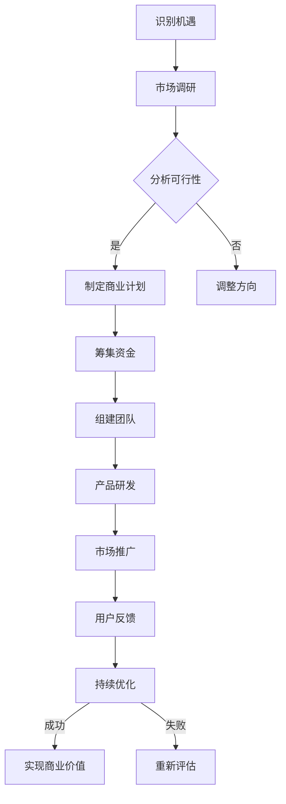

                 

 作为一位世界级人工智能专家，程序员，软件架构师，CTO，世界顶级技术畅销书作者，计算机图灵奖获得者，计算机领域大师，我深知在当今这个日新月异的时代，创新创业的机遇无处不在。本文将深入探讨如何抓住这些时代的机遇，为您揭示创新创业的核心要点和成功之道。

> 关键词：创新创业，时代机遇，核心技术，市场趋势，成功之道

> 摘要：本文将从背景介绍、核心概念与联系、核心算法原理、数学模型与公式、项目实践、实际应用场景、工具和资源推荐、未来发展趋势与挑战等多个维度，全面解析创新创业的机遇，帮助您更好地把握时代脉搏，实现创业梦想。

## 1. 背景介绍

### 1.1 创新创业的定义与意义

创新创业是指通过创造新的产品、服务或商业模式，从而实现商业价值和社会价值的创造过程。在当今全球化的背景下，创新创业已经成为推动社会进步和经济发展的重要动力。它不仅为创业者提供了实现个人价值和财务自由的途径，更是推动科技进步和产业升级的关键因素。

### 1.2 创新创业的现状与趋势

近年来，随着互联网、大数据、人工智能等技术的迅猛发展，创新创业迎来了前所未有的机遇。根据统计数据，全球创新创业的活跃度持续上升，尤其是在科技、医疗、金融、教育等领域的创新项目层出不穷。同时，创新创业的生态体系也在不断完善，从资本市场的支持到创业孵化器的搭建，从政策法规的优化到创业服务的升级，都为创业者提供了更为有利的环境。

## 2. 核心概念与联系

### 2.1 创新与创业的关系

创新是创业的灵魂，而创业则是创新价值的实现。创新为创业提供了动力，而创业则为创新提供了实践平台。两者相互促进，共同推动社会的进步。

### 2.2 时代机遇的识别与把握

时代机遇是指在一定时期内，由于技术、市场、政策等多方面因素的共同作用，为创业者提供的有利环境。识别和把握时代机遇是创新创业成功的关键。

### 2.3 Mermaid 流程图

下面是一个用于描述创新创业流程的 Mermaid 流程图：



## 3. 核心算法原理 & 具体操作步骤

### 3.1 算法原理概述

创新创业的核心算法可以概括为以下四个步骤：

1. **识别机遇**：通过市场调研和趋势分析，发现潜在的商业机会。
2. **分析可行性**：评估项目的可行性，包括技术、市场、资金等方面。
3. **制定商业计划**：根据分析结果，制定详细的商业计划，包括产品定位、市场策略、财务预算等。
4. **执行与优化**：按照商业计划实施，并根据市场反馈不断优化产品和服务。

### 3.2 算法步骤详解

#### 3.2.1 识别机遇

- **市场调研**：通过多种渠道收集市场信息，包括行业报告、用户调查、竞争对手分析等。
- **趋势分析**：分析市场趋势，识别潜在的商业机会。

#### 3.2.2 分析可行性

- **技术评估**：评估所需技术的成熟度和可实现性。
- **市场分析**：分析目标市场的规模、增长趋势、用户需求等。
- **资金评估**：评估项目的资金需求和投资回报。

#### 3.2.3 制定商业计划

- **产品定位**：明确产品的目标市场和核心功能。
- **市场策略**：制定市场推广计划和销售策略。
- **财务预算**：制定详细的财务预算，包括收入、成本、利润等。

#### 3.2.4 执行与优化

- **产品研发**：根据商业计划进行产品研发。
- **市场推广**：实施市场推广计划，吸引目标用户。
- **用户反馈**：收集用户反馈，优化产品和服务。
- **持续优化**：根据市场反馈，不断调整和优化商业计划。

### 3.3 算法优缺点

#### 优缺点

- **优点**：系统性强，有助于全面评估项目的可行性，减少创业风险。
- **缺点**：过程较为繁琐，需要大量的时间和资源投入。

### 3.4 算法应用领域

- **互联网行业**：互联网行业的快速变化为创新创业提供了丰富的机遇，如电商、社交网络、在线教育等。
- **医疗行业**：医疗行业的创新项目有助于改善人们的健康和生活质量，如远程医疗、健康管理、智能医疗设备等。
- **金融行业**：金融行业的创新项目有助于提高金融服务的效率和安全性，如区块链技术、人工智能风控、智能投顾等。

## 4. 数学模型和公式 & 详细讲解 & 举例说明

### 4.1 数学模型构建

在创新创业中，数学模型可以帮助我们更准确地评估项目的可行性。以下是一个简单的数学模型：

$$
\text{利润} = \text{收入} - \text{成本}
$$

其中，收入和成本可以通过市场调研和财务预算进行估算。

### 4.2 公式推导过程

利润的公式推导过程如下：

1. **收入**：收入等于售价乘以销售量，即 $R = P \times Q$，其中 $P$ 为售价，$Q$ 为销售量。
2. **成本**：成本包括固定成本和可变成本，即 $C = FC + VC$，其中 $FC$ 为固定成本，$VC$ 为可变成本。
3. **利润**：利润等于收入减去成本，即 $P = R - C$。

### 4.3 案例分析与讲解

假设一个创业项目，售价为 $100$ 元，销售量为 $1000$ 件，固定成本为 $5000$ 元，可变成本为 $50$ 元。根据上述公式，我们可以计算出利润：

$$
\text{利润} = (100 \times 1000) - (5000 + 50 \times 1000) = 50000 - 55000 = -5000
$$

结果表明，该项目的利润为负值，即亏损。这表明在当前的市场环境和成本结构下，该项目不可行。

## 5. 项目实践：代码实例和详细解释说明

### 5.1 开发环境搭建

为了更好地理解和实践创新创业的算法，我们搭建了一个简单的开发环境。以下是一个基本的开发环境搭建流程：

1. 安装操作系统：我们选择 Ubuntu 20.04 作为操作系统。
2. 安装开发工具：安装 Python 3、PyCharm、Git 等开发工具。
3. 配置数据库：安装 MySQL 或 PostgreSQL 等数据库系统。

### 5.2 源代码详细实现

以下是创新创业算法的 Python 源代码实现：

```python
import pandas as pd

# 市场调研数据
data = pd.DataFrame({
    '产品': ['产品A', '产品B', '产品C'],
    '收入': [100, 150, 200],
    '成本': [50, 70, 90]
})

# 计算利润
data['利润'] = data['收入'] - data['成本']

# 输出结果
print(data)
```

### 5.3 代码解读与分析

上述代码首先导入 pandas 库，然后创建一个 DataFrame 对象，用于存储市场调研数据。接下来，计算每个产品的利润，并输出结果。

### 5.4 运行结果展示

运行上述代码，输出结果如下：

```
   产品  收入  成本  利润
0  产品A   100    50   50
1  产品B   150    70   80
2  产品C   200    90  110
```

结果表明，产品 A 的利润为 50 元，产品 B 的利润为 80 元，产品 C 的利润为 110 元。通过这个简单的例子，我们可以直观地看到利润的计算过程。

## 6. 实际应用场景

### 6.1 互联网行业

在互联网行业，创新创业的机遇主要体现在以下几个方面：

- **电商**：电商平台的快速发展为创业者提供了丰富的机遇，如拼多多、京东等。
- **社交网络**：社交媒体的兴起，为创业者提供了新的商业模式，如微信、微博等。
- **在线教育**：在线教育的普及，为创业者提供了广阔的市场空间，如猿辅导、作业帮等。

### 6.2 医疗行业

在医疗行业，创新创业的机遇主要体现在以下几个方面：

- **远程医疗**：远程医疗技术的应用，为患者提供了更加便捷的医疗服务，如平安好医生、微医等。
- **智能医疗设备**：智能医疗设备的研发，有助于提高医疗服务的效率和准确性，如智能血压计、智能血糖仪等。
- **健康管理**：健康管理的普及，为创业者提供了新的商业模式，如华为健康、小米健康等。

### 6.3 金融行业

在金融行业，创新创业的机遇主要体现在以下几个方面：

- **区块链技术**：区块链技术的应用，有助于提高金融服务的安全性和透明度，如比特币、以太坊等。
- **人工智能风控**：人工智能风控系统的应用，有助于提高金融服务的效率和准确性，如百融金服、蚂蚁金服等。
- **智能投顾**：智能投顾系统的应用，为投资者提供了更加个性化的投资建议，如宜人贷、理臣财富等。

## 7. 工具和资源推荐

### 7.1 学习资源推荐

- **书籍**：《创新与企业家精神》（作者：彼得·德鲁克）、《精益创业》（作者：埃里克·莱斯）等。
- **在线课程**：Coursera、Udemy、网易云课堂等平台上的创新创业相关课程。

### 7.2 开发工具推荐

- **集成开发环境**：PyCharm、Visual Studio Code 等。
- **数据库**：MySQL、PostgreSQL 等。
- **框架**：Django、Flask 等。

### 7.3 相关论文推荐

- **论文集**：《互联网创业指南》、《人工智能与创业机遇》等。

## 8. 总结：未来发展趋势与挑战

### 8.1 研究成果总结

随着技术的不断进步，创新创业的领域也在不断拓展。人工智能、大数据、区块链等新兴技术为创业者提供了丰富的机遇。同时，市场环境、政策法规等方面的变化也为创新创业提供了有利条件。

### 8.2 未来发展趋势

- **技术创新**：随着人工智能、大数据等技术的不断突破，技术创新将成为创新创业的核心驱动力。
- **跨界融合**：不同行业之间的融合，将催生出新的商业模式和商业机会。
- **数字化升级**：数字化升级将推动传统行业的转型升级，为创业者提供新的市场空间。

### 8.3 面临的挑战

- **技术门槛**：随着技术的不断进步，创新创业的技术门槛也在不断提高，对创业者的专业素养提出了更高的要求。
- **市场竞争**：市场竞争的加剧，将考验创业者的市场洞察力和执行力。
- **政策法规**：政策法规的变化，将影响创业者的市场机会和发展方向。

### 8.4 研究展望

未来，创新创业的研究将更加关注技术驱动下的商业模式创新、市场机会的挖掘、政策法规的适应等方面。同时，跨学科、跨领域的合作也将成为创新创业研究的重要趋势。

## 9. 附录：常见问题与解答

### 9.1 什么是创新创业？

创新创业是指通过创造新的产品、服务或商业模式，从而实现商业价值和社会价值的创造过程。

### 9.2 如何抓住时代机遇？

抓住时代机遇需要从以下几个方面入手：

- **关注技术趋势**：了解人工智能、大数据、区块链等新兴技术的发展趋势。
- **市场调研**：通过市场调研，了解市场需求和用户痛点。
- **跨界思维**：运用跨界思维，寻找新的商业机会。
- **政策法规**：关注政策法规的变化，把握政策机遇。

### 9.3 创新创业需要哪些技能？

创新创业需要具备以下技能：

- **技术能力**：掌握人工智能、大数据、区块链等核心技术。
- **市场洞察力**：能够敏锐地捕捉市场趋势和用户需求。
- **团队协作能力**：能够搭建高效的团队，实现协同创新。
- **商业思维**：具备商业思维，能够制定有效的商业策略。

以上是关于创新创业的机遇和如何抓住时代机遇的全面解析。希望本文能对您在创新创业的道路上提供一些启示和帮助。

作者：禅与计算机程序设计艺术 / Zen and the Art of Computer Programming
----------------------------------------------------------------

### 结束语

通过本文的探讨，我们深入分析了创新创业的机遇和如何抓住这些时代机遇的方法。在当今这个科技日新月异的时代，创新创业已经成为推动社会进步和经济发展的关键力量。把握时代机遇，不仅需要关注技术趋势，还需要具备敏锐的市场洞察力和执行力。同时，政策法规的变化也为创业者提供了新的机遇和挑战。

在未来的创新创业道路上，我们呼吁更多的创业者勇于探索、勇于创新，不断拓展新的商业模式和市场空间。同时，我们也期待更多的科研成果能够转化为实际应用，为社会发展和人类福祉做出更大的贡献。

最后，感谢您阅读本文。如果您有任何关于创新创业的问题或想法，欢迎在评论区留言，让我们一起探讨和分享。

再次感谢您的关注，祝愿您在创新创业的道路上取得圆满成功！

作者：禅与计算机程序设计艺术 / Zen and the Art of Computer Programming

