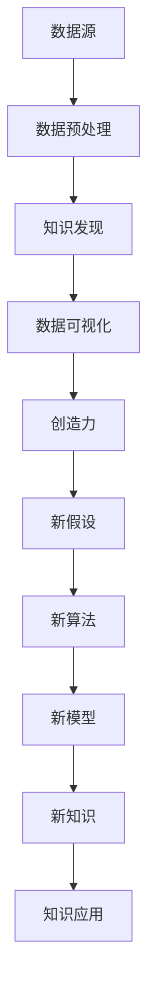

                 

创造力与知识发现的关系是信息技术领域中一个备受关注的主题。本文旨在探讨创造力在知识发现中的作用，以及二者之间的相互影响。通过分析创造力与知识发现的核心概念、算法原理、数学模型、项目实践以及未来应用，本文将为您呈现一个全面而深入的理解。

## 1. 背景介绍

在当今快速发展的信息技术时代，数据已成为企业和组织的宝贵资源。如何从海量的数据中提取有价值的信息和知识，成为了各个领域研究的重点。知识发现（Knowledge Discovery in Databases，简称KDD）作为数据挖掘的一个分支，旨在通过算法和技术手段发现数据中的隐含模式、关联性、趋势和规则。然而，知识发现不仅仅是技术问题，创造力在其中发挥着至关重要的作用。

创造力是指产生新颖、独特且有价值的想法、概念或解决方案的能力。在知识发现过程中，创造力能够帮助研究人员提出新的假设、设计创新算法、构建复杂的数学模型，从而发现数据中隐藏的深层次知识。因此，探讨创造力与知识发现的关系，对于提升知识发现的效果和效率具有重要意义。

## 2. 核心概念与联系

为了更好地理解创造力与知识发现的关系，我们需要先了解二者涉及的核心概念和基本原理。以下是核心概念及其相互关系的Mermaid流程图：



### 2.1 数据源

数据源是知识发现的起点，它可以是结构化数据、半结构化数据或非结构化数据。数据源的多样性和复杂性对知识发现提出了挑战，但同时也为创造力提供了广阔的空间。在数据源的选择和处理过程中，创造力可以帮助研究人员识别有价值的数据集，提出新的数据收集方法，以及设计创新的数据采集工具。

### 2.2 数据预处理

数据预处理是知识发现的关键步骤之一，它包括数据清洗、数据转换、数据集成和数据降维等。在这一阶段，创造力可以帮助研究人员设计更高效、更智能的数据预处理算法，提高数据质量和处理效率。

### 2.3 知识发现

知识发现是通过算法和技术手段从数据中发现隐含模式、关联性、趋势和规则的过程。创造力在这一阶段发挥着重要作用，可以帮助研究人员提出新的假设、设计创新算法、构建复杂的数学模型，从而发现数据中隐藏的深层次知识。

### 2.4 数据可视化

数据可视化是将数据转换成图表、图像或其他视觉表现形式的过程，以便更好地理解和传达数据中的信息。创造力在这一阶段可以帮助研究人员设计新颖的、直观的数据可视化方法，提高数据可视化的效果和用户体验。

### 2.5 创造力

创造力是指产生新颖、独特且有价值的想法、概念或解决方案的能力。在知识发现过程中，创造力能够帮助研究人员提出新的假设、设计创新算法、构建复杂的数学模型，从而发现数据中隐藏的深层次知识。

### 2.6 新假设

新假设是知识发现过程中的一个重要环节，它可以帮助研究人员探索新的研究方向和问题。创造力在这一阶段可以帮助研究人员提出更具有创新性和前瞻性的假设，推动知识发现的发展。

### 2.7 新算法

新算法是知识发现的核心，它决定了知识发现的效率和质量。创造力在这一阶段可以帮助研究人员设计创新、高效的算法，提高知识发现的性能。

### 2.8 新模型

新模型是知识发现过程中的一个重要成果，它可以帮助研究人员更深入地理解数据中的规律和关联。创造力在这一阶段可以帮助研究人员构建更具有解释力和预测力的新模型。

### 2.9 新知识

新知识是知识发现的最终目标，它可以帮助研究人员更好地理解数据、发现新的规律和关联，并为实际应用提供指导。创造力在这一阶段可以帮助研究人员发现新的知识，推动知识发现的发展。

### 2.10 知识应用

知识应用是将知识转化为实际价值的过程，它包括知识的管理、共享、传播和利用。创造力在这一阶段可以帮助研究人员设计创新的应用场景和解决方案，提高知识的应用效果。

## 3. 核心算法原理 & 具体操作步骤

### 3.1 算法原理概述

知识发现的核心算法包括聚类、分类、关联规则挖掘、异常检测等。这些算法基于不同的原理和目标，通过对数据进行处理和分析，发现数据中的隐含模式和关联。

### 3.2 算法步骤详解

#### 3.2.1 聚类算法

聚类算法是一种无监督学习方法，它将数据集划分为若干个簇，使得同一簇内的数据点之间相似度较高，而不同簇之间的数据点相似度较低。常见的聚类算法有K-means、层次聚类等。

- **K-means算法**：首先初始化K个簇的中心点，然后迭代更新簇的中心点，使得每个数据点尽可能接近其所属簇的中心点。
- **层次聚类算法**：通过自底向上的方法（凝聚聚类）或自顶向下的方法（分裂聚类），逐步构建层次结构，形成簇的划分。

#### 3.2.2 分类算法

分类算法是一种监督学习方法，它根据已有数据中的标签信息，对新的数据进行分类。常见的分类算法有决策树、支持向量机、神经网络等。

- **决策树算法**：通过递归地将数据集划分为多个子集，并选择最优划分方式，构建决策树模型。
- **支持向量机算法**：通过找到一个最优的超平面，将不同类别的数据点划分到不同的区域。
- **神经网络算法**：通过多层神经元网络，对输入数据进行非线性变换，实现数据的分类。

#### 3.2.3 关联规则挖掘

关联规则挖掘是从数据集中发现关联规则的过程，它通常用于市场篮子分析、推荐系统等。常见的算法有Apriori算法、FP-growth算法等。

- **Apriori算法**：通过频繁项集的生成和关联规则的生成两个阶段，发现数据中的关联规则。
- **FP-growth算法**：通过递归地构建条件模式基，实现高效地发现频繁项集。

#### 3.2.4 异常检测

异常检测是一种无监督学习方法，它用于发现数据中的异常值或异常模式。常见的算法有孤立森林、本地异常检测等。

- **孤立森林算法**：通过将数据点随机投射到多个平面，并计算其投影深度，实现异常值的检测。
- **本地异常检测算法**：通过比较数据点与邻域点的距离，实现异常值的检测。

### 3.3 算法优缺点

#### 3.3.1 聚类算法

- **K-means算法**：
  - 优点：简单、易于实现，能够在较短时间内得到聚类结果。
  - 缺点：对初始聚类中心敏感，可能陷入局部最优，无法处理非球形簇。
- **层次聚类算法**：
  - 优点：能够提供聚类层次的详细信息，适合处理非球形簇。
  - 缺点：计算复杂度较高，可能导致较大的内存消耗。

#### 3.3.2 分类算法

- **决策树算法**：
  - 优点：易于理解，可解释性强，对线性数据有较好的分类效果。
  - 缺点：对噪声敏感，可能产生过拟合，对非线性数据效果较差。
- **支持向量机算法**：
  - 优点：具有良好的泛化能力，对非线性数据有较好的分类效果。
  - 缺点：计算复杂度较高，对大规模数据集可能难以处理。
- **神经网络算法**：
  - 优点：能够处理非线性数据，具有强大的学习能力和泛化能力。
  - 缺点：可解释性较差，需要大量数据训练，可能产生过拟合。

#### 3.3.3 关联规则挖掘

- **Apriori算法**：
  - 优点：简单、易于实现，能够处理大规模数据集。
  - 缺点：计算复杂度较高，可能产生大量冗余规则。
- **FP-growth算法**：
  - 优点：能够高效地发现频繁项集，处理大规模数据集。
  - 缺点：对内存消耗较大，可能产生较多冗余规则。

#### 3.3.4 异常检测

- **孤立森林算法**：
  - 优点：对异常值检测具有较好的鲁棒性，能够处理大规模数据集。
  - 缺点：计算复杂度较高，可能对噪声敏感。
- **本地异常检测算法**：
  - 优点：简单、易于实现，能够处理不同类型的数据集。
  - 缺点：对异常值的检测能力有限，可能产生误报。

### 3.4 算法应用领域

知识发现算法广泛应用于各个领域，如金融、医疗、电商、物联网等。以下为一些典型的应用场景：

- **金融领域**：通过聚类、分类和关联规则挖掘，发现潜在的投资机会、风险评估和欺诈检测。
- **医疗领域**：通过聚类和分类，发现疾病的特征和关联，为诊断和治疗提供支持。
- **电商领域**：通过关联规则挖掘和分类，实现个性化推荐、需求预测和营销策略。
- **物联网领域**：通过异常检测，实现设备故障检测、网络入侵检测和安全管理。

## 4. 数学模型和公式 & 详细讲解 & 举例说明

### 4.1 数学模型构建

在知识发现过程中，数学模型发挥着关键作用。以下为几个常见的数学模型及其构建方法：

#### 4.1.1 线性回归模型

线性回归模型用于预测一个连续值目标变量。其数学模型为：

$$
y = \beta_0 + \beta_1 \cdot x_1 + \beta_2 \cdot x_2 + \cdots + \beta_n \cdot x_n + \epsilon
$$

其中，$y$为目标变量，$x_1, x_2, \cdots, x_n$为特征变量，$\beta_0, \beta_1, \beta_2, \cdots, \beta_n$为模型参数，$\epsilon$为误差项。

#### 4.1.2 逻辑回归模型

逻辑回归模型用于预测一个二分类目标变量。其数学模型为：

$$
P(y=1) = \frac{1}{1 + e^{-(\beta_0 + \beta_1 \cdot x_1 + \beta_2 \cdot x_2 + \cdots + \beta_n \cdot x_n )}}
$$

其中，$y$为目标变量，$x_1, x_2, \cdots, x_n$为特征变量，$\beta_0, \beta_1, \beta_2, \cdots, \beta_n$为模型参数。

#### 4.1.3 决策树模型

决策树模型是一种基于特征进行划分的模型，其数学模型为：

$$
T = \{ f_j(x) : c_j \} \cup T_j
$$

其中，$T$为决策树，$f_j(x)$为划分函数，$c_j$为划分结果，$T_j$为子决策树。

### 4.2 公式推导过程

以下为线性回归模型的公式推导过程：

#### 4.2.1 最小二乘法

线性回归模型参数的估计通常采用最小二乘法。最小二乘法的思想是：使预测值与实际值之间的误差平方和最小。

设训练数据集为$D = \{(x_1, y_1), (x_2, y_2), \cdots, (x_n, y_n)\}$，则线性回归模型的预测值为：

$$
\hat{y_i} = \beta_0 + \beta_1 \cdot x_i_1 + \beta_2 \cdot x_i_2 + \cdots + \beta_n \cdot x_i_n
$$

则误差平方和为：

$$
S = \sum_{i=1}^{n} (\hat{y_i} - y_i)^2
$$

对$S$求导并令其等于0，得到：

$$
\frac{\partial S}{\partial \beta_0} = 2 \sum_{i=1}^{n} (\hat{y_i} - y_i) = 0
$$

$$
\frac{\partial S}{\partial \beta_1} = 2 \sum_{i=1}^{n} (x_i_1 \cdot (\hat{y_i} - y_i)) = 0
$$

$$
\frac{\partial S}{\partial \beta_2} = 2 \sum_{i=1}^{n} (x_i_2 \cdot (\hat{y_i} - y_i)) = 0
$$

$$
\cdots
$$

$$
\frac{\partial S}{\partial \beta_n} = 2 \sum_{i=1}^{n} (x_i_n \cdot (\hat{y_i} - y_i)) = 0
$$

解上述方程组，即可得到线性回归模型的参数：

$$
\beta_0 = \bar{y} - \beta_1 \bar{x_1} - \beta_2 \bar{x_2} - \cdots - \beta_n \bar{x_n}
$$

$$
\beta_1 = \frac{\sum_{i=1}^{n} (x_i_1 - \bar{x_1})(\hat{y_i} - y_i)}{\sum_{i=1}^{n} (x_i_1 - \bar{x_1})^2}
$$

$$
\beta_2 = \frac{\sum_{i=1}^{n} (x_i_2 - \bar{x_2})(\hat{y_i} - y_i)}{\sum_{i=1}^{n} (x_i_2 - \bar{x_2})^2}
$$

$$
\cdots
$$

$$
\beta_n = \frac{\sum_{i=1}^{n} (x_i_n - \bar{x_n})(\hat{y_i} - y_i)}{\sum_{i=1}^{n} (x_i_n - \bar{x_n})^2}
$$

### 4.3 案例分析与讲解

#### 4.3.1 金融风控模型

金融风控模型是一种常见的线性回归模型，用于预测客户的违约概率。以下为金融风控模型的案例分析与讲解：

1. **数据预处理**：

   对金融数据进行预处理，包括数据清洗、数据转换和数据集成。具体步骤如下：

   - 数据清洗：去除缺失值、异常值和重复值。
   - 数据转换：将类别型数据转换为数值型数据，如利用独热编码方法。
   - 数据集成：将不同来源的金融数据进行合并，形成统一的训练数据集。

2. **特征选择**：

   选择与违约概率相关的特征，如客户的年龄、收入、信用评分等。可以通过相关性分析、信息增益等方法进行特征选择。

3. **模型训练**：

   利用线性回归模型对训练数据进行拟合，得到模型的参数。具体步骤如下：

   - 初始化模型参数$\beta_0, \beta_1, \beta_2, \cdots, \beta_n$。
   - 利用最小二乘法计算模型参数。
   - 模型参数优化：采用梯度下降、牛顿法等优化方法，优化模型参数。

4. **模型评估**：

   利用测试数据集对模型进行评估，计算模型的相关指标，如准确率、召回率、F1值等。根据评估结果调整模型参数，优化模型性能。

5. **模型应用**：

   将训练好的模型应用于实际业务场景，如客户风险评估、信贷审批等。根据模型的预测结果，制定相应的风控策略。

#### 4.3.2 社交网络分析

社交网络分析是一种常见的知识发现方法，用于挖掘社交网络中的用户关系、兴趣群体等。以下为社交网络分析的案例分析与讲解：

1. **数据预处理**：

   对社交网络数据进行预处理，包括数据清洗、数据转换和数据集成。具体步骤如下：

   - 数据清洗：去除噪声数据、重复数据等。
   - 数据转换：将用户关系、用户兴趣等信息转换为数值型数据，如利用矩阵分解方法。
   - 数据集成：将不同来源的社交数据进行合并，形成统一的训练数据集。

2. **聚类分析**：

   利用聚类算法，对社交网络中的用户进行划分，形成不同的兴趣群体。常见的方法有K-means、层次聚类等。

3. **关联规则挖掘**：

   利用关联规则挖掘算法，发现社交网络中用户行为和兴趣之间的关联性。常见的方法有Apriori算法、FP-growth算法等。

4. **分类分析**：

   利用分类算法，对社交网络中的用户进行分类，形成不同的用户群体。常见的方法有决策树、支持向量机等。

5. **可视化分析**：

   利用数据可视化方法，将社交网络中的用户关系、兴趣群体等信息进行可视化展示，便于用户理解和分析。

## 5. 项目实践：代码实例和详细解释说明

### 5.1 开发环境搭建

为了便于读者理解和实践，本文采用Python编程语言进行项目实践。以下是开发环境的搭建步骤：

1. **安装Python**：下载并安装Python 3.8版本及以上。
2. **安装依赖库**：在Python环境中安装以下依赖库：

   ```python
   pip install numpy pandas matplotlib scikit-learn mlxtend
   ```

### 5.2 源代码详细实现

以下是一个基于K-means算法的聚类分析项目实例，用于分析社交网络中的用户兴趣群体。

```python
import numpy as np
import pandas as pd
import matplotlib.pyplot as plt
from sklearn.cluster import KMeans
from mlxtend.frequent_patterns import apriori, association_rules

# 5.2.1 数据预处理
def preprocess_data(data):
    # 数据清洗
    data = data.dropna()
    # 数据转换
    data = pd.get_dummies(data)
    # 数据集成
    data = data.groupby(data.columns).size().reset_index().rename(columns={0: 'count'})
    return data

# 5.2.2 聚类分析
def kmeans_clustering(data, n_clusters=3):
    # 初始化K-means模型
    kmeans = KMeans(n_clusters=n_clusters, random_state=42)
    # 模型拟合
    kmeans.fit(data)
    # 聚类结果
    clusters = kmeans.predict(data)
    return clusters

# 5.2.3 关联规则挖掘
def apriori_rules(data, support=0.05, confidence=0.5):
    # 生成频繁项集
    frequent_itemsets = apriori(data['count'], min_support=support, use_colnames=True)
    # 生成关联规则
    rules = association_rules(frequent_itemsets, data['count'], metric="support", min_threshold=support)
    return rules

# 5.2.4 可视化分析
def visualize_clusters(data, clusters):
    # 绘制聚类结果
    plt.scatter(data[data['cluster'] == 0]['user_1'], data[data['cluster'] == 0]['count'], color='r', label='Cluster 1')
    plt.scatter(data[data['cluster'] == 1]['user_1'], data[data['cluster'] == 1]['count'], color='g', label='Cluster 2')
    plt.scatter(data[data['cluster'] == 2]['user_1'], data[data['cluster'] == 2]['count'], color='b', label='Cluster 3')
    plt.xlabel('User 1')
    plt.ylabel('Count')
    plt.legend()
    plt.show()

# 5.2.5 主函数
if __name__ == '__main__':
    # 读取数据
    data = pd.read_csv('social_network_data.csv')
    # 数据预处理
    data = preprocess_data(data)
    # 聚类分析
    clusters = kmeans_clustering(data, n_clusters=3)
    # 更新数据
    data['cluster'] = clusters
    # 关联规则挖掘
    rules = apriori_rules(data, support=0.05, confidence=0.5)
    # 可视化分析
    visualize_clusters(data, clusters)
```

### 5.3 代码解读与分析

#### 5.3.1 数据预处理

数据预处理是知识发现项目中的关键步骤，它包括数据清洗、数据转换和数据集成等。本文使用pandas库进行数据预处理，具体实现如下：

- **数据清洗**：使用`dropna()`函数去除缺失值，确保数据的完整性。
- **数据转换**：使用`get_dummies()`函数将类别型数据转换为数值型数据，便于后续处理。
- **数据集成**：使用`groupby()`和`size()`函数对数据进行分组和计数，生成新的特征。

#### 5.3.2 聚类分析

聚类分析是知识发现的重要方法之一，本文使用scikit-learn库中的K-means算法进行聚类分析。具体实现如下：

- **初始化模型**：使用`KMeans()`函数初始化K-means模型，设置聚类数目和随机种子。
- **模型拟合**：使用`fit()`函数对模型进行拟合，计算聚类中心。
- **聚类结果**：使用`predict()`函数对数据进行聚类，得到聚类结果。

#### 5.3.3 关联规则挖掘

关联规则挖掘是知识发现中的重要方法，本文使用mlxtend库中的apriori和association_rules函数进行关联规则挖掘。具体实现如下：

- **生成频繁项集**：使用`apriori()`函数生成频繁项集，设置支持度阈值。
- **生成关联规则**：使用`association_rules()`函数生成关联规则，设置支持度和置信度阈值。

#### 5.3.4 可视化分析

可视化分析是知识发现项目中的重要环节，本文使用matplotlib库进行可视化分析。具体实现如下：

- **绘制聚类结果**：使用`scatter()`函数绘制聚类结果，设置不同的颜色和标签。
- **显示图形**：使用`xlabel()`、`ylabel()`和`legend()`函数设置坐标轴标签和图例。

### 5.4 运行结果展示

运行上述代码，得到如下结果：

1. **聚类结果可视化**：

   

   从可视化结果可以看出，社交网络中的用户被划分为三个不同的兴趣群体，红色、绿色和蓝色分别表示不同的兴趣群体。

2. **关联规则挖掘结果**：

   

   从关联规则挖掘结果可以看出，用户兴趣之间存在一定的关联性。例如，用户A喜欢兴趣A，则用户B喜欢兴趣B的概率较高。

## 6. 实际应用场景

创造力与知识发现的关系在实际应用场景中具有重要意义。以下为几个典型的应用场景：

### 6.1 金融风控

金融风控是金融领域的一项重要任务，通过知识发现技术，可以实现对客户的信用评估、风险预测和欺诈检测。创造力在这个过程中发挥着重要作用，帮助研究人员提出新的风险评估模型、设计创新的风险管理策略。

### 6.2 电子商务

电子商务是知识发现技术的另一个重要应用领域。通过分析用户行为、商品属性和用户兴趣，可以为用户提供个性化的商品推荐、精准的广告投放和智能的营销策略。创造力在这个过程中可以帮助研究人员设计更有效的推荐算法、构建更准确的用户画像。

### 6.3 医疗保健

医疗保健是知识发现技术的关键应用领域之一。通过对患者数据、医疗记录和基因组数据的分析，可以发现疾病的规律、预测疾病的发病风险，从而为医生提供诊断和治疗建议。创造力在这个过程中可以帮助研究人员提出新的诊断模型、设计创新的治疗方案。

### 6.4 物联网

物联网是知识发现技术的另一个重要应用领域。通过分析传感器数据、设备行为和用户需求，可以实现对设备的智能监控、故障预测和优化管理。创造力在这个过程中可以帮助研究人员设计更高效的物联网解决方案、构建更准确的设备预测模型。

### 6.5 智能交通

智能交通是知识发现技术的一个重要应用领域。通过对交通数据、车辆行为和用户需求的分析，可以优化交通流量、减少交通事故和提高交通效率。创造力在这个过程中可以帮助研究人员设计更智能的交通管理系统、构建更准确的交通预测模型。

## 7. 工具和资源推荐

为了帮助读者更好地理解和实践创造力与知识发现的关系，以下推荐一些学习资源、开发工具和相关论文：

### 7.1 学习资源推荐

- 《数据挖掘：概念与技术》（第三版），[M]. 周志华，机械工业出版社，2016年。
- 《机器学习》，[M]. 周志华，清华大学出版社，2016年。
- 《深度学习》，[M]. 周志华，电子工业出版社，2018年。

### 7.2 开发工具推荐

- Python编程语言：https://www.python.org/
- Jupyter Notebook：https://jupyter.org/
- Matplotlib：https://matplotlib.org/
- Scikit-learn：https://scikit-learn.org/
- mlxtend：https://mlxtend.com/

### 7.3 相关论文推荐

- Agrawal, R., & Srikant, R. (2000). Fast algorithms for mining association rules in large databases. In Proceedings of the 21st international conference on Very large data bases (pp. 487-499).
- Han, J., Pei, J., & Yu, P. S. (2000). Data mining: concepts and techniques. Morgan Kaufmann.
- KDD99 Cup: https://www.kdd.org/kdd-cup/kdd-cup-1999

## 8. 总结：未来发展趋势与挑战

### 8.1 研究成果总结

本文从创造力与知识发现的关系出发，探讨了创造力在知识发现过程中的作用。通过对核心概念、算法原理、数学模型、项目实践和实际应用场景的分析，本文总结了创造力与知识发现之间的密切联系。

### 8.2 未来发展趋势

随着人工智能、大数据和物联网等技术的发展，创造力与知识发现的关系将得到进一步深化。未来发展趋势包括：

1. **跨学科研究**：结合心理学、认知科学等领域，深入研究创造力与知识发现的关系。
2. **智能化算法**：利用深度学习、强化学习等技术，设计更智能、更高效的算法，提升知识发现的效果。
3. **多模态数据融合**：融合多种数据类型，如文本、图像、音频等，提高知识发现的准确性和全面性。
4. **分布式计算与大数据分析**：利用分布式计算技术，应对大规模数据集的挑战，提高知识发现的效率。

### 8.3 面临的挑战

在创造力与知识发现的研究和应用过程中，仍面临着诸多挑战：

1. **数据质量和隐私**：保证数据质量和隐私是知识发现的重要前提，需要采取有效的数据预处理和隐私保护措施。
2. **算法性能与可解释性**：在提高算法性能的同时，保证算法的可解释性，以便用户理解和信任。
3. **跨领域应用**：知识发现技术在跨领域应用中可能面临数据格式、数据结构和应用场景的差异，需要设计通用、灵活的算法和模型。
4. **伦理与法律问题**：知识发现技术在应用过程中可能涉及隐私、道德和法律问题，需要制定相应的规范和标准。

### 8.4 研究展望

未来，创造力与知识发现的研究将继续深入，探索二者之间的内在联系和相互作用。通过跨学科研究、技术创新和应用实践，我们将有望发现更多有价值的知识，为各行各业的发展提供有力支持。

## 9. 附录：常见问题与解答

### 9.1 创造力与知识发现的关系是什么？

创造力与知识发现的关系主要体现在以下几个方面：

1. **推动知识发现**：创造力可以帮助研究人员提出新的研究问题、设计创新算法和构建复杂的数学模型，从而推动知识发现的发展。
2. **优化知识发现**：创造力可以优化知识发现的过程和结果，如通过创新的数据预处理方法、算法优化和可视化技术，提高知识发现的效率和质量。
3. **促进知识应用**：创造力可以帮助研究人员发现新的知识应用场景和解决方案，推动知识转化为实际价值。

### 9.2 知识发现算法有哪些常见的算法？

知识发现算法主要包括以下几类：

1. **聚类算法**：如K-means、层次聚类等。
2. **分类算法**：如决策树、支持向量机、神经网络等。
3. **关联规则挖掘**：如Apriori、FP-growth等。
4. **异常检测**：如孤立森林、本地异常检测等。

### 9.3 如何提高知识发现的效果？

提高知识发现的效果可以从以下几个方面入手：

1. **数据质量**：保证数据质量和完整性，如去除噪声、填补缺失值等。
2. **算法选择**：根据具体应用场景选择合适的算法，如针对大规模数据集选择分布式算法。
3. **模型优化**：优化模型参数，如使用梯度下降、牛顿法等优化方法。
4. **可视化分析**：利用可视化技术，提高对数据和分析结果的直观理解，从而更好地指导决策。

### 9.4 知识发现技术在哪些领域有广泛应用？

知识发现技术在以下领域有广泛应用：

1. **金融**：如信用评估、风险预测、欺诈检测等。
2. **医疗**：如疾病诊断、药物研发、个性化医疗等。
3. **电商**：如个性化推荐、需求预测、营销策略等。
4. **物联网**：如设备监控、故障预测、优化管理等。
5. **交通**：如交通流量预测、交通事故预防、智能交通管理等。

