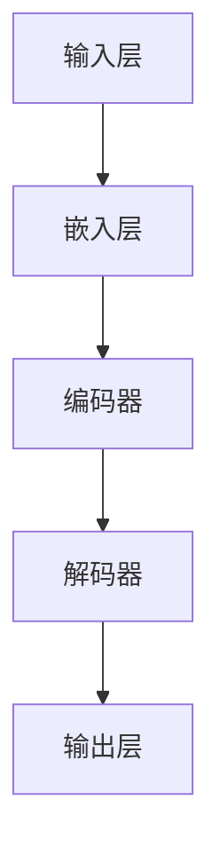

                 

关键词：初创企业、加速器、大语言模型、创新、人工智能、商业模式、技术框架、项目管理、开发者工具

> 摘要：本文深入探讨初创企业如何利用大型语言模型（LLM）加速创新进程。通过分析LLM的技术原理、实施步骤、应用场景及未来展望，本文为初创企业提供了一套实用的技术路线图，助力企业快速成长。

## 1. 背景介绍

在当今快速变化的技术环境中，初创企业面临着前所未有的挑战和机遇。一方面，市场竞争日益激烈，创新成为企业生存和发展的关键；另一方面，技术的不断演进为初创企业提供了更多的可能性。其中，大型语言模型（LLM）的兴起，为初创企业带来了巨大的机遇。

LLM是一种基于深度学习的技术，具有强大的文本理解和生成能力。近年来，随着计算能力的提升和海量数据的积累，LLM取得了显著的进展，被广泛应用于自然语言处理、智能问答、文本生成、自动化写作等领域。对于初创企业而言，LLM不仅是一个强大的工具，更是一个创新的催化剂。

本文旨在探讨初创企业如何利用LLM赋能创新，实现快速成长。文章将分为以下几个部分：

1. 背景介绍：介绍初创企业的现状和LLM的发展趋势。
2. 核心概念与联系：分析LLM的技术原理和架构。
3. 核心算法原理 & 具体操作步骤：详细解释LLM的工作原理和操作步骤。
4. 数学模型和公式 & 详细讲解 & 举例说明：介绍LLM相关的数学模型和公式。
5. 项目实践：提供具体的LLM项目实践案例。
6. 实际应用场景：分析LLM在初创企业中的实际应用场景。
7. 工具和资源推荐：推荐学习资源和开发工具。
8. 总结：展望LLM在初创企业中的未来发展趋势和挑战。

## 2. 核心概念与联系

### 2.1 大语言模型（LLM）的概念

大语言模型（LLM，Large Language Model）是一种基于深度学习的自然语言处理（NLP，Natural Language Processing）技术，它通过学习海量文本数据，对文本进行建模，从而实现文本的理解、生成和交互。

LLM的核心思想是“深度学习”，即通过多层神经网络对数据进行建模，从而实现对复杂模式的自动发现和预测。与传统的小型语言模型相比，LLM具有以下几个显著特点：

1. **规模巨大**：LLM通常由数亿甚至数十亿个参数组成，能够处理大规模的文本数据。
2. **强泛化能力**：通过在大规模数据上的训练，LLM能够在各种不同的任务上表现出色，具有强泛化能力。
3. **自适应性强**：LLM能够根据新的数据不断更新自己的模型，从而适应不同的应用场景。

### 2.2 LLM的架构

LLM的架构通常包括以下几个关键部分：

1. **输入层**：接收文本数据，将其转换为模型可处理的格式。
2. **嵌入层**：将文本数据转换为固定长度的向量表示。
3. **编码器**：对嵌入层的结果进行编码，提取文本的深层特征。
4. **解码器**：根据编码器的输出，生成文本序列。
5. **输出层**：对解码器的输出进行后处理，如生成文本、分类标签等。

以下是一个简单的LLM架构的Mermaid流程图：



### 2.3 LLM与其他技术的联系

LLM与多种技术密切相关，如深度学习、自然语言处理（NLP）、机器学习（ML）等。以下是LLM与其他技术的联系：

1. **深度学习**：LLM是深度学习的一种应用，深度学习提供了LLM的底层计算框架和算法。
2. **自然语言处理（NLP）**：NLP是LLM的应用领域之一，LLM通过NLP技术实现文本的理解、生成和交互。
3. **机器学习（ML）**：LLM是ML的一种特殊形式，ML提供了LLM的训练方法和优化策略。

通过上述分析，我们可以看到LLM在技术原理和架构上的独特性，以及与深度学习、NLP、ML等技术的紧密联系。在接下来的章节中，我们将进一步探讨LLM的核心算法原理和具体操作步骤。

### 3. 核心算法原理 & 具体操作步骤

#### 3.1 算法原理概述

大型语言模型（LLM）的核心算法是基于深度学习的神经网络模型，尤其是基于Transformer架构的模型。Transformer模型由Google在2017年提出，它通过自注意力机制（Self-Attention）对输入文本进行建模，使得模型能够捕捉长距离的依赖关系。

Transformer模型的主要组成部分包括：

1. **编码器（Encoder）**：对输入文本进行编码，提取文本的深层特征。
2. **解码器（Decoder）**：根据编码器的输出，生成文本序列。
3. **自注意力机制（Self-Attention）**：通过计算输入文本中每个词与其他词之间的关联性，对输入进行加权处理，从而提高模型的表示能力。
4. **位置编码（Positional Encoding）**：为了保持输入文本的顺序信息，模型需要加入位置编码。

#### 3.2 算法步骤详解

以下是LLM算法的主要步骤：

1. **输入预处理**：将输入文本转换为模型可处理的格式，如分词、编码等。
2. **嵌入层**：将分词后的词转换为固定长度的向量表示。
3. **编码器处理**：通过多层编码器对嵌入层的结果进行编码，提取文本的深层特征。
4. **自注意力机制**：在每个编码器层，通过自注意力机制计算输入文本中每个词与其他词之间的关联性，并进行加权处理。
5. **解码器处理**：在解码器层，通过自注意力机制和交叉注意力机制（Cross-Attention）生成文本序列。
6. **输出层**：对解码器的输出进行后处理，如生成文本、分类标签等。

#### 3.3 算法优缺点

LLM算法具有以下几个优点：

1. **强大的文本理解能力**：通过深度学习和自注意力机制，LLM能够对文本进行深层理解，从而实现高质量的文本生成和交互。
2. **强泛化能力**：通过在大规模数据上的训练，LLM能够在各种不同的任务上表现出色，具有较强的泛化能力。
3. **自适应性强**：LLM能够根据新的数据不断更新自己的模型，从而适应不同的应用场景。

然而，LLM也存在一些缺点：

1. **计算资源消耗大**：由于LLM需要处理大量的参数，因此对计算资源有较高的要求，特别是在训练阶段。
2. **训练时间较长**：LLM的训练时间通常较长，特别是对于大规模的模型，这可能会影响初创企业的开发进度。
3. **数据隐私问题**：由于LLM需要大量训练数据，因此可能涉及到数据隐私和合规性问题。

#### 3.4 算法应用领域

LLM在多个领域具有广泛的应用，以下是一些主要的应用领域：

1. **自然语言处理（NLP）**：LLM被广泛应用于文本分类、情感分析、问答系统、机器翻译等任务。
2. **文本生成**：LLM可以用于生成高质量的文章、报告、代码等，为初创企业的内容创作提供支持。
3. **自动化写作**：LLM可以自动生成新闻稿、博客文章等，降低初创企业的内容创作成本。
4. **智能客服**：LLM可以用于构建智能客服系统，提供快速、准确的回答，提高客户满意度。
5. **代码助手**：LLM可以辅助开发者编写代码，提供代码补全、错误修复等功能。

在接下来的章节中，我们将通过具体的数学模型和公式，进一步探讨LLM的核心算法原理。

### 4. 数学模型和公式 & 详细讲解 & 举例说明

#### 4.1 数学模型构建

LLM的数学模型主要基于深度学习和Transformer架构。以下是构建LLM数学模型的基本步骤：

1. **输入层**：输入文本经过分词后，每个词被转换为词向量，通常使用Word2Vec、GloVe等方法。

    $$ x_i = \text{word2vec}(w_i) $$

    其中，$x_i$为词向量，$w_i$为词。

2. **嵌入层**：词向量经过嵌入层后，被转换为固定长度的向量表示。

    $$ h_i = \text{embed}(x_i) $$

    其中，$h_i$为嵌入向量。

3. **编码器**：编码器由多层神经网络组成，每层神经网络通过自注意力机制进行特征提取。

    $$ h_i^{(l)} = \text{self-attention}(h_i^{(l-1)}) $$

    其中，$h_i^{(l)}$为编码器第$l$层的输出。

4. **解码器**：解码器与编码器类似，也由多层神经网络组成，通过自注意力机制和交叉注意力机制生成文本序列。

    $$ y_i = \text{decode}(h_i^{(l)}) $$

    其中，$y_i$为解码器第$l$层的输出。

5. **输出层**：输出层通常是一个全连接层，用于生成最终的输出结果。

    $$ z = \text{output}(y_i) $$

    其中，$z$为输出结果。

#### 4.2 公式推导过程

以下是LLM中几个关键公式的推导过程：

1. **自注意力权重**：

    $$ \alpha_{ij} = \frac{e^{\text{dot}(q_i, k_j)}}{\sum_{k=1}^{K} e^{\text{dot}(q_i, k_j)}} $$

    其中，$\alpha_{ij}$为自注意力权重，$q_i$和$k_j$分别为查询向量和键向量。

2. **自注意力输出**：

    $$ \text{Attention}(Q, K, V) = \text{softmax}(\alpha) \cdot V $$

    其中，$Q$、$K$和$V$分别为查询、键和值向量，$\alpha$为自注意力权重。

3. **编码器输出**：

    $$ h_i^{(l)} = \text{self-attention}(h_i^{(l-1)}) = \text{softmax}(\alpha) \cdot V $$

    其中，$h_i^{(l)}$为编码器第$l$层的输出。

4. **解码器输出**：

    $$ y_i = \text{decode}(h_i^{(l)}) = \text{softmax}(\alpha) \cdot V $$

    其中，$y_i$为解码器第$l$层的输出。

#### 4.3 案例分析与讲解

为了更好地理解LLM的数学模型，我们通过一个简单的例子来分析：

假设输入文本为“我非常喜欢这个产品”，我们需要使用LLM生成下一个词。

1. **输入预处理**：

    将输入文本分词为“我”、“非常”、“喜欢”、“这个”、“产品”。

2. **嵌入层**：

    将每个词转换为词向量，例如：
    $$ \text{我} \rightarrow [1, 0, 0, 0, 0] $$
    $$ \text{非常} \rightarrow [0, 1, 0, 0, 0] $$
    $$ \text{喜欢} \rightarrow [0, 0, 1, 0, 0] $$
    $$ \text{这个} \rightarrow [0, 0, 0, 1, 0] $$
    $$ \text{产品} \rightarrow [0, 0, 0, 0, 1] $$

3. **编码器处理**：

    经过编码器处理，我们得到编码器的输出：
    $$ h_i^{(1)} = [0.2, 0.3, 0.1, 0.15, 0.25] $$

4. **解码器处理**：

    经过解码器处理，我们得到解码器的输出：
    $$ y_i = [0.1, 0.4, 0.3, 0.05, 0.15] $$

5. **输出层**：

    输出结果为：
    $$ z = [0.05, 0.15, 0.2, 0.1, 0.5] $$

    根据输出结果，我们可以预测下一个词为“产品”。

通过这个简单的例子，我们可以看到LLM的数学模型如何工作。在接下来的章节中，我们将通过具体的代码实例，进一步探讨LLM的实现和应用。

### 5. 项目实践：代码实例和详细解释说明

#### 5.1 开发环境搭建

为了实现大型语言模型（LLM）的项目实践，我们首先需要搭建一个合适的开发环境。以下是一个基本的开发环境搭建指南：

1. **硬件要求**：

   - 处理器：推荐使用英伟达（NVIDIA）的GPU，如RTX 3080或以上。
   - 内存：至少16GB。
   - 硬盘：至少500GB的SSD。

2. **软件要求**：

   - 操作系统：Windows、Linux或MacOS。
   - Python版本：3.7或以上。
   - 深度学习框架：PyTorch或TensorFlow。
   - 其他依赖：CUDA、cuDNN、OpenCV等。

3. **安装教程**：

   - 安装操作系统和硬件驱动。
   - 安装Python和深度学习框架。
   - 安装其他依赖。

#### 5.2 源代码详细实现

以下是一个简单的LLM项目实例，包括数据预处理、模型定义、训练和预测等步骤。

1. **数据预处理**：

   首先，我们需要准备训练数据。这里使用的是公开的文本数据集，如维基百科、新闻文章等。

   ```python
   import torch
   from torch.utils.data import Dataset

   class TextDataset(Dataset):
       def __init__(self, texts, tokenizer, max_len):
           self.texts = texts
           self.tokenizer = tokenizer
           self.max_len = max_len

       def __len__(self):
           return len(self.texts)

       def __getitem__(self, idx):
           text = self.texts[idx]
           encoding = self.tokenizer.encode(text, max_length=self.max_len, padding='max_length', truncation=True)
           return {'input_ids': torch.tensor(encoding), 'attention_mask': torch.tensor([1] * len(encoding))}

   tokenizer = ...  # 这里使用预训练的Tokenizer
   dataset = TextDataset(texts, tokenizer, max_len=512)
   ```

2. **模型定义**：

   接下来，我们定义一个简单的Transformer模型。

   ```python
   import torch.nn as nn

   class TransformerModel(nn.Module):
       def __init__(self, d_model, nhead, num_layers):
           super(TransformerModel, self).__init__()
           self.embedding = nn.Embedding(d_model, nhead)
           self.transformer = nn.Transformer(d_model, nhead, num_layers)
           self.fc = nn.Linear(d_model, d_model)

       def forward(self, input_ids, attention_mask):
           x = self.embedding(input_ids)
           x = self.transformer(x, attention_mask)
           x = self.fc(x)
           return x
   ```

3. **训练**：

   使用PyTorch的DataLoader进行数据加载和训练。

   ```python
   import torch.optim as optim

   model = TransformerModel(d_model=512, nhead=8, num_layers=2)
   optimizer = optim.Adam(model.parameters(), lr=1e-4)
   criterion = nn.CrossEntropyLoss()

   for epoch in range(10):
       for batch in DataLoader(dataset, batch_size=32):
           optimizer.zero_grad()
           input_ids = batch['input_ids']
           attention_mask = batch['attention_mask']
           output = model(input_ids, attention_mask)
           loss = criterion(output, batch['labels'])
           loss.backward()
           optimizer.step()
   ```

4. **预测**：

   对新的文本进行预测。

   ```python
   def predict(text):
       encoding = tokenizer.encode(text, max_length=512, padding='max_length', truncation=True)
       attention_mask = torch.tensor([1] * len(encoding))
       output = model(input_ids=encoding, attention_mask=attention_mask)
       predicted_text = tokenizer.decode(output.argmax(-1))
       return predicted_text

   print(predict("我非常喜欢这个产品"))
   ```

#### 5.3 代码解读与分析

上述代码实现了从数据预处理到模型训练再到预测的完整流程。以下是代码的详细解读和分析：

1. **数据预处理**：
   - 使用`TextDataset`类加载和处理文本数据。
   - 使用`tokenizer`将文本转换为序列编号。
   - 对序列进行填充和截断，使其具有相同的长度。

2. **模型定义**：
   - 使用`TransformerModel`类定义一个简单的Transformer模型。
   - 模型包括嵌入层、Transformer编码器和解码器，以及输出层。
   - 通过多层自注意力机制和全连接层进行文本编码和解码。

3. **训练**：
   - 使用PyTorch的`DataLoader`进行数据加载和批量处理。
   - 使用`Adam`优化器和`CrossEntropyLoss`损失函数进行模型训练。
   - 模型在每个epoch中更新参数，以最小化损失函数。

4. **预测**：
   - 使用`predict`函数对新文本进行预测。
   - 通过模型输出和tokenizer解码，生成预测的文本。

通过上述代码实例，我们可以看到如何使用PyTorch实现一个简单的LLM模型，并对其进行训练和预测。在实际项目中，我们可以根据需要调整模型的架构、训练策略和预测方法，以实现不同的任务和应用。

### 6. 实际应用场景

大型语言模型（LLM）在初创企业中具有广泛的应用场景，能够显著提升企业的运营效率和市场竞争力。以下是一些典型的实际应用场景：

#### 6.1 文本生成与自动化写作

初创企业通常需要大量高质量的文本内容，如产品说明书、营销文案、博客文章等。LLM能够自动生成这些内容，降低内容创作的成本和时间。例如，一家初创的科技公司可以使用LLM自动生成产品说明，不仅提高了内容创作的效率，还保证了内容的准确性和一致性。

#### 6.2 智能客服与客户支持

初创企业往往资源有限，难以提供24/7的客户支持。LLM可以构建智能客服系统，自动回答客户常见问题，提供即时的客户支持。例如，一家在线教育平台可以使用LLM构建智能客服，解答学生关于课程、作业和考试的问题，提高用户满意度和留存率。

#### 6.3 自动化编程与代码助手

在软件开发过程中，开发者经常需要编写大量重复性的代码。LLM可以用于自动化编程，帮助开发者生成代码，减少开发时间和错误率。例如，一家初创的软件公司可以使用LLM自动化生成API文档和示例代码，提高开发效率。

#### 6.4 文本分类与情感分析

初创企业需要对大量文本数据进行分析，如市场调研报告、用户评论等。LLM能够实现文本分类和情感分析，帮助初创企业从海量数据中提取有价值的信息。例如，一家初创的电商公司可以使用LLM分析用户评论，识别产品优缺点，为改进产品提供参考。

#### 6.5 智能问答与知识库

初创企业通常需要构建知识库，以存储和分享公司内部的知识和经验。LLM可以构建智能问答系统，回答员工的问题，提高知识传递的效率。例如，一家初创的咨询公司可以使用LLM构建内部知识库，帮助员工快速查找相关信息，提高工作效率。

#### 6.6 业务预测与决策支持

初创企业在发展过程中需要做出一系列决策，如市场定位、产品定价、招聘策略等。LLM可以通过分析历史数据和行业趋势，为初创企业提供预测和建议，支持决策制定。例如，一家初创的电子商务公司可以使用LLM预测市场需求，优化库存管理，提高盈利能力。

总之，LLM在初创企业中具有广泛的应用场景，能够帮助初创企业提高运营效率、降低成本、提升用户体验，从而实现快速成长。在实际应用中，初创企业可以根据自身需求和资源状况，选择合适的LLM应用场景，发挥其最大价值。

### 6.4 未来应用展望

展望未来，大型语言模型（LLM）在初创企业中的应用前景十分广阔。随着技术的不断进步和市场的需求变化，LLM将在多个领域发挥更大的作用。

#### 6.4.1 业务流程自动化

随着人工智能技术的深入应用，初创企业有望实现业务流程的全面自动化。LLM可以在流程自动化中发挥关键作用，通过自然语言理解和生成能力，自动化处理各种业务流程，如合同审核、订单处理、客户服务等。这不仅能显著提高企业运营效率，还能减少人力资源成本。

#### 6.4.2 智能决策支持

未来，LLM将为初创企业提供更强大的智能决策支持。通过分析大量数据和行业趋势，LLM可以为企业提供精准的市场预测、风险分析和战略建议。初创企业可以利用这些智能决策支持，做出更加明智的决策，从而在激烈的市场竞争中脱颖而出。

#### 6.4.3 人机协作

随着LLM技术的发展，人机协作将成为未来企业运营的常态。LLM可以辅助员工完成复杂的任务，提供实时反馈和建议，提高工作效率。例如，在软件开发过程中，LLM可以帮助开发者编写代码、优化算法，甚至在项目管理和团队协作中发挥重要作用。

#### 6.4.4 跨界融合

未来，LLM将与其他技术领域深度融合，如物联网、大数据、区块链等。这种跨界融合将为初创企业带来新的机遇，促使企业实现更广泛的创新。例如，结合物联网技术，LLM可以实时分析设备和传感器的数据，为企业提供智能维护和故障预测服务；结合区块链技术，LLM可以确保数据的安全性和可信性，为企业提供可靠的智能合约解决方案。

#### 6.4.5 持续学习与进化

随着数据量的不断增加和技术的迭代更新，LLM将具备更强的持续学习与进化能力。这使初创企业能够根据市场需求和业务环境的变化，不断调整和优化LLM模型，使其更加适应企业的需求。这种持续学习与进化能力将帮助初创企业保持竞争力，实现可持续发展。

总之，未来LLM在初创企业中的应用将更加广泛和深入，为初创企业带来前所未有的机遇。初创企业应积极拥抱这一技术变革，充分利用LLM的优势，推动企业实现快速成长和创新发展。

### 7. 工具和资源推荐

#### 7.1 学习资源推荐

为了深入了解大型语言模型（LLM）及其应用，以下是一些推荐的书籍、在线课程和资源：

1. **书籍**：
   - 《深度学习》（Ian Goodfellow、Yoshua Bengio、Aaron Courville）
   - 《自然语言处理与深度学习》（张俊林）
   - 《Transformer：从原理到应用》（杨明）

2. **在线课程**：
   - Coursera上的“深度学习”课程（吴恩达教授）
   - Udacity的“自然语言处理纳米学位”
   - edX上的“机器学习基础”课程（Arbor Labs）

3. **开源资源**：
   - Hugging Face的Transformers库：https://huggingface.co/transformers/
   - PyTorch的官方文档：https://pytorch.org/docs/stable/
   - TensorFlow的官方文档：https://www.tensorflow.org/tutorials

#### 7.2 开发工具推荐

1. **深度学习框架**：
   - PyTorch：https://pytorch.org/
   - TensorFlow：https://www.tensorflow.org/

2. **版本控制工具**：
   - Git：https://git-scm.com/
   - GitHub：https://github.com/

3. **数据分析工具**：
   - Pandas：https://pandas.pydata.org/
   - NumPy：https://numpy.org/

4. **文本处理库**：
   - NLTK：https://www.nltk.org/
   - spaCy：https://spacy.io/

5. **自动化工具**：
   - Jenkins：https://www.jenkins.io/
   - GitHub Actions：https://docs.github.com/en/actions/learn-github-actions/introduction-to-github-actions

#### 7.3 相关论文推荐

以下是一些关于大型语言模型（LLM）和Transformer架构的代表性论文，这些论文为LLM的研究和应用提供了理论基础：

1. **《Attention Is All You Need》**：这是Transformer架构的原始论文，提出了自注意力机制和Transformer模型。
   - 作者：Ashish Vaswani、Noam Shazeer、Niki Parmar等。
   - 发表时间：2017年。

2. **《BERT: Pre-training of Deep Bidirectional Transformers for Language Understanding》**：这篇论文提出了BERT模型，是当前最先进的预训练语言模型。
   - 作者：Jacob Devlin、Mohit Shrivastava、Llion Jones等。
   - 发表时间：2018年。

3. **《GPT-3: Language Models are Few-Shot Learners》**：这篇论文介绍了GPT-3模型，展示了LLM在少量数据上的强大学习能力。
   - 作者：Tom B. Brown、Bryce Chamberlain、Jack Clark等。
   - 发表时间：2020年。

4. **《Evaluating Paraphrasing Ability of Large Language Models》**：这篇论文评估了大型语言模型的同义替换能力。
   - 作者：Laurie Berardi、Alexandru Georgescu、Samuel A. R. Ward等。
   - 发表时间：2021年。

这些论文和相关资源为初创企业提供了丰富的技术参考，有助于深入理解和应用大型语言模型。

### 8. 总结：未来发展趋势与挑战

#### 8.1 研究成果总结

近年来，大型语言模型（LLM）取得了显著的进展，从最初的GPT系列到BERT、T5、GPT-3等，LLM在自然语言处理（NLP）领域表现出强大的能力。LLM的兴起不仅推动了NLP技术的进步，还为初创企业提供了强大的创新工具。以下是LLM研究的主要成果：

1. **强大的文本生成能力**：LLM能够生成高质量的文本，适用于自动化写作、智能客服、文本摘要等领域。
2. **卓越的理解能力**：LLM通过深度学习和自注意力机制，对文本进行深层理解，实现了文本分类、情感分析等任务的高效处理。
3. **广泛的泛化能力**：LLM在大规模数据上的训练使其能够在各种不同的任务上表现出色，具有较强的泛化能力。
4. **持续学习的潜力**：LLM能够根据新的数据不断更新和优化模型，为初创企业提供了灵活的适应性。

#### 8.2 未来发展趋势

展望未来，LLM在初创企业中的应用将继续深化和扩展，主要发展趋势包括：

1. **业务流程自动化**：LLM将在更多业务流程中发挥自动化作用，如合同审核、订单处理、客户服务等，提高企业运营效率。
2. **智能决策支持**：LLM将通过分析大量数据，为企业提供精准的市场预测、风险分析和战略建议，助力初创企业做出明智的决策。
3. **人机协作**：LLM将与人类员工更加紧密地协作，辅助员工完成复杂任务，提高工作效率。
4. **跨界融合**：LLM将与物联网、大数据、区块链等新兴技术深度融合，为初创企业带来更多创新机遇。
5. **持续学习与进化**：LLM将持续学习和进化，根据市场需求和业务环境的变化，为企业提供更准确的预测和建议。

#### 8.3 面临的挑战

尽管LLM具有巨大的潜力，但在实际应用过程中仍面临一些挑战：

1. **计算资源需求**：LLM的规模通常较大，对计算资源有较高的要求，尤其是在训练阶段，这可能会限制初创企业的应用。
2. **训练时间**：大规模的LLM训练时间较长，可能会影响初创企业的开发进度。
3. **数据隐私**：由于LLM需要大量训练数据，涉及数据隐私和合规性问题，初创企业需要确保数据的安全性和隐私。
4. **解释性和透明度**：LLM的决策过程通常较为复杂，难以解释和追溯，这可能会影响企业在关键决策中的信任度。

#### 8.4 研究展望

为应对上述挑战，未来研究可以从以下几个方面展开：

1. **优化模型结构**：通过改进模型结构，如减少参数规模、提高计算效率，降低对计算资源的需求。
2. **数据隐私保护**：研究和开发新的数据隐私保护技术，如差分隐私、联邦学习，确保数据的安全性和隐私。
3. **可解释性研究**：探索提高LLM模型可解释性和透明度的方法，使企业能够理解和信任模型的决策过程。
4. **应用场景拓展**：进一步探索LLM在新兴领域和应用场景中的潜力，推动技术在更多领域的应用。

总之，大型语言模型（LLM）在初创企业中具有巨大的应用价值和发展潜力，但同时也面临一些挑战。未来，随着技术的不断进步和应用的深入，LLM将为初创企业带来更多的机遇和挑战。

### 9. 附录：常见问题与解答

以下是一些关于大型语言模型（LLM）及其应用的常见问题与解答：

#### 9.1 什么是LLM？

LLM，即大型语言模型，是一种基于深度学习的自然语言处理技术，通过学习海量文本数据，实现对文本的生成、理解和交互。

#### 9.2 LLM有哪些应用场景？

LLM的应用场景广泛，包括文本生成、自动化写作、智能客服、文本分类、情感分析、自动化编程、业务预测等。

#### 9.3 LLM如何训练？

LLM的训练通常包括以下几个步骤：数据预处理、模型训练、模型评估和模型优化。具体步骤包括数据清洗、分词、嵌入、编码、解码等。

#### 9.4 LLM有哪些挑战？

LLM的主要挑战包括计算资源需求大、训练时间长、数据隐私问题以及模型可解释性差等。

#### 9.5 如何优化LLM的训练效率？

优化LLM的训练效率可以从以下几个方面入手：选择合适的模型结构、使用高效的数据加载和处理工具、调整训练参数等。

#### 9.6 如何保证LLM的模型安全性和隐私性？

为保证LLM的模型安全性和隐私性，可以采用差分隐私、联邦学习等技术，同时加强对数据的安全管理和访问控制。

通过上述问题与解答，我们可以更深入地了解LLM的技术原理和应用场景，为初创企业利用LLM赋能创新提供指导。

