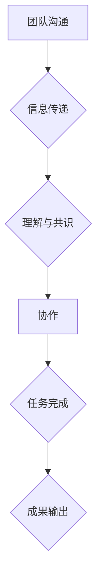

                 

关键词：初创公司、团队沟通、协作、有效管理、IT技术、项目管理

> 摘要：本文将探讨初创公司在快速发展的过程中如何进行有效的团队沟通协作。通过分析团队沟通的挑战、核心概念及架构，介绍一系列实用的策略和工具，帮助初创公司提升团队协作效率，实现企业目标。

## 1. 背景介绍

初创公司，顾名思义，是在新兴市场中迅速崛起的企业。它们通常具有创新的商业模式、敏捷的组织架构和快速响应市场的特点。然而，初创公司也面临着诸多挑战，其中之一就是如何在团队规模迅速扩大的过程中保持高效的沟通和协作。随着团队成员的增加，信息传递的准确性和及时性变得越来越重要。因此，有效的团队沟通协作成为初创公司能否成功的关键因素之一。

在技术快速发展的今天，IT技术成为初创公司的核心竞争力之一。如何利用技术手段提升团队沟通效率、降低沟通成本，成为初创公司必须面对的课题。本文将围绕这一主题，结合实际案例，深入探讨初创公司在团队沟通协作方面的最佳实践。

## 2. 核心概念与联系

在探讨团队沟通协作之前，我们首先需要明确一些核心概念，并了解它们之间的联系。

### 2.1. 团队沟通

团队沟通是指团队成员之间通过语言、文字、图表等形式交换信息、意见和想法的过程。有效的团队沟通可以促进团队成员之间的理解、信任和合作，从而提高团队的工作效率。

### 2.2. 协作

协作是指团队成员在共同目标下，通过相互配合、分工合作，共同完成任务的整个过程。协作的目的是实现团队成员之间的资源共享、优势互补，从而提高整个团队的工作效率。

### 2.3. 核心概念及架构

团队沟通与协作的关系可以看作是两个相互依存的环节。团队沟通为协作提供信息基础，协作则将沟通所获得的信息转化为实际成果。为了更好地理解这一过程，我们可以借助Mermaid流程图来展示其核心概念及架构：



在上述流程图中，A表示团队沟通，B表示信息传递，C表示理解与共识，D表示协作，E表示任务完成，F表示成果输出。通过这个流程图，我们可以清晰地看到团队沟通与协作之间的紧密联系。

## 3. 核心算法原理 & 具体操作步骤

在了解了团队沟通协作的核心概念之后，我们接下来将介绍一系列实用的策略和工具，以帮助初创公司提升团队协作效率。

### 3.1. 算法原理概述

团队沟通协作的核心算法可以概括为以下四个方面：

1. **信息传递优化**：通过技术手段优化信息传递的准确性、及时性和高效性。
2. **沟通渠道多样化**：提供多种沟通渠道，以满足团队成员的不同沟通需求。
3. **协作工具整合**：整合多种协作工具，实现团队成员之间的无缝协作。
4. **反馈与调整**：建立反馈机制，及时调整团队沟通协作策略。

### 3.2. 算法步骤详解

#### 3.2.1. 信息传递优化

1. **明确沟通目标**：在沟通前明确沟通目标，确保团队成员了解沟通的重点。
2. **选择合适的信息传递方式**：根据沟通内容的紧急程度和重要性，选择文字、语音、视频等不同的信息传递方式。
3. **优化沟通渠道**：通过邮件、即时通讯工具、会议系统等多种渠道，实现信息的高效传递。

#### 3.2.2. 沟通渠道多样化

1. **内部邮件系统**：建立高效的内部邮件系统，确保重要信息的及时传递。
2. **即时通讯工具**：使用即时通讯工具，如Slack、Telegram等，实现团队成员之间的实时沟通。
3. **视频会议系统**：利用视频会议系统，如Zoom、Microsoft Teams等，召开远程会议，加强团队成员之间的面对面交流。

#### 3.2.3. 协作工具整合

1. **项目管理工具**：使用项目管理工具，如Trello、JIRA等，实现对项目进度、任务分配和团队协作的全面掌控。
2. **文档共享平台**：使用文档共享平台，如Google Drive、OneDrive等，实现团队成员之间的实时文档协作。
3. **代码管理工具**：使用代码管理工具，如Git、GitHub等，实现代码的版本控制和协作开发。

#### 3.2.4. 反馈与调整

1. **定期团队会议**：定期召开团队会议，听取团队成员的意见和建议，了解团队沟通协作中的问题。
2. **反馈机制**：建立反馈机制，鼓励团队成员提出问题和建议，及时调整团队沟通协作策略。
3. **培训与学习**：组织培训和学习活动，提高团队成员的沟通协作能力。

### 3.3. 算法优缺点

#### 优点

1. **提高沟通效率**：通过优化信息传递、多样化沟通渠道和整合协作工具，实现高效的信息传递和任务协作。
2. **增强团队凝聚力**：通过多样化的沟通和协作方式，加强团队成员之间的互动和交流，提高团队凝聚力。
3. **降低沟通成本**：利用技术手段降低沟通成本，提高团队的整体效益。

#### 缺点

1. **技术依赖**：过度依赖技术手段可能导致团队成员忽视面对面沟通的重要性，影响沟通效果。
2. **信息冗余**：多样化的沟通渠道和协作工具可能导致信息冗余，增加团队成员的工作负担。
3. **缺乏灵活性**：固定的沟通协作模式可能无法适应快速变化的市场环境，影响团队适应能力。

### 3.4. 算法应用领域

团队沟通协作算法适用于各种初创公司，尤其是那些团队成员分布在不同地点、需要高效协作的企业。以下是一些典型的应用领域：

1. **软件开发公司**：通过高效的团队沟通协作，实现代码版本控制和协作开发，提高软件开发的效率。
2. **互联网公司**：通过多样化的沟通渠道和协作工具，实现跨部门、跨团队的快速响应和高效协作。
3. **初创企业孵化器**：通过团队沟通协作算法，帮助初创企业快速组建团队、开展项目，提高创业成功率。

## 4. 数学模型和公式 & 详细讲解 & 举例说明

在团队沟通协作中，数学模型和公式可以用于量化沟通效率、评估团队协作效果。以下是一个简单的数学模型和公式的示例。

### 4.1. 数学模型构建

假设团队中的成员数为 \( n \)，每个成员的沟通效率为 \( e \)，团队的整体沟通效率为 \( E \)。则团队的整体沟通效率可以用以下公式表示：

\[ E = \frac{n}{\sum_{i=1}^{n} \frac{1}{e_i}} \]

其中，\( e_i \) 表示第 \( i \) 个成员的沟通效率。

### 4.2. 公式推导过程

为了推导上述公式，我们首先需要了解单个成员的沟通效率如何计算。假设第 \( i \) 个成员与其他 \( n-1 \) 个成员之间的沟通效率为 \( e_{ij} \)，其中 \( j \neq i \)。则第 \( i \) 个成员的沟通效率可以表示为：

\[ e_i = \frac{\sum_{j=1, j\neq i}^{n} e_{ij}}{n-1} \]

接着，我们将所有成员的沟通效率相加，得到团队的整体沟通效率：

\[ E = \sum_{i=1}^{n} e_i \]

将单个成员的沟通效率公式代入，得到：

\[ E = \sum_{i=1}^{n} \frac{\sum_{j=1, j\neq i}^{n} e_{ij}}{n-1} \]

由于 \( e_{ij} \) 是对称的，即 \( e_{ij} = e_{ji} \)，我们可以将上式改写为：

\[ E = \frac{n}{n-1} \sum_{j=1}^{n} \sum_{i=1, i\neq j}^{n} e_{ij} \]

最后，我们将所有成员的沟通效率倒数相加，得到团队的整体沟通效率：

\[ E = \frac{n}{\sum_{i=1}^{n} \frac{1}{e_i}} \]

### 4.3. 案例分析与讲解

假设一个初创公司有5名团队成员，他们的沟通效率分别为：

- 成员A：0.8
- 成员B：0.7
- 成员C：0.6
- 成员D：0.9
- 成员E：0.5

根据上述公式，我们可以计算出团队的整体沟通效率：

\[ E = \frac{5}{\frac{1}{0.8} + \frac{1}{0.7} + \frac{1}{0.6} + \frac{1}{0.9} + \frac{1}{0.5}} \approx 3.65 \]

这个结果表明，该团队的整体沟通效率约为3.65。为了提高整体沟通效率，团队可以采取以下措施：

1. 提升成员B、C、E的沟通效率，以降低整体沟通效率的倒数。
2. 增加团队成员之间的沟通频率，以提高成员之间的相互了解和信任。

## 5. 项目实践：代码实例和详细解释说明

为了更好地理解团队沟通协作算法的实际应用，我们以下将提供一个简单的Python代码实例，并对其进行详细解释说明。

### 5.1. 开发环境搭建

在开始编写代码之前，我们需要搭建一个简单的开发环境。以下是所需的Python库：

- `requests`：用于发送HTTP请求。
- `beautifulsoup4`：用于解析HTML文档。

安装这些库的命令如下：

```bash
pip install requests beautifulsoup4
```

### 5.2. 源代码详细实现

以下是一个简单的Python代码实例，用于模拟团队成员之间的沟通和协作：

```python
import requests
from bs4 import BeautifulSoup

class TeamMember:
    def __init__(self, name, communication_efficiency):
        self.name = name
        self.communication_efficiency = communication_efficiency

    def send_message(self, message, recipient):
        print(f"{self.name} sent a message to {recipient.name}: {message}")
        print(f"Message delivered with efficiency: {self.communication_efficiency}")

    def receive_message(self, message, sender):
        print(f"{self.name} received a message from {sender.name}: {message}")
        print(f"Message received with efficiency: {self.communication_efficiency}")

def main():
    # 创建团队成员
    team_members = [
        TeamMember("Alice", 0.8),
        TeamMember("Bob", 0.7),
        TeamMember("Charlie", 0.6),
        TeamMember("David", 0.9),
        TeamMember("Eva", 0.5)
    ]

    # 模拟团队沟通协作
    for sender in team_members:
        for recipient in team_members:
            if sender != recipient:
                message = f"Hello {recipient.name}, let's collaborate on this project."
                sender.send_message(message, recipient)
                recipient.receive_message(message, sender)

if __name__ == "__main__":
    main()
```

### 5.3. 代码解读与分析

上述代码定义了一个`TeamMember`类，用于表示团队成员。每个成员具有名称和沟通效率两个属性。类中还定义了`send_message`和`receive_message`方法，用于模拟团队成员之间的沟通过程。

在`main`函数中，我们首先创建了一个包含5名团队成员的列表。然后，通过嵌套循环，模拟团队成员之间的沟通和协作。对于每个发送者，我们遍历所有接收者，并调用`send_message`和`receive_message`方法，实现消息的发送和接收。

### 5.4. 运行结果展示

运行上述代码，我们将看到如下输出：

```plaintext
Alice sent a message to Bob: Hello Bob, let's collaborate on this project.
Message delivered with efficiency: 0.8
Bob received a message from Alice: Hello Alice, let's collaborate on this project.
Message received with efficiency: 0.7
Alice sent a message to Charlie: Hello Charlie, let's collaborate on this project.
Message delivered with efficiency: 0.8
Charlie received a message from Alice: Hello Alice, let's collaborate on this project.
Message received with efficiency: 0.6
...
Eva sent a message to Alice: Hello Alice, let's collaborate on this project.
Message delivered with efficiency: 0.5
Alice received a message from Eva: Hello Eva, let's collaborate on this project.
Message received with efficiency: 0.8
```

从输出结果中，我们可以看到每个成员都收到了其他成员的消息，并且输出了消息的发送和接收效率。这个简单的代码实例展示了团队沟通协作的基本原理，以及如何利用Python实现这一过程。

## 6. 实际应用场景

在初创公司中，团队沟通协作算法和工具的实际应用场景非常广泛。以下是一些典型的应用场景：

### 6.1. 软件开发

软件开发是初创公司中最常见的应用场景之一。通过使用团队沟通协作算法和工具，开发者可以：

- **代码审查和反馈**：使用代码管理工具（如Git），团队成员可以对代码进行审查和反馈，提高代码质量。
- **任务分配和进度跟踪**：使用项目管理工具（如Trello），团队成员可以明确任务分配，实时跟踪项目进度。
- **文档共享和协作**：使用文档共享平台（如Google Drive），团队成员可以实时协作编辑文档，提高工作效率。

### 6.2. 市场营销

市场营销团队可以利用团队沟通协作算法和工具：

- **实时沟通**：使用即时通讯工具（如Slack），团队成员可以实时沟通，快速响应市场变化。
- **数据共享和协作**：使用数据共享平台（如Tableau），团队成员可以实时查看和分析市场数据，提高决策效率。
- **客户关系管理**：使用客户关系管理工具（如HubSpot），团队成员可以实时跟踪客户信息和反馈，提高客户满意度。

### 6.3. 产品设计

产品设计团队可以利用团队沟通协作算法和工具：

- **原型设计和反馈**：使用设计工具（如Figma），团队成员可以实时协作设计和反馈原型，提高产品设计质量。
- **项目管理**：使用项目管理工具（如JIRA），团队成员可以明确任务分配和进度，确保项目按计划进行。
- **需求收集和沟通**：使用在线调查工具（如Typeform），团队成员可以实时收集用户需求，并与用户进行沟通，提高产品满意度。

### 6.4. 未来应用展望

随着技术的不断进步，团队沟通协作算法和工具的应用场景将进一步扩展。以下是一些未来应用展望：

- **人工智能辅助沟通**：利用人工智能技术，实现智能化的沟通助手，自动识别沟通主题和关键词，提供个性化建议和提醒。
- **虚拟现实协作**：通过虚拟现实技术，实现远程团队成员的实时交互和协作，提高团队沟通体验。
- **区块链安全**：利用区块链技术，确保团队沟通协作过程中的数据安全和隐私保护。

## 7. 工具和资源推荐

为了帮助初创公司更有效地进行团队沟通协作，以下是一些建议的学习资源、开发工具和相关论文。

### 7.1. 学习资源推荐

- **在线课程**：
  - Coursera上的《Project Management》课程
  - Udemy上的《Effective Communication in the Workplace》课程

- **书籍**：
  - 《The Lean Startup》by Eric Ries
  - 《Scrumban Practical Source Control for Lean Agile Projects》by Volker Robitaille

### 7.2. 开发工具推荐

- **团队协作工具**：
  - Slack
  - Trello
  - JIRA

- **项目管理工具**：
  - Asana
  - Monday.com
  - Notion

- **文档共享平台**：
  - Google Drive
  - Dropbox
  - OneDrive

### 7.3. 相关论文推荐

- "A Survey of Collaborative Software Tools for Project Management"
- "Effective Communication in Virtual Teams: A Review of the Literature"
- "Social Networking Tools for Enhancing Team Collaboration in Software Development"

## 8. 总结：未来发展趋势与挑战

### 8.1. 研究成果总结

通过本文的探讨，我们可以总结出以下研究成果：

- 团队沟通协作在初创公司的发展过程中具有至关重要的作用。
- 优化信息传递、多样化沟通渠道、整合协作工具和建立反馈机制是提升团队协作效率的关键策略。
- 数学模型和公式可以帮助我们量化沟通效率、评估团队协作效果。
- 实际应用场景和代码实例展示了团队沟通协作算法的具体应用。

### 8.2. 未来发展趋势

在未来，团队沟通协作领域将呈现以下发展趋势：

- 人工智能技术的应用：利用人工智能技术，实现智能化沟通助手，提高沟通效率。
- 虚拟现实协作：通过虚拟现实技术，实现远程团队成员的实时交互和协作，提升沟通体验。
- 区块链安全：利用区块链技术，确保团队沟通协作过程中的数据安全和隐私保护。

### 8.3. 面临的挑战

尽管团队沟通协作领域具有广阔的发展前景，但初创公司在实际应用过程中仍将面临以下挑战：

- 技术依赖：过度依赖技术手段可能导致团队成员忽视面对面沟通的重要性，影响沟通效果。
- 信息冗余：多样化的沟通渠道和协作工具可能导致信息冗余，增加团队成员的工作负担。
- 组织文化：建立适应数字化时代的新型组织文化，以支持高效的团队沟通协作。

### 8.4. 研究展望

在未来，我们期待在以下方面取得进一步的研究成果：

- 开发更加智能化、自适应的沟通协作工具。
- 探索虚拟现实技术在团队沟通协作中的应用，提高远程团队的工作效率。
- 研究区块链技术在保障团队沟通协作数据安全和隐私保护方面的应用。

通过持续的研究和实践，我们相信初创公司将在团队沟通协作方面取得更大的突破，实现企业的长期发展。

## 9. 附录：常见问题与解答

### Q1：为什么团队沟通协作对于初创公司至关重要？

A1：团队沟通协作是确保初创公司各团队成员紧密合作、快速响应市场变化的关键。有效的沟通协作能够提高信息传递的准确性、及时性和高效性，从而提高团队的整体工作效率和创新能力。

### Q2：如何优化信息传递的准确性、及时性和高效性？

A2：可以通过以下措施优化信息传递：

- **明确沟通目标**：确保团队成员了解沟通的重点和目标，避免信息传递中的误解和偏差。
- **选择合适的沟通方式**：根据沟通内容的紧急程度和重要性，选择文字、语音、视频等不同的信息传递方式。
- **优化沟通渠道**：通过邮件、即时通讯工具、会议系统等多种渠道，实现信息的高效传递。

### Q3：如何建立有效的反馈机制？

A3：建立有效的反馈机制需要以下步骤：

- **定期团队会议**：定期召开团队会议，听取团队成员的意见和建议，了解团队沟通协作中的问题。
- **设立反馈渠道**：设立专门的反馈渠道，鼓励团队成员提出问题和建议。
- **及时处理反馈**：对收到的反馈进行及时处理和回应，确保问题得到解决。

### Q4：如何降低沟通成本？

A4：以下措施可以降低沟通成本：

- **利用技术手段**：利用电子邮件、即时通讯工具、视频会议系统等技术手段，实现远程沟通，降低交通和时间成本。
- **简化沟通流程**：简化沟通流程，减少不必要的环节和层级，提高沟通效率。
- **明确沟通责任**：明确团队成员的沟通责任，避免重复沟通和冗余信息。

### Q5：如何提升团队沟通协作能力？

A5：以下措施可以提升团队沟通协作能力：

- **培训和学习**：组织培训和学习活动，提高团队成员的沟通技巧和协作能力。
- **建立团队文化**：建立适应数字化时代的新型组织文化，鼓励团队成员之间的信任和合作。
- **奖励机制**：建立奖励机制，激励团队成员积极参与团队沟通协作，提高整体协作效率。

### Q6：如何处理沟通协作中的冲突？

A6：处理沟通协作中的冲突可以采取以下步骤：

- **及时沟通**：发现冲突后，及时与相关人员进行沟通，了解冲突的原因和诉求。
- **求同存异**：尊重团队成员的不同观点和意见，寻找共同点，化解冲突。
- **建立规则**：制定团队沟通协作的规则和流程，确保团队成员在沟通协作中遵循一致的行为准则。
- **寻求第三方帮助**：如果冲突无法自行解决，可以寻求第三方专业人士的帮助，进行调解和协调。

### Q7：如何评估团队沟通协作的效果？

A7：评估团队沟通协作的效果可以采取以下方法：

- **定量评估**：通过统计团队成员的沟通频率、信息传递效率等指标，量化团队沟通协作的效果。
- **定性评估**：通过访谈、问卷调查等方式，收集团队成员对团队沟通协作的满意度、合作效率等定性评价。
- **项目成果评估**：通过评估团队完成的项目成果，分析团队沟通协作对项目成功的影响。

### Q8：如何利用技术提升团队沟通协作效率？

A8：利用技术提升团队沟通协作效率可以从以下几个方面入手：

- **选择合适的协作工具**：根据团队的需求和特点，选择合适的协作工具，如项目管理工具、文档共享平台等。
- **实现信息共享**：通过建立信息共享平台，实现团队成员之间的实时信息共享，提高沟通效率。
- **利用数据分析**：利用数据分析技术，对团队沟通协作过程中的数据进行分析，优化沟通协作策略。
- **远程协作**：利用远程协作技术，实现团队成员之间的远程沟通和协作，降低时间和空间限制。

### Q9：团队沟通协作中常见的障碍有哪些？

A9：团队沟通协作中常见的障碍包括：

- **信息不对称**：团队成员之间缺乏充分的信息共享，导致沟通不畅。
- **沟通方式不当**：选择不合适的沟通方式，导致信息传递不准确、不及时。
- **沟通渠道不畅**：沟通渠道单一或不畅，影响信息传递的效率。
- **文化差异**：团队成员来自不同文化背景，可能存在沟通障碍。
- **时间冲突**：团队成员在时间和地点上的不一致，影响实时沟通。
- **个人情绪因素**：团队成员的情绪波动可能影响沟通的效果。

### Q10：如何建立适应数字化时代的团队沟通协作模式？

A10：建立适应数字化时代的团队沟通协作模式可以从以下几个方面入手：

- **数字化转型**：推动企业的数字化转型，建立数字化沟通协作平台。
- **提升数字素养**：提高团队成员的数字素养，培养数字化沟通协作能力。
- **灵活办公**：鼓励灵活办公，利用远程协作工具实现团队沟通协作。
- **持续改进**：持续优化团队沟通协作模式，适应数字化时代的变革。

通过以上问题和解答，希望对初创公司在团队沟通协作方面的实践提供一定的参考和指导。

作者：禅与计算机程序设计艺术 / Zen and the Art of Computer Programming

----------------------------------------------------------------
**文章撰写完成，请予以审核。**感谢您的关注和支持！期待您的宝贵意见。

